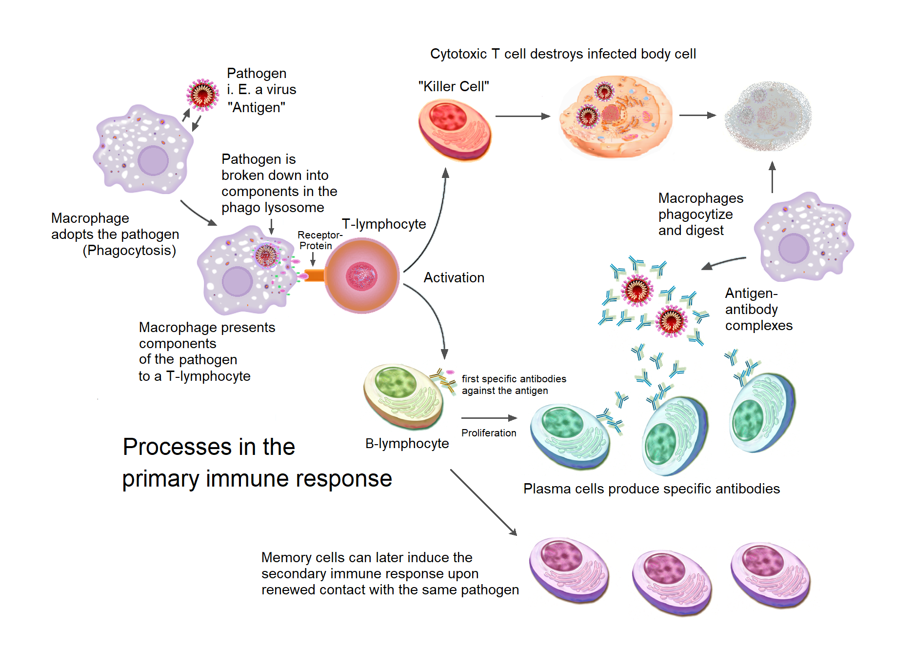
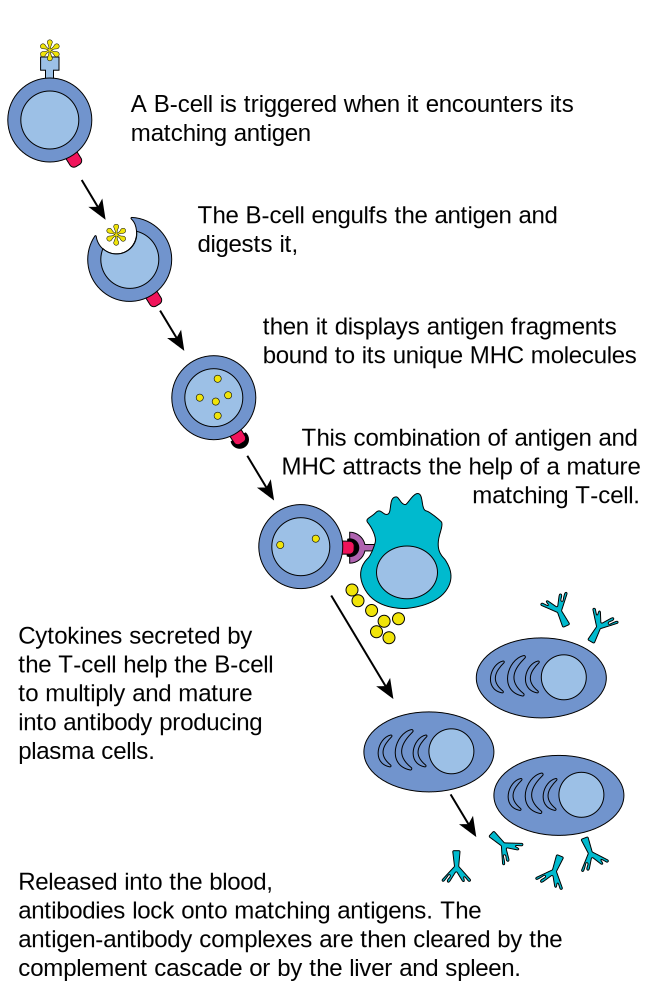
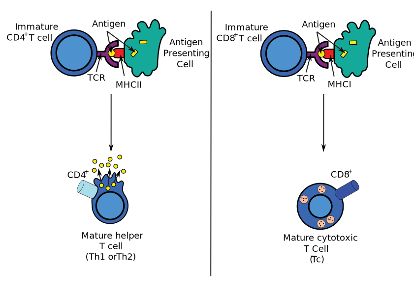

# The Adaptive Immune System And Immunization

The adaptive immune system, also referred as the acquired immune system, is a subsystem of the immune system that is composed of specialized, systemic cells and processes that eliminate pathogens or prevent their growth. The acquired immune system is one of the two main immunity strategies found in vertebrates (the other being the innate immune system).

Like the innate system, the adaptive immune system includes both humoral immunity components and cell-mediated immunity components and destroys invading pathogens. Unlike the innate immune system, which is pre-programmed to react to common broad categories of pathogen, the adaptive immune system is highly specific to each particular pathogen the body has encountered.

Adaptive immunity creates immunological memory after an initial response to a specific pathogen, and leads to an enhanced response to future encounters with that pathogen. Antibodies are a critical part of the adaptive immune system. Adaptive immunity can provide long-lasting protection, sometimes for the person's entire lifetime. For example, someone who recovers from measles is now protected against measles for their lifetime; in other cases it does not provide lifetime protection, as with chickenpox. This process of adaptive immunity is the basis of vaccination.

The cells that carry out the adaptive immune response are white blood cells known as lymphocytes. B cells and T cells, two different types of lymphocytes, carry out the main activities: antibody responses, and cell-mediated immune response. In antibody responses, B cells are activated to secrete antibodies, which are proteins also known as immunoglobulins. Antibodies travel through the bloodstream and bind to the foreign antigen causing it to inactivate, which does not allow the antigen to bind to the host. Antigens are any substances that elicit the adaptive immune response. Sometimes the adaptive system is unable to distinguish harmful from harmless foreign molecules; the effects of this may be hayfever, asthma, or any other allergy.

(ref:imres) [Overview of the processes involved in the primary immune response](https://commons.wikimedia.org/wiki/File:Primary_immune_response_1.png)

(\#fig:immuneresponse)(ref:imres)

In adaptive immunity, pathogen-specific receptors are "acquired" during the lifetime of the organism (whereas in innate immunity pathogen-specific receptors are already encoded in the genome). This acquired response is called "adaptive" because it prepares the body's immune system for future challenges (though it can actually also be maladaptive when it results in allergies or autoimmunity).

The system is highly adaptable because of two factors. First, somatic hypermutation is a process of accelerated random genetic mutations in the antibody-coding genes, which allows antibodies with novel specificity to be created. Second, V(D)J recombination randomly selects one variable (V), one diversity (D), and one joining (J) region for genetic recombination and discards the rest, which produces a highly unique combination of antigen-receptor gene segments in each lymphocyte. This mechanism allows a small number of genetic segments to generate a vast number of different antigen receptors, which are then uniquely expressed on each individual lymphocyte. Since the gene rearrangement leads to an irreversible change in the DNA of each cell, all progeny (offspring) of that cell inherit genes that encode the same receptor specificity, including the memory B cells and memory T cells that are the keys to long-lived specific immunity.

The term "adaptive" was first used by Robert Good in reference to antibody responses in frogs as a synonym for "acquired immune response" in 1964. Good acknowledged he used the terms as synonyms but explained only that he preferred to use the term "adaptive". He might have been thinking of the then not implausible theory of antibody formation in which antibodies were plastic and could adapt themselves to the molecular shape of antigens, and/or to the concept of "adaptive enzymes" as described by Monod in bacteria, that is, enzymes whose expression could be induced by their substrates. The phrase was used almost exclusively by Good and his students and a few other immunologists working with marginal organisms until the 1990s when it became widely used in tandem with the term "innate immunity" which became a popular subject after the discovery of the Toll receptor system in Drosophila, a previously marginal organism for the study of immunology. The term "adaptive" as used in immunology is problematic as acquired immune responses can be both adaptive and maladaptive in the physiological sense. Indeed, both acquired and innate immune responses can be both adaptive and maladaptive in the evolutionary sense. Most textbooks today, following the early use by Janeway, use "adaptive" almost exclusively and noting in glossaries that the term is synonymous with "acquired".

The classic sense of "acquired immunity" came to mean, since Tonegawa's discovery, "antigen-specific immunity mediated by somatic gene rearrangements that create clone-defining antigen receptors". In the last decade, the term "adaptive" has been increasingly applied to another class of immune response not so-far associated with somatic gene rearrangements. These include expansion of natural killer (NK) cells with so-far unexplained specificity for antigens, expansion of NK cells expressing germ-line encoded receptors, and activation of other innate immune cells to an activated state that confers a short-term "immune memory". In this sense, "adaptive immunity" more closely resembles the concept of "activated state" or "heterostasis", thus returning in sense to the physiological sense of "adaptation" to environmental changes.

 Acquired immunity is triggered in vertebrates when a pathogen evades the innate immune system and (1) generates a threshold level of antigen and (2) generates "stranger" or "danger" signals activating dendritic cells.

The major functions of the acquired immune system include:

* Recognition of specific "non-self" antigens in the presence of "self", during the process of antigen presentation.
* Generation of responses that are tailored to maximally eliminate specific pathogens or pathogen-infected cells.
* Development of immunological memory, in which pathogens are "remembered" through memory B cells and memory T cells.

In humans, it takes 4-7 days for the adaptive immune system to mount a significant response.

## Humoral immunity

Humoral immunity is the aspect of immunity that is mediated by macromolecules found in extracellular fluids such as secreted antibodies, complement proteins, and certain antimicrobial peptides. Humoral immunity is named so because it involves substances found in the humors, or body fluids. It contrasts with cell-mediated immunity. Humoral immunity is also referred to as antibody-mediated immunity.

The study of the molecular and cellular components that form the immune system, including their function and interaction, is the central science of immunology. The immune system is divided into a more primitive innate immune system and an acquired or adaptive immune system of vertebrates, each of which contain both humoral and cellular immune elements.

Humoral immunity refers to antibody production and the coinciding processes that accompany it, including: Th2 activation and cytokine production, germinal center formation and isotype switching, and affinity maturation and memory cell generation. It also refers to the effector functions of antibodies, which include pathogen and toxin neutralization, classical complement activation, and opsonin promotion of phagocytosis and pathogen elimination.

The concept of humoral immunity developed based on the analysis of antibacterial activity of the serum components. Hans Buchner is credited with the development of the humoral theory. In 1890, Buchner described alexins as "protective substances" that exist in the blood serum and other bodily fluids and are capable of killing microorganisms. Alexins, later redefined as "complements" by Paul Ehrlich, were shown to be the soluble components of the innate response that leads to a combination of cellular and humoral immunity. This discovery helped to bridge the features of innate and acquired immunity.

Following the 1888 discovery of the bacteria that cause diphtheria and tetanus, Emil von Behring and Kitasato Shibasaburō showed that disease need not be caused by microorganisms themselves. They discovered that cell-free filtrates were sufficient to cause disease. In 1890, filtrates of diphtheria, later named diphtheria toxins, were used to vaccinate animals in an attempt to demonstrate that immunized serum contained an antitoxin that could neutralize the activity of the toxin and could transfer immunity to non-immune animals. In 1897, Paul Ehrlich showed that antibodies form against the plant toxins ricin and abrin, and proposed that these antibodies are responsible for immunity. Ehrlich, with his colleague von Behring, went on to develop the diphtheria antitoxin, which became the first major success of modern immunotherapy. The discovery of specified compatible antibodies became a major tool in the standardization of immunity and the identification of lingering infections.

## Antibodies

Immunoglobulins are glycoproteins in the immunoglobulin superfamily that function as antibodies. The terms antibody and immunoglobulin are often used interchangeably. They are found in the blood and tissue fluids, as well as many secretions. In structure, they are large Y-shaped globular proteins. In mammals there are five types of antibody: IgA, IgD, IgE, IgG, and IgM. Each immunoglobulin class differs in its biological properties and has evolved to deal with different antigens. Antibodies are synthesized and secreted by plasma cells that are derived from the B cells of the immune system.

(ref:antibo) [An antibody](https://commons.wikimedia.org/wiki/File:Antibody_chains.svg) is made up of two heavy chains and two light chains. The variable region, which differs from one antibody to the next, allows an antibody to recognize its matching antigen.

(\#fig:antibody)(ref:antibo)

An antibody is used by the acquired immune system to identify and neutralize foreign objects like bacteria and viruses. Each antibody recognizes a specific antigen unique to its target. By binding their specific antigens, antibodies can cause agglutination and precipitation of antibody-antigen products, prime for phagocytosis by macrophages and other cells, block viral receptors, and stimulate other immune responses, such as the complement pathway.

An incompatible blood transfusion causes a transfusion reaction, which is mediated by the humoral immune response. This type of reaction, called an acute hemolytic reaction, results in the rapid destruction (hemolysis) of the donor red blood cells by host antibodies. The cause is usually a clerical error, such as the wrong unit of blood being given to the wrong patient. The symptoms are fever and chills, sometimes with back pain and pink or red urine (hemoglobinuria). The major complication is that hemoglobin released by the destruction of red blood cells can cause acute kidney failure.

### Antibody production

In humoral immune response, the B cells first mature in the bone marrow and gain B-cell receptors (BCR's) which are displayed in large numbers on the cell surface.

These membrane-bound protein complexes have antibodies which are specific for antigen detection. Each B cell has a unique antibody that binds with an antigen. The mature B cells then migrate from the bone marrow to the lymph nodes or other lymphatic organs, where they begin to encounter pathogens.

### B cell activation

When a B cell encounters an antigen, the antigen binds to the receptor and is taken inside the B cell by endocytosis. The antigen is processed and presented on the B cell's surface again by MHC-II proteins.

### B cell proliferation

The B cell waits for a helper T cell (TH) to bind to the complex. This binding will activate the TH cell, which then releases cytokines that induce B cells to divide rapidly, making thousands of identical clones of the B cell. These daughter cells either become plasma cells or memory cells. The memory B cells remain inactive here; later, when these memory B cells encounter the same antigen due to reinfection, they divide and form plasma cells. On the other hand, the plasma cells produce a large number of antibodies which are released freely into the circulatory system.

(ref:bcellac) [The B lymphocyte activation pathway.](https://commons.wikimedia.org/wiki/File:B_cell_activation.svg) When a B cell encounters its triggering antigen, it gives rise to many large cells known as plasma cells. Every plasma cell is essentially a factory for producing an antibody. Each of the plasma cells descended from a given B cell manufactures millions of identical antibody molecules and pours them into the bloodstream.

(\#fig:bcellactivation)(ref:bcellac)

### Antibody-antigen reaction

These antibodies will encounter antigens and bind with them. This will either interfere with the chemical interaction between host and foreign cells, or they may form bridges between their antigenic sites hindering their proper functioning. Their presence might also attract macrophages or killer cells to attack and phagocytose them.

## Cell-mediated immunity

Cellular immunity protects the body through:

* T-cell mediated immunity or T-cell immunity: activating antigen-specific cytotoxic T cells that are able to induce apoptosis in body cells displaying epitopes of foreign antigen on their surface, such as virus-infected cells, cells with intracellular bacteria, and cancer cells displaying tumor antigens;
* Macrophage and natural killer cell action: enabling the destruction of pathogens via recognition and secretion of cytotoxic granules (for natural killer cells) and phagocytosis (for macrophages); and
* Stimulating cells to secrete a variety of cytokines that influence the function of other cells involved in adaptive immune responses and innate immune responses.
* Cell-mediated immunity is directed primarily at microbes that survive in phagocytes and microbes that infect non-phagocytic cells. It is most effective in removing virus-infected cells, but also participates in defending against fungi, protozoans, cancers, and intracellular bacteria. It also plays a major role in transplant rejection.

Type 1 immunity is directed primarily at viruses, bacteria, and protozoa and is responsible for activating macrophages, turning them into potent effector cells. This is achieved by the secretion of interferon gamma and TNF.:

## Lymphocytes

T and B lymphocytes are the cells of the adaptive immune system. The human body has about 2 trillion lymphocytes, which are 20–40% of white blood cells; their total mass is about the same as the brain or liver. The peripheral bloodstream contains only 2% of all circulating lymphocytes; the other 98% move within tissues and the lymphatic system, which includes the lymph nodes and spleen. In humans, approximately 1–2% of the lymphocyte pool recirculates each hour to increase the opportunity for the cells to encounter the specific pathogen and antigen that they react to.

B cells and T cells are derived from the same multipotent hematopoietic stem cells, and look identical to one another until after they are activated. B cells play a large role in the humoral immune response, whereas T cells are intimately involved in cell-mediated immune responses. In all vertebrates except Agnatha, B cells and T cells are produced by stem cells in the bone marrow. T cell progenitors then migrate from the bone marrow to the thymus, where they develop further.

In an adult animal, the peripheral lymphoid organs contain a mixture of B and T cells in at least three stages of differentiation:

* Naive B and naive T cells, which have left the bone marrow or thymus and entered the lymphatic system, but have yet to encounter their matching antigen
* Effector cells that have been activated by their matching antigen, and are actively involved in eliminating a pathogen
* Memory cells, the survivors of past infections

## Antigen presentation

Acquired immunity relies on the capacity of immune cells to distinguish between the body's own cells and unwanted invaders. The host's cells express "self" antigens. These antigens are different from those on the surface of bacteria or on the surface of virus-infected host cells ("non-self" or "foreign" antigens). The acquired immune response is triggered by recognizing foreign antigen in the cellular context of an activated dendritic cell.

With the exception of non-nucleated cells (including erythrocytes), all cells are capable of presenting antigen through the function of major histocompatibility complex (MHC) molecules. Some cells are specially equipped to present antigen, and to prime naive T cells. Dendritic cells, B-cells, and macrophages are equipped with special "co-stimulatory" ligands recognized by co-stimulatory receptors on T cells, and are termed professional antigen-presenting cells (APCs).

Several T cells subgroups can be activated by professional APCs, and each type of T cell is specially equipped to deal with each unique toxin or microbial pathogen. The type of T cell activated, and the type of response generated, depends, in part, on the context in which the APC first encountered the antigen.

(ref:tcellac) [The T lymphocyte activation pathway](https://commons.wikimedia.org/wiki/File:T_cell_activation.svg) is triggered when a T cell encounters its cognate antigen, coupled to a MHC molecule, on the surface of an infected cell or a phagocyte. T cells contribute to immune defenses in two major ways: some direct and regulate immune responses; others directly attack infected or cancerous cells.

(\#fig:tcellactivation)(ref:tcellac)

## Exogenous antigens

Dendritic cells engulf exogenous pathogens, such as bacteria, parasites or toxins in the tissues and then migrate, via chemotactic signals, to the T cell-enriched lymph nodes. During migration, dendritic cells undergo a process of maturation in which they lose most of their ability to engulf other pathogens, and develop an ability to communicate with T-cells. The dendritic cell uses enzymes to chop the pathogen into smaller pieces, called antigens. In the lymph node, the dendritic cell displays these non-self antigens on its surface by coupling them to a receptor called the major histocompatibility complex, or MHC (also known in humans as human leukocyte antigen (HLA)). This MHC-antigen complex is recognized by T-cells passing through the lymph node. Exogenous antigens are usually displayed on MHC class II molecules, which activate CD4+T helper cells.

## Endogenous antigens

Endogenous antigens are produced by intracellular bacteria and viruses replicating within a host cell. The host cell uses enzymes to digest virally associated proteins and displays these pieces on its surface to T-cells by coupling them to MHC. Endogenous antigens are typically displayed on MHC class I molecules, and activate CD8+ cytotoxic T-cells. With the exception of non-nucleated cells (including erythrocytes), MHC class I is expressed by all host cells.

## T lymphocytes

(ref:antpres) [Antigen presentation](https://commons.wikimedia.org/wiki/File:Antigen_presentation.svg) stimulates T cells to activate "cytotoxic" CD8+ cells or "helper" CD4+ cells. Cytotoxic cells directly attack other cells carrying certain foreign or abnormal molecules on their surfaces. Helper T cells, or Th cells, coordinate immune responses by communicating with other cells. In most cases, T cells only recognize an antigen if it is carried on the surface of a cell by one of the body’s own MHC, or major histocompatibility complex, molecules.()

(\#fig:antigenpresentation)(ref:antpres)

### CD8+ T lymphocytes and cytotoxicity

Cytotoxic T cells (also known as TC, killer T cell, or cytotoxic T-lymphocyte (CTL)) are a sub-group of T cells that induce the death of cells that are infected with viruses (and other pathogens), or are otherwise damaged or dysfunctional.

Naive cytotoxic T cells are activated when their T-cell receptor (TCR) strongly interacts with a peptide-bound MHC class I molecule. This affinity depends on the type and orientation of the antigen/MHC complex, and is what keeps the CTL and infected cell bound together. Once activated, the CTL undergoes a process called clonal selection, in which it gains functions and divides rapidly to produce an army of “armed” effector cells. Activated CTL then travels throughout the body searching for cells that bear that unique MHC Class I + peptide.

When exposed to these infected or dysfunctional somatic cells, effector CTL release perforin and granulysin: cytotoxins that form pores in the target cell's plasma membrane, allowing ions and water to flow into the infected cell, and causing it to burst or lyse. CTL release granzyme, a serine protease encapsulated in a granule that enters cells via pores to induce apoptosis (cell death). To limit extensive tissue damage during an infection, CTL activation is tightly controlled and in general requires a very strong MHC/antigen activation signal, or additional activation signals provided by "helper" T-cells (see below).

On resolution of the infection, most effector cells die and phagocytes clear them away—but a few of these cells remain as memory cells. On a later encounter with the same antigen, these memory cells quickly differentiate into effector cells, dramatically shortening the time required to mount an effective response.

### Helper T-cells

CD4+ lymphocytes, also called "helper" T cells, are immune response mediators, and play an important role in establishing and maximizing the capabilities of the acquired immune response. These cells have no cytotoxic or phagocytic activity; and cannot kill infected cells or clear pathogens, but, in essence "manage" the immune response, by directing other cells to perform these tasks.

Helper T cells express T cell receptors (TCR) that recognize antigen bound to Class II MHC molecules. The activation of a naive helper T-cell causes it to release cytokines, which influences the activity of many cell types, including the APC (Antigen-Presenting Cell) that activated it. Helper T-cells require a much milder activation stimulus than cytotoxic T cells. Helper T cells can provide extra signals that "help" activate cytotoxic cells.

### Th1 And Th2: Helper T Cell Responses

Classically, two types of effector CD4+ T helper cell responses can be induced by a professional APC, designated Th1 and Th2, each designed to eliminate different types of pathogens. The factors that dictate whether an infection triggers a Th1 or Th2 type response are not fully understood, but the response generated does play an important role in the clearance of different pathogens.

The Th1 response is characterized by the production of Interferon-gamma, which activates the bactericidal activities of macrophages, and induces B cells to make opsonizing (marking for phagocytosis) and complement-fixing antibodies, and leads to cell-mediated immunity. In general, Th1 responses are more effective against intracellular pathogens (viruses and bacteria that are inside host cells).

The Th2 response is characterized by the release of Interleukin 5, which induces eosinophils in the clearance of parasites. Th2 also produce Interleukin 4, which facilitates B cell isotype switching. In general, Th2 responses are more effective against extracellular bacteria, parasites including helminths and toxins. Like cytotoxic T cells, most of the CD4+ helper cells die on resolution of infection, with a few remaining as CD4+ memory cells.

Increasingly, there is strong evidence from mouse and human-based scientific studies of a broader diversity in CD4+ effector T helper cell subsets. Regulatory T (Treg) cells, have been identified as important negative regulators of adaptive immunity as they limit and suppress the immune system to control aberrant immune responses to self-antigens; an important mechanism in controlling the development of autoimmune diseases. Follicular helper T (Tfh) cells are another distinct population of effector CD4+ T cells that develop from naive T cells post-antigen activation. Tfh cells are specialized in helping B cell humoral immunity as they are uniquely capable of migrating to follicular B cells in secondary lymphoid organs and provide them positive paracrine signals to enable the generation and recall production of high-quality affinity-matured antibodies. Similar to Tregs, Tfh cells also play a role in immunological tolerance as an abnormal expansion of Tfh cell numbers can lead to unrestricted autoreactive antibody production causing severe systemic autoimmune disorders.

The relevance of CD4+ T helper cells is highlighted during an HIV infection. HIV is able to subvert the immune system by specifically attacking the CD4+ T cells, precisely the cells that could drive the clearance of the virus, but also the cells that drive immunity against all other pathogens encountered during an organism's lifetime.

### Gamma Delta T Cells

Gamma delta T cells (γδ T cells) possess an alternative T cell receptor (TCR) as opposed to CD4+ and CD8+ αβ T cells and share characteristics of helper T cells, cytotoxic T cells and natural killer cells. Like other 'unconventional' T cell subsets bearing invariant TCRs, such as CD1d-restricted natural killer T cells, γδ T cells exhibit characteristics that place them at the border between innate and acquired immunity. On one hand, γδ T cells may be considered a component of adaptive immunity in that they rearrange TCR genes via V(D)J recombination, which also produces junctional diversity, and develop a memory phenotype. On the other hand, however, the various subsets may also be considered part of the innate immune system where a restricted TCR or NK receptors may be used as a pattern recognition receptor. For example, according to this paradigm, large numbers of Vγ9/Vδ2 T cells respond within hours to common molecules produced by microbes, and highly restricted intraepithelial Vδ1 T cells respond to stressed epithelial cells.

## B Lymphocytes And Antibody Production

B Cells are the major cells involved in the creation of antibodies that circulate in blood plasma and lymph, known as humoral immunity. Antibodies (also known as immunoglobulin, Ig), are large Y-shaped proteins used by the immune system to identify and neutralize foreign objects. In mammals, there are five types of antibody: IgA, IgD, IgE, IgG, and IgM, differing in biological properties; each has evolved to handle different kinds of antigens. Upon activation, B cells produce antibodies, each of which recognize a unique antigen, and neutralizing specific pathogens.

Antigen and antibody binding would cause five different protective mechanisms:

* Agglutination: Reduces number of infectious units to be dealt with
* Activation of complement: Cause inflammation and cell lysis
* Opsonization: Coating antigen with antibody enhances phagocytosis
* Antibody-dependent cell-mediated cytotoxicity: Antibodies attached to target cell cause destruction by macrophages, eosinophils, and NK cells
* Neutralization: Blocks adhesion of bacteria and viruses to mucosa

Like the T cell, B cells express a unique B cell receptor (BCR), in this case, a membrane-bound antibody molecule. All the BCR of any one clone of B cells recognizes and binds to only one particular antigen. A critical difference between B cells and T cells is how each cell "sees" an antigen. T cells recognize their cognate antigen in a processed form – as a peptide in the context of an MHC molecule, whereas B cells recognize antigens in their native form. Once a B cell encounters its cognate (or specific) antigen (and receives additional signals from a helper T cell (predominately Th2 type)), it further differentiates into an effector cell, known as a plasma cell.

Plasma cells are short-lived cells (2–3 days) that secrete antibodies. These antibodies bind to antigens, making them easier targets for phagocytes, and trigger the complement cascade. About 10% of plasma cells survive to become long-lived antigen-specific memory B cells. Already primed to produce specific antibodies, these cells can be called upon to respond quickly if the same pathogen re-infects the host, while the host experiences few, if any, symptoms.

## Immunological Memory

When B cells and T cells are activated some become memory B cells and some memory T cells. Throughout the lifetime of an animal these memory cells form a database of effective B and T lymphocytes. Upon interaction with a previously encountered antigen, the appropriate memory cells are selected and activated. In this manner, the second and subsequent exposures to an antigen produce a stronger and faster immune response. This is "adaptive" in the sense that the body's immune system prepares itself for future challenges, but is "maladaptive" of course if the receptors are autoimmune. Immunological memory can be in the form of either passive short-term memory or active long-term memory.

### Passive Memory
Passive memory is usually short-term, lasting between a few days and several months. Newborn infants have had no prior exposure to microbes and are particularly vulnerable to infection. Several layers of passive protection are provided by the mother. In utero, maternal IgG is transported directly across the placenta, so that, at birth, human babies have high levels of antibodies, with the same range of antigen specificities as their mother. Breast milk contains antibodies (mainly IgA) that are transferred to the gut of the infant, protecting against bacterial infections, until the newborn can synthesize its own antibodies.

This is passive immunity because the fetus does not actually make any memory cells or antibodies: It only borrows them. Short-term passive immunity can also be transferred artificially from one individual to another via antibody-rich serum.

### Active Memory

In general, active immunity is long-term and can be acquired by infection followed by B cell and T cell activation, or artificially acquired by vaccines, in a process called immunization.

Historically, infectious disease has been the leading cause of death in the human population. Over the last century, two important factors have been developed to combat their spread: sanitation and immunization. Immunization (commonly referred to as vaccination) is the deliberate induction of an immune response, and represents the single most effective manipulation of the immune system that scientists have developed. Immunizations are successful because they utilize the immune system's natural specificity as well as its inducibility.

The principle behind immunization is to introduce an antigen, derived from a disease-causing organism, that stimulates the immune system to develop protective immunity against that organism, but that does not itself cause the pathogenic effects of that organism. An antigen (short for antibody generator), is defined as any substance that binds to a specific antibody and elicits an adaptive immune response.

Most viral vaccines are based on live attenuated viruses, whereas many bacterial vaccines are based on acellular components of microorganisms, including harmless toxin components. Many antigens derived from acellular vaccines do not strongly induce an adaptive response, and most bacterial vaccines require the addition of adjuvants that activate the antigen-presenting cells of the innate immune system to enhance immunogenicity.

### Immunological Diversity

Most large molecules, including virtually all proteins and many polysaccharides, can serve as antigens. The parts of an antigen that interact with an antibody molecule or a lymphocyte receptor, are called epitopes, or antigenic determinants. Most antigens contain a variety of epitopes and can stimulate the production of antibodies, specific T cell responses, or both. A very small proportion (less than 0.01%) of the total lymphocytes are able to bind to a particular antigen, which suggests that only a few cells respond to each antigen.

For the acquired response to "remember" and eliminate a large number of pathogens the immune system must be able to distinguish between many different antigens, and the receptors that recognize antigens must be produced in a huge variety of configurations, in essence one receptor (at least) for each different pathogen that might ever be encountered. Even in the absence of antigen stimulation, a human can produce more than 1 trillion different antibody molecules. Millions of genes would be required to store the genetic information that produces these receptors, but, the entire human genome contains fewer than 25,000 genes.

Myriad receptors are produced through a process known as clonal selection. According to the clonal selection theory, at birth, an animal randomly generates a vast diversity of lymphocytes (each bearing a unique antigen receptor) from information encoded in a small family of genes. To generate each unique antigen receptor, these genes have undergone a process called V(D)J recombination, or combinatorial diversification, in which one gene segment recombines with other gene segments to form a single unique gene. This assembly process generates the enormous diversity of receptors and antibodies, before the body ever encounters antigens, and enables the immune system to respond to an almost unlimited diversity of antigens. Throughout an animal's lifetime, lymphocytes that can react against the antigens an animal actually encounters are selected for action—directed against anything that expresses that antigen.

Note that the innate and acquired portions of the immune system work together, not in spite of each other. The acquired arm, B, and T cells couldn't function without the innate system input. T cells are useless without antigen-presenting cells to activate them, and B cells are crippled without T cell help. On the other hand, the innate system would likely be overrun with pathogens without the specialized action of the adaptive immune response.

## Immunization

Immunization, or immunisation, is the process by which an individual's immune system becomes fortified against an agent (known as the immunogen).

When this system is exposed to molecules that are foreign to the body, called non-self, it will orchestrate an immune response, and it will also develop the ability to quickly respond to a subsequent encounter because of immunological memory. This is a function of the adaptive immune system. Therefore, by exposing an animal to an immunogen in a controlled way, its body can learn to protect itself: this is called active immunization.

The most important elements of the immune system that are improved by immunization are the T cells, B cells, and the antibodies B cells produce. Memory B cells and memory T cells are responsible for a swift response to a second encounter with a foreign molecule. Passive immunization is direct introduction of these elements into the body, instead of production of these elements by the body itself.

Immunization is done through various techniques, most commonly vaccination. Vaccines against microorganisms that cause diseases can prepare the body's immune system, thus helping to fight or prevent an infection. The fact that mutations can cause cancer cells to produce proteins or other molecules that are known to the body forms the theoretical basis for therapeutic cancer vaccines. Other molecules can be used for immunization as well, for example in experimental vaccines against nicotine (NicVAX) or the hormone ghrelin in experiments to create an obesity vaccine.

Immunizations are often widely stated as less risky and an easier way to become immune to a particular disease than risking a milder form of the disease itself. They are important for both adults and children in that they can protect us from the many diseases out there. Immunization not only protects children against deadly diseases but also helps in developing children's immune systems. Through the use of immunizations, some infections and diseases have almost completely been eradicated throughout the United States and the World. One example is polio. Thanks to dedicated health care professionals and the parents of children who vaccinated on schedule, polio has been eliminated in the U.S. since 1979. Polio is still found in other parts of the world so certain people could still be at risk of getting it. This includes those people who have never had the vaccine, those who didn't receive all doses of the vaccine, or those traveling to areas of the world where polio is still prevalent.

Active immunization/vaccination has been named one of the "Ten Great Public Health Achievements in the 20th Century".

Before the introduction of vaccines, people could only become immune to an infectious disease by contracting the disease and surviving it. Smallpox (variola) was prevented in this way by inoculation, which produced a milder effect than the natural disease. The first clear reference to smallpox inoculation was made by the Chinese author Wan Quan (1499–1582) in his Douzhen xinfa (痘疹心法) published in 1549. In China, powdered smallpox scabs were blown up the noses of the healthy. The patients would then develop a mild case of the disease and from then on were immune to it. The technique did have a 0.5–2.0% mortality rate, but that was considerably less than the 20–30% mortality rate of the disease itself. Two reports on the Chinese practice of inoculation were received by the Royal Society in London in 1700; one by Dr. Martin Lister who received a report by an employee of the East India Company stationed in China and another by Clopton Havers. According to Voltaire (1742), the Turks derived their use of inoculation from neighbouring Circassia. Voltaire does not speculate on where the Circassians derived their technique from, though he reports that the Chinese have practiced it "these hundred years". It was introduced into England from Turkey by Lady Mary Wortley Montagu in 1721 and used by Zabdiel Boylston in Boston the same year. In 1798 Edward Jenner introduced inoculation with cowpox (smallpox vaccine), a much safer procedure. This procedure, referred to as vaccination, gradually replaced smallpox inoculation, now called variolation to distinguish it from vaccination. Until the 1880s vaccine/vaccination referred only to smallpox, but Louis Pasteur developed immunization methods for chicken cholera and anthrax in animals and for human rabies, and suggested that the terms vaccine/vaccination should be extended to cover the new procedures. This can cause confusion if care is not taken to specify which vaccine is used e.g. measles vaccine or influenza vaccine.

Immunization can be achieved in an active or passive manner: vaccination is an active form of immunization.

Active immunization

Active immunization can occur naturally when a person comes in contact with, for example, a microbe. The immune system will eventually create antibodies and other defenses against the microbe. The next time, the immune response against this microbe can be very efficient; this is the case in many of the childhood infections that a person only contracts once, but then is immune.

Artificial active immunization is where the microbe, or parts of it, are injected into the person before they are able to take it in naturally. If whole microbes are used, they are pre-treated.

The importance of immunization is so great that the American Centers for Disease Control and Prevention has named it one of the "Ten Great Public Health Achievements in the 20th Century". Live attenuated vaccines have decreased pathogenicity. Their effectiveness depends on the immune systems ability to replicate and elicits a response similar to natural infection. It is usually effective with a single dose. Examples of live, attenuated vaccines include measles, mumps, rubella, MMR, yellow fever, varicella, rotavirus, and influenza (LAIV).

Passive immunization

Passive immunization is where pre-synthesized elements of the immune system are transferred to a person so that the body does not need to produce these elements itself. Currently, antibodies can be used for passive immunization. This method of immunization begins to work very quickly, but it is short lasting, because the antibodies are naturally broken down, and if there are no B cells to produce more antibodies, they will disappear.

Passive immunization occurs physiologically, when antibodies are transferred from mother to fetus during pregnancy, to protect the fetus before and shortly after birth.

Artificial passive immunization is normally administered by injection and is used if there has been a recent outbreak of a particular disease or as an emergency treatment for toxicity, as in for tetanus. The antibodies can be produced in animals, called "serum therapy," although there is a high chance of anaphylactic shock because of immunity against animal serum itself. Thus, humanized antibodies produced in vitro by cell culture are used instead if available.

## Vaccination

Vaccination is the administration of a vaccine to help the immune system develop protection from a disease. Vaccines contain a microorganism or virus in a weakened, live or killed state, or proteins or toxins from the organism. In stimulating the body's adaptive immunity, they help prevent sickness from an infectious disease. When a sufficiently large percentage of a population has been vaccinated, herd immunity results. Herd immunity protects those who may be immunocompromised and cannot get a vaccine because even a weakened version would harm them. The effectiveness of vaccination has been widely studied and verified. Vaccination is the most effective method of preventing infectious diseases; widespread immunity due to vaccination is largely responsible for the worldwide eradication of smallpox and the elimination of diseases such as polio and tetanus from much of the world. However, some diseases, such as measles outbreaks in America, have seen rising cases due to relatively low vaccination rates in the 2010s – attributed, in part, to vaccine hesitancy.

The first disease people tried to prevent by inoculation was most likely smallpox, with the first recorded use of variolation occurring in the 16th century in China. It was also the first disease for which a vaccine was produced. Although at least six people had used the same principles years earlier, the smallpox vaccine was invented in 1796 by English physician Edward Jenner. He was the first to publish evidence that it was effective and to provide advice on its production. Louis Pasteur furthered the concept through his work in microbiology. The immunization was called vaccination because it was derived from a virus affecting cows (Latin: vacca 'cow'). Smallpox was a contagious and deadly disease, causing the deaths of 20–60% of infected adults and over 80% of infected children. When smallpox was finally eradicated in 1979, it had already killed an estimated 300–500 million people in the 20th century.

Vaccination and immunization have a similar meaning in everyday language. This is distinct from inoculation, which uses unweakened live pathogens. Vaccination efforts have been met with some reluctance on scientific, ethical, political, medical safety, and religious grounds, although no major religions oppose vaccination, and some consider it an obligation due to the potential to save lives. In the United States, people may receive compensation for alleged injuries under the National Vaccine Injury Compensation Program. Early success brought widespread acceptance, and mass vaccination campaigns have greatly reduced the incidence of many diseases in numerous geographic regions.

## Vaccine

A vaccine is a biological preparation that provides active acquired immunity to a particular infectious disease. A vaccine typically contains an agent that resembles a disease-causing microorganism and is often made from weakened or killed forms of the microbe, its toxins, or one of its surface proteins. The agent stimulates the body's immune system to recognize the agent as a threat, destroy it, and to further recognize and destroy any of the microorganisms associated with that agent that it may encounter in the future. Vaccines can be prophylactic (to prevent or ameliorate the effects of a future infection by a natural or "wild" pathogen), or therapeutic (to fight a disease that has already occurred, such as cancer). Some vaccines offer full sterlizing immunity, in which infection is prevented completely.

The administration of vaccines is called vaccination. Vaccination is the most effective method of preventing infectious diseases; widespread immunity due to vaccination is largely responsible for the worldwide eradication of smallpox and the restriction of diseases such as polio, measles, and tetanus from much of the world. The effectiveness of vaccination has been widely studied and verified; for example, vaccines that have proven effective include the influenza vaccine, the HPV vaccine, and the chicken pox vaccine. The World Health Organization (WHO) reports that licensed vaccines are currently available for twenty-five different preventable infections.

The terms vaccine and vaccination are derived from Variolae vaccinae (smallpox of the cow), the term devised by Edward Jenner (who both developed the concept of vaccines and created the first vaccine) to denote cowpox. He used the phrase in 1798 for the long title of his Inquiry into the Variolae vaccinae Known as the Cow Pox, in which he described the protective effect of cowpox against smallpox. In 1881, to honor Jenner, Louis Pasteur proposed that the terms should be extended to cover the new protective inoculations then being developed. The science of vaccine development and production is termed vaccinology.

There is overwhelming scientific consensus that vaccines are a very safe and effective way to fight and eradicate infectious diseases. The immune system recognizes vaccine agents as foreign, destroys them, and "remembers" them. When the virulent version of an agent is encountered, the body recognizes the protein coat on the virus, and thus is prepared to respond, by first neutralizing the target agent before it can enter cells, and secondly by recognizing and destroying infected cells before that agent can multiply to vast numbers.

(ref:vacc) [The evolution of three infectious diseases (smallpox, polio and measles) over several decades. You see the data before and after the first vaccination became available.](https://commons.wikimedia.org/wiki/File:Vaccination-introduction-and-cases-or-deaths-scaled.jpg)

(\#fig:Vaccination)(ref:vacc)

Limitations to their effectiveness, nevertheless, exist. Sometimes, protection fails because of vaccine-related failure such as failures in vaccine attenuation, vaccination regimes or administration or host-related failure due to host's immune system simply does not respond adequately or at all. Lack of response commonly results from genetics, immune status, age, health or nutritional status. It also might fail for genetic reasons if the host's immune system includes no strains of B cells that can generate antibodies suited to reacting effectively and binding to the antigens associated with the pathogen.

Even if the host does develop antibodies, protection might not be adequate; immunity might develop too slowly to be effective in time, the antibodies might not disable the pathogen completely, or there might be multiple strains of the pathogen, not all of which are equally susceptible to the immune reaction. However, even a partial, late, or weak immunity, such as a one resulting from cross-immunity to a strain other than the target strain, may mitigate an infection, resulting in a lower mortality rate, lower morbidity, and faster recovery.

Adjuvants commonly are used to boost immune response, particularly for older people whose immune response to a simple vaccine may have weakened.

The efficacy or performance of the vaccine is dependent on several factors:

* the disease itself (for some diseases vaccination performs better than for others)
* the strain of vaccine (some vaccines are specific to, or at least most effective against, particular strains of the disease)
* whether the vaccination schedule has been properly observed.
* idiosyncratic response to vaccination; some individuals are "non-responders" to certain vaccines, meaning that they do not generate antibodies even after being vaccinated correctly.
* assorted factors such as ethnicity, age, or genetic predisposition.

If a vaccinated individual does develop the disease vaccinated against (breakthrough infection), the disease is likely to be less virulent than in unvaccinated victims.

Important considerations in an effective vaccination program:

1.) careful modeling to anticipate the effect that an immunization campaign will have on the epidemiology of the disease in the medium to long term
1.) ongoing surveillance for the relevant disease following introduction of a new vaccine
1.) maintenance of high immunization rates, even when a disease has become rare

In 1958, there were 763,094 cases of measles in the United States; 552 deaths resulted. After the introduction of new vaccines, the number of cases dropped to fewer than 150 per year (median of 56). In early 2008, there were 64 suspected cases of measles. Fifty-four of those infections were associated with importation from another country, although only thirteen percent were actually acquired outside the United States; 63 of the 64 individuals either had never been vaccinated against measles or were uncertain whether they had been vaccinated.

Vaccines led to the eradication of smallpox, one of the most contagious and deadly diseases in humans. Other diseases such as rubella, polio, measles, mumps, chickenpox, and typhoid are nowhere near as common as they were a hundred years ago thanks to widespread vaccination programs. As long as the vast majority of people are vaccinated, it is much more difficult for an outbreak of disease to occur, let alone spread. This effect is called herd immunity. Polio, which is transmitted only among humans, is targeted by an extensive eradication campaign that has seen endemic polio restricted to only parts of three countries (Afghanistan, Nigeria, and Pakistan). However, the difficulty of reaching all children as well as cultural misunderstandings have caused the anticipated eradication date to be missed several times.

Vaccines also help prevent the development of antibiotic resistance. For example, by greatly reducing the incidence of pneumonia caused by Streptococcus pneumoniae, vaccine programs have greatly reduced the prevalence of infections resistant to penicillin or other first-line antibiotics.

The measles vaccine is estimated to prevent a million deaths every year.

### Adverse Effects

Vaccinations given to children, adolescents, or adults are generally safe. Adverse effects, if any, are generally mild. The rate of side effects depends on the vaccine in question. Some common side effects include fever, pain around the injection site, and muscle aches. Additionally, some individuals may be allergic to ingredients in the vaccine. MMR vaccine is rarely associated with febrile seizures.

Host-("vaccinee")-related determinants that render a person susceptible to infection, such as genetics, health status (underlying disease, nutrition, pregnancy, sensitivities or allergies), immune competence, age, and economic impact or cultural environment can be primary or secondary factors affecting the severity of infection and response to a vaccine. Elderly (above age 60), allergen-hypersensitive, and obese people have susceptibility to compromised immunogenicity, which prevents or inhibits vaccine effectiveness, possibly requiring separate vaccine technologies for these specific populations or repetitive booster vaccinations to limit virus transmission.

Severe side effects are extremely rare. Varicella vaccine is rarely associated with complications in immunodeficient individuals, and rotavirus vaccines are moderately associated with intussusception.

At least 19 countries have no-fault compensation programs to provide compensation for those suffering severe adverse effects of vaccination. The United States’ program is known as the National Childhood Vaccine Injury Act, and the United Kingdom employs the Vaccine Damage Payment.

### Types Of Vaccines

Vaccines typically contain dead or inactivated organisms or purified products derived from them.

There are several types of vaccines in use. These represent different strategies used to try to reduce the risk of illness while retaining the ability to induce a beneficial immune response.

**Attenuated**

Some vaccines contain live, attenuated microorganisms. Many of these are active viruses that have been cultivated under conditions that disable their virulent properties, or that use closely related but less dangerous organisms to produce a broad immune response. Although most attenuated vaccines are viral, some are bacterial in nature. Examples include the viral diseases yellow fever, measles, mumps, and rubella, and the bacterial disease typhoid. The live Mycobacterium tuberculosis vaccine developed by Calmette and Guérin is not made of a contagious strain but contains a virulently modified strain called "BCG" used to elicit an immune response to the vaccine. The live attenuated vaccine containing strain Yersinia pestis EV is used for plague immunization. Attenuated vaccines have some advantages and disadvantages. Attenuated, or live, weakened, vaccines typically provoke more durable immunological responses. But they may not be safe for use in immunocompromised individuals, and on rare occasions mutate to a virulent form and cause disease.

**Inactivated**

Some vaccines contain inactivated, but previously virulent, micro-organisms that have been destroyed with chemicals, heat, or radiation – "ghosts", with intact but empty bacterial cell envelopes. They are considered an intermediate phase between the inactivated and attenuated vaccines. Examples include IPV (polio vaccine), hepatitis A vaccine, rabies vaccine and most influenza vaccines.

**Toxoid**

Toxoid vaccines are made from inactivated toxic compounds that cause illness rather than the micro-organism. Examples of toxoid-based vaccines include tetanus and diphtheria. Not all toxoids are for micro-organisms; for example, Crotalus atrox toxoid is used to vaccinate dogs against rattlesnake bites.

**Subunit**

Rather than introducing an inactivated or attenuated micro-organism to an immune system (which would constitute a "whole-agent" vaccine), a subunit vaccine uses a fragment of it to create an immune response. One example is the subunit vaccine against hepatitis B, which is composed of only the surface proteins of the virus (previously extracted from the blood serum of chronically infected patients but now produced by recombination of the viral genes into yeast). Another example is edible algae vaccines, such as the virus-like particle (VLP) vaccine against human papillomavirus (HPV), which is composed of the viral major capsid protein. Another example is the hemagglutinin and neuraminidase subunits of the influenza virus. A subunit vaccine is being used for plague immunization.

**Conjugate**

Certain bacteria have a polysaccharide outer coat that is poorly immunogenic. By linking these outer coats to proteins (e.g., toxins), the immune system can be led to recognize the polysaccharide as if it were a protein antigen. This approach is used in the Haemophilus influenzae type B vaccine.

**Outer membrane vesicle**

Outer membrane vesicles (OMVs) are naturally immunogenic and can be manipulated to produce potent vaccines. The best known OMV vaccines are those developed for serotype B meningococcal disease.

**Heterotypic**

Heterologous vaccines also known as "Jennerian vaccines", are vaccines that are pathogens of other animals that either do not cause disease or cause mild disease in the organism being treated. The classic example is Jenner's use of cowpox to protect against smallpox. A current example is the use of BCG vaccine made from Mycobacterium bovis to protect against tuberculosis.

Viral vector
Main article: Viral vector vaccine
Viral vector vaccines use a safe virus to insert pathogen genes in the body to produce specific antigens, such as surface proteins, to stimulate an immune response.

**RNA vaccine**

A ribonucleic acid (RNA) vaccine or messenger RNA (mRNA) vaccine is a type of vaccine that uses a copy of a molecule called messenger RNA (mRNA) to produce an immune response. The vaccine transfects molecules of synthetic RNA into immune cells, where the vaccine functions as mRNA, causing the cells to build foreign protein that would normally be produced by a pathogen (such as a virus) or by a cancer cell. These protein molecules stimulate an adaptive immune response which teaches the body to identify and destroy the corresponding pathogen or cancer cells. The mRNA is delivered by a co-formulation of the RNA encapsulated in lipid nanoparticles which protect the RNA strands and help their absorption into the cells.

(ref:rnavac) [An illustration of the mechanism of action of the RNA vaccine.](https://commons.wikimedia.org/wiki/File:RNA_vaccine-en.svg)

(\#fig:rnavaccine)(ref:rnavac)

Reactogenicity, the tendency of a vaccine to produce adverse reactions, is similar to that of conventional non-RNA vaccines. People susceptible to an autoimmune response may have an adverse reaction to RNA vaccines. The advantages of RNA vaccines over traditional protein vaccines are ease of design, speed and lower cost of production, and the induction of both cellular and humoral immunity. RNA vaccines, such as the Pfizer–BioNTech COVID-19 vaccine, have the disadvantage of requiring ultracold storage before distribution; other mRNA vaccines, such as the Moderna, CureVac, and Walvax COVID-19 vaccines, do not require such ultracold storage temperatures.

In RNA therapeutics, mRNA vaccines have attracted considerable interest as COVID-19 vaccines. In December 2020, Pfizer–BioNTech and Moderna obtained approval for their mRNA-based COVID-19 vaccines. On 2 December, the UK's Medicines and Healthcare products Regulatory Agency (MHRA) became the first medicines regulator to approve an mRNA vaccine, authorizing the Pfizer–BioNTech vaccine for widespread use. On 11 December, the US Food and Drug Administration (FDA) issued an emergency use authorization for the Pfizer–BioNTech vaccine and a week later similarly approved the Moderna vaccine.

The goal of a vaccine is to stimulate the adaptive immune system to create antibodies that precisely target that particular pathogen. The markers on the pathogen that the antibodies target are called antigens.

mRNA vaccines operate in a different manner from traditional vaccines. Traditional vaccines stimulate an antibody response by injecting antigens, an attenuated virus (weakened virus), an inactivated virus (dead virus), or a recombinant antigen-encoding viral vector (harmless carrier virus with an antigen transgene) into the body. These antigens and viruses are prepared and grown outside the body.

In contrast, mRNA vaccines introduce a short-lived synthetically created fragment of the RNA sequence of a virus into the vaccinated individual. These mRNA fragments are taken up by dendritic cells – a type of immune system cell – by phagocytosis. The dendritic cells use their internal machinery (ribosomes) to read the mRNA and produce the viral antigens that the mRNA encodes. The body degrades the mRNA fragments within a few days. Although non-immune cells can potentially also absorb vaccine mRNA, produce antigens, and display the antigens on their surfaces, dendritic cells absorb the mRNA globules much more readily.

Once the viral antigens are produced by the host cell, the normal adaptive immune system processes are followed. Antigens are broken down by proteasomes, then class I and class II MHC molecules attach to the antigen and transport it to the cellular membrane, "activating" the dendritic cell. Once the dendritic cells are activated, they migrate to lymph nodes, where the antigen is presented to T cells and B cells. This eventually leads to the production of antibodies that are specifically targeted to the antigen, resulting in immunity.

The benefit of using mRNA to have host cells produce the antigen is that mRNA is far easier for vaccine creators to produce than antigen proteins or attenuated virus. Another benefit is speed of design and production. Moderna designed their mRNA-1273 vaccine for COVID-19 in 2 days. Another advantage of RNA vaccines is that since the antigens are produced inside the cell, they stimulate cellular immunity, as well as humoral immunity.

mRNA vaccines do not affect or reprogram DNA inside the cell. The synthetic mRNA fragment is a copy of the specific part of the viral RNA that carries the instructions to build the antigen of the virus (a protein spike, in the case of the main coronavirus mRNA vaccines), and is not related to human DNA. This misconception was circulated as the COVID-19 mRNA vaccines came to public prominence, and is considered a debunked conspiracy theory.

The mRNA should degrade in the cells after producing the foreign protein. However, because the specific formulation (including the exact composition of the lipid nanoparticle drug delivery coating) is kept confidential by the manufacturers of the mRNA vaccines, details and timings have not been researched yet by third parties.

(ref:child) [Child and adolescent immunization schedule.](https://www.cdc.gov/vaccines/schedules/hcp/imz/child-adolescent.html)

(\#fig:childschedule)(ref:child)

(ref:adult) [Adult immunization schedule.](https://www.cdc.gov/vaccines/schedules/hcp/imz/adult.html)

(\#fig:adultschedule)(ref:adult)

