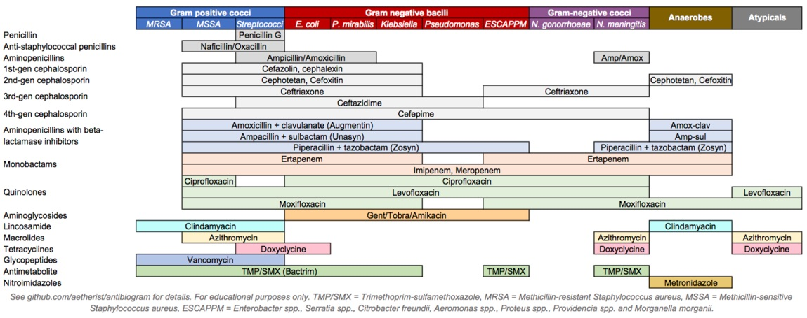

# Drugs, Microbes, And The Host

An antimicrobial is an agent that kills microorganisms or stops their growth. Antimicrobial medicines can be grouped according to the microorganisms they act primarily against. For example, antibiotics are used against bacteria, and antifungals are used against fungi. They can also be classified according to their function. Agents that kill microbes are microbicides, while those that merely inhibit their growth are called bacteriostatic agents. The use of antimicrobial medicines to treat infection is known as antimicrobial chemotherapy, while the use of antimicrobial medicines to prevent infection is known as antimicrobial prophylaxis.

The main classes of antimicrobial agents are disinfectants (non-selective agents, such as bleach), which kill a wide range of microbes on non-living surfaces to prevent the spread of illness, antiseptics (which are applied to living tissue and help reduce infection during surgery), and antibiotics (which destroy microorganisms within the body). The term "antibiotic" originally described only those formulations derived from living microorganisms but is now also applied to synthetic agents, such as sulfonamides or fluoroquinolones. Though the term used to be restricted to antibacterials (and is often used as a synonym for them by medical professionals and in medical literature), its context has broadened to include all antimicrobials. Antibacterial agents can be further subdivided into bactericidal agents, which kill bacteria, and bacteriostatic agents, which slow down or stall bacterial growth. In response, further advancements in antimicrobial technologies have resulted in solutions that can go beyond simply inhibiting microbial growth. Instead, certain types of porous media have been developed to kill microbes on contact.

Antimicrobial use has been common practice for at least 2000 years. Ancient Egyptians and ancient Greeks used specific molds and plant extracts to treat infection.

In the 19th century, microbiologists such as Louis Pasteur and Jules Francois Joubert observed antagonism between some bacteria and discussed the merits of controlling these interactions in medicine. Louis Pasteur's work in fermentation and spontaneous generation led to the distinction between anaerobic and aerobic bacteria. The information garnered by Pasteur led Joseph Lister to incorporate antiseptic methods, such as sterilizing surgical tools and debriding wounds into surgical procedures. The implementation of these antiseptic techniques drastically reduced the number of infections and subsequent deaths associated with surgical procedures. Louis Pasteur's work in microbiology also led to the development of many vaccines for life-threatening diseases such as anthrax and rabies. On September 3, 1928, Alexander Fleming returned from a vacation and discovered that a Petri dish filled with Staphylococcus was separated into colonies due to the antimicrobial fungus Penicillium rubens. Fleming and his associates struggled to isolate the antimicrobial but referenced its therapeutic potential in 1929 in the British Journal of Experimental Pathology. In 1942, Howard Florey, Ernst Chain, and Edward Abraham utilized Fleming's work to purify and extract penicillin for medicinal uses earning them the 1945 Nobel Prize in Medicine.

## Antibacterials

Antibacterials are used to treat bacterial infections. Antibiotics are classified generally as beta-lactams, macrolides, quinolones, tetracyclines or aminoglycosides. Their classification within these categories depends on their antimicrobial spectra, pharmacodynamics, and chemical composition. Prolonged use of certain antibacterials can decrease the number of enteric bacteria, which may have a negative impact on health. Consumption of probiotics and reasonable eating may help to replace destroyed gut flora. Stool transplants may be considered for patients who are having difficulty recovering from prolonged antibiotic treatment, as for recurrent Clostridioides difficile infections.

The discovery, development and use of antibacterials during the 20th century have reduced mortality from bacterial infections. The antibiotic era began with the therapeutic application of sulfonamide drugs in 1936, followed by a "golden" period of discovery from about 1945 to 1970, when a number of structurally diverse and highly effective agents were discovered and developed. Since 1980, the introduction of new antimicrobial agents for clinical use has declined, in part because of the enormous expense of developing and testing new drugs. In parallel, there has been an alarming increase in antimicrobial resistance of bacteria, fungi, parasites and some viruses to multiple existing agents.

Antibacterials are among the most commonly used drugs and among the drugs commonly misused by physicians, for example, in viral respiratory tract infections. As a consequence of widespread and injudicious use of antibacterials, there has been an accelerated emergence of antibiotic-resistant pathogens, resulting in a serious threat to global public health. The resistance problem demands that a renewed effort be made to seek antibacterial agents effective against pathogenic bacteria resistant to current antibacterials. Possible strategies towards this objective include increased sampling from diverse environments and application of metagenomics to identify bioactive compounds produced by currently unknown and uncultured microorganisms as well as the development of small-molecule libraries customized for bacterial targets.

## Antifungals

Antifungals are used to kill or prevent further growth of fungi. In medicine, they are used as a treatment for infections such as athlete's foot, ringworm and thrush and work by exploiting differences between mammalian and fungal cells. Unlike bacteria, both fungi and humans are eukaryotes. Thus, fungal and human cells are similar at the molecular level, making it more difficult to find a target for an antifungal drug to attack that does not also exist in the host organism. Consequently, there are often side effects to some of these drugs. Some of these side effects can be life-threatening if the drug is not used properly.

As well as their use in medicine, antifungals are frequently sought after to control indoor mold in damp or wet home materials. Sodium bicarbonate (baking soda) blasted on to surfaces acts as an antifungal. Another antifungal solution applied after or without blasting by soda is a mix of hydrogen peroxide and a thin surface coating that neutralizes mold and encapsulates the surface to prevent spore release. Some paints are also manufactured with an added antifungal agent for use in high humidity areas such as bathrooms or kitchens. Other antifungal surface treatments typically contain variants of metals known to suppress mold growth e.g. pigments or solutions containing copper, silver or zinc. These solutions are not usually available to the general public because of their toxicity.

## Antivirals

Antiviral drugs are a class of medication used specifically for treating viral infections. Like antibiotics, specific antivirals are used for specific viruses. They should be distinguished from viricides, which actively deactivate virus particles outside the body.

Many antiviral drugs are designed to treat infections by retroviruses, including HIV. Important antiretroviral drugs include the class of protease inhibitors. Herpes viruses, best known for causing cold sores and genital herpes, are usually treated with the nucleoside analogue acyclovir. Viral hepatitis is caused by five unrelated hepatotropic viruses (A-E) and may be treated with antiviral drugs depending on the type of infection. Some influenza A and B viruses have become resistant to neuraminidase inhibitors such as oseltamivir, and the search for new substances continues.

## Antiparasitics

Antiparasitics are a class of medications indicated for the treatment of infectious diseases such as leishmaniasis, malaria and Chagas disease, which are caused by parasites such as nematodes, cestodes, trematodes and infectious protozoa. Antiparasitic medications include metronidazole, iodoquinol and albendazole. Like all therapeutic antimicrobials, they must kill the infecting organism without serious damage to the host.

## Broad-Spectrum Therapeutics

Broad-spectrum therapeutics are active against multiple classes of pathogens. Such therapeutics have been suggested as potential emergency treatments for pandemics. Azithromycin is currently the only identified broad-spectrum therapeutic.

## Antibiotics

An antibiotic is a type of antimicrobial substance active against bacteria. It is the most important type of antibacterial agent for fighting bacterial infections, and antibiotic medications are widely used in the treatment and prevention of such infections. They may either kill or inhibit the growth of bacteria. A limited number of antibiotics also possess antiprotozoal activity. Antibiotics are not effective against viruses such as the common cold or influenza; drugs which inhibit viruses are termed antiviral drugs or antivirals rather than antibiotics.

Sometimes, the term antibiotic—literally "opposing life", from the Greek roots ἀντι anti, "against" and βίος bios, "life"—is broadly used to refer to any substance used against microbes, but in the usual medical usage, antibiotics (such as penicillin) are those produced naturally (by one microorganism fighting another), whereas nonantibiotic antibacterials (such as sulfonamides and antiseptics) are fully synthetic. However, both classes have the same goal of killing or preventing the growth of microorganisms, and both are included in antimicrobial chemotherapy. "Antibacterials" include antiseptic drugs, antibacterial soaps, and chemical disinfectants, whereas antibiotics are an important class of antibacterials used more specifically in medicine and sometimes in livestock feed.

Antibiotics have been used since ancient times. Many civilizations used topical application of mouldy bread, with many references to its beneficial effects arising from ancient Egypt, Nubia, China, Serbia, Greece, and Rome. The first person to directly document the use of molds to treat infections was John Parkinson (1567–1650). Antibiotics revolutionized medicine in the 20th century. Alexander Fleming (1881–1955) discovered modern day penicillin in 1928, the widespread use of which proved significantly beneficial during wartime. However, the effectiveness and easy access to antibiotics have also led to their overuse and some bacteria have evolved resistance to them. The World Health Organization has classified antimicrobial resistance as a widespread "serious threat [that] is no longer a prediction for the future, it is happening right now in every region of the world and has the potential to affect anyone, of any age, in any country".

Antibiotics are used to treat or prevent bacterial infections, and sometimes protozoan infections. (Metronidazole is effective against a number of parasitic diseases). When an infection is suspected of being responsible for an illness but the responsible pathogen has not been identified, an empiric therapy is adopted. This involves the administration of a broad-spectrum antibiotic based on the signs and symptoms presented and is initiated pending laboratory results that can take several days.

When the responsible pathogenic microorganism is already known or has been identified, definitive therapy can be started. This will usually involve the use of a narrow-spectrum antibiotic. The choice of antibiotic given will also be based on its cost. Identification is critically important as it can reduce the cost and toxicity of the antibiotic therapy and also reduce the possibility of the emergence of antimicrobial resistance. To avoid surgery, antibiotics may be given for non-complicated acute appendicitis.

(ref:antib) [Antibiotics coverage diagram.](https://commons.wikimedia.org/wiki/File:Antibiotics_coverage_diagram.jpg)

(\#fig:antibiotics)(ref:antib)

Antibiotics may be given as a preventive measure and this is usually limited to at-risk populations such as those with a weakened immune system (particularly in HIV cases to prevent pneumonia), those taking immunosuppressive drugs, cancer patients, and those having surgery. Their use in surgical procedures is to help prevent infection of incisions. They have an important role in dental antibiotic prophylaxis where their use may prevent bacteremia and consequent infective endocarditis. Antibiotics are also used to prevent infection in cases of neutropenia particularly cancer-related.

Administration
There are many different routes of administration for antibiotic treatment. Antibiotics are usually taken by mouth. In more severe cases, particularly deep-seated systemic infections, antibiotics can be given intravenously or by injection. Where the site of infection is easily accessed, antibiotics may be given topically in the form of eye drops onto the conjunctiva for conjunctivitis or ear drops for ear infections and acute cases of swimmer's ear. Topical use is also one of the treatment options for some skin conditions including acne and cellulitis. Advantages of topical application include achieving high and sustained concentration of antibiotic at the site of infection; reducing the potential for systemic absorption and toxicity, and total volumes of antibiotic required are reduced, thereby also reducing the risk of antibiotic misuse. Topical antibiotics applied over certain types of surgical wounds have been reported to reduce the risk of surgical site infections. However, there are certain general causes for concern with topical administration of antibiotics. Some systemic absorption of the antibiotic may occur; the quantity of antibiotic applied is difficult to accurately dose, and there is also the possibility of local hypersensitivity reactions or contact dermatitis occurring. It is recommended to administer antibiotics as soon as possible, especially in life-threatening infections. Many emergency departments stock antibiotics for this purpose.

Prevalence
Antibiotic consumption varies widely between countries. The WHO report on surveillance of antibiotic consumption’ published in 2018 analysed 2015 data from 65 countries. As measured in defined daily doses per 1,000 inhabitants per day. Mongolia had the highest consumption with a rate of 64.4. Burundi had the lowest at 4.4. Amoxicillin and amoxicillin/clavulanic acid were the most frequently consumed.

### Classes of Antibiotics

Antibiotics are commonly classified based on their mechanism of action, chemical structure, or spectrum of activity. Most target bacterial functions or growth processes. Those that target the bacterial cell wall (penicillins and cephalosporins) or the cell membrane (polymyxins), or interfere with essential bacterial enzymes (rifamycins, lipiarmycins, quinolones, and sulfonamides) have bactericidal activities. Protein synthesis inhibitors (macrolides, lincosamides, and tetracyclines) are usually bacteriostatic (with the exception of bactericidal aminoglycosides). Further categorization is based on their target specificity. "Narrow-spectrum" antibiotics target specific types of bacteria, such as gram-negative or gram-positive, whereas broad-spectrum antibiotics affect a wide range of bacteria. Following a 40-year break in discovering classes of antibacterial compounds, four new classes of antibiotics were introduced to clinical use in the late 2000s and early 2010s: cyclic lipopeptides (such as daptomycin), glycylcyclines (such as tigecycline), oxazolidinones (such as linezolid), and lipiarmycins (such as fidaxomicin).

With advances in medicinal chemistry, most modern antibacterials are semisynthetic modifications of various natural compounds. These include, for example, the beta-lactam antibiotics, which include the penicillins (produced by fungi in the genus Penicillium), the cephalosporins, and the carbapenems. Compounds that are still isolated from living organisms are the aminoglycosides, whereas other antibacterials—for example, the sulfonamides, the quinolones, and the oxazolidinones—are produced solely by chemical synthesis. Many antibacterial compounds are relatively small molecules with a molecular weight of less than 1000 daltons.

Since the first pioneering efforts of Howard Florey and Chain in 1939, the importance of antibiotics, including antibacterials, to medicine has led to intense research into producing antibacterials at large scales. Following screening of antibacterials against a wide range of bacteria, production of the active compounds is carried out using fermentation, usually in strongly aerobic conditions.

The emergence of resistance of bacteria to antibiotics is a common phenomenon. Emergence of resistance often reflects evolutionary processes that take place during antibiotic therapy. The antibiotic treatment may select for bacterial strains with physiologically or genetically enhanced capacity to survive high doses of antibiotics. Under certain conditions, it may result in preferential growth of resistant bacteria, while growth of susceptible bacteria is inhibited by the drug. For example, antibacterial selection for strains having previously acquired antibacterial-resistance genes was demonstrated in 1943 by the Luria–Delbrück experiment. Antibiotics such as penicillin and erythromycin, which used to have a high efficacy against many bacterial species and strains, have become less effective, due to the increased resistance of many bacterial strains.

Resistance may take the form of biodegradation of pharmaceuticals, such as sulfamethazine-degrading soil bacteria introduced to sulfamethazine through medicated pig feces. The survival of bacteria often results from an inheritable resistance, but the growth of resistance to antibacterials also occurs through horizontal gene transfer. Horizontal transfer is more likely to happen in locations of frequent antibiotic use.

Antibacterial resistance may impose a biological cost, thereby reducing fitness of resistant strains, which can limit the spread of antibacterial-resistant bacteria, for example, in the absence of antibacterial compounds. Additional mutations, however, may compensate for this fitness cost and can aid the survival of these bacteria.

Paleontological data show that both antibiotics and antibiotic resistance are ancient compounds and mechanisms. Useful antibiotic targets are those for which mutations negatively impact bacterial reproduction or viability.

Several molecular mechanisms of antibacterial resistance exist. Intrinsic antibacterial resistance may be part of the genetic makeup of bacterial strains. For example, an antibiotic target may be absent from the bacterial genome. Acquired resistance results from a mutation in the bacterial chromosome or the acquisition of extra-chromosomal DNA. Antibacterial-producing bacteria have evolved resistance mechanisms that have been shown to be similar to, and may have been transferred to, antibacterial-resistant strains. The spread of antibacterial resistance often occurs through vertical transmission of mutations during growth and by genetic recombination of DNA by horizontal genetic exchange. For instance, antibacterial resistance genes can be exchanged between different bacterial strains or species via plasmids that carry these resistance genes. Plasmids that carry several different resistance genes can confer resistance to multiple antibacterials. Cross-resistance to several antibacterials may also occur when a resistance mechanism encoded by a single gene conveys resistance to more than one antibacterial compound.

Antibacterial-resistant strains and species, sometimes referred to as "superbugs", now contribute to the emergence of diseases that were for a while well controlled. For example, emergent bacterial strains causing tuberculosis that are resistant to previously effective antibacterial treatments pose many therapeutic challenges. Every year, nearly half a million new cases of multidrug-resistant tuberculosis (MDR-TB) are estimated to occur worldwide. For example, NDM-1 is a newly identified enzyme conveying bacterial resistance to a broad range of beta-lactam antibacterials. The United Kingdom's Health Protection Agency has stated that "most isolates with NDM-1 enzyme are resistant to all standard intravenous antibiotics for treatment of severe infections." On 26 May 2016, an E. coli "superbug" was identified in the United States resistant to colistin, "the last line of defence" antibiotic.

Before the early 20th century, treatments for infections were based primarily on medicinal folklore. Mixtures with antimicrobial properties that were used in treatments of infections were described over 2,000 years ago. Many ancient cultures, including the ancient Egyptians and ancient Greeks, used specially selected mold and plant materials to treat infections. Nubian mummies studied in the 1990s were found to contain significant levels of tetracycline. The beer brewed at that time was conjectured to have been the source.

The use of antibiotics in modern medicine began with the discovery of synthetic antibiotics derived from dyes.

Synthetic antibiotic chemotherapy as a science and development of antibacterials began in Germany with Paul Ehrlich in the late 1880s. Ehrlich noted certain dyes would color human, animal, or bacterial cells, whereas others did not. He then proposed the idea that it might be possible to create chemicals that would act as a selective drug that would bind to and kill bacteria without harming the human host. After screening hundreds of dyes against various organisms, in 1907, he discovered a medicinally useful drug, the first synthetic antibacterial organoarsenic compound salvarsan, now called arsphenamine.

This heralded the era of antibacterial treatment that was begun with the discovery of a series of arsenic-derived synthetic antibiotics by both Alfred Bertheim and Ehrlich in 1907. Ehrlich and Bertheim had experimented with various chemicals derived from dyes to treat trypanosomiasis in mice and spirochaeta infection in rabbits. While their early compounds were too toxic, Ehrlich and Sahachiro Hata, a Japanese bacteriologist working with Erlich in the quest for a drug to treat syphilis, achieved success with the 606th compound in their series of experiments. In 1910 Ehrlich and Hata announced their discovery, which they called drug "606", at the Congress for Internal Medicine at Wiesbaden. The Hoechst company began to market the compound toward the end of 1910 under the name Salvarsan, now known as arsphenamine. The drug was used to treat syphilis in the first half of the 20th century. In 1908, Ehrlich received the Nobel Prize in Physiology or Medicine for his contributions to immunology. Hata was nominated for the Nobel Prize in Chemistry in 1911 and for the Nobel Prize in Physiology or Medicine in 1912 and 1913.

The first sulfonamide and the first systemically active antibacterial drug, Prontosil, was developed by a research team led by Gerhard Domagk in 1932 or 1933 at the Bayer Laboratories of the IG Farben conglomerate in Germany, for which Domagk received the 1939 Nobel Prize in Physiology or Medicine. Sulfanilamide, the active drug of Prontosil, was not patentable as it had already been in use in the dye industry for some years. Prontosil had a relatively broad effect against Gram-positive cocci, but not against enterobacteria. Research was stimulated apace by its success. The discovery and development of this sulfonamide drug opened the era of antibacterials.

Penicillin and other natural antibiotics
Observations about the growth of some microorganisms inhibiting the growth of other microorganisms have been reported since the late 19th century. These observations of antibiosis between microorganisms led to the discovery of natural antibacterials. Louis Pasteur observed, "if we could intervene in the antagonism observed between some bacteria, it would offer perhaps the greatest hopes for therapeutics".

In 1874, physician Sir William Roberts noted that cultures of the mold Penicillium glaucum that is used in the making of some types of blue cheese did not display bacterial contamination. In 1876, physicist John Tyndall also contributed to this field.

In 1895 Vincenzo Tiberio, Italian physician, published a paper on the antibacterial power of some extracts of mold.

In 1897, doctoral student Ernest Duchesne submitted a dissertation, "Contribution à l'étude de la concurrence vitale chez les micro-organismes: antagonisme entre les moisissures et les microbes" (Contribution to the study of vital competition in micro-organisms: antagonism between molds and microbes), the first known scholarly work to consider the therapeutic capabilities of molds resulting from their anti-microbial activity. In his thesis, Duchesne proposed that bacteria and molds engage in a perpetual battle for survival. Duchesne observed that E. coli was eliminated by Penicillium glaucum when they were both grown in the same culture. He also observed that when he inoculated laboratory animals with lethal doses of typhoid bacilli together with Penicillium glaucum, the animals did not contract typhoid. Unfortunately Duchesne's army service after getting his degree prevented him from doing any further research. Duchesne died of tuberculosis, a disease now treated by antibiotics.In 1928, Sir Alexander Fleming postulated the existence of penicillin, a molecule produced by certain molds that kills or stops the growth of certain kinds of bacteria. Fleming was working on a culture of disease-causing bacteria when he noticed the spores of a green mold, Penicillium chrysogenum, in one of his culture plates. He observed that the presence of the mold killed or prevented the growth of the bacteria. Fleming postulated that the mold must secrete an antibacterial substance, which he named penicillin in 1928. Fleming believed that its antibacterial properties could be exploited for chemotherapy. He initially characterized some of its biological properties, and attempted to use a crude preparation to treat some infections, but he was unable to pursue its further development without the aid of trained chemists.

Ernst Chain, Howard Florey and Edward Abraham succeeded in purifying the first penicillin, penicillin G, in 1942, but it did not become widely available outside the Allied military before 1945. Later, Norman Heatley developed the back extraction technique for efficiently purifying penicillin in bulk. The chemical structure of penicillin was first proposed by Abraham in 1942 and then later confirmed by Dorothy Crowfoot Hodgkin in 1945. Purified penicillin displayed potent antibacterial activity against a wide range of bacteria and had low toxicity in humans. Furthermore, its activity was not inhibited by biological constituents such as pus, unlike the synthetic sulfonamides. (see below) The development of penicillin led to renewed interest in the search for antibiotic compounds with similar efficacy and safety. For their successful development of penicillin, which Fleming had accidentally discovered but could not develop himself, as a therapeutic drug, Chain and Florey shared the 1945 Nobel Prize in Medicine with Fleming.

Florey credited Rene Dubos with pioneering the approach of deliberately and systematically searching for antibacterial compounds, which had led to the discovery of gramicidin and had revived Florey's research in penicillin. In 1939, coinciding with the start of World War II, Dubos had reported the discovery of the first naturally derived antibiotic, tyrothricin, a compound of 20% gramicidin and 80% tyrocidine, from Bacillus brevis. It was one of the first commercially manufactured antibiotics and was very effective in treating wounds and ulcers during World War II. Gramicidin, however, could not be used systemically because of toxicity. Tyrocidine also proved too toxic for systemic usage. Research results obtained during that period were not shared between the Axis and the Allied powers during World War II and limited access during the Cold War.

Late 20th century
During the mid-20th century, the number of new antibiotic substances introduced for medical use increased significantly. From 1935 to 1968, 12 new classes were launched. However, after this, the number of new classes dropped markedly, with only two new classes introduced between 1969 and 2003.

Etymology of the words 'antibiotic' and 'antibacterial'
The term 'antibiosis', meaning "against life", was introduced by the French bacteriologist Jean Paul Vuillemin as a descriptive name of the phenomenon exhibited by these early antibacterial drugs. Antibiosis was first described in 1877 in bacteria when Louis Pasteur and Robert Koch observed that an airborne bacillus could inhibit the growth of Bacillus anthracis. These drugs were later renamed antibiotics by Selman Waksman, an American microbiologist, in 1947.

The term antibiotic was first used in 1942 by Selman Waksman and his collaborators in journal articles to describe any substance produced by a microorganism that is antagonistic to the growth of other microorganisms in high dilution. This definition excluded substances that kill bacteria but that are not produced by microorganisms (such as gastric juices and hydrogen peroxide). It also excluded synthetic antibacterial compounds such as the sulfonamides. In current usage, the term "antibiotic" is applied to any medication that kills bacteria or inhibits their growth, regardless of whether that medication is produced by a microorganism or not.

The term "antibiotic" derives from anti + βιωτικός (biōtikos), "fit for life, lively", which comes from βίωσις (biōsis), "way of life", and that from βίος (bios), "life". The term "antibacterial" derives from Greek ἀντί (anti), "against" + βακτήριον (baktērion), diminutive of βακτηρία (baktēria), "staff, cane", because the first bacteria to be discovered were rod.

Antibiotic pipeline
Both the WHO and the Infectious Disease Society of America report that the weak antibiotic pipeline does not match bacteria's increasing ability to develop resistance. The Infectious Disease Society of America report noted that the number of new antibiotics approved for marketing per year had been declining and identified seven antibiotics against the Gram-negative bacilli currently in phase 2 or phase 3 clinical trials. However, these drugs did not address the entire spectrum of resistance of Gram-negative bacilli. According to the WHO fifty one new therapeutic entities - antibiotics (including combinations), are in phase 1-3 clinical trials as of May 2017. Antibiotics targeting multidrug-resistant Gram-positive pathogens remains a high priority.

A few antibiotics have received marketing authorization in the last seven years. The cephalosporin ceftaroline and the lipoglycopeptides oritavancin and telavancin for the treatment of acute bacterial skin and skin structure infection and community-acquired bacterial pneumonia. The lipoglycopeptide dalbavancin and the oxazolidinone tedizolid has also been approved for use for the treatment of acute bacterial skin and skin structure infection. The first in a new class of narrow spectrum macrocyclic antibiotics, fidaxomicin, has been approved for the treatment of C. difficile colitis. New cephalosporin-lactamase inhibitor combinations also approved include ceftazidime-avibactam and ceftolozane-avibactam for complicated urinary tract infection and intra-abdominal infection.

* Ceftolozane/tazobactam (CXA-201; CXA-101/tazobactam): Antipseudomonal cephalosporin/β-lactamase inhibitor combination (cell wall synthesis inhibitor). FDA approved on 19 December 2014.
* Ceftazidime/avibactam (ceftazidime/NXL104): antipseudomonal cephalosporin/β-lactamase inhibitor combination (cell wall synthesis inhibitor). FDA approved on 25 February 2015.
* Ceftaroline/avibactam (CPT-avibactam; ceftaroline/NXL104): Anti-MRSA cephalosporin/ β-lactamase inhibitor combination (cell wall synthesis inhibitor).
* Cefiderocol: cephalosporin siderophore. FDA approved on 14 November 2019.
* Imipenem/relebactam: carbapenem/ β-lactamase inhibitor combination (cell wall synthesis inhibitor). FDA approved on 16 July 2019.
* Meropenem/vaborbactam: carbapenem/ β-lactamase inhibitor combination (cell wall synthesis inhibitor). FDA approved on 29 August 2017.
* Delafloxacin: quinolone (inhibitor of DNA synthesis). FDA approved on 19 June 2017.
* Plazomicin (ACHN-490): semi-synthetic aminoglycoside derivative (protein synthesis inhibitor). FDA approved 25 June 2018.
* Eravacycline (TP-434): synthetic tetracycline derivative (protein synthesis inhibitor targeting bacterial ribosomes). FDA approved on 27 August 2018.
* Omadacycline: semi-synthetic tetracycline derivative (protein synthesis inhibitor targeting bacterial ribosomes). FDA approved on 2 October 2018.
* Lefamulin: pleuromutilin antibiotic. FDA approved on 19 August 2019.
* Brilacidin (PMX-30063): peptide defense protein mimetic (cell membrane disruption). In phase 2.

Possible improvements include clarification of clinical trial regulations by FDA. Furthermore, appropriate economic incentives could persuade pharmaceutical companies to invest in this endeavor. In the US, the Antibiotic Development to Advance Patient Treatment (ADAPT) Act was introduced with the aim of fast tracking the drug development of antibiotics to combat the growing threat of 'superbugs'. Under this Act, FDA can approve antibiotics and antifungals treating life-threatening infections based on smaller clinical trials. The CDC will monitor the use of antibiotics and the emerging resistance, and publish the data. The FDA antibiotics labeling process, 'Susceptibility Test Interpretive Criteria for Microbial Organisms' or 'breakpoints', will provide accurate data to healthcare professionals. According to Allan Coukell, senior director for health programs at The Pew Charitable Trusts, "By allowing drug developers to rely on smaller datasets, and clarifying FDA's authority to tolerate a higher level of uncertainty for these drugs when making a risk/benefit calculation, ADAPT would make the clinical trials more feasible."

### Replenishing The Antibiotic Pipeline And Developing Other New Therapies

Because antibiotic-resistant bacterial strains continue to emerge and spread, there is a constant need to develop new antibacterial treatments. Current strategies include traditional chemistry-based approaches such as natural product-based drug discovery, newer chemistry-based approaches such as drug design, traditional biology-based approaches such as immunoglobulin therapy, and experimental biology-based approaches such as phage therapy, fecal microbiota transplants, antisense RNA-based treatments, and CRISPR-Cas9-based treatments.

### Natural Product-Based Antibiotic Discovery

Most of the antibiotics in current use are natural products or natural product derivatives, and bacterial, fungal, plant and animal extracts are being screened in the search for new antibiotics. Organisms may be selected for testing based on ecological, ethnomedical, genomic or historical rationales. Medicinal plants, for example, are screened on the basis that they are used by traditional healers to prevent or cure infection and may therefore contain antibacterial compounds. Also, soil bacteria are screened on the basis that, historically, they have been a very rich source of antibiotics (with 70 to 80% of antibiotics in current use derived from the actinomycetes).

In addition to screening natural products for direct antibacterial activity, they are sometimes screened for the ability to suppress antibiotic resistance and antibiotic tolerance. For example, some secondary metabolites inhibit drug efflux pumps, thereby increasing the concentration of antibiotic able to reach its cellular target and decreasing bacterial resistance to the antibiotic. Natural products known to inhibit bacterial efflux pumps include the alkaloid lysergol, the carotenoids capsanthin and capsorubin, and the flavonoids rotenone and chrysin. Other natural products, this time primary metabolites rather than secondary metabolites, have been shown to eradicate antibiotic tolerance. For example, glucose, mannitol, and fructose reduce antibiotic tolerance in Escherichia coli and Staphylococcus aureus, rendering them more susceptible to killing by aminoglycoside antibiotics.

Natural products may be screened for the ability to suppress bacterial virulence factors too. Virulence factors are molecules, cellular structures and regulatory systems that enable bacteria to evade the body's immune defenses (e.g. urease, staphyloxanthin), move towards, attach to, and/or invade human cells (e.g. type IV pili, adhesins, internalins), coordinate the activation of virulence genes (e.g. quorum sensing), and cause disease (e.g. exotoxins). Examples of natural products with antivirulence activity include the flavonoid epigallocatechin gallate (which inhibits listeriolysin O), the quinone tetrangomycin (which inhibits staphyloxanthin), and the sesquiterpene zerumbone (which inhibits Acinetobacter baumannii motility).

### Immunoglobulin Therapy

Antibodies (anti-tetanus immunoglobulin) have been used in the treatment and prevention of tetanus since the 1910s, and this approach continues to be a useful way of controlling bacterial disease. The monoclonal antibody bezlotoxumab, for example, has been approved by the US FDA and EMA for recurrent Clostridium difficile infection, and other monoclonal antibodies are in development (e.g. AR-301 for the adjunctive treatment of S. aureus ventilator-associated pneumonia). Antibody treatments act by binding to and neutralizing bacterial exotoxins and other virulence factors.

### Phage Therapy

Phage therapy is under investigation as a method of treating antibiotic-resistant strains of bacteria. Phage therapy involves infecting bacterial pathogens with viruses. Bacteriophages and their host ranges are extremely specific for certain bacteria, thus, unlike antibiotics, they do not disturb the host organism's intestinal microbiota. Bacteriophages, also known simply as phages, infect and kill bacteria primarily during lytic cycles. Phages insert their DNA into the bacterium, where it is transcribed and used to make new phages, after which the cell will lyse, releasing new phage that are able to infect and destroy further bacteria of the same strain. The high specificity of phage protects "good" bacteria from destruction.

Some disadvantages to the use of bacteriophages also exist, however. Bacteriophages may harbour virulence factors or toxic genes in their genomes and, prior to use, it may be prudent to identify genes with similarity to known virulence factors or toxins by genomic sequencing. In addition, the oral and IV administration of phages for the eradication of bacterial infections poses a much higher safety risk than topical application. Also, there is the additional concern of uncertain immune responses to these large antigenic cocktails.

There are considerable regulatory hurdles that must be cleared for such therapies. Despite numerous challenges, the use of bacteriophages as a replacement for antimicrobial agents against MDR pathogens that no longer respond to conventional antibiotics, remains an attractive option.

### Fecal Microbiota Transplants

Fecal microbiota transplants are an experimental treatment for C. difficile infection.
Fecal microbiota transplants involve transferring the full intestinal microbiota from a healthy human donor (in the form of stool) to patients with C. difficile infection. Although this procedure has not been officially approved by the US FDA, its use is permitted under some conditions in patients with antibiotic-resistant C. difficile infection. Cure rates are around 90%, and work is underway to develop stool banks, standardized products, and methods of oral delivery.

### Antisense RNA-Based Treatments

Antisense RNA-based treatment (also known as gene silencing therapy) involves (a) identifying bacterial genes that encode essential proteins (e.g. the Pseudomonas aeruginosa genes acpP, lpxC, and rpsJ), (b) synthesizing single stranded RNA that is complementary to the mRNA encoding these essential proteins, and (c) delivering the single stranded RNA to the infection site using cell-penetrating peptides or liposomes. The antisense RNA then hybridizes with the bacterial mRNA and blocks its translation into the essential protein. Antisense RNA-based treatment has been shown to be effective in in vivo models of P. aeruginosa pneumonia.

In addition to silencing essential bacterial genes, antisense RNA can be used to silence bacterial genes responsible for antibiotic resistance. For example, antisense RNA has been developed that silences the S. aureus mecA gene (the gene that encodes modified penicillin-binding protein 2a and renders S. aureus strains methicillin-resistant). Antisense RNA targeting mecA mRNA has been shown to restore the susceptibility of methicillin-resistant staphylococci to oxacillin in both in vitro and in vivo studies.

### CRISPR-Cas9-Based Treatments

In the early 2000s, a system was discovered that enables bacteria to defend themselves against invading viruses. The system, known as CRISPR-Cas9, consists of (a) an enzyme that destroys DNA (the nuclease Cas9) and (b) the DNA sequences of previously encountered viral invaders (CRISPR). These viral DNA sequences enable the nuclease to target foreign (viral) rather than self (bacterial) DNA.

Although the function of CRISPR-Cas9 in nature is to protect bacteria, the DNA sequences in the CRISPR component of the system can be modified so that the Cas9 nuclease targets bacterial resistance genes or bacterial virulence genes instead of viral genes. The modified CRISPR-Cas9 system can then be administered to bacterial pathogens using plasmids or bacteriophages. This approach has successfully been used to silence antibiotic resistance and reduce the virulence of enterohemorrhagic E. coli in an in vivo model of infection.

In addition to developing new antibacterial treatments, it is important to reduce the selection pressure for the emergence and spread of antibiotic resistance. Strategies to accomplish this include well-established infection control measures such as infrastructure improvement (e.g. less crowded housing), better sanitation (e.g. safe drinking water and food) and vaccine development, other approaches such as antibiotic stewardship, and experimental approaches such as the use of prebiotics and probiotics to prevent infection.

## Pathogenic bacteria

Pathogenic bacteria are bacteria that can cause disease. This article focuses on the bacteria that are pathogenic to humans. Most species of bacteria are harmless and are often beneficial but others can cause infectious diseases. The number of these pathogenic species in humans is estimated to be fewer than a hundred. By contrast, several thousand species are part of the gut flora present in the digestive tract.

The body is continually exposed to many species of bacteria, including beneficial commensals, which grow on the skin and mucous membranes, and saprophytes, which grow mainly in the soil and in decaying matter. The blood and tissue fluids contain nutrients sufficient to sustain the growth of many bacteria. The body has defence mechanisms that enable it to resist microbial invasion of its tissues and give it a natural immunity or innate resistance against many microorganisms.

Pathogenic bacteria are specially adapted and endowed with mechanisms for overcoming the normal body defences, and can invade parts of the body, such as the blood, where bacteria are not normally found. Some pathogens invade only the surface epithelium, skin or mucous membrane, but many travel more deeply, spreading through the tissues and disseminating by the lymphatic and blood streams. In some rare cases a pathogenic microbe can infect an entirely healthy person, but infection usually occurs only if the body's defence mechanisms are damaged by some local trauma or an underlying debilitating disease, such as wounding, intoxication, chilling, fatigue, and malnutrition. In many cases, it is important to differentiate infection and colonization, which is when the bacteria are causing little or no harm.

Caused by Mycobacterium tuberculosis bacteria, one of the diseases with the highest disease burden is tuberculosis, which killed 1.4 million people in 2019, mostly in sub-Saharan Africa. Pathogenic bacteria contribute to other globally important diseases, such as pneumonia, which can be caused by bacteria such as Streptococcus, Pneumococcus and Pseudomonas, and foodborne illnesses, which can be caused by bacteria such as Shigella, Campylobacter, and Salmonella. Pathogenic bacteria also cause infections such as tetanus, typhoid fever, diphtheria, syphilis, and leprosy. Pathogenic bacteria are also the cause of high infant mortality rates in developing countries.

Most pathogenic bacteria can be grown in cultures and identifed by Gram stain and other methods. Bacteria grown in this way are often tested to find which antibiotics will be an effective treatment for the infection. For hitherto unknown pathogens, Koch's postulates are the standard to establish a causative relationship between a microbe and a disease.

Each species has specific effect and causes symptoms in people who are infected. Some people who are infected with a pathogenic bacteria do not have symptoms. Immunocompromised individuals are more susceptible to pathogenic bacteria.

## Pathogenic susceptibility

Some pathogenic bacteria cause disease under certain conditions, such as entry through the skin via a cut, through sexual activity or through a compromised immune function.

Some species of Streptococcus and Staphylococcus are part of the normal skin microbiota and typically reside on healthy skin or in the nasopharangeal region. Yet these species can potentially initiate skin infections. Streptoccal infections include sepsis, pneumonia, and meningitis. These infections can become serious creating a systemic inflammatory response resulting in massive vasodilation, shock, and death.

Other bacteria are opportunistic pathogens and cause disease mainly in people suffering from immunosuppression or cystic fibrosis. Examples of these opportunistic pathogens include Pseudomonas aeruginosa, Burkholderia cenocepacia, and Mycobacterium avium.

Intracellular
Obligate intracellular parasites (e.g. Chlamydophila, Ehrlichia, Rickettsia) have the ability to only grow and replicate inside other cells. Even these intracellular infections may be asymptomatic, requiring an incubation period. An example of this is Rickettsia which causes typhus. Another causes Rocky Mountain spotted fever.

Chlamydia are intracellular parasites. These pathogens can cause pneumonia or urinary tract infection and may be involved in coronary heart disease.

Other groups of intracellular bacterial pathogens include Salmonella, Neisseria, Brucella, Mycobacterium, Nocardia, Listeria, Francisella, Legionella, and Yersinia pestis. These can exist intracellularly, but can exist outside of host cells.

Infections in specific tissue
Bacterial pathogens often cause infection in specific areas of the body. Others are generalists.

Caused by Gardnerella vaginalis, bacterial vaginosis results from a change in the vaginal microbiota. Gardnerella and anaerobic bacteria displace the beneficial Lactobacilli species that maintain healthy vaginal microbial populations.
Bacterial meningitis is a bacterial inflammation of the meninges, which are the protective membranes covering the brain and spinal cord.
Bacterial pneumonia is a bacterial infection of the lungs.
Urinary tract infection is predominantly caused by bacteria. Symptoms include the strong and frequent sensation or urge to urinate, pain during urination, and urine that is cloudy. The most frequent cause is Escherichia coli. Urine is typically sterile but contains a variety of salts, and waste products. Bacteria can ascend into the bladder or kidney and causing cystitis and nephritis.
Bacterial gastroenteritis is caused by enteric, pathogenic bacteria. These pathogenic species are usually distinct from the usually harmless bacteria of the normal gut flora. But a different strain of the same species may be pathogenic. The distinction is sometimes difficult as in the case of Escherichia.
Bacterial skin infections include:
Impetigo is a highly contagious bacterial skin infection commonly seen in children. It is caused by Staphylococcus aureus, and Streptococcus pyogenes.
Erysipelas is an acute streptococcus bacterial infection of the deeper skin layers that spreads via with lymphatic system.
Cellulitis is a diffuse inflammation of connective tissue with severe inflammation of dermal and subcutaneous layers of the skin. Cellulitis can be caused by normal skin flora or by contagious contact, and usually occurs through open skin, cuts, blisters, cracks in the skin, insect bites, animal bites, burns, surgical wounds, intravenous drug injection, or sites of intravenous catheter insertion. In most cases it is the skin on the face or lower legs that is affected, though cellulitis can occur in other tissues.
Mechanisms of damage
The symptoms of disease appear as pathogenic bacteria damage host tissues or interfere with their function. The bacteria can damage host cells directly or indirectly by provoking an immune response that inadvertently damages host cells, or by releasing toxins.

Direct
Once pathogens attach to host cells, they can cause direct damage as the pathogens use the host cell for nutrients and produce waste products. For example, Streptococcus mutans, a component of dental plaque, metabolizes dietary sugar and produces acid as a waste product. The acid decalcifies the tooth surface to cause dental caries.

Toxin production

Endotoxins are the lipid portions of lipopolysaccharides that are part of the outer membrane of the cell wall of gram-negative bacteria. Endotoxins are released when the bacteria lyses, which is why after antibiotic treatment, symptoms can worsen at first as the bacteria are killed and they release their endotoxins. Exotoxins are secreted into the surrounding medium or released when the bacteria die and the cell wall breaks apart.

Indirect
An excessive or inappropriate immune response triggered by an infection may damage host cells.

Survival in host
Nutrients
Iron is required for humans, as well as the growth of most bacteria. To obtain free iron, some pathogens secrete proteins called siderophores, which take the iron away from iron-transport proteins by binding to the iron even more tightly. Once the iron-siderophore complex is formed, it is taken up by siderophore receptors on the bacterial surface and then that iron is brought into the bacterium.

Identification
Typically identification is done by growing the organism in a wide range of cultures which can take up to 48 hours. The growth is then visually or genomically identified. The cultured organism is then subjected to various assays to observe reactions to help further identify species and strain.

Treatment
Main article: Antibiotics
See also: overview list below
Bacterial infections may be treated with antibiotics, which are classified as bacteriocidal if they kill bacteria or bacteriostatic if they just prevent bacterial growth. There are many types of antibiotics and each class inhibits a process that is different in the pathogen from that found in the host. For example, the antibiotics chloramphenicol and tetracyclin inhibit the bacterial ribosome but not the structurally different eukaryotic ribosome, so they exhibit selective toxicity. Antibiotics are used both in treating human disease and in intensive farming to promote animal growth. Both uses may be contributing to the rapid development of antibiotic resistance in bacterial populations. Phage therapy, using bacteriophages can also be used to treat certain bacterial infections.

Prevention
Infections can be prevented by antiseptic measures such as sterilizing the skin prior to piercing it with the needle of a syringe and by proper care of indwelling catheters. Surgical and dental instruments are also sterilized to prevent infection by bacteria. Disinfectants such as bleach are used to kill bacteria or other pathogens on surfaces to prevent contamination and further reduce the risk of infection. Bacteria in food are killed by cooking to temperatures above 73 °C (163 °F).

## Infection

An infection is the invasion of an organism's body tissues by disease-causing agents, their multiplication, and the reaction of host tissues to the infectious agents and the toxins they produce. An infectious disease, also known as a transmissible disease or communicable disease, is an illness resulting from an infection.

Infections can be caused by a wide range of pathogens, most prominently bacteria and viruses. Hosts can fight infections using their immune system. Mammalian hosts react to infections with an innate response, often involving inflammation, followed by an adaptive response.

Specific medications used to treat infections include antibiotics, antivirals, antifungals, antiprotozoals, and antihelminthics. Infectious diseases resulted in 9.2 million deaths in 2013 (about 17% of all deaths). The branch of medicine that focuses on infections is referred to as infectious disease.

Infections are caused by infectious agents (pathogens) including:

* Bacteria (Mycobacterium tuberculosis, Staphylococcus aureus, Escherichia coli, Clostridium botulinum, and Salmonella spp.)
* Viruses and related agents such as viroids (HIV, Rhinovirus, Lyssaviruses such as Rabies virus, Ebolavirus and Severe acute respiratory syndrome coronavirus 2)
* Fungi, further subclassified into:
* Ascomycota, including yeasts such as Candida, filamentous fungi such as Aspergillus, Pneumocystis species, and dermatophytes, a group of organisms causing infection of skin and other superficial structures in humans.
* Basidiomycota, including the human-pathogenic genus Cryptococcus.
* Prions (although they don't secrete toxins)
* Parasites, which are usually divided into:
* Unicellular organisms (e.g. malaria, Toxoplasma, Babesia)
* Macroparasites (worms or helminths) including nematodes such as parasitic roundworms and pinworms, tapeworms (cestodes), and flukes (trematodes, such as schistosomiasis)
* Arthropods such as ticks, mites, fleas, and lice, can also cause human disease, which conceptually are similar to infections, but invasion of a human or animal body by these macroparasites is usually termed infestation. (Diseases caused by helminths, which are also macroparasites, are sometimes termed infestations as well, but are sometimes called infections.)

Symptomatic infections are apparent and clinical, whereas an infection that is active but does not produce noticeable symptoms may be called inapparent, silent, subclinical, or occult. An infection that is inactive or dormant is called a latent infection. An example of a latent bacterial infection is latent tuberculosis. Some viral infections can also be latent, examples of latent viral infections are any of those from the Herpesviridae family.

The word infection can denote any presence of a particular pathogen at all (no matter how little) but also is often used in a sense implying a clinically apparent infection (in other words, a case of infectious disease). This fact occasionally creates some ambiguity or prompts some usage discussion; to get around this it is common for health professionals to speak of colonization (rather than infection) when they mean that some of the pathogens are present but that no clinically apparent infection (no disease) is present.

Different terms are used to describe how and where infections present over time. In an acute infection, symptoms develop rapidly; its course can either be rapid or protracted. In chronic infection, symptoms usually develop gradually over weeks or months and are slow to resolve. In subacute infections, symptoms take longer to develop than in acute infections but arise more quickly than those of chronic infections. A focal infection is an initial site of infection from which organisms travel via the bloodstream to another area of the body.

Among the many varieties of microorganisms, relatively few cause disease in otherwise healthy individuals. Infectious disease results from the interplay between those few pathogens and the defenses of the hosts they infect. The appearance and severity of disease resulting from any pathogen depend upon the ability of that pathogen to damage the host as well as the ability of the host to resist the pathogen. However, a host's immune system can also cause damage to the host itself in an attempt to control the infection. Clinicians, therefore, classify infectious microorganisms or microbes according to the status of host defenses - either as primary pathogens or as opportunistic pathogens.

Primary pathogens cause disease as a result of their presence or activity within the normal, healthy host, and their intrinsic virulence (the severity of the disease they cause) is, in part, a necessary consequence of their need to reproduce and spread. Many of the most common primary pathogens of humans only infect humans, however, many serious diseases are caused by organisms acquired from the environment or that infect non-human hosts.

Opportunistic pathogens can cause an infectious disease in a host with depressed resistance (immunodeficiency) or if they have unusual access to the inside of the body (for example, via trauma). Opportunistic infection may be caused by microbes ordinarily in contact with the host, such as pathogenic bacteria or fungi in the gastrointestinal or the upper respiratory tract, and they may also result from (otherwise innocuous) microbes acquired from other hosts (as in Clostridium difficile colitis) or from the environment as a result of traumatic introduction (as in surgical wound infections or compound fractures). An opportunistic disease requires impairment of host defenses, which may occur as a result of genetic defects (such as Chronic granulomatous disease,exposure to antimicrobial drugs or immunosuppressive chemicals (as might occur following poisoning or cancer chemotherapy), exposure to ionizing radiation, or as a result of an infectious disease with immunosuppressive activity (such as with measles, malaria or HIV disease). Primary pathogens may also cause more severe disease in a host with depressed resistance than would normally occur in an immunosufficient host.

Secondary infection
While a primary infection can practically be viewed as the root cause of an individual's current health problem, a secondary infection is a sequela or complication of that root cause. For example, an infection due to a burn or penetrating trauma (the root cause) is a secondary infection. Primary pathogens often cause primary infection and often cause secondary infection. Usually, opportunistic infections are viewed as secondary infections (because immunodeficiency or injury was the predisposing factor).

Other types of infection
Other types of infection consist of mixed, iatrogenic, nosocomial, and community-acquired infection. A mixed infection is an infection that is caused by two or more pathogens. An example of this is Appendicitis, which is caused by Bacteroides fragilis and Escherichia coli. The second is an iatrogenic infection. This type of infection is one that is transmitted from a health care worker to a patient. A nosocomial infection is also one that occurs in a health care setting. Nosocomial infections are those that are acquired during a hospital stay. Lastly, a community-acquired infection is one in which the infection is acquired from a whole community.

Infectious or not
One manner of proving that a given disease is infectious, is to satisfy Koch's postulates (first proposed by Robert Koch), which require that first, the infectious agent be identifiable only in patients who have the disease, and not in healthy controls, and second, that patients who contract the infectious agent also develop the disease. These postulates were first used in the discovery that Mycobacteria species cause tuberculosis.

However, Koch's postulates cannot usually be tested in modern practice for ethical reasons. Proving them would require experimental infection of a healthy individual with a pathogen produced as a pure culture. Conversely, even clearly infectious diseases do not always meet the infectious criteria; for example, Treponema pallidum, the causative spirochete of syphilis, cannot be cultured in vitro – however the organism can be cultured in rabbit testes. It is less clear that a pure culture comes from an animal source serving as host than it is when derived from microbes derived from plate culture.

Epidemiology, or the study and analysis of who, why and where disease occurs, and what determines whether various populations have a disease, is another important tool used to understand infectious disease. Epidemiologists may determine differences among groups within a population, such as whether certain age groups have a greater or lesser rate of infection; whether groups living in different neighborhoods are more likely to be infected; and by other factors, such as gender and race. Researchers also may assess whether a disease outbreak is sporadic, or just an occasional occurrence; endemic, with a steady level of regular cases occurring in a region; epidemic, with a fast arising, and unusually high number of cases in a region; or pandemic, which is a global epidemic. If the cause of the infectious disease is unknown, epidemiology can be used to assist with tracking down the sources of infection.

Contagiousness
Infectious diseases are sometimes called contagious diseases when they are easily transmitted by contact with an ill person or their secretions (e.g., influenza). Thus, a contagious disease is a subset of infectious disease that is especially infective or easily transmitted. Other types of infectious, transmissible, or communicable diseases with more specialized routes of infection, such as vector transmission or sexual transmission, are usually not regarded as "contagious", and often do not require medical isolation (sometimes loosely called quarantine) of victims. However, this specialized connotation of the word "contagious" and "contagious disease" (easy transmissibility) is not always respected in popular use. Infectious diseases are commonly transmitted from person to person through direct contact. The types of contact are through person to person and droplet spread. Indirect contact such as airborne transmission, contaminated objects, food and drinking water, animal person contact, animal reservoirs, insect bites, and environmental reservoirs are another way infectious diseases are transmitted.)

The symptoms of an infection depend on the type of disease. Some signs of infection affect the whole body generally, such as fatigue, loss of appetite, weight loss, fevers, night sweats, chills, aches and pains. Others are specific to individual body parts, such as skin rashes, coughing, or a runny nose.

In certain cases, infectious diseases may be asymptomatic for much or even all of their course in a given host. In the latter case, the disease may only be defined as a "disease" (which by definition means an illness) in hosts who secondarily become ill after contact with an asymptomatic carrier. An infection is not synonymous with an infectious disease, as some infections do not cause illness in a host.

Bacterial or viral
As bacterial and viral infections can both cause the same kinds of symptoms, it can be difficult to distinguish which is the cause of a specific infection. Distinguishing the two is important, since viral infections cannot be cured by antibiotics whereas bacterial infections can.

There is a general chain of events that applies to infections. The chain of events involves several steps – which include the infectious agent, reservoir, entering a susceptible host, exit and transmission to new hosts. Each of the links must be present in a chronological order for an infection to develop. Understanding these steps helps health care workers target the infection and prevent it from occurring in the first place.

Infection begins when an organism successfully enters the body, grows and multiplies. This is referred to as colonization. Most humans are not easily infected. Those with compromised or weakened immune systems have an increased susceptibility to chronic or persistent infections. Individuals who have a suppressed immune system are particularly susceptible to opportunistic infections. Entrance to the host at host-pathogen interface, generally occurs through the mucosa in orifices like the oral cavity, nose, eyes, genitalia, anus, or the microbe can enter through open wounds. While a few organisms can grow at the initial site of entry, many migrate and cause systemic infection in different organs. Some pathogens grow within the host cells (intracellular) whereas others grow freely in bodily fluids.

Wound colonization refers to non-replicating microorganisms within the wound, while in infected wounds, replicating organisms exist and tissue is injured. All multicellular organisms are colonized to some degree by extrinsic organisms, and the vast majority of these exist in either a mutualistic or commensal relationship with the host. An example of the former is the anaerobic bacteria species, which colonizes the mammalian colon, and an example of the latter are the various species of staphylococcus that exist on human skin. Neither of these colonizations are considered infections. The difference between an infection and a colonization is often only a matter of circumstance. Non-pathogenic organisms can become pathogenic given specific conditions, and even the most virulent organism requires certain circumstances to cause a compromising infection. Some colonizing bacteria, such as Corynebacteria sp. and viridans streptococci, prevent the adhesion and colonization of pathogenic bacteria and thus have a symbiotic relationship with the host, preventing infection and speeding wound healing.


 This image depicts the steps of pathogenic infection.
The variables involved in the outcome of a host becoming inoculated by a pathogen and the ultimate outcome include:

the route of entry of the pathogen and the access to host regions that it gains
the intrinsic virulence of the particular organism
the quantity or load of the initial inoculant
the immune status of the host being colonized
As an example, several staphylococcal species remain harmless on the skin, but, when present in a normally sterile space, such as in the capsule of a joint or the peritoneum, multiply without resistance and cause harm.

An interesting fact that gas chromatography–mass spectrometry, 16S ribosomal RNA analysis, omics, and other advanced technologies have made more apparent to humans in recent decades is that microbial colonization is very common even in environments that humans think of as being nearly sterile. Because it is normal to have bacterial colonization, it is difficult to know which chronic wounds can be classified as infected and how much risk of progression exists. Despite the huge number of wounds seen in clinical practice, there are limited quality data for evaluated symptoms and signs. A review of chronic wounds in the Journal of the American Medical Association's "Rational Clinical Examination Series" quantified the importance of increased pain as an indicator of infection. The review showed that the most useful finding is an increase in the level of pain [likelihood ratio (LR) range, 11–20] makes infection much more likely, but the absence of pain (negative likelihood ratio range, 0.64–0.88) does not rule out infection (summary LR 0.64–0.88).

Disease
Disease can arise if the host's protective immune mechanisms are compromised and the organism inflicts damage on the host. Microorganisms can cause tissue damage by releasing a variety of toxins or destructive enzymes. For example, Clostridium tetani releases a toxin that paralyzes muscles, and staphylococcus releases toxins that produce shock and sepsis. Not all infectious agents cause disease in all hosts. For example, less than 5% of individuals infected with polio develop disease. On the other hand, some infectious agents are highly virulent. The prion causing mad cow disease and Creutzfeldt–Jakob disease invariably kills all animals and people that are infected.

Persistent infections occur because the body is unable to clear the organism after the initial infection. Persistent infections are characterized by the continual presence of the infectious organism, often as latent infection with occasional recurrent relapses of active infection. There are some viruses that can maintain a persistent infection by infecting different cells of the body. Some viruses once acquired never leave the body. A typical example is the herpes virus, which tends to hide in nerves and become reactivated when specific circumstances arise.

Persistent infections cause millions of deaths globally each year. Chronic infections by parasites account for a high morbidity and mortality in many underdeveloped countries.

For infecting organisms to survive and repeat the infection cycle in other hosts, they (or their progeny) must leave an existing reservoir and cause infection elsewhere. Infection transmission can take place via many potential routes:

Droplet contact, also known as the respiratory route, and the resultant infection can be termed airborne disease. If an infected person coughs or sneezes on another person the microorganisms, suspended in warm, moist droplets, may enter the body through the nose, mouth or eye surfaces.
Fecal-oral transmission, wherein foodstuffs or water become contaminated (by people not washing their hands before preparing food, or untreated sewage being released into a drinking water supply) and the people who eat and drink them become infected. Common fecal-oral transmitted pathogens include Vibrio cholerae, Giardia species, rotaviruses, Entameba histolytica, Escherichia coli, and tape worms. Most of these pathogens cause gastroenteritis.
Sexual transmission, with the resulting disease being called sexually transmitted disease
Oral transmission, Diseases that are transmitted primarily by oral means may be caught through direct oral contact such as kissing, or by indirect contact such as by sharing a drinking glass or a cigarette.
Transmission by direct contact, Some diseases that are transmissible by direct contact include athlete's foot, impetigo and warts
Vehicle transmission, transmission by an inanimate reservoir (food, water, soil).
Vertical transmission, directly from the mother to an embryo, fetus or baby during pregnancy or childbirth. It can occur as a result of a pre-existing infection or one acquired during pregnancy.
Iatrogenic transmission, due to medical procedures such as injection or transplantation of infected material.
Vector-borne transmission, transmitted by a vector, which is an organism that does not cause disease itself but that transmits infection by conveying pathogens from one host to another.
The relationship between virulence versus transmissibility is complex; if a disease is rapidly fatal, the host may die before the microbe can be passed along to another host.

Diagnosis of infectious disease sometimes involves identifying an infectious agent either directly or indirectly. In practice most minor infectious diseases such as warts, cutaneous abscesses, respiratory system infections and diarrheal diseases are diagnosed by their clinical presentation and treated without knowledge of the specific causative agent. Conclusions about the cause of the disease are based upon the likelihood that a patient came in contact with a particular agent, the presence of a microbe in a community, and other epidemiological considerations. Given sufficient effort, all known infectious agents can be specifically identified. The benefits of identification, however, are often greatly outweighed by the cost, as often there is no specific treatment, the cause is obvious, or the outcome of an infection is benign.

Diagnosis of infectious disease is nearly always initiated by medical history and physical examination. More detailed identification techniques involve the culture of infectious agents isolated from a patient. Culture allows identification of infectious organisms by examining their microscopic features, by detecting the presence of substances produced by pathogens, and by directly identifying an organism by its genotype. Other techniques (such as X-rays, CAT scans, PET scans or NMR) are used to produce images of internal abnormalities resulting from the growth of an infectious agent. The images are useful in detection of, for example, a bone abscess or a spongiform encephalopathy produced by a prion.

Symptomatic diagnostics
The diagnosis is aided by the presenting symptoms in any individual with an infectious disease, yet it usually needs additional diagnostic techniques to confirm the suspicion. Some signs are specifically characteristic and indicative of a disease and are called pathognomonic signs; but these are rare. Not all infections are symptomatic.

In children the presence of cyanosis, rapid breathing, poor peripheral perfusion, or a petechial rash increases the risk of a serious infection by greater than 5 fold. Other important indicators include parental concern, clinical instinct, and temperature greater than 40 °C.

Many diagnostic approaches depend on microbiological culture to isolate a pathogen from the appropriate clinical specimen. In a microbial culture, a growth medium is provided for a specific agent. A sample taken from potentially diseased tissue or fluid is then tested for the presence of an infectious agent able to grow within that medium. Many pathogenic bacteria are easily grown on nutrient agar, a form of solid medium that supplies carbohydrates and proteins necessary for growth, along with copious amounts of water. A single bacterium will grow into a visible mound on the surface of the plate called a colony, which may be separated from other colonies or melded together into a "lawn". The size, color, shape and form of a colony is characteristic of the bacterial species, its specific genetic makeup (its strain), and the environment that supports its growth. Other ingredients are often added to the plate to aid in identification. Plates may contain substances that permit the growth of some bacteria and not others, or that change color in response to certain bacteria and not others. Bacteriological plates such as these are commonly used in the clinical identification of infectious bacterium. Microbial culture may also be used in the identification of viruses: the medium, in this case, being cells grown in culture that the virus can infect, and then alter or kill. In the case of viral identification, a region of dead cells results from viral growth, and is called a "plaque". Eukaryotic parasites may also be grown in culture as a means of identifying a particular agent.

In the absence of suitable plate culture techniques, some microbes require culture within live animals. Bacteria such as Mycobacterium leprae and Treponema pallidum can be grown in animals, although serological and microscopic techniques make the use of live animals unnecessary. Viruses are also usually identified using alternatives to growth in culture or animals. Some viruses may be grown in embryonated eggs. Another useful identification method is Xenodiagnosis, or the use of a vector to support the growth of an infectious agent. Chagas disease is the most significant example, because it is difficult to directly demonstrate the presence of the causative agent, Trypanosoma cruzi in a patient, which therefore makes it difficult to definitively make a diagnosis. In this case, xenodiagnosis involves the use of the vector of the Chagas agent T. cruzi, an uninfected triatomine bug, which takes a blood meal from a person suspected of having been infected. The bug is later inspected for growth of T. cruzi within its gut.

Microscopy
Another principal tool in the diagnosis of infectious disease is microscopy. Virtually all of the culture techniques discussed above rely, at some point, on microscopic examination for definitive identification of the infectious agent. Microscopy may be carried out with simple instruments, such as the compound light microscope, or with instruments as complex as an electron microscope. Samples obtained from patients may be viewed directly under the light microscope, and can often rapidly lead to identification. Microscopy is often also used in conjunction with biochemical staining techniques, and can be made exquisitely specific when used in combination with antibody based techniques. For example, the use of antibodies made artificially fluorescent (fluorescently labeled antibodies) can be directed to bind to and identify a specific antigens present on a pathogen. A fluorescence microscope is then used to detect fluorescently labeled antibodies bound to internalized antigens within clinical samples or cultured cells. This technique is especially useful in the diagnosis of viral diseases, where the light microscope is incapable of identifying a virus directly.

Other microscopic procedures may also aid in identifying infectious agents. Almost all cells readily stain with a number of basic dyes due to the electrostatic attraction between negatively charged cellular molecules and the positive charge on the dye. A cell is normally transparent under a microscope, and using a stain increases the contrast of a cell with its background. Staining a cell with a dye such as Giemsa stain or crystal violet allows a microscopist to describe its size, shape, internal and external components and its associations with other cells. The response of bacteria to different staining procedures is used in the taxonomic classification of microbes as well. Two methods, the Gram stain and the acid-fast stain, are the standard approaches used to classify bacteria and to diagnosis of disease. The Gram stain identifies the bacterial groups Firmicutes and Actinobacteria, both of which contain many significant human pathogens. The acid-fast staining procedure identifies the Actinobacterial genera Mycobacterium and Nocardia.

Biochemical tests
Biochemical tests used in the identification of infectious agents include the detection of metabolic or enzymatic products characteristic of a particular infectious agent. Since bacteria ferment carbohydrates in patterns characteristic of their genus and species, the detection of fermentation products is commonly used in bacterial identification. Acids, alcohols and gases are usually detected in these tests when bacteria are grown in selective liquid or solid media.

The isolation of enzymes from infected tissue can also provide the basis of a biochemical diagnosis of an infectious disease. For example, humans can make neither RNA replicases nor reverse transcriptase, and the presence of these enzymes are characteristic., of specific types of viral infections. The ability of the viral protein hemagglutinin to bind red blood cells together into a detectable matrix may also be characterized as a biochemical test for viral infection, although strictly speaking hemagglutinin is not an enzyme and has no metabolic function.

Serological methods are highly sensitive, specific and often extremely rapid tests used to identify microorganisms. These tests are based upon the ability of an antibody to bind specifically to an antigen. The antigen, usually a protein or carbohydrate made by an infectious agent, is bound by the antibody. This binding then sets off a chain of events that can be visibly obvious in various ways, dependent upon the test. For example, "Strep throat" is often diagnosed within minutes, and is based on the appearance of antigens made by the causative agent, S. pyogenes, that is retrieved from a patient's throat with a cotton swab. Serological tests, if available, are usually the preferred route of identification, however the tests are costly to develop and the reagents used in the test often require refrigeration. Some serological methods are extremely costly, although when commonly used, such as with the "strep test", they can be inexpensive.

Complex serological techniques have been developed into what are known as Immunoassays. Immunoassays can use the basic antibody – antigen binding as the basis to produce an electro-magnetic or particle radiation signal, which can be detected by some form of instrumentation. Signal of unknowns can be compared to that of standards allowing quantitation of the target antigen. To aid in the diagnosis of infectious diseases, immunoassays can detect or measure antigens from either infectious agents or proteins generated by an infected organism in response to a foreign agent. For example, immunoassay A may detect the presence of a surface protein from a virus particle. Immunoassay B on the other hand may detect or measure antibodies produced by an organism's immune system that are made to neutralize and allow the destruction of the virus.

Instrumentation can be used to read extremely small signals created by secondary reactions linked to the antibody – antigen binding. Instrumentation can control sampling, reagent use, reaction times, signal detection, calculation of results, and data management to yield a cost-effective automated process for diagnosis of infectious disease.

PCR-based diagnostics
Technologies based upon the polymerase chain reaction (PCR) method will become nearly ubiquitous gold standards of diagnostics of the near future, for several reasons. First, the catalog of infectious agents has grown to the point that virtually all of the significant infectious agents of the human population have been identified. Second, an infectious agent must grow within the human body to cause disease; essentially it must amplify its own nucleic acids in order to cause a disease. This amplification of nucleic acid in infected tissue offers an opportunity to detect the infectious agent by using PCR. Third, the essential tools for directing PCR, primers, are derived from the genomes of infectious agents, and with time those genomes will be known, if they are not already.

Thus, the technological ability to detect any infectious agent rapidly and specifically are currently available. The only remaining blockades to the use of PCR as a standard tool of diagnosis are in its cost and application, neither of which is insurmountable. The diagnosis of a few diseases will not benefit from the development of PCR methods, such as some of the clostridial diseases (tetanus and botulism). These diseases are fundamentally biological poisonings by relatively small numbers of infectious bacteria that produce extremely potent neurotoxins. A significant proliferation of the infectious agent does not occur, this limits the ability of PCR to detect the presence of any bacteria.

Metagenomic sequencing
Given the wide range of bacterial, viral, fungal, protozoal, and helminthic pathogens that cause debilitating and life-threatening illnesses, the ability to quickly identify the cause of infection is important yet often challenging. For example, more than half of cases of encephalitis, a severe illness affecting the brain, remain undiagnosed, despite extensive testing using the standard of care (microbiological culture) and state-of-the-art clinical laboratory methods. Metagenomic sequencing-based diagnostic tests are currently being developed for clinical use and show promise as a sensitive, specific, and rapid way to diagnose infection using a single all-encompassing test. This test is similar to current PCR tests; however, an untargeted whole genome amplification is used rather than primers for a specific infectious agent. This amplification step is followed by next-generation sequencing or third-generation sequencing, alignment comparisons, and taxonomic classification using large databases of thousands of pathogen and commensal reference genomes. Simultaneously, antimicrobial resistance genes within pathogen and plasmid genomes are sequenced and aligned to the taxonomically-classified pathogen genomes to generate an antimicrobial resistance profile – analogous to antibiotic sensitivity testing – to facilitate antimicrobial stewardship and allow for the optimization of treatment using the most effective drugs for a patient's infection.

Metagenomic sequencing could prove especially useful for diagnosis when the patient is immunocompromised. An ever-wider array of infectious agents can cause serious harm to individuals with immunosuppression, so clinical screening must often be broader. Additionally, the expression of symptoms is often atypical, making a clinical diagnosis based on presentation more difficult. Thirdly, diagnostic methods that rely on the detection of antibodies are more likely to fail. A rapid, sensitive, specific, and untargeted test for all known human pathogens that detects the presence of the organism's DNA rather than antibodies is therefore highly desirable.Techniques like hand washing, wearing gowns, and wearing face masks can help prevent infections from being passed from one person to another. Aseptic technique was introduced in medicine and surgery in the late 19th century and greatly reduced the incidence of infections caused by surgery. Frequent hand washing remains the most important defense against the spread of unwanted organisms. There are other forms of prevention such as avoiding the use of illicit drugs, using a condom, wearing gloves, and having a healthy lifestyle with a balanced diet and regular exercise. Cooking foods well and avoiding foods that have been left outside for a long time is also important.

Antimicrobial substances used to prevent transmission of infections include:

antiseptics, which are applied to living tissue/skin
disinfectants, which destroy microorganisms found on non-living objects.
antibiotics, called prophylactic when given as prevention rather as treatment of infection. However, long term use of antibiotics leads to resistance of bacteria. While humans do not become immune to antibiotics, the bacteria does. Thus, avoiding using antibiotics longer than necessary helps preventing bacteria from forming mutations that aide in antibiotic resistance.
One of the ways to prevent or slow down the transmission of infectious diseases is to recognize the different characteristics of various diseases. Some critical disease characteristics that should be evaluated include virulence, distance traveled by victims, and level of contagiousness. The human strains of Ebola virus, for example, incapacitate their victims extremely quickly and kill them soon after. As a result, the victims of this disease do not have the opportunity to travel very far from the initial infection zone. Also, this virus must spread through skin lesions or permeable membranes such as the eye. Thus, the initial stage of Ebola is not very contagious since its victims experience only internal hemorrhaging. As a result of the above features, the spread of Ebola is very rapid and usually stays within a relatively confined geographical area. In contrast, the Human Immunodeficiency Virus (HIV) kills its victims very slowly by attacking their immune system. As a result, many of its victims transmit the virus to other individuals before even realizing that they are carrying the disease. Also, the relatively low virulence allows its victims to travel long distances, increasing the likelihood of an epidemic.

Another effective way to decrease the transmission rate of infectious diseases is to recognize the effects of small-world networks. In epidemics, there are often extensive interactions within hubs or groups of infected individuals and other interactions within discrete hubs of susceptible individuals. Despite the low interaction between discrete hubs, the disease can jump and spread in a susceptible hub via a single or few interactions with an infected hub. Thus, infection rates in small-world networks can be reduced somewhat if interactions between individuals within infected hubs are eliminated (Figure 1). However, infection rates can be drastically reduced if the main focus is on the prevention of transmission jumps between hubs. The use of needle exchange programs in areas with a high density of drug users with HIV is an example of the successful implementation of this treatment method. [full citation needed] Another example is the use of ring culling or vaccination of potentially susceptible livestock in adjacent farms to prevent the spread of the foot-and-mouth virus in 2001.

A general method to prevent transmission of vector-borne pathogens is pest control.

In cases where infection is merely suspected, individuals may be quarantined until the incubation period has passed and the disease manifests itself or the person remains healthy. Groups may undergo quarantine, or in the case of communities, a cordon sanitaire may be imposed to prevent infection from spreading beyond the community, or in the case of protective sequestration, into a community. Public health authorities may implement other forms of social distancing, such as school closings, to control an epidemic.

Immunity

Infection with most pathogens does not result in death of the host and the offending organism is ultimately cleared after the symptoms of the disease have waned. This process requires immune mechanisms to kill or inactivate the inoculum of the pathogen. Specific acquired immunity against infectious diseases may be mediated by antibodies and/or T lymphocytes. Immunity mediated by these two factors may be manifested by:

a direct effect upon a pathogen, such as antibody-initiated complement-dependent bacteriolysis, opsonoization, phagocytosis and killing, as occurs for some bacteria,
neutralization of viruses so that these organisms cannot enter cells,
or by T lymphocytes, which will kill a cell parasitized by a microorganism.
The immune system response to a microorganism often causes symptoms such as a high fever and inflammation, and has the potential to be more devastating than direct damage caused by a microbe.

Resistance to infection (immunity) may be acquired following a disease, by asymptomatic carriage of the pathogen, by harboring an organism with a similar structure (crossreacting), or by vaccination. Knowledge of the protective antigens and specific acquired host immune factors is more complete for primary pathogens than for opportunistic pathogens. There is also the phenomenon of herd immunity which offers a measure of protection to those otherwise vulnerable people when a large enough proportion of the population has acquired immunity from certain infections.

Immune resistance to an infectious disease requires a critical level of either antigen-specific antibodies and/or T cells when the host encounters the pathogen. Some individuals develop natural serum antibodies to the surface polysaccharides of some agents although they have had little or no contact with the agent, these natural antibodies confer specific protection to adults and are passively transmitted to newborns.

Host genetic factors
The organism that is the target of an infecting action of a specific infectious agent is called the host. The host harbouring an agent that is in a mature or sexually active stage phase is called the definitive host. The intermediate host comes in contact during the larvae stage. A host can be anything living and can attain to asexual and sexual reproduction. The clearance of the pathogens, either treatment-induced or spontaneous, it can be influenced by the genetic variants carried by the individual patients. For instance, for genotype 1 hepatitis C treated with Pegylated interferon-alpha-2a or Pegylated interferon-alpha-2b (brand names Pegasys or PEG-Intron) combined with ribavirin, it has been shown that genetic polymorphisms near the human IL28B gene, encoding interferon lambda 3, are associated with significant differences in the treatment-induced clearance of the virus. This finding, originally reported in Nature, showed that genotype 1 hepatitis C patients carrying certain genetic variant alleles near the IL28B gene are more possibly to achieve sustained virological response after the treatment than others. Later report from Nature demonstrated that the same genetic variants are also associated with the natural clearance of the genotype 1 hepatitis C virus.

Treatments
When infection attacks the body, anti-infective drugs can suppress the infection. Several broad types of anti-infective drugs exist, depending on the type of organism targeted; they include antibacterial (antibiotic; including antitubercular), antiviral, antifungal and antiparasitic (including antiprotozoal and antihelminthic) agents. Depending on the severity and the type of infection, the antibiotic may be given by mouth or by injection, or may be applied topically. Severe infections of the brain are usually treated with intravenous antibiotics. Sometimes, multiple antibiotics are used in case there is resistance to one antibiotic. Antibiotics only work for bacteria and do not affect viruses. Antibiotics work by slowing down the multiplication of bacteria or killing the bacteria. The most common classes of antibiotics used in medicine include penicillin, cephalosporins, aminoglycosides, macrolides, quinolones and tetracyclines.

Not all infections require treatment, and for many self-limiting infections the treatment may cause more side-effects than benefits. Antimicrobial stewardship is the concept that healthcare providers should treat an infection with an antimicrobial that specifically works well for the target pathogen for the shortest amount of time and to only treat when there is a known or highly suspected pathogen that will respond to the medication.

Epidemiology

In 2010, about 10 million people died of infectious diseases.

The World Health Organization collects information on global deaths by International Classification of Disease (ICD) code categories. The following table lists the top infectious disease by number of deaths in 2002. 1993 data is included for comparison.

The top three single agent/disease killers are HIV/AIDS, TB and malaria. While the number of deaths due to nearly every disease have decreased, deaths due to HIV/AIDS have increased fourfold. Childhood diseases include pertussis, poliomyelitis, diphtheria, measles and tetanus. Children also make up a large percentage of lower respiratory and diarrheal deaths. In 2012, approximately 3.1 million people have died due to lower respiratory infections, making it the number 4 leading cause of death in the world.

## Historic pandemics

With their potential for unpredictable and explosive impacts, infectious diseases have been major actors in human history. A pandemic (or global epidemic) is a disease that affects people over an extensive geographical area. For example:

* Plague of Justinian, from 541 to 542, killed between 50% and 60% of Europe's population.
* The Black Death of 1347 to 1352 killed 25 million in Europe over 5 years. The plague reduced the old world population from an estimated 450 million to between 350 and 375 million in the 14th century.
* The introduction of smallpox, measles, and typhus to the areas of Central and South America by European explorers during the 15th and 16th centuries caused pandemics among the native inhabitants. Between 1518 and 1568 disease pandemics are said to have caused the population of Mexico to fall from 20 million to 3 million.
* The first European influenza epidemic occurred between 1556 and 1560, with an estimated mortality rate of 20%.
* Smallpox killed an estimated 60 million Europeans during the 18th century (approximately 400,000 per year). Up to 30% of those infected, including 80% of the children under 5 years of age, died from the disease, and one-third of the survivors went blind.
* In the 19th century, tuberculosis killed an estimated one-quarter of the adult population of Europe; by 1918 one in six deaths in France were still caused by TB.
* The Influenza Pandemic of 1918 (or the Spanish flu) killed 25–50 million people (about 2% of world population of 1.7 billion). Today Influenza kills about 250,000 to 500,000 worldwide each year.
Emerging diseases
In most cases, microorganisms live in harmony with their hosts via mutual or commensal interactions. Diseases can emerge when existing parasites become pathogenic or when new pathogenic parasites enter a new host.

1. Coevolution between parasite and host can lead to hosts becoming resistant to the parasites or the parasites may evolve greater virulence, leading to immunopathological disease.
1. Human activity is involved with many emerging infectious diseases, such as environmental change enabling a parasite to occupy new niches. When that happens, a pathogen that had been confined to a remote habitat has a wider distribution and possibly a new host organism. Parasites jumping from nonhuman to human hosts are known as zoonoses. Under disease invasion, when a parasite invades a new host species, it may become pathogenic in the new host.

Several human activities have led to the emergence of zoonotic human pathogens, including viruses, bacteria, protozoa, and rickettsia, and spread of vector-borne diseases, see also globalization and disease and wildlife disease:

* Encroachment on wildlife habitats. The construction of new villages and housing developments in rural areas force animals to live in dense populations, creating opportunities for microbes to mutate and emerge.
* Changes in agriculture. The introduction of new crops attracts new crop pests and the microbes they carry to farming communities, exposing people to unfamiliar diseases.
* The destruction of rain forests. As countries make use of their rain forests, by building roads through forests and clearing areas for settlement or commercial ventures, people encounter insects and other animals harboring previously unknown microorganisms.
* Uncontrolled urbanization. The rapid growth of cities in many developing countries tends to concentrate large numbers of people into crowded areas with poor sanitation. These conditions foster transmission of contagious diseases.
* Modern transport. Ships and other cargo carriers often harbor unintended "passengers", that can spread diseases to faraway destinations. While with international jet-airplane travel, people infected with a disease can carry it to distant lands, or home to their families, before their first symptoms appear.

