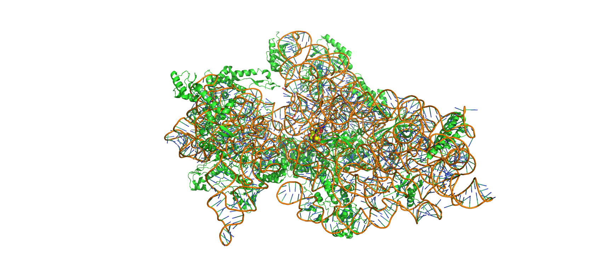

# Drugs, Microbes, And The Host

## Antimicrobials

An antimicrobial is an agent that kills microorganisms or stops their growth. Antimicrobial medicines can be grouped according to the microorganisms they act primarily against. For example, antibiotics are used against bacteria, and antifungals are used against fungi. They can also be classified according to their function. Agents that kill microbes are microbicides, while those that merely inhibit their growth are called bacteriostatic agents. The use of antimicrobial medicines to treat infection is known as antimicrobial chemotherapy, while the use of antimicrobial medicines to prevent infection is known as antimicrobial prophylaxis.

The main classes of antimicrobial agents are disinfectants (non-selective agents, such as bleach), which kill a wide range of microbes on non-living surfaces to prevent the spread of illness, antiseptics (which are applied to living tissue and help reduce infection during surgery), and antibiotics (which destroy microorganisms within the body). The term 'antibiosis', meaning "against life", was introduced by the French bacteriologist Jean Paul Vuillemin as a descriptive name of the phenomenon exhibited by these early antibacterial drugs. Antibiosis was first described in 1877 in bacteria when Louis Pasteur and Robert Koch observed that an airborne bacillus could inhibit the growth of Bacillus anthracis. These drugs were later renamed antibiotics by Selman Waksman, an American microbiologist, in 1947. The term "antibiotic" derives from anti + βιωτικός (biōtikos), "fit for life, lively", which comes from βίωσις (biōsis), "way of life", and that from βίος (bios), "life". The term "antibacterial" derives from Greek ἀντί (anti), "against" + βακτήριον (baktērion), diminutive of βακτηρία (baktēria), "staff, cane", because the first bacteria to be discovered were rod. The term antibiotic was first used in 1942 by Selman Waksman and his collaborators in journal articles to describe any substance produced by a microorganism that is antagonistic to the growth of other microorganisms in high dilution. The term "antibiotic" originally described only those formulations derived from living microorganisms but is now also applied to synthetic agents, such as sulfonamides or fluoroquinolones. Though the term used to be restricted to antibacterials (and is often used as a synonym for them by medical professionals and in medical literature), its context has broadened to include all antimicrobials. Antibacterial agents can be further subdivided into bactericidal agents, which kill bacteria, and bacteriostatic agents, which slow down or stall bacterial growth. In response, further advancements in antimicrobial technologies have resulted in solutions that can go beyond simply inhibiting microbial growth. Instead, certain types of porous media have been developed to kill microbes on contact.

Antimicrobial use has been common practice for at least 2000 years. Ancient Egyptians and ancient Greeks used specific molds and plant extracts to treat infection.

In the 19th century, microbiologists such as Louis Pasteur and Jules Francois Joubert observed antagonism between some bacteria and discussed the merits of controlling these interactions in medicine. Louis Pasteur's work in fermentation and spontaneous generation led to the distinction between anaerobic and aerobic bacteria. The information garnered by Pasteur led Joseph Lister to incorporate antiseptic methods, such as sterilizing surgical tools and debriding wounds into surgical procedures. The implementation of these antiseptic techniques drastically reduced the number of infections and subsequent deaths associated with surgical procedures. Louis Pasteur's work in microbiology also led to the development of many vaccines for life-threatening diseases such as anthrax and rabies. On September 3, 1928, Alexander Fleming returned from a vacation and discovered that a Petri dish filled with Staphylococcus was separated into colonies due to the antimicrobial fungus Penicillium rubens. Fleming and his associates struggled to isolate the antimicrobial but referenced its therapeutic potential in 1929 in the British Journal of Experimental Pathology. In 1942, Howard Florey, Ernst Chain, and Edward Abraham utilized Fleming's work to purify and extract penicillin for medicinal uses earning them the 1945 Nobel Prize in Medicine.

### Antibacterials

Antibacterials are used to treat bacterial infections. Antibiotics are classified generally as beta-lactams, macrolides, quinolones, tetracyclines or aminoglycosides. Their classification within these categories depends on their antimicrobial spectra, pharmacodynamics, and chemical composition. Prolonged use of certain antibacterials can decrease the number of enteric bacteria, which may have a negative impact on health. Consumption of probiotics and reasonable eating may help to replace destroyed gut flora. Stool transplants may be considered for patients who are having difficulty recovering from prolonged antibiotic treatment, as for recurrent Clostridioides difficile infections.

The discovery, development and use of antibacterials during the 20th century have reduced mortality from bacterial infections. The antibiotic era began with the therapeutic application of sulfonamide drugs in 1936, followed by a "golden" period of discovery from about 1945 to 1970, when a number of structurally diverse and highly effective agents were discovered and developed. Since 1980, the introduction of new antimicrobial agents for clinical use has declined, in part because of the enormous expense of developing and testing new drugs. In parallel, there has been an alarming increase in antimicrobial resistance of bacteria, fungi, parasites and some viruses to multiple existing agents.

Antibacterials are among the most commonly used drugs and among the drugs commonly misused by physicians, for example, in viral respiratory tract infections. As a consequence of widespread and injudicious use of antibacterials, there has been an accelerated emergence of antibiotic-resistant pathogens, resulting in a serious threat to global public health. The resistance problem demands that a renewed effort be made to seek antibacterial agents effective against pathogenic bacteria resistant to current antibacterials. Possible strategies towards this objective include increased sampling from diverse environments and application of metagenomics to identify bioactive compounds produced by currently unknown and uncultured microorganisms as well as the development of small-molecule libraries customized for bacterial targets.

### Antifungals

Antifungals are used to kill or prevent further growth of fungi. In medicine, they are used as a treatment for infections such as athlete's foot, ringworm and thrush and work by exploiting differences between mammalian and fungal cells. Unlike bacteria, both fungi and humans are eukaryotes. Thus, fungal and human cells are similar at the molecular level, making it more difficult to find a target for an antifungal drug to attack that does not also exist in the host organism. Consequently, there are often side effects to some of these drugs. Some of these side effects can be life-threatening if the drug is not used properly.

As well as their use in medicine, antifungals are frequently sought after to control indoor mold in damp or wet home materials. Sodium bicarbonate (baking soda) blasted on to surfaces acts as an antifungal. Another antifungal solution applied after or without blasting by soda is a mix of hydrogen peroxide and a thin surface coating that neutralizes mold and encapsulates the surface to prevent spore release. Some paints are also manufactured with an added antifungal agent for use in high humidity areas such as bathrooms or kitchens. Other antifungal surface treatments typically contain variants of metals known to suppress mold growth e.g. pigments or solutions containing copper, silver or zinc. These solutions are not usually available to the general public because of their toxicity.

### Antivirals

Antiviral drugs are a class of medication used specifically for treating viral infections. Like antibiotics, specific antivirals are used for specific viruses. They should be distinguished from viricides, which actively deactivate virus particles outside the body.

Many antiviral drugs are designed to treat infections by retroviruses, including HIV. Important antiretroviral drugs include the class of protease inhibitors. Herpes viruses, best known for causing cold sores and genital herpes, are usually treated with the nucleoside analogue acyclovir. Viral hepatitis is caused by five unrelated hepatotropic viruses (A-E) and may be treated with antiviral drugs depending on the type of infection. Some influenza A and B viruses have become resistant to neuraminidase inhibitors such as oseltamivir, and the search for new substances continues.

### Antiparasitics

Antiparasitics are a class of medications indicated for the treatment of infectious diseases such as leishmaniasis, malaria and Chagas disease, which are caused by parasites such as nematodes, cestodes, trematodes and infectious protozoa. Antiparasitic medications include metronidazole, iodoquinol and albendazole. Like all therapeutic antimicrobials, they must kill the infecting organism without serious damage to the host.

### Broad-Spectrum Therapeutics

Broad-spectrum therapeutics are active against multiple classes of pathogens. Such therapeutics have been suggested as potential emergency treatments for pandemics. Azithromycin is currently the only identified broad-spectrum therapeutic.

## Antibiotics

An antibiotic is a type of antimicrobial substance active against bacteria. It is the most important type of antibacterial agent for fighting bacterial infections, and antibiotic medications are widely used in the treatment and prevention of such infections. They may either kill or inhibit the growth of bacteria. A limited number of antibiotics also possess antiprotozoal activity. Antibiotics are not effective against viruses such as the common cold or influenza; drugs which inhibit viruses are termed antiviral drugs or antivirals rather than antibiotics.

Sometimes, the term antibiotic—literally "opposing life", from the Greek roots ἀντι anti, "against" and βίος bios, "life"—is broadly used to refer to any substance used against microbes, but in the usual medical usage, antibiotics (such as penicillin) are those produced naturally (by one microorganism fighting another), whereas nonantibiotic antibacterials (such as sulfonamides and antiseptics) are fully synthetic. However, both classes have the same goal of killing or preventing the growth of microorganisms, and both are included in antimicrobial chemotherapy. "Antibacterials" include antiseptic drugs, antibacterial soaps, and chemical disinfectants, whereas antibiotics are an important class of antibacterials used more specifically in medicine and sometimes in livestock feed.

Antibiotics have been used since ancient times. Many civilizations used topical application of mouldy bread, with many references to its beneficial effects arising from ancient Egypt, Nubia, China, Serbia, Greece, and Rome. The first person to directly document the use of molds to treat infections was John Parkinson (1567–1650). Antibiotics revolutionized medicine in the 20th century. Alexander Fleming (1881–1955) discovered modern day penicillin in 1928, the widespread use of which proved significantly beneficial during wartime. However, the effectiveness and easy access to antibiotics have also led to their overuse and some bacteria have evolved resistance to them. The World Health Organization has classified antimicrobial resistance as a widespread "serious threat [that] is no longer a prediction for the future, it is happening right now in every region of the world and has the potential to affect anyone, of any age, in any country".

Antibiotics are used to treat or prevent bacterial infections, and sometimes protozoan infections. (Metronidazole is effective against a number of parasitic diseases). When an infection is suspected of being responsible for an illness but the responsible pathogen has not been identified, an empiric therapy is adopted. This involves the administration of a broad-spectrum antibiotic based on the signs and symptoms presented and is initiated pending laboratory results that can take several days.

When the responsible pathogenic microorganism is already known or has been identified, definitive therapy can be started. This will usually involve the use of a narrow-spectrum antibiotic. The choice of antibiotic given will also be based on its cost. Identification is critically important as it can reduce the cost and toxicity of the antibiotic therapy and also reduce the possibility of the emergence of antimicrobial resistance. To avoid surgery, antibiotics may be given for non-complicated acute appendicitis.

(ref:antib) [Antibiotics coverage diagram.](https://commons.wikimedia.org/wiki/File:Antibiotics_coverage_diagram.jpg)

(\#fig:antibiotics)(ref:antib)

Antibiotics may be given as a preventive measure and this is usually limited to at-risk populations such as those with a weakened immune system (particularly in HIV cases to prevent pneumonia), those taking immunosuppressive drugs, cancer patients, and those having surgery. Their use in surgical procedures is to help prevent infection of incisions. They have an important role in dental antibiotic prophylaxis where their use may prevent bacteremia and consequent infective endocarditis. Antibiotics are also used to prevent infection in cases of neutropenia particularly cancer-related.

There are many different routes of administration for antibiotic treatment. Antibiotics are usually taken by mouth. In more severe cases, particularly deep-seated systemic infections, antibiotics can be given intravenously or by injection. Where the site of infection is easily accessed, antibiotics may be given topically in the form of eye drops onto the conjunctiva for conjunctivitis or ear drops for ear infections and acute cases of swimmer's ear. Topical use is also one of the treatment options for some skin conditions including acne and cellulitis. Advantages of topical application include achieving high and sustained concentration of antibiotic at the site of infection; reducing the potential for systemic absorption and toxicity, and total volumes of antibiotic required are reduced, thereby also reducing the risk of antibiotic misuse. Topical antibiotics applied over certain types of surgical wounds have been reported to reduce the risk of surgical site infections. However, there are certain general causes for concern with topical administration of antibiotics. Some systemic absorption of the antibiotic may occur; the quantity of antibiotic applied is difficult to accurately dose, and there is also the possibility of local hypersensitivity reactions or contact dermatitis occurring. It is recommended to administer antibiotics as soon as possible, especially in life-threatening infections. Many emergency departments stock antibiotics for this purpose.

Prevalence
Antibiotic consumption varies widely between countries. The WHO report on surveillance of antibiotic consumption’ published in 2018 analysed 2015 data from 65 countries. As measured in defined daily doses per 1,000 inhabitants per day. Mongolia had the highest consumption with a rate of 64.4. Burundi had the lowest at 4.4. Amoxicillin and amoxicillin/clavulanic acid were the most frequently consumed.

### Classes of Antibiotics

Antibiotics are commonly classified based on their mechanism of action, chemical structure, or spectrum of activity. Most target bacterial functions or growth processes. Those that target the bacterial cell wall (penicillins and cephalosporins) or the cell membrane (polymyxins), or interfere with essential bacterial enzymes (rifamycins, lipiarmycins, quinolones, and sulfonamides) have bactericidal activities. Protein synthesis inhibitors (macrolides, lincosamides, and tetracyclines) are usually bacteriostatic (with the exception of bactericidal aminoglycosides). Further categorization is based on their target specificity. "Narrow-spectrum" antibiotics target specific types of bacteria, such as gram-negative or gram-positive, whereas broad-spectrum antibiotics affect a wide range of bacteria. Following a 40-year break in discovering classes of antibacterial compounds, four new classes of antibiotics were introduced to clinical use in the late 2000s and early 2010s: cyclic lipopeptides (such as daptomycin), glycylcyclines (such as tigecycline), oxazolidinones (such as linezolid), and lipiarmycins (such as fidaxomicin).

With advances in medicinal chemistry, most modern antibacterials are semisynthetic modifications of various natural compounds. These include, for example, the beta-lactam antibiotics, which include the penicillins (produced by fungi in the genus Penicillium), the cephalosporins, and the carbapenems. Compounds that are still isolated from living organisms are the aminoglycosides, whereas other antibacterials—for example, the sulfonamides, the quinolones, and the oxazolidinones—are produced solely by chemical synthesis. Many antibacterial compounds are relatively small molecules with a molecular weight of less than 1000 daltons.

Since the first pioneering efforts of Howard Florey and Chain in 1939, the importance of antibiotics, including antibacterials, to medicine has led to intense research into producing antibacterials at large scales. Following screening of antibacterials against a wide range of bacteria, production of the active compounds is carried out using fermentation, usually in strongly aerobic conditions.

The emergence of resistance of bacteria to antibiotics is a common phenomenon. Emergence of resistance often reflects evolutionary processes that take place during antibiotic therapy. The antibiotic treatment may select for bacterial strains with physiologically or genetically enhanced capacity to survive high doses of antibiotics. Under certain conditions, it may result in preferential growth of resistant bacteria, while growth of susceptible bacteria is inhibited by the drug. For example, antibacterial selection for strains having previously acquired antibacterial-resistance genes was demonstrated in 1943 by the Luria–Delbrück experiment. Antibiotics such as penicillin and erythromycin, which used to have a high efficacy against many bacterial species and strains, have become less effective, due to the increased resistance of many bacterial strains.

Resistance may take the form of biodegradation of pharmaceuticals, such as sulfamethazine-degrading soil bacteria introduced to sulfamethazine through medicated pig feces. The survival of bacteria often results from an inheritable resistance, but the growth of resistance to antibacterials also occurs through horizontal gene transfer. Horizontal transfer is more likely to happen in locations of frequent antibiotic use.

Antibacterial resistance may impose a biological cost, thereby reducing fitness of resistant strains, which can limit the spread of antibacterial-resistant bacteria, for example, in the absence of antibacterial compounds. Additional mutations, however, may compensate for this fitness cost and can aid the survival of these bacteria.

Paleontological data show that both antibiotics and antibiotic resistance are ancient compounds and mechanisms. Useful antibiotic targets are those for which mutations negatively impact bacterial reproduction or viability.

Several molecular mechanisms of antibacterial resistance exist. Intrinsic antibacterial resistance may be part of the genetic makeup of bacterial strains. For example, an antibiotic target may be absent from the bacterial genome. Acquired resistance results from a mutation in the bacterial chromosome or the acquisition of extra-chromosomal DNA. Antibacterial-producing bacteria have evolved resistance mechanisms that have been shown to be similar to, and may have been transferred to, antibacterial-resistant strains. The spread of antibacterial resistance often occurs through vertical transmission of mutations during growth and by genetic recombination of DNA by horizontal genetic exchange. For instance, antibacterial resistance genes can be exchanged between different bacterial strains or species via plasmids that carry these resistance genes. Plasmids that carry several different resistance genes can confer resistance to multiple antibacterials. Cross-resistance to several antibacterials may also occur when a resistance mechanism encoded by a single gene conveys resistance to more than one antibacterial compound.

Antibacterial-resistant strains and species, sometimes referred to as "superbugs", now contribute to the emergence of diseases that were for a while well controlled. For example, emergent bacterial strains causing tuberculosis that are resistant to previously effective antibacterial treatments pose many therapeutic challenges. Every year, nearly half a million new cases of multidrug-resistant tuberculosis (MDR-TB) are estimated to occur worldwide. For example, NDM-1 is a newly identified enzyme conveying bacterial resistance to a broad range of beta-lactam antibacterials. The United Kingdom's Health Protection Agency has stated that "most isolates with NDM-1 enzyme are resistant to all standard intravenous antibiotics for treatment of severe infections." On 26 May 2016, an E. coli "superbug" was identified in the United States resistant to colistin, "the last line of defence" antibiotic.

Before the early 20th century, treatments for infections were based primarily on medicinal folklore. Mixtures with antimicrobial properties that were used in treatments of infections were described over 2,000 years ago. Many ancient cultures, including the ancient Egyptians and ancient Greeks, used specially selected mold and plant materials to treat infections. Nubian mummies studied in the 1990s were found to contain significant levels of tetracycline. The beer brewed at that time was conjectured to have been the source.

The use of antibiotics in modern medicine began with the discovery of synthetic antibiotics derived from dyes.

Synthetic antibiotic chemotherapy as a science and development of antibacterials began in Germany with Paul Ehrlich in the late 1880s. Ehrlich noted certain dyes would color human, animal, or bacterial cells, whereas others did not. He then proposed the idea that it might be possible to create chemicals that would act as a selective drug that would bind to and kill bacteria without harming the human host. After screening hundreds of dyes against various organisms, in 1907, he discovered a medicinally useful drug, the first synthetic antibacterial organoarsenic compound salvarsan, now called arsphenamine.

This heralded the era of antibacterial treatment that was begun with the discovery of a series of arsenic-derived synthetic antibiotics by both Alfred Bertheim and Ehrlich in 1907. Ehrlich and Bertheim had experimented with various chemicals derived from dyes to treat trypanosomiasis in mice and spirochaeta infection in rabbits. While their early compounds were too toxic, Ehrlich and Sahachiro Hata, a Japanese bacteriologist working with Erlich in the quest for a drug to treat syphilis, achieved success with the 606th compound in their series of experiments. In 1910 Ehrlich and Hata announced their discovery, which they called drug "606", at the Congress for Internal Medicine at Wiesbaden. The Hoechst company began to market the compound toward the end of 1910 under the name Salvarsan, now known as arsphenamine. The drug was used to treat syphilis in the first half of the 20th century. In 1908, Ehrlich received the Nobel Prize in Physiology or Medicine for his contributions to immunology. Hata was nominated for the Nobel Prize in Chemistry in 1911 and for the Nobel Prize in Physiology or Medicine in 1912 and 1913.

The first sulfonamide and the first systemically active antibacterial drug, Prontosil, was developed by a research team led by Gerhard Domagk in 1932 or 1933 at the Bayer Laboratories of the IG Farben conglomerate in Germany, for which Domagk received the 1939 Nobel Prize in Physiology or Medicine. Sulfanilamide, the active drug of Prontosil, was not patentable as it had already been in use in the dye industry for some years. Prontosil had a relatively broad effect against Gram-positive cocci, but not against enterobacteria. Research was stimulated apace by its success. The discovery and development of this sulfonamide drug opened the era of antibacterials.

### Penicillin And Other Natural Antibiotics

Penicillins (P, PCN or PEN) are a group of antibiotics originally obtained from Penicillium moulds, principally P. chrysogenum and P. rubens. Most penicillins in clinical use are chemically synthesised from naturally-produced penicillins. A number of natural penicillins have been discovered, but only two purified compounds are in clinical use: penicillin G (intravenous use) and penicillin V (given by mouth). Penicillins were among the first medications to be effective against many bacterial infections caused by staphylococci and streptococci. They are members of the β-lactam antibiotics. They are still widely used today for different bacterial infections, though many types of bacteria have developed resistance following extensive use.

About 10% of people report that they are allergic to penicillin; however, up to 90% of this group may not actually be allergic. Serious allergies only occur in about 0.03%.[for whom?] Those who are allergic to penicillin are most often given cephalosporin C (another β-lactam antibiotic) because there is only 10% crossover in allergy between the penicillins and cephalosporins.

Starting in the late 19th century there had been reports of the antibacterial properties of Penicillium mould, but scientists were unable to discern what process was causing the effect. Scottish physician Alexander Fleming at St Mary's Hospital in London (now part of Imperial College) was the first to show that Penicillium rubens had antibacterial properties. On 3 September 1928 he observed that fungal contamination of a bacterial culture (Staphylococcus aureus) appeared to kill the bacteria. He confirmed this observation with a new experiment on 28 September 1928. He published his experiment in 1929, and called the antibacterial substance (the fungal extract) penicillin.

C. J. La Touche identified the fungus as Penicillium rubrum (later reclassified by Charles Thom as P. notatum and P. chrysogenum, but later corrected as P. rubens). Fleming expressed initial optimism that penicillin would be a useful antiseptic, because of its high potency and minimal toxicity in comparison to other antiseptics of the day, and noted its laboratory value in the isolation of Bacillus influenzae (now called Haemophilus influenzae).

Fleming did not convince anyone that his discovery was important. This was largely because penicillin was so difficult to isolate that its development as a drug seemed impossible. It is speculated that had Fleming been more successful at making other scientists interested in his work, penicillin would possibly have been developed years earlier.

The importance of his work has been recognized by the placement of an International Historic Chemical Landmark at the Alexander Fleming Laboratory Museum in London on November 19, 1999.

In 1930, Cecil George Paine, a pathologist at the Royal Infirmary in Sheffield, successfully treated ophthalmia neonatorum, a gonococcal infection in infants, with penicillin (fungal extract) on November 25, 1930.

In 1940, Australian scientist Howard Florey (later Baron Florey) and a team of researchers (Ernst Chain, Edward Abraham, Arthur Duncan Gardner, Norman Heatley, Margaret Jennings, Jean Orr-Ewing and Arthur Gordon Sanders) at the Sir William Dunn School of Pathology, University of Oxford made progress in making concentrated penicillin from fungal culture broth that showed both in vitro and in vivo bactericidal action. In 1941, they treated a policeman, Albert Alexander, with a severe face infection; his condition improved, but then supplies of penicillin ran out and he died. Subsequently, several other patients were treated successfully. In December 1942, survivors of the Cocoanut Grove fire in Boston were the first burn patients to be successfully treated with penicillin.

The first successful use of pure penicillin was when Fleming treated Harry Lambert of fatal infection of the nervous system (streptococcal meningitis) in 1942. By that time the Oxford team could produce only small amount. Florey willingly gave the only available sample to Fleming. Lambert showed improvement from the very next day of the treatment, and was completely cured within a week. Fleming published his clinical trial in The Lancet in 1943. Following the medical breakthrough the British War Cabinet set up the Penicillin Committee on 5 April 1943 that led to projects for mass production.

As the medical application was established, the Oxford team found that it was impossible to produce usable amounts in their laboratory. Failing to persuade the British government, Florey and Heatley travelled to the US in June 1941 with their mould samples in order to interest the US government for large-scale production. They approached the USDA Northern Regional Research Laboratory (NRRL, now the National Center for Agricultural Utilization Research) at Peoria, Illinois, where facilities for large-scale fermentations were established. Mass culture of the mould and search for better moulds immediately followed.

On March 14, 1942, the first patient was treated for streptococcal sepsis with US-made penicillin produced by Merck & Co. Half of the total supply produced at the time was used on that one patient, Anne Miller. By June 1942, just enough US penicillin was available to treat ten patients. In July 1943, the War Production Board drew up a plan for the mass distribution of penicillin stocks to Allied troops fighting in Europe. The results of fermentation research on corn steep liquor at the NRRL allowed the United States to produce 2.3 million doses in time for the invasion of Normandy in the spring of 1944. After a worldwide search in 1943, a mouldy cantaloupe in a Peoria, Illinois market was found to contain the best strain of mould for production using the corn steep liquor process. Pfizer scientist Jasper H. Kane suggested using a deep-tank fermentation method for producing large quantities of pharmaceutical-grade penicillin.:109 Large-scale production resulted from the development of a deep-tank fermentation plant by chemical engineer Margaret Hutchinson Rousseau. As a direct result of the war and the War Production Board, by June 1945, over 646 billion units per year were being produced.

After World War II, Australia was the first country to make the drug available for civilian use. In the U.S., penicillin was made available to the general public on March 15, 1945.

Fleming, Florey, and Chain shared the 1945 Nobel Prize in Physiology or Medicine for the development of penicillin.

Several semisynthetic penicillins are effective against a broader spectrum of bacteria: these include the antistaphylococcal penicillins, aminopenicillins and the antipseudomonal penicillins.

The term "penicillin" is defined as the natural product of Penicillium mould with antimicrobial activity. It was coined by Alexander Fleming on 7 March 1929 when he discovered the antibacterial property of Penicillium rubens. The name was "to avoid the repetition of the rather cumbersome phrase 'Mould broth filtrate,' the name 'penicillin' will be used," as Fleming explained in his 1929 paper in the British Journal of Experimental Pathology. The name thus refers to the scientific name of the mould, as described by Fleming in his Nobel lecture in 1945:

>I have been frequently asked why I invented the name "Penicillin". I simply followed perfectly orthodox lines and coined a word which explained that the substance penicillin was derived from a plant of the genus Penicillium just as many years ago the word "Digitalin" was invented for a substance derived from the plant Digitalis.

In modern usage, the term penicillin is used more broadly to refer to any β-lactam antimicrobial that contains a thiazolidine ring fused to the β-lactam core, and may or may not be a natural product. Like most natural products, penicillin is present in Penicillium moulds as a mixture of active constituents (gentamicin is another example of a natural product that is an ill-defined mixture of active components).

The precise constitution of the penicillin extracted depends on the species of Penicillium mould used and on the nutrient media used to culture the mould. Fleming's original strain of Penicillium rubens produces principally penicillin F, named after Fleming. But penicillin F is unstable, difficult to isolate, and produced by the mould in small quantities.

The principal commercial strain of Penicillium chrysogenum (the Peoria strain) produces penicillin G as the principal component when corn steep liquor is used as the culture medium. When phenoxyethanol or phenoxyacetic acid are added to the culture medium, the mould produces penicillin V as the main penicillin instead.

6-Aminopenicillanic acid (6-APA) is a compound derived from penicillin G. 6-APA contains the beta-lactam core of penicillin G, but with the side chains stripped off; 6-APA is a useful precursor for manufacturing other penicillins. There are many semi-synthetic penicillins derived from 6-APA and these are in three groups: antistaphylococcal penicillins, broad-spectrum penicillins, and antipseudomonal penicillins. The semi-synthetic penicillins are all referred to as penicillins because they are all derived ultimately from penicillin G.

Penicillin G (benzylpenicillin) was first produced from a penicillium fungus that occurs in nature. The strain of fungus used today for the manufacture of penicillin G was created by genetic engineering to improve the yield in the manufacturing process. None of the other natural penicillins (F, K, N, X, O, U1 or U6) are currently in clinical use.

Penicillin V (phenoxymethylpenicillin) is produced by adding the precursor phenoxyacetic acid to the medium in which a genetically modified strain of the penicillium fungus is being cultured.

There are three major groups of other semi-synthetic antibiotics related to the penicillins. They are synthesised by adding various side-chains to the precursor 6-APA, which is isolated from penicillin G. These are the antistaphylococcal antibiotics, broad-spectrum antibiotics, and antipseudomonal antibiotics.

### Antistaphylococcal antibiotics

* Cloxacillin (by mouth or by injection)
* Dicloxacillin (by mouth or by injection)
* Flucloxacillin (by mouth or by injection)
* Methicillin (injection only)
* Nafcillin (injection only)
* Oxacillin (by mouth or by injection)

Antistaphylococcal antibiotics are so-called because they are resistant to being broken down by staphylococcal penicillinase. They are also, therefore, referred to as being penicillinase-resistant.

### Broad-spectrum antibiotics

This group of antibiotics is called "broad-spectrum" because they are active against a wide range of Gram-negative bacteria such as Escherichia coli and Salmonella typhi, for which penicillin is not suitable. However, resistance in these organisms is now common.

* Ampicillin
* Amoxycillin

There are many ampicillin precursors in existence. These are inactive compounds that are broken down in the gut to release ampicillin. None of these pro-drugs of ampicillin are in current use:

* Pivampicillin (pivaloyloxymethyl ester of ampicillin)
* Bacampicillin
* Metampicillin (formaldehyde ester of ampicillin)
* Talampicillin
* Hetacillin (ampicillin conjugated to acetone)
* Epicillin is an aminopenicillin that has never seen widespread clinical use.

### Antipseudomonal antibiotics

The Gram-negative species, Pseudomonas aeruginosa, is naturally resistant to many antibiotic classes. There were many efforts in the 1960s and 1970s to develop antibiotics that are active against Pseudomonas species. There are two chemical classes within the group: carboxypenicillins and ureidopenicillins. All are given by injection: none can be given by mouth.

*Carboxypenicillins*
  * Carbenicillin
  * Ticarcillin
  * Temocillin
*
Ureidopenicillins*
  * Mezlocillin
  * Piperacillin
  * Azlocillin

*β-lactamase inhibitors*
  * Clavulanic acid
  * Sulbactam
  * Tazobactam

The term "penicillin", when used by itself, may refer to either of two chemical compounds, penicillin G or penicillin V.

<table class="table" style="margin-left: auto; margin-right: auto;">
<caption>(\#tab:composition)The three essential polymeric macromolecules of life</caption>
 <thead>
  <tr>
   <th style="text-align:left;"> Common name </th>
   <th style="text-align:left;"> Chemical name </th>
   <th style="text-align:left;"> Method ofadministration </th>
  </tr>
 </thead>
<tbody>
  <tr>
   <td style="text-align:left;"> Penicillin V </td>
   <td style="text-align:left;"> phenoxymethylpenicillin </td>
   <td style="text-align:left;"> oral </td>
  </tr>
  <tr>
   <td style="text-align:left;"> Penicillin G </td>
   <td style="text-align:left;"> benzylpenicillin </td>
   <td style="text-align:left;"> intravenous  intramuscular </td>
  </tr>
</tbody>
</table>

Penicillin G is destroyed by stomach acid, so it cannot be taken by mouth, but doses as high as 2.4 g can be given (much higher than penicillin V). It is given by intravenous or intramuscular injection. It can be formulated as an insoluble salt, and there are two such formulations in current use: procaine penicillin and benzathine benzylpenicillin, which are used only in the treatment of syphilis. When a high concentration in the blood must be maintained, penicillin G must be administered at relatively frequent intervals, because it is eliminated quite rapidly from the bloodstream by the kidney.

Penicillin G is licensed for use to treat septicaemia, empyema, pneumonia, pericarditis, endocarditis and meningitis caused by susceptible strains of staphylococci and streptococci. It is also licensed for the treatment of anthrax, actinomycosis, cervicofacial disease, thoracic and abdominal disease, clostridial infections, botulism, gas gangrene (with accompanying debridement and/or surgery as indicated), tetanus (as an adjunctive therapy to human tetanus immune globulin), diphtheria (as an adjunctive therapy to antitoxin and for the prevention of the carrier state), erysipelothrix endocarditis, fusospirochetosis (severe infections of the oropharynx, lower respiratory tract and genital area), Listeria infections, meningitis, endocarditis, Pasteurella infections including bacteraemia and meningitis, Haverhill fever; rat-bite fever and disseminated gonococcal infections, meningococcal meningitis and/or septicaemia caused by penicillin-susceptible organisms and syphilis.

Penicillin V can be taken by mouth because it is relatively resistant to stomach acid. Doses higher than 500 mg are not fully effective because of poor absorption. It is used for the same bacterial infections as those of penicillin G and is the most widely used form of penicillin. However, it is not used for diseases, such as endocarditis, where high blood levels of penicillin are required.

Because penicillin resistance is now so common, other antibiotics are now the preferred choice for treatments. For example, penicillin used to be the first-line treatment for infections with Neisseria gonorrhoeae and Neisseria meningitidis, but it is longer recommended for treatment of these infections.

<table class="table" style="margin-left: auto; margin-right: auto;">
<caption>(\#tab:suszeptibility)The three essential polymeric macromolecules of life</caption>
 <thead>
  <tr>
   <th style="text-align:left;"> Bacterium </th>
   <th style="text-align:left;"> Susceptible (S) </th>
   <th style="text-align:left;"> Intermediate (I) </th>
   <th style="text-align:left;"> Resistant (R) </th>
  </tr>
 </thead>
<tbody>
  <tr>
   <td style="text-align:left;"> Staphylococcus aureus </td>
   <td style="text-align:left;"> ≤0.12 mcg/ml </td>
   <td style="text-align:left;"> - </td>
   <td style="text-align:left;"> ≥0.25 mcg/ml </td>
  </tr>
  <tr>
   <td style="text-align:left;"> Streptococcus pneumoniae meningitis </td>
   <td style="text-align:left;"> ≤0.06 mcg/ml </td>
   <td style="text-align:left;"> - </td>
   <td style="text-align:left;"> ≥0.12 mcg/ml </td>
  </tr>
  <tr>
   <td style="text-align:left;"> Streptococcus pneumoniae (not meningitis) </td>
   <td style="text-align:left;"> ≤2 mcg/ml </td>
   <td style="text-align:left;">  </td>
   <td style="text-align:left;"> ≥8 mcg/ml </td>
  </tr>
  <tr>
   <td style="text-align:left;"> Streptococcus Viridans group </td>
   <td style="text-align:left;"> 0.12 mcg/ml </td>
   <td style="text-align:left;"> 0.25–2 mcg/ml </td>
   <td style="text-align:left;"> 4 mcg/ml </td>
  </tr>
  <tr>
   <td style="text-align:left;"> Listeria monocytogenes </td>
   <td style="text-align:left;"> ≤2 mcg/ml </td>
   <td style="text-align:left;"> - </td>
   <td style="text-align:left;"> - </td>
  </tr>
  <tr>
   <td style="text-align:left;"> Bacillus anthracis </td>
   <td style="text-align:left;"> ≤0.12 mcg/ml </td>
   <td style="text-align:left;"> - </td>
   <td style="text-align:left;"> ≥0.25 mcg/ml </td>
  </tr>
</tbody>
</table>

Observations about the growth of some microorganisms inhibiting the growth of other microorganisms have been reported since the late 19th century. These observations of antibiosis between microorganisms led to the discovery of natural antibacterials. Louis Pasteur observed, "if we could intervene in the antagonism observed between some bacteria, it would offer perhaps the greatest hopes for therapeutics".

Common (≥ 1% of people) adverse drug reactions associated with use of the penicillins include diarrhoea, hypersensitivity, nausea, rash, neurotoxicity, urticaria, and superinfection (including candidiasis). Infrequent adverse effects (0.1–1% of people) include fever, vomiting, erythema, dermatitis, angioedema, seizures (especially in people with epilepsy), and pseudomembranous colitis. Penicillin can also induce serum sickness or a serum sickness-like reaction in some individuals. Serum sickness is a type III hypersensitivity reaction that occurs one to three weeks after exposure to drugs including penicillin. It is not a true drug allergy, because allergies are type I hypersensitivity reactions, but repeated exposure to the offending agent can result in an anaphylactic reaction. Allergy will occur in 1-10% of people, presenting as a skin rash after exposure. IgE-mediated anaphylaxis will occur in approximately 0.01% of patients.

Pain and inflammation at the injection site are also common for parenterally administered benzathine benzylpenicillin, benzylpenicillin, and, to a lesser extent, procaine benzylpenicillin. The condition is known as livedoid dermatitis or Nicolau syndrome.

### Chemical Structure Of Penicillins

The term "penam" is used to describe the common core skeleton of a member of the penicillins. This core has the molecular formula R-C~9~H~11~N~2O~4~S, where R is the variable side chain that differentiates the penicillins from one another. The penam core has a molar mass of 243 g/mol, with larger penicillins having molar mass near 450—for example, cloxacillin has a molar mass of 436 g/mol. 6-APA (C8H12N2O3S) forms the basic structure of penicillins. It is made up of an enclosed dipeptide formed by the condensation of L-cystein and D-valine. This results in the formations of β-lactam and thiazolidinic rings.

The key structural feature of the penicillins is the four-membered β-lactam ring; this structural moiety is essential for penicillin's antibacterial activity. The β-lactam ring is itself fused to a five-membered thiazolidine ring. The fusion of these two rings causes the β-lactam ring to be more reactive than monocyclic β-lactams because the two fused rings distort the β-lactam amide bond and therefore remove the resonance stabilisation normally found in these chemical bonds. An acyl side side chain attached to the β-lactam ring.

A variety of β-lactam antibiotics have been produced following chemical modification from the 6-APA structure during synthesis, specifically by making chemical substitutions in the acyl side chain. For example, the first chemically altered penicillin, methicillin, had substitutions by methoxy groups at positions 2’ and 6’ of the 6-APA benzene ring from penicillin G. This difference makes methicillin resistant to the activity of β-lactamase, an enzyme by which many bacteria are naturally unsusceptible to penicillins.

### Mechanism Of Action Of Penicillin

Penicillin can easily enter bacterial cell in case of Gram-positive species. This is because Gram-positive bacteria do not have an outer cell membrane and are simply enclosed in a thick cell wall. Penicillin molecules are small enough to pass through the spaces of glycoproteins in the cell wall. For this reason Gram-positive bacteria are very susceptible to penicillin (as first evidenced by the discovery of penicillin in 1928).

Penicillin, or any other molecule, enters Gram-negative bacteria in a different manner. The bacteria have thinner cell walls but the external surface is coated with an additional cell membrane, called the outer membrane. The outer membrane is a lipid layer (lipopolysaccharide chain) that blocks passage of water-soluble (hydrophilic) molecules like penicillin. It thus acts as the first line of defence against any toxic substance, which is the reason for relative resistance to antibiotics compared to Gram-positive species But penicillin can still enter Gram-negative species by diffusing through aqueous channels called porins (outer membrane proteins), which are dispersed among the fatty molecules and can transport nutrients and antibiotics into the bacteria. Porins are large enough to allow diffusion of most penicillins, but the rate of diffusion through them is determined by the specific size of the drug molecules. For instance, penicillin G is large and enters through porins slowly; while smaller ampicillin and amoxicillin diffuse much faster. In contrast, large vancomycin can not pass through porins and is thus ineffective for Gram-negative bacteria. The size and number of porins are different in different bacteria. As a result of the two factors—size of penicillin and porin—Gram-negative bacteria can be unsusceptible or have varying degree of susceptibility to specific penicillin.

The chemical structure of penicillin is triggered with a very precise, pH-dependent directed mechanism, affected by a unique spatial assembly of molecular components, which can activate by protonation. It can travel through bodily fluids, targeting and inactivating enzymes responsible for cell-wall synthesis in gram-positive bacteria, meanwhile avoiding the surrounding non-targets. Penicillin can protect itself from spontaneous hydrolysis in the body in its anionic form while storing its potential as a strong acylating agent, activated only upon approach to the target transpeptidase enzyme and protonated in the active centre. This targeted protonation neutralizes the carboxylic acid moiety, which is weakening of the β-lactam ring N–C(=O) bond, resulting in a self-activation. Specific structural requirements are equated to constructing the perfect mousetrap for catching targeted prey.

Penicillin kills bacteria by inhibiting the completion of the synthesis of peptidoglycans, the structural component of bacterial cell wall. It specifically inhibits the activity of enzymes that are needed for the cross-linking of peptidoglycans during the final step in cell wall biosynthesis. It does this by binding to penicillin binding proteins with the β-lactam ring, a structure found on penicillin molecules. This causes the cell wall to weaken due to fewer cross-links and means water uncontrollably flows into the cell because it cannot maintain the correct osmotic gradient. This results in cell lysis and death.

Bacteria constantly remodel their peptidoglycan cell walls, simultaneously building and breaking down portions of the cell wall as they grow and divide. During the last stages of peptidoglycan biosynthesis, uridine diphosphate-N-acetylmuramic acid pentapeptide (UDP-MurNAc) is formed in which the fourth and fifth amino acids are both D-alanyl-D-alanine. The transfer of D-alanine is done (catalysed) by the enzyme DD-transpeptidase (penicillin-binding proteins are such type). The structural integrity of bacterial cell wall depends on the cross linking of UDP-MurNAc and N-acetyl glucosamine. Penicillin and other β-lactam antibiotics act as an analogue of D-alanine-D-alanine (the dipeptide) in UDP-MurNAc owing to conformational similarities. The DD-transpeptidase then binds the four-membered β-lactam ring of penicillin in stead of UDP-MurNAc. As a consequence, DD-transpeptidase is inactivated, the formation of cross-links between UDP-MurNAc and N-acetyl glucosamine is blocked so that an imbalance between cell wall production and degradation develops, causing the cell to rapidly die.

The enzymes that hydrolyze the peptidoglycan cross-links continue to function, even while those that form such cross-links do not. This weakens the cell wall of the bacterium, and osmotic pressure becomes increasingly uncompensated—eventually causing cell death (cytolysis). In addition, the build-up of peptidoglycan precursors triggers the activation of bacterial cell wall hydrolases and autolysins, which further digest the cell wall's peptidoglycans. The small size of the penicillins increases their potency, by allowing them to penetrate the entire depth of the cell wall. This is in contrast to the glycopeptide antibiotics vancomycin and teicoplanin, which are both much larger than the penicillins.

Gram-positive bacteria are called protoplasts when they lose their cell walls. Gram-negative bacteria do not lose their cell walls completely and are called spheroplasts after treatment with penicillin.

Penicillin shows a synergistic effect with aminoglycosides, since the inhibition of peptidoglycan synthesis allows aminoglycosides to penetrate the bacterial cell wall more easily, allowing their disruption of bacterial protein synthesis within the cell. This results in a lowered MBC for susceptible organisms.

Penicillins, like other β-lactam antibiotics, block not only the division of bacteria, including cyanobacteria, but also the division of cyanelles, the photosynthetic organelles of the glaucophytes, and the division of chloroplasts of bryophytes. In contrast, they have no effect on the plastids of the highly developed vascular plants. This supports the endosymbiotic theory of the evolution of plastid division in land plants.

Some bacteria produce enzymes that break down the β-lactam ring, called β-lactamases, which make the bacteria resistant to penicillin. Therefore, some penicillins are modified or given with other drugs for use against antibiotic-resistant bacteria or in immunocompromised patients. The use of clavulanic acid or tazobactam, β-lactamase inhibitors, alongside penicillin gives penicillin activity against β-lactamase-producing bacteria. β-Lactamase inhibitors irreversibly bind to β-lactamase preventing it from breaking down the beta-lactam rings on the antibiotic molecule. Alternatively, flucloxacillin is a modified penicillin that has activity against β-lactamase-producing bacteria due to an acyl side chain that protects the beta-lactam ring from β-lactamase.

Penicillin has low protein binding in plasma. The bioavailability of penicillin depends on the type: penicillin G has low bioavailability, below 30%, whereas penicillin V has higher bioavailability, between 60 and 70%.[citation needed]

Penicillin has a short half-life and is excreted via the kidneys. This means it must be dosed at least four times a day to maintain adequate levels of penicillin in the blood. Early manuals on the use of penicillin, therefore, recommended injections of penicillin as frequently as every three hours, and dosing penicillin has been described as being similar to trying to fill a bath with the plug out. This is no longer required since much larger doses of penicillin are cheaply and easily available; however, some authorities recommend the use of continuous penicillin infusions for this reason.

In 1895 Vincenzo Tiberio, Italian physician, published a paper on the antibacterial power of some extracts of mold.

In 1897, doctoral student Ernest Duchesne submitted a dissertation, "Contribution à l'étude de la concurrence vitale chez les micro-organismes: antagonisme entre les moisissures et les microbes" (Contribution to the study of vital competition in micro-organisms: antagonism between molds and microbes), the first known scholarly work to consider the therapeutic capabilities of molds resulting from their anti-microbial activity. In his thesis, Duchesne proposed that bacteria and molds engage in a perpetual battle for survival. Duchesne observed that E. coli was eliminated by Penicillium glaucum when they were both grown in the same culture. He also observed that when he inoculated laboratory animals with lethal doses of typhoid bacilli together with Penicillium glaucum, the animals did not contract typhoid. Unfortunately Duchesne's army service after getting his degree prevented him from doing any further research. Duchesne died of tuberculosis, a disease now treated by antibiotics.In 1928, Sir Alexander Fleming postulated the existence of penicillin, a molecule produced by certain molds that kills or stops the growth of certain kinds of bacteria. Fleming was working on a culture of disease-causing bacteria when he noticed the spores of a green mold, Penicillium chrysogenum, in one of his culture plates. He observed that the presence of the mold killed or prevented the growth of the bacteria. Fleming postulated that the mold must secrete an antibacterial substance, which he named penicillin in 1928. Fleming believed that its antibacterial properties could be exploited for chemotherapy. He initially characterized some of its biological properties, and attempted to use a crude preparation to treat some infections, but he was unable to pursue its further development without the aid of trained chemists.

Ernst Chain, Howard Florey and Edward Abraham succeeded in purifying the first penicillin, penicillin G, in 1942, but it did not become widely available outside the Allied military before 1945. Later, Norman Heatley developed the back extraction technique for efficiently purifying penicillin in bulk. The chemical structure of penicillin was first proposed by Abraham in 1942 and then later confirmed by Dorothy Crowfoot Hodgkin in 1945. Purified penicillin displayed potent antibacterial activity against a wide range of bacteria and had low toxicity in humans. Furthermore, its activity was not inhibited by biological constituents such as pus, unlike the synthetic sulfonamides. (see below) The development of penicillin led to renewed interest in the search for antibiotic compounds with similar efficacy and safety. For their successful development of penicillin, which Fleming had accidentally discovered but could not develop himself, as a therapeutic drug, Chain and Florey shared the 1945 Nobel Prize in Medicine with Fleming.

Florey credited Rene Dubos with pioneering the approach of deliberately and systematically searching for antibacterial compounds, which had led to the discovery of gramicidin and had revived Florey's research in penicillin. In 1939, coinciding with the start of World War II, Dubos had reported the discovery of the first naturally derived antibiotic, tyrothricin, a compound of 20% gramicidin and 80% tyrocidine, from Bacillus brevis. It was one of the first commercially manufactured antibiotics and was very effective in treating wounds and ulcers during World War II. Gramicidin, however, could not be used systemically because of toxicity. Tyrocidine also proved too toxic for systemic usage. Research results obtained during that period were not shared between the Axis and the Allied powers during World War II and limited access during the Cold War.

During the mid-20th century, the number of new antibiotic substances introduced for medical use increased significantly. From 1935 to 1968, 12 new classes were launched. However, after this, the number of new classes dropped markedly, with only two new classes introduced between 1969 and 2003.

Both the WHO and the Infectious Disease Society of America report that the weak antibiotic pipeline does not match bacteria's increasing ability to develop resistance. The Infectious Disease Society of America report noted that the number of new antibiotics approved for marketing per year had been declining and identified seven antibiotics against the Gram-negative bacilli currently in phase 2 or phase 3 clinical trials. However, these drugs did not address the entire spectrum of resistance of Gram-negative bacilli. According to the WHO fifty one new therapeutic entities - antibiotics (including combinations), are in phase 1-3 clinical trials as of May 2017. Antibiotics targeting multidrug-resistant Gram-positive pathogens remains a high priority.

A few antibiotics have received marketing authorization in the last seven years. The cephalosporin ceftaroline and the lipoglycopeptides oritavancin and telavancin for the treatment of acute bacterial skin and skin structure infection and community-acquired bacterial pneumonia. The lipoglycopeptide dalbavancin and the oxazolidinone tedizolid has also been approved for use for the treatment of acute bacterial skin and skin structure infection. The first in a new class of narrow spectrum macrocyclic antibiotics, fidaxomicin, has been approved for the treatment of C. difficile colitis. New cephalosporin-lactamase inhibitor combinations also approved include ceftazidime-avibactam and ceftolozane-avibactam for complicated urinary tract infection and intra-abdominal infection.

* Ceftolozane/tazobactam (CXA-201; CXA-101/tazobactam): Antipseudomonal cephalosporin/β-lactamase inhibitor combination (cell wall synthesis inhibitor). FDA approved on 19 December 2014.
* Ceftazidime/avibactam (ceftazidime/NXL104): antipseudomonal cephalosporin/β-lactamase inhibitor combination (cell wall synthesis inhibitor). FDA approved on 25 February 2015.
* Ceftaroline/avibactam (CPT-avibactam; ceftaroline/NXL104): Anti-MRSA cephalosporin/ β-lactamase inhibitor combination (cell wall synthesis inhibitor).
* Cefiderocol: cephalosporin siderophore. FDA approved on 14 November 2019.
* Imipenem/relebactam: carbapenem/ β-lactamase inhibitor combination (cell wall synthesis inhibitor). FDA approved on 16 July 2019.
* Meropenem/vaborbactam: carbapenem/ β-lactamase inhibitor combination (cell wall synthesis inhibitor). FDA approved on 29 August 2017.
* Delafloxacin: quinolone (inhibitor of DNA synthesis). FDA approved on 19 June 2017.
* Plazomicin (ACHN-490): semi-synthetic aminoglycoside derivative (protein synthesis inhibitor). FDA approved 25 June 2018.
* Eravacycline (TP-434): synthetic tetracycline derivative (protein synthesis inhibitor targeting bacterial ribosomes). FDA approved on 27 August 2018.
* Omadacycline: semi-synthetic tetracycline derivative (protein synthesis inhibitor targeting bacterial ribosomes). FDA approved on 2 October 2018.
* Lefamulin: pleuromutilin antibiotic. FDA approved on 19 August 2019.
* Brilacidin (PMX-30063): peptide defense protein mimetic (cell membrane disruption). In phase 2.

Possible improvements include clarification of clinical trial regulations by FDA. Furthermore, appropriate economic incentives could persuade pharmaceutical companies to invest in this endeavor. In the US, the Antibiotic Development to Advance Patient Treatment (ADAPT) Act was introduced with the aim of fast tracking the drug development of antibiotics to combat the growing threat of 'superbugs'. Under this Act, FDA can approve antibiotics and antifungals treating life-threatening infections based on smaller clinical trials. The CDC will monitor the use of antibiotics and the emerging resistance, and publish the data. The FDA antibiotics labeling process, 'Susceptibility Test Interpretive Criteria for Microbial Organisms' or 'breakpoints', will provide accurate data to healthcare professionals. According to Allan Coukell, senior director for health programs at The Pew Charitable Trusts, "By allowing drug developers to rely on smaller datasets, and clarifying FDA's authority to tolerate a higher level of uncertainty for these drugs when making a risk/benefit calculation, ADAPT would make the clinical trials more feasible."

### Aminoglycoside Antibiotics

Aminoglycoside is a medicinal and bacteriologic category of traditional Gram-negative antibacterial medications that inhibit protein synthesis and contain as a portion of the molecule an amino-modified glycoside (sugar). The term can also refer more generally to any organic molecule that contains amino sugar substructures. Aminoglycoside antibiotics display bactericidal activity against Gram-negative aerobes and some anaerobic bacilli where resistance has not yet arisen but generally not against Gram-positive and anaerobic Gram-negative bacteria.

Streptomycin is the first-in-class aminoglycoside antibiotic. It is derived from Streptomyces griseus and is the earliest modern agent used against tuberculosis. Streptomycin lacks the common 2-deoxystreptamine moiety (image right, below) present in most other members of this class. Other examples of aminoglycosides include the deoxystreptamine-containing agents kanamycin, tobramycin, gentamicin, and neomycin

### Mechanism Of Action Of Amimoglycoside Antibiotics

Aminoglycosides display concentration-dependent bactericidal activity against "most gram-negative aerobic and facultative anaerobic bacilli" but not against gram-negative anaerobes and most gram-positive bacteria. They require only short contact time, and are most effective against susceptible bacterial populations that are rapidly multiplying. These activities are attributed to a primary mode of action as protein synthesis inhibitors, though additional mechanisms are implicated for some specific agents, and/or thorough mechanistic descriptions are as yet unavailable.

The inhibition of protein synthesis is mediated through aminoglycosides' energy-dependent, sometimes irreversible binding, to the cytosolic, membrane-associated bacterial ribosome. (Aminoglycosides first cross bacterial cell walls—lipopolysaccharide in gram-negative bacteria—and cell membranes, where they are actively transported.) While specific steps in protein synthesis affected may vary somewhat between specific aminoglycoside agents, as can their affinity and degree of binding, aminoglycoside presence in the cytosol generally disturbs peptide elongation at the 30S ribosomal subunit, giving rise to inaccurate mRNA translation and therefore biosynthesis of proteins that are truncated, or bear altered amino acid compositions at particular points. Specifically, binding impairs translational proofreading leading to misreading of the RNA message, premature termination, or both, and so to inaccuracy of the translated protein product. The subset of aberrant proteins that are incorporated into the bacterial cell membrane may then lead to changes in its permeability and then to "further stimulation of aminoglycoside transport". Recent single-molecule tracking experiments in live E. coli showed an ongoing but slower protein synthesis upon treatment with different aminoglycoside drugs. 

(ref:sryribo) Structure of Thermus thermopiles 30S ribosomal subunit in complex with streptomycin (spheres, center). Made with [Pymol](https://pymol.org/2/) from PDB entry [1FJG](https://www.rcsb.org/structure/1FJG).

(\#fig:sryribosome)(ref:sryribo)

Finally, a further "cell-membrane effect" also occurs with aminoglycosides; "functional integrity of the bacterial cell membrane" can be lost, later in time courses of aminoglycoside exposure and transport.

Aminoglycosides are useful primarily in infections involving aerobic, Gram-negative bacteria, such as Pseudomonas, Acinetobacter, and Enterobacter. Aminoglycosides are mostly ineffective against anaerobic bacteria, fungi, and viruses.

Aminoglycoside can cause inner ear toxicity which can result in sensorineural hearing loss. The incidence of inner ear toxicity varies from 7 to 90%, depending on the types of antibiotics used, susceptibility of the patient to such antibiotics, and the duration of antibiotic administration.

## Drug Resistance

Drug resistance is the reduction in effectiveness of a medication such as an antimicrobial or an antineoplastic in treating a disease or condition.[1] The term is used in the context of resistance that pathogens or cancers have "acquired", that is, resistance has evolved. Antimicrobial resistance and antineoplastic resistance challenge clinical care and drive research. When an organism is resistant to more than one drug, it is said to be multidrug-resistant.

The development of antibiotic resistance in particular stems from the drugs targeting only specific bacterial molecules (almost always proteins). Because the drug is so specific, any mutation in these molecules will interfere with or negate its destructive effect, resulting in antibiotic resistance.[2] Furthermore, there is mounting concern over the abuse of antibiotics in the farming of livestock, which in the European Union alone accounts for three times the volume dispensed to humans – leading to development of super-resistant bacteria.[3][4]

Bacteria are capable of not only altering the enzyme targeted by antibiotics, but also by the use of enzymes to modify the antibiotic itself and thus neutralize it. Examples of target-altering pathogens are Staphylococcus aureus, vancomycin-resistant enterococci and macrolide-resistant Streptococcus, while examples of antibiotic-modifying microbes are Pseudomonas aeruginosa and aminoglycoside-resistant Acinetobacter baumannii.[5]

In short, the lack of concerted effort by governments and the pharmaceutical industry, together with the innate capacity of microbes to develop resistance at a rate that outpaces development of new drugs, suggests that existing strategies for developing viable, long-term anti-microbial therapies are ultimately doomed to failure. Without alternative strategies, the acquisition of drug resistance by pathogenic microorganisms looms as possibly one of the most significant public health threats facing humanity in the 21st century.[6] Some of the best alternative sources to reduce the chance of antibiotic resistance are probiotics, prebiotics, dietary fibers, enzymes, organic acids, phytogenics.

Drug, toxin, or chemical resistance is a consequence of evolution and is a response to pressures imposed on any living organism. Individual organisms vary in their sensitivity to the drug used and some with greater fitness may be capable of surviving drug treatment. Drug-resistant traits are accordingly inherited by subsequent offspring, resulting in a population that is more drug-resistant. Unless the drug used makes sexual reproduction or cell-division or horizontal gene transfer impossible in the entire target population, resistance to the drug will inevitably follow. This can be seen in cancerous tumors where some cells may develop resistance to the drugs used in chemotherapy.[9] Chemotherapy causes fibroblasts near tumors to produce large amounts of the protein WNT16B. This protein stimulates the growth of cancer cells which are drug-resistant.[10] MicroRNAs have also been shown to affect acquired drug resistance in cancer cells and this can be used for therapeutic purposes.[11] Malaria in 2012 has become a resurgent threat in South East Asia and sub-Saharan Africa, and drug-resistant strains of Plasmodium falciparum are posing massive problems for health authorities.[12][13] Leprosy has shown an increasing resistance to dapsone.

A rapid process of sharing resistance exists among single-celled organisms, and is termed horizontal gene transfer in which there is a direct exchange of genes, particularly in the biofilm state.[14] A similar asexual method is used by fungi and is called "parasexuality". Examples of drug-resistant strains are to be found in microorganisms[15] such as bacteria and viruses, parasites both endo- and ecto-, plants, fungi, arthropods,[16][17] mammals,[18] birds,[19] reptiles,[20] fish, and amphibians.[20]

In the domestic environment, drug-resistant strains of organism may arise from seemingly safe activities such as the use of bleach,[21] tooth-brushing and mouthwashing,[22] the use of antibiotics, disinfectants and detergents, shampoos, and soaps, particularly antibacterial soaps,[23][24] hand-washing,[25] surface sprays, application of deodorants, sunblocks and any cosmetic or health-care product, insecticides, and dips.[26] The chemicals contained in these preparations, besides harming beneficial organisms, may intentionally or inadvertently target organisms that have the potential to develop resistance.[27]

The four main mechanisms by which microorganisms exhibit resistance to antimicrobials are:[28][29]

* Drug inactivation or modification: e.g., enzymatic deactivation of Penicillin G in some penicillin-resistant bacteria through the production of β-lactamases.
* Alteration of target site: e.g., alteration of PBP — the binding target site of penicillins — in MRSA and other penicillin-resistant bacteria.
* Alteration of metabolic pathway: e.g., some sulfonamide-resistant bacteria do not require para-aminobenzoic acid (PABA), an important precursor for the synthesis of folic acid and nucleic acids in bacteria inhibited by sulfonamides. Instead, like mammalian cells, they turn to utilizing preformed folic acid.
* Reduced drug accumulation: by decreasing drug permeability and/or increasing active efflux (pumping out) of the drugs across the cell surface.

<table class="table" style="margin-left: auto; margin-right: auto;">
<caption>(\#tab:resistance)The three essential polymeric macromolecules of life</caption>
 <thead>
  <tr>
   <th style="text-align:left;"> Mechanism </th>
   <th style="text-align:left;"> Antimicrobial Agent </th>
   <th style="text-align:left;"> Drug Action </th>
   <th style="text-align:left;"> Mechanism of Resistance </th>
  </tr>
 </thead>
<tbody>
  <tr>
   <td style="text-align:left;"> Destroy drug </td>
   <td style="text-align:left;"> Aminoglycoside Beta-lactam antibiotics (penicillin and cephalosporin) Chloramphenicol </td>
   <td style="text-align:left;"> Binds to 30S Ribosome subunit, inhibiting protein synthesis Binds to penicillin-binding proteins, Inhibiting peptidoglycan synthesis Bind to 50S ribosome subunit, inhibiting formation of peptide bonds </td>
   <td style="text-align:left;"> Plasmid encode enzymes that chemically alter the drug (e.g., by acetylation or phosphorylation), thereby inactivating it. Plasmid encode beta-lactamase, which open the beta-lactam ring, inactivating it. Plasmid encode an enzyme that acetylate the drug, thereby inactivating it. </td>
  </tr>
  <tr>
   <td style="text-align:left;"> Alters drug target </td>
   <td style="text-align:left;"> Aminoglycosides Beta-lactam antibiotics (penicillin and cephalosporin) Erythromycin Quinolones Rifampin Trimethoprim </td>
   <td style="text-align:left;"> Binds to 30S Ribosome subunit, inhibiting protein synthesis Binds to penicillin-binding proteins, Inhibiting peptidoglycan synthesis Bind to 50S ribosome subunit, inhibiting protein synthesis Binds to DNA topoisomerase, an enzyme essential for DNA synthesis Binds to the RNA polymerase; inhibiting initiation of RNA synthesis Inhibit the enzyme dihydrofolate reduces, blocking the folic acid pathway </td>
   <td style="text-align:left;"> Bacteria make an altered 30S ribosomes that does not bind to the drug. Bacteria make an altered  penicillin-binding proteins,  that do not bind to the drug. Bacteria make a form of 50S ribosome that does not binds to the drug. Bacteria make an altered DNA topoisomerase that does not binds to the drug. Bacteria make an altered polymerase that does not binds to the drug. Bacteria make an altered  enzyme that does not binds to the drug. </td>
  </tr>
  <tr>
   <td style="text-align:left;"> Inhibits drug entry or removes drug </td>
   <td style="text-align:left;"> Penicillin Erythromycin Tetracycline </td>
   <td style="text-align:left;"> Binds to penicillin-binding proteins, Inhibiting peptidoglycan synthesis Bind to 50S ribosome subunit, inhibiting protein synthesis Binds to 30S Ribosome subunit, inhibiting protein synthesis by blocking tRNA </td>
   <td style="text-align:left;"> Bacteria change shape of the outer membrane porin proteins, preventing drug from entering cell. New membrane transport system prevent drug from entering cell. New membrane transport system pumps drug out of cell. </td>
  </tr>
</tbody>
</table>

### Bacterial Resistence To Penicillin

When Alexander Fleming discovered the crude penicillin in 1928, one important observation he made was that many bacteria were not affected by penicillin. This phenomenon was realised by Ernst Chain and Edward Abraham while trying to identify the exact of penicillin. In 1940, they discovered that unsusceptible bacteria like Escherichia coli produced specific enzymes that can break down penicillin molecules, thus making them resistant to the antibiotic. They named the enzyme penicillinase. Penicillinase is now classified as member of enzymes called β-lactamases. These β-lactamases are naturally present in many other bacteria, and many bacteria produce them upon constant exposure to antibiotics. In most bacteria, resistance can be through three different mechanisms: reduced permeability in bacteria reduced binding affinity of the penicillin-binding proteins (PBPs) or destruction of the antibiotic through the expression of β-lactamase. Using any of these, bacteria commonly develop resistance to different antibiotics, a phenomenon called multi-drug resistance.

The actual process of resistance mechanism can be very complex. In case of reduced permeability in bacteria, the mechanisms are different between Gram-positive and Gram-negative bacteria. In Gram-positive bacteria, blockage of penicillin is due to changes in the cell wall. For example, resistance to vancomycin in S. aureus is due to additional peptidoglycan synthesis that makes the cell wall much thicker preventing effective penicillin entry. Resistance in Gram-negative bacteria is due to mutational variations in the structure and number of porins. In bacteria like Pseudomonas aeruginosa, there is reduced number of porins; whereas in bacteria like Enterobacter species, Escherichia coli and Klebsiella pneumoniae, there are modified porins such as non-specific porins (such as OmpC and OmpF groups) that cannot transport penicillin.

Resistance due to PBP alterations is highly varied. A common case is found in Streptococcus pneumoniae where there is mutation in the gene for PBP, and the mutant PBPs have decreased binding affinity for penicillins. There are six mutant PBPs in S. pneumoniae, of which PBP1a, PBP2b, PBP2x and sometimes PBP2a are responsible for reduced binding affinity. S. aureus can activate a hidden gene that produces a different PBP, PBD2, which has low binding affinity for penicillins. There is a different strain of S. aureus named methicillin-resistant S. aureus (MRSA) which is resistant not only to penicllin and other β-lactams, but also to most antibiotics. The bacterial strain developed after introduction of methicillin in 1959. In MRSA, mutations in the genes (mec system) for PBP produce a variant protein called PBP2a (also termed PBP2'), while making four normal PBPs. PBP2a has poor binding affinity for penicillin and also lacks glycosyltransferase activity required for complete peptidoglycan synthesis (which is carried out by the four normal PBPs). In Helicobacter cinaedi, there are multiple mutations in different genes that make PBP variants.

Enzymatic destruction by β-lactamases is the most important mechanism of penicillin resistance, and is described as "the greatest threat to the usage [of penicillins]". It was the first discovered mechanism of penicillin resistance. During the experiments when purification and biological activity tests of penicillin were performed in 1940, it was found that E. coli was unsusceptible. The reason was discovered as production of an enzyme penicillinase (hence, the first β-lactamase known) in E. coli that easily degraded penicillin. There are over 2,000 types of β-lactamases each of which has unique amino acid sequence, and thus, enzymatic activity. All of them are able to hydrolyse β-lactam rings but their exact target sites are different. They are secreted on the bacterial surface in large quantities in Gram-positive bacteria but less so in Gram-negative species. Therefore, in a mixed bacterial infection, the Gram-positive bacteria can protect the otherwise penicillin-susceptible Gram-negative cells.

There are unusual mechanisms in P. aeruginosa, in which there can be biofilm-mediated resistance and formation of multidrug-tolerant persister cells.
In 1874, physician Sir William Roberts noted that cultures of the mold Penicillium glaucum that is used in the making of some types of blue cheese did not display bacterial contamination. In 1876, physicist John Tyndall also contributed to this field.

## Testing For Antibiotic Sensitivity

Antibiotic sensitivity testing or antibiotic susceptibility testing is the measurement of the susceptibility of bacteria to antibiotics. It is used because bacteria may have resistance to some antibiotics. Sensitivity testing results can allow a clinician to change the choice of antibiotics from empiric therapy, which is when an antibiotic is selected based on clinical suspicion about the site of an infection and common causative bacteria, to directed therapy, in which the choice of antibiotic is based on knowledge of the organism and its sensitivities.

Sensitivity testing usually occurs in a medical laboratory, and may be based on culture methods that expose bacteria to antibiotics, or genetic methods that test to see if bacteria have genes that confer resistance. Culture methods often involve measuring the diameter of areas without bacterial growth, called zones of inhibition, around paper discs containing antibiotics on agar culture dishes that have been evenly inoculated with bacteria. The minimum inhibitory concentration, which is the lowest concentration of the antibiotic that stops the growth of bacteria, can be estimated from the size of the zone of inhibition.

Antibiotic susceptibility testing has occurred since the discovery of the beta-lactam antibiotic penicillin. Initial methods were phenotypic, and involved culture or dilution. The Etest, an antibiotic impregnated strip, has been available since the 1980s, and genetic methods such as polymerase chain reaction (PCR) testing have been available since the early 2000s. Research is ongoing into improving current methods by making them faster or more accurate, as well as developing new methods for testing, such as microfluidics.

### The Disk Diffusion Test

The disk diffusion test (also known as the agar diffusion test, Kirby–Bauer test, disc-diffusion antibiotic susceptibility test, disc-diffusion antibiotic sensitivity test and KB test) is a culture-based microbiology assay used in diagnostic and drug discovery laboratories. In diagnostic labs, the assay is used to determine the susceptibility of bacteria isolated from a patient's infection to clinically approved antibiotics. This allows physicians to prescribe the most appropriate antibiotic treatment. In drug discovery labs, especially bioprospecting labs, the assay is used to screen biological material (e.g. plant extracts, bacterial fermentation broths) and drug candidates for antibacterial activity. When bioprospecting, the assay can be performed with paired strains of bacteria to achieve dereplication and provisionally identify antibacterial mechanism of action.

In diagnostic laboratories, the test is performed by inoculating the surface of an agar plate with bacteria isolated from a patient's infection. Antibiotic-containing paper disks are then applied to the agar and the plate is incubated. If an antibiotic stops the bacteria from growing or kills the bacteria, there will be an area around the disk where the bacteria have not grown enough to be visible. This is called a zone of inhibition. The susceptibility of the bacterial isolate to each antibiotic can then be semi-quantified by comparing the size of these zones of inhibition to databases of information on known antibiotic-susceptible, moderately susceptible and resistant bacteria. In this way, it is possible to identify the most appropriate antibiotic for treating a patient's infection. Although the disk diffusion test cannot be used to differentiate bacteriostatic and bactericidal activity, it is less cumbersome than other susceptibility test methods such as broth dilution.

In drug discovery labs, the disk diffusion test is performed slightly differently than in diagnostic labs. In this setting, it is not the bacterial strain that must be characterized, but a test extract (e.g. a plant or microbial extract). The agar plate is therefore inoculated with a bacterial strain of known phenotype (often an ATCC or NCTC strain), and disks containing the test extract are applied to the surface. Zone of inhibition sizes cannot be used as a semi-quantitative measure of antibacterial potency because different extracts contain molecules with different diffusion characteristics (different molecular sizes, hydrophilicities etc.). Zone of inhibition sizes can be used for the purpose of dereplication though. This is achieved by testing each extract against paired strains of bacteria (e.g. streptomycin-susceptible and -resistant strains to identify streptomycin-containing extracts). Paired strains (e.g. wild type and target overexpressing strains) can also be used to identify antibacterial mechanism of action.

## Replenishing The Antibiotic Pipeline And Developing Other New Therapies

Because antibiotic-resistant bacterial strains continue to emerge and spread, there is a constant need to develop new antibacterial treatments. Current strategies include traditional chemistry-based approaches such as natural product-based drug discovery, newer chemistry-based approaches such as drug design, traditional biology-based approaches such as immunoglobulin therapy, and experimental biology-based approaches such as phage therapy, fecal microbiota transplants, antisense RNA-based treatments, and CRISPR-Cas9-based treatments.

### Natural Product-Based Antibiotic Discovery

Most of the antibiotics in current use are natural products or natural product derivatives, and bacterial, fungal, plant and animal extracts are being screened in the search for new antibiotics. Organisms may be selected for testing based on ecological, ethnomedical, genomic or historical rationales. Medicinal plants, for example, are screened on the basis that they are used by traditional healers to prevent or cure infection and may therefore contain antibacterial compounds. Also, soil bacteria are screened on the basis that, historically, they have been a very rich source of antibiotics (with 70 to 80% of antibiotics in current use derived from the actinomycetes).

In addition to screening natural products for direct antibacterial activity, they are sometimes screened for the ability to suppress antibiotic resistance and antibiotic tolerance. For example, some secondary metabolites inhibit drug efflux pumps, thereby increasing the concentration of antibiotic able to reach its cellular target and decreasing bacterial resistance to the antibiotic. Natural products known to inhibit bacterial efflux pumps include the alkaloid lysergol, the carotenoids capsanthin and capsorubin, and the flavonoids rotenone and chrysin. Other natural products, this time primary metabolites rather than secondary metabolites, have been shown to eradicate antibiotic tolerance. For example, glucose, mannitol, and fructose reduce antibiotic tolerance in Escherichia coli and Staphylococcus aureus, rendering them more susceptible to killing by aminoglycoside antibiotics.

Natural products may be screened for the ability to suppress bacterial virulence factors too. Virulence factors are molecules, cellular structures and regulatory systems that enable bacteria to evade the body's immune defenses (e.g. urease, staphyloxanthin), move towards, attach to, and/or invade human cells (e.g. type IV pili, adhesins, internalins), coordinate the activation of virulence genes (e.g. quorum sensing), and cause disease (e.g. exotoxins). Examples of natural products with antivirulence activity include the flavonoid epigallocatechin gallate (which inhibits listeriolysin O), the quinone tetrangomycin (which inhibits staphyloxanthin), and the sesquiterpene zerumbone (which inhibits Acinetobacter baumannii motility).

### Immunoglobulin Therapy

Antibodies (anti-tetanus immunoglobulin) have been used in the treatment and prevention of tetanus since the 1910s, and this approach continues to be a useful way of controlling bacterial disease. The monoclonal antibody bezlotoxumab, for example, has been approved by the US FDA and EMA for recurrent Clostridium difficile infection, and other monoclonal antibodies are in development (e.g. AR-301 for the adjunctive treatment of S. aureus ventilator-associated pneumonia). Antibody treatments act by binding to and neutralizing bacterial exotoxins and other virulence factors.

### Phage Therapy

Phage therapy is under investigation as a method of treating antibiotic-resistant strains of bacteria. Phage therapy involves infecting bacterial pathogens with viruses. Bacteriophages and their host ranges are extremely specific for certain bacteria, thus, unlike antibiotics, they do not disturb the host organism's intestinal microbiota. Bacteriophages, also known simply as phages, infect and kill bacteria primarily during lytic cycles. Phages insert their DNA into the bacterium, where it is transcribed and used to make new phages, after which the cell will lyse, releasing new phage that are able to infect and destroy further bacteria of the same strain. The high specificity of phage protects "good" bacteria from destruction.

Some disadvantages to the use of bacteriophages also exist, however. Bacteriophages may harbour virulence factors or toxic genes in their genomes and, prior to use, it may be prudent to identify genes with similarity to known virulence factors or toxins by genomic sequencing. In addition, the oral and IV administration of phages for the eradication of bacterial infections poses a much higher safety risk than topical application. Also, there is the additional concern of uncertain immune responses to these large antigenic cocktails.

There are considerable regulatory hurdles that must be cleared for such therapies. Despite numerous challenges, the use of bacteriophages as a replacement for antimicrobial agents against MDR pathogens that no longer respond to conventional antibiotics, remains an attractive option.

### Fecal Microbiota Transplants

Fecal microbiota transplants are an experimental treatment for C. difficile infection.
Fecal microbiota transplants involve transferring the full intestinal microbiota from a healthy human donor (in the form of stool) to patients with C. difficile infection. Although this procedure has not been officially approved by the US FDA, its use is permitted under some conditions in patients with antibiotic-resistant C. difficile infection. Cure rates are around 90%, and work is underway to develop stool banks, standardized products, and methods of oral delivery.

### Antisense RNA-Based Treatments

Antisense RNA-based treatment (also known as gene silencing therapy) involves (a) identifying bacterial genes that encode essential proteins (e.g. the Pseudomonas aeruginosa genes acpP, lpxC, and rpsJ), (b) synthesizing single stranded RNA that is complementary to the mRNA encoding these essential proteins, and (c) delivering the single stranded RNA to the infection site using cell-penetrating peptides or liposomes. The antisense RNA then hybridizes with the bacterial mRNA and blocks its translation into the essential protein. Antisense RNA-based treatment has been shown to be effective in in vivo models of P. aeruginosa pneumonia.

In addition to silencing essential bacterial genes, antisense RNA can be used to silence bacterial genes responsible for antibiotic resistance. For example, antisense RNA has been developed that silences the S. aureus mecA gene (the gene that encodes modified penicillin-binding protein 2a and renders S. aureus strains methicillin-resistant). Antisense RNA targeting mecA mRNA has been shown to restore the susceptibility of methicillin-resistant staphylococci to oxacillin in both in vitro and in vivo studies.

### CRISPR-Cas9-Based Treatments

In the early 2000s, a system was discovered that enables bacteria to defend themselves against invading viruses. The system, known as CRISPR-Cas9, consists of (a) an enzyme that destroys DNA (the nuclease Cas9) and (b) the DNA sequences of previously encountered viral invaders (CRISPR). These viral DNA sequences enable the nuclease to target foreign (viral) rather than self (bacterial) DNA.

Although the function of CRISPR-Cas9 in nature is to protect bacteria, the DNA sequences in the CRISPR component of the system can be modified so that the Cas9 nuclease targets bacterial resistance genes or bacterial virulence genes instead of viral genes. The modified CRISPR-Cas9 system can then be administered to bacterial pathogens using plasmids or bacteriophages. This approach has successfully been used to silence antibiotic resistance and reduce the virulence of enterohemorrhagic E. coli in an in vivo model of infection.

In addition to developing new antibacterial treatments, it is important to reduce the selection pressure for the emergence and spread of antibiotic resistance. Strategies to accomplish this include well-established infection control measures such as infrastructure improvement (e.g. less crowded housing), better sanitation (e.g. safe drinking water and food) and vaccine development, other approaches such as antibiotic stewardship, and experimental approaches such as the use of prebiotics and probiotics to prevent infection.

