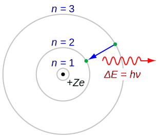
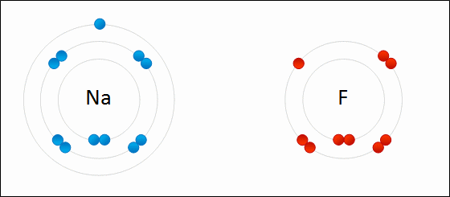
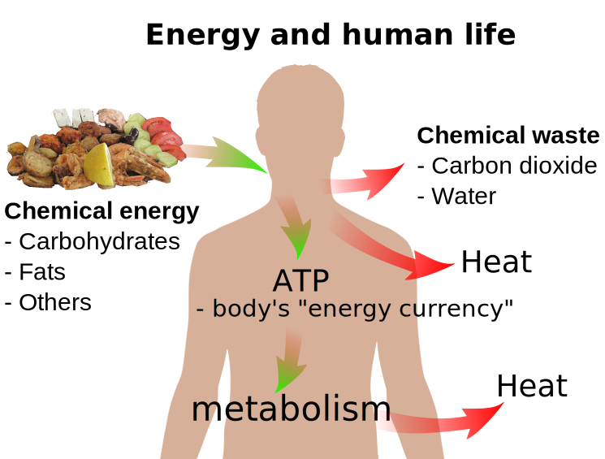
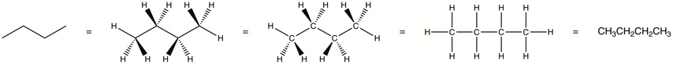
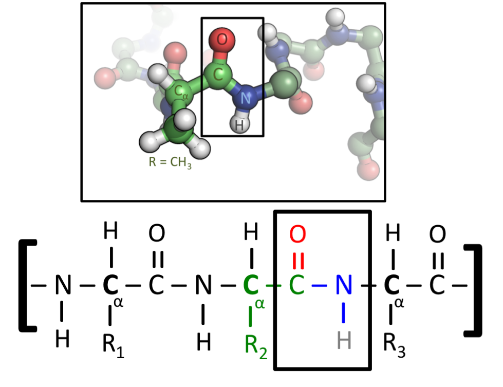
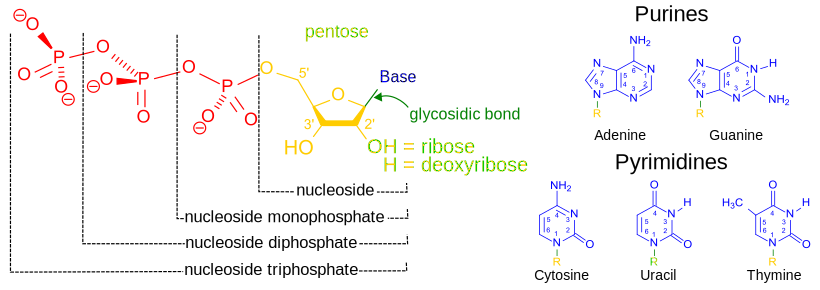

# The Chemistry Of Biology

Chemistry is the scientific discipline involved with elements and compounds composed of atoms, molecules and ions: their composition, structure, properties, behavior and the changes they undergo during a reaction with other substances.

In the scope of its subject, chemistry occupies an intermediate position between physics and biology. For example, chemistry explains aspects of plant chemistry (botany), the formation of igneous rocks (geology), how atmospheric ozone is formed and how environmental pollutants are degraded (ecology), the properties of the soil on the moon (astrophysics), how medications work (pharmacology), and how to collect DNA evidence at a crime scene (forensics).

Chemistry addresses topics such as how atoms and molecules interact via chemical bonds to form new chemical compounds. There are four types of chemical bonds: covalent bonds, in which compounds share one or more electron(s); ionic bonds, in which a compound donates one or more electrons to another compound to produce ions (cations and anions); hydrogen bonds; and Van der Waals force bonds.

The current model of atomic structure is the quantum mechanical model. Traditional chemistry starts with the study of elementary particles, atoms, molecules, substances, metals, crystals and other aggregates of matter. Matter can be studied in solid, liquid, gas and plasma states, in isolation or in combination. The interactions, reactions and transformations that are studied in chemistry are usually the result of interactions between atoms, leading to rearrangements of the chemical bonds which hold atoms together. 

A chemical reaction is a transformation of some substances into one or more different substances. The basis of such a chemical transformation is the rearrangement of electrons in the chemical bonds between atoms. It can be symbolically depicted through a chemical equation, which usually involves atoms as subjects. The number of atoms on the left and the right in the equation for a chemical transformation is equal. (When the number of atoms on either side is unequal, the transformation is referred to as a nuclear reaction or radioactive decay.) The type of chemical reactions a substance may undergo and the energy changes that may accompany it are constrained by certain basic rules, known as chemical laws.

## Matter

In classical physics and general chemistry, matter (from Latin materia meaning “matter, stuff, material”, a derivative of Latin mater meaning “mother”) is any substance that has mass and takes up space by having volume. Matter should not be confused with mass, as the two are not the same in modern physics. Matter is a general term describing any 'physical substance'. By contrast, mass is not a substance but rather a quantitative property of matter and other substances or systems. All everyday objects that can be touched are ultimately composed of atoms, which are made up of interacting subatomic particles, and in everyday as well as scientific usage, "matter" generally includes atoms and anything made up of them, and any particles (or combination of particles) that act as if they have both rest mass and volume. However it does not include massless particles such as photons, or other energy phenomena or waves such as light or sound. Matter exists in various states (also known as phases). These include classical everyday phases such as solid, liquid, and gas – for example water exists as ice, liquid water, and gaseous steam – but other states are possible, including plasma, Bose–Einstein condensates, fermionic condensates, and quark–gluon plasma.

Usually atoms can be imagined as a nucleus of protons and neutrons, and a surrounding "cloud" of orbiting electrons which "take up space". However this is only somewhat correct, because subatomic particles and their properties are governed by their quantum nature, which means they do not act as everyday objects appear to act – they can act like waves as well as particles and they do not have well-defined sizes or positions. In the Standard Model of particle physics, matter is not a fundamental concept because the elementary constituents of atoms are quantum entities which do not have an inherent "size" or "volume" in any everyday sense of the word. Due to the exclusion principle and other fundamental interactions, some "point particles" known as fermions (quarks, leptons), and many composites and atoms, are effectively forced to keep a distance from other particles under everyday conditions; this creates the property of matter which appears to us as matter taking up space.

## The Atom

An atom is the smallest unit of ordinary matter that forms a chemical element. Every solid, liquid, gas, and plasma is composed of neutral or ionized atoms. Atoms are extremely small, typically around 100 picometers across. They are so small that accurately predicting their behavior using classical physics—as if they were tennis balls, for example—is not possible due to quantum effects. The word atom is derived from Ancient Greek ἄτομος (átomos, “indivisible”), from ἀ- (a-, “not”) + τέμνω (témnō, “I cut”), which means "uncuttable".

Every atom is composed of a nucleus and one or more electrons surrounding the nucleus. The nucleus is made of one or more protons and a number of neutrons. Only the most common variety of hydrogen has no neutrons. More than 99.94% of an atom's mass is in the nucleus. The protons have a positive electric charge, the electrons have a negative electric charge, and the neutrons have no electric charge. If the number of protons and electrons are equal, then the atom is electrically neutral. If an atom has more or fewer electrons than protons, then it has an overall negative or positive charge, respectively — such atoms are called ions.

The electrons of an atom are attracted to the protons in an atomic nucleus by the electromagnetic force. The protons and neutrons in the nucleus are attracted to each other by the nuclear force. This force is usually stronger than the electromagnetic force that repels the positively charged protons from one another. Under certain circumstances, the repelling electromagnetic force becomes stronger than the nuclear force. In this case, the nucleus splits and leaves behind different elements. This is a form of nuclear decay.

The number of protons in the nucleus is the atomic number and it defines to which chemical element the atom belongs. For example, any atom that contains 29 protons is copper. The number of neutrons defines the isotope of the element. Atoms can attach to one or more other atoms by chemical bonds to form chemical compounds such as molecules or crystals. The ability of atoms to associate and dissociate is responsible for most of the physical changes observed in nature. Chemistry is the discipline that studies these changes.

Atoms are extremely small, typically around 100 picometers (1 picometer = 10^-12^m) across. They are so small that accurately predicting their behavior using classical physics—as if they were billiard balls, for example—is not possible due to quantum effects. Current atomic models use [quantum mechanics](https://en.wikipedia.org/wiki/Quantum_mechanics) to better explain and predict this behavior. The word quantum derives from the Latin, meaning "how great" or "how much". In quantum mechanics, it refers to a discrete unit assigned to certain physical quantities such as the energy of an atom at rest. The discovery that particles are discrete packets of energy with wave-like properties led to the branch of physics dealing with atomic and subatomic systems which is today called quantum mechanics. It underlies the mathematical framework of many fields of physics and chemistry.

Quantum mechanics is essential for understanding the behavior of systems at atomic length scales and smaller. If the physical nature of an atom were solely described by classical mechanics, electrons would not orbit the nucleus, since orbiting electrons emit radiation (due to circular motion) and so would quickly lose energy and collide with the nucleus. This framework was unable to explain the stability of atoms. Instead, electrons remain in an uncertain, non-deterministic, smeared, probabilistic wave–particle orbital about the nucleus, defying the traditional assumptions of classical mechanics and electromagnetism.

Quantum mechanics is also critically important for understanding how individual atoms are joined by covalent bonds to form molecules. The application of quantum mechanics to chemistry is known as quantum chemistry. Quantum mechanics can also provide quantitative insight into ionic and covalent bonding processes by explicitly showing which molecules are energetically favorable to which others and the magnitudes of the energies involved. Furthermore, most of the calculations performed in modern computational chemistry rely on quantum mechanics.

(ref:atom) An [illustration of the helium atom](https://commons.wikimedia.org/wiki/File:Helium_atom_QM.svg), depicting the nucleus (pink) and the electron cloud distribution (black). The nucleus (upper right) in helium-4 is in reality spherically symmetric and closely resembles the electron cloud, although for more complicated nuclei this is not always the case. The black bar is one angstrom (10^−10^ m or100 pm).

(\#fig:atomcartoon)(ref:atom)

For much of the history of the natural sciences people have contemplated the exact nature of matter. The idea that matter was built of discrete building blocks, the so-called particulate theory of matter, independently appeared in ancient Greece and ancient India among Buddhists, Hindus and Jains in 1st-millennium BC. Ancient philosophers who proposed the particulate theory of matter include Kanada (c. 6th–century BC or after), Leucippus (~490 BC) and Democritus (~470–380 BC).

In the early 1800s, [John Dalton](https://en.wikipedia.org/wiki/John_Dalton) compiled experimental data gathered by himself and other scientists and observed that chemical elements seemed to combine by weight in ratios of small whole numbers; he called this pattern the "law of multiple proportions". For instance, there are two types of tin oxide: one is 88.1% tin and 11.9% oxygen, and the other is 78.7% tin and 21.3% oxygen. Adjusting these figures, for every 100 g of tin there is either 13.5 g or 27 g of oxygen respectively. 13.5 and 27 form a ratio of 1:2, a ratio of small whole numbers. Similarly, there are two common types of iron oxide, in which for every 112 g of iron there is either 32 g or 48 g of oxygen respectively, which gives a ratio of 2:3. As a final example, there are three oxides of nitrogen in which for every 140 g of nitrogen, there is 80 g, 160 g, and 320 g of oxygen respectively, which gives a ratio of 1:2:4. This recurring pattern in the data suggested that elements always combine in multiples of discrete units, which Dalton concluded were atoms. In the case of the tin oxides, for every one tin atom, there are either one or two oxygen atoms (SnO and SnO~2~). In the case of the iron oxides, for every two iron atoms, there are either two or three oxygen atoms (FeO and Fe~2~O~3~). In the case of the nitrogen oxides, their formulas are N~2~O, NO, and NO~2~.

In the late 18th century, a number of scientists found that they could better explain the behavior of gases by describing them as collections of sub-microscopic particles and modelling their behavior using statistics and probability. Unlike Dalton's atomic theory, the kinetic theory of gases describes not how gases react chemically with each other to form compounds, but how they behave physically: diffusion, viscosity, conductivity, pressure, etc.

In 1827, botanist [Robert Brown](https://en.wikipedia.org/wiki/Robert_Brown_(botanist,_born_1773)) used a microscope to look at dust grains floating in water and discovered that they moved about erratically, a phenomenon that became known as "Brownian motion". This was thought to be caused by water molecules knocking the grains about. In 1905, [Albert Einstein](https://en.wikipedia.org/wiki/Albert_Einstein) proved the reality of these molecules and their motions by producing the first statistical physics analysis of Brownian motion. French physicist [Jean Perrin](https://en.wikipedia.org/wiki/Jean_Baptiste_Perrin) used Einstein's work to experimentally determine the mass and dimensions of atoms, thereby verifying Dalton's atomic theory.

In 1897, [J.J. Thomson](https://en.wikipedia.org/wiki/J._J._Thomson) discovered that cathode rays are not electromagnetic waves but made of particles that are 1,800 times lighter than hydrogen (the lightest atom). Therefore, they were not atoms, but a new particle, the first subatomic particle to be discovered. He called these new particles corpuscles but they were later renamed electrons. Thomson also showed that electrons were identical to particles given off by photoelectric and radioactive materials. It was quickly recognized that electrons are the particles that carry electric currents in metal wires, and carry the negative electric charge within atoms. Thus Thomson overturned the belief that atoms are the indivisible, fundamental particles of matter. The misnomer "atom" is still used, even though atoms are not literally "uncuttable".

J. J. Thomson postulated that the negatively-charged electrons were distributed throughout the atom in a uniform sea of positive charge. This was known as the plum pudding model. In 1909, [Hans Geiger](https://en.wikipedia.org/wiki/Hans_Geiger) and [Ernest Marsden](https://en.wikipedia.org/wiki/Ernest_Marsden), working under the direction of [Ernest Rutherford](https://en.wikipedia.org/wiki/Ernest_Rutherford), bombarded metal foil with alpha particles to observe how they scattered. They expected all the charged particles to pass straight through with little deflection, because Thomson's model said that the charges in the atom are so diffuse that their electric fields in the foil could not affect the alpha particles much. Yet Geiger and Marsden spotted alpha particles being deflected by angles greater than 90°, which was supposed to be impossible according to Thomson's model. To explain this, Rutherford proposed that the positive charge of the atom is concentrated in a tiny nucleus at the center. Only such an intense concentration of charge could produce an electric field strong enough to deflect alpha particles that much.

While experimenting with the products of radioactive decay, in 1913 radiochemist Frederick Soddy discovered that there appeared to be more than one type of atom at each position on the periodic table. The term isotope was coined by Margaret Todd as a suitable name for different atoms that belong to the same element. J.J. Thomson created a technique for isotope separation through his work on ionized gases, which subsequently led to the discovery of stable isotopes.

The development of the mass spectrometer allowed the mass of atoms to be measured with increased accuracy. The device uses a magnet to bend the trajectory of a beam of ions, and the amount of deflection is determined by the ratio of an atom's mass to its charge. The chemist [Francis William Aston](https://en.wikipedia.org/wiki/Francis_William_Aston) used this instrument to show that isotopes had different masses. The atomic mass of these isotopes varied by integer amounts, called the whole number rule. The explanation for these different isotopes awaited the discovery of the neutron, an uncharged particle with a mass similar to the proton, by the physicist [James Chadwick](https://en.wikipedia.org/wiki/James_Chadwick) in 1932. Isotopes were then explained as elements with the same number of protons, but different numbers of neutrons within the nucleus.

In 1913 the physicist [Niels Bohr](https://en.wikipedia.org/wiki/Niels_Bohr) proposed a model in which the electrons of an atom were assumed to orbit the nucleus but could only do so in a finite set of orbits, and could jump between these orbits only in discrete changes of energy corresponding to absorption or radiation of a photon. This quantization was used to explain why the electrons' orbits are stable (given that normally, charges in acceleration, including circular motion, lose kinetic energy which is emitted as electromagnetic radiation, see synchrotron radiation) and why elements absorb and emit electromagnetic radiation in discrete spectra.

(ref:bohr) Niels Bohr's 1913 [quantum model of the atom](https://en.wikipedia.org/wiki/Bohr_model#/media/File:Bohr_atom_model.svg), which incorporated an explanation of Johannes Rydberg's 1888 formula, Max Planck's 1900 quantum hypothesis, i.e. that atomic energy radiators have discrete energy values (ε = hν), J. J. Thomson's 1904 plum pudding model, Albert Einstein's 1905 light quanta postulate, and Ernest Rutherford's 1907 discovery of the atomic nucleus. Note that the electron does not travel along the black line when emitting a photon. It "jumps", disappearing from the outer orbit and appearing in the inner one and cannot exist in the space between orbits 2 and 3. The Bohr model of the hydrogen atom (Z = 1) or a hydrogen-like ion (Z > 1), where the negatively charged electron confined to an atomic shell encircles a small, positively charged atomic nucleus and where an electron jumps between orbits, is accompanied by an emitted or absorbed amount of electromagnetic energy (hν). The orbits in which the electron may travel are shown as grey circles; their radius increases as n2, where n is the principal quantum number. The 3 → 2 transition depicted here produces the first line of the Balmer series, and for hydrogen (Z = 1) it results in a photon of wavelength 656 nm (red light). 

(\#fig:bohrmodel)(ref:bohr)

Later in the same year Henry Moseley provided additional experimental evidence in favor of Niels Bohr's theory. These results refined Ernest Rutherford's and Antonius Van den Broek's model, which proposed that the atom contains in its nucleus a number of positive nuclear charges that is equal to its (atomic) number in the periodic table. Until these experiments, atomic number was not known to be a physical and experimental quantity. That it is equal to the atomic nuclear charge remains the accepted atomic model today.

Atomic dimensions are thousands of times smaller than the wavelengths of light (400–700 nm) so they cannot be viewed using an optical microscope, although individual atoms can be observed using a scanning tunneling microscope. To visualize the minuteness of the atom, consider that a typical human hair is about 1 million carbon atoms in width. A single drop of water contains about 2 sextillion (2×10^21^) atoms of oxygen, and twice the number of hydrogen atoms. A single carat diamond with a mass of 2×10^−4^ kg contains about 10 sextillion (10^22^) atoms of carbon. If an apple were magnified to the size of the Earth, then an atom would be approximately the size of the original apple.

### Structure of The Atom

Though the word atom originally denoted a particle that cannot be cut into smaller particles, in modern scientific usage the atom is composed of various subatomic particles. The constituent particles of an atom are the electron, the proton and the neutron.

The electron is by far the least massive of these particles at 9.11×10^−31^ kg, with a negative electrical charge and a size that is too small to be measured using available techniques. Under ordinary conditions, electrons are bound to the positively charged nucleus by the attraction created from opposite electric charges. If an atom has more or fewer electrons than its atomic number, then it becomes respectively negatively or positively charged as a whole; a charged atom is called an ion. 

Protons have a positive charge and a mass 1,836 times that of the electron, at 1.6726×10^−27^ kg. The number of protons in an atom is called its atomic number. 

Neutrons have no electrical charge and have a free mass of 1,839 times the mass of the electron, or 1.6749×10^−27^ kg. Neutrons are the heaviest of the three constituent particles, but their mass can be reduced by the nuclear binding energy. Neutrons and protons (collectively known as nucleons) have comparable dimensions—on the order of 2.5×10^−15^ m.

In the Standard Model of physics, electrons are truly elementary particles with no internal structure, whereas protons and neutrons are composite particles composed of elementary particles called quarks. There are two types of quarks in atoms, each having a fractional electric charge. Protons are composed of two up quarks (each with charge $+\frac{2}{3}$) and one down quark (with a charge of $−\frac{1}{3}$). Neutrons consist of one up quark and two down quarks. This distinction accounts for the difference in mass and charge between the two particles.

The quarks are held together by the strong interaction (or strong force), which is mediated by gluons. The protons and neutrons, in turn, are held to each other in the nucleus by the nuclear force, which is a residuum of the strong force that has somewhat different range-properties (see the article on the nuclear force for more). The gluon is a member of the family of gauge bosons, which are elementary particles that mediate physical forces.

### The Atomic Nucleus

The nucleus of an atom consists of neutrons and protons, which in turn are the manifestation of more elementary particles, called quarks, that are held together by the nuclear strong force. The nuclear strong force extends far enough so as to bind the neutrons and protons together against the repulsive electrical force between the positively charged protons. The nuclear strong force has a very short range, and essentially drops to zero just beyond the edge of the nucleus. The collective action of the positively charged nucleus is to hold the electrically negative charged electrons in their orbits about the nucleus. The collection of negatively charged electrons orbiting the nucleus display an affinity for certain configurations and numbers of electrons that make their orbits stable. Which chemical element an atom represents is determined by the number of protons in the nucleus; the neutral atom will have an equal number of electrons orbiting that nucleus. Individual chemical elements can create more stable electron configurations by combining to share their electrons. It is that sharing of electrons to create stable electronic orbits about the nucleus that appears to us as the chemistry of our world.

Protons define the entire charge of a nucleus, and hence its chemical identity. Neutrons are electrically neutral, but contribute to the mass of a nucleus to nearly the same extent as the protons. Neutrons can explain the phenomenon of isotopes (same atomic number with different atomic mass). The main role of neutrons is to reduce electrostatic repulsion inside the nucleus.

The electrons of an atom are attracted to the protons in an atomic nucleus by the electromagnetic force. The protons and neutrons in the nucleus are attracted to each other by the nuclear force. This force is usually stronger than the electromagnetic force that repels the positively charged protons from one another. Under certain circumstances, the repelling electromagnetic force becomes stronger than the nuclear force. In this case, the nucleus splits and leaves behind different elements. This is a form of nuclear decay.

The number of protons in the nucleus is the atomic number and it defines to which chemical element the atom belongs. For example, any atom that contains 6 protons is carbon. The number of neutrons defines the isotope of the element. For example, the most common isotope of carbon is ^12^C with 6 neutrons. Another carbon isotope found in nature is ^14^C, which has 8 neutrons. Atoms can attach to one or more other atoms by chemical bonds to form chemical compounds such as molecules or crystals. The ability of atoms to associate and dissociate is responsible for most of the physical changes observed in nature.

### The Electron Cloud

The electron cloud is a region surrounding the nucleus. The electrons in an atom are attracted to the protons in the nucleus by the electromagnetic force. This force binds the electrons to the nucleus, which means that an external source of energy is needed for the electron to escape. The closer an electron is to the nucleus, the greater the attractive force. Hence the electrons that are closer to the nucleus require more energy to escape than those at greater separations.

Electrons, like other particles, have properties of both a particle and a wave. In atomic theory and quantum mechanics, an atomic orbital is a mathematical function describing the location and wave-like behavior of electrons surrounding an atom. The term "orbital" was coined by [Robert Mulliken](https://en.wikipedia.org/wiki/Robert_S._Mulliken) in 1932 as an abbreviation for one-electron orbital wave function. The term atomic orbital is also used to refer to the physical region or space where the electron can be calculated to be present using this function. Each atomic orbital corresponds to a particular energy level of the electron. The electron can change its state to a higher energy level by absorbing sufficient energy to boost it into the new quantum state. Likewise, through spontaneous emission, an electron in a higher energy state can drop to a lower energy state while radiating the excess energy. 

The electrons in an atom are described by a unique set of values of four so-called quantum numbers n, ℓ, and m~ℓ~, and s. As n increases, the electron is farther from the nucleus, on average, has a higher energy and is, therefore, less tightly bound to the nucleus. For each value of n, ℓ can take integer (whole number) values ranging from 0 to n − 1 and m~ℓ~  can take integer values ranging from -ℓ to +ℓ, and s can take a value of ($+\frac{1}{2}$ or $-\frac{1}{2}$) for each value of ℓ and m~ℓ~. Hence, higher-n electron states are more numerous. Thus, each n-shell can accommodate up to a maximum of 2n^2^ electrons. In chemistry, values n = 1, 2, 3, 4, 5, 6, 7 correspond to the so-called electron shells, which may be thought of as onion-like layers surrounding the nucleus that are filled with electrons. The shell terminology comes from [Arnold Sommerfeld's](https://en.wikipedia.org/wiki/Arnold_Sommerfeld) modification of the Bohr model. Sommerfeld retained Bohr's planetary model (electrons orbiting the atomic nucleus like planets the sun), but added orbits that formed a thick "shell" instead of the infinitely thin circular orbit of Bohr's model. The closest shell to the nucleus is called the "1 shell" (also called the "K shell"), followed by the "2 shell" (or "L shell"), then the "3 shell" (or "M shell"), and so on farther and farther from the nucleus. The shells correspond to the principal quantum numbers (n = 1, 2, 3, 4 ...) or are labeled alphabetically with the letters used in [X-ray notation](https://en.wikipedia.org/wiki/x-ray_notation) (K, L, M, …). Each shell is composed of one or more subshells (labeled with the letters s, p, d, and f, which are derived from the terms *s*harp, *p*rincipal, *d*iffuse, and *f*undamental historically used in the description of atomic spectral lines). For example, the first shell (with principal quantum number n = 1 also referred to as K shell) has one subshell, called 1s; the second (with principal quantum number n = 2 also referred to as L shell) shell has two subshells, called 2s (ℓ = 0) and 2p (ℓ = 1 and m~ℓ~ = -1, 0, 1); the third shell (with principal quantum number n = 3 also referred to as M shell) has 3s (ℓ = 0), 3p (ℓ = 1 and m~ℓ~ = -1, 0, 1), and 3d (ℓ = 2 and m~ℓ~ = -2, -1, 0, 1, 2); the fourth shell (with principal quantum number n = 4 also referred to as N shell) has 4s, 4p, 4d and 4f; the fifth shell (with principal quantum number n = 5 also referred to as O shell) has 5s, 5p, 5d, and 5f and can theoretically hold more in the 5g subshell that is not occupied in the ground-state electron configuration of any known element. 

(ref:atomorb) [The five filled atomic orbitals of a neon atom](https://commons.wikimedia.org/wiki/File:S-p-Orbitals.svg) separated and arranged in order of increasing energy from left to right, with the last three orbitals being equal in energy. Each orbital holds up to two electrons, which most probably exist in the zones represented by the colored bubbles. Each electron is equally present in both orbital zones, shown here by color only to highlight the different wave phase.

(\#fig:atomicorbitals)(ref:atomorb)

Several rules govern the placement of electrons in orbitals in each atom referred to as the atom's electron configuration. The first dictates that no two electrons in an atom may have the same set of values of quantum numbers (this is the Pauli exclusion principle). These quantum numbers include the three that define orbitals, as well as s, or spin quantum number. Thus, two electrons may occupy a single orbital, so long as they have different values of s. However, only two electrons, because of their spin, can be associated with each orbital.

Additionally, an electron always tends to fall to the lowest possible energy state. It is possible for it to occupy any orbital so long as it does not violate the Pauli exclusion principle, but if lower-energy orbitals are available, this condition is unstable. The electron will eventually lose energy (by releasing a photon) and drop into the lower orbital. Thus, electrons fill orbitals in the order specified by the energy sequence given above. This behavior is responsible for the structure of the periodic table.

## The Periodic Table of The Elements

The [periodic table](https://en.wikipedia.org/wiki/Periodic_table), also known as the periodic table of elements, is a tabular display of the chemical elements. In chemistry, an element is a pure substance which cannot be broken down by chemical means, consisting of atoms which have identical numbers of protons in their atomic nuclei. The number of protons in the nucleus is the defining property of an element, and is referred to as the atomic number (represented by the symbol Z). The mass number is the sum of the number of protons and neutrons in a nucleus. Although all the nuclei of all atoms belonging to one element will have the same atomic number, they may not necessarily have the same mass number; atoms of an element which have different mass numbers are known as isotopes. For example, all atoms with 6 protons in their nuclei are atoms of the chemical element carbon, but atoms of carbon may have mass numbers of 12 or 13.

In the periodic table, elements are arranged by atomic number, electron configuration, and recurring chemical properties. The organization of the periodic table can be used to derive relationships between the various element properties, and also to predict chemical properties and behaviours of undiscovered or newly synthesized elements. Russian chemist [Dmitri Mendeleev](https://en.wikipedia.org/wiki/Dmitri_Mendeleev) published the first recognizable periodic table in 1869, developed mainly to illustrate periodic trends of the then-known elements. He also predicted some properties of unidentified elements that were expected to fill gaps within the table. Most of his forecasts proved to be correct. Mendeleev's idea has been slowly expanded and refined with the discovery or synthesis of further new elements and the development of new theoretical models to explain chemical behaviour. In total, 118 elements have been identified. The first 94 occur naturally on Earth, and the remaining 24 are synthetic elements produced in nuclear reactions. 

(ref:period) [A simple depiction of the periodic table of the elements.](https://commons.wikimedia.org/wiki/File:Simple_Periodic_Table_Chart-en.svg)  

(\#fig:periodictable)(ref:period)

The structure of the table shows periodic trends. The seven rows of the table, called periods, generally have metals on the left and nonmetals on the right. The columns, called groups, contain elements with similar chemical behaviours. Six groups have accepted names as well as assigned numbers: for example, group 17 elements are the halogens; and group 18 are the noble gases. Also displayed are four simple rectangular areas or blocks associated with the filling of different atomic orbitals.

The periodic table may also be divided into several numbered rectangular 'blocks'. The elements belonging to a given block have this common feature: their highest-energy electrons all belong to the same ℓ-state (but the n associated with that ℓ-state depends upon the period). For instance, the leftmost two columns constitute the 's-block'. The outermost electrons of Li and Be respectively belong to the 2s subshell, and those of Na and Mg to the 3s subshell.

The following is the order for filling the "subshell" orbitals, which also gives the order of the "blocks" in the periodic table:

1s, 2s, 2p, 3s, 3p, 4s, 3d, 4p, 5s, 4d, 5p, 6s, 4f, 5d, 6p, 7s, 5f, 6d, 7p

The "periodic" nature of the filling of orbitals, as well as emergence of the s, p, d, and f "blocks", is more obvious if this order of filling is given in matrix form, with increasing principal quantum numbers starting the new rows ("periods") in the matrix. Then, each subshell (composed of the first two quantum numbers) is repeated as many times as required for each pair of electrons it may contain. The result is a compressed periodic table, with each entry representing two successive elements:

|    |    |    |    |    |    |    |    |    |    |    |    |    |    |    |    |
|----|----|----|----|----|----|----|----|----|----|----|----|----|----|----|----|
| 1s |    |    |    |    |    |    |    |    |    |    |    |    |    |    |    |
| 2s |    |    |    |    |    |    |    |    |    |    |    |    | 2p | 2p | 2p |
| 3s |    |    |    |    |    |    |    |    |    |    |    |    | 3p | 3p | 3p |
| 4s |    |    |    |    |    |    |    | 3d | 3d | 3d | 3d | 3d | 4p | 4p | 4p |
| 5s |    |    |    |    |    |    |    | 4d | 4d | 4d | 4d | 4d | 5p | 5p | 5p |
| 6s | 4f | 4f | 4f | 4f | 4f | 4f | 4f | 5d | 5d | 5d | 5d | 5d | 6p | 6p | 6p |
| 7s | 5f | 5f | 5f | 5f | 5f | 5f | 5f | 6d | 6d | 6d | 6d | 6d | 7p | 7p | 7p |

Although this is the general order of orbital filling, there are exceptions, and the actual electronic energies of each element are also dependent upon additional details of the atoms. 

The number of electrons in an electrically neutral atom increases with the atomic number. The electrons in the outermost shell of a given atom, called valence electrons, tend to be responsible for an element's chemical behavior. Elements that contain the same number of valence electrons can be grouped together and display similar chemical properties. The elements at the far right of the table have their outer shell completely filled with electrons, which results in chemically inert elements known as the noble gases.

## Chemical Bonds, Molecules, And Compounds 

A chemical bond is an attraction between atoms. This attraction may be seen as the result of different behaviors of the outermost or valence electrons of atoms. Chemical bonds between atoms were explained by [Gilbert Newton Lewis](https://en.wikipedia.org/wiki/Gilbert_N._Lewis) in 1916, as the interactions between their constituent electrons. As the chemical properties of the elements were known to largely repeat themselves according to the periodic law, in 1919 the American chemist [Irving Langmuir](https://en.wikipedia.org/wiki/Irving_Langmuir) suggested that this could be explained if the electrons in an atom were connected or clustered in some manner. Groups of electrons were thought to occupy a set of electron shells about the nucleus.

(ref:bond) [Examples of Lewis dot-style representations of chemical bonds](https://en.wikipedia.org/wiki/Chemical_bond#/media/File:Electron_dot.svg) between carbon (C), hydrogen (H), and oxygen (O). Lewis dot diagrams were an early attempt to describe chemical bonding and are still widely used today. 

(\#fig:lewisbond)(ref:bond)

A chemical bond can be a [covalent bond](https://en.wikipedia.org/wiki/Covalent_bond), an [ionic bond](https://en.wikipedia.org/wiki/Ionic_bonding), a [hydrogen bond](https://en.wikipedia.org/wiki/Hydrogen_bond) or just because of Van der Waals force. All bonds can be explained by quantum theory, but, in practice, simplification rules allow chemists to predict the strength, directionality, and polarity of bonds.

Covalent bonding is a common type of bonding in which two or more atoms share valence electrons more or less equally. The simplest and most common type is a single bond in which two atoms share two electrons. Other types include the double bond, the triple bond. In non-polar covalent bonds, the electrons are shared equally between the bonding atoms. Molecules that are formed primarily from non-polar covalent bonds are often immiscible in water or other polar solvents, but much more soluble in non-polar solvents such as hexane. A polar covalent bond is a covalent bond with a significant ionic character. This means that the two shared electrons are closer to one of the atoms than the other, creating an imbalance of charge. 

Atoms will share valence electrons in such a way as to create a noble gas electron configuration (eight electrons in their outermost shell) for each atom. Atoms that tend to combine in such a way that they each have eight electrons in their valence shell are said to follow the octet rule. However, some elements like hydrogen and lithium need only two electrons in their outermost shell to attain this stable configuration; these atoms are said to follow the duet rule, and in this way they are reaching the electron configuration of the noble gas helium, which has two electrons in its outer shell. In a polar covalent bond, one or more electrons are unequally shared between two nuclei. 

(ref:covalent) [A covalent bond between two hydrogen atoms forming a hydrogen molecule.](https://commons.wikimedia.org/wiki/File:Covalent_bond_hydrogen.svg) 

(\#fig:covalentbond)(ref:covalent)

        
An ionic bond is formed when a metal loses one or more of its electrons, becoming a positively charged cation, and the electrons are then gained by the non-metal atom, becoming a negatively charged anion. The two oppositely charged ions attract one another, and the ionic bond is the electrostatic force of attraction between them. For example, sodium (Na), a metal, loses one electron to become an Na^+^ cation while chlorine (Cl), a non-metal, gains this electron to become Cl−. The ions are held together due to electrostatic attraction, and that compound sodium chloride (NaCl), or common table salt, is formed.

(ref:ionic) [Formation of an ionic bond.](https://commons.wikimedia.org/wiki/File:NaF.gif) Sodium and fluorine atoms undergoing a redox reaction to form sodium fluoride. Sodium loses its outer electron to give it a stable electron configuration, and this electron enters the fluorine atom exothermically. The oppositely charged ions – typically a great many of them – are then attracted to each other to form a solid.

(\#fig:ionicbond)(ref:ionic)

A molecule (from French molécule, from New Latin molecula (“a molecule”), diminutive of Latin moles (“a mass”); see mole + -cule.) is a group of two or more atoms held together by chemical bonds. A molecule may be homonuclear, that is, it consists of atoms of one chemical element, as with two atoms in the oxygen molecule (O~2~); or it may be heteronuclear, a chemical compound composed of more than one element, as with water (two hydrogen atoms and one oxygen atom; H~2~O).

Molecules exist as electrically neutral units, unlike ions. When this rule is broken, giving the "molecule" a charge, the result is sometimes named a molecular ion or a polyatomic ion. 

The "inert" or noble gas elements (helium, neon, argon, krypton, xenon and radon) are composed of lone atoms as their smallest discrete unit, but the other isolated chemical elements consist of either molecules or networks of atoms bonded to each other in some way. Identifiable molecules compose familiar substances such as water, air, and many organic compounds like alcohol, sugar, gasoline, and the various pharmaceuticals.

However, not all substances or chemical compounds consist of discrete molecules, and indeed most of the solid substances that make up the solid crust, mantle, and core of the Earth are chemical compounds without molecules. These other types of substances, such as ionic compounds and network solids, are organized in such a way as to lack the existence of identifiable molecules per se. Instead, these substances are discussed in terms of formula units or unit cells as the smallest repeating structure within the substance. Examples of such substances are mineral salts (such as table salt), solids like carbon and diamond, metals, and familiar silica and silicate minerals such as quartz and granite.

One of the main characteristics of a molecule is its geometry often called its structure. While the structure of diatomic, triatomic or tetra-atomic molecules may be trivial, (linear, angular pyramidal etc.) the structure of polyatomic molecules, that are constituted of more than six atoms (of several elements) can be crucial for its chemical nature.

## Energy

In physics, energy (from the Ancient Greek: ἐνέργεια, romanized: energeia, lit. 'activity, operation') is the quantitative property that must be transferred to an object in order to perform work on, or to heat, the object. Energy is a conserved quantity; the law of conservation of energy states that energy can be converted in form, but not created or destroyed. The SI unit of energy is the joule, which is the energy transferred to an object by the work of moving it a distance of 1 metre against a force of 1 newton.

The American physist [Richard Feynman](https://en.wikipedia.org/wiki/Richard_Feynman) said during a 1961 lecture:

>There is a fact, or if you wish, a law, governing all natural phenomena that are known to date. There is no known exception to this law – it is exact so far as we know. The law is called the conservation of energy. It states that there is a certain quantity, which we call energy, that does not change in manifold changes which nature undergoes. That is a most abstract idea, because it is a mathematical principle; it says that there is a numerical quantity which does not change when something happens. It is not a description of a mechanism, or anything concrete; it is just a strange fact that we can calculate some number and when we finish watching nature go through her tricks and calculate the number again, it is the same.
        
>— The Feynman Lectures on Physics

Common forms of energy include the kinetic energy of a moving object, the potential energy stored by an object's position in a force field (gravitational, electric or magnetic), the elastic energy stored by stretching solid objects, the chemical energy released when a fuel burns, the radiant energy carried by light, and the thermal energy due to an object's temperature.

Mass and energy are closely related. Due to mass–energy equivalence, any object that has mass when stationary (called rest mass) also has an equivalent amount of energy whose form is called rest energy, and any additional energy (of any form) acquired by the object above that rest energy will increase the object's total mass just as it increases its total energy. For example, after heating an object, its increase in energy could be measured as a small increase in mass, with a sensitive enough scale.

Living organisms require energy to stay alive, such as the energy humans get from food. Human civilization requires energy to function, which it gets from energy resources such as fossil fuels, nuclear fuel, or renewable energy. The processes of Earth's climate and ecosystem are driven by the radiant energy Earth receives from the sun and the geothermal energy contained within the earth.

(ref:energ) [Basic overview of energy and human life.](https://commons.wikimedia.org/wiki/File:Energy_and_life.svg) 

(\#fig:energylife)(ref:energ)

In 1843, [James Prescott Joule](https://en.wikipedia.org/wiki/James_Prescott_Joule) discovered the link between mechanical work and the generation of heat in a series of experiments. The most famous of them used the "Joule apparatus": a descending weight, attached to a string, caused rotation of a paddle immersed in water, practically insulated from heat transfer. It showed that the gravitational potential energy lost by the weight in descending was equal to the internal energy gained by the water through friction with the paddle.

(ref:joule) [Joule's apparatus for measuring the mechanical equivalent of heat. A descending weight attached to a string causes a paddle immersed in water to rotate.](https://commons.wikimedia.org/wiki/File:Joule%27s_Apparatus_(Harper%27s_Scan).png) 

(\#fig:jouleapparatus)(ref:joule)

In the International System of Units (SI), the unit of energy is the joule, named after James Prescott Joule. It is a derived unit. It is equal to the energy expended (or work done) in applying a force of one newton through a distance of one metre. However energy is also expressed in many other units not part of the SI, such as ergs, calories, British Thermal Units, kilowatt-hours and kilocalories, which require a conversion factor when expressed in SI units.

The SI unit of energy rate (energy per unit time) is the watt, which is a joule per second. Thus, one joule is one watt-second, and 3600 joules equal one watt-hour. The CGS energy unit is the erg and the imperial and US customary unit is the foot pound. Other energy units such as the electronvolt, food calorie or thermodynamic kcal (based on the temperature change of water in a heating process), and BTU are used in specific areas of science and commerce.

In the context of chemistry, energy is an attribute of a substance as a consequence of its atomic, molecular or aggregate structure. Since a chemical transformation is accompanied by a change in one or more of these kinds of structures, it is invariably accompanied by an increase or decrease of energy of the substances involved. Some energy is transferred between the surroundings and the reactants of the reaction in the form of heat or light; thus the products of a reaction may have more or less energy than the reactants.

A reaction is said to be exergonic if the final state is lower on the energy scale than the initial state; in the case of endergonic reactions the situation is the reverse. A reaction is said to be exothermic if the reaction releases heat to the surroundings; in the case of endothermic reactions, the reaction absorbs heat from the surroundings.

Chemical reactions are invariably not possible unless the reactants surmount an energy barrier known as the activation energy. The activation energy (E~a~) of a reaction is measured in joules per mole (J/mol), kilojoules per mole (kJ/mol) or kilocalories per mole (kcal/mol). For a chemical reaction to proceed at a reasonable rate, the temperature of the system should be high enough such that there exists an appreciable number of molecules with translational energy equal to or greater than the activation energy. The term Activation Energy was introduced in 1889 by the Swedish scientist [Svante Arrhenius](https://en.wikipedia.org/wiki/Svante_Arrhenius). The Arrhenius equation gives the quantitative basis of the relationship between the activation energy and the rate at which a reaction proceeds. From the equation, the activation energy can be found through the relation
$$ k=A\mathrm{e}^{-E_a/(RT)} $$ 
where A is the pre-exponential factor for the reaction, R is the universal gas constant, T is the absolute temperature (usually in kelvins), and k is the reaction rate coefficient. Even without knowing A, E~a~ can be evaluated from the variation in reaction rate coefficients as a function of temperature (within the validity of the Arrhenius equation).The activation energy necessary for a chemical reaction to occur can be in the form of heat, light, electricity or mechanical force.

A substance that modifies the transition state to lower the activation energy is termed a catalyst; a catalyst composed only of protein and (if applicable) small molecule cofactors is termed an enzyme. A catalyst increases the rate of reaction without being consumed in the reaction. In addition, the catalyst lowers the activation energy, but it does not change the energies of the original reactants or products, and so does not change equilibrium. Rather, the reactant energy and the product energy remain the same and only the activation energy is altered (lowered).

(ref:activation) [Example of an enzyme-catalysed exothermic reaction.](https://commons.wikimedia.org/wiki/File:Activation2_updated.svg)

(\#fig:activationenergydiagram)(ref:activation)

A catalyst is able to reduce the activation energy by forming a transition state in a more favorable manner. Catalysts, by nature, create a more "comfortable" fit for the substrate of a reaction to progress to a transition state. This is possible due to a release of energy that occurs when the substrate binds to the active site of a catalyst. This energy is known as Binding Energy. Upon binding to a catalyst, substrates partake in numerous stabilizing forces while within the active site (i.e. Hydrogen bonding, van der Waals forces). Specific and favorable bonding occurs within the active site until the substrate forms to become the high-energy transition state. Forming the transition state is more favorable with the catalyst because the favorable stabilizing interactions within the active site release energy. A chemical reaction is able to manufacture a high-energy transition state molecule more readily when there is a stabilizing fit within the active site of a catalyst. The binding energy of a reaction is this energy released when favorable interactions between substrate and catalyst occur. The binding energy released assists in achieving the unstable transition state. Reactions otherwise without catalysts need a higher input of energy to achieve the transition state. Non-catalyzed reactions do not have free energy available from active site stabilizing interactions, such as catalytic enzyme reactions.

A related concept free energy, which also incorporates entropy considerations, is a very useful means for predicting the feasibility of a reaction and determining the state of equilibrium of a chemical reaction, in chemical thermodynamics. A reaction is feasible only if the total change in the Gibbs free energy is negative, $$ \Delta G \leq 0 $$ if it is equal to zero the chemical reaction is said to be at equilibrium.

There exist only limited possible states of energy for electrons, atoms and molecules. These are determined by the rules of quantum mechanics, which require quantization of energy of a bound system. The atoms/molecules in a higher energy state are said to be excited. The molecules/atoms of substance in an excited energy state are often much more reactive; that is, more amenable to chemical reactions.

## Chemical Reactions

When a chemical substance is transformed as a result of its interaction with another substance or with energy, a chemical reaction is said to have occurred. A chemical reaction is therefore a concept related to the "reaction" of a substance when it comes in close contact with another, whether as a mixture or a solution; exposure to some form of energy, or both. It results in some energy exchange between the constituents of the reaction as well as with the system environment, which may be designed vessels—often laboratory glassware.

Chemical reactions can result in the formation or dissociation of molecules, that is, molecules breaking apart to form two or more molecules or rearrangement of atoms within or across molecules. Chemical reactions usually involve the making or breaking of chemical bonds. Oxidation, reduction, dissociation, acid-base neutralization and molecular rearrangement are some of the commonly used kinds of chemical reactions.

A chemical reaction can be symbolically depicted through a chemical equation. In a chemical reaction the number and kind of atoms on both sides of the equation are always equal. This fact is referred to as the the law of conservation of mass. The law implies that mass can neither be created nor destroyed, although it may be rearranged in space, or the entities associated with it may be changed in form. For example, in chemical reactions, the mass of the chemical components before the reaction is equal to the mass of the components after the reaction. Thus, during any chemical reaction and low-energy thermodynamic processes in an isolated system, the total mass of the reactants, or starting materials, must be equal to the mass of the products.

## Radioactive Decay of Atoms

Radioactive decay (also known as nuclear decay, radioactivity, radioactive disintegration or nuclear disintegration) is the process by which an unstable atomic nucleus loses energy by radiation. Every element has one or more isotopes that have unstable nuclei that are subject to radioactive decay, causing the nucleus to emit particles or electromagnetic radiation. Radioactivity can occur when the radius of a nucleus is large compared with the radius of the strong force, which only acts over distances on the order of 1 fm.

The most common forms of radioactive decay are:

* Alpha decay: this process is caused when the nucleus emits an alpha particle, which is a helium nucleus consisting of two protons and two neutrons. The result of the emission is a new element with a lower atomic number.
* Beta decay (and electron capture): these processes are regulated by the weak force, and result from a transformation of a neutron into a proton, or a proton into a neutron. The neutron to proton transition is accompanied by the emission of an electron and an antineutrino, while proton to neutron transition (except in electron capture) causes the emission of a positron and a neutrino. The electron or positron emissions are called beta particles. Beta decay either increases or decreases the atomic number of the nucleus by one. Electron capture is more common than positron emission, because it requires less energy. In this type of decay, an electron is absorbed by the nucleus, rather than a positron emitted from the nucleus. A neutrino is still emitted in this process, and a proton changes to a neutron.
* Gamma decay: this process results from a change in the energy level of the nucleus to a lower state, resulting in the emission of electromagnetic radiation. The excited state of a nucleus which results in gamma emission usually occurs following the emission of an alpha or a beta particle. Thus, gamma decay usually follows alpha or beta decay.

Each radioactive isotope has a characteristic decay time period—the half-life—that is determined by the amount of time needed for half of a sample to decay. This is an exponential decay process that steadily decreases the proportion of the remaining isotope by 50% every half-life. Hence after two half-lives have passed only 25% of the isotope is present, and so forth.

Within living things, isotopic labels (both radioactive and nonradioactive) can be used to probe how the complex web of reactions which makes up the metabolism of an organism converts one substance to another. For instance a green plant uses light energy to convert water and carbon dioxide into glucose by photosynthesis. When plants performed photoshytnesis using water in which the oxygen was the heavy oxygen (^18^O) isotope, this oxygen isotope appeared in the oxygen gas formed by the plant and not in the glucose formed in the chloroplasts within the plant cells.

Radioactivity was discovered in 1896 by the French scientist [Henri Becquerel](https://en.wikipedia.org/wiki/Henri_Becquerel), while working with phosphorescent materials. These materials glow in the dark after exposure to light, and he suspected that the glow produced in cathode ray tubes by X-rays might be associated with phosphorescence. He wrapped a photographic plate in black paper and placed various phosphorescent salts on it. All results were negative until he used uranium salts. The uranium salts caused a blackening of the plate in spite of the plate being wrapped in black paper. These radiations were given the name "Becquerel Rays".

It soon became clear that the blackening of the plate had nothing to do with phosphorescence, as the blackening was also produced by non-phosphorescent salts of uranium and by metallic uranium. It became clear from these experiments that there was a form of invisible radiation that could pass through paper and was causing the plate to react as if exposed to light.

At first, it seemed as though the new radiation was similar to the then recently discovered X-rays. Further research by Becquerel, [Ernest Rutherford](https://en.wikipedia.org/wiki/Ernest_Rutherford), [Paul Villard](https://en.wikipedia.org/wiki/Paul_Ulrich_Villard), [Pierre Curie](https://en.wikipedia.org/wiki/Pierre_Curie), [Marie Curie](https://en.wikipedia.org/wiki/Marie_Curie), and others showed that this form of radioactivity was significantly more complicated. Rutherford was the first to realize that all such elements decay in accordance with the same mathematical exponential formula. Rutherford and his student Frederick Soddy were the first to realize that many decay processes resulted in the transmutation of one element to another. Subsequently, the radioactive displacement law of Fajans and Soddy was formulated to describe the products of alpha and beta decay.

The early researchers also discovered that many other chemical elements, besides uranium, have radioactive isotopes. A systematic search for the total radioactivity in uranium ores also guided Pierre and Marie Curie to isolate two new elements: polonium and radium. Except for the radioactivity of radium, the chemical similarity of radium to barium made these two elements difficult to distinguish.

Marie and Pierre Curie's study of radioactivity is an important factor in science and medicine. After their research on Becquerel's rays led them to the discovery of both radium and polonium, they coined the term "radioactivity". Their research on the penetrating rays in uranium and the discovery of radium launched an era of using radium for the treatment of cancer. Their exploration of radium could be seen as the first peaceful use of nuclear energy and the start of modern nuclear medicine.

## Ions And Salts

An ion is a charged species, an atom or a molecule, that has lost or gained one or more electrons. When an atom loses an electron and thus has more protons than electrons, the atom is a positively charged ion or cation. When an atom gains an electron and thus has more electrons than protons, the atom is a negatively charged ion or anion. Cations and anions can form a crystalline lattice of neutral salts, such as the Na^+^ and Cl^−^ ions forming sodium chloride, or NaCl. Examples of polyatomic ions that do not split up during acid-base reactions are hydroxide (OH^−^) and phosphate (PO~4~^3−^).

Plasma is composed of gaseous matter that has been completely ionized, usually through high temperature.

## Solutions

In chemistry, a solution is a special type of homogenous mixture composed of two or more substances. In such a mixture, a solute is a substance dissolved in another substance, known as a solvent. Homogeneous means that the components of the mixture form a single phase (i.e. liquid, gas or solid). Heterogeneous means that the components of the mixture are of different phase. Usually, the substance present in the greatest amount is considered the solvent. Solvents can be gases, liquids or solids. One or more components present in the solution other than the solvent are called solutes. The solution has the same physical state as the solvent. One important parameter of a solution is the concentration, which is a measure of the amount of solute in a given amount of solution or solvent. The term "aqueous solution" is used when one of the solvents is water. If the solvent is a gas, only gases (non-condensable) or vapors (condensable) are dissolved under a given set of conditions. An example of a gaseous solution is air (oxygen and and carbon dioxide dissolved in nitrogen). 

If the solvent is a liquid, then almost all gases, liquids, and solids can be dissolved. Here are some examples:

* Gas in liquid:
  * Oxygen in water
  * Carbon dioxide in water – a less simple example, because the solution is accompanied by a chemical reaction (formation of ions). The visible bubbles in carbonated water are not the dissolved gas, but only an effervescence of carbon dioxide that has come out of solution; the dissolved gas itself is not visible since it is dissolved on a molecular level.
* Liquid in liquid:
  * The mixing of two or more substances of the same chemistry but different concentrations to form a constant. (Homogenization of solutions)
  * Alcoholic beverages are basically solutions of ethanol in water.
* Solid in liquid:
  *Sucrose (table sugar) in water
  * Sodium chloride (NaCl) (table salt) or any other salt in water, which forms an electrolyte: When dissolving, salt dissociates into ions.
* Solutions in water are especially common, and are called aqueous solutions.
* Non-aqueous solutions are when the liquid solvent involved is not water.

Counter examples are provided by liquid mixtures that are not homogeneous: colloids, suspensions, emulsions are not considered solutions.

Body fluids are examples for complex liquid solutions, containing many solutes. Many of these are electrolytes, since they contain solute ions, such as potassium. Furthermore, they contain solute molecules like sugar and urea. Oxygen and carbon dioxide are also essential components of blood chemistry, where significant changes in their concentrations may be a sign of severe illness or injury.

If the solvent is a solid, then gases, liquids and solids can be dissolved.

The ability of one compound to dissolve in another compound is called solubility. When a liquid can completely dissolve in another liquid the two liquids are miscible (for example alcohol and water). Two substances that can never mix to form a solution are said to be immiscible (for example oil and water).

Usually, the greater the temperature of the solvent, the more of a given solid solute it can dissolve. However, most gases and some compounds exhibit solubilities that decrease with increased temperature. The solubility of liquids in liquids is generally less temperature-sensitive than that of solids or gases.

The physical properties of compounds such as melting point and boiling point change when other compounds are added. Together they are called colligative properties. There are several ways to quantify the amount of one compound dissolved in the other compounds collectively called concentration. Examples include molarity, volume fraction, and mole fraction.

Molarity (also called molar concentration, amount concentration or substance concentration) is a measure of the concentration of a chemical species, in particular of a solute in a solution, in terms of amount of substance per unit volume of solution. In chemistry, the most commonly used unit for molarity is the number of moles per litre, having the unit symbol mol/L or mol⋅dm^−3^ (cubic decimeter) in SI unit. A solution with a concentration of 1 mol/L is said to be 1 molar, commonly designated as 1 M.

Volume percent is the concentration of a certain solute, measured by volume, in a solution. It has as a denominator the volume of the mixture itself, as usual for expressions of concentration, rather than the total of all the individual component's volumes prior to mixing:

$$ volume \space percent=\frac{volume \space of \space solute}{volume \space of \space solution} \times 100 $$

Volume percent is usually used when the solution is made by mixing two fluids, such as liquids or gases. For example, the volume concentration of alcohol in beer is usually 5%, i.e. every 100 ml of beer contains 5 ml of alcohol.

## Acids And Bases

A substance can often be classified as an acid or a base. There are several different theories which explain acid-base behavior. The simplest is Arrhenius theory, which states that acid is a substance that produces hydronium ions (H~3~O^+^) when it is dissolved in water, and a base is one that produces hydroxide ions (OH^−^) when dissolved in water. According to Brønsted–Lowry acid-base theory, acids are substances that donate a positive hydrogen ion (H^+^) to another substance in a chemical reaction; by extension, a base is the substance which receives that hydrogen ion.

(ref:hydronium) [3D diagram showing the pyramidal structure of the hydroxonium ion.](https://commons.wikimedia.org/wiki/File:Hydroxonium-cation.svg) 

(\#fig:hydroxoniumion)(ref:hydronium)

(ref:hydroxide) [Lewis structure of the hydroxide ion showing three lone pairs on the oxygen atom](https://commons.wikimedia.org/wiki/File:Hydroxide_lone_pairs-2D.svg) 

(\#fig:hydroxideion)(ref:hydroxide)

A third common theory is Lewis acid-base theory, which is based on the formation of new chemical bonds. Lewis theory explains that an acid is a substance which is capable of accepting a pair of electrons from another substance during the process of bond formation, while a base is a substance which can provide a pair of electrons to form a new bond. According to this theory, the crucial things being exchanged are charges.

Acid strength is commonly measured by two methods. One measurement, based on the Arrhenius definition of acidity, is pH. The other measurement, based on the Brønsted–Lowry definition, is the acid dissociation constant (K~a~), which measures the relative ability of a substance to act as an acid under the Brønsted–Lowry definition of an acid. That is, substances with a higher K~a~ are more likely to donate hydrogen ions in chemical reactions than those with lower K~a~ values.

In chemistry, pH ("potential of hydrogen" or "power of hydrogen) is a scale used to specify the acidity or basicity of an aqueous solution. Lower pH values correspond to solutions which are more acidic in nature, while higher values correspond to solutions which are more basic or alkaline. At room temperature (25 °C or 77 °F), pure water is neutral (neither acidic nor basic) and has a pH of 7.

The pH scale is logarithmic and inversely indicates the concentration of hydrogen ions in the solution (a lower pH indicates a higher concentration of hydrogen ions). This is because the formula used to calculate pH approximates the negative of the base 10 logarithm of the molar concentration of hydrogen ions in the solution. More precisely, pH is the negative of the base 10 logarithm of the activity of the hydrogen ion:

$$pH = - \log_{10} [H_3O^+]$$

At 25 °C, solutions with a pH less than 7 are acidic, and solutions with a pH greater than 7 are basic. The neutral value of the pH depends on the temperature, being lower than 7 if the temperature increases. The pH value can be less than 0 for very strong acids, or greater than 14 for very strong bases.

<table class="table" style="margin-left: auto; margin-right: auto;">
<caption>(\#tab:solutions)Average values of pH in common solutions</caption>
 <thead>
  <tr>
   <th style="text-align:left;"> Substance </th>
   <th style="text-align:center;"> pH Range </th>
   <th style="text-align:left;"> Type </th>
  </tr>
 </thead>
<tbody>
  <tr>
   <td style="text-align:left;"> Battery acid </td>
   <td style="text-align:center;"> &lt; 1 </td>
   <td style="text-align:left;"> Acid </td>
  </tr>
  <tr>
   <td style="text-align:left;"> Gastric acid </td>
   <td style="text-align:center;"> 1.0 – 1.5 </td>
   <td style="text-align:left;"> Acid </td>
  </tr>
  <tr>
   <td style="text-align:left;"> Vinegar </td>
   <td style="text-align:center;"> 2.5 </td>
   <td style="text-align:left;"> Acid </td>
  </tr>
  <tr>
   <td style="text-align:left;"> Orange juice </td>
   <td style="text-align:center;"> 3.3 – 4.2 </td>
   <td style="text-align:left;"> Acid </td>
  </tr>
  <tr>
   <td style="text-align:left;"> Black coffee </td>
   <td style="text-align:center;"> 5 – 5.03 </td>
   <td style="text-align:left;"> Acid </td>
  </tr>
  <tr>
   <td style="text-align:left;"> Milk </td>
   <td style="text-align:center;"> 6.5 – 6.8 </td>
   <td style="text-align:left;"> Acid </td>
  </tr>
  <tr>
   <td style="text-align:left;"> Pure water </td>
   <td style="text-align:center;"> 7 </td>
   <td style="text-align:left;"> Neutral </td>
  </tr>
  <tr>
   <td style="text-align:left;"> Sea water </td>
   <td style="text-align:center;"> 7.5 – 8.4 </td>
   <td style="text-align:left;"> Base </td>
  </tr>
  <tr>
   <td style="text-align:left;"> Ammonia </td>
   <td style="text-align:center;"> 11.0 – 11.5 </td>
   <td style="text-align:left;"> Base </td>
  </tr>
  <tr>
   <td style="text-align:left;"> Bleach </td>
   <td style="text-align:center;"> 12.5 </td>
   <td style="text-align:left;"> Base </td>
  </tr>
  <tr>
   <td style="text-align:left;"> Lye </td>
   <td style="text-align:center;"> 13.0 – 13. </td>
   <td style="text-align:left;"> Base </td>
  </tr>
</tbody>
</table>

The pH of different cellular compartments, body fluids, and organs is usually tightly regulated in a process called acid-base homeostasis. The most common disorder in acid-base homeostasis is acidosis, which means an acid overload in the body, generally defined by pH falling below 7.35. Alkalosis is the opposite condition, with blood pH being excessively high.

The pH of blood is usually slightly basic with a value of pH 7.365. This value is often referred to as physiological pH in biology and medicine. Plaque can create a local acidic environment that can result in tooth decay by demineralization. Enzymes and other proteins have an optimum pH range and can become inactivated or denatured outside this range.

<table class="table" style="margin-left: auto; margin-right: auto;">
<caption>(\#tab:pH)Values of pH in living systems</caption>
 <thead>
  <tr>
   <th style="text-align:left;"> Compartment </th>
   <th style="text-align:center;"> ph </th>
  </tr>
 </thead>
<tbody>
  <tr>
   <td style="text-align:left;"> Gastric acid </td>
   <td style="text-align:center;"> 1.5-3.5 </td>
  </tr>
  <tr>
   <td style="text-align:left;"> Lysosomes </td>
   <td style="text-align:center;"> 4.5 </td>
  </tr>
  <tr>
   <td style="text-align:left;"> Human skin </td>
   <td style="text-align:center;"> 4.7 </td>
  </tr>
  <tr>
   <td style="text-align:left;"> Granules of chromaffin cells </td>
   <td style="text-align:center;"> 5.5 </td>
  </tr>
  <tr>
   <td style="text-align:left;"> Urine </td>
   <td style="text-align:center;"> 6 </td>
  </tr>
  <tr>
   <td style="text-align:left;"> Cytosol </td>
   <td style="text-align:center;"> 7.2 </td>
  </tr>
  <tr>
   <td style="text-align:left;"> Blood (natural pH) </td>
   <td style="text-align:center;"> 7.34–7.45 </td>
  </tr>
  <tr>
   <td style="text-align:left;"> Cerebrospinal fluid (CSF) </td>
   <td style="text-align:center;"> 7.5 </td>
  </tr>
  <tr>
   <td style="text-align:left;"> Mitochondrial matrix </td>
   <td style="text-align:center;"> 7.5 </td>
  </tr>
  <tr>
   <td style="text-align:left;"> Pancreas secretions </td>
   <td style="text-align:center;"> 8.1 </td>
  </tr>
</tbody>
</table>

Many biologically important molecules are acids. Nucleic acids, which contain acidic phosphate groups, include DNA and RNA. Nucleic acids contain the genetic code that determines many of an organism's characteristics, and is passed from parents to offspring. DNA contains the chemical blueprint for the synthesis of proteins which are made up of amino acid subunits. Cell membranes contain fatty acid esters such as phospholipids.

An α-amino acid has a central carbon (the α or alpha carbon) which is covalently bonded to a carboxyl group (thus they are carboxylic acids), an amino group, a hydrogen atom and a variable group. The variable group, also called the R group or side chain, determines the identity and many of the properties of a specific amino acid. In glycine, the simplest amino acid, the R group is a hydrogen atom, but in all other amino acids it is contains one or more carbon atoms bonded to hydrogens, and may contain other elements such as sulfur, oxygen or nitrogen. With the exception of glycine, naturally occurring amino acids are chiral and almost invariably occur in the L-configuration. Peptidoglycan, found in some bacterial cell walls contains some D-amino acids. At physiological pH, typically around 7, free amino acids exist in a charged form, where the acidic carboxyl group (-COOH) loses a proton (-COO^−^) and the basic amine group (-NH~2~) gains a proton (-NH^+^~3~). The entire molecule has a net neutral charge and is a zwitterion, with the exception of amino acids with basic or acidic side chains. Aspartic acid, for example, possesses one protonated amine and two deprotonated carboxyl groups, for a net charge of −1 at physiological pH.

Fatty acids and fatty acid derivatives are another group of carboxylic acids that play a significant role in biology. These contain long hydrocarbon chains and a carboxylic acid group on one end. The cell membrane of nearly all organisms is primarily made up of a phospholipid bilayer, a micelle of hydrophobic fatty acid esters with polar, hydrophilic phosphate "head" groups. Membranes contain additional components, some of which can participate in acid-base reactions.

In humans and many other animals, hydrochloric acid is a part of the gastric acid secreted within the stomach to help hydrolyze proteins and polysaccharides, as well as converting the inactive pro-enzyme, pepsinogen into the enzyme, pepsin. Some organisms produce acids for defense; for example, ants produce formic acid.

Acid-base equilibrium plays a critical role in regulating mammalian breathing. Oxygen gas (O~2~) drives cellular respiration, the process by which animals release the chemical potential energy stored in food, producing carbon dioxide (CO~2~) as a byproduct. Oxygen and carbon dioxide are exchanged in the lungs, and the body responds to changing energy demands by adjusting the rate of ventilation. For example, during periods of exertion the body rapidly breaks down stored carbohydrates and fat, releasing CO~2~ into the blood stream. In aqueous solutions such as blood CO~2~ exists in equilibrium with carbonic acid and bicarbonate ion.

CO~2~ + H~2~O ⇌ H~2~CO~3~ ⇌ H^+^ + HCO~3~^−^

It is the decrease in pH that signals the brain to breathe faster and deeper, expelling the excess CO~2~ and resupplying the cells with O~2~.

Cell membranes are generally impermeable to charged or large, polar molecules because of the lipophilic fatty acyl chains comprising their interior. Many biologically important molecules, including a number of pharmaceutical agents, are organic weak acids which can cross the membrane in their protonated, uncharged form but not in their charged form (i.e. as the conjugate base). For this reason the activity of many drugs can be enhanced or inhibited by the use of antacids or acidic foods. The charged form, however, is often more soluble in blood and cytosol, both aqueous environments. When the extracellular environment is more acidic than the neutral pH within the cell, certain acids will exist in their neutral form and will be membrane soluble, allowing them to cross the phospholipid bilayer. Acids that lose a proton at the intracellular pH will exist in their soluble, charged form and are thus able to diffuse through the cytosol to their target. Ibuprofen, aspirin and penicillin are examples of drugs that are weak acids.

## Reduction-oxidation (Redox) Reactions

Redox (reduction-oxidation) reactions include all chemical reactions in which atoms have their oxidation state changed by either gaining electrons (reduction) or losing electrons (oxidation). Substances that have the ability to oxidize other substances are said to be oxidative and are known as oxidizing agents, oxidants or oxidizers. An oxidant removes electrons from another substance. Similarly, substances that have the ability to reduce other substances are said to be reductive and are known as reducing agents, reductants, or reducers. The chemical species from which the electron is removed is said to have been oxidized, while the chemical species to which the electron is added is said to have been reduced. In other words:

* Oxidation is the loss of electrons or an increase in the oxidation state of an atom, an ion, or of certain atoms in a molecule.
* Reduction is the gain of electrons or a decrease in the oxidation state of an atom, an ion, or of certain atoms in a molecule.

"Redox" is a portmanteau of the words "reduction" and "oxidation". The word oxidation originally implied reaction with oxygen to form an oxide, since dioxygen (O~2~)(g)) was historically the first recognized oxidizing agent. Later, the term was expanded to encompass oxygen-like substances that accomplished parallel chemical reactions. Ultimately, the meaning was generalized to include all processes involving loss of electrons.

The word reduction originally referred to the loss in weight upon heating a metallic ore such as a metal oxide to extract the metal. In other words, ore was "reduced" to metal. Antoine Lavoisier showed that this loss of weight was due to the loss of oxygen as a gas. Later, scientists realized that the metal atom gains electrons in this process. The meaning of reduction then became generalized to include all processes involving a gain of electrons.

The term "hydrogenation" could often be used instead of reduction, since hydrogen is the reducing agent in a large number of reactions, especially in organic chemistry and biochemistry. But, unlike oxidation, which has been generalized beyond its root element, hydrogenation has maintained its specific connection to reactions that add hydrogen to another substance (e.g., the hydrogenation of unsaturated fats into saturated fats, R−CH=CH−R + H~2~ → R−CH~2~−CH~2~    −R). The word "redox" was first used in 1928.

Many reactions in organic chemistry are redox reactions due to changes in oxidation states but without distinct electron transfer. For example, during the combustion of wood with molecular oxygen, the oxidation state of carbon atoms in the wood increases and that of oxygen atoms decreases as carbon dioxide and water are formed. The oxygen atoms undergo reduction, formally gaining electrons, while the carbon atoms undergo oxidation, losing electrons. Thus oxygen is the oxidizing agent and carbon is the reducing agent in this reaction.

Although oxidation reactions are commonly associated with the formation of oxides from oxygen molecules, oxygen is not necessarily included in such reactions, as other chemical species can serve the same function.

Redox reactions can occur relatively slowly, as in the formation of rust, or much more rapidly, as in the case of burning fuel. There are simple redox processes, such as the oxidation of carbon to yield carbon dioxide (CO~2~) or the reduction of carbon by hydrogen to yield methane (CH~4~), and more complex processes such as the oxidation of glucose (C~6~H~12~O~6~) in the human body. Analysis of bond energies and ionization energies in water allow calculation of the redox potentials.

A reductant transfers electrons to another substance and is thus oxidized itself. And because it "donates" electrons it is also called an electron donor. Oxidation and reduction properly refer to a change in oxidation number—the actual transfer of electrons may never occur. Thus, oxidation is better defined as an increase in oxidation number, and reduction as a decrease in oxidation number.

Many important biological processes involve redox reactions.

Cellular respiration, for instance, is the oxidation of glucose (C~6~H~12~O~6~) to CO~2~ and the reduction of oxygen to water. The summary equation for cell respiration is:

C~6~H~12~O~6~ + 6 O~2~ → 6 CO~2~ + 6 H~2~0
The process of cell respiration also depends heavily on the reduction of NAD^+^ to NADH and the reverse reaction (the oxidation of NADH to NAD^+^). Photosynthesis and cellular respiration are complementary, but photosynthesis is not the reverse of the redox reaction in cell respiration:

6 CO~2~ + 6 H~2~O + light energy → C~6~H~12~O~6~ + 6 O~2~

Biological energy is frequently stored and released by means of redox reactions. Photosynthesis involves the reduction of carbon dioxide into sugars and the oxidation of water into molecular oxygen. The reverse reaction, respiration, oxidizes sugars to produce carbon dioxide and water. As intermediate steps, the reduced carbon compounds are used to reduce nicotinamide adenine dinucleotide (NAD^+^) to NADH, which then contributes to the creation of a proton gradient, which drives the synthesis of adenosine triphosphate (ATP) and is maintained by the reduction of oxygen. In animal cells, mitochondria perform similar functions. See the Membrane potential article.

Free radical reactions are redox reactions that occur as a part of homeostasis and killing microorganisms, where an electron detaches from a molecule and then reattaches almost instantaneously. Free radicals are a part of redox molecules and can become harmful to the human body if they do not reattach to the redox molecule or an antioxidant. Unsatisfied free radicals can spur the mutation of cells they encounter and are, thus, causes of cancer.

The term redox state is often used to describe the balance of GSH/GSSG, NAD^+^/NADH and NADP^+^/NADPH in a biological system such as a cell or organ. The redox state is reflected in the balance of several sets of metabolites (e.g., lactate and pyruvate, beta-hydroxybutyrate, and acetoacetate), whose interconversion is dependent on these ratios. An abnormal redox state can develop in a variety of deleterious situations, such as hypoxia, shock, and sepsis. Redox mechanism also control some cellular processes. Redox proteins and their genes must be co-located for redox regulation according to the CoRR hypothesis for the function of DNA in mitochondria and chloroplasts.

## The Chemistry Of Water

Water is an inorganic, transparent, tasteless, odorless, and nearly colorless chemical substance, which is the main constituent of Earth's hydrosphere and the fluids of all known living organisms. It is vital for all known forms of life, even though it provides no calories or organic nutrients. Its chemical formula is H~2~O, meaning that each of its molecules contains one oxygen and two hydrogen atoms, connected by covalent bonds.

From a biological standpoint, water has many distinct properties that are critical for the proliferation of life. It carries out this role by allowing organic compounds to react in ways that ultimately allow replication. All known forms of life depend on water. Water is vital both as a solvent in which many of the body's solutes dissolve and as an essential part of many metabolic processes within the body. Metabolism is the sum total of anabolism and catabolism. In anabolism, water is removed from molecules (through energy requiring enzymatic chemical reactions) in order to grow larger molecules (e.g., starches, triglycerides and proteins for storage of fuels and information). In catabolism, water is used to break bonds in order to generate smaller molecules (e.g., glucose, fatty acids and amino acids to be used for fuels for energy use or other purposes). Without water, these particular metabolic processes could not exist.

Water is fundamental to photosynthesis and respiration. Photosynthetic cells use the sun's energy to split off water's hydrogen from oxygen. Hydrogen is combined with CO~2~ (absorbed from air or water) to form glucose and release oxygen. All living cells use such fuels and oxidize the hydrogen and carbon to capture the sun's energy and reform water and CO~2~ in the process (cellular respiration).

Water is also central to acid-base neutrality and enzyme function. An acid, a hydrogen ion (H^+^, that is, a proton) donor, can be neutralized by a base, a proton acceptor such as a hydroxide ion (OH^−^) to form water. Water is considered to be neutral, with a pH  of 7. Acids have pH values less than 7 while bases have values greater than 7.

Earth surface waters are filled with life. The earliest life forms appeared in water; nearly all fish live exclusively in water, and there are many types of marine mammals, such as dolphins and whales. Some kinds of animals, such as amphibians, spend portions of their lives in water and portions on land. Plants such as kelp and algae grow in the water and are the basis for some underwater ecosystems. Plankton is generally the foundation of the ocean food chain.

Aquatic vertebrates must obtain oxygen to survive, and they do so in various ways. Fish have gills instead of lungs, although some species of fish, such as the lungfish, have both. Marine mammals, such as dolphins, whales, and seals need to surface periodically to breathe air. Some amphibians are able to absorb oxygen through their skin. Invertebrates exhibit a wide range of modifications to survive in poorly oxygenated waters including breathing tubes (see insect and mollusc siphons) and gills (Carcinus). However as invertebrate life evolved in an aquatic habitat most have little or no specialization for respiration in water.

"Water" is the name of the liquid state of H~2~O at standard ambient temperature and pressure. It forms precipitation in the form of rain and aerosols in the form of fog. Clouds are formed from suspended droplets of water and ice, its solid state. When finely divided, crystalline ice may precipitate in the form of snow. The gaseous state of water is steam or water vapor. Water moves continually through the water cycle of evaporation, transpiration (evapotranspiration), condensation, precipitation, and runoff, usually reaching the sea.

Water covers 71% of the Earth's surface, mostly in seas and oceans. Small portions of water occur as groundwater (1.7%), in the glaciers and the ice caps of Antarctica and Greenland (1.7%), and in the air as vapor, clouds (formed of ice and liquid water suspended in air), and precipitation (0.001%).

Water plays an important role in the world economy. Approximately 70% of the freshwater used by humans goes to agriculture. Fishing in salt and fresh water bodies is a major source of food for many parts of the world. Much of the long-distance trade of commodities (such as oil, natural gas, and manufactured products) is transported by boats through seas, rivers, lakes, and canals. Large quantities of water, ice, and steam are used for cooling and heating, in industry and homes. Water is an excellent solvent for a wide variety of substances both mineral and organic; as such it is widely used in industrial processes, and in cooking and washing.

Water (H~2~O) is a polar inorganic compound that is at room temperature a tasteless and odorless liquid, nearly colorless with a hint of blue. This simplest hydrogen chalcogenide is by far the most studied chemical compound and is described as the "universal solvent" for its ability to dissolve many substances. This allows it to be the "solvent of life": indeed, water as found in nature almost always includes various dissolved substances, and special steps are required to obtain chemically pure water. Water is the only common substance to exist as a solid, liquid, and gas in normal terrestrial conditions.

Water is one of the two official names for the chemical compound H~2~O; it is also the liquid phase of H~2~O. The other two common states of matter of water are the solid phase, ice, and the gaseous phase, water vapor or steam. The addition or removal of heat can cause phase transitions: freezing (water to ice), melting (ice to water), vaporization (water to vapor), condensation (vapor to water), sublimation (ice to vapor) and deposition (vapor to ice).

Water differs from most liquids in that it becomes less dense as it freezes. In 1 atm pressure, it reaches its maximum density of 1,000 kg/m^3^ (62.43 lb/cu ft) at 3.98 °C (39.16 °F). The density of ice is 917 kg/m^3^ (57.25 lb/cu ft), an expansion of 9%. This expansion can exert enormous pressure, bursting pipes and cracking rocks.

In a lake or ocean, water at 4 °C sinks to the bottom and ice forms on the surface, floating on the liquid water. This ice insulates the water below, preventing it from freezing solid. Without this protection, most aquatic organisms would perish during the winter.

At a pressure of one atmosphere (atm), ice melts or water freezes at 0 °C (32 °F) and water boils or vapor condenses at 100 °C (212 °F).

In a water molecule, the hydrogen atoms form a 104.5° angle with the oxygen atom. The hydrogen atoms are close to two corners of a tetrahedron centered on the oxygen. At the other two corners are lone pairs of valence electrons that do not participate in the bonding. In a perfect tetrahedron, the atoms would form a 109.5° angle, but the repulsion between the lone pairs is greater than the repulsion between the hydrogen atoms.

Other substances have a tetrahedral molecular structure, for example, methane (CH~4~) and hydrogen sulfide (H~2~S). However, oxygen is more electronegative (holds on to its electrons more tightly) than most other elements, so the oxygen atom retains a negative charge while the hydrogen atoms are positively charged. Along with the bent structure, this gives the molecule an electrical dipole moment and it is classified as a polar molecule.

Water is a good polar solvent, that dissolves many salts and hydrophilic organic molecules such as sugars and simple alcohols such as ethanol. Water also dissolves many gases, such as oxygen and carbon dioxide—the latter giving the fizz of carbonated beverages, sparkling wines and beers. In addition, many substances in living organisms, such as proteins, DNA and polysaccharides, are dissolved in water. The interactions between water and the subunits of these biomacromolecules shape protein folding, DNA base pairing, and other phenomena crucial to life (hydrophobic effect).

Many organic substances (such as fats and oils and alkanes) are hydrophobic, that is, insoluble in water. Many inorganic substances are insoluble too, including most metal oxides, sulfides, and silicates.

Because of its polarity, a molecule of water in the liquid or solid state can form up to four hydrogen bonds with neighboring molecules. Hydrogen bonds are about ten times as strong as the Van der Waals force that attracts molecules to each other in most liquids. This is the reason why the melting and boiling points of water are much higher than those of other analogous compounds like hydrogen sulfide. They also explain its exceptionally high specific heat capacity (about 4.2 J/g/K), heat of fusion (about 333 J/g), heat of vaporization (2257 J/g), and thermal conductivity (between 0.561 and 0.679 W/m/K). These properties make water more effective at moderating Earth's climate, by storing heat and transporting it between the oceans and the atmosphere. The hydrogen bonds of water are around 23 kJ/mol (compared to a covalent O-H bond at 492 kJ/mol). Of this, it is estimated that 90% is attributable to electrostatics, while the remaining 10% is partially covalent.

(ref:water) [Model of hydrogen bonds (1) between molecules of water.](https://commons.wikimedia.org/wiki/File:3D_model_hydrogen_bonds_in_water.svg) 

(\#fig:waterbonds)(ref:water)

These bonds are the cause of water's high surface tension and capillary forces. The capillary action refers to the tendency of water to move up a narrow tube against the force of gravity. This property is relied upon by all vascular plants, such as trees.

Water is a weak solution of hydronium hydroxide - there is an equilibrium 2H~2~O  ⇆
H~3~O^+^ + OH^-^ to form water. Water is considered to be neutral, with a pH  of 7. Acids have pH values less than 7 while bases have values greater than 7.

Pure water has a low electrical conductivity, which increases with the dissolution of a small amount of ionic material such as common salt.

Liquid water can be split into the elements hydrogen and oxygen by passing an electric current through it—a process called electrolysis. The decomposition requires more energy input than the heat released by the inverse process (285.8 kJ/mol, or 15.9 MJ/kg).

## Basic Organic Chemistry For Biology

[Organic chemistry](https://en.wikipedia.org/wiki/Organic_chemistry) is a branch of chemistry that studies the structure, properties and reactions of organic compounds, which contain carbon in covalent bonding. Study of structure determines their chemical composition and formula. Study of properties includes physical and chemical properties, and evaluation of chemical reactivity to understand their behavior. The study of organic reactions includes the chemical synthesis of natural products, drugs, and polymers, and study of individual organic molecules in the laboratory and via theoretical (in silico) study.

Organic compounds form the basis of all earthly life and constitute the majority of known chemicals. The bonding patterns of carbon, with its valence of four—formal single, double, and triple bonds, plus structures with delocalized electrons—make the array of organic compounds structurally diverse, and their range of applications enormous. They form the basis of, or are constituents of, many commercial products including pharmaceuticals; petrochemicals and agrichemicals, and products made from them including lubricants, solvents; plastics; fuels and explosives. The study of organic chemistry overlaps organometallic chemistry and biochemistry, but also with medicinal chemistry, polymer chemistry, and materials science.

The range of chemicals studied in organic chemistry includes hydrocarbons (compounds containing only carbon and hydrogen) as well as compounds based on carbon, but also containing other elements, especially oxygen, nitrogen, sulfur, phosphorus (included in many biochemicals) and the halogens. 

Before the nineteenth century, chemists generally believed that compounds obtained from living organisms were endowed with a vital force that distinguished them from inorganic compounds. According to the concept of vitalism (vital force theory), organic matter was endowed with a "vital force". During the first half of the nineteenth century, some of the first systematic studies of organic compounds were reported. Around 1816 [Michel Chevreul](https://en.wikipedia.org/wiki/Michel_Eugène_Chevreul) started a study of soaps made from various fats and alkalis. He separated the acids that, in combination with the alkali, produced the soap. Since these were all individual compounds, he demonstrated that it was possible to make a chemical change in various fats (which traditionally come from organic sources), producing new compounds, without "vital force". In 1828 [Friedrich Wöhler](https://en.wikipedia.org/wiki/Friedrich_Wöhler) produced the organic chemical urea (carbamide), a constituent of urine, from inorganic starting materials (the salts potassium cyanate and ammonium sulfate), in what is now called the Wöhler synthesis. Although Wöhler himself was cautious about claiming he had disproved vitalism, this was the first time a substance thought to be organic was synthesized in the laboratory without biological (organic) starting materials. The event is now generally accepted as indeed disproving the doctrine of vitalism.

A crucial breakthrough for organic chemistry was the concept of chemical structure, developed independently in 1858 by both [Friedrich August Kekulé](https://en.wikipedia.org/wiki/August_Kekulé) and [Archibald Scott Couper](https://en.wikipedia.org/wiki/Archibald_Scott_Couper). Both researchers suggested that tetravalent carbon atoms could link to each other to form a carbon lattice, and that the detailed patterns of atomic bonding could be discerned by skillful interpretations of appropriate chemical reactions.

Organic molecules are described commonly by drawings or structural formulas, combinations of drawings and chemical symbols. The line-angle formula is simple and unambiguous. In this system, the endpoints and intersections of each line represent one carbon, and hydrogen atoms can either be notated explicitly or assumed to be present as implied by tetravalent carbon.

(ref:chemform) [This diagram](https://commons.wikimedia.org/wiki/File:Stuctural_drawings_of_butane_854px.jpg)shows 5 different structural representations of the organic compound butane. The left-most structure is a bond-line drawing where the hydrogen atoms are removed. The 2nd structure has the hydrogens added depicted-the dark wedged bonds indicate the hydrogen atoms are coming toward the reader, the hashed bonds indicate the atoms are oriented away from the reader, and the solid (plain) ponds indicate the bonds are in the plane of the screen/paper. The middle structure shows the four carbon atoms. The 4th structure is a representation just showing the atoms and bonds without 3-dimensions. The right-most structure is a condensed structure representation of butane. 

(\#fig:chemstrucrep)(ref:chemform)

The era of the pharmaceutical industry began in the last decade of the 19th century when the manufacturing of acetylsalicylic acid—more commonly referred to as aspirin—in Germany was started by Bayer. By 1910 [Paul Ehrlich](https://en.wikipedia.org/wiki/Paul_Ehrlich) and his laboratory group began developing arsenic-based arsphenamine, (Salvarsan), as the first effective medicinal treatment of syphilis, and thereby initiated the medical practice of chemotherapy. Ehrlich popularized the concepts of "magic bullet" drugs and of systematically improving drug therapies. His laboratory made decisive contributions to developing antiserum for diphtheria and standardizing therapeutic serums.

In the early part of the 20th century, polymers and enzymes were shown to be large organic molecules, and petroleum was shown to be of biological origin.

The majority of chemical compounds occurring in biological organisms are carbon compounds, so the association between organic chemistry and biochemistry is so close that biochemistry might be regarded as in essence a branch of organic chemistry. Although the history of biochemistry might be taken to span some four centuries, fundamental understanding of the field only began to develop in the late 19th century and the actual term biochemistry was coined around the start of 20th century.

### Functional Groups

The concept of functional groups is central in organic chemistry, both as a means to classify structures and for predicting properties. A functional group is a molecular module, and the reactivity of that functional group is assumed, within limits, to be the same in a variety of molecules. Functional groups can have a decisive influence on the chemical and physical properties of organic compounds. Molecules are classified based on their functional groups. Alcohols, for example, all have the subunit C-O-H. All alcohols tend to be somewhat hydrophilic, usually form esters, and usually can be converted to the corresponding halides. Most functional groups feature heteroatoms (atoms other than C and H). Organic compounds are classified according to functional groups, alcohols, carboxylic acids, amines, etc.

(ref:fgr) Biologically important functional groups. 

(\#fig:fgroups)(ref:fgr)

Combining the names of functional groups with the names of the parent alkanes generates what is termed a systematic nomenclature for naming organic compounds. In traditional nomenclature, the first carbon atom after the carbon that attaches to the functional group is called the alpha carbon; the second, beta carbon, the third, gamma carbon, etc. If there is another functional group at a carbon, it may be named with the Greek letter, e.g., the gamma-amine in gamma-aminobutyric acid is on the third carbon of the carbon chain attached to the carboxylic acid group. IUPAC conventions call for numeric labeling of the position, e.g. 4-aminobutanoic acid. In traditional names various qualifiers are used to label isomers, for example, isopropanol (IUPAC name: propan-2-ol) is an isomer of n-propanol (propan-1-ol). The term moiety has some overlap with the term "functional group". However, a moiety is an entire "half" of a molecule, which can be not only a single functional group, but also a larger unit consisting of multiple functional groups. For example, an "aryl moiety" may be any group containing an aromatic ring, regardless of how many functional groups the said aryl has.

<table class="table" style="margin-left: auto; margin-right: auto;">
<caption>(\#tab:functionalgroups)Some biologically important functional groups containing oxygen or nitrogen</caption>
 <thead>
  <tr>
   <th style="text-align:center;"> Chemical class </th>
   <th style="text-align:center;"> Group </th>
   <th style="text-align:center;"> Formula </th>
   <th style="text-align:center;"> Prefix </th>
   <th style="text-align:center;"> Example </th>
  </tr>
 </thead>
<tbody>
  <tr>
   <td style="text-align:center;"> Alcohol </td>
   <td style="text-align:center;"> Hydroxyl </td>
   <td style="text-align:center;"> ROH </td>
   <td style="text-align:center;"> hydroxy- </td>
   <td style="text-align:center;"> Methanol </td>
  </tr>
  <tr>
   <td style="text-align:center;"> Ketone </td>
   <td style="text-align:center;"> Carbonyl </td>
   <td style="text-align:center;"> RCOR' </td>
   <td style="text-align:center;"> -oyl- (-COR')oroxo- (=O) </td>
   <td style="text-align:center;"> Butanone(Methyl ethyl ketone) </td>
  </tr>
  <tr>
   <td style="text-align:center;"> Aldehyde </td>
   <td style="text-align:center;"> Aldehyde </td>
   <td style="text-align:center;"> RCHO </td>
   <td style="text-align:center;"> formyl- (-COH)oroxo- (=O) </td>
   <td style="text-align:center;"> Acetaldehyde(Ethanal) </td>
  </tr>
  <tr>
   <td style="text-align:center;"> Carboxylate </td>
   <td style="text-align:center;"> Carboxylate </td>
   <td style="text-align:center;"> RCOO- </td>
   <td style="text-align:center;"> carboxy- </td>
   <td style="text-align:center;"> Sodium acetate(Sodium ethanoate) </td>
  </tr>
  <tr>
   <td style="text-align:center;"> Carboxylic acid </td>
   <td style="text-align:center;"> Carboxyl </td>
   <td style="text-align:center;"> RCOOH </td>
   <td style="text-align:center;"> carboxy- </td>
   <td style="text-align:center;"> Acetic acid(Ethanoic acid) </td>
  </tr>
  <tr>
   <td style="text-align:center;"> Ester </td>
   <td style="text-align:center;"> Carboalkoxy </td>
   <td style="text-align:center;"> RCOOR' </td>
   <td style="text-align:center;"> alkanoyloxy-oralkoxycarbonyl </td>
   <td style="text-align:center;"> Ethyl butyrate(Ethyl butanoate) </td>
  </tr>
  <tr>
   <td style="text-align:center;"> Amide </td>
   <td style="text-align:center;"> Carboxamide </td>
   <td style="text-align:center;"> RCONR'R" </td>
   <td style="text-align:center;"> carboxamido-orcarbamoyl- </td>
   <td style="text-align:center;"> Acetamide(Ethanamide) </td>
  </tr>
  <tr>
   <td style="text-align:center;"> Amines </td>
   <td style="text-align:center;"> Primary amine </td>
   <td style="text-align:center;"> RNH2 </td>
   <td style="text-align:center;"> amino- </td>
   <td style="text-align:center;"> Methylamine(Methanamine) </td>
  </tr>
  <tr>
   <td style="text-align:center;"> Amines </td>
   <td style="text-align:center;"> Secondary amine </td>
   <td style="text-align:center;"> R'R"NH </td>
   <td style="text-align:center;"> amino- </td>
   <td style="text-align:center;"> Dimethylamine </td>
  </tr>
  <tr>
   <td style="text-align:center;"> Amines </td>
   <td style="text-align:center;"> Tertiary amine </td>
   <td style="text-align:center;"> R3N </td>
   <td style="text-align:center;"> amino- </td>
   <td style="text-align:center;"> Trimethylamine </td>
  </tr>
  <tr>
   <td style="text-align:center;"> Amines </td>
   <td style="text-align:center;"> Quaternary ammonium ion </td>
   <td style="text-align:center;"> R4N+ </td>
   <td style="text-align:center;"> ammonio- </td>
   <td style="text-align:center;"> Choline </td>
  </tr>
</tbody>
</table>

### Biomolecules

A biomolecule or biological molecule is a loosely used term for molecules present in organisms that are essential to one or more typically biological processes, such as cell division, morphogenesis, or development. Biomolecules include large macromolecules (or polyanions) such as proteins, carbohydrates, lipids, and nucleic acids, as well as small molecules such as primary metabolites, secondary metabolites and natural products. A more general name for this class of material is biological materials. Biomolecules are usually endogenous, produced within the organism but organisms usually need exogenous biomolecules, for example certain nutrients, to survive.

Biology and its subfields of biochemistry and molecular biology study biomolecules and their reactions. Most biomolecules are organic compounds, and just four elements—oxygen, carbon, hydrogen, and nitrogen—make up 96% of the human body's mass. But many other elements, such as the various biometals, are present in small amounts.

The uniformity of both specific types of molecules (the biomolecules) and of certain metabolic pathways are invariant features among the wide diversity of life forms; thus these biomolecules and metabolic pathways are referred to as "biochemical universals" or "theory of material unity of the living beings", a unifying concept in biology, along with cell theory and evolution theory.

A macromolecule is a very large molecule, such as protein, commonly composed of the polymerization of smaller subunits called monomers. They are typically composed of thousands of atoms or more. A substance that is composed of macromolecules is called a polymer. The most common macromolecules in biochemistry are biopolymers (nucleic acids, proteins, and carbohydrates) and large non-polymeric molecules (such as lipids and macrocycles), synthetic fibers as well as experimental materials such as carbon nanotubes.

Macromolecules are large molecules composed of thousands of covalently connected atoms. Carbohydrates, lipids, proteins, and nucleic acids are all macromolecules. Macromolecules are formed by many monomers linking together, forming a polymer. Carbohydrates are composed of carbon, oxygen, and hydrogen. The monomer of carbohydrates are monosaccharides. There are three forms of carbohydrates: energy, storage, and structural molecules. A disaccharide is formed when a dehydration reaction joins two monosaccharides. Another type of macromolecules are lipids. Lipids are hydrocarbons that do not form polymers. Fats are constructed from glycerol and fatty acids. Phospholipids are commonly found in the phospholipid bilayer of membranes. They have hydrophilic heads and hydrophopic tails. A protein is another type of macromolecules. Amino acids are the monomers of proteins. Proteins have many different functions. There are proteins that are used for structural support, storage, transport, cellular communication, movement, defense against foreign substances, and more. Nucleic acids transmit and help express hereditary information. They are made up of monomers called nucleotides. Two types of nucleic acids are DNA and RNA.

All living organisms are dependent on three essential biopolymers for their biological functions: DNA, RNA and proteins. Each of these molecules is required for life since each plays a distinct, indispensable role in the cell. The simple summary is that DNA makes RNA, and then RNA makes proteins.

DNA, RNA, and proteins all consist of a repeating structure of related building blocks (nucleotides in the case of DNA and RNA, amino acids in the case of proteins). In general, they are all unbranched polymers, and so can be represented in the form of a string. Indeed, they can be viewed as a string of beads, with each bead representing a single nucleotide or amino acid monomer linked together through covalent chemical bonds into a very long chain.

In most cases, the monomers within the chain have a strong propensity to interact with other amino acids or nucleotides. In DNA and RNA, this can take the form of Watson-Crick base pairs (G-C and A-T or A-U), although many more complicated interactions can and do occur.

<table class="table" style="margin-left: auto; margin-right: auto;">
<caption>(\#tab:biomacromolecules)Comparison of the main classes of biological macromolecules.</caption>
 <thead>
  <tr>
   <th style="text-align:left;"> Macromolecule (Polymer) </th>
   <th style="text-align:left;"> Building Block (Monomer) </th>
   <th style="text-align:left;"> Joining Bond </th>
  </tr>
 </thead>
<tbody>
  <tr>
   <td style="text-align:left;width: 10em; "> Proteins </td>
   <td style="text-align:left;width: 10em; "> Amino acids </td>
   <td style="text-align:left;width: 10em; "> Peptide </td>
  </tr>
  <tr>
   <td style="text-align:left;width: 10em; "> DNA </td>
   <td style="text-align:left;width: 10em; "> Nucleotides (a phoshate, ribose, and a base- adenine, guanine, thymine, or cytosine) </td>
   <td style="text-align:left;width: 10em; "> Phoshodiester </td>
  </tr>
  <tr>
   <td style="text-align:left;width: 10em; "> RNA </td>
   <td style="text-align:left;width: 10em; "> Nucleotides (a phoshate, ribose, and a base- adenine, guanine, Uracil, or cytosine) </td>
   <td style="text-align:left;width: 10em; "> Phoshodiester </td>
  </tr>
  <tr>
   <td style="text-align:left;width: 10em; "> Polysaccharides (carbohydrates) </td>
   <td style="text-align:left;width: 10em; "> Monosaccharides </td>
   <td style="text-align:left;width: 10em; "> Glycosidic </td>
  </tr>
  <tr>
   <td style="text-align:left;width: 10em; "> Lipids </td>
   <td style="text-align:left;width: 10em; "> unlike the other macromolecules, lipids are not defined by chemical Structure. Lipids are any organic nonpolar molecule. </td>
   <td style="text-align:left;width: 10em; "> Some lipids are held together by ester bonds; some are huge aggregates of small molecules held together by hydrophobic interactions. </td>
  </tr>
</tbody>
</table>
### Proteins

[Proteins](https://en.wikipedia.org/wiki/Protein) are large biomolecules, or macromolecules, consisting of one or more long chains of amino acid residues. Proteins perform a vast array of functions within organisms, including catalysing metabolic reactions, DNA replication, responding to stimuli, providing structure to cells, and organisms, and transporting molecules from one location to another. Proteins differ from one another primarily in their sequence of amino acids, which is dictated by the nucleotide sequence of their genes, and which usually results in protein folding into a specific 3D structure that determines its activity.

A linear chain of amino acid residues is called a polypeptide. A protein contains at least one long polypeptide. Short polypeptides, containing less than 20–30 residues, are rarely considered to be proteins and are commonly called peptides, or sometimes oligopeptides. The individual amino acid residues are bonded together by peptide bonds and adjacent amino acid residues. The sequence of amino acid residues in a protein is defined by the sequence of a gene, which is encoded in the genetic code. In general, the genetic code specifies 20 standard amino acids; but in certain organisms the genetic code can include selenocysteine and—in certain archaea—pyrrolysine. Shortly after or even during synthesis, the residues in a protein are often chemically modified by post-translational modification, which alters the physical and chemical properties, folding, stability, activity, and ultimately, the function of the proteins. Some proteins have non-peptide groups attached, which can be called prosthetic groups or cofactors. Proteins can also work together to achieve a particular function, and they often associate to form stable protein complexes.

(ref:pepbond) [Chemical structure of the peptide bond (bottom) and the three-dimensional structure of a peptide bond between an alanine and an adjacent amino acid (top/inset). The bond itself is made of the CHON elements.](https://commons.wikimedia.org/wiki/File:Peptide-Figure-Revised.png) 

(\#fig:peptidebond)(ref:pepbond)

Once formed, proteins only exist for a certain period and are then degraded and recycled by the cell's machinery through the process of protein turnover. A protein's lifespan is measured in terms of its half-life and covers a wide range. They can exist for minutes or years with an average lifespan of 1–2 days in mammalian cells. Abnormal or misfolded proteins are degraded more rapidly either due to being targeted for destruction or due to being unstable.

Like other biological macromolecules such as polysaccharides and nucleic acids, proteins are essential parts of organisms and participate in virtually every process within cells. Many proteins are enzymes that catalyse biochemical reactions and are vital to metabolism. Proteins also have structural or mechanical functions, such as actin and myosin in muscle and the proteins in the cytoskeleton, which form a system of scaffolding that maintains cell shape. Other proteins are important in cell signaling, immune responses, cell adhesion, and the cell cycle. In animals, proteins are needed in the diet to provide the essential amino acids that cannot be synthesized. Digestion breaks the proteins down for use in the metabolism.

Proteins may be purified from other cellular components using a variety of techniques such as ultracentrifugation, precipitation, electrophoresis, and chromatography; the advent of genetic engineering has made possible a number of methods to facilitate purification. Methods commonly used to study protein structure and function include immunohistochemistry, site-directed mutagenesis, X-ray crystallography, nuclear magnetic resonance and mass spectrometry.

Proteins were recognized as a distinct class of biological molecules in the eighteenth century by Antoine Fourcroy and others, distinguished by the molecules' ability to coagulate or flocculate under treatments with heat or acid. Noted examples at the time included albumin from egg whites, blood serum albumin, fibrin, and wheat gluten.

Proteins were first described by the Dutch chemist [Gerardus Johannes Mulder](https://en.wikipedia.org/wiki/Gerardus_Johannes_Mulder) and named by the Swedish chemist [Jöns Jacob Berzelius](https://en.wikipedia.org/wiki/Jöns_Jacob_Berzelius) in 1838. Mulder carried out elemental analysis of common proteins and found that nearly all proteins had the same empirical formula, C~400~H~620~N~100~O~120~P~1~S~1~. He came to the erroneous conclusion that they might be composed of a single type of (very large) molecule. The term "protein" to describe these molecules was proposed by Mulder's associate Berzelius; protein is derived from the Greek word πρώτειος (proteios), meaning "primary", "in the lead", or "standing in front", + *-in*. Mulder went on to identify the products of protein degradation such as the amino acid leucine for which he found a (nearly correct) molecular weight of 131 Da. Prior to "protein", other names were used, like "albumins" or "albuminous materials" (Eiweisskörper, in German).

Early nutritional scientists such as the German [Carl von Voit](https://en.wikipedia.org/wiki/Carl_von_Voit) believed that protein was the most important nutrient for maintaining the structure of the body, because it was generally believed that "flesh makes flesh." [Karl Heinrich Ritthausen](https://en.wikipedia.org/wiki/Karl_Heinrich_Ritthausen) extended known protein forms with the identification of glutamic acid. At the Connecticut Agricultural Experiment Station a detailed review of the vegetable proteins was compiled by [Thomas Burr Osborne](https://en.wikipedia.org/wiki/Thomas_Burr_Osborne_(chemist)). Working with [Lafayette Mendel](https://en.wikipedia.org/wiki/Lafayette_Mendel) and applying [Justus von Liebig's](https://en.wikipedia.org/wiki/Justus_von_Liebig) law of the minimum in feeding laboratory rats, the nutritionally essential amino acids were established. The work was continued and communicated by [William Cumming Rose](https://en.wikipedia.org/wiki/William_Cumming_Rose). The understanding of proteins as polypeptides came through the work of [Franz Hofmeister](https://en.wikipedia.org/wiki/Franz_Hofmeister) and [Hermann Emil Fischer](https://en.wikipedia.org/wiki/Emil_Fischer) in 1902. The central role of proteins as enzymes in living organisms was not fully appreciated until 1926, when [James B. Sumner](https://en.wikipedia.org/wiki/James_B._Sumner) showed that the enzyme urease was in fact a protein.

The difficulty in purifying proteins in large quantities made them very difficult for early protein biochemists to study. Hence, early studies focused on proteins that could be purified in large quantities, e.g., those of blood, egg white, various toxins, and digestive/metabolic enzymes obtained from slaughterhouses. In the 1950s, the Armour Hot Dog Co. purified 1 kg of pure bovine pancreatic ribonuclease A and made it freely available to scientists; this gesture helped ribonuclease A become a major target for biochemical study for the following decades.

[Linus Pauling](https://en.wikipedia.org/wiki/Linus_Pauling) is credited with the successful prediction of regular protein secondary structures based on hydrogen bonding, an idea first put forth by [William Astbury](https://en.wikipedia.org/wiki/William_Astbury) in 1933. Later work by [Walter Kauzmann](https://en.wikipedia.org/wiki/Walter_Kauzmann) on denaturation, based partly on previous studies by [Kaj Linderstrøm-Lang](https://en.wikipedia.org/wiki/Kaj_Ulrik_Linderstrøm-Lang), contributed an understanding of protein folding and structure mediated by hydrophobic interactions.

The first protein to be sequenced was insulin, by [Frederick Sanger](https://en.wikipedia.org/wiki/Frederick_Sanger), in 1949. Sanger correctly determined the amino acid sequence of insulin, thus conclusively demonstrating that proteins consisted of linear polymers of amino acids rather than branched chains, colloids, or cyclols. He won the Nobel Prize for this achievement in 1958.

The first protein structures to be solved were hemoglobin and myoglobin, by [Max Perutz](https://en.wikipedia.org/wiki/Max_Perutz) and [Sir John Cowdery Kendrew](https://en.wikipedia.org/wiki/John_Kendrew), respectively, in 1958. As of 2017, the Protein Data Bank has over 126,060 atomic-resolution structures of proteins. In more recent times, cryo-electron microscopy of large macromolecular assemblies and computational protein structure prediction of small protein domains are two methods approaching atomic resolution.

Most proteins consist of linear polymers built from series of up to 20 different L-α- amino acids. All proteinogenic amino acids possess common structural features, including an α-carbon to which an amino group, a carboxyl group, and a variable side chain are bonded. Only proline differs from this basic structure as it contains an unusual ring to the N-end amine group, which forces the CO–NH amide moiety into a fixed conformation. The side chains of the standard amino acids, detailed in the list of standard amino acids, have a great variety of chemical structures and properties; it is the combined effect of all of the amino acid side chains in a protein that ultimately determines its three-dimensional structure and its chemical reactivity. The amino acids in a polypeptide chain are linked by peptide bonds. Once linked in the protein chain, an individual amino acid is called a residue, and the linked series of carbon, nitrogen, and oxygen atoms are known as the main chain or protein backbone.

The peptide bond has two resonance forms that contribute some double-bond character and inhibit rotation around its axis, so that the alpha carbons are roughly coplanar. The other two dihedral angles in the peptide bond determine the local shape assumed by the protein backbone. The end with a free amino group is known as the N-terminus or amino terminus, whereas the end of the protein with a free carboxyl group is known as the C-terminus or carboxy terminus (the sequence of the protein is written from N-terminus to C-terminus, from left to right).

The words protein, polypeptide, and peptide are a little ambiguous and can overlap in meaning. Protein is generally used to refer to the complete biological molecule in a stable conformation, whereas peptide is generally reserved for a short amino acid oligomers often lacking a stable 3D structure. But the boundary between the two is not well defined and usually lies near 20–30 residues. Polypeptide can refer to any single linear chain of amino acids, usually regardless of length, but often implies an absence of a defined conformation.

Proteins can interact with many types of molecules, including with other proteins, with lipids, with carboyhydrates, and with DNA.

It has been estimated that average-sized bacteria contain about 2 million proteins per cell (e.g. *E. coli* and *Staphylococcus aureus*). Smaller bacteria, such as Mycoplasma or spirochetes contain fewer molecules, on the order of 50,000 to 1 million. By contrast, eukaryotic cells are larger and thus contain much more protein. For instance, yeast cells have been estimated to contain about 50 million proteins and human cells on the order of 1 to 3 billion. The concentration of individual protein copies ranges from a few molecules per cell up to 20 million. Not all genes coding proteins are expressed in most cells and their number depends on, for example, cell type and external stimuli. For instance, of the 20,000 or so proteins encoded by the human genome, only 6,000 are detected in lymphoblastoid cells. Moreover, the number of proteins the genome encodes correlates well with the organism complexity. Eukaryotes have 15,000, bacteria have 3,200, archaea have 2,400, and viruses have 42 proteins on average coded in their respective genomes.

Proteins are assembled from amino acids using information encoded in genes. Each protein has its own unique amino acid sequence that is specified by the nucleotide sequence of the gene encoding this protein. The genetic code is a set of three-nucleotide sets called codons and each three-nucleotide combination designates an amino acid, for example AUG (adenine–uracil–guanine) is the code for methionine. Because DNA contains four nucleotides, the total number of possible codons is 64; hence, there is some redundancy in the genetic code, with some amino acids specified by more than one codon. Genes encoded in DNA are first transcribed into pre-messenger RNA (mRNA) by proteins such as RNA polymerase. Most organisms then process the pre-mRNA (also known as a primary transcript) using various forms of Post-transcriptional modification to form the mature mRNA, which is then used as a template for protein synthesis by the ribosome. In prokaryotes the mRNA may either be used as soon as it is produced, or be bound by a ribosome after having moved away from the nucleoid. In contrast, eukaryotes make mRNA in the cell nucleus and then translocate it across the nuclear membrane into the cytoplasm, where protein synthesis then takes place. The rate of protein synthesis is higher in prokaryotes than eukaryotes and can reach up to 20 amino acids per second.

The process of synthesizing a protein from an mRNA template is known as translation. The mRNA is loaded onto the ribosome and is read three nucleotides at a time by matching each codon to its base pairing anticodon located on a transfer RNA molecule, which carries the amino acid corresponding to the codon it recognizes. The enzyme aminoacyl tRNA synthetase "charges" the tRNA molecules with the correct amino acids. The growing polypeptide is often termed the nascent chain. Proteins are always biosynthesized from N-terminus to C-terminus.

The size of a synthesized protein can be measured by the number of amino acids it contains and by its total molecular mass, which is normally reported in units of daltons (synonymous with atomic mass units), or the derivative unit kilodalton (kDa). The average size of a protein increases from Archaea to Bacteria to Eukaryote (283, 311, 438 residues and 31, 34, 49 kDa respectively) due to a bigger number of protein domains constituting proteins in higher organisms. For instance, yeast proteins are on average 466 amino acids long and 53 kDa in mass. The largest known proteins are the titins, a component of the muscle sarcomere, with a molecular mass of almost 3,000 kDa and a total length of almost 27,000 amino acids.

### Structure

Most proteins fold into unique 3D structures. The shape into which a protein naturally folds is known as its native conformation. Although many proteins can fold unassisted, simply through the chemical properties of their amino acids, others require the aid of molecular chaperones to fold into their native states. Biochemists often refer to four distinct aspects of a protein's structure:

* Primary structure: the amino acid sequence. A protein is a polyamide.
* Secondary structure: regularly repeating local structures stabilized by hydrogen bonds. The most common examples are the α-helix, β-sheet and turns. Because secondary structures are local, many regions of different secondary structure can be present in the same protein molecule.
* Tertiary structure: the overall shape of a single protein molecule; the spatial relationship of the secondary structures to one another. Tertiary structure is generally stabilized by nonlocal interactions, most commonly the formation of a hydrophobic core, but also through salt bridges, hydrogen bonds, disulfide bonds, and even posttranslational modifications. The term "tertiary structure" is often used as synonymous with the term fold. The tertiary structure is what controls the basic function of the protein.
* Quaternary structure: the structure formed by several protein molecules (polypeptide chains), usually called protein subunits in this context, which function as a single protein complex.
* Quinary structure: the signatures of protein surface that organize the crowded cellular interior. Quinary structure is dependent on transient, yet essential, macromolecular interactions that occur inside living cells.

(ref:protstruc) [The amino-acid sequence, the primary structure of a protein, determines the secondary (α-helix and β-sheet), tertiary and quaternary protein structures](https://commons.wikimedia.org/wiki/File:Protein_structure.png)

(\#fig:proteinstructure)(ref:protstruc)

Proteins are not entirely rigid molecules. In addition to these levels of structure, proteins may shift between several related structures while they perform their functions. In the context of these functional rearrangements, these tertiary or quaternary structures are usually referred to as "conformations", and transitions between them are called conformational changes. Such changes are often induced by the binding of a substrate molecule to an enzyme's active site, or the physical region of the protein that participates in chemical catalysis. In solution proteins also undergo variation in structure through thermal vibration and the collision with other molecules.

Proteins can be informally divided into three main classes, which correlate with typical tertiary structures: globular proteins, fibrous proteins, and membrane proteins. Almost all globular proteins are soluble and many are enzymes. Fibrous proteins are often structural, such as collagen, the major component of connective tissue, or keratin, the protein component of hair and nails. Membrane proteins often serve as receptors or provide channels for polar or charged molecules to pass through the cell membrane.

A special case of intramolecular hydrogen bonds within proteins, poorly shielded from water attack and hence promoting their own dehydration, are called dehydrons.

Many proteins are composed of several protein domains, i.e. segments of a protein that fold into distinct structural units. Domains usually also have specific functions, such as enzymatic activities (e.g. kinase) or they serve as binding modules (e.g. the SH3 domain binds to proline-rich sequences in other proteins).

Short amino acid sequences within proteins often act as recognition sites for other proteins. For instance, SH3 domains typically bind to short PxxP motifs (i.e. 2 prolines [P], separated by two unspecified amino acids [x], although the surrounding amino acids may determine the exact binding specificity). Many such motifs has been collected in the Eukaryotic Linear Motif (ELM) database.

### Cellular Functions of Proteins

Proteins are the chief actors within the cell, said to be carrying out the duties specified by the information encoded in genes. With the exception of certain types of RNA, most other biological molecules are relatively inert elements upon which proteins act. Proteins make up half the dry weight of an Escherichia coli cell, whereas other macromolecules such as DNA and RNA make up only 3% and 20%, respectively. The set of proteins expressed in a particular cell or cell type is known as its proteome.

The chief characteristic of proteins that also allows their diverse set of functions is their ability to bind other molecules specifically and tightly. The region of the protein responsible for binding another molecule is known as the binding site and is often a depression or "pocket" on the molecular surface. This binding ability is mediated by the tertiary structure of the protein, which defines the binding site pocket, and by the chemical properties of the surrounding amino acids' side chains. Protein binding can be extraordinarily tight and specific; for example, the ribonuclease inhibitor protein binds to human angiogenin with a sub-femtomolar dissociation constant (<10−15 M) but does not bind at all to its amphibian homolog onconase (>1 M). Extremely minor chemical changes such as the addition of a single methyl group to a binding partner can sometimes suffice to nearly eliminate binding; for example, the aminoacyl tRNA synthetase specific to the amino acid valine discriminates against the very similar side chain of the amino acid isoleucine.

Proteins can bind to other proteins as well as to small-molecule substrates. When proteins bind specifically to other copies of the same molecule, they can oligomerize to form fibrils; this process occurs often in structural proteins that consist of globular monomers that self-associate to form rigid fibers. Protein–protein interactions also regulate enzymatic activity, control progression through the cell cycle, and allow the assembly of large protein complexes that carry out many closely related reactions with a common biological function. Proteins can also bind to, or even be integrated into, cell membranes. The ability of binding partners to induce conformational changes in proteins allows the construction of enormously complex signaling networks. As interactions between proteins are reversible, and depend heavily on the availability of different groups of partner proteins to form aggregates that are capable to carry out discrete sets of function, study of the interactions between specific proteins is a key to understand important aspects of cellular function, and ultimately the properties that distinguish particular cell types.

The best-known role of proteins in the cell is as enzymes, which catalyse chemical reactions. Enzymes are usually highly specific and accelerate only one or a few chemical reactions. Enzymes carry out most of the reactions involved in metabolism, as well as manipulating DNA in processes such as DNA replication, DNA repair, and transcription. Some enzymes act on other proteins to add or remove chemical groups in a process known as posttranslational modification. About 4,000 reactions are known to be catalysed by enzymes. The rate acceleration conferred by enzymatic catalysis is often enormous—as much as 1017-fold increase in rate over the uncatalysed reaction in the case of orotate decarboxylase (78 million years without the enzyme, 18 milliseconds with the enzyme).

The molecules bound and acted upon by enzymes are called substrates. Although enzymes can consist of hundreds of amino acids, it is usually only a small fraction of the residues that come in contact with the substrate, and an even smaller fraction—three to four residues on average—that are directly involved in catalysis. The region of the enzyme that binds the substrate and contains the catalytic residues is known as the active site.

Dirigent proteins are members of a class of proteins that dictate the stereochemistry of a compound synthesized by other enzymes.

### Cell Signaling And Ligand Binding

Many proteins are involved in the process of cell signaling and signal transduction. Some proteins, such as insulin, are extracellular proteins that transmit a signal from the cell in which they were synthesized to other cells in distant tissues. Others are membrane proteins that act as receptors whose main function is to bind a signaling molecule and induce a biochemical response in the cell. Many receptors have a binding site exposed on the cell surface and an effector domain within the cell, which may have enzymatic activity or may undergo a conformational change detected by other proteins within the cell.

Antibodies are protein components of an adaptive immune system whose main function is to bind antigens, or foreign substances in the body, and target them for destruction. Antibodies can be secreted into the extracellular environment or anchored in the membranes of specialized B cells known as plasma cells. Whereas enzymes are limited in their binding affinity for their substrates by the necessity of conducting their reaction, antibodies have no such constraints. An antibody's binding affinity to its target is extraordinarily high.

Many ligand transport proteins bind particular small biomolecules and transport them to other locations in the body of a multicellular organism. These proteins must have a high binding affinity when their ligand is present in high concentrations, but must also release the ligand when it is present at low concentrations in the target tissues. The canonical example of a ligand-binding protein is haemoglobin, which transports oxygen from the lungs to other organs and tissues in all vertebrates and has close homologs in every biological kingdom. Lectins are sugar-binding proteins which are highly specific for their sugar moieties. Lectins typically play a role in biological recognition phenomena involving cells and proteins. Receptors and hormones are highly specific binding proteins.

Transmembrane proteins can also serve as ligand transport proteins that alter the permeability of the cell membrane to small molecules and ions. The membrane alone has a hydrophobic core through which polar or charged molecules cannot diffuse. Membrane proteins contain internal channels that allow such molecules to enter and exit the cell. Many ion channel proteins are specialized to select for only a particular ion; for example, potassium and sodium channels often discriminate for only one of the two ions.

### Structural Proteins

Structural proteins confer stiffness and rigidity to otherwise-fluid biological components. Most structural proteins are fibrous proteins; for example, collagen and elastin are critical components of connective tissue such as cartilage, and keratin is found in hard or filamentous structures such as hair, nails, feathers, hooves, and some animal shells. Some globular proteins can also play structural functions, for example, actin and tubulin are globular and soluble as monomers, but polymerize to form long, stiff fibers that make up the cytoskeleton, which allows the cell to maintain its shape and size.

Other proteins that serve structural functions are motor proteins such as myosin, kinesin, and dynein, which are capable of generating mechanical forces. These proteins are crucial for cellular motility of single celled organisms and the sperm of many multicellular organisms which reproduce sexually. They also generate the forces exerted by contracting muscles and play essential roles in intracellular transport.

### Carbohydrates

A [carbohydrate](https://en.wikipedia.org/wiki/Carbohydrate) is a biomolecule consisting of carbon (C), hydrogen (H) and oxygen (O) atoms, usually with a hydrogen–oxygen atom ratio of 2:1 (as in water) and thus with the empirical formula C~m~(H~2~O)~n~ (where m may be different from n). This formula holds true for monosaccharides. Some exceptions exist; for example, deoxyribose, a sugar component of DNA, has the empirical formula C~5~H~10~O~4~. The carbohydrates are technically hydrates of carbon; structurally it is more accurate to view them asaldoses and ketoses.

The term is most common in biochemistry, where it is a synonym of saccharide, a group that includes sugars, starch, and cellulose. The saccharides are divided into four chemical groups: monosaccharides, disaccharides, oligosaccharides, and polysaccharides. Monosaccharides and disaccharides, the smallest (lower molecular weight) carbohydrates, are commonly referred to as sugars. The word saccharide comes from the Greek word σάκχαρον (sákkharon), meaning "sugar". While the scientific nomenclature of carbohydrates is complex, the names of the monosaccharides and disaccharides very often end in the suffix -ose, as in the monosaccharides fructose (fruit sugar) and glucose (starch sugar) and the disaccharides sucrose (cane or beet sugar) and lactose (milk sugar).

(ref:sucrose) [The disaccharide sucrose](https://commons.wikimedia.org/wiki/File:Beta-D-Lactose.svg) 

(\#fig:sucrosestruc)(ref:sucrose)

Carbohydrates perform numerous roles in living organisms. Polysaccharides serve for the storage of energy (e.g. starch and glycogen) and as structural components (e.g. cellulose in plants and chitin in arthropods). The 5-carbon monosaccharide ribose is an important component of coenzymes (e.g. ATP, FAD and NAD) and the backbone of the genetic molecule known as RNA. The related deoxyribose is a component of DNA. Saccharides and their derivatives include many other important biomolecules that play key roles in the immune system, fertilization, preventing pathogenesis, blood clotting, and development.

They are found in a wide variety of natural and processed foods. Starch is a polysaccharide. It is abundant in cereals (wheat, maize, rice), potatoes, and processed food based on cereal flour, such as bread, pizza or pasta. Sugars appear in human diet mainly as table sugar (sucrose, extracted from sugarcane or sugar beets), lactose (abundant in milk), glucose and fructose, both of which occur naturally in honey, many fruits, and some vegetables. Table sugar, milk, or honey are often added to drinks and many prepared foods such as jam, biscuits and cakes.

Cellulose, a polysaccharide found in the cell walls of all plants, is one of the main components of insoluble dietary fiber. Although it is not digestible, insoluble dietary fiber helps to maintain a healthy digestive system by easing defecation. Other polysaccharides contained in dietary fiber include resistant starch and inulin, which feed some bacteria in the microbiota of the large intestine, and are metabolized by these bacteria to yield short-chain fatty acids. 

In scientific literature, the term "carbohydrate" has many synonyms, like "sugar" (in the broad sense), "saccharide", "ose", "glucide", "hydrate of carbon" or "polyhydroxy compounds with aldehyde or ketone". Some of these terms, specially "carbohydrate" and "sugar", are also used with other meanings.

Formerly the name "carbohydrate" was used in chemistry for any compound with the formula C~m~ (H~2~O)~n~. Following this definition, some chemists considered formaldehyde (CH~2~O) to be the simplest carbohydrate, while others claimed that title for glycolaldehyde. Today, the term is generally understood in the biochemistry sense, which excludes compounds with only one or two carbons and includes many biological carbohydrates which deviate from this formula. For example, while the above representative formulas would seem to capture the commonly known carbohydrates, ubiquitous and abundant carbohydrates often deviate from this. For example, carbohydrates often display chemical groups such as: N-acetyl (e.g. chitin), sulphate (e.g. glycosaminoglycans), carboxylic acid (e.g. sialic acid) and deoxy modifications (e.g. fucose and sialic acid).

Natural saccharides are generally built of simple carbohydrates called monosaccharides with general formula (CH~2~O)~n~ where n is three or more. A typical monosaccharide has the structure H–(CHOH)~x~(C=O)–(CHOH)~y~–H, that is, an aldehyde or ketone with many hydroxyl groups added, usually one on each carbon atom that is not part of the aldehyde or ketone functional group. Examples of monosaccharides are glucose, fructose, and glyceraldehydes. However, some biological substances commonly called "monosaccharides" do not conform to this formula (e.g. uronic acids and deoxy-sugars such as fucose) and there are many chemicals that do conform to this formula but are not considered to be monosaccharides (e.g. formaldehyde CH~2~O and inositol (CH~2~O)~6~).

The open-chain form of a monosaccharide often coexists with a closed ring form where the aldehyde/ketone carbonyl group carbon (C=O) and hydroxyl group (–OH) react forming a hemiacetal with a new C–O–C bridge.

Monosaccharides can be linked together into what are called polysaccharides (or oligosaccharides) in a large variety of ways. Many carbohydrates contain one or more modified monosaccharide units that have had one or more groups replaced or removed. For example, deoxyribose, a component of DNA, is a modified version of ribose; chitin is composed of repeating units of N-acetyl glucosamine, a nitrogen-containing form of glucose.

Monosaccharides are the simplest carbohydrates in that they cannot be hydrolyzed to smaller carbohydrates. They are aldehydes or ketones with two or more hydroxyl groups. The general chemical formula of an unmodified monosaccharide is (CH~2~O)~n~, literally a "carbon hydrate". Monosaccharides are important fuel molecules as well as building blocks for nucleic acids. The smallest monosaccharides, for which n=3, are dihydroxyacetone and D- and L-glyceraldehydes.

Monosaccharides are the major fuel source for metabolism, being used both as an energy source (glucose being the most important in nature) and in biosynthesis. When monosaccharides are not immediately needed by many cells, they are often converted to more space-efficient forms, often polysaccharides. In many animals, including humans, this storage form is glycogen, especially in liver and muscle cells. In plants, starch is used for the same purpose. The most abundant carbohydrate, cellulose, is a structural component of the cell wall of plants and many forms of algae. Ribose is a component of RNA. Deoxyribose is a component of DNA. Lyxose is a component of lyxoflavin found in the human heart. Ribulose and xylulose occur in the pentose phosphate pahway. Galactose, a component of milk sugar lactose, is found in galactolipids in plant cell membranes and in glycoproteins in many tissues. Mannose occurs in human metabolism, especially in the glycosylation of certain proteins. Fructose, or fruit sugar, is found in many plants and humans, it is metabolized in the liver, absorbed directly into the intestines during digestion, and found in semen. Trehalose, a major sugar of insects, is rapidly hydrolyzed into two glucose molecules to support continuous flight.

Two joined monosaccharides are called a disaccharide and these are the simplest polysaccharides. Examples include sucrose and lactose. They are composed of two monosaccharide units bound together by a covalent bond known as a glycosidic linkage formed via a dehydration reaction, resulting in the loss of a hydrogen atom from one monosaccharide and a hydroxyl group from the other. The formula of unmodified disaccharides is C~12~H~22~O~11. Although there are numerous kinds of disaccharides, a handful of disaccharides are particularly notable.

* Its monosaccharides: glucose and fructose
* Their ring types: glucose is a pyranose and fructose is a furanose
* How they are linked together: the oxygen on carbon number 1 (C1) of α-D-glucose is linked to the C2 of D-fructose.
* The -oside suffix indicates that the anomeric carbon of both monosaccharides participates in the glycosidic bond.
        
Lactose, a disaccharide composed of one D-galactose molecule and one D-glucose molecule, occurs naturally in mammalian milk. The systematic name for lactose is O-β-D-galactopyranosyl-(1→4)-D-glucopyranose. Other notable disaccharides include maltose (two D-glucoses linked α-1,4) and cellulobiose (two D-glucoses linked β-1,4). Disaccharides can be classified into two types: reducing and non-reducing disaccharides. If the functional group is present in bonding with another sugar unit, it is called a reducing disaccharide or biose. 

(ref:lactose) [The disaccharide lactose](https://commons.wikimedia.org/wiki/File:Beta-D-Lactose.svg) 

(\#fig:lactosestruc)(ref:lactose)

### Lipids

In biology and biochemistry, a [lipid](https://en.wikipedia.org/wiki/Lipid) is a macrobiomolecule that is soluble in nonpolar solvents. Non-polar solvents are typically hydrocarbons used to dissolve other naturally occurring hydrocarbon lipid molecules that do not (or do not easily) dissolve in water, including fatty acids, waxes, sterols, fat-soluble vitamins (such as vitamins A, D, E, and K), monoglycerides, diglycerides, triglycerides, and phospholipids.

(ref:comlip) [Structures of some common lipids.](https://commons.wikimedia.org/wiki/File:Common_lipids_lmaps.png) At the top are cholesterol and oleic acid. The middle structure is a triglyceride composed of oleoyl, stearoyl, and palmitoyl chains attached to a glycerol backbone. At the bottom is the common phospholipid phosphatidylcholine.

(\#fig:commonlipids)(ref:comlip)

The functions of lipids include storing energy, signaling, and acting as structural components of cell membranes. Lipids have applications in the cosmetic and food industries as well as in nanotechnology.

Scientists sometimes define lipids as hydrophobic or amphiphilic small molecules; the amphiphilic nature of some lipids allows them to form structures such as vesicles, multilamellar/unilamellar liposomes, or membranes in an aqueous environment. Biological lipids originate entirely or in part from two distinct types of biochemical subunits or "building-blocks": ketoacyl and isoprene groups. Using this approach, lipids may be divided into eight categories: fatty acids, glycerolipids, glycerophospholipids, sphingolipids, saccharolipids, and polyketides (derived from condensation of ketoacyl subunits); and sterol lipids and prenol lipids (derived from condensation of isoprene subunits).

Although the term "lipid" is sometimes used as a synonym for fats, fats are a subgroup of lipids called triglycerides. Lipids also encompass molecules such as fatty acids and their derivatives (including tri-, di-, monoglycerides, and phospholipids), as well as other sterol-containing metabolites such as cholesterol. Although humans and other mammals use various biosynthetic pathways both to break down and to synthesize lipids, some essential lipids can't be made this way and must be obtained from the diet.

Lipid may be regarded as organic substances relatively insoluble in water, soluble in organic solvents(alcohol, ether etc.) actually or potentially related to fatty acid and utilized by the living cells.

In 1815, Henri Braconnot classified lipids (graisses) in two categories, suifs (solid greases or tallow) and huiles (fluid oils). In 1823, Michel Eugène Chevreul developed a more detailed classification, including oils, greases, tallow, waxes, resins, balsams and volatile oils (or essential oils).

In 1827, William Prout recognized fat ("oily" alimentary matters), along with protein ("albuminous") and carbohydrate ("saccharine"), as an important nutrient for humans and animals.

The word "lipide" , which stems etymologically from the Greek lipos (fat), was introduced in 1923 by the french pharmacologist [Gabriel Bertrand](https://en.wikipedia.org/wiki/Gabriel_Bertrand). Bertrands included in the concept not only the traditional fats (glycerides), but also the "lipoids", with a complex constitution. Despite the word "lipide" was unanimously approved by the international commission of Société de Chimie Biologique during the plenary session on the 3rd of July 1923. The word "lipide" has been later anglicized as "lipid" because of its pronunciation ('lɪpɪd). In the french language, the suffixe "-ide", from the ancient greek "-ίδης" (meaning 'son of' or 'descendant of'), is always pronounced (ɪd).

In 1947, T. P. Hilditch divided lipids into "simple lipids", with greases and waxes (true waxes, sterols, alcohols).

Fatty acids, or fatty acid residues when they are part of a lipid, are a diverse group of molecules synthesized by chain-elongation of an acetyl-CoA primer with malonyl-CoA or methylmalonyl-CoA groups in a process called fatty acid synthesis. They are made of a hydrocarbon chain that terminates with a carboxylic acid group; this arrangement confers the molecule with a polar, hydrophilic end, and a nonpolar, hydrophobic end that is insoluble in water. The fatty acid structure is one of the most fundamental categories of biological lipids and is commonly used as a building-block of more structurally complex lipids. The carbon chain, typically between four and 24 carbons long, may be saturated or unsaturated, and may be attached to functionalgroups containing oxygen, halogens, nitrogen, and sulfur. If a fatty acid contains a double bond, there is the possibility of either a cis or trans geometric isomerism, which significantly affects the molecule's configuration. Cis-double bonds cause the fatty acid chain to bend, an effect that is compounded with more double bonds in the chain. Three double bonds in 18-carbon linolenic acid, the most abundant fatty-acyl chains of plant thylakoid membranes, render these membranes highly fluid despite environmental low-temperatures, and also makes linolenic acid give dominating sharp peaks in high resolution 13-C NMR spectra of chloroplasts. This in turn plays an important role in the structure and function of cell membranes. Most naturally occurring fatty acids are of the cis configuration, although the trans form does exist in some natural and partially hydrogenated fats and oils.

Examples of biologically important fatty acids include the eicosanoids, derived primarily from arachidonic acid and eicosapentaenoic acid, that include prostaglandins, leukotrienes, and thromboxanes. Docosahexaenoic acid is also important in biological systems, particularly with respect to sight. Other major lipid classes in the fatty acid category are the fatty esters and fatty amides. Fatty esters include important biochemical intermediates such as wax esters, fatty acid thioester coenzyme A derivatives, fatty acid thioester ACP derivatives and fatty acid carnitines. The fatty amides include N-acyl ethanolamines, such as the cannabinoid neurotransmitter anandamide. 

Sterols, such as cholesterol and its derivatives, are an important component of membrane lipids, along with the glycerophospholipids and sphingomyelins. Other examples of sterols are the bile acids and their conjugates, which in mammals are oxidized derivatives of cholesterol and are synthesized in the liver. The plant equivalents are the phytosterols, such as β-sitosterol, stigmasterol, and brassicasterol; the latter compound is also used as a biomarker for algal growth. The predominant sterol in fungal cell membranes is ergosterol.

Sterols are steroids in which one of the hydrogen atoms is substituted with a hydroxyl group, at position 3 in the carbon chain. They have in common with steroids the same fused four-ring core structure. teroids have different biological roles as hormones and signaling molecules. The eighteen-carbon (C~18~) steroids include the estrogen family whereas the C19 steroids comprise the androgens such as testosterone and androsterone. The C~21~ subclass includes the progestogens as well as the glucocorticoids and mineralocorticoids. The secosteroids, comprising various forms of vitamin D, are characterized by cleavage of the B ring of the core structure.

Eukaryotic cells feature the compartmentalized membrane-bound organelles that carry out different biological functions. The glycerophospholipids are the main structural component of biological membranes, as the cellular plasma membrane and the intracellular membranes of organelles; in animal cells, the plasma membrane physically separates the intracellular components from the extracellular environment. The glycerophospholipids are amphipathic molecules (containing both hydrophobic and hydrophilic regions) that contain a glycerol core linked to two fatty acid-derived "tails" by ester linkages and to one "head" group by a phosphate ester linkage. While glycerophospholipids are he major component of biological membranes, other non-glyceride lipid components such as sphingomyelin and sterols (mainly cholesterol in animal cell membranes) are also found in biological membranes. In plants and algae, the galactosyldiacylglycerols, and sulfoquinovosyldiacylglycerol, which lack a phosphate group, are important components of membranes of chloroplasts and related organelles and are the most abundant lipids in photosynthetic tissues, including those of higher plants, algae and certain bacteria.

Plant thylakoid membranes have the largest lipid component of a non-bilayer forming monogalactosyl diglyceride (MGDG), and little phospholipids; despite this unique lipid composition, chloroplast thylakoid membranes have been shown to contain a dynamic lipid-bilayer matrix as revealed by magnetic resonance and electron microscope studies.

A biological membrane is a form of lamellar phase lipid bilayer. The formation of lipid bilayers is an energetically preferred process when the glycerophospholipids described above are in an aqueous environment. This is known as the hydrophobic effect. In an aqueous system, the polar heads of lipids align towards the polar, aqueous environment, while the hydrophobic tails minimize their contact with water and tend to cluster together, forming a vesicle; depending on the concentration of the lipid, this biophysical interaction may result in the formation of micelles, liposomes, or lipid bilayers. Other aggregations are also observed and form part of the polymorphism of amphiphile (lipid) behavior. Micelles and bilayers form in the polar medium by a process known as the hydrophobic effect. When dissolving a lipophilic or amphiphilic substance in a polar environment, the polar molecules (i.e., water in an aqueous solution) become more ordered around the dissolved lipophilic substance, since the polar molecules cannot form hydrogen bonds to the lipophilic areas of the amphiphile. So in an aqueous environment, the water molecules form an ordered "clathrate" cage around the dissolved lipophilic molecule.

The formation of lipids into protocell membranes represents a key step in models of abiogenesis, the origin of life.

Triglycerides, stored in adipose tissue, are a major form of energy storage both in animals and plants. They are a major source of energy because carbohydrates are fully reduced structures. In comparison to glycogen which would contribute only half of the energy per its pure mass, triglyceride carbons are all bonded to hydrogens, unlike in carbohydrates. The adipocyte, or fat cell, is designed for continuous synthesis and breakdown of triglycerides in animals, with breakdown controlled mainly by the activation of hormone-sensitive enzyme lipase. The complete oxidation of fatty acids provides high caloric content, about 38 kJ/g (9 kcal/g), compared with 17 kJ/g (4 kcal/g) for the breakdown of carbohydrates and proteins. Migratory birds that must fly long distances without eating use stored energy of triglycerides to fuel their flights.

(ref:triglyceride) [Example of an unsaturated fat triglyceride](https://commons.wikimedia.org/wiki/File:Fat_triglyceride_shorthand_formula.PNG) (C~55~H~98~O~6~). Left part: glycerol; right part, from top to bottom: palmitic acid, oleic acid, alpha-linolenic acid.

(\#fig:simpletriglyceride)(ref:triglyceride)

In recent years, evidence has emerged showing that lipid signaling is a vital part of the cell signaling. Lipid signaling may occur via activation of G protein-coupled or nuclear receptors, and members of several different lipid categories have been identified as signaling molecules and cellular messengers. These include sphingosine-1-phosphate, a sphingolipid derived from ceramide that is a potent messenger molecule involved in regulating calcium mobilization, cell growth, and apoptosis; diacylglycerol (DAG) and the phosphatidylinositol phosphates (PIPs), involved in calcium-mediated activation of protein kinase C; the prostaglandins, which are one type of fatty-acid derived eicosanoid involved in inflammation and immunity; the steroid hormones such as estrogen, testosterone and cortisol, which modulate a host of functions such as reproduction, metabolism and blood pressure; and the oxysterols such as 25-hydroxy-cholesterol that are liver X receptor agonists. Phosphatidylserine lipids are known to be involved in signaling for the phagocytosis of apoptotic cells or pieces of cells. They accomplish this by being exposed to the extracellular face of the cell membrane after the inactivation of flippases which place them exclusively on the cytosolic side and the activation of scramblases, which scramble the orientation of the phospholipids. After this occurs, other cells recognize the phosphatidylserines and phagocytosize the cells or cell fragments exposing them.

The "fat-soluble" vitamins (A, D, E and K) – which are isoprene-based lipids – are essential nutrients stored in the liver and fatty tissues, with a diverse range of functions. Acyl-carnitines are involved in the transport and metabolism of fatty acids in and out of mitochondria, where they undergo beta oxidation. Polyprenols and their phosphorylated derivatives also play important transport roles, in this case the transport of oligosaccharides across membranes. Polyprenol phosphate sugars and polyprenol diphosphate sugars function in extra-cytoplasmic glycosylation reactions, in extracellular polysaccharide biosynthesis (for instance, peptidoglycan polymerization in bacteria), and in eukaryotic protein N-glycosylation. Cardiolipins are a subclass of glycerophospholipids containing four acyl chains and three glycerol groups that are particularly abundant in the inner mitochondrial membrane. They are believed to activate enzymes involved with oxidative phosphorylation. Lipids also form the basis of steroid hormones.

### Nucleic Acids

Nucleic acids are the biopolymers, or large biomolecules, essential to all known forms of life. The term nucleic acid is the overall name for DNA and RNA. They are composed of nucleotides, which are the monomers made of three components: a 5-carbon sugar, a phosphate group and a nitrogenous base. If the sugar is a compound ribose, the polymer is RNA (ribonucleic acid); if the sugar is derived from ribose as deoxyribose, the polymer is DNA (deoxyribonucleic acid).

Nucleic acids are the most important of all biomolecules. These are found in abundance in all living things, where they function to create and encode and then store information of every living cell of every life-form organism on Earth. In turn, they function to transmit and express that information inside and outside the cell nucleus—to the interior operations of the cell and ultimately to the next generation of each living organism. The encoded information is contained and conveyed via the nucleic acid sequence, which provides the 'ladder-step' ordering of nucleotides within the molecules of RNA and DNA.

Strings of nucleotides are bonded to form helical backbones—typically, one for RNA, two for DNA—and assembled into chains of base-pairs selected from the five primary, or canonical, nucleobases, which are: adenine, cytosine, guanine, thymine, and uracil. Thymine occurs only in DNA and uracil only in RNA. Using amino acids and the process known as protein synthesis, the specific sequencing in DNA of these nucleobase-pairs enables storing and transmitting coded instructions as genes. In RNA, base-pair sequencing provides for manufacturing new proteins that determine the frames and parts and most chemical processes of all life forms

The term nucleic acid is the overall name for DNA and RNA, members of a family of biopolymers, and is synonymous with polynucleotide. Nucleic acids were named for their initial discovery within the nucleus, and for the presence of phosphate groups (related to phosphoric acid). Although first discovered within the nucleus of eukaryotic cells, nucleic acids are now known to be found in all life forms including within bacteria, archaea, mitochondria, chloroplasts, and viruses. All living cells contain both DNA and RNA (except some cells such as mature red blood cells), while viruses contain either DNA or RNA, but usually not both. The basic component of biological nucleic acids is the nucleotide, each of which contains a pentose sugar (ribose or deoxyribose), a phosphate group, and a nucleobase. Nucleic acids are also generated within the laboratory, through the use of enzymes (DNA and RNA polymerases) and by solid-phase chemical synthesis. The chemical methods also enable the generation of altered nucleic acids that are not found in nature, for example peptide nucleic acids.

Nucleic acids are generally very large molecules. Indeed, DNA molecules are probably the largest individual molecules known. Well-studied biological nucleic acid molecules range in size from 21 nucleotides (small interfering RNA) to large chromosomes (human chromosome 1 is a single molecule that contains 247 million base pairs).

In most cases, naturally occurring DNA molecules are double-stranded and RNA molecules are single-stranded. There are numerous exceptions, however—some viruses have genomes made of double-stranded RNA and other viruses have single-stranded DNA genomes, and, in some circumstances, nucleic acid structures with three or four strands can form.

Nucleic acids are linear polymers (chains) of nucleotides. Each nucleotide consists of three components: a purine or pyrimidine nucleobase (sometimes termed nitrogenous base or simply base), a pentose sugar, and a phosphate group. The substructure consisting of a nucleobase plus sugar is termed a nucleoside. Nucleic acid types differ in the structure of the sugar in their nucleotides–DNA contains 2'-deoxyribose while RNA contains ribose (where the only difference is the presence of a hydroxyl group). Also, the nucleobases found in the two nucleic acid types are different: adenine, cytosine, and guanine are found in both RNA and DNA, while thymine occurs in DNA and uracil occurs in RNA.

The sugars and phosphates in nucleic acids are connected to each other in an alternating chain (sugar-phosphate backbone) through phosphodiester linkages. In conventional nomenclature, the carbons to which the phosphate groups attach are the 3'-end and the 5'-end carbons of the sugar. This gives nucleic acids directionality, and the ends of nucleic acid molecules are referred to as 5'-end and 3'-end. The nucleobases are joined to the sugars via an N-glycosidic linkage involving a nucleobase ring nitrogen (N-1 for pyrimidines and N-9 for purines) and the 1' carbon of the pentose sugar ring.

### Deoxyribonucleic Acid (DNA)

Deoxyribonucleic acid (DNA) is a nucleic acid containing the genetic instructions used in the development and functioning of all known living organisms. The DNA segments carrying this genetic information are called genes. Likewise, other DNA sequences have structural purposes or are involved in regulating the use of this genetic information. Along with RNA and proteins, DNA is one of the three major macromolecules that are essential for all known forms of life. 

(ref:strucdna) The structure of the DNA double helix. A section of DNA. The bases lie horizontally between the two spiraling strands. The atoms in the structure are colour-coded by element (based on atomic coordinates of [PDB 1bna](https://www.rcsb.org/structure/1bna) rendered with open source molecular visualization tool PyMol.)

(\#fig:structuredna)(ref:strucdna)

DNA consists of two long polymers of simple units called nucleotides, with backbones made of sugars and phosphate groups joined by ester bonds. These two strands run in opposite directions to each other and are, therefore, anti-parallel. Attached to each sugar is one of four types of molecules called nucleobases (informally, bases). It is the sequence of these four nucleobases along the backbone that encodes information. This information is read using the genetic code, which specifies the sequence of the amino acids within proteins. The code is read by copying stretches of DNA into the related nucleic acid RNA in a process called transcription. Within cells, DNA is organized into long structures called chromosomes. During cell division these chromosomes are duplicated in the process of DNA replication, providing each cell its own complete set of chromosomes. Eukaryotic organisms (animals, plants, fungi, and protists) store most of their DNA inside the cell nucleus and some of their DNA in organelles, such as mitochondria or chloroplasts. In contrast, prokaryotes (bacteria and archaea) store their DNA only in the cytoplasm. Within the chromosomes, chromatin proteins such as histones compact and organize DNA. These compact structures guide the interactions between DNA and other proteins, helping control which parts of the DNA are transcribed.

(ref:nucleotide) [Structural elements of three nucleotides](https://commons.wikimedia.org/wiki/File:Nucleotides_1.svg)—where one-, two- or three-phosphates are attached to the nucleoside (in yellow, blue, green) at center: 1st, the nucleotide termed as a nucleoside monophosphate is formed by adding a phosphate (in red); 2nd, adding a second phosphate forms a nucleoside diphosphate; 3rd, adding a third phosphate results in a nucleoside triphosphate. + The nitrogenous base (nucleobase) is indicated by "Base" and "glycosidic bond" (sugar bond). All five primary, or canonical, bases—the purines and pyrimidines—are sketched at right (in blue).

(\#fig:structurenucleotide)(ref:nucleotide)

### Ribonucleic Acid (RNA)

Ribonucleic acid (RNA) functions in converting genetic information from genes into the amino acid sequences of proteins. The three universal types of RNA include transfer RNA (tRNA), messenger RNA (mRNA), and ribosomal RNA (rRNA). Messenger RNA acts to carry genetic sequence information between DNA and ribosomes, directing protein synthesis. Ribosomal RNA is a major component of the ribosome, and catalyzes peptide bond formation. Transfer RNA serves as the carrier molecule for amino acids to be used in protein synthesis, and is responsible for decoding the mRNA. In addition, many other classes of RNA are now known.

