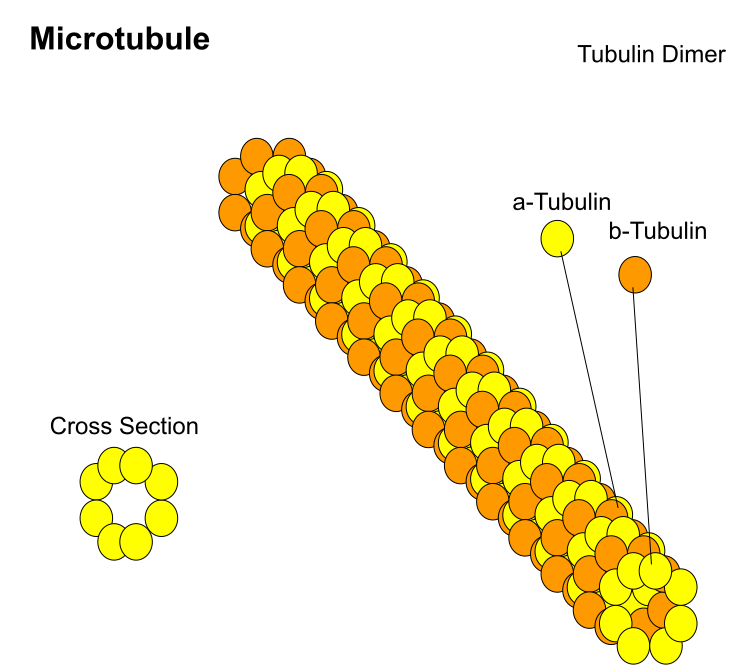
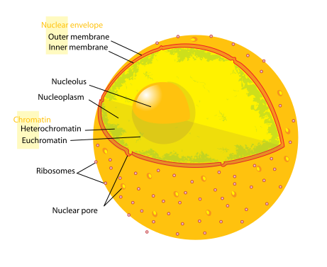
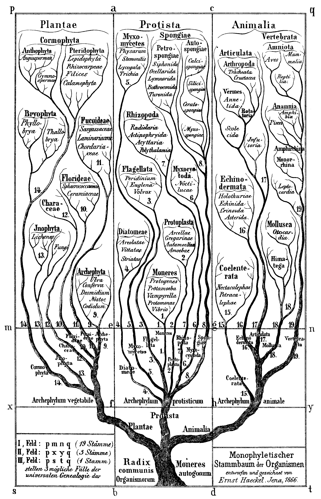
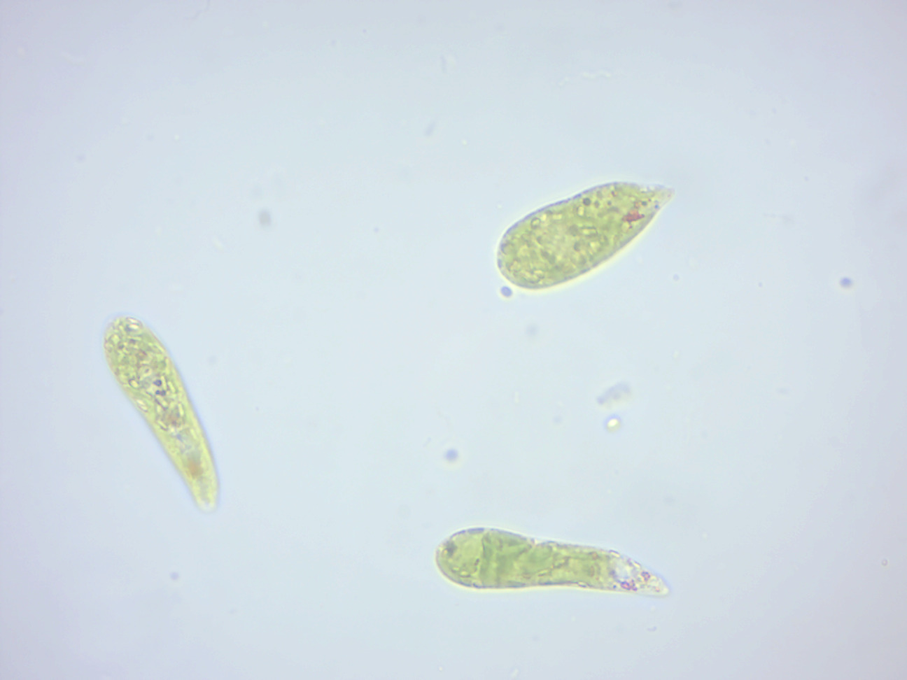
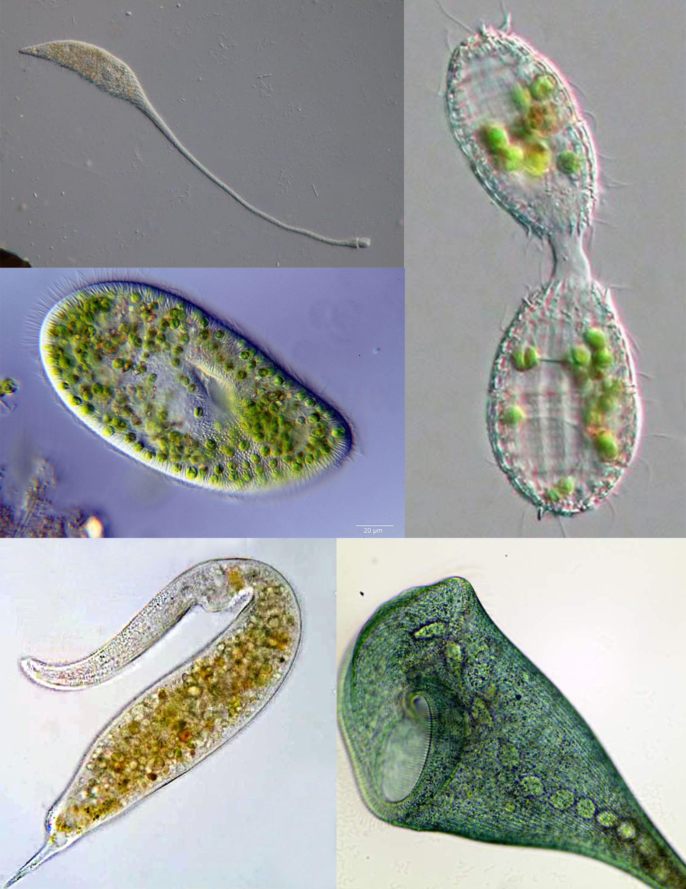
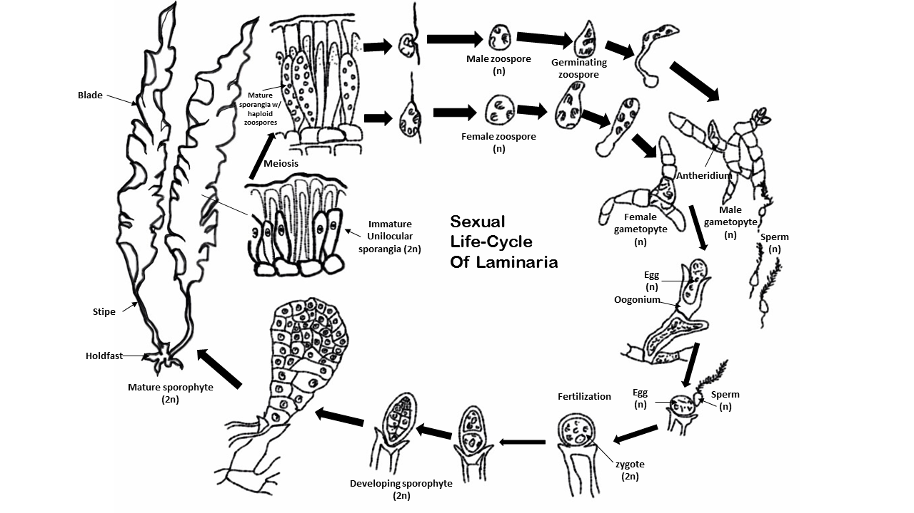

# An Introduction To Eukaryotic Cells And Microorganisms

Most living things that are visible to the naked eye in their adult form are [eukaryotes](https://en.wikipedia.org/wiki/Eukaryote), including humans. Eukaryotes belong to the domain Eukaryota or Eukarya; their name comes from the Greek εὖ (eu, "well" or "good") and κάρυον (karyon, "nut" or "kernel"). The domain Eukaryota makes up one of the domains of life in the three-domain system; the two other domains are Bacteria and Archaea (together known as prokaryotes). Eukaryotes represent a tiny minority of the number of living organisms; however, due to their generally much larger size, their collective worldwide biomass is estimated to be about equal to that of prokaryotes. Eukaryotes evolved approximately 1.6–2.1 billion years ago, during the Proterozoic eon. However, many eukaryotes are also microorganisms. Unlike bacteria and archaea, eukaryotes contain organelles such as the cell nucleus, the Golgi apparatus and mitochondria in their cells. The nucleus is an organelle that houses the DNA that makes up a cell's genome. DNA (Deoxyribonucleic acid) itself is arranged in complex chromosomes. Mitochondria are organelles vital in metabolism as they are the site of the citric acid cycle and oxidative phosphorylation. They evolved from symbiotic bacteria and retain a remnant genome. Like bacteria, plant cells have cell walls, and contain organelles such as chloroplasts in addition to the organelles in other eukaryotes. Chloroplasts produce energy from light by photosynthesis, and were also originally symbiotic bacteria.

Animals, plants, and fungi are the most familiar eukaryotes; other eukaryotes are sometimes called protists.
Unicellular eukaryotes consist of a single cell throughout their life cycle. This qualification is significant since most multicellular eukaryotes consist of a single cell called a zygote only at the beginning of their life cycles. Microbial eukaryotes can be either haploid or diploid, and some organisms have multiple cell nuclei.

Unicellular eukaryotes usually reproduce asexually by mitosis under favorable conditions. However, under stressful conditions such as nutrient limitations and other conditions associated with DNA damage, they tend to reproduce sexually by meiosis and syngamy.

(ref:animalcell) [Cartoon of the structure of a typical animal cell](https://commons.wikimedia.org/wiki/File:Animal_cell_structure_en.svg) 

(\#fig:typicalanimalcell)(ref:animalcell)

(ref:plantcell) [Cartoon of the structure of a typical plant cell](https://commons.wikimedia.org/wiki/File:Plant_cell_structure_en.svg) 

(\#fig:typicalplantcell)(ref:plantcell)

Eukaryotes can reproduce both asexually through mitosis and sexually through meiosis and gamete fusion. In mitosis, one cell divides to produce two genetically identical cells. In meiosis, DNA replication is followed by two rounds of cell division to produce four haploid daughter cells. These act as sex cells (gametes). Each gamete has just one set of chromosomes, each a unique mix of the corresponding pair of parental chromosomes resulting from genetic recombination during meiosis.

Plants, animals, fungi, and protists are all eukaryotic. These cells are about fifteen times wider than a typical prokaryote and can be as much as a thousand times greater in volume. The main distinguishing feature of eukaryotes as compared to prokaryotes is compartmentalization: the presence of membrane-bound organelles (compartments) in which specific activities take place. Most important among these is a cell nucleus, an organelle that houses the cell's DNA. This nucleus gives the eukaryote its name, which means "true kernel (nucleus)". Other differences include:

* The eukaryotic DNA is organized in one or more linear molecules, called chromosomes, which are associated with histone proteins. All chromosomal DNA is stored in the cell nucleus, separated from the cytoplasm by a membrane. Some eukaryotic organelles such as mitochondria also contain some DNA.
* Many eukaryotic cells are ciliated with primary cilia. Primary cilia play important roles in chemosensation, mechanosensation, and thermosensation. Each cilium may thus be "viewed as a sensory cellular antennae that coordinates a large number of cellular signaling pathways, sometimes coupling the signaling to ciliary motility or alternatively to cell division and differentiation."
* Motile eukaryotes can move using motile cilia or flagella. Motile cells are absent in conifers and flowering plants. Eukaryotic flagella are more complex than those of prokaryotes.

<table class="table" style="margin-left: auto; margin-right: auto;">
<caption>(\#tab:cellcomparison)Comparison of the main features of prokaryotes and eukaryotes.</caption>
 <thead>
  <tr>
   <th style="text-align:left;">  </th>
   <th style="text-align:left;"> Prokaryotes </th>
   <th style="text-align:left;"> Eukaryotes </th>
  </tr>
 </thead>
<tbody>
  <tr>
   <td style="text-align:left;"> Typical organisms </td>
   <td style="text-align:left;"> bacteria, archaea </td>
   <td style="text-align:left;"> protists; fungi; plants; animals </td>
  </tr>
  <tr>
   <td style="text-align:left;"> Typical size </td>
   <td style="text-align:left;"> ~1–5 µm </td>
   <td style="text-align:left;"> ~10–100 µm </td>
  </tr>
  <tr>
   <td style="text-align:left;"> Type of nucleus </td>
   <td style="text-align:left;"> nucleoid region; no true nucleus </td>
   <td style="text-align:left;"> true nucleus with double membrane </td>
  </tr>
  <tr>
   <td style="text-align:left;"> DNA </td>
   <td style="text-align:left;"> circular (usually) </td>
   <td style="text-align:left;"> linear molecules (chromosomes) with histone proteins </td>
  </tr>
  <tr>
   <td style="text-align:left;"> RNA/protein synthesis </td>
   <td style="text-align:left;"> coupled in the cytoplasm </td>
   <td style="text-align:left;"> RNA synthesis in the nucleus; protein synthesis in the cytoplasm </td>
  </tr>
  <tr>
   <td style="text-align:left;"> Ribosomes </td>
   <td style="text-align:left;"> 50S and 30S </td>
   <td style="text-align:left;"> 60S and 40S </td>
  </tr>
  <tr>
   <td style="text-align:left;"> Cytoplasmic structure </td>
   <td style="text-align:left;"> very few structures </td>
   <td style="text-align:left;"> highly structured by endomembranes and a cytoskeleton </td>
  </tr>
  <tr>
   <td style="text-align:left;"> Cell movement </td>
   <td style="text-align:left;"> flagella made of flagellin </td>
   <td style="text-align:left;"> flagella and cilia containing microtubules; lamellipodia and filopodia containing actin </td>
  </tr>
  <tr>
   <td style="text-align:left;"> Mitochondria </td>
   <td style="text-align:left;"> none </td>
   <td style="text-align:left;"> one to several thousand </td>
  </tr>
  <tr>
   <td style="text-align:left;"> Chloroplasts </td>
   <td style="text-align:left;"> none </td>
   <td style="text-align:left;"> in algae and plants </td>
  </tr>
  <tr>
   <td style="text-align:left;"> Organization </td>
   <td style="text-align:left;"> usually single cells </td>
   <td style="text-align:left;"> single cells, colonies, higher multicellular organisms with specialized cells </td>
  </tr>
  <tr>
   <td style="text-align:left;"> Cell division </td>
   <td style="text-align:left;"> binary fission (simple division) </td>
   <td style="text-align:left;"> mitosis (fission or budding);  meiosis </td>
  </tr>
  <tr>
   <td style="text-align:left;"> Chromosomes </td>
   <td style="text-align:left;"> single chromosome </td>
   <td style="text-align:left;"> more than one chromosome </td>
  </tr>
  <tr>
   <td style="text-align:left;"> Membranes </td>
   <td style="text-align:left;"> cell membrane </td>
   <td style="text-align:left;"> Cell membrane and membrane-bound organelles </td>
  </tr>
</tbody>
</table>

## Characteristic Features Of Eukaryotic Cells

All cells, whether prokaryotic or eukaryotic, have a membrane that envelops the cell, regulates what moves in and out (selectively permeable), and maintains the electric potential of the cell. Inside the membrane, the cytoplasm takes up most of the cell's volume. All cells (except red blood cells which lack a cell nucleus and most organelles to accommodate maximum space for hemoglobin) possess DNA, the hereditary material of genes, and RNA, containing the information necessary to build various proteins such as enzymes, the cell's primary machinery. There are also other kinds of biomolecules in cells. This article lists these primary cellular components, then briefly describes their function.

### The Cell Membrane

The cell membrane, or plasma membrane, is a biological membrane that surrounds the cytoplasm of a cell. In animals, the plasma membrane is the outer boundary of the cell, while in plants and prokaryotes it is usually covered by a cell wall. This membrane serves to separate and protect a cell from its surrounding environment and is made mostly from a double layer of phospholipids, which are amphiphilic (partly hydrophobic and partly hydrophilic). Hence, the layer is called a phospholipid bilayer, or sometimes a fluid mosaic membrane. Embedded within this membrane is a macromolecular structure called the porosome the universal secretory portal in cells and a variety of protein molecules that act as channels andpumps that move different molecules into and out of the cell. The membrane is semi-permeable, and selectively permeable, in that it can either let a substance (molecule or ion) pass through freely, pass through to a limited extent or not pass through at all. Cell surface membranes also contain receptor proteins that allow cells to detect external signaling molecules such as hormones.

(ref:membrane) [Detailed diagram of lipid bilayer cell membrane](https://commons.wikimedia.org/wiki/File:Cell_membrane_detailed_diagram_en.svg)

(\#fig:cellmembrane)(ref:membrane)

### The Cytoskeleton

The cytoskeleton is a complex, dynamic network of interlinking protein filaments present in the cytoplasm of all cells, including bacteria and archaea. It extends from the cell nucleus to the cell membrane and is composed of similar proteins in the various organisms. In eukaryotes, it is composed of three main components, microfilaments, intermediate filaments and microtubules, and these are all capable of rapid growth or disassembly dependent on the cell's requirements.

A multitude of functions can be performed by the cytoskeleton. Its primary function is to give the cell its shape and mechanical resistance to deformation, and through association with extracellular connective tissue and other cells it stabilizes entire tissues. The cytoskeleton can also contract, thereby deforming the cell and the cell's environment and allowing cells to migrate. Moreover, it is involved in many cell signaling pathways and in the uptake of extracellular material (endocytosis), the segregation of chromosomes during cellular division, the cytokinesis stage of cell division, as scaffolding to organize the contents of the cell in space and in intracellular transport (for example, the movement of vesicles and organelles within the cell) and can be a template for the construction of a cell wall. Furthermore, it can form specialized structures, such as flagella, cilia, lamellipodia and podosomes. The structure, function and dynamic behavior of the cytoskeleton can be very different, depending on organism and cell type. Even within one cell, the cytoskeleton can change through association with other proteins and the previous history of the network.

A large-scale example of an action performed by the cytoskeleton is muscle contraction. This is carried out by groups of highly specialized cells working together. A main component in the cytoskeleton that helps show the true function of this muscle contraction is the microfilament. Microfilaments are composed of the most abundant cellular protein known as actin. During contraction of a muscle, within each muscle cell, myosin molecular motors collectively exert forces on parallel actin filaments. Muscle contraction starts from nerve impulses which then causes increased amounts of calcium to be released from the sarcoplasmic reticulum. Increases in calcium in the cytosol allows muscle contraction to begin with the help of two proteins, tropomyosin and troponin. Tropomyosin inhibits the interaction between actin and myosin, while troponin senses the increase in calcium and releases the inhibition. This action contracts the muscle cell, and through the synchronous process in many muscle cells, the entire muscle.

Eukaryotic cells contain three main kinds of cytoskeletal filaments: microfilaments, microtubules, and intermediate filaments. Each type is formed by the polymerization of a distinct type of protein subunit and has its own characteristic shape and intracellular distribution. Microfilaments are polymers of the protein actin and are 7 nm in diameter. Microtubules are composed of tubulin and are 25 nm in diameter. Intermediate filaments are composed of various proteins, depending on the type of cell in which they are found; they are normally 8-12 nm in diameter. The cytoskeleton provides the cell with structure and shape, and by excluding macromolecules from some of the cytosol, it adds to the level of macromolecular crowding in this compartment. Cytoskeletal elements interact extensively and intimately with cellular membranes.

(ref:cytoskel) [The eukaryotic cytoskeleton.](https://commons.wikimedia.org/wiki/File:FluorescentCells.jpg) Actin filaments are shown in red, and microtubules composed of beta tubulin are in green.

(\#fig:cytoskeleton)(ref:cytoskel)

Microfilaments, also known as actin filaments, are composed of linear polymers of G-actin proteins, and generate force when the growing (plus) end of the filament pushes against a barrier, such as the cell membrane. They also act as tracks for the movement of myosin molecules that affix to the microfilament and "walk" along them. In general, the major component or protein of microfilaments are actin. The G-actin monomer combines to form a polymer which continues to form the microfilament (actin filament). These subunits then assemble into two chains that intertwine into what are called F-actin chains. Myosin motoring along F-actin filaments generates contractile forces in so-called actomyosin fibers, both in muscle as well as most non-muscle cell types. 

(ref:microfil) [Cartoon of the structure of a microfilament, which creates the structure in the cytoskeleton of an eukaryotic cell.](https://commons.wikimedia.org/wiki/File:Microfilament_Structure.svg)

(\#fig:microfilament)(ref:microfil)

Intermediate filaments are a part of the cytoskeleton of many eukaryotic cells. These filaments, averaging 10 nanometers in diameter, are more stable (strongly bound) than microfilaments, and heterogeneous constituents of the cytoskeleton. Like actin filaments, they function in the maintenance of cell-shape by bearing tension (microtubules, by contrast, resist compression but can also bear tension during mitosis and during the positioning of the centrosome). Intermediate filaments organize the internal tridimensional structure of the cell, anchoring organelles and serving as structural components of the nuclear lamina. They also participate in some cell-cell and cell-matrix junctions. Nuclear lamina exist in all animals and all tissues. Some animals like the fruit fly do not have any cytoplasmic intermediate filaments. In those animals that express cytoplasmic intermediate filaments, these are tissue specific. Keratin intermediate filaments in epithelial cells provide protection for different mechanical stresses the skin may endure. They also provide protection for organs against metabolic, oxidative, and chemical stresses. Strengthening of epithelial cells with these intermediate filaments may prevent onset of apoptosis, or cell death, by reducing the probability of stress.

(ref:intermedfil) [Cartoon of the the structure of an intermediate filament.](https://commons.wikimedia.org/wiki/File:Intermediate_filaments.svg)

(\#fig:intermedfilament)(ref:intermedfil)

Microtubules are hollow cylinders about 23 nm in diameter (lumen diameter of approximately 15 nm), most commonly comprising 13 protofilaments that, in turn, are polymers of alpha and beta tubulin. They have a very dynamic behavior, binding GTP for polymerization. They are commonly organized by the centrosome.

(ref:microtubule) [Cartoon of the the structure of a microtubule.](https://commons.wikimedia.org/wiki/File:Microtubule_Structure.svg)

(\#fig:microtubulestruc)(ref:microtubule)

In nine triplet sets (star-shaped), they form the centrioles, and in nine doublets oriented about two additional microtubules (wheel-shaped), they form cilia and flagella. The latter formation is commonly referred to as a "9+2" arrangement, wherein each doublet is connected to another by the protein dynein. As both flagella and cilia are structural components of the cell, and are maintained by microtubules, they can be considered part of the cytoskeleton. There are two types of cilia: motile and non-motile cilia. Cilia are short and more numerous than flagella. The motile cilia have a rhythmic waving or beating motion compared to the non-motile cilia which receive sensory information for the cell; processing signals from the other cells or the fluids surrounding it. Additionally, the microtubules control the beating (movement) of the cilia and flagella. Also, the dynein arms attached to the microtubules function as the molecular motors. The motion of the cilia and flagella is created by the microtubules sliding past one another, which requires ATP.
Cytoplasmic streaming, also known as cyclosis, is the active movement of a cell’s contents along the components of the cytoskeleton. While mainly seen in plants, all cell types use this process for transportation of waste, nutrients, and organelles to other parts of the cell.  Plant and algae cells are generally larger than many other cells; so cytoplasmic streaming is important in these types of cells. This is because the cell’s extra volume requires cytoplasmic streaming in order to move organelles throughout the entire cell. Organelles move along microfilaments in the cytoskeleton driven by myosin motors binding and pushing along actin filament bundles.

### The Genetic Material

Two different kinds of genetic material exist: deoxyribonucleic acid (DNA) and ribonucleic acid (RNA). Cells use DNA for their long-term information storage. The biological information contained in an organism is encoded in its DNA sequence. RNA is used for information transport (e.g., mRNA) and enzymatic functions (e.g., ribosomal RNA). Transfer RNA (tRNA) molecules are used to add amino acids during protein translation.

Prokaryotic genetic material is organized in a simple circular bacterial chromosome in the nucleoid region of the cytoplasm. Eukaryotic genetic material is divided into different, linear molecules called chromosomes inside a discrete nucleus, usually with additional genetic material in some organelles like mitochondria and chloroplasts (see endosymbiotic theory).

A human cell has genetic material contained in the cell nucleus (the nuclear genome) and in the mitochondria (the mitochondrial genome). In humans the nuclear genome is divided into 46 linear DNA molecules called chromosomes, including 22 homologous chromosome pairs and a pair of sex chromosomes. The mitochondrial genome is a circular DNA molecule distinct from the nuclear DNA. Although the mitochondrial DNA is very small compared to nuclear chromosomes, it codes for 13 proteins involved in mitochondrial energy production and specific tRNAs.

Foreign genetic material (most commonly DNA) can also be artificially introduced into the cell by a process called transfection. This can be transient, if the DNA is not inserted into the cell's genome, or stable, if it is. Certain viruses also insert their genetic material into the genome.

### Organelles of Eukaryotic Cells

Organelles are parts of the cell which are adapted and/or specialized for carrying out one or more vital functions, analogous to the organs of the human body (such as the heart, lung, and kidney, with each organ performing a different function). Both eukaryotic and prokaryotic cells have organelles, but prokaryotic organelles are generally simpler and are not membrane-bound.

There are several types of organelles in a cell. Some (such as the nucleus and golgi apparatus) are typically solitary, while others (such as mitochondria, chloroplasts, peroxisomes and lysosomes) can be numerous (hundreds to thousands). The cytosol is the gelatinous fluid that fills the cell and surrounds the organelles.

* Cell nucleus: A cell's information center, the cell nucleus is the most conspicuous organelle found in a eukaryotic cell. It houses the cell's chromosomes, and is the place where almost all DNA replication and RNA synthesis (transcription) occur. The nucleus is spherical and separated from the cytoplasm by a double membrane called the nuclear envelope. The nuclear envelope isolates and protects a cell's DNA from various molecules that could accidentally damage its structure or interfere with its processing. During processing, DNA is transcribed, or copied into a special RNA, called messenger RNA (mRNA). This mRNA is then transported out of the nucleus, where it is translated into a specific protein molecule. The nucleolus is a specialized region within the nucleus where ribosome subunits are assembled. In prokaryotes, DNA processing takes place in the cytoplasm.
* Mitochondria and Chloroplasts: generate energy for the cell.Mitochondria are self-replicating organelles that occur in various numbers, shapes, and sizes in the cytoplasm of all eukaryotic cells. Respiration occurs in the cell mitochondria, which generate the cell's energy by oxidative phosphorylation, using oxygen to release energy stored in cellular nutrients (typically pertaining to glucose) to generate ATP. Mitochondria multiply by binary fission, like prokaryotes. Chloroplasts can only be found in plants and algae, and they capture the sun's energy to make carbohydrates through photosynthesis.
* Endoplasmic reticulum: The endoplasmic reticulum (ER) is a transport network for molecules targeted for certain modifications and specific destinations, as compared to molecules that float freely in the cytoplasm. The ER has two forms: the rough ER, which has ribosomes on its surface that secrete proteins into the ER, and the smooth ER, which lacks ribosomes. The smooth ER plays a role in calcium sequestration and release.
* Golgi apparatus: The primary function of the Golgi apparatus is to process and package the macromolecules such as proteins and lipids that are synthesized by the cell.
* Lysosomes and Peroxisomes: Lysosomes contain digestive enzymes (acid hydrolases). They digest excess or worn-out organelles, food particles, and engulfed viruses or bacteria. Peroxisomes have enzymes that rid the cell of toxic peroxides. The cell could not house these destructive enzymes if they were not contained in a membrane-bound system.
* Centrosome: the cytoskeleton organiser: The centrosome produces the microtubules of a cell – a key component of the cytoskeleton. It directs the transport through the ER and the Golgi apparatus. Centrosomes are composed of two centrioles, which separate during cell division and help in the formation of the mitotic spindle. A single centrosome is present in the animal cells. They are also found in some fungi and algae cells.
* Vacuoles: Vacuoles sequester waste products and in plant cells store water. They are often described as liquid filled space and are surrounded by a membrane. Some cells, most notably Amoeba, have contractile vacuoles, which can pump water out of the cell if there is too much water. The vacuoles of plant cells and fungal cells are usually larger than those of animal cells.

### The Cell Nucleus

In cell biology, the nucleus (pl. nuclei; from Latin nucleus or nuculeus, meaning kernel or seed) is a membrane-bound organelle found in eukaryotic cells. Eukaryotes usually have a single nucleus, but a few cell types, such as mammalian red blood cells, have no nuclei, and a few others including osteoclasts have many. Inside its fully enclosed nuclear membrane, it contains the majority of the cell's genetic material. This material is organized as DNA molecules, along with a variety of proteins, to form chromosomes.

(ref:helanuc) [HeLa cells stained for nuclear DNA with the blue fluorescent Hoechst dye.](https://commons.wikimedia.org/wiki/File:HeLa_cells_stained_with_Hoechst_33258.jpg) The central and rightmost cell are in interphase, thus their entire nuclei are labeled. On the left, a cell is going through mitosis and its DNA has condensed. HeLa is an immortal cell line used in scientific research. It is the oldest and most commonly used human cell line. The line is derived from cervical cancer cells taken on February 8, 1951, from [Henrietta Lacks](https://en.wikipedia.org/wiki/Henrietta_Lacks), a 31-year-old African-American mother of five, who died of cancer on October 4, 1951. The cell line was found to be remarkably durable and prolific, which allows it to be used extensively in scientific study. The cells from Lacks' cancerous cervical tumor were taken without her knowledge or consent, which was common practice at the time. Cell biologist George Otto Gey found that they could be kept alive, and developed a cell line. Previously, cells cultured from other human cells would only survive for a few days. Cells from Lacks' tumor behaved differently. As was custom for Gey's lab assistant, she labeled the culture 'HeLa', the first two letters of the patient's first and last name; this became the name of the cell line. HeLa was the subject of a 2010 book by Rebecca Skloot, [The Immortal Life of Henrietta Lacks](https://en.wikipedia.org/wiki/The_Immortal_Life_of_Henrietta_Lacks), investigating the historical context of the cell line and how the Lacks family was involved its use.

(\#fig:helacellsstained)(ref:helanuc)

The nucleus was the first organelle to be discovered. What is most likely the oldest preserved drawing dates back to the early microscopist Antonie van Leeuwenhoek (1632–1723). He observed a "lumen", the nucleus, in the red blood cells of salmon (Figure \@ref(fig:leeuvenhookcells)). Unlike mammalian red blood cells, those of other vertebrates still contain nuclei.

(ref:leeuven) [Oldest known depiction of cells and their nuclei by Antonie van Leeuwenhoek, 1719](https://commons.wikimedia.org/wiki/File:Leeuwenhoek1719RedBloodCells.jpg) 

(\#fig:leeuvenhookcells)(ref:leeuven)

The cell nucleus contains all of the cell's genome, except for a small fraction of mitochondrial DNA, organized as multiple long linear DNA molecules in a complex with a large variety of proteins, such as histones, to form chromosomes. The genes within these chromosomes are structured in such a way to promote cell function. The nucleus maintains the integrity of genes and controls the activities of the cell by regulating gene expression—the nucleus is, therefore, the control center of the cell. The main structures making up the nucleus are the nuclear envelope, a double membrane that encloses the entire organelle and isolates its contents from the cellular cytoplasm, and the nuclear matrix (which includes the nuclear lamina), a network within the nucleus that adds mechanical support, much like the cytoskeleton, which supports the cell as a whole.

(ref:electronnuc) [An electron micrograph of a cell nucleus, showing the darkly stained nucleolus](https://commons.wikimedia.org/wiki/File:Micrograph_of_a_cell_nucleus.png) 

(\#fig:electronmicronucleus)(ref:electronnuc)

(ref:cellnuc) [The eukaryotic cell nucleus.](https://commons.wikimedia.org/wiki/File:Diagram_human_cell_nucleus.svg) Visible in this diagram are the ribosome-studded double membranes of the nuclear envelope, the DNA (complexed as chromatin), and the nucleolus. Within the cell nucleus is a viscous liquid called nucleoplasm, similar to the cytoplasm found outside the nucleus.

(\#fig:cellnucleus)(ref:cellnuc)

Because the nuclear envelope is impermeable to large molecules, nuclear pores are required to regulate nuclear transport of molecules across the envelope. The pores cross both nuclear membranes, providing a channel through which larger molecules must be actively transported by carrier proteins while allowing free movement of small molecules and ions. Movement of large molecules such as proteins and RNA through the pores is required for both gene expression and the maintenance of chromosomes. Although the interior of the nucleus does not contain any membrane-bound subcompartments, its contents are not uniform, and a number of nuclear bodies exist, made up of unique proteins, RNA molecules, and particular parts of the chromosomes. The best-known of these is the nucleolus, which is mainly involved in the assembly of ribosomes. After being produced in the nucleolus, ribosomes are exported to the cytoplasm where they translate mRNA.

(ref:nucpore) [A cross section of a nuclear pore on the surface of the nuclear envelope (1).](https://en.wikipedia.org/wiki/Cell_nucleus#/media/File:NuclearPore_crop.svg) Other diagram labels show (2) the outer ring, (3) spokes, (4) basket, and (5) filaments.

(\#fig:nuclearpore)(ref:nucpore)

The nuclear envelope, otherwise known as nuclear membrane, consists of two cellular membranes, an inner and an outer membrane, arranged parallel to one another and separated by 10 to 50 nanometres (nm). The nuclear envelope completely encloses the nucleus and separates the cell's genetic material from the surrounding cytoplasm, serving as a barrier to prevent macromolecules from diffusing freely between the nucleoplasm and the cytoplasm. The outer nuclear membrane is continuous with the membrane of the rough endoplasmic reticulum (RER), and is similarly studded with ribosomes. The space between the membranes is called the perinuclear space and is continuous with the RER lumen.

Nuclear pores, which provide aqueous channels through the envelope, are composed of multiple proteins, collectively referred to as nucleoporins. The pores are about 125 million daltons in molecular weight and consist of around 50 (in yeast) to several hundred proteins (in vertebrates). The pores are 100 nm in total diameter; however, the gap through which molecules freely diffuse is only about 9 nm wide, due to the presence of regulatory systems within the center of the pore. This size selectively allows the passage of small water-soluble molecules while preventing larger molecules, such as nucleic acids and larger proteins, from inappropriately entering or exiting the nucleus. These large molecules must be actively transported into the nucleus instead. The nucleus of a typical mammalian cell will have about 3000 to 4000 pores throughout its envelope, each of which contains an eightfold-symmetric ring-shaped structure at a position where the inner and outer membranes fuse. Attached to the ring is a structure called the nuclear basket that extends into the nucleoplasm, and a series of filamentous extensions that reach into the cytoplasm. Both structures serve to mediate binding to nuclear transport proteins.

Most proteins, ribosomal subunits, and some DNAs are transported through the pore complexes in a process mediated by a family of transport factors known as karyopherins. Those karyopherins that mediate movement into the nucleus are also called importins, whereas those that mediate movement out of the nucleus are called exportins. Most karyopherins interact directly with their cargo, although some use adaptor proteins. Steroid hormones such as cortisol and aldosterone, as well as other small lipid-soluble molecules involved in intercellular signaling, can diffuse through the cell membrane and into the cytoplasm, where they bind nuclear receptor proteins that are trafficked into the nucleus. There they serve as transcription factors when bound to their ligand; in the absence of a ligand, many such receptors function as histone deacetylases that repress gene expression

The cell nucleus contains the majority of the cell's genetic material in the form of multiple linear DNA molecules organized into structures called chromosomes. Each human cell contains roughly two meters of DNA. During most of the cell cycle these are organized in a DNA-protein complex known as chromatin, and during cell division the chromatin can be seen to form the well-defined chromosomes familiar from a karyotype. A small fraction of the cell's genes are located instead in the mitochondria.

There are two types of chromatin. Euchromatin is the less compact DNA form, and contains genes that are frequently expressed by the cell. The other type, heterochromatin, is the more compact form, and contains DNA that is infrequently transcribed. This structure is further categorized into facultative heterochromatin, consisting of genes that are organized as heterochromatin only in certain cell types or at certain stages of development, and constitutive heterochromatin that consists of chromosome structural components such as telomeres and centromeres. During interphase the chromatin organizes itself into discrete individual patches, called chromosome territories. Active genes, which are generally found in the euchromatic region of the chromosome, tend to be located towards the chromosome's territory boundary.

The nucleolus is the largest of the discrete densely stained, membraneless structures known as nuclear bodies found in the nucleus. It forms around tandem repeats of rDNA, DNA coding for ribosomal RNA (rRNA). These regions are called nucleolar organizer regions (NOR). The main roles of the nucleolus are to synthesize rRNA and assemble ribosomes. The structural cohesion of the nucleolus depends on its activity, as ribosomal assembly in the nucleolus results in the transient association of nucleolar components, facilitating further ribosomal assembly, and hence further association. This model is supported by observations that inactivation of rDNA results in intermingling of nucleolar structures.

In the first step of ribosome assembly, a protein called RNA polymerase I transcribes rDNA, which forms a large pre-rRNA precursor. This is cleaved into the subunits 5.8S, 18S, and 28S rRNA. The transcription, post-transcriptional processing, and assembly of rRNA occurs in the nucleolus, aided by small nucleolar RNA (snoRNA) molecules, some of which are derived from spliced introns from messenger RNAs encoding genes related to ribosomal function. The assembled ribosomal subunits are the largest structures passed through the nuclear pores.

When observed under the electron microscope, the nucleolus can be seen to consist of three distinguishable regions: the innermost fibrillar centers (FCs), surrounded by the dense fibrillar component (DFC) (that contains fibrillarin and nucleolin), which in turn is bordered by the granular component (GC) (that contains the protein nucleophosmin). Transcription of the rDNA occurs either in the FC or at the FC-DFC boundary, and, therefore, when rDNA transcription in the cell is increased, more FCs are detected. Most of the cleavage and modification of rRNAs occurs in the DFC, while the latter steps involving protein assembly onto the ribosomal subunits occur in the GC.

### The Mitochondria

The [mitochondrion](https://en.wikipedia.org/wiki/Mitochondrion) (plural mitochondria) is a semi autonomous double-membrane-bound organelle found in most eukaryotic organisms. Some cells in some multicellular organisms may, however, lack mitochondria (for example, mature mammalian red blood cells). 

(ref:electromito) [Two mitochondria from mammalian lung tissue displaying their matrix and membranes as shown by electron microscopy.](https://commons.wikimedia.org/wiki/File:Mitochondria,_mammalian_lung_-_TEM.jpg)

(\#fig:electromitochondrion)(ref:electromito)

The word mitochondrion comes from the Greek μίτος, mitos, "thread", and χονδρίον, chondrion, "granule" or "grain-like". Mitochondria generate most of the cell's supply of adenosine triphosphate (ATP), used as a source of chemical energy. A mitochondrion is thus termed the powerhouse of the cell.

In addition to supplying cellular energy, mitochondria are involved in other tasks, such as signaling, cellular differentiation, and cell death, as well as maintaining control of the cell cycle and cell growth.  

The organelle is composed of compartments that carry out specialized functions. These compartments or regions include the outer membrane, the intermembrane space, the inner membrane, and the cristae and matrix.

(ref:mitocart) [Cartoon of the structure of a mitochondrion.](https://commons.wikimedia.org/wiki/File:Mitochondrion_mini.svg) Components of a typical mitochondrion 1 Outer membrane 1.1 Porin 2 Intermembrane space 2.1 Intracristal space 2.2 Peripheral space 3 Lamella 3.1 Inner membrane 3.11 Inner boundary membrane 3.12 Cristal membrane 3.2 Matrix 3.3 Cristæ 4 Mitochondrial DNA 5 Matrix granule 6 Ribosome 7 ATP synthase

(\#fig:mitocartoon)(ref:mitocart)

Although most of a cell's DNA is contained in the cell nucleus, the mitochondrion has its own independent genome ("mitogenome") that shows substantial similarity to bacterial genomes. Mitochondrial proteins (proteins transcribed from mitochondrial DNA) vary depending on the tissue and the species. 

The endosymbiotic hypothesis suggests that mitochondria were originally prokaryotic cells, capable of implementing oxidative mechanisms that were not possible for eukaryotic cells; they became endosymbionts living inside the eukaryote. The endosymbiotic hypothesis suggests that mitochondria descended from bacteria that somehow survived endocytosis by another cell, and became incorporated into the cytoplasm. The ability of these bacteria to conduct respiration in host cells that had relied on glycolysis and fermentation would have provided a considerable evolutionary advantage. This symbiotic relationship probably developed 1.7 to 2 billion years ago.

A mitochondrion contains outer and inner membranes composed of phospholipid bilayers and proteins. The two membranes have different properties. Because of this double-membraned organization, there are five distinct parts to a mitochondrion. They are:

* the outer mitochondrial membrane,
* the intermembrane space (the space between the outer and inner membranes),
* the inner mitochondrial membrane,
* the cristae space (formed by infoldings of the inner membrane), and
* the matrix (space within the inner membrane).

The inner mitochondrial membrane contains proteins with three types of functions:

1. Those that perform the electron transport chain redox reactions
1. ATP synthase, which generates ATP in the matrix
1. Specific transport proteins that regulate metabolite passage into and out of the mitochondrial matrix

The most prominent roles of mitochondria are to produce the energy currency of the cell, ATP (i.e., phosphorylation of ADP), through respiration, and to regulate cellular metabolism. The central set of reactions involved in ATP production are collectively known as the citric acid cycle, or the Krebs cycle. However, the mitochondrion has many other functions in addition to the production of ATP.

(ref:fluocell) [A fluorescent image of an endothelial cell. Nuclei are stained blue, mitochondria are stained red, and microfilaments are stained green.](https://commons.wikimedia.org/wiki/File:DAPIMitoTrackerRedAlexaFluor488BPAE.jpg)

(\#fig:dapimitotracker)(ref:fluocell)

### The Chloroplasts

[Chloroplasts](https://en.wikipedia.org/wiki/Chloroplast) are organelles that conduct photosynthesis, where the photosynthetic pigment chlorophyll captures the energy from sunlight, converts it, and stores it in the energy-storage molecules ATP and NADPH while freeing oxygen from water in plant and algal cells. They then use the ATP and NADPH to make organic molecules from carbon dioxide in a process known as the Calvin cycle. Chloroplasts carry out a number of other functions, including fatty acid synthesis, much amino acid synthesis, and the immune response in plants. The number of chloroplasts per cell varies from one, in unicellular algae, up to 100 in plants like Arabidopsis and wheat.

A chloroplast is a type of organelle known as a plastid, characterized by its two membranes and a high concentration of chlorophyll. Other plastid types, such as the leucoplast and the chromoplast, contain little chlorophyll and do not carry out photosynthesis.

(ref:chlorocart) [Cartoon of the structure of a chloroplast.](https://commons.wikimedia.org/wiki/File:Chloroplast_mini.svg) Components of a typical chloroplast 1 Granum 2 Chloroplast envelope 2.1 Outer membrane 2.2 Intermembrane space 2.3 Inner membrane 3 Thylakoid   ◄ You are here 3.1 Thylakoid space (lumen) 3.2 Thylakoid membrane 4 Stromal thylakoid 5 Stroma 6 Nucleoid (DNA ring) 7 Ribosome 8 Plastoglobulus 9 Starch granule

(\#fig:chloroplastcartoon)(ref:chlorocart)

Chloroplasts are highly dynamic—they circulate and are moved around within plant cells, and occasionally pinch in two to reproduce. Their behavior is strongly influenced by environmental factors like light color and intensity. Chloroplasts, like mitochondria, contain their own DNA, which is thought to be inherited from their ancestor—a photosynthetic cyanobacterium that was engulfed by an early eukaryotic cell. Chloroplasts cannot be made by the plant cell and must be inherited by each daughter cell during cell division.

Chloroplasts are considered endosymbiotic Cyanobacteria. Cyanobacteria are sometimes called blue-green algae even though they are prokaryotes. Chloroplasts can probably be traced back to a single endosymbiotic event, when a cyanobacterium was engulfed by the eukaryote. Despite this, chloroplasts can be found in an extremely wide set of organisms, some not even directly related to each other—a consequence of many secondary and even tertiary endosymbiotic events.

The word chloroplast is derived from the Greek words chloros (χλωρός), which means green, and plastes (πλάστης), which means "the one who forms".

In land plants, chloroplasts are generally lens-shaped, 3–10 μm in diameter and 1–3 μm thick. 

All chloroplasts have at least three membrane systems—the outer chloroplast membrane, the inner chloroplast membrane, and the thylakoid system. Inside the outer and inner chloroplast membranes is the chloroplast stroma, a semi-gel-like fluid that makes up much of a chloroplast's volume, and in which the thylakoid system floats.

The chloroplast stroma contains many proteins, though the most common and important is RuBisCO, which is probably also the most abundant protein on the planet. RuBisCO is the enzyme that fixes CO~2~ into sugar molecules. In C3 plants, RuBisCO is abundant in all chloroplasts, though in C4 plants, it is confined to the bundle sheath chloroplasts, where the Calvin cycle is carried out in C4 plants.

Suspended within the chloroplast stroma is the thylakoid system, a highly dynamic collection of membranous sacks called thylakoids where chlorophyll is found and the light reactions of photosynthesis happen. In most vascular plant chloroplasts, the thylakoids are arranged in stacks called grana, though in certain C4 plant chloroplasts and some algal chloroplasts, the thylakoids are free floating.

Thylakoids (sometimes spelled thylakoïds), are small interconnected sacks which contain the membranes that the light reactions of photosynthesis take place on. The word thylakoid comes from the Greek word thylakos which means "sack".

Embedded in the thylakoid membranes are important protein complexes which carry out the light reactions of photosynthesis. Photosystem II and photosystem I contain light-harvesting complexes with chlorophyll and carotenoids that absorb light energy and use it to energize electrons. Molecules in the thylakoid membrane use the energized electrons to pump hydrogen ions into the thylakoid space, decreasing the pH and turning it acidic. ATP synthase is a large protein complex that harnesses the concentration gradient of the hydrogen ions in the thylakoid space to generate ATP energy as the hydrogen ions flow back out into the stroma—much like a dam turbine.

There are two types of thylakoids—granal thylakoids, which are arranged in grana, and stromal thylakoids, which are in contact with the stroma. Granal thylakoids are pancake-shaped circular disks about 300–600 nanometers in diameter. Stromal thylakoids are helicoid sheets that spiral around grana. The flat tops and bottoms of granal thylakoids contain only the relatively flat photosystem II protein complex. This allows them to stack tightly, forming grana with many layers of tightly appressed membrane, called granal membrane, increasing stability and surface area for light capture.

In contrast, photosystem I and ATP synthase are large protein complexes which jut out into the stroma. They can't fit in the appressed granal membranes, and so are found in the stromal thylakoid membrane—the edges of the granal thylakoid disks and the stromal thylakoids. These large protein complexes may act as spacers between the sheets of stromal thylakoids.

The number of thylakoids and the total thylakoid area of a chloroplast is influenced by light exposure. Shaded chloroplasts contain larger and more grana with more thylakoid membrane area than chloroplasts exposed to bright light, which have smaller and fewer grana and less thylakoid area. Thylakoid extent can change within minutes of light exposure or removal.

Inside the photosystems embedded in chloroplast thylakoid membranes are various photosynthetic pigments, which absorb and transfer light energy. The types of pigments found are different in various groups of chloroplasts, and are responsible for a wide variety of chloroplast colorations.

Chlorophyll a is found in all chloroplasts, as well as their cyanobacterial ancestors. Chlorophyll a is a blue-green pigment partially responsible for giving most cyanobacteria and chloroplasts their color. 

Chlorophyll b is an olive green pigment found only in the chloroplasts of plants, green algae, any secondary chloroplasts obtained through the secondary endosymbiosis of a green alga, and a few cyanobacteria. It is the chlorophylls a and b together that make most plant and green algal chloroplasts green.

In addition to chlorophylls, another group of yellow–orange pigments called carotenoids are also found in the photosystems. There are about thirty photosynthetic carotenoids. They help transfer and dissipate excess energy, and their bright colors sometimes override the chlorophyll green, like during the fall, when the leaves of some land plants change color. β-carotene is a bright red-orange carotenoid found in nearly all chloroplasts, like chlorophyll a. Xanthophylls, especially the orange-red zeaxanthin, are also common. Many other forms of carotenoids exist that are only found in certain groups of chloroplasts.

The chloroplasts of plant and algal cells can orient themselves to best suit the available light. In low-light conditions, they will spread out in a sheet—maximizing the surface area to absorb light. Under intense light, they will seek shelter by aligning in vertical columns along the plant cell's cell wall or turning sideways so that light strikes them edge-on. This reduces exposure and protects them from photooxidative damage. This ability to distribute chloroplasts so that they can take shelter behind each other or spread out may be the reason why land plants evolved to have many small chloroplasts instead of a few big ones. Chloroplast movement is considered one of the most closely regulated stimulus-response systems that can be found in plants.

One of the main functions of the chloroplast is its role in photosynthesis, the process by which light is transformed into chemical energy, to subsequently produce food in the form of sugars. Water (H~2~O) and carbon dioxide (CO~2~) are used in photosynthesis, and sugar and oxygen (O~2~) is made, using light energy. Photosynthesis is divided into two stages—the light reactions, where water is split to produce oxygen, and the dark reactions, or Calvin cycle, which builds sugar molecules from carbon dioxide. The two phases are linked by the energy carriers adenosine triphosphate (ATP) and nicotinamide adenine dinucleotide phosphate (NADP^+^).

### The Endoplasmic Reticulum

The [endoplasmic reticulum](https://en.wikipedia.org/wiki/Endoplasmic_reticulum) (ER) is a type of organelle made up of two subunits – rough endoplasmic reticulum (RER), and smooth endoplasmic reticulum (SER). The endoplasmic reticulum is found in most eukaryotic cells and forms an interconnected network of flattened, membrane-enclosed sacs known as cisternae (in the RER), and tubular structures in the SER. The membranes of the ER are continuous with the outer nuclear membrane. The endoplasmic reticulum is not found in red blood cells, or spermatozoa.

The two types of ER share many of the same proteins and engage in certain common activities such as the synthesis of certain lipids and cholesterol. Different types of cells contain different ratios of the two types of ER depending on the activities of the cell.

The outer (cytosolic) face of the rough endoplasmic reticulum is studded with ribosomes that are the sites of protein synthesis. The rough endoplasmic reticulum is especially prominent in cells such as hepatocytes. The smooth endoplasmic reticulum lacks ribosomes and functions in lipid synthesis but not metabolism, the production of steroid hormones, and detoxification. The smooth endoplasmic reticulum is especially abundant in mammalian liver and gonad cells.

The general structure of the endoplasmic reticulum is a network of membranes called cisternae. These sac-like structures are held together by the cytoskeleton. The phospholipid membrane encloses the cisternal space (or lumen), which is continuous with the perinuclear space but separate from the cytosol. The functions of the endoplasmic reticulum can be summarized as the synthesis and export of proteins and membrane lipids, but varies between ER and cell type and cell function. The quantity of both rough and smooth endoplasmic reticulum in a cell can slowly interchange from one type to the other, depending on the changing metabolic activities of the cell. Transformation can include embedding of new proteins in membrane as well as structural changes. Changes in protein content may occur without noticeable structural changes.

The surface of the rough endoplasmic reticulum (often abbreviated RER or rough ER; also called granular endoplasmic reticulum) is studded with protein-manufacturing ribosomes giving it a "rough" appearance (hence its name). The binding site of the ribosome on the rough endoplasmic reticulum is the translocon. However, the ribosomes are not a stable part of this organelle's structure as they are constantly being bound and released from the membrane. A ribosome only binds to the RER once a specific protein-nucleic acid complex forms in the cytosol. This special complex forms when a free ribosome begins translating the mRNA of a protein destined for the secretory pathway. The first 5–30 amino acids polymerized encode a signal peptide, a molecular message that is recognized and bound by a signal recognition particle (SRP). Translation pauses and the ribosome complex binds to the RER translocon where translation continues with the nascent (new) protein forming into the RER lumen and/or membrane. The protein is processed in the ER lumen by an enzyme (a signal peptidase), which removes the signal peptide. Ribosomes at this point may be released back into the cytosol; however, non-translating ribosomes are also known to stay associated with translocons.

In most cells the smooth endoplasmic reticulum (abbreviated SER) is scarce. Instead there are areas where the ER is partly smooth and partly rough, this area is called the transitional ER. The transitional ER gets its name because it contains ER exit sites. These are areas where the transport vesicles that contain lipids and proteins made in the ER, detach from the ER and start moving to the Golgi apparatus. Specialized cells can have a lot of smooth endoplasmic reticulum and in these cells the smooth ER has many functions. It synthesizes lipids, phospholipids, and steroids. Cells which secrete these products, such as those in the testes, ovaries, and sebaceous glands have an abundance of smooth endoplasmic reticulum. It also carries out the metabolism of carbohydrates, detoxification of natural metabolism products and of alcohol and drugs, attachment of receptors on cell membrane proteins, and steroid metabolism. In muscle cells, it regulates calcium ion concentration. 

### The Golgi Apparatus

The [Golgi apparatus](https://en.wikipedia.org/wiki/Golgi_apparatus), also known as the Golgi complex, Golgi body, or simply the Golgi, is an organelle found in most eukaryotic cells. Part of the endomembrane system in the cytoplasm, it packages proteins into membrane-bound vesicles inside the cell before the vesicles are sent to their destination. It resides at the intersection of the secretory, lysosomal, and endocytic pathways. It is of particular importance in processing proteins for secretion, containing a set of glycosylation enzymes that attach various sugar monomers to proteins as the proteins move through the apparatus.

It was identified in 1897 by the Italian scientist [Camillo Golgi](https://en.wikipedia.org/wiki/Camillo_Golgi) and was named after him in 1898.

In most eukaryotes, the Golgi apparatus is made up of a series of compartments and is a collection of fused, flattened membrane-enclosed disks known as cisternae (singular: cisterna, also called "dictyosomes"), originating from vesicular clusters that bud off the endoplasmic reticulum. A mammalian cell typically contains 40 to 100 stacks of cisternae. Between four and eight cisternae are usually present in a stack; however, in some protists as many as sixty cisternae have been observed. This collection of cisternae is broken down into cis, medial, and trans compartments, making up two main networks: the cis Golgi network (CGN) and the trans Golgi network (TGN). The CGN is the first cisternal structure, and the TGN is the final, from which proteins are packaged into vesicles destined to lysosomes, secretory vesicles, or the cell surface. The TGN is usually positioned adjacent to the stack, but can also be separate from it. The TGN may act as an early endosome in yeast and plants.

The Golgi apparatus is a major collection and dispatch station of protein products received from the endoplasmic reticulum (ER). Proteins synthesized in the ER are packaged into vesicles, which then fuse with the Golgi apparatus. These cargo proteins are modified and destined for secretion via exocytosis or for use in the cell. In this respect, the Golgi can be thought of as similar to a post office: it packages and labels items which it then sends to different parts of the cell or to the extracellular space. The Golgi apparatus is also involved in lipid transport and lysosome formation.

(ref:endomembrane) [Diagram of the endomembrane system](https://commons.wikimedia.org/wiki/File:Endomembrane_system_diagram_en.svg) 

(\#fig:endomembranediagram)(ref:endomembrane)

### The Ribosomes

The ribosome is a large complex of RNA and protein molecules. They each consist of two subunits, and act as an assembly line where RNA from the nucleus is used to synthesise proteins from amino acids. Ribosomes can be found either floating freely or bound to a membrane (the rough endoplasmatic reticulum in eukaryotes, or the cell membrane in prokaryotes).

(ref:ribosome) Crystal structure of the human 80S ribosome (based on atomic coordinates of [PDB 4V6X](https://www.rcsb.org/structure/4v6x) rendered with open source molecular visualization tool PyMol). The 40S (small) ribosomal subunit proteins are shown in lightblue, the 60S (large) subunit proteins in palegreen, the ribosomal RNA in orange.

(\#fig:ribosomestructure)(ref:ribo)

### Structures Outside The Cell Membrane

Many cells also have structures which exist wholly or partially outside the cell membrane. These structures are notable because they are not protected from the external environment by the semipermeable cell membrane. In order to assemble these structures, their components must be carried across the cell membrane by export processes.

Many types of prokaryotic and eukaryotic cells have a cell wall. The cell wall acts to protect the cell mechanically and chemically from its environment, and is an additional layer of protection to the cell membrane. Different types of cell have cell walls made up of different materials; plant cell walls are primarily made up of cellulose, fungi cell walls are made up of chitin and bacteria cell walls are made up of peptidoglycan.

A gelatinous capsule is present in some bacteria outside the cell membrane and cell wall. The capsule may be polysaccharide as in pneumococci, meningococci or polypeptide as Bacillus anthracis or hyaluronic acid as in streptococci. Capsules are not marked by normal staining protocols and can be detected by India ink or methyl blue; which allows for higher contrast between the cells for observation.:87

Flagella are organelles for cellular mobility. The bacterial flagellum stretches from cytoplasm through the cell membrane(s) and extrudes through the cell wall. They are long and thick thread-like appendages, protein in nature. A different type of flagellum is found in archaea and a different type is found in eukaryotes.

A fimbria (plural fimbriae also known as a pilus, plural pili) is a short, thin, hair-like filament found on the surface of bacteria. Fimbriae are formed of a protein called pilin (antigenic) and are responsible for the attachment of bacteria to specific receptors on human cells (cell adhesion). There are special types of pili involved in bacterial conjugation.

### Cellular Replication

Cell division involves a single cell (called a mother cell) dividing into two daughter cells. This leads to growth in multicellular organisms (the growth of tissue) and to procreation (vegetative reproduction) in unicellular organisms. Prokaryotic cells divide by binary fission, while eukaryotic cells usually undergo a process of nuclear division, called mitosis, followed by division of the cell, called cytokinesis. A diploid cell may also undergo meiosis to produce haploid cells, usually four. Haploid cells serve as gametes in multicellular organisms, fusing to form new diploid cells.

DNA replication, or the process of duplicating a cell's genome, always happens when a cell divides through mitosis or binary fission. This occurs during the S phase of the cell cycle.

In meiosis, the DNA is replicated only once, while the cell divides twice. DNA replication only occurs before meiosis I. DNA replication does not occur when the cells divide the second time, in meiosis II. Replication, like all cellular activities, requires specialized proteins for carrying out the job.

### DNA Repair

In general, cells of all organisms contain enzyme systems that scan their DNA for damages and carry out repair processes when damages are detected. Diverse repair processes have evolved in organisms ranging from bacteria to humans. The widespread prevalence of these repair processes indicates the importance of maintaining cellular DNA in an undamaged state in order to avoid cell death or errors of replication due to damages that could lead to mutation. E. coli bacteria are a well-studied example of a cellular organism with diverse well-defined DNA repair processes. These include: (1) nucleotide excision repair, (2) DNA mismatch repair, (3) non-homologous end joining of double-strand breaks, (4) recombinational repair and (5) light-dependent repair (photoreactivation).

### Cellular Growth And Metabolism

Between successive cell divisions, cells grow through the functioning of cellular metabolism. Cell metabolism is the process by which individual cells process nutrient molecules. Metabolism has two distinct divisions: catabolism, in which the cell breaks down complex molecules to produce energy and reducing power, and anabolism, in which the cell uses energy and reducing power to construct complex molecules and perform other biological functions. Complex sugars consumed by the organism can be broken down into simpler sugar molecules called monosaccharides such as glucose. Once inside the cell, glucose is broken down to make adenosine triphosphate (ATP), a molecule that possesses readily available energy, through two different pathways.

### Protein Synthesis

Cells are capable of synthesizing new proteins, which are essential for the modulation and maintenance of cellular activities. This process involves the formation of new protein molecules from amino acid building blocks based on information encoded in DNA/RNA. Protein synthesis generally consists of two major steps: transcription and translation.

Transcription is the process where genetic information in DNA is used to produce a complementary RNA strand. This RNA strand is then processed to give messenger RNA (mRNA), which is free to migrate through the cell. mRNA molecules bind to protein-RNA complexes called ribosomes located in the cytosol, where they are translated into polypeptide sequences. The ribosome mediates the formation of a polypeptide sequence based on the mRNA sequence. The mRNA sequence directly relates to the polypeptide sequence by binding to transfer RNA (tRNA) adapter molecules in binding pockets within the ribosome. The new polypeptide then folds into a functional three-dimensional protein molecule.

### Cell Motility

Unicellular organisms can move in order to find food or escape predators. Common mechanisms of motion include flagella and cilia.

In multicellular organisms, cells can move during processes such as wound healing, the immune response and cancer metastasis. For example, in wound healing in animals, white blood cells move to the wound site to kill the microorganisms that cause infection. Cell motility involves many receptors, crosslinking, bundling, binding, adhesion, motor and other proteins. The process is divided into three steps – protrusion of the leading edge of the cell, adhesion of the leading edge and de-adhesion at the cell body and rear, and cytoskeletal contraction to pull the cell forward. Each step is driven by physical forces generated by unique segments of the cytoskeleton.

Multicellular organisms are organisms that consist of more than one cell, in contrast to single-celled organisms.

In complex multicellular organisms, cells specialize into different cell types that are adapted to particular functions. In mammals, major cell types include skin cells, muscle cells, neurons, blood cells, fibroblasts, stem cells, and others. Cell types differ both in appearance and function, yet are genetically identical. Cells are able to be of the same genotype but of different cell type due to the differential expression of the genes they contain.

Most distinct cell types arise from a single totipotent cell, called a zygote, that differentiates into hundreds of different cell types during the course of development. Differentiatio of cells is driven by different environmental cues (such as cell–cell interaction) and intrinsic differences (such as those caused by the uneven distribution of molecules during division).

## Origin Of Eukaryotic Cells

There are several theories about the origin of small molecules that led to life on the early Earth. They may have been carried to Earth on meteorites (see Murchison meteorite), created at deep-sea vents, or synthesized by lightning in a reducing atmosphere (see Miller–Urey experiment). There is little experimental data defining what the first self-replicating forms were. RNA is thought to be the earliest self-replicating molecule, as it is capable of both storng genetic information and catalyzing chemical reactions (see RNA world hypothesis), but some other entity with the potential to self-replicate could have preceded RNA, such as clay or peptide nucleic acid.

Cells emerged at least 3.5 billion years ago. The current belief is that these cells were heterotrophs. The early cell membranes were probably more simple and permeable than modern ones, with only a single fatty acid chain per lipid. Lipids are known to spontaneously form bilayered vesicles in water, and could have preceded RNA, but the first cell membranes could also have been produced by catalytic RNA, or even have required structural proteins before they could form.

The eukaryotic cell seems to have evolved from a symbiotic community of prokaryotic cells. DNA-bearing organelles like the mitochondria and the chloroplasts are descended from ancient symbiotic oxygen-breathing proteobacteria and cyanobacteria, respectively, which were endosymbiosed by an ancestral archaean prokaryote.

## Protists

A [protist](https://en.wikipedia.org/wiki/Protist) is any eukaryotic organism (one with cells containing a nucleus) that is not an animal, plant, or fungus. While it is likely that protists share a common ancestor (the last eukaryotic common ancestor), the exclusion of other eukaryotes means that protists do not form a natural group, or clade. So some protists may be more closely related to animals, plants, or fungi than they are to other protists; however, like algae, invertebrates, or protozoans, the grouping is used for convenience.

(ref:prot) [A sampling of protists:](https://commons.wikimedia.org/wiki/File:Protist_collage_2.jpg) red algae (Chondrus crispus); brown algae (Giant Kelp); ciliate (Frontonia); golden algae (Dinobryon); Foraminifera (Radiolaria); parasitic flagellate (Giardia muris); pathogenic amoeba (Acanthamoeba); amoebozoan slime mold (Fuligo septica)

(\#fig:protistacollage)(ref:prot)

In antiquity, the two lineages of animals and plants were recognized. They were given the taxonomic rank of Kingdom by the Swedish botanist [Carl Linnaeus](https://en.wikipedia.org/wiki/Carl_Linnaeus). Though he included the fungi with plants with some reservations, it was later realized that they are quite distinct and warrant a separate kingdom, the composition of which was not entirely clear until the 1980s. The various single-cell eukaryotes were originally placed with plants or animals when they became known. In 1818, the German biologist Georg A. Goldfuss coined the word protozoa to refer to organisms such as ciliates, and this group was expanded until it encompassed all single-celled eukaryotes, and given their own kingdom, the Protista, by [Ernst Haeckel](https://en.wikipedia.org/wiki/Ernst_Haeckel) in 1866.

(ref:haeckeltree) ["Monophyletischer Stambaum der Organismen" from Generelle Morphologie der Organismen (1866) with the three branches Plantae, Protista, Animalia.](https://commons.wikimedia.org/wiki/File:Haeckel_arbol_bn.png) 

(\#fig:haeckel3kingdoms)(ref:haeckeltree)

The eukaryotes thus came to be composed of four kingdoms:

* Kingdom Protista
* Kingdom Plantae
* Kingdom Fungi
* Kingdom Animalia

The protists were understood to be "primitive forms", and thus an evolutionary grade, united by their primitive unicellular nature. The disentanglement of the deep splits in the tree of life only really started with DNA sequencing, leading to a system of domains rather than kingdoms as top level rank being put forward by Carl Woese, uniting all the eukaryote kingdoms under the eukaryote domain. At the same time, work on the protist tree intensified, and is still actively going on today. Several alternative classifications have been forwarded, though there is no consensus in the field.

A revised classification in 2012 recognizes five supergroups of eukaryotes as shown in Table \@ref(tab:eukaryotetaxonomy).

<table class="table" style="margin-left: auto; margin-right: auto;">
<caption>(\#tab:eukaryotetaxonomy)A recent (2012) classification of protists.</caption>
 <thead>
  <tr>
   <th style="text-align:left;"> Supergroup Name </th>
   <th style="text-align:left;"> Organisms </th>
  </tr>
 </thead>
<tbody>
  <tr>
   <td style="text-align:left;"> Archaeplastida (or Primoplantae) </td>
   <td style="text-align:left;"> Land plants, green algae, red algae, and glaucophytes </td>
  </tr>
  <tr>
   <td style="text-align:left;"> SAR supergroup </td>
   <td style="text-align:left;"> Stramenopiles (brown algae, diatoms, etcetera), Alveolata, and Rhizaria (Foraminifera, Radiolaria, and various other amoeboid protozoa) </td>
  </tr>
  <tr>
   <td style="text-align:left;"> Excavata </td>
   <td style="text-align:left;"> Various flagellate protozoa </td>
  </tr>
  <tr>
   <td style="text-align:left;"> Amoebozoa </td>
   <td style="text-align:left;"> Most lobose amoeboids and slime molds </td>
  </tr>
  <tr>
   <td style="text-align:left;"> Opisthokonta </td>
   <td style="text-align:left;"> Animals, fungi, choanoflagellates, etcetera </td>
  </tr>
</tbody>
</table>

The classification of a separate kingdom to the animals and plants was first proposed by John Hogg in 1860 as the kingdom Protoctista; in 1866 Ernst Haeckel also proposed a third kingdom Protista as "the kingdom of primitive forms". Originally these also included prokaryotes, but with time these would be removed to a fourth kingdom Monera. In the popular five-kingdom scheme proposed by Robert Whittaker in 1969, the Protista was defined as eukaryotic "organisms which are unicellular or unicellular-colonial and which form no tissues", and the fifth kingdom Fungi was established. In the five-kingdom system of Lynn Margulis, the term protist is reserved for microscopic organisms, while the more inclusive kingdom Protoctista (or protoctists) included certain large multicellular eukaryotes, such as kelp, red algae and slime molds. Others use the term protist interchangeably with Margulis's protoctist, to encompass both single-celled and multicellular eukaryotes, including those that form specialized tissues but do not fit into any of the other traditional kingdoms.

Besides their relatively simple levels of organization, protists do not necessarily have much in common. When used, the term "protists" is now considered to mean a paraphyletic assemblage of similar-appearing but diverse taxa (biological groups); these taxa do not have an exclusive common ancestor beyond being composed of eukaryotes, and have different life cycles, trophic levels, modes of locomotion and cellular structures. Examples of protists include: amoebas (including nucleariids and Foraminifera); choanaflagellates; ciliates; diatoms; dinoflagellates; Giardia; Plasmodium (which causes malaria); oomycetes (including Phytophthora, the cause of the Great Famine of Ireland); and slime molds. These examples are unicellular, although oomycetes can form filaments, and slime molds can aggregate.

In cladistic systems (classifications based on common ancestry), there are no equivalents to the taxa Protista or Protoctista, as both terms refer to a paraphyletic group that spans the entire eukaryotic tree of life. In cladistic classification, the contents of Protista are mostly distributed among various supergroups: examples include the SAR supergroup (of stramenopiles or heterokonts, alveolates, and Rhizaria); Archaeplastida (or Plantae sensu lato); Excavata (which is mostly unicellular flagellates); and Opisthokonta (which commonly includes unicellular flagellates, but also animals and fungi). "Protista", "Protoctista", and "Protozoa" are therefore considered obsolete. However, the term "protist" continues to be used informally as a catch-all term for eukayotic organisms that aren't within other traditional kingdoms. For example, the word "protist pathogen" may be used to denote any disease-causing organism that is not plant, animal, fungal, prokaryotic, viral, or subviral.

The term protista was first used by Ernst Haeckel in 1866. Protists were traditionally subdivided into several groups based on similarities to the "higher" kingdoms such as:

* Protozoa:  unicellular "animal-like" (heterotrophic, and sometimes parasitic) organisms that are further sub-divided based on characteristics such as motility, such as the (flagellated) Flagellata, the (ciliated) Ciliophora, the (phagocytic) amoeba, and the (spore-forming) Sporozoa.
* Protophyta: plant-like" (autotrophic) organisms that are composed mostly of unicellular algae. The dinoflagelates, diatoms and Euglena-like flagellates are photosynthetic protists.
* Molds: "Mold" generally refer to fungi; but slime molds and water molds are fungus-like" (saprophytic) protists, although some are pathogens.

Some protists, sometimes called ambiregnal protists, have been considered to be both protozoa and algae or fungi (e.g., slime molds and flagellated algae). Conflicts, such as these – for example the dual-classification of Euglenids and Dinobryons, which are mixotrophic – is an example of why the kingdom Protista was adopted.

These traditional subdivisions, largely based on superficial commonalities, have been replaced by classifications based on phylogenetics (evolutionary relatedness among organisms). Molecular analyses in modern taxonomy have been used to redistribute former members of this group into diverse and sometimes distantly related phyla. For instance, the water molds are now considered to be closely related to photosynthetic organisms such as Brown algae and Diatoms, the slime molds are grouped mainly under Amoebozoa, and the Amoebozoa itself includes only a subset of the "Amoeba" group, and significant number of erstwhile "Amoeboid" genera are distributed among Rhizarians and other Phyla.

However, the older terms are still used as informal names to describe the morphology and ecology of various protists. For example, the term protozoa is used to refer to heterotrophic species of protists that do not form filaments.

Systematists today do not treat Protista as a formal taxon, but the term "protist" is still commonly used for convenience in two ways. The most popular contemporary definition is a phylogenetic one, that identifies a paraphyletic group: a protist is any eukaryote that is not an animal, (land) plant, or (true) fungus; this definition excludes many unicellular groups, like the Microsporidia (fungi), many Chytridiomycetes (fungi), and yeasts (fungi), and also a non-unicellular group included in Protista in the past, the Myxozoa (animal).

The taxonomy of protists is still changing. Newer classifications attempt to present monophyletic groups based on morphological (especially ultrastructural), biochemical (chemotaxonomy) and DNA sequence (molecular research) information. Because the protists as a whole are paraphyletic, new systems often split up or abandon the kingdom, instead treating the protist groups as separate lines of eukaryotes.

<table class="table" style="margin-left: auto; margin-right: auto;">
<caption>(\#tab:protistmetabo)Nutritional types in protist metabolism</caption>
 <thead>
  <tr>
   <th style="text-align:left;"> Nutritional Type </th>
   <th style="text-align:left;"> Source of Energy </th>
   <th style="text-align:left;"> Source of Carbon </th>
   <th style="text-align:left;"> Examples </th>
  </tr>
 </thead>
<tbody>
  <tr>
   <td style="text-align:left;">  Photoautotrophs  </td>
   <td style="text-align:left;">  Sunlight  </td>
   <td style="text-align:left;">  Organic compounds or carbon fixation </td>
   <td style="text-align:left;">  Most algae  </td>
  </tr>
  <tr>
   <td style="text-align:left;">  Chemoheterotrophs </td>
   <td style="text-align:left;">  Organic compounds  </td>
   <td style="text-align:left;">  Organic compounds  </td>
   <td style="text-align:left;">  Apicomplexa, Trypanosomes or Amoebae  </td>
  </tr>
</tbody>
</table>

## Protozoa

[Protozoa](https://en.wikipedia.org/wiki/Protozoa) (also protozoan, plural protozoans) is an informal term for a group of single-celled eukaryotes, either free-living or parasitic, which feed on organic matter such as other microorganisms or organic tissues and debris. Historically, protozoans were regarded as "one-celled animals", because they often possess animal-like behaviours, such as motility and predation, and lack a cell wall, as found in plants and many algae. Although the traditional practice of grouping protozoa with animals is no longer considered valid, the term continues to be used in a loose way to describe single-celled protists (that is, eukaryotes that aren't animals, plants, or fungi) that feed by heterotrophy.

In some systems of biological classification, Protozoa remains a high-level taxonomic group. When first introduced by Georg Goldfuss in 1818, Protozoa was erected as a class within the animals, and its etymology is literally "first animals". In later classification schemes it was elevated to a variety of higher ranks, including phylum, subkingdom and kingdom, and sometimes included within Protoctista or Protista. With the advent of techniques such as molecular phylogenetics, it was realized that Protozoa did not represent a natural group; but while it is not an accepted taxon in cladistic analyses, some systematists continue to use it as a formal taxon.

In a series of classifications proposed by Thomas Cavalier-Smith and his collaborators since 1981, Protozoa has been ranked as a kingdom. The seven-kingdom scheme presented by Ruggiero et al. in 2015, places eight phyla under Kingdom Protozoa: Euglenozoa, Amoebozoa, Metamonada, Choanozoa sensu Cavalier-Smith, Loukozoa, Percolozoa, Microsporidia and Sulcozoa. Notably, this kingdom excludes several major groups of organisms traditionally placed among the protozoa, including the ciliates, dinoflagellates, foraminifera, and the parasitic apicomplexans, all of which are classified under Kingdom Chromista. Kingdom Protozoa, as defined in this scheme, does not form a natural group or clade, but a paraphyletic group or evolutionary grade, within which the members of Fungi, Animalia and Chromista are thought to have evolved.

The word "protozoa" (singular protozoon or protozoan) was coined in 1818 by zoologist Georg August Goldfuss, as the Greek equivalent of the German Urthiere, meaning "primitive, or original animals" (ur- ‘proto-’ + Thier ‘animal’). Goldfuss created Protozoa as a class containing what he believed to be the simplest animals. Originally, the group included not only single-celled microorganisms but also some "lower" multicellular animals, such as rotifers, corals, sponges, jellyfish, bryozoa and polychaete worms. The term Protozoa is formed from the Greek words πρῶτος (prôtos), meaning "first", and ζῶα (zôa), plural of ζῶον (zôon), meaning "animal". The use of Protozoa as a formal taxon has been discouraged by some researchers, mainly because the term implies kinship with animals (Metazoa) and promotes an arbitrary separation of "animal-like" from "plant-like" organisms.

In 1848, as a result of advancements in cell theory pioneered by Theodor Schwann and Matthias Schleiden, the anatomist and zoologist C. T. von Siebold proposed that the bodies of protozoans such as ciliates and amoebae consisted of single cells, similar to those from which the multicellular tissues of plants and animals were constructed. Von Siebold redefined Protozoa to include only such unicellular forms, to the exclusion of all metazoa (animals). At the same time, he raised the group to the level of a phylum containing two broad classes of microorganisms: Infusoria (mostly ciliates and flagellated algae), and Rhizopoda (amoeboid organisms). The definition of Protozoa as a phylum or sub-kingdom composed of "unicellular animals" was adopted by the zoologist Otto Bütschli—celebrated at his centenary as the "architect of protozoology"—and the term came into wide use.

As a phylum under Animalia, the Protozoa were firmly rooted in the old "two-kingdom" classification of life, according to which all living beings were classified as either animals or plants. As long as this scheme remained dominant, the protozoa were understood to be animals and studied in departments of Zoology, while photosynthetic microorganisms and microscopic fungi—the so-called Protophyta—were assigned to the Plants, and studied in departments of Botany.

Criticism of this system began in the latter half of the 19th century, with the realization that many organisms met the criteria for inclusion among both plants and animals. For example, the algae Euglena and Dinobryon have chloroplasts for photosynthesis, but can also feed on organic matter and are motile. In 1860, John Hogg argued against the use of "protozoa", on the grounds that "naturalists are divided in opinion—and probably some will ever continue so—whether many of these organisms, or living beings, are animals or plants." As an alternative, he proposed a new kingdom called Primigenum, consisting of both the protozoa and unicellular algae (protophyta), which he combined together under the name "Protoctista". In Hoggs's conception, the animal and plant kingdoms were likened to two great "pyramids" blending at their bases in the Kingdom Primigenum.

Six years later, Ernst Haeckel also proposed a third kingdom of life, which he named Protista. At first, Haeckel included a few multicellular organisms in this kingdom, but in later work he restricted the Protista to single-celled organisms, or simple colonies whose individual cells are not differentiated into different kinds of tissues.

Despite these proposals, Protozoa emerged as the preferred taxonomic placement for heterotrophic microorganisms such as amoebae and ciliates, and remained so for more than a century. In the course of the 20th century, however, the old "two kingdom" system began to weaken, with the growing awareness that fungi did not belong among the plants, and that most of the unicellular protozoa were no more closely related to the animals than they were to the plants. By mid-century, some biologists, such as Herbert Copeland, Robert H. Whittaker and Lynn Margulis, advocated the revival of Haeckel's Protista or Hogg's Protoctista as a kingdom-level eukaryotic group, alongside Plants, Animals and Fungi. A variety of multi-kingdom systems were proposed, and Kingdoms Protista and Protoctista became well established in biology texts and curricula.

While many taxonomists have abandoned Protozoa as a high-level group, Thomas Cavalier-Smith has retained it as a kingdom in the various classifications he has proposed. As of 2015, Cavalier-Smith's Protozoa excludes several major groups of organisms traditionally placed among the protozoa, including the ciliates, dinoflagellates and foraminifera (all members of the SAR supergroup). In its current form, his kingdom Protozoa is a paraphyletic group which includes a common ancestor and most of its descendants, but excludes two important clades that branch within it: the animals and fungi.

Since the protozoa, as traditionally defined, can no longer be regarded as "primitive animals" the terms "protists", "Protista" or "Protoctista" are sometimes preferred. In 2005, members of the Society of Protozoologists voted to change its name to the International Society of Protistologists.
Free-living protozoans are common and often abundant in fresh, brackish and salt water, as well as other moist environments, such as soils and mosses. Some species thrive in extreme environments such as hot springs and hypersaline lakes and lagoons. All protozoa require a moist habitat; however, some can survive for long periods of time in dry environments, by forming resting cysts which enable them to remain dormant until conditions improve.

Parasitic and symbiotic protozoa live on or within other organisms, including vertebrates and invertebrates, as well as plants and other single-celled organisms. Some are harmless or beneficial to their host organisms; others may be significant causes of diseases, such as babesia, malaria and toxoplasmosis.

Association between protozoan symbionts and their host organisms can be mutually beneficial. Flagellated protozoans such as Trichonympha and Pyrsonympha inhabit the guts of termites, where they enable their insect host to digest wood by helping to break down complex sugars into smaller, more easily digested molecules. A wide range of protozoans live commensally in the rumens of ruminant animals, such as cattle and sheep. These include flagellates, such as Trichomonas, and ciliated protozoa, such as Isotricha and Entodinium. The ciliate subclass Astomatia is composed entirely of mouthless symbionts adapted for life in the guts of annelid worms.

All protozoans are heterotrophic, deriving nutrients from other organisms, either by ingesting them whole or consuming their organic remains and waste-products. Some protozoans take in food by phagocytosis, engulfing organic particles with pseudopodia (as amoebae do), or taking in food through a specialized mouth-like aperture called a cytostome. Others take in food by osmotrophy, absorbing dissolved nutrients through their cell membranes.

Parasitic protozoans use a wide variety of feeding strategies, and some may change methods of feeding in different phases of their life cycle. For instance, the malaria parasite Plasmodium feeds by pinocytosis during its immature trophozoite stage of life (ring phase), but develops a dedicated feeding organelle (cytostome) as it matures within a host's red blood cell.

Protozoa may also live as mixotrophs, supplementing a heterotrophic diet with some form of autotrophy. Some protozoa form close associations with symbiotic photosynthetic algae, which live and grow within the membranes of the larger cell and provide nutrients to the host. Others practice kleptoplasty, stealing chloroplasts from prey organisms and maintaining them within their own cell bodies as they continue to produce nutrients through photosynthesis. The ciliate Mesodinium rubrum retains functioning plastids from the cryptophyte algae on which it feeds, using them to nourish themselves by autotrophy. These, in turn, may be passed along to dinoflagellates of the genus Dinophysis, which prey on Mesodinium rubrum but keep the enslaved plastids for themselves. Within Dinophysis, these plastids can continue to function for months.

Organisms traditionally classified as protozoa are abundant in aqueous environments and soil, occupying a range of trophic levels. The group includes flagellates (which move with the help of whip-like structures called flagella), ciliates (which move by using hair-like structures called cilia) and amoebae (which move by the use of foot-like structures called pseudopodia). Some protozoa are sessile, and do not move at all.

Unlike plants, fungi and most types of algae, protozoans do not typically have a rigid cell wall, but are usually enveloped by elastic structures of membranes that permit movement of the cell. In some protozoans, such as the ciliates and euglenozoans, the cell is supported by a composite membranous envelope called the "pellicle". The pellicle gives some shape to the cell, especially during locomotion. Pellicles of protozoan organisms vary from flexible and elastic to fairly rigid. In ciliates and Apicomplexa, the pellicle is supported by closely packed vesicles called alveoli. In euglenids, it is formed from protein strips arranged spirally along the length of the body. Familiar examples of protists with a pellicle are the euglenoids and the ciliate Paramecium. In some protozoa, the pellicle hosts epibiotic bacteria that adhere to the surface by their fimbriae (attachment pili).

Some protozoa have two-phase life cycles, alternating between proliferative stages (e.g., trophozoites) and dormant cysts. As cysts, protozoa can survive harsh conditions, such as exposure to extreme temperatures or harmful chemicals, or long periods without access to nutrients, water, or oxygen for periods of time. Being a cyst enables parasitic species to survive outside of a host, and allows their transmission from one host to another. When protozoa are in the form of trophozoites (Greek tropho = to nourish), they actively feed. The conversion of a trophozoite to cyst form is known as encystation, while the process of transforming back into a trophozoite is known as excystation.

Protozoans reproduce asexually by binary fission or multiple fission. Many protozoan species also exchange genetic material by sexual means (typically, through conjugation), but this is generally decoupled from the process of reproduction, and does not immediately result in increased population.

Although meiotic sex is widespread among present day eukaryotes, it has, until recently, been unclear whether or not eukaryotes were sexual early in their evolution. Due to recent advances in gene detection and other techniques, evidence has been found for some form of meiotic sex in an increasing number of protozoans of ancient lineage that diverged early in eukaryotic evolution. (See eukaryote reproduction.) Thus, such findings suggest that meiotic sex arose early in eukaryotic evolution. Examples of protozoan meiotic sexuality are described in the articles Amoebozoa, Giardia lamblia, Leishmania, Plasmodium falciparum biology, Paramecium, Toxoplasma gondii, Trichomonas vaginalis and Trypanosoma brucei.

Historically, the Protozoa were classified as "unicellular animals", as distinct from the Protophyta, single-celled photosynthetic organisms (algae) which were considered primitive plants. Both groups were commonly given the rank of phylum, under the kingdom Protista. In older systems of classification, the phylum Protozoa was commonly divided into several sub-groups, reflecting the means of locomotion. Classification schemes differed, but throughout much of the 20th century the major groups of Protozoa included:

* Flagellates, or Mastigophora (motile cells equipped with whiplike organelles of locomotion, e.g., Giardia lamblia)
* Amoebae or Sarcodina (cells that move by extending pseudopodia or lamellipodia, e.g., Entamoeba histolytica)
* Sporozoans, or Sporozoa (parasitic, spore-producing cells, whose adult form lacks organs of motility, e.g., Plasmodium knowlesi)
  * Apicomplexa (now in Alveolata)
  * Microsporidia (now in Fungi)
  * Ascetosporea (now in Rhizaria)
  * Myxosporidia (now in Cnidaria)
* Ciliates, or Ciliophora (cells equipped with large numbers of short hairlike organs of locomotion, e.g. Balantidium coli)

(ref:apicom) [Composite image](https://commons.wikimedia.org/wiki/File:Apicomplexa_Composite_Image.png) of various Apicomplexan parasites showing Babesia microti in red blood cells (top left), toxoplasma gondii (top right), a septate eugregarine (bottom left), Lankesteria cystodytae (bottom middle), and Plasmodium falciparum in red blood cells (bottom right).

(\#fig:apicomplexa)(ref:apicom)

With the emergence of molecular phylogenetics and tools enabling researchers to directly compare the DNA of different organisms, it became evident that, of the main sub-groups of Protozoa, only the ciliates (Ciliophora) formed a natural group, or monophyletic clade (that is, a distinct lineage of organisms sharing common ancestry). The other classes or subphyla of Protozoa were all polyphyletic groups composed of organisms that, despite similarities of appearance or way of life, were not necessarily closely related to one another. In the system of eukaryote classification currently endorsed by the International Society of Protistologists, members of the old phylum Protozoa have been distributed among a variety of supergroups.

A number of protozoan pathogens are human parasites, causing diseases such as malaria (by Plasmodium), amoebiasis, giardiasis, toxoplasmosis, cryptosporidiosis, trichomoniasis, Chagas disease, leishmaniasis, African trypanosomiasis (sleeping sickness), Acanthamoeba keratitis, and primary amoebic meningoencephalitis (naegleriasis).

The protozoan Ophryocystis elektroscirrha is a parasite of butterfly larvae, passed from female to caterpillar. Severely infected individuals are weak, unable to expand their wings, or unable to eclose, and have shortened lifespans, but parasite levels vary in populations. Infection creates a culling effect, whereby infected migrating animals are less likely to complete the migration. This results in populations with lower parasite loads at the end of the migration. This is not the case in laboratory or commercial rearing, where after a few generations, all individuals can be infected

## Flagellates

In older classifications, flagellated protozoa were grouped in Flagellata (= Mastigophora), sometimes divided in Phytoflagellata (= Phytomastigina, mostly autotrophic) and Zooflagellata (= Zoomastigina, heterotrophic). They were sometimes grouped with Sarcodina (ameboids) in the group Sarcomastigophora.

Excavata is a major supergroup of unicellular organisms eukayotes that are classified based on their flagellar structures, and they are considered to be the most basal Flagellate lineage. It contains a variety of free-living and symbiotic forms, and also includes some important parasites of humans, including Giardia and Trichomonas. Except for Euglenozoa, they are all non-photosynthetic.

Euglena is a genus of single cell flagellate eukaryotes. It is the best known and most widely studied member of the class Euglenoidea, a diverse group containing some 54 genera and at least 800 species. Species of Euglena are found in freshwater and salt water. They are often abundant in quiet inland waters where they may bloom in numbers sufficient to color the surface of ponds and ditches green (E. viridis) or red (E. sanguinea).

(\#fig:euglena)Euglena.

The species Euglena gracilis has been used extensively in the laboratory as a model organism.

Most species of Euglena have photosynthesizing chloroplasts within the body of the cell, which enable them to feed by autotrophy, like plants. However, they can also take nourishment heterotrophically, like animals. Since Euglena have features of both animals and plants, early taxonomists, working within the Linnaean two-kingdom system of biological classification, found them difficult to classify. It was the question of where to put such "unclassifiable" creatures that prompted Ernst Haeckel to add a third living kingdom (a fourth kingdom in toto) to the Animale, Vegetabile (and Lapideum meaning Mineral) of Linnaeus: the Kingdom Protista.

When feeding as a heterotroph, Euglena takes in nutrients by osmotrophy, and can survive without light on a diet of organic matter, such as beef extract, peptone, acetate, ethanol or carbohydrates. When there is sufficient sunlight for it to feed by phototrophy, it uses chloroplasts containing the pigments chlorophyll a and chlorophyll b to produce sugars by photosynthesis. Euglena's chloroplasts are surrounded by three membranes, while those of plants and the green algae (among which earlier taxonomists often placed Euglena) have only two membranes. This fact has been taken as morphological evidence that Euglena's chloroplasts evolved from a eukaryotic green alga. Thus, the similarities between Euglena and plants would have arisen not because of kinship but because of a secondary endosymbiosis. Molecular phylogenetic analysis has lent support to this hypothesis, and it is now generally accepted.

Euglena chloroplasts contain pyrenoids, used in the synthesis of paramylon, a form of starch energy storage enabling Euglena to survive periods of light deprivation. The presence of pyrenoids is used as an identifying feature of the genus, separating it from other euglenoids, such as Lepocinclis and Phacus.

Euglena have two flagella rooted in basal bodies located in a small reservoir at the front of the cell. Typically, one flagellum is very short, and does not protrude from the cell, while the other is long enough to be seen with light microscopy. In some species, such as Euglena mutabilis, both flagella are "non-emergent"--entirely confined to the interior of the cell's reservoir--and consequently cannot be seen in the light microscope. In species that possess a long, emergent flagellum, it may be used to help the organism swim. The surface of the flagellum is coated with about 30,000 extremely fine filaments called mastigonemes.

Like other euglenoids, Euglena possess a red eyespot, an organelle composed of carotenoid pigment granules. The red spot itself is not thought to be photosensitive. Rather, it filters the sunlight that falls on a light-detecting structure at the base of the flagellum (a swelling, known as the paraflagellar body), allowing only certain wavelengths of light to reach it. As the cell rotates with respect to the light source, the eyespot partially blocks the source, permitting the Euglena to find the light and move toward it (a process known as phototaxis).

Euglena lacks a cell wall. Instead, it has a pellicle made up of a protein layer supported by a substructure of microtubules, arranged in strips spiraling around the cell. The action of these pellicle strips sliding over one another, known as metaboly, gives Euglena its exceptional flexibility and contractility. The mechanism of this euglenoid movement is not understood, but its molecular basis may be similar to that of amoeboid movement.

In low moisture conditions, or when food is scarce, Euglena forms a protective wall around itself and lies dormant as a resting cyst until environmental 

Euglena reproduce asexually through binary fission, a form of cell division. Reproduction begins with the mitosis of the cell nucleus, followed by the division of the cell itself. Euglena divide longitudinally, beginning at the front end of the cell, with the duplication of flagellar processes, gullet and stigma. Presently, a cleavage forms in the anterior, and a V-shaped bifurcation gradually moves toward the posterior, until the two halves are entirely separated

## Ciliates

The ciliates are a group of protozoans characterized by the presence of hair-like organelles called cilia, which are identical in structure to eukaryotic flagella, but are in general shorter and present in much larger numbers, with a different undulating pattern than flagella. Cilia occur in all members of the group (although the peculiar Suctoria only have them for part of their life-cycle) and are variously used in swimming, crawling, attachment, feeding, and sensation.

(ref:cilcomp) [Composite image](https://commons.wikimedia.org/wiki/File:Ciliate_collage.jpg) of various ciliates: Lacrymaria olor, Paramecium bursaria, Coleps, Dileptus, Stentor coeruleus.

(\#fig:ciliata)(ref:cilcomp)

Ciliates are an important group of protists, common almost anywhere there is water — in lakes, ponds, oceans, rivers, and soils. About 4,500 unique free-living species have been described, and the potential number of extant species is estimated at 27,000–40,000. Included in this number are many ectosymbiotic and endosymbiotic species, as well as some obligate and opportunistic parasites. Ciliate species range in size from as little as 10 µm in some colpodeans to as much as 4 mm in length in some geleiids, and include some of the most morphologically complex protozoans.

Unlike most other eukaryotes, ciliates have two different sorts of nuclei: a tiny, diploid micronucleus (the "generative nucleus," which carries the germline of the cell), and a large, polyploid macronucleus (the "vegetative nucleus," which takes care of general cell regulation, expressing the phenotype of the organism). The latter is generated from the micronucleus by amplification of the genome and heavy editing. The micronucleus passes its genetic material to offspring, but does not express its genes. The macronucleus provides the small nuclear RNA for vegetative growth.

Division of the macronucleus occurs by amitosis, and the segregation of the chromosomes occurs by a process whose mechanism is unknown. This process is not perfect, and after about 200 generations the cell shows signs of aging. Periodically the macronuclei must be regenerated from the micronuclei. In most, this occurs during conjugation. Here two cells line up, the micronuclei undergo meiosis, some of the haploid daughters are exchanged and then fuse to form new micronuclei and macronuclei.

Food vacuoles are formed through phagocytosis and typically follow a particular path through the cell as their contents are digested and broken down by lysosomes so the substances the vacuole contains are then small enough to diffuse through the membrane of the food vacuole into the cell. Anything left in the food vacuole by the time it reaches the cytoproct (anal pore) is discharged by exocytosis. Most ciliates also have one or more prominent contractile vacuoles, which collect water and expel it from the cell to maintain osmotic pressure, or in some function to maintain ionic balance. In some genera, such as Paramecium, these have a distinctive star shape, with each point being a collecting tube.

(ref:paradia) [Diagram of the ciliate Paramecium](https://commons.wikimedia.org/wiki/File:Paramecium_diagram.png)

(\#fig:parameciumdiagram)(ref:paradia)

Most ciliates are heterotrophs, feeding on smaller organisms, such as bacteria and algae, and detritus swept into the oral groove (mouth) by modified oral cilia. This usually includes a series of membranelles to the left of the mouth and a paroral membrane to its right, both of which arise from polykinetids, groups of many cilia together with associated structures. The food is moved by the cilia through the mouth pore into the gullet, which forms food vacuoles.

Feeding techniques vary considerably, however. Some ciliates are mouthless and feed by absorption (osmotrophy), while others are predatory and feed on other protozoa and in particular on other ciliates. Some ciliates parasitize animals, although only one species, Balantidium coli, is known to cause disease in humans.

Ciliates reproduce asexually, by various kinds of fission. During fission, the micronucleus undergoes mitosis and the macronucleus elongates and undergoes amitosis (except among the Karyorelictean ciliates, whose macronuclei do not divide). The cell then divides in two, and each new cell obtains a copy of the micronucleus and the macronucleus.

Typically, the cell is divided transversally, with the anterior half of the ciliate (the proter) forming one new organism, and the posterior half (the opisthe) forming another. However, other types of fission occur in some ciliate groups. These include budding (the emergence of small ciliated offspring, or "swarmers", from the body of a mature parent); strobilation (multiple divisions along the cell body, producing a chain of new organisms); and palintomy (multiple fissions, usually within a cyst).

Fission may occur spontaneously, as part of the vegetative cell cycle. Alternatively, it may proceed as a result of self-fertilization (autogamy), or it may follow conjugation, a sexual phenomenon in which ciliates of compatible mating types exchange genetic material. While conjugation is sometimes described as a form of reproduction, it is not directly connected with reproductive processes, and does not directly result in an increase in the number of individual ciliates or their progeny.

Ciliate conjugation is a sexual phenomenon that results in genetic recombination and nuclear reorganization within the cell. During conjugation, two ciliates of a compatible mating type form a bridge between their cytoplasms. The micronuclei undergo meiosis, the macronuclei disappear, and haploid micronuclei are exchanged over the bridge. In some ciliates (peritrichs, chonotrichs and some suctorians), conjugating cells become permanently fused, and one conjugant is absorbed by the other. In most ciliate groups, however, the cells separate after conjugation, and both form new macronuclei from their micronuclei. Conjugation and autogamy are always followed by fission.

(ref:cilcon) [Stages of conjugation in Paramecium caudatum](https://commons.wikimedia.org/wiki/File:Stages_of_ciliate_conjugation.png)

(\#fig:cilconjugation)(ref:cilcon)

In many ciliates, such as Paramecium, conjugating partners (gamonts) are similar or indistinguishable in size and shape. This is referred to as "isogamontic" conjugation. In some groups, partners are different in size and shape. This is referred to as "anisogamontic" conjugation. In sessile peritrichs, for instance, one sexual partner (the microconjugant) is small and mobile, while the other (macroconjugant) is large and sessile

In Paramecium caudatum, the stages of conjugation are as follows (see diagram at right):

1. Compatible mating strains meet and partly fuse
1. The micronuclei undergo meiosis, producing four haploid micronuclei per cell.
1. Three of these micronuclei disintegrate. The fourth undergoes mitosis.
1. The two cells exchange a micronucleus.
1. The cells then separate.
1. The micronuclei in each cell fuse, forming a diploid micronucleus.
1. Mitosis occurs three times, giving rise to eight micronuclei.
1. Four of the new micronuclei transform into macronuclei, and the old macronucleus disintegrates.
1. Binary fission occurs twice, yielding four identical daughter cells.

Ciliates contain two types of nuclei: somatic "macronucleus" and the germline "micronucleus". Only the DNA in the micronucleus is passed on during sexual reproduction (conjugation). On the other hand, only the DNA in the macronucleus is actively expressed and results in the phenotype of the organism. Macronuclear DNA is derived from micronuclear DNA by amazingly extensive DNA rearrangement and amplification.

The macronucleus begins as a copy of the micronucleus. The micronuclear chromosomes are fragmented into many smaller pieces and amplified to give many copies. The resulting macronuclear chromosomes often contain only a single gene. In Tetrahymena, the micronucleus has 10 chromosomes (five per haploid genome), while the macronucleus has over 20,000 chromosomes.

In addition, the micronuclear genes are interrupted by numerous "internal eliminated sequences" (IESs). During development of the macronucleus, IESs are deleted and the remaining gene segments, macronuclear destined sequences (MDSs), are spliced together to give the operational gene. Tetrahymena has about 6,000 IESs and about 15% of micronuclear DNA is eliminated during this process. The process is guided by small RNAs and epigenetic chromatin marks.

In spirotrich ciliates (such as Oxytricha), the process is even more complex due to "gene scrambling": the MDSs in the micronucleus are often in different order and orientation from that in the macronuclear gene, and so in addition to deletion, DNA inversion and translocation are required for "unscrambling". This process is guided by long RNAs derived from the parental macronucleus. More than 95% of micronuclear DNA is eliminated during spirotrich macronuclear development.

## Amoebozoa

Amoebozoa is a major taxonomic group containing about 2,400 described species of amoeboid protists, often possessing blunt, fingerlike, lobose pseudopods and tubular mitochondrial cristae. In most classification schemes, Amoebozoa is ranked as a phylum within either the kingdom Protista or the kingdom Protozoa. In the classification favored by the International Society of Protistologists, it is retained as an unranked "supergroup" within Eukaryota. Molecular genetic analysis supports Amoebozoa as a monophyletic clade. Most phylogenetic trees identify it as the sister group to Opisthokonta, another major clade which contains both fungi and animals as well as some 300 species of unicellular protists. Amoebozoa and Opisthokonta are sometimes grouped together in a high-level taxon, variously named Unikonta, Amorphea or Opimoda.

Amoebozoa includes many of the best-known amoeboid organisms, such as Chaos, Entamoeba, Pelomyxa and the genus Amoeba itself. Species of Amoebozoa may be either shelled (testate), or naked, and cells may possess flagella. Free-living species are common in both salt and freshwater as well as soil, moss and leaf litter. Some live as parasites or symbiotes of other organisms, and some are known to cause disease in humans and other organisms.

While the majority of amoebozoan species are unicellular, the group also includes several varieties of slime molds, which have a macroscopic, multicellular stage of life during which individual amoeboid cells aggregate to produce spores.

Amoebozoa vary greatly in size. Some are only 10–20 μm in diameter, while others are among the largest protozoa. The well-known species Amoeba proteus, which may reach 800 μm in length, is often studied in schools and laboratories as a representative cell or model organism, partly because of its convenient size. Multinucleate amoebae like Chaos and Pelomyxa may be several millimetres in length, and some multicellular amoebozoa, such as the "dog vomit" slime mold Fuligo septica, can cover an area of several square meters.

Amoebozoa is a large and diverse group, but certain features are common to many of its members. The amoebozoan cell is typically divided into a granular central mass, called endoplasm, and a clear outer layer, called ectoplasm. During locomotion, the endoplasm flows forwards and the ectoplasm runs backwards along the outside of the cell. In motion, many amoebozoans have a clearly defined anterior and posterior and may assume a "monopodial" form, with the entire cell functioning as a single pseudopod. Large pseudopods may produce numerous clear projections called subpseudopodia (or determinate pseudopodia), which are extended to a certain length and then retracted, either for the purpose of locomotion or food intake. A cell may also form multiple indeterminate pseudopodia, through which the entire contents of the cell flow in the direction of locomotion. These are more or less tubular and are mostly filled with granular endoplasm. The cell mass flows into a leading pseudopod, and the others ultimately retract, unless the organism changes direction.

While most amoebozoans are "naked," like the familiar Amoeba and Chaos, or covered with a loose coat of minute scales, like Cochliopodium and Korotnevella, members of the order Arcellinida form rigid shells, or tests, equipped with a single aperture through which the pseudopods emerge. Arcellinid tests may be secreted from organic materials, as in Arcella, or built up from collected particles cemented together, as in Difflugia.

In all amoebozoa, the primary mode of nutrition is phagocytosis, in which the cell surrounds potential food particles with its pseudopods, sealing them into vacuoles within which they may be digested and absorbed. Some amoebozoans have a posterior bulb called a uroid, which may serve to accumulate waste, periodically detaching from the rest of the cell. When food is scarce, most species can form cysts, which may be carried aerially and introduce them to new environments. In slime moulds, these structures are called spores, and form on stalked structures called fruiting bodies or sporangia.

The majority of Amoebozoa lack flagella and more generally do not form microtubule-supported structures except during mitosis. However, flagella do occur among the Archamoebae, and many slime moulds produce biflagellate gametes. The flagellum is generally anchored by a cone of microtubules, suggesting a close relationship to the opisthokonts. The mitochondria in amoebozoan cells characteristically have branching tubular cristae. However, among the Archamoebae, which are adapted to anoxic or microaerophilic habitats, mitochondria have been lost.

Amoebiasis, also known as amebiasis or entamoebiasis, is an infection caused by any of the amoebozoans of the Entamoeba group. Symptoms are most common upon infection by Entamoeba histolytica. Amoebiasis can present with no, mild, or severe symptoms. Symptoms may include abdominal pain, mild diarrhoea, bloody diarrhea or severe colitis with tissue death and perforation. This last complication may cause peritonitis. People affected may develop anemia due to loss of blood.

Invasion of the intestinal lining causes amoebic bloody diarrhea or amoebic colitis. If the parasite reaches the bloodstream it can spread through the body, most frequently ending up in the liver where it causes amoebic liver abscesses. Liver abscesses can occur without previous diarrhea. Cysts of Entamoeba can survive for up to a month in soil or for up to 45 minutes under fingernails. It is important to differentiate between amoebiasis and bacterial colitis. The preferred diagnostic method is through faecal examination under microscope, but requires a skilled microscopist and may not be reliable when excluding infection. This method however may not be able to separate between specific types. Increased white blood cell count is present in severe cases, but not in mild ones. The most accurate test is for antibodies in the blood, but it may remain positive following treatment.

Prevention of amoebiasis is by separating food and water from faeces and by proper sanitation measures. There is no vaccine. There are two treatment options depending on the location of the infection. Amoebiasis in tissues is treated with either metronidazole, tinidazole, nitazoxanide, dehydroemetine or chloroquine, while luminal infection is treated with diloxanide furoate or iodoquinoline. For treatment to be effective against all stages of the amoeba may require a combination of medications. Infections without symptoms do not require treatment but infected individuals can spread the parasite to others and treatment can be considered. Treatment of other Entamoeba infections apart from E. histolytica is not needed.

Amoebiasis is present all over the world. About 480 million people are infected with what appears to be E. histolytica and these result in the death of between 40,000–110,000 people every year. Most infections are now ascribed to E. dispar. E. dispar is more common in certain areas and symptomatic cases may be fewer than previously reported. The first case of amoebiasis was documented in 1875 and in 1891 the disease was described in detail, resulting in the terms amoebic dysentery and amoebic liver abscess. Further evidence from the Philippines in 1913 found that upon ingesting cysts of E. histolytica volunteers developed the disease. It has been known since 1897 that at least one non-disease-causing species of Entamoeba existed (Entamoeba coli), but it was first formally recognized by the WHO in 1997 that E. histolytica was two species, despite this having first been proposed in 1925. In addition to the now-recognized E. dispar evidence shows there are at least two other species of Entamoeba that look the same in humans - E. moshkovskii and Entamoeba bangladeshi. The reason these species haven't been differentiated until recently is because of the reliance on appearance.

## Algae

The Archaeplastida (or kingdom Plantae sensu lato) are a major group of autotrophic eukaryotes, comprising the red algae (Rhodophyta), the green algae, and the land plants, together with a small group of freshwater unicellular algae called glaucophytes. The Archaeplastida have chloroplasts that are surrounded by two membranes, suggesting that they were acquired directly from endosymbiotic cyanobacteria. All other groups besides the amoeboid Paulinella chromatophora, have chloroplasts surrounded by three or four membranes, suggesting they were acquired secondarily from red or green algae. Unlike red and green algae, glaucophytes have never been involved in secondary endosymbiosis events.

The cells of the Archaeplastida typically lack centrioles and have mitochondria with flat cristae. They usually have a cell wall that contain cellulose, and food is stored in the form of starch. However, these characteristics are also shared with other eukaryotes. The main evidence that the Archaeplastida form a monophyletic group comes from genetic studies, which indicate their plastids probably had a single origin. This evidence is disputed. Based on the evidence to date, it is not possible to confirm or refute alternative evolutionary scenarios to a single primary endosymbiosis. Photosynthetic organisms with plastids of different origin (such as brown algae) do not belong to the Archaeplastida.

The archaeplastidans fall into two main evolutionary lines. The red algae are pigmented with chlorophyll a and phycobiliproteins, like most cyanobacteria, and accumulate starch outside the chloroplasts. The green algae and land plants – together known as Viridiplantae (Latin for "green plants") or Chloroplastida – are pigmented with chlorophylls a and b, but lack phycobiliproteins, and starch is accumulated inside the chloroplasts. The glaucophytes have typical cyanobacterial pigments, and are unusual in retaining a cell wall within their plastids (called cyanelles).

[Algae](https://en.wikipedia.org/wiki/Algae) is an informal term for a large and diverse group of photosynthetic eukaryotic organisms. It is a polyphyletic grouping, including species from multiple distinct clades. Included organisms range from unicellular microalgae, such as Chlorella and the diatoms, to multicellular forms, such as the giant kelp, a large brown alga which may grow up to 50 m in length. Most are aquatic and autotrophic and lack many of the distinct cell and tissue types, such as stomata, xylem and phloem, which are found in land plants. The largest and most complex marine algae are called seaweeds, while the most complex freshwater forms are the Charophyta, a division of green algae which includes, for example, Spirogyra and stoneworts.

(ref:algcol) [A variety of microscopic unicellular and colonial freshwater algae](https://commons.wikimedia.org/wiki/File:Водоросли_пресноводного_водоема.jpg)

(\#fig:algaecollection)(ref:algcol)

No definition of algae is generally accepted. One definition is that algae "have chlorophyll as their primary photosynthetic pigment and lack a sterile covering of cells around their reproductive cells". Although cyanobacteria are often referred to as "blue-green algae", most authorities exclude all prokaryotes from the definition of algae.

Algae constitute a polyphyletic group since they do not include a common ancestor, and although their plastids seem to have a single origin, from cyanobacteria, they were acquired in different ways. Green algae are examples of algae that have primary chloroplasts derived from endosymbiotic cyanobacteria. Diatoms and brown algae are examples of algae with secondary chloroplasts derived from an endosymbiotic red alga.

Algae exhibit a wide range of reproductive strategies, from simple asexual cell division to complex forms of sexual reproduction.

(ref:laminaria) [The sexual life cycle of Laminaria, a representative of some 30 different species of brown algae that are commonly called "kelp".](https://commons.wikimedia.org/wiki/File:Laminaria_Life_Cycle.png) 

(\#fig:laminarialifecycle)(ref:laminaria)

Algae lack the various structures that characterize land plants, such as the phyllids (leaf-like structures) of bryophytes, rhizoids in nonvascular plants, and the roots, leaves, and other organs found in tracheophytes (vascular plants). Most are phototrophic, although some are mixotrophic, deriving energy both from photosynthesis and uptake of organic carbon either by osmotrophy, myzotrophy, or phagotrophy. Some unicellular species of green algae, many golden algae, euglenids, dinoflagellates, and other algae have become heterotrophs (also called colorless or apochlorotic algae), sometimes parasitic, relying entirely on external energy sources and have limited or no photosynthetic apparatus. Some other heterotrophic organisms, such as the apicomplexans, are also derived from cells whose ancestors possessed plastids, but are not traditionally considered as algae. Algae have photosynthetic machinery ultimately derived from cyanobacteria that produce oxygen as a by-product of photosynthesis, unlike other photosynthetic bacteria such as purple and green sulfur bacteria. Fossilized filamentous algae from the Vindhya basin have been dated back to 1.6 to 1.7 billion years ago.

The first land plants probably evolved from shallow freshwater charophyte algae much like Chara almost 500 million years ago. These probably had an isomorphic alternation of generations and were probably filamentous. Fossils of isolated land plant spores suggest land plants may have been around as long as 475 million years ago.

Most of the simpler algae are unicellular flagellates or amoeboids, but colonial and nonmotile forms have developed independently among several of the groups. 

In three lines of algae, even higher levels of organization have been reached, with full tissue differentiation. These are the brown algae,—some of which may reach 50 m in length (kelps)—the red algae, and the green algae. The most complex forms are found among the charophyte algae (see Charales and Charophyta), in a lineage that eventually led to the higher land plants. The innovation that defines these nonalgal plants is the presence of female reproductive organs with protective cell layers that protect the zygote and developing embryo. Hence, the land plants are referred to as the Embryophytes.

Rhodophyta, Chlorophyta, and Heterokontophyta, the three main algal divisions, have lifecycles which show considerable variation and complexity. In general, an asexual phase exists where the seaweed's cells are diploid, a sexual phase where the cells are haploid, followed by fusion of the male and female gametes. Asexual reproduction permits efficient population increases, but less variation is possible. Commonly, in sexual reproduction of unicellular and colonial algae, two specialized, sexually compatible, haploid gametes make physical contact and fuse to form a zygote. To ensure a successful mating, the development and release of gametes is highly synchronized and regulated; pheromones may play a key role in these processes. Meiosis has been shown to occur in many different species of algae.

For example, Fucus is a genus of brown algae found in the intertidal zones of rocky seashores almost throughout the world. Species of Fucus are recorded almost worldwide. They are dominant on the shores of the British Isles, the northeastern coast of North America and California. These algae have a relatively simple life cycle and produce only one type of thallus which grows to a maximum size of 2 m. Fertile cavities, the conceptacles, containing the reproductive cells are immersed in the receptacles near the ends of the branches. After meiosis oogonia and antheridia, the female and male reproductive organs, produce egg cells and sperm respectively that are released into the sea where fertilisation takes place. The resulting zygote develops directly into the diploid plant. This contrasts with the life cycle of the flowering plant, where the egg cells and sperm are produced by a haploid multicellular generation, albeit very strongly reduced, and the egg cells are fertilised within the ovules of the parent plant and then released as seeds.

Algae are prominent in bodies of water, common in terrestrial environments, and are found in unusual environments, such as on snow and ice. Seaweeds grow mostly in shallow marine waters, under 100 m (330 ft) deep; however, some such as Navicula pennata have been recorded to a depth of 360 m (1,180 ft). A type of algae, Ancylonema nordenskioeldii, was found in Greenland in areas known as the 'Dark Zone', which caused an increase in the rate of melting ice sheet. Same algae was found in the Italian Alps, after pink ice appeared on parts of the Presena glacier.

The various sorts of algae play significant roles in aquatic ecology. Microscopic forms that live suspended in the water column (phytoplankton) provide the food base for most marine food chains. In very high densities (algal blooms), these algae may discolor the water and outcompete, poison, or asphyxiate other life forms.

## Slime Molds

Slime mold or slime mould is an informal name given to several kinds of unrelated eukaryotic organisms that can live freely as single cells, but can aggregate together to form multicellular reproductive structures. Slime molds were formerly classified as fungi but are no longer considered part of that kingdom. Although not forming a single monophyletic clade, they are grouped within the paraphyletic group referred to as kingdom Protista.

More than 900 species of slime mold occur globally. Their common name refers to part of some of these organisms' life cycles where they can appear as gelatinous "slime". This is mostly seen with the Myxogastria, which are the only macroscopic slime molds. Most slime molds are smaller than a few centimeters, but some species may reach sizes up to several square meters and masses up to 20 kilograms.

Many slime molds, mainly the "cellular" slime molds, do not spend most of their time in this state. When food is abundant, these slime molds exist as single-celled organisms. When food is in short supply, many of these single-celled organisms will congregate and start moving as a single body. In this state they are sensitive to airborne chemicals and can detect food sources. They can readily change the shape and function of parts, and may form stalks that produce fruiting bodies, releasing countless spores, light enough to be carried on the wind or hitch a ride on passing animals.

They feed on microorganisms that live in any type of dead plant material. They contribute to the decomposition of dead vegetation, and feed on bacteria, yeasts, and fungi. For this reason, slime molds are usually found in soil, lawns, and on the forest floor, commonly on deciduous logs. In tropical areas they are also common on inflorescences and fruits, and in aerial situations (e.g., in the canopy of trees). In urban areas, they are found on mulch or in the leaf mold in rain gutters, and also grow in air conditioners, especially when the drain is blocked.

Slime molds begin life as amoeba-like cells. These unicellular amoebae are commonly haploid and feed on bacteria. These amoebae can mate if they encounter the correct mating type and form zygotes that then grow into plasmodia. These contain many nuclei without cell membranes between them, and can grow to meters in size. The species Fuligo septica is often seen as a slimy yellow network in and on rotting logs. The amoebae and the plasmodia engulf microorganisms. The plasmodium grows into an interconnected network of protoplasmic strands.

(ref:slimemold) [Fuligo septica, a slime mold](https://commons.wikimedia.org/wiki/File:Fuligo_septica_bl1.JPG) Fuligo septica is a species of plasmodial slime mold, and a member of the Myxomycetes class. It is commonly known as the scrambled egg slime, or flowers of tan because of its peculiar yellowish, bile-colored appearance. Also known as the dog vomit slime mold, it is common with a worldwide distribution, and it is often found on bark mulch in urban areas after heavy rain or excessive watering. Their spores are produced on or in aerial sporangia and are spread by wind.

(\#fig:fuligo)(ref:slimemold)

Within each protoplasmic strand, the cytoplasmic contents rapidly stream. If one strand is carefully watched for about 50 seconds, the cytoplasm can be seen to slow, stop, and then reverse direction. The streaming protoplasm within a plasmodial strand can reach speeds of up to 1.35 mm per second, which is the fastest rate recorded for any microorganism. Migration of the plasmodium is accomplished when more protoplasm streams to advancing areas and protoplasm is withdrawn from rear areas. When the food supply wanes, the plasmodium will migrate to the surface of its substrate and transform into rigid fruiting bodies. The fruiting bodies or sporangia are what are commonly seen. They superficially look like fungi or molds but are not related to the true fungi. These sporangia will then release spores which hatch into amoebae to begin the life cycle again.

(ref:dicfruit) [Dictyostelium Fruiting Body](https://commons.wikimedia.org/wiki/File:Dictyostelium_Fruiting_Bodies.JPG) Dictyostelium is a genus of single- and multi-celled eukaryotic, phagotrophic bacterivores. Though they are Protista and in no way fungal, they traditionally are known as "slime molds". They are present in most terrestrial ecosystems as a normal and often abundant component of the soil microflora, and play an important role in the maintenance of balanced bacterial populations in soils.

(\#fig:dictfruiting)(ref:dicfruit)

(ref:diccol) [Dictyostelium colony in process of aggregation](https://commons.wikimedia.org/wiki/File:Dictyostelium_Aggregation.JPG) 

(\#fig:dictformcol)(ref:diccol)

(ref:dicslug) [Pseudoplasmodium or "slug" of a Dictyostelium](https://commons.wikimedia.org/wiki/File:Dictyostelium_Pseudoplasmodium.JPG) 

(\#fig:dictslug)(ref:dicslug)

### Reproduction of Protists

Some protists reproduce sexually using gametes, while others reproduce asexually.

Some species, for example *Plasmodium falciparum,* have extremely complex life cycles that involve multiple forms of the organism, some of which reproduce sexually and others asexually. However, it is unclear how frequently sexual reproduction causes genetic exchange between different strains of Plasmodium in nature and most populations of parasitic protists may be clonal lines that rarely exchange genes with other members of their species.

Eukaryotes emerged in evolution more than 1.5 billion years ago. The earliest eukaryotes were likely protists. Although sexual reproduction is widespread among extant eukaryotes, it seemed unlikely until recently, that sex could be a primordial and fundamental characteristic of eukaryotes. A principal reason for this view was that sex appeared to be lacking in certain pathogenic protists whose ancestors branched off early from the eukaryotic family tree. However, several of these protists are now known to be capable of, or to recently have had the capability for, meiosis and hence sexual reproduction. For example, the common intestinal parasite Giardia lamblia was once considered to be a descendant of a protist lineage that predated the emergence of meiosis and sex. However, G. lamblia was recently found to have a core set of genes that function in meiosis and that are widely present among sexual eukaryotes. These results suggested that G. lamblia is capable of meiosis and thus sexual reproduction. Furthermore, direct evidence for meiotic recombination, indicative of sex, was also found in G. lamblia.

The pathogenic parasitic protists of the genus Leishmania have been shown to be capable of a sexual cycle in the invertebrate vector, likened to the meiosis undertaken in the trypanosomes.

Protists generally reproduce asexually under favorable environmental conditions, but tend to reproduce sexually under stressful conditions, such as starvation or heat shock. Oxidative stress, which is associated with the production of reactive oxygen species leading to DNA damage, also appears to be an important factor in the induction of sex in protists.

Some commonly found Protist pathogens such as *Toxoplasma gondii* are capable of infecting and undergoing asexual reproduction in a wide variety of animals – which act as secondary or intermediate host – but can undergo sexual reproduction only in the primary or definitive host (for example: felids such as domestic cats in this case).

Free-living Protists occupy almost any environment that contains liquid water. Many protists, such as algae, are photosynthetic and are vital primary producers in ecosystems, particularly in the ocean as part of the plankton. Protists make up a large portion of the biomass in both marine and terrestrial environments.

Other protists include pathogenic species, such as the kinetoplastid Trypanosoma brucei, which causes sleeping sickness, and species of the apicomplexan Plasmodium, which cause malaria.

Some protists are significant parasites of animals (e.g.; five species of the parasitic genus Plasmodium cause malaria in humans and many others cause similar diseases in other vertebrates), plants (the oomycete Phytophthora infestans causes late blight in potatoes) or even of other protists. Protist pathogens share many metabolic pathways with their eukaryotic hosts. This makes therapeutic target development extremely difficult – a drug that harms a protist parasite is also likely to harm its animal/plant host. A more thorough understanding of protist biology may allow these diseases to be treated more efficiently. For example, the apicoplast (a nonphotosynthetic chloroplast but essential to carry out important functions other than photosynthesis) present in apicomplexans provides an attractive target for treating diseases caused by dangerous pathogens such as plasmodium.

