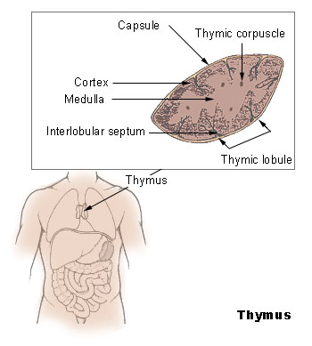
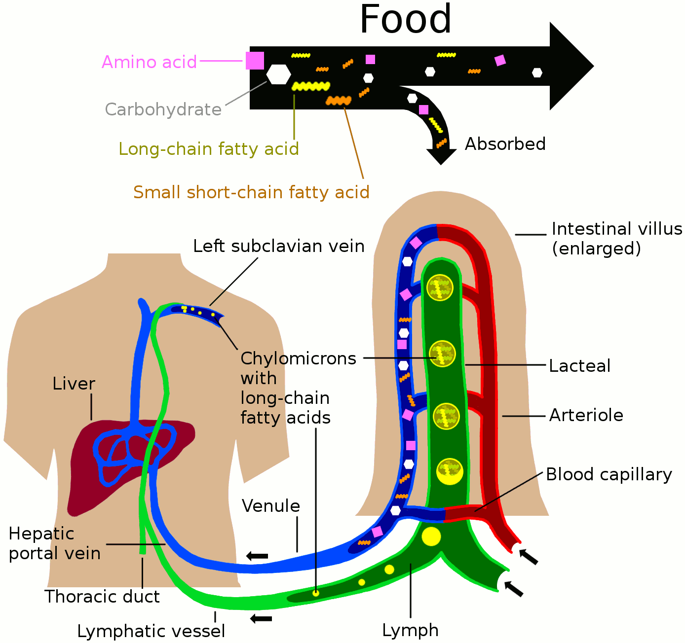
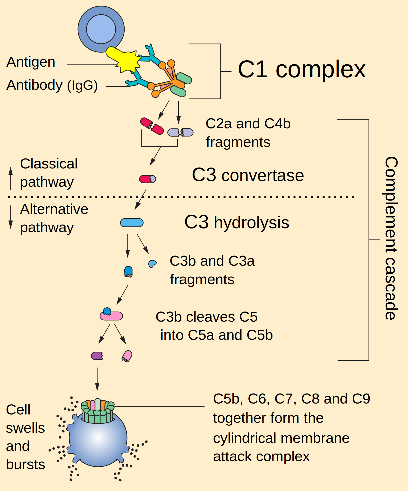
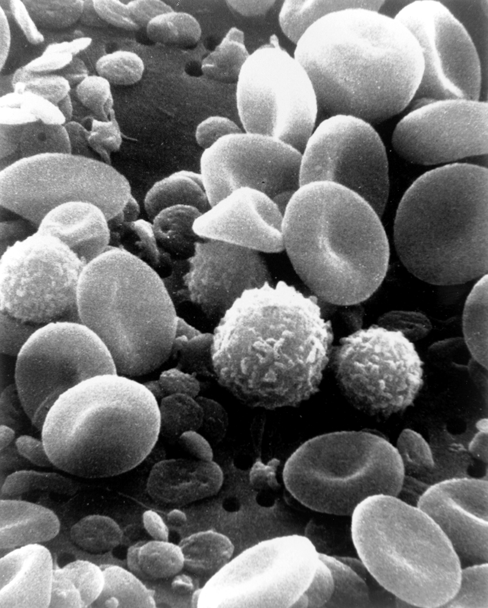
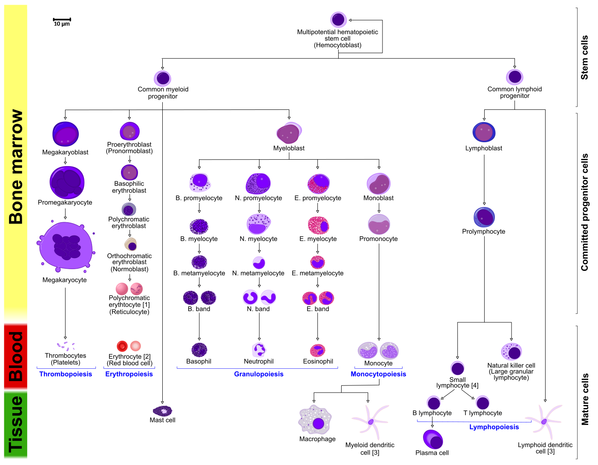

# Host Defenses And The Innate Immune Systems

## Immunology

Immunology is a branch of biology that covers the study of immune systems in all organisms. Immunology charts, measures, and contextualizes the physiological functioning of the immune system in states of both health and diseases; malfunctions of the immune system in immunological disorders (such as autoimmune diseases, hypersensitivities, immune deficiency, and transplant rejection); and the physical, chemical, and physiological characteristics of the components of the immune system in vitro, in situ, and in vivo. Immunology has applications in numerous disciplines of medicine, particularly in the fields of organ transplantation, oncology, rheumatology, virology, bacteriology, parasitology, psychiatry, and dermatology.

The term was coined by Russian biologist Ilya Ilyich Mechnikov, who advanced studies on immunology and received the Nobel Prize for his work in 1908. He pinned small thorns into starfish larvae and noticed unusual cells surrounding the thorns. This was the active response of the body trying to maintain its integrity. It was Mechnikov who first observed the phenomenon of phagocytosis, in which the body defends itself against a foreign body.

Prior to the designation of immunity, from the etymological root immunis, which is Latin for "exempt", early physicians characterized organs that would later be proven as essential components of the immune system. The important lymphoid organs of the immune system are the thymus, bone marrow, and chief lymphatic tissues such as spleen, tonsils, lymph vessels, lymph nodes, adenoids, and liver. When health conditions worsen to emergency status, portions of immune system organs, including the thymus, spleen, bone marrow, lymph nodes, and other lymphatic tissues, can be surgically excised for examination while patients are still alive.

Many components of the immune system are typically cellular in nature and not associated with any specific organ, but rather are embedded or circulating in various tissues located throughout the body.

## The Lymphatic System

The lymphatic system, or lymphoid system, is an organ system in vertebrates that is part of the circulatory system and the immune system. It is made up of a large network of lymphatic vessels, lymphatic or lymphoid organs, and lymphoid tissues. The vessels carry a clear fluid called lymph (the Latin word lympha refers to the deity of fresh water, "Lympha") towards the heart.

(ref:lymph) [The human lymphatic system.](https://commons.wikimedia.org/wiki/File:Blausen_0623_LymphaticSystem_Female.png)

(\#fig:lymphaticsystem)(ref:lymph)

The adjective used for the lymph-transporting system is lymphatic. The adjective used for the tissues where lymphocytes are formed is lymphoid. Lymphatic comes from the Latin word lymphaticus, meaning "connected to water."

Unlike the cardiovascular system, the lymphatic system is not a closed system. The human circulatory system processes an average of 20 litres of blood per day through capillary filtration, which removes plasma from the blood. Roughly 17 litres of the filtered plasma is reabsorbed directly into the blood vessels, while the remaining three litres remain in the interstitial fluid. One of the main functions of the lymphatic system is to provide an accessory return route to the blood for the surplus three litres.

The other main function is that of immune defense. Lymph is very similar to blood plasma, in that it contains waste products and cellular debris, together with bacteria and proteins. The cells of the lymph are mostly lymphocytes. Associated lymphoid organs are composed of lymphoid tissue, and are the sites either of lymphocyte production or of lymphocyte activation. These include the lymph nodes (where the highest lymphocyte concentration is found), the spleen, the thymus, and the tonsils. Lymphocytes are initially generated in the bone marrow. The lymphoid organs also contain other types of cells such as stromal cells for support. Lymphoid tissue is also associated with mucosas such as mucosa-associated lymphoid tissue (MALT).

Fluid from circulating blood leaks into the tissues of the body by capillary action, carrying nutrients to the cells. The fluid bathes the tissues as interstitial fluid, collecting waste products, bacteria, and damaged cells, and then drains as lymph into the lymphatic capillaries and lymphatic vessels. These vessels carry the lymph throughout the body, passing through numerous lymph nodes which filter out unwanted materials such as bacteria and damaged cells. Lymph then passes into much larger lymph vessels known as lymph ducts. The right lymphatic duct drains the right side of the region and the much larger left lymphatic duct, known as the thoracic duct, drains the left side of the body. The ducts empty into the subclavian veins to return to the blood circulation. Lymph is moved through the system by muscle contractions. In some vertebrates, a lymph heart is present that pumps the lymph to the veins.

The lymphatic system was first described in the 17th century independently by Olaus Rudbeck and Thomas Bartholin.

The lymphatic system consists of a conducting network of lymphatic vessels, lymphoid organs, lymphoid tissues, and the circulating lymph.

### Primary lymphoid organs

The primary (or central) lymphoid organs generate lymphocytes from immature progenitor cells. The thymus and the bone marrow constitute the primary lymphoid organs involved in the production and early clonal selection of lymphocyte tissues.

### The Bone Marrow

Bone marrow is responsible for both the creation of T cells and the production and maturation of B cells, which are important cell types of the immune system. From the bone marrow, B cells immediately join the circulatory system and travel to secondary lymphoid organs in search of pathogens. T cells, on the other hand, travel from the bone marrow to the thymus, where they develop further and mature. Mature T cells then join B cells in search of pathogens. The other 95% of T cells begin a process of apoptosis, a form of programmed cell death.

### The Thymus

The thymus increases in size from birth in response to postnatal antigen stimulation. It is most active during the neonatal and pre-adolescent periods. At puberty, by the early teens, the thymus begins to atrophy and regress, with adipose tissue mostly replacing the thymic stroma. However, residual T lymphopoiesis continues throughout adult life. The loss or lack of the thymus results in severe immunodeficiency and subsequent high susceptibility to infection. In most species, the thymus consists of lobules divided by septa which are made up of epithelium; it is therefore often considered an epithelial organ. T cells mature from thymocytes, proliferate, and undergo a selection process in the thymic cortex before entering the medulla to interact with epithelial cells.

(ref:thymus) [Location and microscopic anatomy of the human thymus](https://upload.wikimedia.org/wikipedia/commons/c/cf/Illu_thymus.jpg) 

(\#fig:humanthymus)(ref:thymus)

The thymus provides an inductive environment for the development of T cells from hematopoietic progenitor cells. In addition, thymic stromal cells allow for the selection of a functional and self-tolerant T cell repertoire. Therefore, one of the most important roles of the thymus is the induction of central tolerance.

### The Secondary Lymphoid Organs

The secondary (or peripheral) lymphoid organs (SLO), which include lymph nodes and the spleen, maintain mature naive lymphocytes and initiate an adaptive immune response. The peripheral lymphoid organs are the sites of lymphocyte activation by antigens. Activation leads to clonal expansion and affinity maturation. Mature lymphocytes recirculate between the blood and the peripheral lymphoid organs until they encounter their specific antigen.

### The Spleen

The main functions of the spleen are:

* to produce immune cells to fight antigens
* to remove particulate matter and aged blood cells, mainly red blood cells
* to produce blood cells during fetal life.

The spleen synthesizes antibodies in its white pulp and removes antibody-coated bacteria and antibody-coated blood cells by way of blood and lymph node circulation. A study published in 2009 using mice found that the spleen contains, in its reserve, half of the body's monocytes within the red pulp. These monocytes, upon moving to injured tissue (such as the heart), turn into dendritic cells and macrophages while promoting tissue healing. The spleen is a center of activity of the mononuclear phagocyte system and can be considered analogous to a large lymph node, as its absence causes a predisposition to certain infections.

(ref:spleen) [Location and microscopic anatomy of the human spleen.](https://commons.wikimedia.org/wiki/File:Illu_spleen.jpg) 

(\#fig:humanspleen)(ref:spleen)

Like the thymus, the spleen has only efferent lymphatic vessels. Both the short gastric arteries and the splenic artery supply it with blood. The germinal centers are supplied by arterioles called penicilliary radicles.

Until the fifth month of prenatal development, the spleen creates red blood cells; after birth, the bone marrow is solely responsible for hematopoiesis. As a major lymphoid organ and a central player in the reticuloendothelial system, the spleen retains the ability to produce lymphocytes. The spleen stores red blood cells and lymphocytes. It can store enough blood cells to help in an emergency. Up to 25% of lymphocytes can be stored at any one time.

### The Lymph Nodes

A lymph node is an organized collection of lymphoid tissue, through which the lymph passes on its way back to the blood. Lymph nodes are located at intervals along the lymphatic system. Several afferent lymph vessels bring in lymph, which percolates through the substance of the lymph node, and is then drained out by an efferent lymph vessel. Of the nearly 800 lymph nodes in the human body, about 300 are located in the head and neck. Many are grouped in clusters in different regions, as in the underarm and abdominal areas. Lymph node clusters are commonly found at the proximal ends of limbs (groin, armpits) and in the neck, where lymph is collected from regions of the body likely to sustain pathogen contamination from injuries. Lymph nodes are particularly numerous in the mediastinum in the chest, neck, pelvis, axilla, inguinal region, and in association with the blood vessels of the intestines.

(ref:lymphnod) [Schematic diagram of a lymph node showing flow of lymph through lymph sinuses](https://commons.wikimedia.org/wiki/File:Schematic_of_lymph_node_showing_lymph_sinuses.svg) 

(\#fig:lymphnode)(ref:lymphnod)

The substance of a lymph node consists of lymphoid follicles in an outer portion called the cortex. The inner portion of the node is called the medulla, which is surrounded by the cortex on all sides except for a portion known as the hilum. The hilum presents as a depression on the surface of the lymph node, causing the otherwise spherical lymph node to be bean-shaped or ovoid. The efferent lymph vessel directly emerges from the lymph node at the hilum. The arteries and veins supplying the lymph node with blood enter and exit through the hilum. The region of the lymph node called the paracortex immediately surrounds the medulla. Unlike the cortex, which has mostly immature T cells, or thymocytes, the paracortex has a mixture of immature and mature T cells. Lymphocytes enter the lymph nodes through specialised high endothelial venules found in the paracortex.

A lymph follicle is a dense collection of lymphocytes, the number, size, and configuration of which change in accordance with the functional state of the lymph node. For example, the follicles expand significantly when encountering a foreign antigen. The selection of B cells, or B lymphocytes, occurs in the germinal centre of the lymph nodes.

Secondary lymphoid tissue provides the environment for the foreign or altered native molecules (antigens) to interact with the lymphocytes. It is exemplified by the lymph nodes, and the lymphoid follicles in tonsils, Peyer's patches, spleen, adenoids, skin, etc. that are associated with the mucosa-associated lymphoid tissue (MALT).

In the gastrointestinal wall, the appendix has mucosa resembling that of the colon, but here it is heavily infiltrated with lymphocytes.

Lymphoid tissue associated with the lymphatic system is concerned with immune functions in defending the body against infections and the spread of tumours. It consists of connective tissue formed of reticular fibers, with various types of leukocytes (white blood cells), mostly lymphocytes enmeshed in it, through which the lymph passes. Regions of the lymphoid tissue that are densely packed with lymphocytes are known as lymphoid follicles. Lymphoid tissue can either be structurally well organized as lymph nodes or may consist of loosely organized lymphoid follicles known as the mucosa-associated lymphoid tissue (MALT).

### The Lymphatic Vessels

The lymphatic vessels, also called lymph vessels, are thin-walled vessels that conduct lymph between different parts of the body. They include the tubular vessels of the lymph capillaries, and the larger collecting vessels–the right lymphatic duct and the thoracic duct (the left lymphatic duct). The lymph capillaries are mainly responsible for the absorption of interstitial fluid from the tissues, while lymph vessels propel the absorbed fluid forward into the larger collecting ducts, where it ultimately returns to the bloodstream via one of the subclavian veins.

The tissues of the lymphatic system are responsible for maintaining the balance of the body fluids. Its network of capillaries and collecting lymphatic vessels work to efficiently drain and transport extravasated fluid, along with proteins and antigens, back to the circulatory system. Numerous intraluminal valves in the vessels ensure a unidirectional flow of lymph without reflux. Two valve systems, a primary and a secondary valve system, are used to achieve this unidirectional flow. The capillaries are blind-ended, and the valves at the ends of capillaries use specialised junctions together with anchoring filaments to allow a unidirectional flow to the primary vessels. The collecting lymphatics, however, act to propel the lymph by the combined actions of the intraluminal valves and lymphatic muscle cells.

(ref:lymphcap) [Lymph capillaries in the tissue spaces.](https://commons.wikimedia.org/wiki/File:2202_Lymphatic_Capillaries_big.png)

(\#fig:lymphaticcapillaries)(ref:lymphcap)

The lymphatic system has multiple interrelated functions:

* It is responsible for the removal of interstitial fluid from tissues
* It absorbs and transports fatty acids and fats as chyle from the digestive system
* It transports white blood cells to and from the lymph nodes into the bones
* The lymph transports antigen-presenting cells, such as dendritic cells, to the lymph nodes where an immune response is stimulated.

Nutrients in food are absorbed via intestinal vili (greatly enlarged in the picture) to blood and lymph. Long-chain fatty acids (and other lipids with similar fat solubility like some medicines) are absorbed to the lymph and move in it enveloped inside chylomicrons. They move via the thoracic duct of the lymphatic system and finally enter the blood via the left subclavian vein, thus bypassing the liver's first-pass metabolism completely.
Lymph vessels called lacteals are at the beginning of the gastrointestinal tract, predominantly in the small intestine. While most other nutrients absorbed by the small intestine are passed on to the portal venous system to drain via the portal vein into the liver for processing, fats (lipids) are passed on to the lymphatic system to be transported to the blood circulation via the thoracic duct. (There are exceptions, for example medium-chain triglycerides are fatty acid esters of glycerol that passively diffuse from the GI tract to the portal system.) The enriched lymph originating in the lymphatics of the small intestine is called chyle. The nutrients that are released into the circulatory system are processed by the liver, having passed through the systemic circulation.

(ref:lymphnut) [Nutrients in food are absorbed via intestinal vili (greatly enlarged in the picture) to blood and lymph. Long-chain fatty acids (and other lipids with similar fat solubility like some medicines) are absorbed to the lymph and move in it enveloped inside chylomicrons. They move via the thoracic duct of the lymphatic system and finally enter the blood via the left subclavian vein, thus bypassing the liver's first-pass metabolism completely.](https://commons.wikimedia.org/wiki/File:Nutrient_absorbtion_to_blood_and_lymph.png)

(\#fig:lymphnutrient)(ref:lymphnut)

The lymphatic system plays a major role in the body's immune system, as the primary site for cells relating to adaptive immune system including T-cells and B-cells. Cells in the lymphatic system react to antigens presented or found by the cells directly or by other dendritic cells. When an antigen is recognized, an immunological cascade begins involving the activation and recruitment of more and more cells, the production of antibodies and cytokines and the recruitment of other immunological cells such as macrophages.

## The Immune System

The immune system is a network of biological processes that protects an organism from diseases. It detects and responds to a wide variety of pathogens, from viruses to parasitic worms, as well as cancer cells and objects such as wood splinters, distinguishing them from the organism's own healthy tissue. Many species have two major subsystems of the immune system. The innate immune system provides a preconfigured response to broad groups of situations and stimuli. The adaptive immune system provides a tailored response to each stimulus by learning to recognize molecules it has previously encountered. Both use molecules and cells to perform their functions.

Nearly all organisms have some kind of immune system. Bacteria have a rudimentary immune system in the form of enzymes that protect against virus infections. Other basic immune mechanisms evolved in ancient plants and animals and remain in their modern descendants. These mechanisms include phagocytosis, antimicrobial peptides called defensins, and the complement system. Jawed vertebrates, including humans, have even more sophisticated defense mechanisms, including the ability to adapt to recognize pathogens more efficiently. Adaptive (or acquired) immunity creates an immunological memory leading to an enhanced response to subsequent encounters with that same pathogen. This process of acquired immunity is the basis of vaccination.

Dysfunction of the immune system can cause autoimmune diseases, inflammatory diseases and cancer. Immunodeficiency occurs when the immune system is less active than normal, resulting in recurring and life-threatening infections. In humans, immunodeficiency can be the result of a genetic disease such as severe combined immunodeficiency, acquired conditions such as HIV/AIDS, or the use of immunosuppressive medication. Autoimmunity results from a hyperactive immune system attacking normal tissues as if they were foreign organisms. Common autoimmune diseases include Hashimoto's thyroiditis, rheumatoid arthritis, diabetes mellitus type 1, and systemic lupus erythematosus. Immunology covers the study of all aspects of the immune system.

## Layered Defense

The immune system protects its host from infection with layered defenses of increasing specificity. Physical barriers prevent pathogens such as bacteria and viruses from entering the organism. If a pathogen breaches these barriers, the innate immune system provides an immediate, but non-specific response. Innate immune systems are found in all animals. If pathogens successfully evade the innate response, vertebrates possess a second layer of protection, the adaptive immune system, which is activated by the innate response. Here, the immune system adapts its response during an infection to improve its recognition of the pathogen. This improved response is then retained after the pathogen has been eliminated, in the form of an immunological memory, and allows the adaptive immune system to mount faster and stronger attacks each time this pathogen is encountered.

<table class="table" style="margin-left: auto; margin-right: auto;">
<caption>(\#tab:immune)Components of the immune system.</caption>
 <thead>
  <tr>
   <th style="text-align:left;"> Innate immune system </th>
   <th style="text-align:left;"> Adaptive immune system </th>
  </tr>
 </thead>
<tbody>
  <tr>
   <td style="text-align:left;"> Response is non-specific </td>
   <td style="text-align:left;"> Pathogen and antigen specific response </td>
  </tr>
  <tr>
   <td style="text-align:left;"> Exposure leads to immediate maximal response </td>
   <td style="text-align:left;"> Lag time between exposure and maximal response </td>
  </tr>
  <tr>
   <td style="text-align:left;"> Cell-mediated and humoral components </td>
   <td style="text-align:left;"> Cell-mediated and humoral components </td>
  </tr>
  <tr>
   <td style="text-align:left;"> No immunological memory </td>
   <td style="text-align:left;"> Exposure leads to immunological memory </td>
  </tr>
  <tr>
   <td style="text-align:left;"> Found in nearly all forms of life </td>
   <td style="text-align:left;"> Found only in jawed vertebrates </td>
  </tr>
</tbody>
</table>

Both innate and adaptive immunity depend on the ability of the immune system to distinguish between self and non-self molecules. In immunology, self molecules are components of an organism's body that can be distinguished from foreign substances by the immune system. Conversely, non-self molecules are those recognized as foreign molecules. One class of non-self molecules are called antigens (originally named for being antibody generators) and are defined as substances that bind to specific immune receptors and elicit an immune response.

## Surface Barriers

Several barriers protect organisms from infection, including mechanical, chemical, and biological barriers. The waxy cuticle of most leaves, the exoskeleton of insects, the shells and membranes of externally deposited eggs, and skin are examples of mechanical barriers that are the first line of defense against infection. Organisms cannot be completely sealed from their environments, so systems act to protect body openings such as the lungs, intestines, and the genitourinary tract. In the lungs, coughing and sneezing mechanically eject pathogens and other irritants from the respiratory tract. The flushing action of tears and urine also mechanically expels pathogens, while mucus secreted by the respiratory and gastrointestinal tract serves to trap and entangle microorganisms.

Chemical barriers also protect against infection. The skin and respiratory tract secrete antimicrobial peptides such as the β-defensins. Enzymes such as lysozyme and phospholipase A2 in saliva, tears, and breast milk are also antibacterials. Vaginal secretions serve as a chemical barrier following menarche, when they become slightly acidic, while semen contains defensins and zinc to kill pathogens. In the stomach, gastric acid serves as a chemical defense against ingested pathogens.

Within the genitourinary and gastrointestinal tracts, commensal flora serve as biological barriers by competing with pathogenic bacteria for food and space and, in some cases, changing the conditions in their environment, such as pH or available iron. As a result, the probability that pathogens will reach sufficient numbers to cause illness is reduced.

## Innate Immune System

Microorganisms or toxins that successfully enter an organism encounter the cells and mechanisms of the innate immune system. The innate response is usually triggered when microbes are identified by pattern recognition receptors, which recognize components that are conserved among broad groups of microorganisms, or when damaged, injured or stressed cells send out alarm signals, many of which are recognized by the same receptors as those that recognize pathogens. Innate immune defenses are non-specific, meaning these systems respond to pathogens in a generic way. This system does not confer long-lasting immunity against a pathogen. The innate immune system is the dominant system of host defense in most organisms, and the only one in plants.

The innate immune system is one of the two main immunity strategies found in vertebrates (the other being the adaptive immune system). The innate immune system is an older evolutionary defense strategy, relatively speaking, and is the dominant immune system response found in plants, fungi, insects, and primitive multicellular organisms.

The major functions of the vertebrate innate immune system include:

* Recruiting immune cells to sites of infection through the production of chemical factors, including specialized chemical mediators called cytokines
* Activation of the complement cascade to identify bacteria, activate cells, and promote clearance of antibody complexes or dead cells
* Identification and removal of foreign substances present in organs, tissues, blood and lymph, by specialized white blood cells
* Activation of the adaptive immune system through a process known as antigen presentation
* Acting as a physical and chemical barrier to infectious agents; via physical measures like skin or tree bark and chemical measures like clotting factors in blood or sap from a tree, which are released following a contusion or other injury that breaks through the first-line physical barrier (not to be confused with a second-line physical or chemical barrier, such as the blood-brain barrier, which protects the extremely vital and highly sensitive nervous system from pathogens that have already gained access to the host's body).

Cells in the innate immune system use pattern recognition receptors to recognize molecular structures that are produced by pathogens. They are proteins expressed, mainly, by cells of the innate immune system, such as dendritic cells, macrophages, monocytes, neutrophils and epithelial cells to identify two classes of molecules: pathogen-associated molecular patterns (PAMPs), which are associated with microbial pathogens, and damage-associated molecular patterns (DAMPs), which are associated with components of host's cells that are released during cell damage or cell death.

Recognition of extracellular or endosomal PAMPs is mediated by transmembrane proteins known as toll-like receptors (TLRs). TLRs share a typical structural motif, the leucine rich repeats (LRR), which give them a curved shape. Toll-like receptors were first discovered in Drosophila and trigger the synthesis and secretion of cytokines and activation of other host defense programs that are necessary for both innate or adaptive immune responses. Ten toll-like receptors have been described in humans.

Cells in the innate immune system have pattern recognition receptors, which detect infection or cell damage, inside. Three major classes of these "cytosolic" receptors are NOD–like receptors, RIG (retinoic acid-inducible gene)-like receptors, and cytosolic DNA sensors.

Some leukocytes (white blood cells) act like independent, single-celled organisms and are the second arm of the innate immune system. The innate leukocytes include the "professional" phagocytes (macrophages, neutrophils, and dendritic cells). These cells identify and eliminate pathogens, either by attacking larger pathogens through contact or by engulfing and then killing microorganisms. The other cells involved in the innate response include innate lymphoid cells, mast cells, eosinophils, basophils, and natural killer cells.

Phagocytosis is an important feature of cellular innate immunity performed by cells called phagocytes that engulf pathogens or particles. Phagocytes generally patrol the body searching for pathogens, but can be called to specific locations by cytokines. Once a pathogen has been engulfed by a phagocyte, it becomes trapped in an intracellular vesicle called a phagosome, which subsequently fuses with another vesicle called a lysosome to form a phagolysosome. The pathogen is killed by the activity of digestive enzymes or following a respiratory burst that releases free radicals into the phagolysosome. Phagocytosis evolved as a means of acquiring nutrients, but this role was extended in phagocytes to include engulfment of pathogens as a defense mechanism. Phagocytosis probably represents the oldest form of host defense, as phagocytes have been identified in both vertebrate and invertebrate animals.

Neutrophils and macrophages are phagocytes that travel throughout the body in pursuit of invading pathogens. Neutrophils are normally found in the bloodstream and are the most abundant type of phagocyte, representing 50% to 60% of total circulating leukocytes. During the acute phase of inflammation, neutrophils migrate toward the site of inflammation in a process called chemotaxis, and are usually the first cells to arrive at the scene of infection. Macrophages are versatile cells that reside within tissues and produce an array of chemicals including enzymes, complement proteins, and cytokines, while they can also act as scavengers that rid the body of worn-out cells and other debris, and as antigen-presenting cells (APC) that activate the adaptive immune system.

In immunology, the mononuclear phagocyte system or mononuclear phagocytic system (MPS) also known as the reticuloendothelial system or macrophage system is a part of the immune system that consists of the phagocytic cells located in reticular connective tissue. The cells are primarily monocytes and macrophages, and they accumulate in lymph nodes and the spleen. The Kupffer cells of the liver and tissue histiocytes are also part of the MPS. The mononuclear phagocyte system and the monocyte macrophage system refer to two different entities, often mistakenly understood as one.[citation needed]

"Reticuloendothelial system" is an older term for the mononuclear phagocyte system, but it is used less commonly now, as it is understood that most endothelial cells are not macrophages.

The mononuclear phagocyte system is also a somewhat dated concept trying to combine a broad range of cells, and should be used with caution.

Dendritic cells are phagocytes in tissues that are in contact with the external environment; therefore, they are located mainly in the skin, nose, lungs, stomach, and intestines. They are named for their resemblance to neuronal dendrites, as both have many spine-like projections. Dendritic cells serve as a link between the bodily tissues and the innate and adaptive immune systems, as they present antigens to T cells, one of the key cell types of the adaptive immune system.

Granulocytes are leukocytes that have granules in their cytoplasm. In this category are neutrophils, mast cells, basophils, and eosinophils. Mast cells reside in connective tissues and mucous membranes, and regulate the inflammatory response. They are most often associated with allergy and anaphylaxis. Basophils and eosinophils are related to neutrophils. They secrete chemical mediators that are involved in defending against parasites and play a role in allergic reactions, such as asthma.

Innate lymphoid cells (ILCs) are a group of innate immune cells that are derived from common lymphoid progenitor and belong to the lymphoid lineage. These cells are defined by absence of antigen specific B or T cell receptor (TCR) because of the lack of recombination activating gene. ILCs do not express myeloid or dendritic cell markers.

Natural killer cells (NK) are lymphocytes and a component of the innate immune system which does not directly attack invading microbes. Rather, NK cells destroy compromised host cells, such as tumor cells or virus-infected cells, recognizing such cells by a condition known as "missing self." This term describes cells with low levels of a cell-surface marker called MHC I (major histocompatibility complex)—a situation that can arise in viral infections of host cells. Normal body cells are not recognized and attacked by NK cells because they express intact self MHC antigens. Those MHC antigens are recognized by killer cell immunoglobulin receptors which essentially put the brakes on NK cells.

### Anatomical Barriers

Anatomical barriers include physical, chemical and biological barriers. The epithelial surfaces form a physical barrier that is impermeable to most infectious agents, acting as the first line of defense against invading organisms. Desquamation (shedding) of skin epithelium also helps remove bacteria and other infectious agents that have adhered to the epithelial surfaces. Lack of blood vessels, the inability of the epidermis to retain moisture, and the presence of sebaceous glands in the dermis, produces an environment unsuitable for the survival of microbes. In the gastrointestinal and respiratory tract, movement due to peristalsis or cilia, respectively, helps remove infectious agents. Also, mucus traps infectious agents. The gut flora can prevent the colonization of pathogenic bacteria by secreting toxic substances or by competing with pathogenic bacteria for nutrients or attachment to cell surfaces. The flushing action of tears and saliva helps prevent infection of the eyes and mouth.

### Inflammation

Inflammation is one of the first responses of the immune system to infection or irritation. Inflammation is stimulated by chemical factors released by injured cells and serves to establish a physical barrier against the spread of infection, and to promote healing of any damaged tissue following the clearance of pathogens.

The process of acute inflammation is initiated by cells already present in all tissues, mainly resident macrophages, dendritic cells, histiocytes, Kupffer cells, and mast cells. These cells present receptors contained on the surface or within the cell, named pattern recognition receptors (PRRs), which recognize molecules that are broadly shared by pathogens but distinguishable from host molecules, collectively referred to as pathogen-associated molecular patterns (PAMPs). At the onset of an infection, burn, or other injuries, these cells undergo activation (one of their PRRs recognizes a PAMP) and release inflammatory mediators responsible for the clinical signs of inflammation.

Chemical factors produced during inflammation (histamine, bradykinin, serotonin, leukotrienes, and prostaglandins) sensitize pain receptors, cause local vasodilation of the blood vessels, and attract phagocytes, especially neutrophils. Neutrophils then trigger other parts of the immune system by releasing factors that summon additional leukocytes and lymphocytes. Cytokines produced by macrophages and other cells of the innate immune system mediate the inflammatory response. These cytokines include TNF, HMGB1, and IL-1.

The inflammatory response is characterized by the following symptoms:

* redness of the skin, due to locally increased blood circulation;
* heat, either increased local temperature, such as a warm feeling around a localized infection, or a systemic fever;
* swelling of affected tissues, such as the upper throat during the common cold or joints affected by rheumatoid arthritis;
* increased production of mucus, which can cause symptoms like a runny nose or a productive cough;
* pain, either local pain, such as painful joints or a sore throat, or affecting the whole body, such as body aches; and
* possible dysfunction of the organs or tissues involved.

### Process of Acute Inflammation

The process of acute inflammation is initiated by resident immune cells already present in the involved tissue, mainly resident macrophages, dendritic cells, histiocytes, Kupffer cells and mast cells. These cells possess surface receptors known as pattern recognition receptors (PRRs), which recognize (i.e., bind) two subclasses of molecules: pathogen-associated molecular patterns (PAMPs) and damage-associated molecular patterns (DAMPs). PAMPs are compounds that are associated with various pathogens, but which are distinguishable from host molecules. DAMPs are compounds that are associated with host-related injury and cell damage.

(ref:infl) [A flowchart depicting the events of acute inflammation.](https://en.wikipedia.org/wiki/File:Events_in_Acute_Inflammation.pdf)

(\#fig:inflammation)(ref:infl)

At the onset of an infection, burn, or other injuries, these cells undergo activation (one of the PRRs recognize a PAMP or DAMP) and release inflammatory mediators responsible for the clinical signs of inflammation. Vasodilation and its resulting increased blood flow causes the redness (rubor) and increased heat (calor). Increased permeability of the blood vessels results in an exudation (leakage) of plasma proteins and fluid into the tissue (edema), which manifests itself as swelling (tumor). Some of the released mediators such as bradykinin increase the sensitivity to pain (hyperalgesia, dolor). The mediator molecules also alter the blood vessels to permit the migration of leukocytes, mainly neutrophils and macrophages, to flow out of the blood vessels (extravasation) and into the tissue. The neutrophils migrate along a chemotactic gradient created by the local cells to reach the site of injury. The loss of function (functio laesa) is probably the result of a neurological reflex in response to pain.

In addition to cell-derived mediators, several acellular biochemical cascade systems consisting of preformed plasma proteins act in parallel to initiate and propagate the inflammatory response. These include the complement system activated by bacteria and the coagulation and fibrinolysis systems activated by necrosis, e.g. a burn or a trauma.

Acute inflammation may be regarded as the first line of defense against injury. Acute inflammatory response requires constant stimulation to be sustained. Inflammatory mediators are short-lived and are quickly degraded in the tissue. Hence, acute inflammation begins to cease once the stimulus has been removed.

### Vasodilation And Increased Permeability

As defined, acute inflammation is an immunovascular response to an inflammatory stimulus. This means acute inflammation can be broadly divided into a vascular phase that occurs first, followed by a cellular phase involving immune cells (more specifically myeloid granulocytes in the acute setting). The vascular component of acute inflammation involves the movement of plasma fluid, containing important proteins such as fibrin and immunoglobulins (antibodies), into inflamed tissue.

Upon contact with PAMPs, tissue macrophages and mastocytes release vasoactive amines such as histamine and serotonin, as well as eicosanoids such as prostaglandin E2 and leukotriene B4 to remodel the local vasculature. Macrophages and endothelial cells release nitric oxide. These mediators vasodilate and permeabilize the blood vessels, which results in the net distribution of blood plasma from the vessel into the tissue space. The increased collection of fluid into the tissue causes it to swell (edema). This exuded tissue fluid contains various antimicrobial mediators from the plasma such as complement, lysozyme, antibodies, which can immediately deal damage to microbes, and opsonise the microbes in preparation for the cellular phase. If the inflammatory stimulus is a lacerating wound, exuded platelets, coagulants, plasmin and kinins can clot the wounded area and provide haemostasis in the first instance. These clotting mediators also provide a structural staging framework at the inflammatory tissue site in the form of a fibrin lattice – as would construction scaffolding at a construction site – for the purpose of aiding phagocytic debridement and wound repair later on. Some of the exuded tissue fluid is also funnelled by lymphatics to the regional lymph nodes, flushing bacteria along to start the recognition and attack phase of the adaptive immune system.

Acute inflammation is characterized by marked vascular changes, including vasodilation, increased permeability and increased blood flow, which are induced by the actions of various inflammatory mediators. Vasodilation occurs first at the arteriole level, progressing to the capillary level, and brings about a net increase in the amount of blood present, causing the redness and heat of inflammation. Increased permeability of the vessels results in the movement of plasma into the tissues, with resultant stasis due to the increase in the concentration of the cells within blood – a condition characterized by enlarged vessels packed with cells. Stasis allows leukocytes to marginate (move) along the endothelium, a process critical to their recruitment into the tissues. Normal flowing blood prevents this, as the shearing force along the periphery of the vessels moves cells in the blood into the middle of the vessel.

Plasma cascade systems
* The complement system, when activated, creates a cascade of chemical reactions that promotes opsonization, chemotaxis, and agglutination, and produces the MAC.
* The kinin system generates proteins capable of sustaining vasodilation and other physical inflammatory effects.
* The coagulation system or clotting cascade, which forms a protective protein mesh over sites of injury.
* The fibrinolysis system, which acts in opposition to the coagulation system, to counterbalance clotting and generate several other inflammatory mediators.

The cellular component involves leukocytes, which normally reside in blood and must move into the inflamed tissue via extravasation to aid in inflammation. Some act as phagocytes, ingesting bacteria, viruses, and cellular debris. Others release enzymatic granules that damage pathogenic invaders. Leukocytes also release inflammatory mediators that develop and maintain the inflammatory response. In general, acute inflammation is mediated by granulocytes, whereas chronic inflammation is mediated by mononuclear cells such as monocytes and lymphocytes.

<table class="table" style="margin-left: auto; margin-right: auto;">
<caption>(\#tab:pldm)Plasma-derived mediators of inflammation.</caption>
 <thead>
  <tr>
   <th style="text-align:left;"> Name </th>
   <th style="text-align:left;"> Produced by </th>
   <th style="text-align:left;"> Description </th>
  </tr>
 </thead>
<tbody>
  <tr>
   <td style="text-align:left;"> Bradykinin </td>
   <td style="text-align:left;"> Kinin system </td>
   <td style="text-align:left;"> A vasoactive protein that is able to induce vasodilation, increase vascular permeability, cause smooth muscle contraction, and induce pain. </td>
  </tr>
  <tr>
   <td style="text-align:left;"> C3 </td>
   <td style="text-align:left;"> Complement system </td>
   <td style="text-align:left;"> Cleaves to produce C3a and C3b. C3a stimulates histamine release by mast cells, thereby producing vasodilation. C3b is able to bind to bacterial cell walls and act as an opsonin, which marks the invader as a target for phagocytosis. </td>
  </tr>
  <tr>
   <td style="text-align:left;"> C5a </td>
   <td style="text-align:left;"> Complement system </td>
   <td style="text-align:left;"> Stimulates histamine release by mast cells, thereby producing vasodilation. It is also able to act as a chemoattractant to direct cells via chemotaxis to the site of inflammation. </td>
  </tr>
  <tr>
   <td style="text-align:left;"> Factor XII (Hageman Factor) </td>
   <td style="text-align:left;"> Liver </td>
   <td style="text-align:left;"> A protein that circulates inactively, until activated by collagen, platelets, or exposed basement membranes via conformational change. When activated, it in turn is able to activate three plasma systems involved in inflammation: the kinin system, fibrinolysis system, and coagulation system. </td>
  </tr>
  <tr>
   <td style="text-align:left;"> Membrane attack complex </td>
   <td style="text-align:left;"> Complement system </td>
   <td style="text-align:left;"> A complex of the complement proteins C5b, C6, C7, C8, and multiple units of C9. The combination and activation of this range of complement proteins forms the membrane attack complex, which is able to insert into bacterial cell walls and causes cell lysis with ensuing bacterial death. </td>
  </tr>
  <tr>
   <td style="text-align:left;"> Plasmin </td>
   <td style="text-align:left;"> Fibrinolysis system </td>
   <td style="text-align:left;"> Able to break down fibrin clots, cleave complement protein C3, and activate Factor XII. </td>
  </tr>
  <tr>
   <td style="text-align:left;"> Thrombin </td>
   <td style="text-align:left;"> Coagulation system </td>
   <td style="text-align:left;"> Cleaves the soluble plasma protein fibrinogen to produce insoluble fibrin, which aggregates to form a blood clot. Thrombin can also bind to cells via the PAR1 receptor to trigger several other inflammatory responses, such as production of chemokines and nitric oxide. </td>
  </tr>
</tbody>
</table>

### Leukocyte Extravasation

Various leukocytes, particularly neutrophils, are critically involved in the initiation and maintenance of inflammation. These cells must be able to move to the site of injury from their usual location in the blood, therefore mechanisms exist to recruit and direct leukocytes to the appropriate place. The process of leukocyte movement from the blood to the tissues through the blood vessels is known as extravasation and can be broadly divided up into a number of steps:

1. Leukocyte margination and endothelial adhesion: The white blood cells within the vessels which are generally centrally located move peripherally towards the walls of the vessels. Activated macrophages in the tissue release cytokines such as IL-1 and TNFα, which in turn leads to production of chemokines that bind to proteoglycans forming gradient in the inflamed tissue and along the endothelial wall. Inflammatory cytokines induce the immediate expression of P-selectin on endothelial cell surfaces and P-selectin binds weakly to carbohydrate ligands on the surface of leukocytes and causes them to "roll" along the endothelial surface as bonds are made and broken. Cytokines released from injured cells induce the expression of E-selectin on endothelial cells, which functions similarly to P-selectin. Cytokines also induce the expression of integrin ligands such as ICAM-1 and VCAM-1 on endothelial cells, which mediate the adhesion and further slow leukocytes down. These weakly bound leukocytes are free to detach if not activated by chemokines produced in injured tissue after signal transduction via respective G protein-coupled receptors that activates integrins on the leukocyte surface for firm adhesion. Such activation increases the affinity of bound integrin receptors for ICAM-1 and VCAM-1 on the endothelial cell surface, firmly binding the leukocytes to the endothelium.
1. Migration across the endothelium, known as transmigration, via the process of diapedesis: Chemokine gradients stimulate the adhered leukocytes to move between adjacent endothelial cells. The endothelial cells retract and the leukocytes pass through the basement membrane into the surrounding tissue using adhesion molecules such as ICAM-1.
1. Movement of leukocytes within the tissue via chemotaxis: Leukocytes reaching the tissue interstitium bind to extracellular matrix proteins via expressed integrins and CD44 to prevent them from leaving the site. A variety of molecules behave as chemoattractants, for example, C3a or C5, and cause the leukocytes to move along a chemotactic gradient towards the source of inflammation.

### Phagocytosis

Extravasated neutrophils in the cellular phase come into contact with microbes at the inflamed tissue. Phagocytes express cell-surface endocytic pattern recognition receptors (PRRs) that have affinity and efficacy against non-specific microbe-associated molecular patterns (PAMPs). Most PAMPs that bind to endocytic PRRs and initiate phagocytosis are cell wall components, including complex carbohydrates such as mannans and β-glucans, lipopolysaccharides (LPS), peptidoglycans, and surface proteins. Endocytic PRRs on phagocytes reflect these molecular patterns, with C-type lectin receptors binding to mannans and β-glucans, and scavenger receptors binding to LPS.

<table class="table" style="margin-left: auto; margin-right: auto;">
<caption>(\#tab:cdm)Cell-derived mediators of inflammation</caption>
 <thead>
  <tr>
   <th style="text-align:left;"> Name </th>
   <th style="text-align:left;"> Type </th>
   <th style="text-align:left;"> Source </th>
   <th style="text-align:left;"> Description </th>
  </tr>
 </thead>
<tbody>
  <tr>
   <td style="text-align:left;"> Lysosome granules </td>
   <td style="text-align:left;"> Enzymes </td>
   <td style="text-align:left;"> Granulocytes </td>
   <td style="text-align:left;"> These cells contain a large variety of enzymes that perform a number of functions. Granules can be classified as either specific or azurophilic depending upon the contents, and are able to break down a number of substances, some of which may be plasma-derived proteins that allow these enzymes to act as inflammatory mediators. </td>
  </tr>
  <tr>
   <td style="text-align:left;"> GM-CSF </td>
   <td style="text-align:left;"> Glycoprotein </td>
   <td style="text-align:left;"> Macrophages, monocytes, T-cells, B-cells, and tissue-resident cells </td>
   <td style="text-align:left;"> Elevated GM-CSF has been shown to contribute to inflammation in inflammatory arthritis, osteoarthritis, colitis asthma, obesity, and COVID-19. </td>
  </tr>
  <tr>
   <td style="text-align:left;"> Histamine </td>
   <td style="text-align:left;"> Monoamine </td>
   <td style="text-align:left;"> Mast cells and basophils </td>
   <td style="text-align:left;"> Stored in preformed granules, histamine is released in response to a number of stimuli. It causes arteriole dilation, increased venous permeability, and a wide variety of organ-specific effects. </td>
  </tr>
  <tr>
   <td style="text-align:left;"> IFN-γ </td>
   <td style="text-align:left;"> Cytokine </td>
   <td style="text-align:left;"> T-cells, NK cells </td>
   <td style="text-align:left;"> Antiviral, immunoregulatory, and anti-tumour properties. This interferon was originally called macrophage-activating factor, and is especially important in the maintenance of chronic inflammation. </td>
  </tr>
  <tr>
   <td style="text-align:left;"> IL-6 </td>
   <td style="text-align:left;"> Cytokine and Myokine </td>
   <td style="text-align:left;"> Macrophages, osteoblasts, adipocytes, and smooth muscle cells (cytokine) Skeletal muscle cells (myokine) </td>
   <td style="text-align:left;"> Pro-inflammatory cytokine secreted by macrophages in response to pathogen-associated molecular patterns (PAMPs); pro-inflammatory cytokine secreted by adipocytes, especially in obesity; anti-inflammatory myokine secreted by skeletal muscle cells in response to exercise. </td>
  </tr>
  <tr>
   <td style="text-align:left;"> IL-8 </td>
   <td style="text-align:left;"> Chemokine </td>
   <td style="text-align:left;"> Primarily macrophages </td>
   <td style="text-align:left;"> Activation and chemoattraction of neutrophils, with a weak effect on monocytes and eosinophils. </td>
  </tr>
  <tr>
   <td style="text-align:left;"> Leukotriene B4 </td>
   <td style="text-align:left;"> Eicosanoid </td>
   <td style="text-align:left;"> Leukocytes, cancer cells </td>
   <td style="text-align:left;"> Able to mediate leukocyte adhesion and activation, allowing them to bind to the endothelium and migrate across it. In neutrophils, it is also a potent chemoattractant, and is able to induce the formation of reactive oxygen species and the release of lysosomal enzymes by these cells. </td>
  </tr>
  <tr>
   <td style="text-align:left;"> LTC4, LTD4 </td>
   <td style="text-align:left;"> Eicosanoid </td>
   <td style="text-align:left;"> eosinophils, mast cells, macrophages </td>
   <td style="text-align:left;"> These three Cysteine-containing leukotrienes contract lung airways, increase micro-vascular permeability, stimulate mucus secretion, and promote eosinophil-based inflammation in the lung, skin, nose, eye, and other tissues. </td>
  </tr>
  <tr>
   <td style="text-align:left;"> 5-oxo-eicosatetraenoic acid </td>
   <td style="text-align:left;"> Eicosanoid </td>
   <td style="text-align:left;"> leukocytes, cancer cells </td>
   <td style="text-align:left;"> Potent stimulator of neutrophil chemotaxis, lysosome enzyme release, and reactive oxygen species formation; monocyte chemotaxis; and with even greater potency eosinophil chemotaxis, lysosome enzyme release, and reactive oxygen species formation. </td>
  </tr>
  <tr>
   <td style="text-align:left;"> 5-HETE </td>
   <td style="text-align:left;"> Eicosanoid </td>
   <td style="text-align:left;"> Leukocytes </td>
   <td style="text-align:left;"> Metabolic precursor to 5-Oxo-eicosatetraenoic acid, it is a less potent stimulator of neutrophil chemotaxis, lysosome enzyme release, and reactive oxygen species formation; monocyte chemotaxis; and eosinophil chemotaxis, lysosome enzyme release, and reactive oxygen species formation. </td>
  </tr>
  <tr>
   <td style="text-align:left;"> Prostaglandins </td>
   <td style="text-align:left;"> Eicosanoid </td>
   <td style="text-align:left;"> Mast cells </td>
   <td style="text-align:left;"> A group of lipids that can cause vasodilation, fever, and pain. </td>
  </tr>
  <tr>
   <td style="text-align:left;"> Nitric oxide </td>
   <td style="text-align:left;"> Soluble gas </td>
   <td style="text-align:left;"> Macrophages, endothelial cells, some neurons </td>
   <td style="text-align:left;"> Potent vasodilator, relaxes smooth muscle, reduces platelet aggregation, aids in leukocyte recruitment, direct antimicrobial activity in high concentrations. </td>
  </tr>
  <tr>
   <td style="text-align:left;"> TNF-α and IL-1 </td>
   <td style="text-align:left;"> Cytokines </td>
   <td style="text-align:left;"> Primarily macrophages </td>
   <td style="text-align:left;"> Both affect a wide variety of cells to induce many similar inflammatory reactions: fever, production of cytokines, endothelial gene regulation, chemotaxis, leukocyte adherence, activation of fibroblasts. Responsible for the systemic effects of inflammation, such as loss of appetite and increased heart rate. TNF-α inhibits osteoblast differentiation. </td>
  </tr>
  <tr>
   <td style="text-align:left;"> Tryptase </td>
   <td style="text-align:left;"> Enzymes </td>
   <td style="text-align:left;"> Mast Cells </td>
   <td style="text-align:left;"> This serine protease is believed to be exclusively stored in mast cells and secreted, along with histamine, during mast cell activation.[20][21][22] </td>
  </tr>
</tbody>
</table>

Upon endocytic PRR binding, actin-myosin cytoskeletal rearrangement adjacent to the plasma membrane occurs in a way that endocytoses the plasma membrane containing the PRR-PAMP complex, and the microbe. Phosphatidylinositol and Vps34-Vps15-Beclin1 signalling pathways have been implicated to traffic the endocytosed phagosome to intracellular lysosomes, where fusion of the phagosome and the lysosome produces a phagolysosome. The reactive oxygen species, superoxides and hypochlorite bleach within the phagolysosomes then kill microbes inside the phagocyte.

(ref:phagdia) [Simplified diagram of the phagocytosis and destruction of a bacterial cell.](https://commons.wikimedia.org/wiki/File:Phagocytosis2.png)

(\#fig:phagocytosisdiagram)(ref:phagdia)

Phagocytic efficacy can be enhanced by opsonization. Plasma derived complement C3b and antibodies that exude into the inflamed tissue during the vascular phase bind to and coat the microbial antigens. As well as endocytic PRRs, phagocytes also express opsonin receptors Fc receptor and complement receptor 1 (CR1), which bind to antibodies and C3b, respectively. The co-stimulation of endocytic PRR and opsonin receptor increases the efficacy of the phagocytic process, enhancing the lysosomal elimination of the infective agent.

The inflammatory response must be actively terminated when no longer needed to prevent unnecessary "bystander" damage to tissues. Failure to do so results in chronic inflammation, and cellular destruction. Resolution of inflammation occurs by different mechanisms in different tissues. Mechanisms that serve to terminate inflammation include:

* Short half-life of inflammatory mediators in vivo.
* Production and release of transforming growth factor (TGF) beta from macrophages
* Production and release of interleukin 10 (IL-10)
* Production of anti-inflammatory specialized proresolving mediators, i.e. lipoxins, resolvins, maresins, and neuroprotectins
* Downregulation of pro-inflammatory molecules, such as leukotrienes.
* Upregulation of anti-inflammatory molecules such as the interleukin 1 receptor antagonist or the soluble tumor necrosis factor receptor (TNFR)
* Apoptosis of pro-inflammatory cells
* Desensitization of receptors.
* Increased survival of cells in regions of inflammation due to their interaction with the extracellular matrix (ECM)
* Downregulation of receptor activity by high concentrations of ligands
Cleavage of chemokines by matrix metalloproteinases (MMPs) might lead to production of anti-inflammatory factors.

### Systemic Inflammation And Obesity

With the discovery of interleukins (IL), the concept of systemic inflammation developed. Although the processes involved are identical to tissue inflammation, systemic inflammation is not confined to a particular tissue but involves the endothelium and other organ systems.

Chronic inflammation is widely observed in obesity. Obese people commonly have many elevated markers of inflammation, including:

* IL-6 (Interleukin-6)
* IL-8 (Interleukin-8)
* IL-18 (Interleukin-18)
* TNF-α (Tumor necrosis factor-alpha)
* CRP (C-reactive protein)
* Insulin
* Blood glucose
* Leptin
* Low-grade chronic inflammation is characterized by a two- to threefold increase in the systemic concentrations of cytokines such as TNF-α, IL-6, and CRP. Waist circumference correlates significantly with systemic inflammatory response.

Loss of white adipose tissue reduces levels of inflammation markers. The association of systemic inflammation with insulin resistance and type 2 diabetes, and with atherosclerosis is under preliminary research, although rigorous clinical trials have not been conducted to confirm such relationships.

C-reactive protein (CRP) is generated at a higher level in obese people, and may increase the risk for cardiovascular diseases.

### Complement System

The complement system is a biochemical cascade of the immune system that helps, or “complements”, the ability of antibodies to clear pathogens or mark them for destruction by other cells. The cascade is composed of many plasma proteins, synthesized in the liver, primarily by hepatocytes. The proteins work together to:

* trigger the recruitment of inflammatory cells
* "tag" pathogens for destruction by other cells by opsonizing, or coating, the surface of the pathogen
* form holes in the plasma membrane of the pathogen, resulting in cytolysis of the pathogen cell, causing the death of the pathogen
* rid the body of neutralised antigen-antibody complexes.

There are three different complement systems: Classical, alternative, Lectin

* Classical: starts when antibody binds to bacteria
* Alternative: starts "spontaneously"
* Lectin: starts when lectins bind to mannose on bacteria

Elements of the complement cascade can be found in many non-mammalian species including plants, birds, fish, and some species of invertebrates.

(ref:complement) [The complement system](https://commons.wikimedia.org/wiki/File:Complement_pathway.svg) is made up of about 25 proteins that work together to “complement” the action of antibodies in destroying bacteria. Complement proteins circulate in the blood in an inactive form. When the first protein in the complement series is activated— typically by antibody that has locked onto an antigen—it sets in motion a domino effect. Each component takes its turn in a precise chain of steps known as the complement cascade. The end product is a cylinder inserted into—and puncturing a hole in—the cell’s wall. With fluids and molecules flowing in and out, the cell swells and bursts.

(\#fig:complementsystem)(ref:complement)

### Blood 

Blood is a body fluid in humans and other animals that delivers necessary substances such as nutrients and oxygen to the cells and transports metabolic waste products away from those same cells.

In vertebrates, it is composed of blood cells suspended in blood plasma. Plasma, which constitutes 55% of blood fluid, is mostly water (92% by volume), and contains proteins, glucose, mineral ions, hormones, carbon dioxide (plasma being the main medium for excretory product transportation), and blood cells themselves. Albumin is the main protein in plasma, and it functions to regulate the colloidal osmotic pressure of blood. The blood cells are mainly red blood cells (also called RBCs or erythrocytes), white blood cells (also called WBCs or leukocytes) and platelets (also called thrombocytes). The most abundant cells in vertebrate blood are red blood cells. These contain hemoglobin, an iron-containing protein, which facilitates oxygen transport by reversibly binding to this respiratory gas and greatly increasing its solubility in blood. In contrast, carbon dioxide is mostly transported extracellularly as bicarbonate ion transported in plasma.

(ref:bloodcells) [A scanning electron microscope image of normal circulating human blood. ](https://commons.wikimedia.org/wiki/File:SEM_blood_cells.jpg) One can see red blood cells, several knobby white blood cells including lymphocytes, a monocyte, a neutrophil, and many small disc-shape platelets.

(\#fig:bloodcellsem)(ref:bloodcells)

Vertebrate blood is bright red when its hemoglobin is oxygenated and dark red when it is deoxygenated. Some animals, such as crustaceans and mollusks, use hemocyanin to carry oxygen, instead of hemoglobin. Insects and some mollusks use a fluid called hemolymph instead of blood, the difference being that hemolymph is not contained in a closed circulatory system. In most insects, this "blood" does not contain oxygen-carrying molecules such as hemoglobin because their bodies are small enough for their tracheal system to suffice for supplying oxygen.

Jawed vertebrates have an adaptive immune system, based largely on white blood cells. White blood cells help to resist infections and parasites. Platelets are important in the clotting of blood. Arthropods, using hemolymph, have hemocytes as part of their immune system.

Blood is circulated around the body through blood vessels by the pumping action of the heart. In animals with lungs, arterial blood carries oxygen from inhaled air to the tissues of the body, and venous blood carries carbon dioxide, a waste product of metabolism produced by cells, from the tissues to the lungs to be exhaled.

Medical terms related to blood often begin with hemo- or hemato- (also spelled haemo- and haemato-) from the Greek word αἷμα (haima) for "blood". In terms of anatomy and histology, blood is considered a specialized form of connective tissue, given its origin in the bones and the presence of potential molecular fibers in the form of fibrinogen.

Blood accounts for 7% of the human body weight, with an average density around 1060 kg/m3, very close to pure water's density of 1000 kg/m3. The average adult has a blood volume of roughly 5 litres (11 US pt) or 1.3 gallons, which is composed of plasma and formed elements. The formed elements are the two types of blood cell or corpuscle – the red blood cells, (erythrocytes) and white blood cells (leukocytes), and the cell fragments called platelets that are involved in clotting. By volume, the red blood cells constitute about 45% of whole blood, the plasma about 54.3%, and white cells about 0.7%.

One microliter of blood contains:

* 4.7 to 6.1 million (male), 4.2 to 5.4 million (female) erythrocytes: Red blood cells contain the blood's hemoglobin and distribute oxygen. Mature red blood cells lack a nucleus and organelles in mammals. The red blood cells (together with endothelial vessel cells and other cells) are also marked by glycoproteins that define the different blood types. The proportion of blood occupied by red blood cells is referred to as the hematocrit, and is normally about 45%. The combined surface area of all red blood cells of the human body would be roughly 2,000 times as great as the body's exterior surface.
* 4,000–11,000 leukocytes: White blood cells are part of the body's immune system; they destroy and remove old or aberrant cells and cellular debris, as well as attack infectious agents (pathogens) and foreign substances. The cancer of leukocytes is called leukemia.
* 200,000–500,000 thrombocytes: Also called platelets, they take part in blood clotting (coagulation). Fibrin from the coagulation cascade creates a mesh over the platelet plug.

About 55% of blood is blood plasma, a fluid that is the blood's liquid medium, which by itself is straw-yellow in color. The blood plasma volume totals of 2.7–3.0 liters (2.8–3.2 quarts) in an average human. It is essentially an aqueous solution containing 92% water, 8% blood plasma proteins, and trace amounts of other materials. Plasma circulates dissolved nutrients, such as glucose, amino acids, and fatty acids (dissolved in the blood or bound to plasma proteins), and removes waste products, such as carbon dioxide, urea, and lactic acid.

Other important components include:

* Serum albumin
* Blood-clotting factors (to facilitate coagulation)
* Immunoglobulins (antibodies)
* lipoprotein particles
* Various other proteins
* Various electrolytes (mainly sodium and chloride)

The term serum refers to plasma from which the clotting proteins have been removed. Most of the proteins remaining are albumin and immunoglobulins.

### Haematopoiesis

Haematopoiesis (/hɪˌmætoʊpɔɪˈiːsɪs, ˈhiːmətoʊ-, ˌhɛmə-/, from Greek αἷμα, 'blood' and ποιεῖν 'to make'; also hematopoiesis in American English; sometimes also h(a)emopoiesis) is the formation of blood cellular components. All cellular blood components are derived from haematopoietic stem cells. In a healthy adult person, approximately 1011–1012 new blood cells are produced daily in order to maintain steady state levels in the peripheral circulation.

(ref:hemato) [Detailed and comprehensive diagram showing the development of different blood cells in humans.](https://commons.wikimedia.org/wiki/File:Hematopoiesis_(human)_diagram_en.svg) The morphological characteristics of the hematopoietic cells are shown as seen in a Wright’s stain, May-Giemsa stain or May-Grünwald-Giemsa stain. Alternative names of certain cells are indicated between parentheses. Certain cells may have more than one characteristic appearance. In these cases, more than one representation of the same cell has been included. Together, the monocyte and the lymphocytes comprise the agranulocytes, as opposed to the granulocytes (basophil, neurtophil and eosinophil) that are produced during granulopoiesis. B., N. and E. stand for Basophilic, Neutrophilic and Eosinophilic, respectively – as in Basophilic promyelocyte. For lymphocytes, the T and B are actual designations. The polychromatic erythrocyte (reticulocyte) at the right shows its characteristic appearance when stained with methylene blue or Azure B. The erythrocyte at the right is a more accurate representation of its appearance in reality when viewed through a microscope. Other cells that arise from the monocyte: osteoclast, microglia (central nervous system), Langerhans cell (epidermis), Kupffer cell (liver). For clarity, the T and B lymphocyte are split to better indicate that the plasma cell arises from the B-cell. Note that there is no difference in the appearance of B- and T-cells unless specific staining is applied.

(\#fig:hematopoiesis)(ref:hemato)

Haematopoietic stem cells (HSCs) reside in the medulla of the bone (bone marrow) and have the unique ability to give rise to all of the different mature blood cell types and tissues. HSCs are self-renewing cells: when they differentiate, at least some of their daughter cells remain as HSCs, so the pool of stem cells is not depleted. This phenomenon is called asymmetric division. The other daughters of HSCs (myeloid and lymphoid progenitor cells) can follow any of the other differentiation pathways that lead to the production of one or more specific types of blood cell, but cannot renew themselves. The pool of progenitors is heterogeneous and can be divided into two groups; long-term self-renewing HSC and only transiently self-renewing HSC, also called short-terms. This is one of the main vital processes in the body.

### White Blood Cells

All white blood cells (WBCs) are known as leukocytes. Most leukocytes differ from other cells of the body in that they are not tightly associated with a particular organ or tissue; thus, their function is similar to that of independent, single-cell organisms. Most leukocytes are able to move freely and interact with and capture cellular debris, foreign particles, and invading microorganisms (although macrophages, mast cells, and dendritic cells are less mobile). Unlike many other cells in the body, most innate immune leukocytes cannot divide or reproduce on their own, but are the products of multipotent hematopoietic stem cells present in the bone marrow.

(ref:leukoc) [Major types of white blood cells.](https://commons.wikimedia.org/wiki/File:Blausen_0909_WhiteBloodCells.png)

(\#fig:leukocytes)(ref:leukoc)

The innate leukocytes include: natural killer cells, mast cells, eosinophils, basophils; and the phagocytic cells include macrophages, neutrophils, and dendritic cells, and function within the immune system by identifying and eliminating pathogens that might cause infection.

### Mast cells

Mast cells are a type of innate immune cell that resides in connective tissue and in mucous membranes. They are intimately associated with wound healing and defense against pathogens, but are also often associated with allergy and anaphylaxis (serious allergic reactions that can cause death). When activated, mast cells rapidly release characteristic granules, rich in histamine and heparin, along with various hormonal mediators and chemokines, or chemotactic cytokines into the environment. Histamine dilates blood vessels, causing the characteristic signs of inflammation, and recruits neutrophils and macrophages.

### Phagocytes

The word 'phagocyte' literally means 'eating cell'. These are immune cells that engulf, or 'phagocytose', pathogens or particles. To engulf a particle or pathogen, a phagocyte extends portions of its plasma membrane, wrapping the membrane around the particle until it is enveloped (i.e., the particle is now inside the cell). Once inside the cell, the invading pathogen is contained inside a phagosome, which merges with a lysosome. The lysosome contains enzymes and acids that kill and digest the particle or organism. In general, phagocytes patrol the body searching for pathogens, but are also able to react to a group of highly specialized molecular signals produced by other cells, called cytokines. The phagocytic cells of the immune system include macrophages, neutrophils, and dendritic cells.

(ref:phago) [Scanning electron micrograph of a neutrophil phagocytosing anthrax bacilli (orange). Scale bar is 5 micrometers.](https://commons.wikimedia.org/wiki/File:Neutrophil_with_anthrax_copy.jpg) 

(\#fig:neutrophago)(ref:phago)

Phagocytosis of the hosts’ own cells is common as part of regular tissue development and maintenance. When host cells die, either by programmed cell death (also called apoptosis) or by cell injury due to a bacterial or viral infection, phagocytic cells are responsible for their removal from the affected site. By helping to remove dead cells preceding growth and development of new healthy cells, phagocytosis is an important part of the healing process following tissue injury.

### Macrophages

Macrophages, from the Greek, meaning "large eaters", are large phagocytic leukocytes, which are able to move outside of the vascular system by migrating through the walls of capillary vessels and entering the areas between cells in pursuit of invading pathogens. In tissues, organ-specific macrophages are differentiated from phagocytic cells present in the blood called monocytes. Macrophages are the most efficient phagocytes and can phagocytose substantial numbers of bacteria or other cells or microbes. The binding of bacterial molecules to receptors on the surface of a macrophage triggers it to engulf and destroy the bacteria through the generation of a “respiratory burst”, causing the release of reactive oxygen species. Pathogens also stimulate the macrophage to produce chemokines, which summon other cells to the site of infection.

### Neutrophils

Neutrophils, along with two other cell types (eosinophils and basophils; see below), are known as granulocytes due to the presence of granules in their cytoplasm, or as polymorphonuclear cells (PMNs) due to their distinctive lobed nuclei. Neutrophil granules contain a variety of toxic substances that kill or inhibit growth of bacteria and fungi. Similar to macrophages, neutrophils attack pathogens by activating a respiratory burst. The main products of the neutrophil respiratory burst are strong oxidizing agents including hydrogen peroxide, free oxygen radicals and hypochlorite. Neutrophils are the most abundant type of phagocyte, normally representing 50-60% of the total circulating leukocytes, and are usually the first cells to arrive at the site of an infection. The bone marrow of a normal healthy adult produces more than 100 billion neutrophils per day, and more than 10 times that many per day during acute inflammation.

### Dendritic Cells

Dendritic cells (DCs) are phagocytic cells present in tissues that are in contact with the external environment, mainly the skin (where they are often called Langerhans cells), and the inner mucosal lining of the nose, lungs, stomach, and intestines. They are named for their resemblance to neuronal dendrites, but dendritic cells are not connected to the nervous system. Dendritic cells are very important in the process of antigen presentation, and serve as a link between the innate and adaptive immune systems.

### Basophils And Eosinophils

Basophils and eosinophils are cells related to the neutrophil (see above). When activated by a pathogen encounter, histamine-releasing basophils are important in the defense against parasites and play a role in allergic reactions, such as asthma. Upon activation, eosinophils secrete a range of highly toxic proteins and free radicals that are highly effective in killing parasites, but may also damage tissue during an allergic reaction. Activation and release of toxins by eosinophils are, therefore, tightly regulated to prevent any inappropriate tissue destruction.

### Natural Killer Cells

Natural killer cells (NK cells) are a component of the innate immune system that does not directly attack invading microbes. Rather, NK cells destroy compromised host cells, such as tumor cells or virus-infected cells, recognizing such cells by a condition known as "missing self." This term describes cells with abnormally low levels of a cell-surface marker called MHC I (major histocompatibility complex) - a situation that can arise in viral infections of host cells. They were named "natural killer" because of the initial notion that they do not require activation in order to kill cells that are "missing self." For many years, it was unclear how NK cell recognize tumor cells and infected cells. It is now known that the MHC makeup on the surface of those cells is altered and the NK cells become activated through recognition of "missing self". Normal body cells are not recognized and attacked by NK cells because they express intact self MHC antigens. Those MHC antigens are recognized by killer cell immunoglobulin receptors (KIR) that, in essence, put the brakes on NK cells. The NK-92 cell line does not express KIR and is developed for tumor therapy.

### γδ T Cells

Like other 'unconventional' T cell subsets bearing invariant T cell receptors (TCRs), such as CD1d-restricted Natural Killer T cells, γδ T cells exhibit characteristics that place them at the border between innate and adaptive immunity. On one hand, γδ T cells may be considered a component of adaptive immunity in that they rearrange TCR genes to produce junctional diversity and develop a memory phenotype. However, the various subsets may also be considered part of the innate immune system where a restricted TCR or NK receptors may be used as a pattern recognition receptor. For example, according to this paradigm, large numbers of Vγ9/Vδ2 T cells respond within hours to common molecules produced by microbes, and highly restricted intraepithelial Vδ1 T cells will respond to stressed epithelial cells.

### Other Vertebrate Mechanisms

The coagulation system overlaps with the immune system. Some products of the coagulation system can contribute to the non-specific defenses by their ability to increase vascular permeability and act as chemotactic agents for phagocytic cells. In addition, some of the products of the coagulation system are directly antimicrobial. For example, beta-lysine, a protein produced by platelets during coagulation, can cause lysis of many Gram-positive bacteria by acting as a cationic detergent. Many acute-phase proteins of inflammation are involved in the coagulation system.

Also increased levels of lactoferrin and transferrin inhibit bacterial growth by binding iron, an essential nutrient for bacteria.

### Neural Regulation

The innate immune response to infectious and sterile injury is modulated by neural circuits that control cytokine production period. The inflammatory reflex is a prototypical neural circuit that controls cytokine production in the spleen. Action potentials transmitted via the vagus nerve to spleen mediate the release of acetylcholine, the neurotransmitter that inhibits cytokine release by interacting with alpha7 nicotinic acetylcholine receptors (CHRNA7) expressed on cytokine-producing cells. The motor arc of the inflammatory reflex is termed the cholinergic anti-inflammatory pathway.

### Pathogen-specificity

<table class="table" style="margin-left: auto; margin-right: auto;">
<caption>(\#tab:path)The parts of the innate immune system have different specificity for different pathogens.</caption>
 <thead>
  <tr>
   <th style="text-align:left;"> Pathogen </th>
   <th style="text-align:left;"> Main examples </th>
   <th style="text-align:left;"> Phagocytosis </th>
   <th style="text-align:left;"> Complement </th>
   <th style="text-align:left;"> NK cells </th>
  </tr>
 </thead>
<tbody>
  <tr>
   <td style="text-align:left;"> Intracellular and cytoplasmic virus </td>
   <td style="text-align:left;"> influenza mumps measles rhinovirus </td>
   <td style="text-align:left;"> yes </td>
   <td style="text-align:left;"> yes[16] </td>
   <td style="text-align:left;"> yes </td>
  </tr>
  <tr>
   <td style="text-align:left;"> Intracellular bacteria </td>
   <td style="text-align:left;"> Listeria monocytogenes Legionella Mycobacterium Rickettsia </td>
   <td style="text-align:left;"> yes (specifically neutrophils, no for rickettsia) </td>
   <td style="text-align:left;"> yes[17] </td>
   <td style="text-align:left;"> yes (no for rickettsia) </td>
  </tr>
  <tr>
   <td style="text-align:left;"> Extracellular bacteria </td>
   <td style="text-align:left;"> Staphylococcus Streptococcus Neisseria Salmonella typhi </td>
   <td style="text-align:left;"> yes </td>
   <td style="text-align:left;"> yes </td>
   <td style="text-align:left;"> no </td>
  </tr>
  <tr>
   <td style="text-align:left;"> Intracellular protozoa </td>
   <td style="text-align:left;"> Plasmodium malariae Leishmania donovani </td>
   <td style="text-align:left;"> no </td>
   <td style="text-align:left;"> no </td>
   <td style="text-align:left;"> no </td>
  </tr>
  <tr>
   <td style="text-align:left;"> Extracellular protozoa </td>
   <td style="text-align:left;"> Entamoeba histolytica Giardia lamblia </td>
   <td style="text-align:left;"> yes </td>
   <td style="text-align:left;"> yes </td>
   <td style="text-align:left;"> no </td>
  </tr>
  <tr>
   <td style="text-align:left;"> Extracellular fungi </td>
   <td style="text-align:left;"> Candida Histoplasma Cryptococcus </td>
   <td style="text-align:left;"> no </td>
   <td style="text-align:left;"> yes </td>
   <td style="text-align:left;"> yes [18] </td>
  </tr>
</tbody>
</table>

### Immune Evasion

Cells of the innate immune system prevent free growth of microorganisms within the body, but many pathogens have evolved mechanisms to evade it.

One strategy is intracellular replication, as practised by Mycobacterium tuberculosis, or wearing a protective capsule, which prevents lysis by complement and by phagocytes, as in Salmonella. Bacteroides species are normally mutualistic bacteria, making up a substantial portion of the mammalian gastrointestinal flora. Some species like B. fragilis for example are opportunistic pathogens, causing infections of the peritoneal cavity inhibit phagocytosis by affecting the phagocytes receptors used to engulf bacteria. They may also mimick host cells so the immune system does not recognize them as foreign. Staphylococcus aureus inhibits the ability of the phagocyte to respond to chemokine signals. M. tuberculosis, Streptococcus pyogenes, and Bacillus anthracis utilize mechanisms that directly kill the phagocyte.

Bacteria and fungi may form complex biofilms, protecting from immune cells and proteins; biofilms are present in the chronic Pseudomonas aeruginosa and Burkholderia cenocepacia infections characteristic of cystic fibrosis.

### Viruses

Type I interferons (IFN), secreted mainly by dendritic cells, play a central role in antiviral host defense and a cell's antiviral state. Viral components are recognized by different receptors: Toll-like receptors are located in the endosomal membrane and recognize double-stranded RNA (dsRNA), MDA5 and RIG-I receptors are located in the cytoplasm and recognize long dsRNA and phosphate-containing dsRNA respectively. When the cytoplasmic receptors MDA5 and RIG-I recognize a virus the conformation between the caspase-recruitment domain (CARD) and the CARD-containing adaptor MAVS changes. In parallel, when toll-like receptors in the endocytic compartments recognize a virus the activation of the adaptor protein TRIF is induced. Both pathways converge in the recruitment and activation of the IKKε/TBK-1 complex, inducing dimerization of transcription factors IRF3 and IRF7, which are translocated in the nucleus, where they induce IFN production with the presence of a particular transcription factor and activate transcription factor 2. IFN is secreted through secretory vesicles, where it can activate receptors on both the same cell it was released from (autocrine) or nearby cells (paracrine). This induces hundreds of interferon-stimulated genes to be expressed. This leads to antiviral protein production, such as protein kinase R, which inhibits viral protein synthesis, or the 2′,5′-oligoadenylate synthetase family, which degrades viral RNA.

Some viruses evade this by producing molecules which interfere with IFN production. For example, the Influenza A virus produces NS1 protein, which can bind to host and viral RNA, interact with immune signaling proteins or block their activation by ubiquitination, thus inhibiting type I IFN production. Influenza A also blocks protein kinase R activation and establishment of the antiviral state. The dengue virus also inhibits type I IFN production by blocking IRF-3 phosophorylation using NS2B3 protease complex.

## Mechanisms Of Immune Defense In Prokaryotes

Bacteria (and perhaps other prokaryotic organisms), utilize a unique defense mechanism, called the restriction modification system to protect themselves from pathogens, such as bacteriophages. In this system, bacteria produce enzymes, called restriction endonucleases, that attack and destroy specific regions of the viral DNA of invading bacteriophages. Methylation of the host's own DNA marks it as "self" and prevents it from being attacked by endonucleases. Restriction endonucleases and the restriction modification system exist exclusively in prokaryotes.
