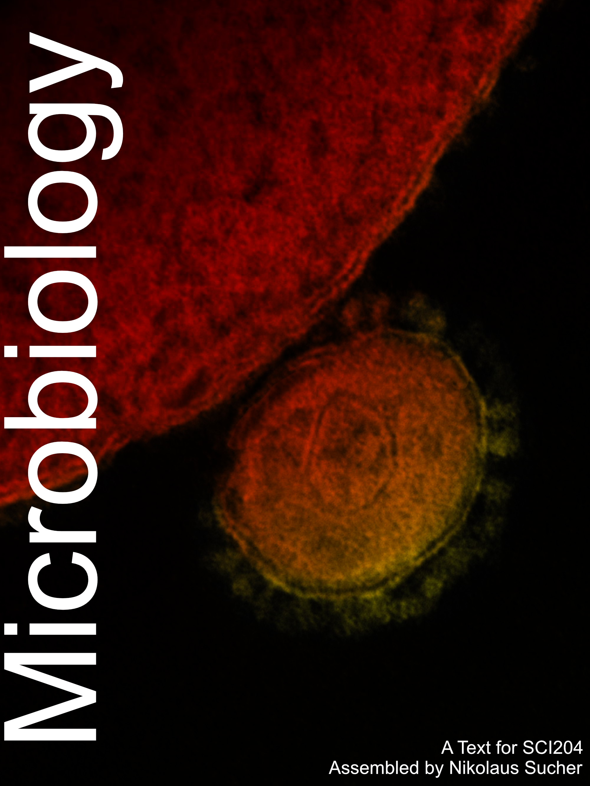

# Welcome {-}

This is a Text for the Microbiology course (SCI204) at RCC.

The cover image shows a [transmission electron micrograph of Middle East respiratory syndrome coronavirus](https://www.flickr.com/photos/niaid/8717564410/in/gallery-40593169@N00-72157644541878393/). Credit: National Institute of Allergy and Infectious Diseases (NIAID)

This work is licensed under the [Creative Commons Attribution-Share Alike 3.0 Unported](https://creativecommons.org/licenses/by-sa/3.0/deed.en) United States License.
