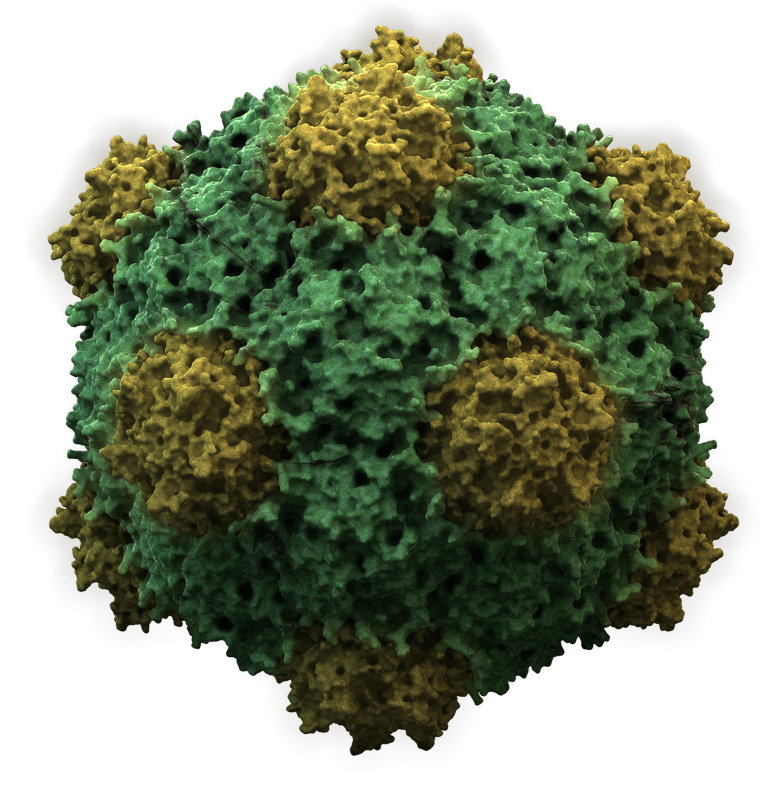
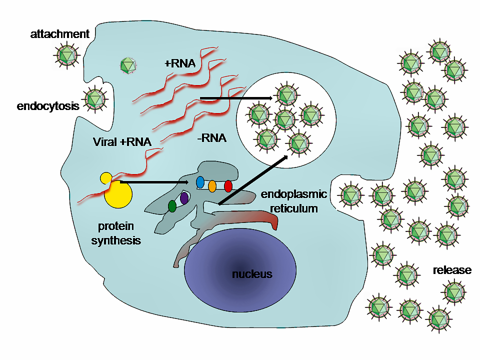
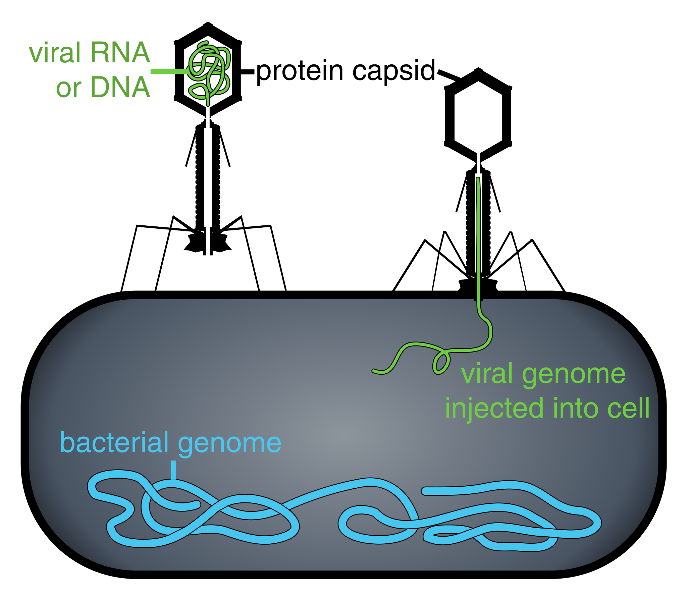

# An Introduction To Viruses

A virus is a submicroscopic infectious agent that replicates only inside the living cells of an organism. Viruses infect all life forms, from animals and plants to microorganisms, including bacteria and archaea. Since Dmitri Ivanovsky's 1892 article describing a non-bacterial pathogen infecting tobacco plants and the discovery of the tobacco mosaic virus by Martinus Beijerinck in 1898, more than 9,000 virus species have been described in detail of the millions of types of viruses in the environment. Viruses are found in almost every ecosystem on Earth and are the most numerous type of biological entity. The study of viruses is known as virology, a subspeciality of microbiology.

When infected, a host cell is forced to rapidly produce thousands of copies of the original virus. When not inside an infected cell or in the process of infecting a cell, viruses exist in the form of independent particles, or virions, consisting of (i) the genetic material, i.e., long molecules of DNA or RNA that encode the structure of the proteins by which the virus acts; (ii) a protein coat, the capsid, which surrounds and protects the genetic material; and in some cases (iii) an outside envelope of lipids. The shapes of these virus particles range from simple helical and icosahedral forms to more complex structures. Most virus species have virions too small to be seen with an optical microscope, as they are one-hundredth the size of most bacteria.

The origins of viruses in the evolutionary history of life are unclear: some may have evolved from plasmids—pieces of DNA that can move between cells—while others may have evolved from bacteria. In evolution, viruses are an important means of horizontal gene transfer, which increases genetic diversity in a way analogous to sexual reproduction. Viruses are considered by some biologists to be a life form, because they carry genetic material, reproduce, and evolve through natural selection, although they lack the key characteristics, such as cell structure, that are generally considered necessary criteria for defining life. Because they possess some but not all such qualities, viruses have been described as "organisms at the edge of life", and as self-replicators.

Viruses spread in many ways. One transmission pathway is through disease-bearing organisms known as vectors: for example, viruses are often transmitted from plant to plant by insects that feed on plant sap, such as aphids; and viruses in animals can be carried by blood-sucking insects. Influenza viruses spread in the air by coughing and sneezing. Norovirus and rotavirus, common causes of viral gastroenteritis, are transmitted by the faecal–oral route, passed by hand-to-mouth contact or in food or water. The infectious dose of norovirus required to produce infection in humans is less than 100 particles. HIV is one of several viruses transmitted through sexual contact and by exposure to infected blood. The variety of host cells that a virus can infect is called its "host range". This can be narrow, meaning a virus is capable of infecting few species, or broad, meaning it is capable of infecting many.

Viral infections in animals provoke an immune response that usually eliminates the infecting virus. Immune responses can also be produced by vaccines, which confer an artificially acquired immunity to the specific viral infection. Some viruses, including those that cause AIDS, HPV infection, and viral hepatitis, evade these immune responses and result in chronic infections. Several antiviral drugs have been developed.

The word is from the Latin neuter vīrus referring to poison and other noxious liquids, from the same Indo-European base as Sanskrit viṣa, Avestan vīša, and ancient Greek ἰός (all meaning "poison"), first attested in English in 1398 in John Trevisa's translation of Bartholomeus Anglicus's De Proprietatibus Rerum. Virulent, from Latin virulentus (poisonous), dates to c. 1400. A meaning of "agent that causes infectious disease" is first recorded in 1728, long before the discovery of viruses by Dmitri Ivanovsky in 1892. The English plural is viruses (sometimes also vira), whereas the Latin word is a mass noun, which has no classically attested plural (vīra is used in Neo-Latin). The adjective viral dates to 1948. The term virion (plural virions), which dates from 1959, is also used to refer to a single viral particle that is released from the cell and is capable of infecting other cells of the same type.

Louis Pasteur was unable to find a causative agent for rabies and speculated about a pathogen too small to be detected by microscopes. In 1884, the French microbiologist Charles Chamberland invented the Chamberland filter (or Pasteur-Chamberland filter) with pores small enough to remove all bacteria from a solution passed through it. In 1892, the Russian biologist Dmitri Ivanovsky used this filter to study what is now known as the tobacco mosaic virus: crushed leaf extracts from infected tobacco plants remained infectious even after filtration to remove bacteria. Ivanovsky suggested the infection might be caused by a toxin produced by bacteria, but he did not pursue the idea. At the time it was thought that all infectious agents could be retained by filters and grown on a nutrient medium—this was part of the germ theory of disease. In 1898, the Dutch microbiologist Martinus Beijerinck repeated the experiments and became convinced that the filtered solution contained a new form of infectious agent. He observed that the agent multiplied only in cells that were dividing, but as his experiments did not show that it was made of particles, he called it a contagium vivum fluidum (soluble living germ) and reintroduced the word virus. Beijerinck maintained that viruses were liquid in nature, a theory later discredited by Wendell Stanley, who proved they were particulate. In the same year, Friedrich Loeffler and Paul Frosch passed the first animal virus, aphthovirus (the agent of foot-and-mouth disease), through a similar filter.

In the early 20th century, the English bacteriologist Frederick Twort discovered a group of viruses that infect bacteria, now called bacteriophages (or commonly 'phages'), and the French-Canadian microbiologist Félix d'Herelle described viruses that, when added to bacteria on an agar plate, would produce areas of dead bacteria. He accurately diluted a suspension of these viruses and discovered that the highest dilutions (lowest virus concentrations), rather than killing all the bacteria, formed discrete areas of dead organisms. Counting these areas and multiplying by the dilution factor allowed him to calculate the number of viruses in the original suspension. Phages were heralded as a potential treatment for diseases such as typhoid and cholera, but their promise was forgotten with the development of penicillin. The development of bacterial resistance to antibiotics has renewed interest in the therapeutic use of bacteriophages.

By the end of the 19th century, viruses were defined in terms of their infectivity, their ability to pass filters, and their requirement for living hosts. Viruses had been grown only in plants and animals. In 1906 Ross Granville Harrison invented a method for growing tissue in lymph, and in 1913 E. Steinhardt, C. Israeli, and R.A. Lambert used this method to grow vaccinia virus in fragments of guinea pig corneal tissue. In 1928, H. B. Maitland and M. C. Maitland grew vaccinia virus in suspensions of minced hens' kidneys. Their method was not widely adopted until the 1950s when poliovirus was grown on a large scale for vaccine production.

Another breakthrough came in 1931 when the American pathologist Ernest William Goodpasture and Alice Miles Woodruff grew influenza and several other viruses in fertilised chicken eggs. In 1949, John Franklin Enders, Thomas Weller, and Frederick Robbins grew poliovirus in cultured cells from aborted human embryonic tissue, the first virus to be grown without using solid animal tissue or eggs. This work enabled Hilary Koprowski, and then Jonas Salk, to make an effective polio vaccine.

The first images of viruses were obtained upon the invention of electron microscopy in 1931 by the German engineers Ernst Ruska and Max Knoll. In 1935, American biochemist and virologist Wendell Meredith Stanley examined the tobacco mosaic virus and found it was mostly made of protein. A short time later, this virus was separated into protein and RNA parts. The tobacco mosaic virus was the first to be crystallised and its structure could, therefore, be elucidated in detail. The first X-ray diffraction pictures of the crystallised virus were obtained by Bernal and Fankuchen in 1941. Based on her X-ray crystallographic pictures, Rosalind Franklin discovered the full structure of the virus in 1955. In the same year, Heinz Fraenkel-Conrat and Robley Williams showed that purified tobacco mosaic virus RNA and its protein coat can assemble by themselves to form functional viruses, suggesting that this simple mechanism was probably the means through which viruses were created within their host cells.

The second half of the 20th century was the golden age of virus discovery, and most of the documented species of animal, plant, and bacterial viruses were discovered during these years. In 1957 equine arterivirus and the cause of Bovine virus diarrhoea (a pestivirus) were discovered. In 1963 the hepatitis B virus was discovered by Baruch Blumberg, and in 1965 Howard Temin described the first retrovirus. Reverse transcriptase, the enzyme that retroviruses use to make DNA copies of their RNA, was first described in 1970 by Temin and David Baltimore independently. In 1983 Luc Montagnier's team at the Pasteur Institute in France, first isolated the retrovirus now called HIV. In 1989 Michael Houghton's team at Chiron Corporation discovered Hepatitis C.

## Theories Of The Origin Of Viruses

Viruses are found wherever there is life and have probably existed since living cells first evolved. The origin of viruses is unclear because they do not form fossils, so molecular techniques are used to investigate how they arose. In addition, viral genetic material occasionally integrates into the germline of the host organisms, by which they can be passed on vertically to the offspring of the host for many generations. This provides an invaluable source of information for paleovirologists to trace back ancient viruses that have existed up to millions of years ago. There are three main hypotheses that aim to explain the origins of viruses:

### Regressive Hypothesis

Viruses may have once been small cells that parasitised larger cells. Over time, genes not required by their parasitism were lost. The bacteria rickettsia and chlamydia are living cells that, like viruses, can reproduce only inside host cells. They lend support to this hypothesis, as their dependence on parasitism is likely to have caused the loss of genes that enabled them to survive outside a cell. This is also called the 'degeneracy hypothesis', or 'reduction hypothesis'.

### Cellular Origin Hypothesis

Some viruses may have evolved from bits of DNA or RNA that "escaped" from the genes of a larger organism. The escaped DNA could have come from plasmids (pieces of naked DNA that can move between cells) or transposons (molecules of DNA that replicate and move around to different positions within the genes of the cell). Once called "jumping genes", transposons are examples of mobile genetic elements and could be the origin of some viruses. They were discovered in maize by Barbara McClintock in 1950. This is sometimes called the 'vagrancy hypothesis', or the 'escape hypothesis'.

### Co-Evolution Hypothesis

This is also called the 'virus-first hypothesis' and proposes that viruses may have evolved from complex molecules of protein and nucleic acid at the same time that cells first appeared on Earth and would have been dependent on cellular life for billions of years. Viroids are molecules of RNA that are not classified as viruses because they lack a protein coat. They have characteristics that are common to several viruses and are often called subviral agents. Viroids are important pathogens of plants. They do not code for proteins but interact with the host cell and use the host machinery for their replication. The hepatitis delta virus of humans has an RNA genome similar to viroids but has a protein coat derived from hepatitis B virus and cannot produce one of its own. It is, therefore, a defective virus. Although hepatitis delta virus genome may replicate independently once inside a host cell, it requires the help of hepatitis B virus to provide a protein coat so that it can be transmitted to new cells. In similar manner, the sputnik virophage is dependent on mimivirus, which infects the protozoan Acanthamoeba castellanii. These viruses, which are dependent on the presence of other virus species in the host cell, are called 'satellites' and may represent evolutionary intermediates of viroids and viruses.

In the past, there were problems with all of these hypotheses: the regressive hypothesis did not explain why even the smallest of cellular parasites do not resemble viruses in any way. The escape hypothesis did not explain the complex capsids and other structures on virus particles. The virus-first hypothesis contravened the definition of viruses in that they require host cells. Viruses are now recognised as ancient and as having origins that pre-date the divergence of life into the three domains. This discovery has led modern virologists to reconsider and re-evaluate these three classical hypotheses.

The evidence for an ancestral world of RNA cells and computer analysis of viral and host DNA sequences are giving a better understanding of the evolutionary relationships between different viruses and may help identify the ancestors of modern viruses. To date, such analyses have not proved which of these hypotheses is correct. It seems unlikely that all currently known viruses have a common ancestor, and viruses have probably arisen numerous times in the past by one or more mechanisms.

Scientific opinions differ on whether viruses are a form of life, or organic structures that interact with living organisms. They have been described as "organisms at the edge of life", since they resemble organisms in that they possess genes, evolve by natural selection, and reproduce by creating multiple copies of themselves through self-assembly. Although they have genes, they do not have a cellular structure, which is often seen as the basic unit of life. Viruses do not have their own metabolism, and require a host cell to make new products. They therefore cannot naturally reproduce outside a host cell—although bacterial species such as rickettsia and chlamydia are considered living organisms despite the same limitation. Accepted forms of life use cell division to reproduce, whereas viruses spontaneously assemble within cells. They differ from autonomous growth of crystals as they inherit genetic mutations while being subject to natural selection. Virus self-assembly within host cells has implications for the study of the origin of life, as it lends further credence to the hypothesis that life could have started as self-assembling organic molecules.

## Structure And Morphology Of Viruses

Viruses display a wide diversity of shapes and sizes, called 'morphologies'. In general, viruses are much smaller than bacteria. Most viruses that have been studied have a diameter between 20 and 300 nanometres. Some filoviruses have a total length of up to 1400 nm; their diameters are only about 80 nm. Most viruses cannot be seen with an optical microscope, so scanning and transmission electron microscopes are used to visualise them. To increase the contrast between viruses and the background, electron-dense "stains" are used. These are solutions of salts of heavy metals, such as tungsten, that scatter the electrons from regions covered with the stain. When virions are coated with stain (positive staining), fine detail is obscured. Negative staining overcomes this problem by staining the background only.

A complete virus particle, known as a virion, consists of nucleic acid surrounded by a protective coat of protein called a capsid. These are formed from identical protein subunits called capsomeres. Viruses can have a lipid "envelope" derived from the host cell membrane. The capsid is made from proteins encoded by the viral genome and its shape serves as the basis for morphological distinction. Virally-coded protein subunits will self-assemble to form a capsid, in general requiring the presence of the virus genome. Complex viruses code for proteins that assist in the construction of their capsid. Proteins associated with nucleic acid are known as nucleoproteins, and the association of viral capsid proteins with viral nucleic acid is called a nucleocapsid. The capsid and entire virus structure can be mechanically (physically) probed through atomic force microscopy. In general, there are four main morphological virus types:

Helical viruses are composed of a single type of capsomere stacked around a central axis to form a helical structure, which may have a central cavity, or tube. This arrangement results in rod-shaped or filamentous virions which can be short and highly rigid, or long and very flexible. The genetic material (typically single-stranded RNA, but ssDNA in some cases) is bound into the protein helix by interactions between the negatively charged nucleic acid and positive charges on the protein. Overall, the length of a helical capsid is related to the length of the nucleic acid contained within it, and the diameter is dependent on the size and arrangement of capsomeres. The well-studied tobacco mosaic virus is an example of a helical virus.

(ref:tmv) [Structure of tobacco mosaic virus: RNA coiled in a helix of repeating protein sub-units](https://commons.wikimedia.org/wiki/File:TMV_structure_simple.png) 

(\#fig:tmvirus)(ref:tmv)

Most animal viruses are icosahedral or near-spherical with chiral icosahedral symmetry. A regular icosahedron is the optimum way of forming a closed shell from identical sub-units. The minimum number of identical capsomeres required for each triangular face is 3, which gives 60 for the icosahedron. Many viruses, such as rotavirus, have more than 60 capsomers and appear spherical but they retain this symmetry. To achieve this, the capsomeres at the apices are surrounded by five other capsomeres and are called pentons. Capsomeres on the triangular faces are surrounded by six others and are called hexons. Hexons are in essence flat and pentons, which form the 12 vertices, are curved. The same protein may act as the subunit of both the pentamers and hexamers or they may be composed of different proteins.

(ref:icosa) [Structure of an icosahedral cowpea mosaic virus](https://commons.wikimedia.org/wiki/File:CowpeaMosaicVirus3D.png) 

(\#fig:icosavirus)(ref:icosa)

Some species of virus envelop themselves in a modified form of one of the cell membranes, either the outer membrane surrounding an infected host cell or internal membranes such as nuclear membrane or endoplasmic reticulum, thus gaining an outer lipid bilayer known as a viral envelope. This membrane is studded with proteins coded for by the viral genome and host genome; the lipid membrane itself and any carbohydrates present originate entirely from the host. The influenza virus and HIV use this strategy. Most enveloped viruses are dependent on the envelope for their infectivity.

These viruses possess a capsid that is neither purely helical nor purely icosahedral, and that may possess extra structures such as protein tails or a complex outer wall. Some bacteriophages, such as Enterobacteria phage T4, have a complex structure consisting of an icosahedral head bound to a helical tail, which may have a hexagonal base plate with protruding protein tail fibres. This tail structure acts like a molecular syringe, attaching to the bacterial host and then injecting the viral genome into the cell.
The poxviruses are large, complex viruses that have an unusual morphology. The viral genome is associated with proteins within a central disc structure known as a nucleoid. The nucleoid is surrounded by a membrane and two lateral bodies of unknown function. The virus has an outer envelope with a thick layer of protein studded over its surface. The whole virion is slightly pleomorphic, ranging from ovoid to brick-shaped.

Mimivirus is one of the largest characterised viruses, with a capsid diameter of 400 nm. Protein filaments measuring 100 nm project from the surface. The capsid appears hexagonal under an electron microscope, therefore the capsid is probably icosahedral. In 2011, researchers discovered the largest then known virus in samples of water collected from the ocean floor off the coast of Las Cruces, Chile. Provisionally named Megavirus chilensis, it can be seen with a basic optical microscope. In 2013, the Pandoravirus genus was discovered in Chile and Australia, and has genomes about twice as large as Megavirus and Mimivirus. All giant viruses have dsDNA genomes and they are classified into several families: Mimiviridae, Pithoviridae, Pandoraviridae, Phycodnaviridae, and the Mollivirus genus.

Some viruses that infect Archaea have complex structures unrelated to any other form of virus, with a wide variety of unusual shapes, ranging from spindle-shaped structures to viruses that resemble hooked rods, teardrops or even bottles. Other archaeal viruses resemble the tailed bacteriophages, and can have multiple tail structures.

An enormous variety of genomic structures can be seen among viral species; as a group, they contain more structural genomic diversity than plants, animals, archaea, or bacteria. There are millions of different types of viruses, although fewer than 7,000 types have been described in detail. As of September 2015, the NCBI Virus genome database has more than 75,000 complete genome sequences, but there are doubtlessly many more to be discovered.

A virus has either a DNA or an RNA genome and is called a DNA virus or an RNA virus, respectively. The vast majority of viruses have RNA genomes. Plant viruses tend to have single-stranded RNA genomes and bacteriophages tend to have double-stranded DNA genomes.

<table class="table" style="margin-left: auto; margin-right: auto;">
<caption>(\#tab:virgen)Genomic diversity among viruses</caption>
 <thead>
  <tr>
   <th style="text-align:left;"> Property </th>
   <th style="text-align:left;"> Parameters </th>
  </tr>
 </thead>
<tbody>
  <tr>
   <td style="text-align:left;"> Nucleic acid </td>
   <td style="text-align:left;"> DNA RNA Both DNA and RNA (at different stages in the life cycle) </td>
  </tr>
  <tr>
   <td style="text-align:left;"> Shape </td>
   <td style="text-align:left;"> Linear Circular Segmented </td>
  </tr>
  <tr>
   <td style="text-align:left;"> Strandedness </td>
   <td style="text-align:left;"> Single-stranded (ss) Double-stranded (ds) Double-stranded with regions of single-strandedness </td>
  </tr>
  <tr>
   <td style="text-align:left;"> Sense </td>
   <td style="text-align:left;"> Positive sense (+) Negative sense (−) Ambisense (+/−) </td>
  </tr>
</tbody>
</table>

Viral genomes are circular, as in the polyomaviruses, or linear, as in the adenoviruses. The type of nucleic acid is irrelevant to the shape of the genome. Among RNA viruses and certain DNA viruses, the genome is often divided up into separate parts, in which case it is called segmented. For RNA viruses, each segment often codes for only one protein and they are usually found together in one capsid. All segments are not required to be in the same virion for the virus to be infectious, as demonstrated by brome mosaic virus and several other plant viruses.

A viral genome, irrespective of nucleic acid type, is almost always either single-stranded or double-stranded. Single-stranded genomes consist of an unpaired nucleic acid, analogous to one-half of a ladder split down the middle. Double-stranded genomes consist of two complementary paired nucleic acids, analogous to a ladder. The virus particles of some virus families, such as those belonging to the Hepadnaviridae, contain a genome that is partially double-stranded and partially single-stranded.

For most viruses with RNA genomes and some with single-stranded DNA genomes, the single strands are said to be either positive-sense (called the 'plus-strand') or negative-sense (called the 'minus-strand'), depending on if they are complementary to the viral messenger RNA (mRNA). Positive-sense viral RNA is in the same sense as viral mRNA and thus at least a part of it can be immediately translated by the host cell. Negative-sense viral RNA is complementary to mRNA and thus must be converted to positive-sense RNA by an RNA-dependent RNA polymerase before translation. DNA nomenclature for viruses with single-sense genomic ssDNA is similar to RNA nomenclature, in that positive-strand viral ssDNA is identical in sequence to the viral mRNA and is thus a coding strand, while negative-strand viral ssDNA is complementary to the viral mRNA and is thus a template strand. Several types of ssDNA and ssRNA viruses have genomes that are ambisense in that transcription can occur off both strands in a double-stranded replicative intermediate. Examples include geminiviruses, which are ssDNA plant viruses and arenaviruses, which are ssRNA viruses of animals.

(ref:influ) [This negative-stained transmission electron micrograph (TEM) depicts the ultrastructural details of an influenza virus particle, or “virion”. A member of the taxonomic family Orthomyxoviridae, the influenza virus is an enveloped, single-stranded RNA virus. Eight helical capsis are surrounded by the viral envelope. Particle diameter: 80 -120 nm](https://commons.wikimedia.org/wiki/File:Influenza_virus_particle_8430_lores.jpg) 

(\#fig:influenza)(ref:influ)

Genome size varies greatly between species. The smallest—the ssDNA circoviruses, family Circoviridae—code for only two proteins and have a genome size of only two kilobases; the largest—the pandoraviruses—have genome sizes of around two megabases which code for about 2500 proteins. Virus genes rarely have introns and often are arranged in the genome so that they overlap.

In general, RNA viruses have smaller genome sizes than DNA viruses because of a higher error-rate when replicating, and have a maximum upper size limit. Beyond this, errors when replicating render the virus useless or uncompetitive. To compensate, RNA viruses often have segmented genomes—the genome is split into smaller molecules—thus reducing the chance that an error in a single-component genome will incapacitate the entire genome. In contrast, DNA viruses generally have larger genomes because of the high fidelity of their replication enzymes. Single-strand DNA viruses are an exception to this rule, as mutation rates for these genomes can approach the extreme of the ssRNA virus case.

Viruses undergo genetic change by several mechanisms. These include a process called antigenic drift where individual bases in the DNA or RNA mutate to other bases. Most of these point mutations are "silent"—they do not change the protein that the gene encodes—but others can confer evolutionary advantages such as resistance to antiviral drugs. Antigenic shift occurs when there is a major change in the genome of the virus. This can be a result of recombination or reassortment. When this happens with influenza viruses, pandemics might result. RNA viruses often exist as quasispecies or swarms of viruses of the same species but with slightly different genome nucleoside sequences. Such quasispecies are a prime target for natural selection.

Segmented genomes confer evolutionary advantages; different strains of a virus with a segmented genome can shuffle and combine genes and produce progeny viruses (or offspring) that have unique characteristics. This is called reassortment or 'viral sex'.

Genetic recombination is the process by which a strand of DNA is broken and then joined to the end of a different DNA molecule. This can occur when viruses infect cells simultaneously and studies of viral evolution have shown that recombination has been rampant in the species studied. Recombination is common to both RNA and DNA viruses.

## Replication Of Viruses

Viral populations do not grow through cell division, because they are acellular. Instead, they use the machinery and metabolism of a host cell to produce multiple copies of themselves, and they assemble in the cell. When infected, the host cell is forced to rapidly produce thousands of identical copies of the original virus.

(ref:repc) [A typical virus replication cycle.](https://commons.wikimedia.org/wiki/File:HepC_replication.png) 

(\#fig:virusrepc)(ref:repc)

Their life cycle differs greatly between species, but there are six basic stages in their life cycle:

Attachment is a specific binding between viral capsid proteins and specific receptors on the host cellular surface. This specificity determines the host range and type of host cell of a virus. For example, HIV infects a limited range of human leucocytes. This is because its surface protein, gp120, specifically interacts with the CD4 molecule—a chemokine receptor—which is most commonly found on the surface of CD4+ T-Cells. This mechanism has evolved to favour those viruses that infect only cells in which they are capable of replication. Attachment to the receptor can induce the viral envelope protein to undergo changes that result in the fusion of viral and cellular membranes, or changes of non-enveloped virus surface proteins that allow the virus to enter.

Penetration follows attachment: Virions enter the host cell through receptor-mediated endocytosis or membrane fusion in a process often known as viral entry. The infection of plant and fungal cells is different from that of animal cells. Plants have a rigid cell wall made of cellulose, and fungi one of chitin, so most viruses can get inside these cells only after trauma to the cell wall. Nearly all plant viruses (such as tobacco mosaic virus) can also move directly from cell to cell, in the form of single-stranded nucleoprotein complexes, through pores called plasmodesmata. Bacteria, like plants, have strong cell walls that a virus must breach to infect the cell. Given that bacterial cell walls are much thinner than plant cell walls due to their much smaller size, some viruses have evolved mechanisms that inject their genome into the bacterial cell across the cell wall, while the viral capsid remains outside.

Uncoating is a process in which the viral capsid is removed: This may be by degradation by viral enzymes or host enzymes or by simple dissociation; the end-result is the releasing of the viral genomic nucleic acid.

Replication of viruses involves primarily multiplication of the genome. Replication involves synthesis of viral messenger RNA (mRNA) from "early" genes (with exceptions for positive sense RNA viruses), viral protein synthesis, possible assembly of viral proteins, then viral genome replication mediated by early or regulatory protein expression. This may be followed, for complex viruses with larger genomes, by one or more further rounds of mRNA synthesis: "late" gene expression is, in general, of structural or virion proteins.

Assembly – Following the structure-mediated self-assembly of the virus particles, some modification of the proteins often occurs. In viruses such as HIV, this modification (sometimes called maturation) occurs after the virus has been released from the host cell.

Release – Viruses can be released from the host cell by lysis, a process that kills the cell by bursting its membrane and cell wall if present: this is a feature of many bacterial and some animal viruses. Some viruses undergo a lysogenic cycle where the viral genome is incorporated by genetic recombination into a specific place in the host's chromosome. The viral genome is then known as a "provirus" or, in the case of bacteriophages a "prophage". Whenever the host divides, the viral genome is also replicated. The viral genome is mostly silent within the host. At some point, the provirus or prophage may give rise to active virus, which may lyse the host cells. Enveloped viruses (e.g., HIV) typically are released from the host cell by budding. During this process the virus acquires its envelope, which is a modified piece of the host's plasma or other, internal membrane.

The genetic material within virus particles, and the method by which the material is replicated, varies considerably between different types of viruses.

The genome replication of most DNA viruses takes place in the cell's nucleus. If the cell has the appropriate receptor on its surface, these viruses enter the cell either by direct fusion with the cell membrane (e.g., herpesviruses) or—more usually—by receptor-mediated endocytosis. Most DNA viruses are entirely dependent on the host cell's DNA and RNA synthesising machinery, and RNA processing machinery. Viruses with larger genomes may encode much of this machinery themselves. In eukaryotes the viral genome must cross the cell's nuclear membrane to access this machinery, while in bacteria it need only enter the cell.

Replication of RNA viruses usually takes place in the cytoplasm. RNA viruses can be placed into four different groups depending on their modes of replication. The polarity (whether or not it can be used directly by ribosomes to make proteins) of single-stranded RNA viruses largely determines the replicative mechanism; the other major criterion is whether the genetic material is single-stranded or double-stranded. All RNA viruses use their own RNA replicase enzymes to create copies of their genomes.

Reverse transcribing viruses have ssRNA (Retroviridae, Metaviridae, Pseudoviridae) or dsDNA (Caulimoviridae, and Hepadnaviridae) in their particles. Reverse transcribing viruses with RNA genomes (retroviruses) use a DNA intermediate to replicate, whereas those with DNA genomes (pararetroviruses) use an RNA intermediate during genome replication. Both types use a reverse transcriptase, or RNA-dependent DNA polymerase enzyme, to carry out the nucleic acid conversion. Retroviruses integrate the DNA produced by reverse transcription into the host genome as a provirus as a part of the replication process; pararetroviruses do not, although integrated genome copies of especially plant pararetroviruses can give rise to infectious virus. They are susceptible to antiviral drugs that inhibit the reverse transcriptase enzyme, e.g. zidovudine and lamivudine. An example of the first type is HIV, which is a retrovirus. Examples of the second type are the Hepadnaviridae, which includes Hepatitis B virus.

(ref:rnavir) [Taxonomy and replication strategies of RNA viruses.](https://commons.wikimedia.org/wiki/File:18_2014_1695_Fig1_HTML.webp) A) Simplified taxonomy of the genome architecture of the RNA viruses described in this review. See main text for used abbreviations. B) (+RNA virus) Infection with a +RNA virus—as exemplified here with a CoV-like virion—releases a single-stranded RNA genome into the cytoplasm (1). (2) Translation of the 5′-terminal open-reading frame of the genome produces the viral replicase. (3) This multi-enzyme complex includes RdRp activity (orange) and associates with intracellular membranes before −RNA synthesis commences. Newly synthesised −RNAs are subsequently used to produce new +RNAs (4), which are typically capped (yellow) and polyadenylated (polyA). (Retrovirus) HIV-1 genomes are packaged as ssRNA in virions. When the ssRNA is released (1) a cDNA copy is synthesised by the RT (2). The RNA is next degraded by the intrinsic RNase H activity in the RT (3) and the single stranded cDNA converted to dsDNA (4). The dsDNA is imported in the nucleus (5) for integration into the host’s genetic material. (−RNA virus) (1) As illustrated here with an IAV-like particle, infection with an −RNA virus releases a viral RNA genome that is associated with a viral polymerase (orange) and nucleoprotein (green). (2) In the case of non-segmented −RNA viruses, these complexes support transcription to produce viral mRNAs or cRNAs. (3) Viral mRNAs are next translated and new viral proteins complex with cRNAs to synthesise new vRNAs. (5) The vRNA-containing complexes of some segmented −RNA viruses are imported into the nucleus of the host cell, where (6) the RdRp produces mRNAs or cRNAs. (7) mRNAs are transported to the cytoplasm, while cRNAs are bound by new viral proteins to form cRNPs for −RNA synthesis. (dsRNA virus) Fully duplexed RNA genomes lack cap and polyA elements. (1) The RdRp (orange), therefore, transcribes the viral genome inside the capsid of the virion (blue and red), so viral mRNAs can be (2) released into the cytoplasm as illustrated here with a rotavirus-like virion. In the cytoplasm the mRNA is translated (3) or replicated by newly synthesised viral RdRps (4)] 

(\#fig:rnavirus)(ref:rnavir)

### Role Of Viruses In Human Disease

The range of structural and biochemical effects that viruses have on the host cell is extensive. These are called 'cytopathic effects'. Most virus infections eventually result in the death of the host cell. The causes of death include cell lysis, alterations to the cell's surface membrane and apoptosis. Often cell death is caused by cessation of its normal activities because of suppression by virus-specific proteins, not all of which are components of the virus particle. The distinction between cytopathic and harmless is gradual. Some viruses, such as Epstein–Barr virus, can cause cells to proliferate without causing malignancy, while others, such as papillomaviruses, are established causes of cancer.

Some viruses cause no apparent changes to the infected cell. Cells in which the virus is latent and inactive show few signs of infection and often function normally. This causes persistent infections and the virus is often dormant for many months or years. This is often the case with herpes viruses.

Viruses are by far the most abundant biological entities on Earth and they outnumber all the others put together. They infect all types of cellular life including animals, plants, bacteria and fungi. Different types of viruses can infect only a limited range of hosts and many are species-specific. Some, such as smallpox virus for example, can infect only one species—in this case humans, and are said to have a narrow host range. Other viruses, such as rabies virus, can infect different species of mammals and are said to have a broad range. The viruses that infect plants are harmless to animals, and most viruses that infect other animals are harmless to humans. The host range of some bacteriophages is limited to a single strain of bacteria and they can be used to trace the source of outbreaks of infections by a method called phage typing. The complete set of viruses in an organism or habitat is called the virome; for example, all human viruses constitute the human virome.

Examples of common human diseases caused by viruses include the common cold, influenza, chickenpox, and cold sores. Many serious diseases such as rabies, Ebola virus disease, AIDS (HIV), avian influenza, and SARS are caused by viruses. The relative ability of viruses to cause disease is described in terms of virulence. Other diseases are under investigation to discover if they have a virus as the causative agent, such as the possible connection between human herpesvirus 6 (HHV6) and neurological diseases such as multiple sclerosis and chronic fatigue syndrome. There is controversy over whether the bornavirus, previously thought to cause neurological diseases in horses, could be responsible for psychiatric illnesses in humans.

Viruses have different mechanisms by which they produce disease in an organism, which depends largely on the viral species. Mechanisms at the cellular level primarily include cell lysis, the breaking open and subsequent death of the cell. In multicellular organisms, if enough cells die, the whole organism will start to suffer the effects. Although viruses cause disruption of healthy homeostasis, resulting in disease, they may exist relatively harmlessly within an organism. An example would include the ability of the herpes simplex virus, which causes cold sores, to remain in a dormant state within the human body. This is called latency and is a characteristic of the herpes viruses, including Epstein–Barr virus, which causes glandular fever, and varicella zoster virus, which causes chickenpox and shingles. Most people have been infected with at least one of these types of herpes virus. These latent viruses might sometimes be beneficial, as the presence of the virus can increase immunity against bacterial pathogens, such as Yersinia pestis.

Some viruses can cause lifelong or chronic infections, where the viruses continue to replicate in the body despite the host's defence mechanisms. This is common in hepatitis B virus and hepatitis C virus infections. People chronically infected are known as carriers, as they serve as reservoirs of infectious virus. In populations with a high proportion of carriers, the disease is said to be endemic.

Viral epidemiology is the branch of medical science that deals with the transmission and control of virus infections in humans. Transmission of viruses can be vertical, which means from mother to child, or horizontal, which means from person to person. Examples of vertical transmission include hepatitis B virus and HIV, where the baby is born already infected with the virus. Another, more rare, example is the varicella zoster virus, which, although causing relatively mild infections in children and adults, can be fatal to the foetus and newborn baby.

Horizontal transmission is the most common mechanism of spread of viruses in populations. Horizontal transmission can occur when body fluids are exchanged during sexual activity, by exchange of saliva or when contaminated food or water is ingested. It can also occur when aerosols containing viruses are inhaled or by insect vectors such as when infected mosquitoes penetrate the skin of a host. Most types of viruses are restricted to just one or two of these mechanisms and they are referred to as "respiratory viruses" or "enteric viruses" and so forth. The rate or speed of transmission of viral infections depends on factors that include population density, the number of susceptible individuals, (i.e., those not immune), the quality of healthcare and the weather.

Epidemiology is used to break the chain of infection in populations during outbreaks of viral diseases. Control measures are used that are based on knowledge of how the virus is transmitted. It is important to find the source, or sources, of the outbreak and to identify the virus. Once the virus has been identified, the chain of transmission can sometimes be broken by vaccines. When vaccines are not available, sanitation and disinfection can be effective. Often, infected people are isolated from the rest of the community, and those that have been exposed to the virus are placed in quarantine. To control the outbreak of foot-and-mouth disease in cattle in Britain in 2001, thousands of cattle were slaughtered. Most viral infections of humans and other animals have incubation periods during which the infection causes no signs or symptoms. Incubation periods for viral diseases range from a few days to weeks, but are known for most infections. Somewhat overlapping, but mainly following the incubation period, there is a period of communicability—a time when an infected individual or animal is contagious and can infect another person or animal. This, too, is known for many viral infections, and knowledge of the length of both periods is important in the control of outbreaks. When outbreaks cause an unusually high proportion of cases in a population, community, or region, they are called epidemics. If outbreaks spread worldwide, they are called pandemics.

A pandemic is a worldwide epidemic. The 1918 flu pandemic, which lasted until 1919, was a category 5 influenza pandemic caused by an unusually severe and deadly influenza A virus. The victims were often healthy young adults, in contrast to most influenza outbreaks, which predominantly affect juvenile, elderly, or otherwise-weakened patients. Older estimates say it killed 40–50 million people, while more recent research suggests that it may have killed as many as 100 million people, or 5% of the world's population in 1918.

Although viral pandemics are rare events, HIV—which evolved from viruses found in monkeys and chimpanzees—has been pandemic since at least the 1980s. During the 20th century there were four pandemics caused by influenza virus and those that occurred in 1918, 1957 and 1968 were severe. Most researchers believe that HIV originated in sub-Saharan Africa during the 20th century; it is now a pandemic, with an estimated 37.9 million people now living with the disease worldwide. There were about 770,000 deaths from AIDS in 2018. The Joint United Nations Programme on HIV/AIDS (UNAIDS) and the World Health Organization (WHO) estimate that AIDS has killed more than 25 million people since it was first recognised on 5 June 1981, making it one of the most destructive epidemics in recorded history. In 2007 there were 2.7 million new HIV infections and 2 million HIV-related deaths.

Several highly lethal viral pathogens are members of the Filoviridae. Filoviruses are filament-like viruses that cause viral hemorrhagic fever, and include ebolaviruses and marburgviruses. Marburg virus, first discovered in 1967, attracted widespread press attention in April 2005 for an outbreak in Angola. Ebola virus disease has also caused intermittent outbreaks with high mortality rates since 1976 when it was first identified. The worst and most recent one is the 2013–2016 West Africa epidemic.

With the exception of smallpox, most pandemics are caused by newly evolved viruses. These "emergent" viruses are usually mutants of less harmful viruses that have circulated previously either in humans or other animals.

Severe acute respiratory syndrome (SARS) and Middle East respiratory syndrome (MERS) are caused by new types of coronaviruses. Other coronaviruses are known to cause mild infections in humans, so the virulence and rapid spread of SARS infections—that by July 2003 had caused around 8,000 cases and 800 deaths—was unexpected and most countries were not prepared.

A related coronavirus emerged in Wuhan, China in November 2019 and spread rapidly around the world. Thought to have originated in bats and subsequently named severe acute respiratory syndrome coronavirus 2, infections with the virus caused a pandemic in 2020. Unprecedented restrictions in peacetime have been placed on international travel, and curfews imposed in several major cities worldwide.

Viruses are an established cause of cancer in humans and other species. Viral cancers occur only in a minority of infected persons (or animals). Cancer viruses come from a range of virus families, including both RNA and DNA viruses, and so there is no single type of "oncovirus" (an obsolete term originally used for acutely transforming retroviruses). The development of cancer is determined by a variety of factors such as host immunity and mutations in the host. Viruses accepted to cause human cancers include some genotypes of human papillomavirus, hepatitis B virus, hepatitis C virus, Epstein–Barr virus, Kaposi's sarcoma-associated herpesvirus and human T-lymphotropic virus. The most recently discovered human cancer virus is a polyomavirus (Merkel cell polyomavirus) that causes most cases of a rare form of skin cancer called Merkel cell carcinoma. Hepatitis viruses can develop into a chronic viral infection that leads to liver cancer. Infection by human T-lymphotropic virus can lead to tropical spastic paraparesis and adult T-cell leukaemia. Human papillomaviruses are an established cause of cancers of cervix, skin, anus, and penis. Within the Herpesviridae, Kaposi's sarcoma-associated herpesvirus causes Kaposi's sarcoma and body-cavity lymphoma, and Epstein–Barr virus causes Burkitt's lymphoma, Hodgkin's lymphoma, B lymphoproliferative disorder, and nasopharyngeal carcinoma. Merkel cell polyomavirus closely related to SV40 and mouse polyomaviruses that have been used as animal models for cancer viruses for over 50 years.

The body's first line of defence against viruses is the innate immune system. This comprises cells and other mechanisms that defend the host from infection in a non-specific manner. This means that the cells of the innate system recognise, and respond to, pathogens in a generic way, but, unlike the adaptive immune system, it does not confer long-lasting or protective immunity to the host.

RNA interference is an important innate defence against viruses. Many viruses have a replication strategy that involves double-stranded RNA (dsRNA). When such a virus infects a cell, it releases its RNA molecule or molecules, which immediately bind to a protein complex called a dicer that cuts the RNA into smaller pieces. A biochemical pathway—the RISC complex—is activated, which ensures cell survival by degrading the viral mRNA. Rotaviruses have evolved to avoid this defence mechanism by not uncoating fully inside the cell, and releasing newly produced mRNA through pores in the particle's inner capsid. Their genomic dsRNA remains protected inside the core of the virion.

When the adaptive immune system of a vertebrate encounters a virus, it produces specific antibodies that bind to the virus and often render it non-infectious. This is called humoral immunity. Two types of antibodies are important. The first, called IgM, is highly effective at neutralising viruses but is produced by the cells of the immune system only for a few weeks. The second, called IgG, is produced indefinitely. The presence of IgM in the blood of the host is used to test for acute infection, whereas IgG indicates an infection sometime in the past. IgG antibody is measured when tests for immunity are carried out.

Antibodies can continue to be an effective defence mechanism even after viruses have managed to gain entry to the host cell. A protein that is in cells, called TRIM21, can attach to the antibodies on the surface of the virus particle. This primes the subsequent destruction of the virus by the enzymes of the cell's proteosome system.

A second defence of vertebrates against viruses is called cell-mediated immunity and involves immune cells known as T cells. The body's cells constantly display short fragments of their proteins on the cell's surface, and, if a T cell recognises a suspicious viral fragment there, the host cell is destroyed by 'killer T' cells and the virus-specific T-cells proliferate. Cells such as the macrophage are specialists at this antigen presentation. The production of interferon is an important host defence mechanism. This is a hormone produced by the body when viruses are present. Its role in immunity is complex; it eventually stops the viruses from reproducing by killing the infected cell and its close neighbours.

Not all virus infections produce a protective immune response in this way. HIV evades the immune system by constantly changing the amino acid sequence of the proteins on the surface of the virion. This is known as "escape mutation" as the viral epitopes escape recognition by the host immune response. These persistent viruses evade immune control by sequestration, blockade of antigen presentation, cytokine resistance, evasion of natural killer cell activities, escape from apoptosis, and antigenic shift. Other viruses, called 'neurotropic viruses', are disseminated by neural spread where the immune system may be unable to reach them.

Because viruses use vital metabolic pathways within host cells to replicate, they are difficult to eliminate without using drugs that cause toxic effects to host cells in general. The most effective medical approaches to viral diseases are vaccinations to provide immunity to infection, and antiviral drugs that selectively interfere with viral replication.

Vaccination is a cheap and effective way of preventing infections by viruses. Vaccines were used to prevent viral infections long before the discovery of the actual viruses. Their use has resulted in a dramatic decline in morbidity (illness) and mortality (death) associated with viral infections such as polio, measles, mumps and rubella. Smallpox infections have been eradicated. Vaccines are available to prevent over thirteen viral infections of humans, and more are used to prevent viral infections of animals. Vaccines can consist of live-attenuated or killed viruses, or viral proteins (antigens). Live vaccines contain weakened forms of the virus, which do not cause the disease but, nonetheless, confer immunity. Such viruses are called attenuated. Live vaccines can be dangerous when given to people with a weak immunity (who are described as immunocompromised), because in these people, the weakened virus can cause the original disease. Biotechnology and genetic engineering techniques are used to produce subunit vaccines. These vaccines use only the capsid proteins of the virus. Hepatitis B vaccine is an example of this type of vaccine. Subunit vaccines are safe for immunocompromised patients because they cannot cause the disease. The yellow fever virus vaccine, a live-attenuated strain called 17D, is probably the safest and most effective vaccine ever generated.

Antiviral drugs are often nucleoside analogues (fake DNA building-blocks), which viruses mistakenly incorporate into their genomes during replication. The life-cycle of the virus is then halted because the newly synthesised DNA is inactive. This is because these analogues lack the hydroxyl groups, which, along with phosphorus atoms, link together to form the strong "backbone" of the DNA molecule. This is called DNA chain termination. Examples of nucleoside analogues are aciclovir for Herpes simplex virus infections and lamivudine for HIV and hepatitis B virus infections. Aciclovir is one of the oldest and most frequently prescribed antiviral drugs. Other antiviral drugs in use target different stages of the viral life cycle. HIV is dependent on a proteolytic enzyme called the HIV-1 protease for it to become fully infectious. There is a large class of drugs called protease inhibitors that inactivate this enzyme.

Hepatitis C is caused by an RNA virus. In 80% of people infected, the disease is chronic, and without treatment, they are infected for the remainder of their lives. There is now an effective treatment that uses the nucleoside analogue drug ribavirin combined with interferon. The treatment of chronic carriers of the hepatitis B virus by using a similar strategy using lamivudine has been developed.

### Animal Viruses

Viruses are important pathogens of livestock. Diseases such as foot-and-mouth disease and bluetongue are caused by viruses. Companion animals such as cats, dogs, and horses, if not vaccinated, are susceptible to serious viral infections. Canine parvovirus is caused by a small DNA virus and infections are often fatal in pups. Like all invertebrates, the honey bee is susceptible to many viral infections. Most viruses co-exist harmlessly in their host and cause no signs or symptoms of disease.

### Plant Viruses

There are many types of plant virus, but often they cause only a loss of yield, and it is not economically viable to try to control them. Plant viruses are often spread from plant to plant by organisms, known as vectors. These are usually insects, but some fungi, nematode worms, and single-celled organisms have been shown to be vectors. When control of plant virus infections is considered economical, for perennial fruits, for example, efforts are concentrated on killing the vectors and removing alternate hosts such as weeds. Plant viruses cannot infect humans and other animals because they can reproduce only in living plant cells.

Originally from Peru, the potato has become a staple crop worldwide. The potato virus Y causes disease in potatoes and related species including tomatoes and peppers. In the 1980s, this virus acquired economical importance when it proved difficult to control in seed potato crops. Transmitted by aphids, this virus can reduce crop yields by up to 80 per cent, causing significant losses to potato yields.

Plants have elaborate and effective defence mechanisms against viruses. One of the most effective is the presence of so-called resistance (R) genes. Each R gene confers resistance to a particular virus by triggering localised areas of cell death around the infected cell, which can often be seen with the unaided eye as large spots. This stops the infection from spreading. RNA interference is also an effective defence in plants. When they are infected, plants often produce natural disinfectants that kill viruses, such as salicylic acid, nitric oxide, and reactive oxygen molecules.

Plant virus particles or virus-like particles (VLPs) have applications in both biotechnology and nanotechnology. The capsids of most plant viruses are simple and robust structures and can be produced in large quantities either by the infection of plants or by expression in a variety of heterologous systems. Plant virus particles can be modified genetically and chemically to encapsulate foreign material and can be incorporated into supramolecular structures for use in biotechnology.

### Bacterial Viruses

(ref:bacph) [Helium ion microscopy image showing T4 phage infecting Escherichia coli . Some of the attached phage have contracted tails indicating that they have injected their DNA into the host. The bacterial cells are ~ 0.5 µm wide.](https://commons.wikimedia.org/wiki/File:Escherichia_coli_with_phages.jpg)

(\#fig:bacteriophage)(ref:bacph)

A bacteriophage, also known informally as a phage, is a virus that infects and replicates within bacteria and archaea. The term was derived from "bacteria" and the Greek φαγεῖν (phagein), meaning "to devour". Bacteriophages are composed of proteins that encapsulate a DNA or RNA genome, and may have structures that are either simple or elaborate. Their genomes may encode as few as four genes and as many as hundreds of genes.

(ref:phagestruc) [Structural overview of T2 phage](https://en.wikipedia.org/wiki/Hershey–Chase_experiment#/media/File:Tevenphage.svg) 

(\#fig:phage)(ref:phagestruc)

These viruses infect specific bacteria by binding to surface receptor molecules and then entering the cell. Within a short amount of time, in some cases just minutes, bacterial polymerase starts translating viral mRNA into protein. These proteins go on to become either new virions within the cell, helper proteins, which help assembly of new virions, or proteins involved in cell lysis. Viral enzymes aid in the breakdown of the cell membrane, and, in the case of the T4 phage, in just over twenty minutes after injection over three hundred phages could be released.

(ref:phagebac) [Diagram showing bacteriophages infecting a bacterial cell (not to scale; bacteriophages are much smaller than bacteria)](https://commons.wikimedia.org/wiki/File:Phage_injecting_its_genome_into_bacteria.svg) 

(\#fig:bacphage)(ref:phagebac)

The major way bacteria defend themselves from bacteriophages is by producing enzymes that destroy foreign DNA. These enzymes, called restriction endonucleases, cut up the viral DNA that bacteriophages inject into bacterial cells. Bacteria also contain a system that uses CRISPR sequences to retain fragments of the genomes of viruses that the bacteria have come into contact with in the past, which allows them to block the virus's replication through a form of RNA interference. This genetic system provides bacteria with acquired immunity to infection.

Bacteriophages are among the most common and diverse entities in the biosphere. Bacteriophages are ubiquitous viruses, found wherever bacteria exist. It is estimated there are more than 1031 bacteriophages on the planet, more than every other organism on Earth, including bacteria, combined. One of the densest natural sources for phages and other viruses is seawater, where up to 9x10^8^ virions per millilitre have been found in microbial mats at the surface, and up to 70% of marine bacteria may be infected by phages.

Phages have been used since the late 20th century as an alternative to antibiotics in the former Soviet Union and Central Europe, as well as in France. They are seen as a possible therapy against multi-drug-resistant strains of many bacteria (see phage therapy). On the other hand, phages of Inoviridae have been shown to complicate biofilms involved in pneumonia and cystic fibrosis and to shelter the bacteria from drugs meant to eradicate disease, thus promoting persistent infection.

## Classification Of Viruses

Classification seeks to describe the diversity of viruses by naming and grouping them on the basis of similarities. In 1962, André Lwoff, Robert Horne, and Paul Tournier were the first to develop a means of virus classification, based on the Linnaean hierarchical system. This system based classification on phylum, class, order, family, genus, and species. Viruses were grouped according to their shared properties (not those of their hosts) and the type of nucleic acid forming their genomes. In 1966, the International Committee on Taxonomy of Viruses (ICTV) was formed. The system proposed by Lwoff, Horne and Tournier was initially not accepted by the ICTV because the small genome size of viruses and their high rate of mutation made it difficult to determine their ancestry beyond order. As such, the Baltimore classification system has come to be used to supplement the more traditional hierarchy. Starting in 2018, the ICTV began to acknowledge deeper evolutionary relationships between viruses that have been discovered over time and adopted a 15-rank classification system ranging from realm to species.

ICTV classification
The ICTV developed the current classification system and wrote guidelines that put a greater weight on certain virus properties to maintain family uniformity. A unified taxonomy (a universal system for classifying viruses) has been established. Only a small part of the total diversity of viruses has been studied. As of 2020, 6 realms, 10 kingdoms, 17 phyla, 2 subphyla, 39 classes, 59 orders, 8 suborders, 189 families, 136 subfamilies, 2,224 genera, 70 subgenera, and 9,110 species of viruses have been defined by the ICTV.

## The Baltimore Classification Of Viruses

The Nobel Prize-winning biologist David Baltimore devised the Baltimore classification system. The ICTV classification system is used in conjunction with the Baltimore classification system in modern virus classification.

The Baltimore classification of viruses is based on the mechanism of mRNA production. Viruses must generate mRNAs from their genomes to produce proteins and replicate themselves, but different mechanisms are used to achieve this in each virus family. Viral genomes may be single-stranded (ss) or double-stranded (ds), RNA or DNA, and may or may not use reverse transcriptase (RT). In addition, ssRNA viruses may be either sense (+) or antisense (−). This classification places viruses into seven groups:

* I: dsDNA viruses (e.g. Adenoviruses, Herpesviruses, Poxviruses)
* II: ssDNA viruses (+ strand or "sense") DNA (e.g. Parvoviruses)
* III: dsRNA viruses (e.g. Reoviruses)
* IV: (+)ssRNA viruses (+ strand or sense) RNA (e.g. Coronaviruses, Picornaviruses, Togaviruses)
* V: (−)ssRNA viruses (− strand or antisense) RNA (e.g. Orthomyxoviruses, Rhabdoviruses)
* VI: ssRNA-RT viruses (+ strand or sense) RNA with DNA intermediate in life-cycle (e.g. Retroviruses)
* VII: dsDNA-RT viruses DNA with RNA intermediate in life-cycle (e.g. Hepadnaviruses)

