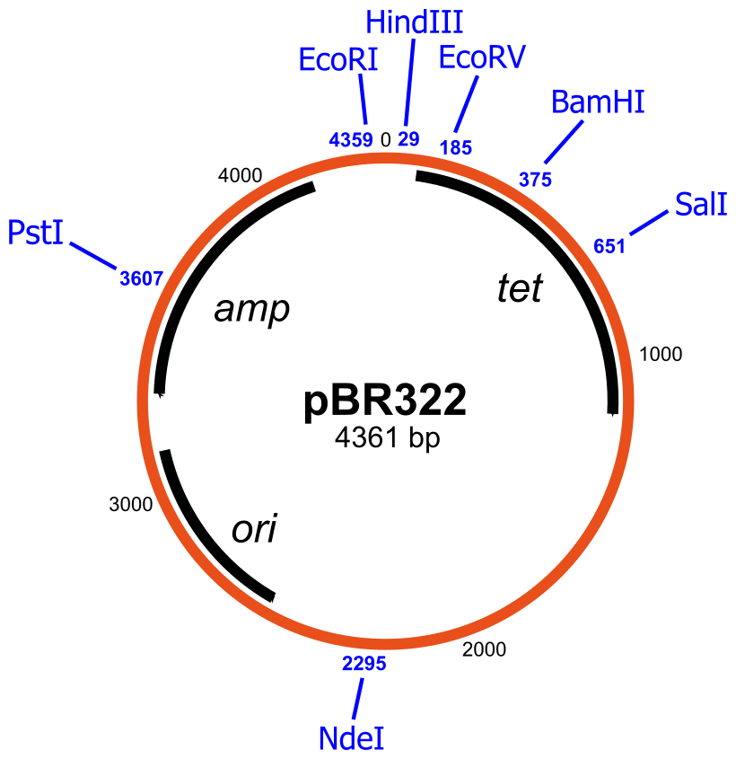
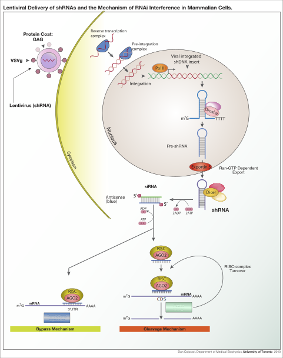

# Genetic Engineering

Genetic engineering, also called genetic modification or genetic manipulation, is the direct manipulation of an organism's genes using biotechnology. It is a set of technologies used to change the genetic makeup of cells, including the transfer of genes within and across species boundaries to produce improved or novel organisms. New DNA is obtained by either isolating and copying the genetic material of interest using recombinant DNA methods or by artificially synthesising the DNA. A construct is usually created and used to insert this DNA into the host organism. The first recombinant DNA molecule was made by Paul Berg in 1972 by combining DNA from the monkey virus SV40 with the lambda virus. As well as inserting genes, the process can be used to remove, or "knock out", genes. The new DNA can be inserted randomly, or targeted to a specific part of the genome.

An organism that is generated through genetic engineering is considered to be genetically modified (GM) and the resulting entity is a genetically modified organism (GMO). The first GMO was a bacterium generated by Herbert Boyer and Stanley Cohen in 1973. Rudolf Jaenisch created the first GM animal when he inserted foreign DNA into a mouse in 1974. The first company to focus on genetic engineering, Genentech, was founded in 1976 and started the production of human proteins. Genetically engineered human insulin was produced in 1978 and insulin-producing bacteria were commercialised in 1982. Genetically modified food has been sold since 1994, with the release of the Flavr Savr tomato. The Flavr Savr was engineered to have a longer shelf life, but most current GM crops are modified to increase resistance to insects and herbicides. GloFish, the first GMO designed as a pet, was sold in the United States in December 2003. In 2016 salmon modified with a growth hormone were sold.

Genetic engineering has been applied in numerous fields including research, medicine, industrial biotechnology and agriculture. In research GMOs are used to study gene function and expression through loss of function, gain of function, tracking and expression experiments. By knocking out genes responsible for certain conditions it is possible to create animal model organisms of human diseases. As well as producing hormones, vaccines and other drugs, genetic engineering has the potential to cure genetic diseases through gene therapy. The same techniques that are used to produce drugs can also have industrial applications such as producing enzymes for laundry detergent, cheeses and other products.

The rise of commercialised genetically modified crops has provided economic benefit to farmers in many different countries, but has also been the source of most of the controversy surrounding the technology. This has been present since its early use; the first field trials were destroyed by anti-GM activists. Although there is a scientific consensus that currently available food derived from GM crops poses no greater risk to human health than conventional food, GM food safety is a leading concern with critics. Gene flow, impact on non-target organisms, control of the food supply and intellectual property rights have also been raised as potential issues. These concerns have led to the development of a regulatory framework, which started in 1975. It has led to an international treaty, the Cartagena Protocol on Biosafety, that was adopted in 2000. Individual countries have developed their own regulatory systems regarding GMOs, with the most marked differences occurring between the US and Europe.

Genetic engineering is a process that alters the genetic structure of an organism by either removing or introducing DNA. Unlike traditional animal and plant breeding, which involves doing multiple crosses and then selecting for the organism with the desired phenotype, genetic engineering takes the gene directly from one organism and delivers it to the other. This is much faster, can be used to insert any genes from any organism (even ones from different domains) and prevents other undesirable genes from also being added.

Genetic engineering could potentially fix severe genetic disorders in humans by replacing the defective gene with a functioning one. It is an important tool in research that allows the function of specific genes to be studied. Drugs, vaccines and other products have been harvested from organisms engineered to produce them. Crops have been developed that aid food security by increasing yield, nutritional value and tolerance to environmental stresses.

The DNA can be introduced directly into the host organism or into a cell that is then fused or hybridised with the host. This relies on recombinant nucleic acid techniques to form new combinations of heritable genetic material followed by the incorporation of that material either indirectly through a vector system or directly through micro-injection, macro-injection or micro-encapsulation.

Genetic engineering does not normally include traditional breeding, in vitro fertilisation, induction of polyploidy, mutagenesis and cell fusion techniques that do not use recombinant nucleic acids or a genetically modified organism in the process. However, some broad definitions of genetic engineering include selective breeding. Cloning and stem cell research, although not considered genetic engineering, are closely related and genetic engineering can be used within them. Synthetic biology is an emerging discipline that takes genetic engineering a step further by introducing artificially synthesised material into an organism. Such synthetic DNA as Artificially Expanded Genetic Information System and Hachimoji DNA is made in this new field.

Plants, animals or microorganisms that have been changed through genetic engineering are termed genetically modified organisms or GMOs. If genetic material from another species is added to the host, the resulting organism is called transgenic. If genetic material from the same species or a species that can naturally breed with the host is used the resulting organism is called cisgenic. If genetic engineering is used to remove genetic material from the target organism the resulting organism is termed a knockout organism. In Europe genetic modification is synonymous with genetic engineering while within the United States of America and Canada genetic modification can also be used to refer to more conventional breeding methods.u

Genetic engineering is a process that alters the genetic structure of an organism by either removing or introducing DNA. Unlike traditional animal and plant breeding, which involves doing multiple crosses and then selecting for the organism with the desired phenotype, genetic engineering takes the gene directly from one organism and delivers it to the other. This is much faster, can be used to insert any genes from any organism (even ones from different domains) and prevents other undesirable genes from also being added.

Genetic engineering could potentially fix severe genetic disorders in humans by replacing the defective gene with a functioning one. It is an important tool in research that allows the function of specific genes to be studied. Drugs, vaccines and other products have been harvested from organisms engineered to produce them. Crops have been developed that aid food security by increasing yield, nutritional value and tolerance to environmental stresses.

The DNA can be introduced directly into the host organism or into a cell that is then fused or hybridised with the host. This relies on recombinant nucleic acid techniques to form new combinations of heritable genetic material followed by the incorporation of that material either indirectly through a vector system or directly through micro-injection, macro-injection or micro-encapsulation.

Genetic engineering does not normally include traditional breeding, in vitro fertilisation, induction of polyploidy, mutagenesis and cell fusion techniques that do not use recombinant nucleic acids or a genetically modified organism in the process. However, some broad definitions of genetic engineering include selective breeding. Cloning and stem cell research, although not considered genetic engineering, are closely related and genetic engineering can be used within them. Synthetic biology is an emerging discipline that takes genetic engineering a step further by introducing artificially synthesised material into an organism. Such synthetic DNA as Artificially Expanded Genetic Information System and Hachimoji DNA is made in this new field.

Plants, animals or microorganisms that have been changed through genetic engineering are termed genetically modified organisms or GMOs. If genetic material from another species is added to the host, the resulting organism is called transgenic. If genetic material from the same species or a species that can naturally breed with the host is used the resulting organism is called cisgenic. If genetic engineering is used to remove genetic material from the target organism the resulting organism is termed a knockout organism. In Europe genetic modification is synonymous with genetic engineering while within the United States of America and Canada genetic modification can also be used to refer to more conventional breeding methods.

Humans have altered the genomes of species for thousands of years through selective breeding, or artificial selection:1:1 as contrasted with natural selection. More recently, mutation breeding has used exposure to chemicals or radiation to produce a high frequency of random mutations, for selective breeding purposes. Genetic engineering as the direct manipulation of DNA by humans outside breeding and mutations has only existed since the 1970s. The term "genetic engineering" was first coined by Jack Williamson in his science fiction novel Dragon's Island, published in 1951 – one year before DNA's role in heredity was confirmed by Alfred Hershey and Martha Chase, and two years before James Watson and Francis Crick showed that the DNA molecule has a double-helix structure – though the general concept of direct genetic manipulation was explored in rudimentary form in Stanley G. Weinbaum's 1936 science fiction story Proteus Island.

In 1972, Paul Berg created the first recombinant DNA molecules by combining DNA from the monkey virus SV40 with that of the lambda virus. In 1973 Herbert Boyer and Stanley Cohen created the first transgenic organism by inserting antibiotic resistance genes into the plasmid of an Escherichia coli bacterium. A year later Rudolf Jaenisch created a transgenic mouse by introducing foreign DNA into its embryo, making it the world's first transgenic animal These achievements led to concerns in the scientific community about potential risks from genetic engineering, which were first discussed in depth at the Asilomar Conference in 1975. One of the main recommendations from this meeting was that government oversight of recombinant DNA research should be established until the technology was deemed safe.

In 1976 Genentech, the first genetic engineering company, was founded by Herbert Boyer and Robert Swanson and a year later the company produced a human protein (somatostatin) in E.coli. Genentech announced the production of genetically engineered human insulin in 1978. In 1980, the U.S. Supreme Court in the Diamond v. Chakrabarty case ruled that genetically altered life could be patented. The insulin produced by bacteria was approved for release by the Food and Drug Administration (FDA) in 1982.

In 1983, a biotech company, Advanced Genetic Sciences (AGS) applied for U.S. government authorisation to perform field tests with the ice-minus strain of Pseudomonas syringae to protect crops from frost, but environmental groups and protestors delayed the field tests for four years with legal challenges. In 1987, the ice-minus strain of P. syringae became the first genetically modified organism (GMO) to be released into the environment when a strawberry field and a potato field in California were sprayed with it. Both test fields were attacked by activist groups the night before the tests occurred: "The world's first trial site attracted the world's first field trasher".

The first field trials of genetically engineered plants occurred in France and the US in 1986, tobacco plants were engineered to be resistant to herbicides. The People's Republic of China was the first country to commercialise transgenic plants, introducing a virus-resistant tobacco in 1992. In 1994 Calgene attained approval to commercially release the first genetically modified food, the Flavr Savr, a tomato engineered to have a longer shelf life. In 1994, the European Union approved tobacco engineered to be resistant to the herbicide bromoxynil, making it the first genetically engineered crop commercialised in Europe. In 1995, Bt Potato was approved safe by the Environmental Protection Agency, after having been approved by the FDA, making it the first pesticide producing crop to be approved in the US. In 2009 11 transgenic crops were grown commercially in 25 countries, the largest of which by area grown were the US, Brazil, Argentina, India, Canada, China, Paraguay and South Africa.

In 2010, scientists at the J. Craig Venter Institute created the first synthetic genome and inserted it into an empty bacterial cell. The resulting bacterium, named Mycoplasma laboratorium, could replicate and produce proteins. Four years later this was taken a step further when a bacterium was developed that replicated a plasmid containing a unique base pair, creating the first organism engineered to use an expanded genetic alphabet. In 2012, Jennifer Doudna and Emmanuelle Charpentier collaborated to develop the CRISPR/Cas9 system, a technique which can be used to easily and specifically alter the genome of almost any organism.

## Genetically Modified Organisms

A genetically modified organism (GMO) is any organism whose genetic material has been altered using genetic engineering techniques. The exact definition of a genetically modified organism and what constitutes genetic engineering varies, with the most common being an organism altered in a way that "does not occur naturally by mating and/or natural recombination". A wide variety of organisms have been genetically modified (GM), from animals to plants and microorganisms. Genes have been transferred within the same species, across species (creating transgenic organisms) and even across kingdoms. New genes can be introduced, or endogenous genes can be enhanced, altered or knocked out.

Herbert Boyer and Stanley Cohen made the first genetically modified organism in 1973, a bacteria resistant to the antibiotic kanamycin. The first genetically modified animal, a mouse, was created in 1974 by Rudolf Jaenisch, and the first plant was produced in 1983. In 1994 the Flavr Savr tomato was released, the first commercialized genetically modified food. The first genetically modified animal to be commercialized was the GloFish (2003) and the first genetically modified animal to be approved for food use was the AquAdvantage salmon in 2015.

Bacteria are the easiest organisms to engineer and have been used for research, food production, industrial protein purification (including drugs), agriculture, and art. There is potential to use them for environmental, purposes or as medicine. Fungi have been engineered with much the same goals. Viruses play an important role as vectors for inserting genetic information into other organisms. This use is especially relevant to human gene therapy. There are proposals to remove the virulent genes from viruses to create vaccines. Plants have been engineered for scientific research, to create new colors in plants, deliver vaccines and to create enhanced crops. Genetically modified crops are publicly the most controversial GMOs. The majority are engineered for herbicide tolerance or insect resistance. Golden rice has been engineered with three genes that increase its nutritional value. Other prospects for GM crops are as bioreactors for the production of biopharmaceuticals, biofuels or medicines.

Animals are generally much harder to transform and the vast majority are still at the research stage. Mammals are the best model organisms for humans, making ones genetically engineered to resemble serious human diseases important to the discovery and development of treatments. Human proteins expressed in mammals are more likely to be similar to their natural counterparts than those expressed in plants or microorganisms. Livestock are modified with the intention of improving economically important traits such as growth-rate, quality of meat, milk composition, disease resistance and survival. Genetically modified fish are used for scientific research, as pets and as a food source. Genetic engineering has been proposed as a way to control mosquitos, a vector for many deadly diseases. Although human gene therapy is still relatively new, it has been used to treat genetic disorders such as severe combined immunodeficiency, and Leber's congenital amaurosis.

Many objections have been raised over the development of GMO's, particularly their commercialization. Many of these involve GM crops and whether food produced from them is safe and what impact growing them will have on the environment. Other concerns are the objectivity and rigor of regulatory authorities, contamination of non-genetically modified food, control of the food supply, patenting of life and the use of intellectual property rights. Although there is a scientific consensus that currently available food derived from GM crops poses no greater risk to human health than conventional food, GM food safety is a leading issue with critics. Gene flow, impact on non-target organisms and escape are the major environmental concerns. Countries have adopted regulatory measures to deal with these concerns. There are differences in the regulation for the release of GMOs between countries, with some of the most marked differences occurring between the US and Europe. One of the key issues concerning regulators is whether GM food should be labeled and the status of gene edited organisms.

What constitutes a genetically modified organism (GMO) is not always clear and can vary widely. At its broadest it can include anything that has had its genes altered, including by nature. Taking a less broad view it can encompass every organism that has had its genes altered by humans, which would include all crops and livestock. In 1993 the Encyclopedia Britannica defined genetic engineering as "any of a wide range of techniques ... among them artificial insemination, in vitro fertilization (e.g., "test-tube" babies), sperm banks, cloning, and gene manipulation." The European Union (EU) included a similarly broad definition in early revies, specifically mentioning GMOs being produced by "selective breeding and other means of artificial selection." They later excluded traditional breeding, in vitro fertilization, induction of polyploidy, mutagenesis and cell fusion techniques that do not use recombinant nucleic acids or a genetically modified organism in the process.

A narrower definition provided by the Food and Agriculture Organization, the World Health Organization and the European Commission says that the organisms must be altered in a way that does "not occur naturally by mating and/or natural recombination". There are examples of crops that fit this definition, but are not normally considered GMOs. For example, the grain crop triticale was fully developed in a laboratory in 1930 using various techniques to alter its genome. The Cartagena Protocol on Biosafety in 2000 used the synonym living modified organism (LMO) and defined it as "any living organism that possesses a novel combination of genetic material obtained through the use of modern biotechnology." Modern biotechnology is further defined as "In vitro nucleic acid techniques, including recombinant deoxyribonucleic acid (DNA) and direct injection of nucleic acid into cells or organelles, or fusion of cells beyond the taxonomic family."

Genetically engineered organism (GEO) can be considered a more precise term compared to GMO when describing organisms' genomes that have been directly manipulated with biotechnology. The term GMO originally was not typically used by scientists to describe genetically engineered organisms until after usage of GMO became common in popular media. The United States Department of Agriculture (USDA) considers GMOs to be plants or animals with heritable changes introduced by genetic engineering or traditional methods, while GEO specifically refers to organisms with genes introduced, eliminated, or rearranged using molecular biology, particularly recombinant DNA techniques, such as transgenesis.

The definitions focus on the process more than the product, which means there could be GMOS and non-GMOs with very similar genotypes and phenotypes. This has led scientists to label it as a scientifically meaningless category, saying that it is impossible to group all the different types of GMOs under one common definition. It has also caused issues for organic institutions and groups looking to ban GMOs. It also poses problems as new processes are developed. The current definitions came in before genome editing became popular and there is some confusion as to whether they are GMOs. The EU has adjudged that they are changing their GMO definition to include "organisms obtained by mutagenesis". In contrast the USDA has ruled that gene edited organisms are not considered GMOs.

### Production

Creating a genetically modified organism (GMO) is a multi-step process. Genetic engineers must isolate the gene they wish to insert into the host organism. This gene can be taken from a cell or artificially synthesized. If the chosen gene or the donor organism's genome has been well studied it may already be accessible from a genetic library. The gene is then combined with other genetic elements, including a promoter and terminator region and a selectable marker.

A number of techniques are available for inserting the isolated gene into the host genome. Bacteria can be induced to take up foreign DNA, usually by exposed heat shock or electroporation. DNA is generally inserted into animal cells using microinjection, where it can be injected through the cell's nuclear envelope directly into the nucleus, or through the use of viral vectors. In plants the DNA is often inserted using Agrobacterium-mediated recombination, biolistics or electroporation.

As only a single cell is transformed with genetic material, the organism must be regenerated from that single cell. In plants this is accomplished through tissue culture. In animals it is necessary to ensure that the inserted DNA is present in the embryonic stem cells. Further testing using PCR, Southern hybridization, and DNA sequencing is conducted to confirm that an organism contains the new gene.

Traditionally the new genetic material was inserted randomly within the host genome. Gene targeting techniques, which creates double-stranded breaks and takes advantage on the cells natural homologous recombination repair systems, have been developed to target insertion to exact locations. Genome editing uses artificially engineered nucleases that create breaks at specific points. There are four families of engineered nucleases: meganucleases, zinc finger nucleases, transcription activator-like effector nucleases (TALENs), and the Cas9-guideRNA system (adapted from CRISPR) TALEN and CRISPR are the two most commonly used and each has its own advantages. TALENs have greater target specificity, while CRISPR is easier to design and more efficient.

Humans have domesticated plants and animals since around 12,000 BCE, using selective breeding or artificial selection (as contrasted with natural selection). The process of selective breeding, in which organisms with desired traits (and thus with the desired genes) are used to breed the next generation and organisms lacking the trait are not bred, is a precursor to the modern concept of genetic modification.:1:1 Various advancements in genetics allowed humans to directly alter the DNA and therefore genes of organisms. In 1972 Paul Berg created the first recombinant DNA molecule when he combined DNA from a monkey virus with that of the lambda virs.

Herbert Boyer and Stanley Cohen made the first genetically modified organism in 1973. They took a gene from a bacterium that provided resistance to the antibiotic kanamycin, inserted it into a plasmid and then induced other bacteria to incorporate the plasmid. The bacteria that had successfully incorporated the plasmid was then able to survive in the presence of kanamycin. Boyer and Cohen expressed other genes in bacteria. This included genes from the toad Xenopus laevis in 1974, creating the first GMO expressing a gene from an organism of a different kingdom.

In 1974, [Rudolf Jaenisch](https://en.wikipedia.org/wiki/Rudolf_Jaenisch) created a transgenic mouse by introducing foreign DNA into its embryo, making it the world's first transgenic animal. However it took another eight years before transgenic mice were developed that passed the transgene to their offspring. Genetically modified mice were created in 1984 that carried cloned oncogenes, predisposing them to developing cancer. Mice with genes removed (termed a knockout mouse) were created in 1989. The first transgenic livestock were produced in 1985 and the first animal to synthesize transgenic proteins in their milk were mice in 1987. The mice were engineered to produce human tissue plasminogen activator, a protein involved in breaking down blood clots.

In 1983 the first genetically engineered plant was developed by Michael W. Bevan, Richard B. Flavell and Mary-Dell Chilton. They infected tobacco with Agrobacterium transformed with an antibiotic resistance gene and through tissue culture techniques were able to grow a new plant containing the resistance gene. The gene gun was invented in 1987, allowing transformation of plants not susceptible to Agrobacterium infection. In 2000, Vitamin A-enriched golden rice was the first plant developed with increased nutrient value.

In 1976 Genentech, the first genetic engineering company was founded by Herbert Boyer and Robert Swanson; a year later, the company produced a human protein (somatostatin) in *E.coli*. Genentech announced the production of genetically engineered human insulin in 1978. The insulin produced by bacteria, branded humulin, was approved for release by the Food and Drug Administration in 1982. In 1988 the first human antibodies were produced in plants. In 1987, a strain of Pseudomonas syringae became the first genetically modified organism to be released into the environment when a strawberry and potato field in California were sprayed with it.

The first genetically modified crop, an antibiotic-resistant tobacco plant, was produced in 1982. China was the first country to commercialize transgenic plants, introducing a virus-resistant tobacco in 1992. In 1994 Calgene attained approval to commercially release the Flavr Savr tomato, the first genetically modified food. Also in 1994, the European Union approved tobacco engineered to be resistant to the herbicide bromoxynil, making it the first genetically engineered crop commercialized in Europe. An insect resistant Potato was approved for release in the US in 1995, and by 1996 approval had been granted to commercially grow 8 transgenic crops and one flower crop (carnation) in 6 countries plus the EU.

In 2010, scientists at the J. Craig Venter Institute announced that they had created the first synthetic bacterial genome. 

The first genetically modified animal to be commercialized was the GloFish, a Zebra fish with a fluorescent gene added that allows it to glow in the dark under ultraviolet light. It was released to the US market in 2003. In 2015 AquAdvantage salmon became the first genetically modified animal to be approved for food use. Approval is for fish raised in Panama and sold in the US. The salmon were transformed with a growth hormone-regulating gene from a Pacific Chinook salmon and a promoter from an ocean pout enabling it to grow year-round instead of only during spring and summer.

### Bacteria

Bacteria were the first organisms to be genetically modified in the laboratory, due to the relative ease of modifying their chromosomes. This ease made them important tools for the creation of other GMOs. Genes and other genetic information from a wide range of organisms can be added to a plasmid and inserted into bacteria for storage and modification. Bacteria are cheap, easy to grow, clonal, multiply quickly and can be stored at −80 °C almost indefinitely. Once a gene is isolated it can be stored inside the bacteria, providing an unlimited supply for research. A large number of custom plasmids make manipulating DNA extracted from bacteria relatively easy.

(ref:pbr322) [A schematic representation of the pBR322 plasmid](https://commons.wikimedia.org/wiki/File:PBR322.svg), one of the first plasmids to be used widely as a cloning vector. Shown on the plasmid diagram are the genes encoded (amp and tet for ampicillin and tetracycline resistance respectively), its origin of replication (ori), and various restriction sites (indicated in blue).

```{r pbrpladmid, fig.cap='(ref:pbr322)', echo=FALSE, message=FALSE, warning=FALSE}

```

Their ease of use has made them great tools for scientists looking to study gene function and evolution. The simplest model organisms come from bacteria, with most of our early understanding of molecular biology coming from studying Escherichia coli. Scientists can easily manipulate and combine genes within the bacteria to create novel or disrupted proteins and observe the effect this has on various molecular systems. Researchers have combined the genes from bacteria and archaea, leading to insights on how these two diverged in the past. In the field of synthetic biology, they have been used to test various synthetic approaches, from synthesising genomes tocreating novel nucleotides.

Bacteria have been used in the production of food for a long time, and specific strains have been developed and selected for that work on an industrial scale. They can be used to produce enzymes, amino acids, flavourings, and other compounds used in food production. With the advent of genetic engineering, new genetic changes can easily be introduced into these bacteria. Most food-producing bacteria are lactic acid bacteria, and this is where the majority of research into genetically engineering food-producing bacteria has gone. The bacteria can be modified to operate more efficiently, reduce toxic byproduct production, increase output, create improved compounds, and remove unnecessary pathways. Food products from genetically modified bacteria include alpha-amylase, which converts starch to simple sugars, chymosin, which clots milk protein for cheese making, and pectinesterase, which improves fruit juice clarity. The majority are produced in the US and even though regulations are in place to allow production in Europe, as of 2015 no food products derived from bacteria are currently available there.

Genetically modified bacteria are used to produce large amounts of proteins for industrial use. Generally the bacteria are grown to a large volume before the gene encoding the protein is activated. The bacteria are then harvested and the desired protein purified from them. The high cost of extraction and purification has meant that only high value products have been produced at an industrial scale. The majority of these products are human proteins for use in medicine. Many of these proteins are impossible or difficult to obtain via natural methods and they are less likely to be contaminated with pathogens, making them safer. The first medicinal use of GM bacteria was to produce the protein insulin to treat diabetes. Other medicines produced include clotting factors to treat haemophilia, human growth hormone to treat various forms of dwarfism, interferon to treat some cancers, erythropoietin for anemic patients, and tissue plasminogen activator which dissolves blood clots. Outside of medicine they have been used to produce biofuels. There is interest in developing an extracellular expression system within the bacteria to reduce costs and make the production of more products economical.

With greater understanding of the role that the microbiome plays in human health, there is the potential to treat diseases by genetically altering the bacteria to, themselves, be therapeutic agents. Ideas include altering gut bacteria so they destroy harmful bacteria, or using bacteria to replace or increase deficient enzymes or proteins. One research focus is to modify Lactobacillus, bacteria that naturally provide some protection against HIV, with genes that will further enhance this protection. If the bacteria do not form colonies inside the patient, the person must repeatedly ingest the modified bacteria in order to get the required doses. Enabling the bacteria to form a colony could provide a more long-term solution, but could also raise safety concerns as interactions between bacteria and the human body are less well understood than with traditional drugs. There are concerns that horizontal gene transfer to other bacteria could have unknown effects. As of 2018 there are clinical trials underway testing the efficacy and safety of these treatments.

For over a century bacteria have been used in agriculture. Crops have been inoculated with Rhizobia (and more recently Azospirillum) to increase their production or to allow them to be grown outside their original habitat. Application of Bacillus thuringiensis (Bt) and other bacteria can help protect crops from insect infestation and plant diseases. With advances in genetic engineering, these bacteria have been manipulated for increased efficiency and expanded host range. Markers have also been added to aid in tracing the spread of the bacteria. The bacteria that naturally colonize certain crops have also been modified, in some cases to express the Bt genes responsible for pest resistance. Pseudomonas strains of bacteria cause frost damage by nucleating water into ice crystals around themselves. This led to the development of ice-minus bacteria, that have the ice-forming genes removed. When applied to crops they can compete with the non-modified bacteria and confer some frost resistance. 

Other uses for genetically modified bacteria include bioremediation, where the bacteria are used to convert pollutants into a less toxic form. Genetic engineering can increase the levels of the enzymes used to degrade a toxin or to make the bacteria more stable under environmental conditions. Bioart has also been created using genetically modified bacteria. In the 1980s artist Jon Davis and geneticist Dana Boyd converted the Germanic symbol for femininity (ᛉ) into binary code and then into a DNA sequence, which was then expressed in Escherichia coli. This was taken a step further in 2012, when a whole book was encoded onto DNA. Paintings have alo been produced using bacteria transformed with fluorescent proteins.

### Viruses

Viruses are often modified so they can be used as vectors for inserting genetic information into other organisms. This process is called transduction and if successful the recipient of the introduced DNA becomes a GMO. Different viruses have different efficiencies and capabilities. Researchers can use this to control for various factors; including the target location, insert size and duration of gene expression. Any dangerous sequences inherent in the virus must be removed, while those that allow the gene to be delivered effectively are retained.

While viral vectors can be used to insert DNA into almost any organism it is especially relevant for its potential in treating human disease. Although primarily still at trial stages, there has been some successes using gene therapy to replace defective genes. This is most evident in curing patients with severe combined immunodeficiency rising from adenosine deaminase deficiency (ADA-SCID), although the development of leukemia in some ADA-SCID patients along with the death of Jesse Gelsinger in a 1999 trial set back the development of this approach for many years. In 2009 another breakthrough was achieved when an eight-year-old boy with Leber's congenital amaurosis regained normal eyesight and in 2016 GlaxoSmithKline gained approval to commercialize a gene therapy treatment for ADA-SCID. As of 2018, there are a substantial number of clinical trials underway, including treatments for hemophilia, glioblastoma, chronic granulomatous disease, cystic fibrosis and various cancers.

The most common virus used for gene delivery come from adenoviruses as they can carry up to 7.5 kb of foreign DNA and infect a relatively broad range of host cells, although they have been know to elicit immune responses in the host and only provide short term expression. Other common vectors are adeno-associated viruses, which have lower toxicity and longer term expression, but can only carry about 4kb of DNA. Herpes simplex viruses make promising vectors, having a carrying capacity of over 30kb and providing long term expression, although they are less efficient at gene delivery than other vectors. The best vectors for long term integration of the gene into the host genome are retroviruses, but their propensity for random integration is problematic. Lentiviruses are a part of the same family as retroviruses with the advantage of infecting both dividing and non-dividing cells, whereas retroviruses only target dividing cells. Other viruses that have been used as vectors include alphaviruses, flaviviruses, measles viruses, rhabdoviruses, Newcastle disease virus, poxviruses, and picornaviruses.

Most vaccines consist of viruses that have been attenuated, disabled, weakened or killed in some way so that their virulent properties are no longer effective. Genetic engineering could theoretically be used to create viruses with the virulent genes removed. This does not affect the viruses infectivity, invokes a natural immune response and there is no chance that they will regain their virulence function, which can occur with some other vaccines. As such they are generally considered safer and more efficient than conventional vaccines, although concerns remain over non-target infection, potential side effects and horizontal gene transfer to other viruses. Another potential approach is to use vectors to create novel vaccines for diseases that have no vaccines available or the vaccines that do not work effectively, such as AIDS, malaria, and tuberculosis. The most effective vaccine against Tuberculosis, the Bacillus Calmette–Guérin (BCG) vaccine, only provides partial protection. A modified vaccine expressing a M tuberculosis antigen is able to enhance BCG protection. It has been shown to be safe to use at phase II trials, although not as effective as initially hoped. Other vector-based vaccines have already been approved and many more are being developed.

Another potential use of genetically modified viruses is to alter them so they can directly treat diseases. This can be through expression of protective proteins or by directly targeting infected cells. In 2004, researchers reported that a genetically modified virus that exploits the selfish behaviour of cancer cells might offer an alternative way of killing tumours. Since then, several researchers have developed genetically modified oncolytic viruses that show promise as treatments for various types of cancer. In 2017 researchers genetically modified a virus to express spinach defensin proteins. The virus was injected into orange trees to combat citrus greening disease that had reduced orange production by 70% since 2005.

Natural viral diseases, such as myxomatosis and rabbit haemorrhagic disease, have been used to help control pest populations. Over time the surviving pests become resistant, leading researchers to look at alternative methods. Genetically modified viruses that make the target animals infertile through immunocontraception have been created in the laboratory as well as others that target the developmental stage of the animal. There are concerns with using this approach regarding virus containment and cross species infection. Sometimes the same virus can be modified for contrasting purposes. Genetic modification of the myxoma virus has been proposed to conserve European wild rabbits in the Iberian peninsula and to help regulate them in Australia. To protect the Iberian species from viral diseases, the myxoma virus was genetically modified to immunize the rabbits, while in Australia the same myxoma virus was genetically modified to lower fertility in the Australian rabbit population.

Outside of biology scientists have used a genetically modified virus to construct a lithium-ion battery and other nanostructured materials. It is possible to engineer bacteriophages to express modified proteins on their surface and join them up in specific patterns (a technique called phage display). These structures have potential uses for energy storage and generation, biosensing and tissue regeneration with some new materials currently produced including quantum dots, liquid crystals, nanorings and nanofibres. The battery was made by engineering M13 bacteriaophages so they would coat themselves in iron phosphate and then assemble themselves along a carbon nanotube. This created a highly conductive medium for use in a cathode, allowing energy to be transferred quickly. They could be constructed at lower temperatures with non-toxic chemicals, making them more environmentally friendly.

### Fungi

Fungi can be used for many of the same processes as bacteria. For industrial applications, yeasts combines the bacterial advantages of being a single celled organism that is easy to manipulate and grow with the advanced protein modifications found in eukaryotes. They can be used to produce large complex molecules for use in food, pharmaceuticals, hormones and steroids. Yeast is important for wine production and as of 2016 two genetically modified yeasts involved in the fermentation of wine have been commercialized in the United States and Canada. One has increased malolactic fermentation efficiency, while the other prevents the production of dangerous ethyl carbamate compounds during fermentation. There have also been advances in the production of biofuel from genetically modified fungi.

Fungi, being the most common pathogens of insects, make attractive biopesticides. Unlike bacteria and viruses they have the advantage of infecting the insects by contact alone, although they are out competed in efficiency by chemical pesticides. Genetic engineering can improve virulence, usually by adding more virulent proteins, increasing infection rate or enhancing spore persistence. Many of the disease carrying vectors are susceptible to entomopathogenic fungi. An attractive target for biological control are mosquitos, vectors for a range of deadly diseases, including malaria, yellow fever and dengue fever. Mosquitos can evolve quickly so it becomes a balancing act of killing them before the Plasmodium they carry becomes the infectious disease, but not so fast that they become resistant to the fungi. By genetically engineering fungi like Metarhizium anisopliae and Beauveria bassiana to delay the development of mosquito infectiousness the selection pressure to evolve resistance is reduced. Another strategy is to add proteins to the fungi that block transmission of malaria or remove the Plasmodium altogether.

A mushroom has been gene edited to resist browning, giving it a longer shelf life. The process used CRISPR to knock out a gene that encodes polyphenol oxidase. As it didn't introduce any foreign DNA into the organism it was not deemed to be regulated under existing GMO frameworks and as such is the first CRISPR-edited organism to be approved for release. This has intensified debates as to whether gene-edited organisms should be considered genetically modified organisms and how they should be regulated.

### Plants

Plants have been engineered for scientific research, to display new flower colors, deliver vaccines and to create enhanced crops. Many plants are pluripotent, meaning that a single cell from a mature plant can be harvested and under the right conditions can develop into a new plant. This ability can be taken advantage of by genetic engineers; by selecting for cells that have been successfully transformed in an adult plant a new plant can then be grown that contains the transgene in every cell through a process known as tissue culture.

Much of the advances in the field of genetic engineering has come from experimentation with tobacco. Major advances in tissue culture and plant cellular mechanisms for a wide range of plants has originated from systems developed in tobacco. It was the first plant to be altered using genetic engineering and is considered a model organism for not only genetic engineering, but a range of other fields. As such the transgenic tools and procedures are well established making tobacco one of the easiest plants to transform. Another major model organism relevant to genetic engineering is Arabidopsis thaliana. Its small genome and short life cycle makes it easy to manipulate and it contains many homologues to important crop species. It was the first plant sequenced, has a host of online resources available and can be transformed by simply dipping a flower in a transformed Agrobacterium solution.

In research, plants are engineered to help discover the functions of certain genes. The simplest way to do this is to remove the gene and see what phenotype develops compared to the wild type form. Any differences are possibly the result of the missing gene. Unlike mutagenisis, genetic engineering allows targeted removal without disrupting other genes in the organism. Some genes are only expressed in certain tissue, so reporter genes, like GUS, can be attached to the gene of interest allowing visualization of the location. Other ways to test a gene is to alter it slightly and then return it to the plant and see if it still has the same effect on phenotype. Other strategies include attaching the gene to a strong promoter and see what happens when it is over expressed, forcing a gene to be expressed in a different location or at different developmental stages.

Some genetically modified plants are purely ornamental. They are modified for flower color, fragrance, flower shape and plant architecture. The first genetically modified ornamentals commercialized altered color. Carnations were released in 1997, with the most popular genetically modified organism, a blue rose (actually lavender or mauve) created in 2004. The roses are sold in Japan, the United States, and Canada. Other genetically modified ornamentals include Chrysanthemum and Petunia. As well as increasing aesthetic value there are plans to develop ornamentals that use less water or are resistant to the cold, which would allow them to be grown outside their natural environments.

It has been proposed to genetically modify some plant species threatened by extinction to be resistant to invasive plants and diseases, such as the emerald ash borer in North American and the fungal disease, Ceratocystis platani, in European plane trees. The papaya ringspot virus devastated papaya trees in Hawaii in the twentieth century until transgenic papaya plants were given pathogen-derived resistance. However, genetic modification for conservation in plants remains mainly speculative. A unique concern is that a transgenic species may no longer bear enough resemblance to the original species to truly claim that the original species is being conserved. Instead, the transgenic species may be genetically different enough to be considered a new species, thus diminishing the conservation worth of genetic modification.

### Crops

Genetically modified crops are genetically modified plants that are used in agriculture. The first crops developed were used for animal or human food and provide resistance to certain pests, diseases, environmental conditions, spoilage or chemical treatments (e.g. resistance to a herbicide). The second generation of crops aimed to improve the quality, often by altering the nutrient profile. Third generation genetically modified crops could be used for non-food purposes, including the production of pharmaceutical agents, biofuels, and other industrially useful goods, as well as for bioremediation.

There are three main aims to agricultural advancement; increased production, improved conditions for agricultural workers and sustainability. GM crops contribute by improving harvests through reducing insect pressure, increasing nutrient value and tolerating different abiotic stresses. Despite this potential, as of 2018, the commercialized crops are limited mostly to cash crops like cotton, soybean, maize and canola and the vast majority of the introduced traits provide either herbicide tolerance or insect resistance. Soybeans accounted for half of all genetically modified crops planted in 2014. Adoption by farmers has been rapid, between 1996 and 2013, the total surface area of land cultivated with GM crops increased by a factor of 100. Geographically though the spread has been uneven, with strong growth in the Americas and parts of Asia and little in Europe and Africa. Its socioeconomic spread has been more even, with approximately 54% of worldwide GM crops grown in developing countries in 2013. Although doubts have been raised, most studies have found growing GM crops to be beneficial to farmers through decreased pesticide use as well as increased crop yield and farm profit.

The majority of GM crops have been modified to be resistant to selected herbicides, usually a glyphosate or glufosinate based one. Genetically modified crops engineered to resist herbicides are now more available than conventionally bred resistant varieties; in the USA 93% of soybeans and most of the GM maize grown is glyphosate tolerant. Most currently available genes used to engineer insect resistance come from the Bacillus thuringiensis bacterium and code for delta endotoxins. A few use the genes that encode for vegetative insecticidal proteins. The only gene commercially used to provide insect protection that does not originate from B. thuringiensis is the Cowpea trypsin inhibitor (CpTI). CpTI was first approved for use cotton in 1999 and is currently undergoing trials in rice. Less than one percent of GM crops contained other traits, which include providing virus resistance, delaying senescence and altering the plants composition.

Golden rice is the most well known GM crop that is aimed at increasing nutrient value. It has been engineered with three genes that biosynthesise beta-carotene, a precursor of vitamin A, in the edible parts of rice. It is intended to produce a fortified food to be grown and consumed in areas with a shortage of dietary vitamin A, a deficiency which each year is estimated to kill 670,000 children under the age of 5 and cause an additional 500,000 cases of irreversible childhood blindness. The original golden rice produced 1.6μg/g of the carotenoids, with further development increasing this 23 times. In 2018 it gained its first approvals for use as food.

Plants and plant cells have been genetically engineered for production of biopharmaceuticals in bioreactors, a process known as pharming. Work has been done with duckweed Lemna minor, the algae Chlamydomonas reinhardtii and the moss Physcomitrella patens. Biopharmaceuticals produced include cytokines, hormones, antibodies, enzymes and vaccines, most of which are accumulated in the plant seeds. Many drugs also contain natural plant ingredients and the pathways that lead to their production have been genetically altered or transferred to other plant species to produce greater volume. Other options for bioreactors are biopolymers and biofuels. Unlike bacteria, plants can modify the proteins post-translationally, allowing them to make more complex molecules. They also pose less risk of being contaminated. Therapeutics have been cultured in transgenic carrot and tobacco cells, including a drug treatment for Gaucher's disease.

Vaccine production and storage has great potential in transgenic plants. Vaccines are expensive to produce, transport and administer, so having a system that could produce them locally would allow greater access to poorer and developing areas. As well as purifying vaccines expressed in plants it is also possible to produce edible vaccines in plants. Edible vaccines stimulate the immune system when ingested to protect against certain diseases. Being stored in plants reduces the long-term cost as they can be disseminated without the need for cold storage, don't need to be purified and have long term stability. Also being housed within plant cells provides some protection from the gut acids upon digestion. However the cost of developing, regulating and containing transgenic plants is high, leading to most current plant-based vaccine development being applied to veterinary medicine, where the controls are not as strict.

### Animals

The vast majority of genetically modified animals are at the research stage with the number close to entering the market remaining small. As of 2018 only three genetically modified animals have been approved, all in the USA. A goat and a chicken have been engineered to produce medicines and a salmon that has increased growth. Despite the differences and difficulties in modifying them, the end aims are much the same as for plants. GM animals are created for research purposes, production of industrial or therapeutic products, agricultural uses or improving their health. There is also a market for creating genetically modified pets.

The process of genetically engineering mammals is slow, tedious, and expensive. However, new technologies are making genetic modifications easier and more precise. The first transgenic mammals were produced by injecting viral DNA into embryos and then implanting the embryos in females. The embryo would develop and it would be hoped that some of the genetic material would be incorporated into the reproductive cells. Then researchers would have to wait until the animal reached breeding age and then offspring would be screened for presence of the gene in every cell. The development of the CRISPR-Cas9 gene editing system as a cheap and fast way of directly modifying germ cells, effectively halving the amount of time needed to develop genetically modified mammals.

Mammals are the best models for human disease, making genetic engineered ones vital to the discovery and development of cures and treatments for many serious diseases. Knocking out genes responsible for human genetic disorders allows researchers to study the mechanism of the disease and to test possible cures. Genetically modified mice have been the most common mammals used in biomedical research, as they are cheap and easy to manipulate. Pigs are also a good target as they have a similar body size and anatomical features, physiology, pathophysiological response and diet. Nonhuman primates are the most similar model organisms to humans, but there is less ublic acceptance towards using them as research animals. In 2009, scientists announced that they had successfully transferred a gene into a primate species (marmosets) for the first time. Their first research target for these marmosets was Parkinson's disease, but they were also considering amyotrophic lateral sclerosis and Huntington's disease.

Human proteins expressed in mammals are more likely to be similar to their natural counterparts than those expressed in plants or microorganisms. Stable expression has been accomplished in sheep, pigs, rats and other animals. In 2009 the first human biological drug produced from such an animal, a goat, was approved. The drug, ATryn, is an anticoagulant which reduces the probability of blood clots during surgery or childbirth and is extracted from the goat's milk. Human alpha-1-antitrypsin is another protein that has been produced from goats and is used in treating humans with this deficiency. Another medicinal area is in creating pigs with greater capacity for human organ transplants (xenotransplantation). Pigs have been genetically modified so that their organs can no longer carry retroviruses or have modifications to reduce the chance of rejection. Pig lungs from genetically modified pigs are being considered for transplantation into humans. There is even potential to create chimeric pigs that can carry human organs.

Livestock are modified with the intention of improving economically important traits such as growth-rate, quality of meat, milk composition, disease resistance and survival. Animals have been engineered to grow faster, be healthier and resist diseases. Modifications have also improved the wool production of sheep and udder health of cows. Goats have been genetically engineered to produce milk with strong spiderweb-like silk proteins in their milk. A GM pig called Enviropig was created with the capability of digesting plant phosphorus more efficiently than conventional pigs. They could reduce water pollution since they excrete 30 to 70% less phosphorus in manure. Dairy cows have been genetically engineered to produce milk that would be the same as human breast milk. This could potentially benefit mothers who cannot produce breast milk but want their children to have breast milk rather than formula. Researchers have also developed a genetically engineered cow that produces allergy-free milk.

Scientists have genetically engineered several organisms, including some mammals, to include green fluorescent protein (GFP), for research purposes. GFP and other similar reporting genes allow easy visualization and localization of the products of the genetic modification. Fluorescent pigs have been bred to study human organ transplants, regenerating ocular photoreceptor cells, and other topics. In 2011 green-fluorescent cats were created to help find therapies for HIV/AIDS and other diseases as feline immunodeficiency virus is related to HIV.

There have been suggestions that genetic engineering could be used to bring animals back from extinction. It involves changing the genome of a close living relative to resemble the extinct one and is currently being attempted with the passenger pigeon. Genes associated with the woolly mammoth have been added to the genome of an African Elephant, although the lead researcher says he has no intention of creating live elephants and transferring all the genes and reversing years of genetic evolution is a long way from being feasible. It is more likely that scientists could use this technology to conserve endangered animals by bringing back lost diversity or transferring evolved genetic advantages from adapted organisms to those that are struggling.

Gene therapy uses genetically modified viruses to deliver genes which can cure disease in humans. Although gene therapy is still relatively new, it has had some successes. It has been used to treat genetic disorders such as severe combined immunodeficiency, and Leber's congenital amaurosis. Treatments are also being developed for a range of other currently incurable diseases, such as cystic fibrosis, sickle cell anemia, Parkinson's disease, cancer, diabetes, heart disease and muscular dystrophy. These treatments only effect somatic cells, meaning any changes would not be inheritable. Germline gene therapy results in any change being inheritable, which has raised concerns within the scientific community.

In 2015, CRISPR was used to edit the DNA of non-viable human embryos. In November 2018, He Jiankui announced that he had edited the genomes of two human embryos, in an attempt to disable the CCR5 gene, which codes for a receptor that HIV uses to enter cells. He said that twin girls, Lulu and Nana, had been born a few weeks earlier and that they carried functional copies of CCR5 along with disabled CCR5 (mosaicism) and were still vulnerable to HIV. The work was widely condemned as unethical, dangerous, and premature.

### Laws and regulations

Genetically modified organisms are regulated by government agencies. This applies to research as well as the release of genetically modified organisms, including crops and food. The development of a regulatory framework concerning genetic engineering began in 1975, at Asilomar, California. The Asilomar meeting recommended a set of guidelines regarding the cautious use of recombinant technology and any products resulting from that technology. The Cartagena Protocol on Biosafety was adopted on 29 January 2000 and entered into force on 11 September 2003. It is an international treaty that governs the transfer, handling, and use of genetically modified organisms. One hundred and fifty-seven countries are members of the Protocol and many use it as a reference point for their own regulations.

Universities and research institutes generally have a special committee that is responsible for approving any experiments that involve genetic engineering. Many experiments also need permission from a national regulatory group or legislation. All staff must be trained in the use of GMOs and all laboratories must gain approval from their regulatory agency to work with GMOs. The legislation covering GMOs are often derived from regulations and guidelines in place for the non-GMO version of the organism, although they are more severe. There is a near universal system for assessing the relative risks associated with GMOs and other agents to laboratory staff and the community. They are assigned to one of four risk categories based on their virulence, the severity of disease, the mode of transmission, and the availability of preventive measures or treatments. There are four biosafety levels that a laboratory can fall into, ranging from level 1 (which is suitable for working with agents not associated with disease) to level 4 (working with life-threatening agents). Different countries use different nomenclature to describe the levels and can have different requirements for what can be done at each level.

There are differences in the regulation for the release of GMOs between countries, with some of the most marked differences occurring between the US and Europe. Regulation varies in a given country depending on the intended use of the products of the genetic engineering. For example, a crop not intended for food use is generally not reviewed by authorities responsible for food safety. Some nations have banned the release of GMOs or restricted their use, and others permit them with widely differing degrees of regulation. In 2016 thirty eight countries officially ban or prohibit the cultivation of GMOs and nine (Algeria, Bhutan, Kenya, Kyrgyzstan, Madagascar, Peru, Russia, Venezuela and Zimbabwe) ban their importation. Most countries that do not allow GMO cultivation do permit research using GMOs.

The European Union (EU) differentiates between approval for cultivation within the EU and approval for import and processing. While only a few GMOs have been approved for cultivation in the EU a number of GMOs have been approved for import and processing. The cultivation of GMOs has triggered a debate about the market for GMOs in Europe. Depending on the coexistence regulations, incentives for cultivation of GM crops differ. The US policy does not focus on the process as much as other countries, looks at verifiable scientific risks and uses the concept of substantial equivalence. Whether gene edited organisms should be regulated the same as genetically modified organism is debated. USA regulations sees them as separate and does not regulate them under the same conditions, while in Europe a GMO is any organism created using genetic engineering techniques.

One of the key issues concerning regulators is whether GM products should be labeled. The European Commission says that mandatory labeling and traceability are needed to allow for informed choice, avoid potential false advertising and facilitate the withdrawal of products if adverse effects on health or the environment are discovered. The American Medical Association and the American Association for the Advancement of Science say that absent scientific evidence of harm even voluntary labeling is misleading and will falsely alarm consumers. Labeling of GMO products in the marketplace is required in 64 countries. Labeling can be mandatory up to a threshold GM content level (which varies between countries) or voluntary. In Canada and the US labeling of GM food is voluntary, while in Europe all food (including processed food) or feed which contains greater than 0.9% of approved GMOs must be labelled. In 2014, sales of products that had been labeled as non-GMO grew 30 percent to US$ 1.1 billion.

There is controversy over GMOs, especially with regard to their release outside laboratory environments. The dispute involves consumers, producers, biotechnology companies, governmental regulators, nongovernmental organizations, and scientists. Many of these concerns involve GM crops and whether food produced from them is safe and what impact growing them will have on the environment. These controversies have led to litigation, international trade disputes, and protests, and to restrictive regulation of commercial products in some countries. Most concerns are around the health and environmental effects of GMOs. These include whether they may provoke an allergic reaction, whether the transgenes could transfer to human cells and whether genes not approved for human consumption could outcross into the food supply.

There is a scientific consensus that currently available food derived from GM crops poses no greater risk to human health than conventional food, but that each GM food needs to be tested on a case-by-case basis before introduction. Nonetheless, members of the public are much less likely than scientists to perceive GM foods as safe. The legal and regulatory status of GM foods varies by country, with some nations banning or restricting them, and others permitting them with widely differing degrees of regulation.

Gene flow between GM crops and compatible plants, along with increased use of broad-spectrum herbicides, can increase the risk of herbicide resistant weed populations. Debate over the extent and consequences of gene flow intensified in 2001 when a paper was published showing transgenes had been found in landrace maize in Mexico, the crops center of diversity. Gene flow from GM crops to other organisms has been found to generally be lower than what would occur naturally. In order to address some of these concerns some GMOs have been developed with traits to help control their spread. To prevent the genetically modified salmon inadvertently breeding with wild salmon, all the fish raised for food are females, triploid, 99% are reproductively sterile, and raised in areas where escaped salmon could not survive. Bacteria have also been modified to depend on nutrients that cannot be found in nature, and genetic use restriction technology has been developed, though not yet marketed, that causes the second generation of GM plants to be sterile.

Other environmental and agronomic concerns include a decrease in biodiversity, an increase in secondary pests (non-targeted pests) and evolution of resistant insect pests. In the areas of China and the US with Bt crops the overall biodiversity of insects has increased and the impact of secondary pests has been minimal. Resistance was found to be slow to evolve when best practice strategies were followed. The impact of Bt crops on beneficial non-target organisms became a public issue after a 1999 paper suggested they could be toxic to monarch butterflies. Follow up studies have since shown that the toxicity levels encountered in the field were not high enough to harm the larvae.

Accusations that scientists are "playing God" and other religious issues have been ascribed to the technology from the beginning. With the ability to genetically engineer humans now possible there are ethical concerns over how far this technology should go, or if it should be used at all. Much debate revolves around where the line between treatment and enhancement is and whether the modifications should be inheritable. Other concerns include contamination of the non-genetically modified food supply, the rigor of the regulatory process, consolidation of control of the food supply in companies that make and sell GMOs, exaggeration of the benefits of genetic modification, or concerns over the use of herbicides with glyphosate. Other issues raised include the patenting of life and the use of intellectual property rights.

There are large differences in consumer acceptance of GMOs, with Europeans more likely to view GM food negatively than North Americans. GMOs arrived on the scene as the public confidence in food safety, attributed to recent food scares such as Bovine spongiform encephalopathy and other scandals involving government regulation of products in Europe, was low. This along with campaigns run by various non-governmental organizations (NGO) have been very successful in blocking or limiting the use of GM crops. NGOs like the Organic Consumers Association, the Union of Concerned Scientists, Greenpeace and other groups have said that risks have not been adequately identified and managed and that there are unanswered questions regarding the potential long-term impact on human health from food derived from GMOs. They propose mandatory labeling or a moratorium on such products.

## Gene therapy

Gene therapy (also called human gene transfer) is a medical field which focuses on the utilization of the therapeutic delivery of nucleic acid into a patient's cells as a drug to treat disease. The first attempt at modifying human DNA was performed in 1980 by Martin Cline, but the first successful nuclear gene transfer in humans, approved by the National Institutes of Health, was performed in May 1989. The first therapeutic use of gene transfer as well as the first direct insertion of human DNA into the nuclear genome was performed by French Anderson in a trial starting in September 1990. It is thought to be able to cure many genetic disorders or treat them over time.

Between 1989 and December 2018, over 2,900 clinical trials were conducted, with more than half of them in phase I. As of 2017, Spark Therapeutics' Luxturna (RPE65 mutation-induced blindness) and Novartis' Kymriah (Chimeric antigen receptor T cell therapy) are the FDA's first approved gene therapies to enter the market. Since that time, drugs such as Novartis' Zolgensma and Alnylam's Patisiran have also received FDA approval, in addition to other companies' gene therapy drugs. Most of these approaches utilize adeno-associated viruses (AAVs) and lentiviruses for performing gene insertions, in vivo and ex vivo, respectively. ASO / siRNA approaches such as those conducted by Alnylam and Ionis Pharmaceuticals require non-viral delivery systems, and utilize alternative mechanisms for trafficking to liver cells by way of GalNAc transporters.

The introduction of CRISPR gene editing has opened new doors for its application and utilization in gene therapy. Solutions to medical hurdles, such as the eradication of latent human immunodeficiency virus (HIV) reservoirs, may soon become a tangible reality.

Not all medical procedures that introduce alterations to a patient's genetic makeup can be considered gene therapy. Bone marrow transplantation and organ transplants in general have been found to introduce foreign DNA into patients. Gene therapy is defined by the precision of the procedure and the intention of direct therapeutic effect.

After extensive research on animals throughout the 1980s and a 1989 bacterial gene tagging trial on humans, the first gene therapy widely accepted as a success was demonstrated in a trial that started on 14 September 1990, when Ashi DeSilva was treated for [ADA-SCID](https://en.wikipedia.org/wiki/Adenosine_deaminase_deficiency) (Adenosine deaminase deficiency), an autosomal recessive metabolic disorder that causes immunodeficiency. It occurs in fewer than one in 100,000 live births worldwide.

The first somatic treatment that produced a permanent genetic change was initiated in 1993. The goal was to cure malignant brain tumors by using recombinant DNA to transfer a gene making the tumor cells sensitive to a drug that in turn would cause the tumor cells to die.

Gene therapy is a way to fix a genetic problem at its source. The polymers are either translated into proteins, interfere with target gene expression, or possibly correct genetic mutations.

The most common form uses DNA that encodes a functional, therapeutic gene to replace a mutated gene. The polymer molecule is packaged within a "vector", which carries the molecule inside cells.

Early clinical failures led to dismissals of gene therapy. Clinical successes since 2006 regained researchers' attention, although as of 2014, it was still largely an experimental technique. These include treatment of retinal diseases Leber's congenital amaurosis and choroideremia, X-linked SCID, ADA-SCID, adrenoleukodystrophy, chronic lymphocytic leukemia (CLL), acute lymphocytic leukemia (ALL), multiple myeloma, haemophilia, and Parkinson's disease. Between 2013 and April 2014, US companies invested over US$ 600 million in the field.

The first commercial gene therapy, Gendicine, was approved in China in 2003 for the treatment of certain cancers. In 2011 Neovasculgen was registered in Russia as the first-in-class gene-therapy drug for treatment of peripheral artery disease, including critical limb ischemia. In 2012 Glybera, a treatment for a rare inherited disorder, lipoprotein lipase deficiency became the first treatment to be approved for clinical use in either Europe or the United States after its endorsement by the European Commission.

Following early advances in genetic engineering of bacteria, cells, and small animals, scientists started considering how to apply it to medicine. Two main approaches were considered – replacing or disrupting defective genes. Scientists focused on diseases caused by single-gene defects, such as cystic fibrosis, haemophilia, muscular dystrophy, thalassemia, and sickle cell anemia. Glybera treats one such disease, caused by a defect in lipoprotein lipase.

DNA must be administered, reach the damaged cells, enter the cell and either express or disrupt a protein. Multiple delivery techniques have been explored. The initial approach incorporated DNA into an engineered virus to deliver the DNA into a chromosome. Naked DNA approaches have also been explored, especially in the context of vaccine development.

Generally, efforts focused on administering a gene that causes a needed protein to be expressed. More recently, increased understanding of nuclease function has led to more direct DNA editing, using techniques such as zinc finger nucleases and CRISPR. The vector incorporates genes into chromosomes. The expressed nucleases then knock out and replace genes in the chromosome. As of 2014 these approaches involve removing cells from patients, editing a chromosome and returning the transformed cells to patients.

Gene editing is a potential approach to alter the human genome to treat genetic diseases, viral diseases, and cancer. As of 2016 these approaches were still years from being medicine.

Gene therapy may be classified into two types:

* Somatic: in somatic cell gene therapy (SCGT), the therapeutic genes are transferred into any cell other than a gamete, germ cell, gametocyte, or undifferentiated stem cell. Any such modifications affect the individual patient only, and are not inherited by offspring. Somatic gene therapy represents mainstream basic and clinical research, in which therapeutic DNA (either integrated in the genome or as an external episome or plasmid) is used to treat disease. Over 600 clinical trials utilizing SCGT are underway[when?] in the US. Most focus on severe genetic disorders, including immunodeficiencies, haemophilia thalassaemia, and cystic fibrosis. Such single gene disorders are good candidates for somatic cell therapy. The complete correction of a genetic disorder or the replacement of multiple genes is not yet possible. Only a few of the trials are in the advanced stages.

* Germline: in germline gene therapy (GGT), germ cells (sperm or egg cells) are modified by the introduction of functional genes into their genomes. Modifying a germ cell causes all the organism's cells to contain the modified gene. The change is therefore heritable and passed on to later generations. Australia, Canada, Germany, Israel, Switzerland, and the Netherlands prohibit GGT for application in human beings, for technical and ethical reasons, including insufficient knowledge about possible risks to future generations and higher risks versus SCGT. The US has no federal controls specifically addressing human genetic modification (beyond FDA regulations for therapies in general).

The delivery of DNA into cells can be accomplished by multiple methods. The two major classes are recombinant viruses (sometimes called biological nanoparticles or viral vectors) and naked DNA or DNA complexes (non-viral methods).

In order to replicate, viruses introduce their genetic material into the host cell, tricking the host's cellular machinery into using it as blueprints for viral proteins. Retroviruses go a stage further by having their genetic material copied into the genome of the host cell. Scientists exploit this by substituting a virus's genetic material with therapeutic DNA. (The term 'DNA' may be an oversimplification, as some viruses contain RNA, and gene therapy could take this form as well.) A number of viruses have been used for human gene therapy, including retroviruses, adenoviruses, herpes simplex, vaccinia, and adeno-associated virus. Like the genetic material (DNA or RNA) in viruses, therapeutic DNA can be designed to simply serve as a temporary blueprint that is degraded naturally or (at least theoretically) to enter the host's genome, becoming a permanent part of the host's DNA in infected cells.

Non-viral methods present certain advantages over viral methods, such as large scale production and low host immunogenicity. However, non-viral methods initially produced lower levels of transfection and gene expression, and thus lower therapeutic efficacy. Newer technologies offer promise of solving these problems, with the advent of increased cell-specific targeting and subcellular trafficking control.

Methods for non-viral gene therapy include the injection of naked DNA, electroporation, the gene gun, sonoporation, magnetofection, the use of oligonucleotides, lipoplexes, dendrimers, and inorganic nanoparticles.

More recent approaches, such as those performed by companies such as Ligandal, offer the possibility of creating cell-specific targeting technologies for a variety of gene therapy modalities, including RNA, DNA and gene editing tools such as CRISPR. Other companies, such as Arbutus Biopharma and Arcturus Therapeutics, offer non-viral, non-cell-targeted approaches that mainly exhibit liver trophism. In more recent years, startups such as Sixfold Bio, GenEdit, and Spotlight Therapeutics have begun to solve the non-viral gene delivery problem. Non-viral techniques offer the possibility of repeat dosing and greater tailorability of genetic payloads, which in the future will be more likely to take over viral-based delivery systems.

Some of the unsolved problems include:

* Short-lived nature – Before gene therapy can become a permanent cure for a condition, the therapeutic DNA introduced into target cells must remain functional and the cells containing the therapeutic DNA must be stable. Problems with integrating therapeutic DNA into the genome and the rapidly dividing nature of many cells prevent it from achieving long-term benefits. Patients require multiple treatments.
* Immune response – Any time a foreign object is introduced into human tissues, the immune system is stimulated to attack the invader. Stimulating the immune system in a way that reduces gene therapy effectiveness is possible. The immune system's enhanced response to viruses that it has seen before reduces the effectiveness to repeated treatments.
* Problems with viral vectors – Viral vectors carry the risks of toxicity, inflammatory responses, and gene control and targeting issues.
* Multigene disorders – Some commonly occurring disorders, such as heart disease, high blood pressure, Alzheimer's disease, arthritis, and diabetes, are affected by variations in multiple genes, which complicate gene therapy.
* Some therapies may breach the Weismann barrier (between soma and germ-line) protecting the testes, potentially modifying the germline, falling afoul of regulations in countries that prohibit the latter practice.
* Insertional mutagenesis – If the DNA is integrated in a sensitive spot in the genome, for example in a tumor suppressor gene, the therapy could induce a tumor. This has occurred in clinical trials for X-linked severe combined immunodeficiency (X-SCID) patients, in which hematopoietic stem cells were transduced with a corrective transgene using a retrovirus, and this led to the development of T cell leukemia in 3 of 20 patients. One possible solution is to add a functional tumor suppressor gene to the DNA to be integrated. This may be problematic since the longer the DNA is, the harder it is to integrate into cell genomes. CRISPR technology allows researchers to make much more precise genome changes at exact locations.
* Cost – Alipogene tiparvovec or Glybera, for example, at a cost of US$ 1.6 million per patient, was reported in 2013 to be the world's most expensive drug.

Three patients' deaths have been reported in gene therapy trials, putting the field under close scrutiny. The first was that of Jesse Gelsinger, who died in 1999 because of immune rejection response. One X-SCID patient died of leukemia in 2003. An 18-year-old male died of systemic inflammatory response syndrome following adenovirus gene therapy in 2003. In 2007, a rheumatoid arthritis patient died from an infection; the subsequent investigation concluded that the death was not related to gene therapy. However it is always important to remember that although deaths are rare they can still occur and it is very possible that certain types of gene therapy can cause certain cancers.

### Laws and regulations

Regulations covering genetic modification are part of general guidelines about human-involved biomedical research. There are no international treaties which are legally binding in this area, but there are recommendations for national laws from various bodies.

The Helsinki Declaration (Ethical Principles for Medical Research Involving Human Subjects) was amended by the World Medical Association's General Assembly in 2008. This document provides principles physicians and researchers must consider when involving humans as research subjects. The Statement on Gene Therapy Research initiated by the Human Genome Organization (HUGO) in 2001 providesa legal baseline for all countries. HUGO's document emphasizes human freedom and adherence to human rights, and offers recommendations for somatic gene therapy, including the importance of recognizing public concerns about such research.

No federal legislation lays out protocols or restrictions about human genetic engineering in the USA. This subject is governed by overlapping regulations from local and federal agencies, including the Department of Health and Human Services, the FDA and NIH's Recombinant DNA Advisory Committee. Researchers seeking federal funds for an investigational new drug application, (commonly the case for somatic human genetic engineering,) must obey international and federal guidelines for the protection of human subjects.

NIH serves as the main gene therapy regulator for federally funded research. Privately funded research is advised to follow these regulations. NIH provides funding for research that develops or enhances genetic engineering techniques and to evaluate the ethics and quality in current research. The NIH maintains a mandatory registry of human genetic engineering research protocols that includes all federally funded projects.

An NIH advisory committee published a set of guidelines on gene manipulation. The guidelines discuss lab safety as well as human test subjects and various experimental types that involve genetic changes. Several sections specifically pertain to human genetic engineering, including Section III-C-1. This section describes required review processes and other aspects when seeking approval to begin clinical research involving genetic transfer into a human patient. The protocol for a gene therapy clinical trial must be approved by the NIH's Recombinant DNA Advisory Committee prior to any clinical trial beginning; this is different from any other kind of clinical trial.

As with other kinds of drugs, the FDA regulates the quality and safety of gene therapy products and supervises how these products are used clinically. Therapeutic alteration of the human genome falls under the same regulatory requirements as any other medical treatment. Research involving human subjects, such as clinical trials, must be reviewed and approved by the FDA and an Institutional Review Board. 
## Creating A Genetically Modified Organism (GMO)

Creating a GMO is a multi-step process. Genetic engineers must first choose what gene they wish to insert into the organism. This is driven by what the aim is for the resultant organism and is built on earlier research. Genetic screens can be carried out to determine potential genes and further tests then used to identify the best candidates. The development of microarrays, transcriptomics and genome sequencing has made it much easier to find suitable genes. Luck also plays its part; the round-up ready gene was discovered after scientists noticed a bacterium thriving in the presence of the herbicide.

### Gene Isolation And Cloning

The next step is to isolate the candidate gene. The cell containing the gene is opened and the DNA is purified. The gene is separated by using restriction enzymes to cut the DNA into fragments or polymerase chain reaction (PCR) to amplify up the gene segment. These segments can then be extracted through gel electrophoresis. If the chosen gene or the donor organism's genome has been well studied it may already be accessible from a genetic library. If the DNA sequence is known, but no copies of the gene are available, it can also be artificially synthesised. Once isolated the gene is ligated into a plasmid that is then inserted into a bacterium. The plasmid is replicated when the bacteria divide, ensuring unlimited copies of the gene are available.

Before the gene is inserted into the target organism it must be combined with other genetic elements. These include a promoter and terminator region, which initiate and end transcription. A selectable marker gene is added, which in most cases confers antibiotic resistance, so researchers can easily determine which cells have been successfully transformed. The gene can also be modified at this stage for better expression or effectiveness. These manipulations are carried out using recombinant DNA techniques, such as restriction digests, ligations and molecular cloning.

### Inserting DNA Into The Host Genome

There are a number of techniques used to insert genetic material into the host genome. Some bacteria can naturally take up foreign DNA. This ability can be induced in other bacteria via stress (e.g. thermal or electric shock), which increases the cell membrane's permeability to DNA; up-taken DNA can either integrate with the genome or exist as extrachromosomal DNA. DNA is generally inserted into animal cells using microinjection, where it can be injected through the cell's nuclear envelope directly into the nucleus, or through the use of viral vectors.

Plant genomes can be engineered by physical methods or by use of Agrobacterium for the delivery of sequences hosted in T-DNA binary vectors. In plants the DNA is often inserted using Agrobacterium-mediated transformation, taking advantage of the Agrobacteriums T-DNA sequence that allows natural insertion of genetic material into plant cells. Other methods include biolistics, where particles of gold or tungsten are coated with DNA and then shot into young plant cells, and electroporation, which involves using an electric shock to make the cell membrane permeable to plasmid DNA.

As only a single cell is transformed with genetic material, the organism must be regenerated from that single cell. In plants this is accomplished through the use of tissue culture. In animals it is necessary to ensure that the inserted DNA is present in the embryonic stem cells. Bacteria consist of a single cell and reproduce clonally so regeneration is not necessary. Selectable markers are used to easily differentiate transformed from untransformed cells. These markers are usually present in the transgenic organism, although a number of strategies have been developed that can remove the selectable marker from the mature transgenic plant.

Further testing using PCR, Southern hybridization, and DNA sequencing is conducted to confirm that an organism contains the new gene. These tests can also confirm the chromosomal location and copy number of the inserted gene. The presence of the gene does not guarantee it will be expressed at appropriate levels in the target tissue so methods that look for and measure the gene products (RNA and protein) are also used. These include northern hybridisation, quantitative RT-PCR, Western blot, immunofluorescence, ELISA and phenotypic analysis.

The new genetic material can be inserted randomly within the host genome or targeted to a specific location. The technique of gene targeting uses homologous recombination to make desired changes to a specific endogenous gene. This tends to occur at a relatively low frequency in plants and animals and generally requires the use of selectable markers. The frequency of gene targeting can be greatly enhanced through genome editing. Genome editing uses artificially engineered nucleases that create specific double-stranded breaks at desired locations in the genome, and use the cell's endogenous mechanisms to repair the induced break by the natural processes of homologous recombination and nonhomologous end-joining. There are four families of engineered nucleases: meganucleases, zinc finger nucleases, transcription activator-like effector nucleases (TALENs), and the Cas9-guideRNA system (adapted from CRISPR). TALEN and CRISPR are the two most commonly used and each has its own advantages. TALENs have greater target specificity, while CRISPR is easier to design and more efficient. In addition to enhancing gene targeting, engineered nucleases can be used to introduce mutations at endogenous genes that generate a gene knockout.

### Applications Of Genetic Editing

Genetic engineering has applications in medicine, research, industry and agriculture and can be used on a wide range of plants, animals and microorganisms. Bacteria, the first organisms to be genetically modified, can have plasmid DNA inserted containing new genes that code for medicines or enzymes that process food and other substrates. Plants have been modified for insect protection, herbicide resistance, virus resistance, enhanced nutrition, tolerance to environmental pressures and the production of edible vaccines. Most commercialised GMOs are insect resistant or herbicide tolerant crop plants. Genetically modified animals have been used for research, model animals and the production of agricultural or pharmaceutical products. The genetically modified animals include animals with genes knocked out, increased susceptibility to disease, hormones for extra growth and the ability to express proteins in their milk.

Genetic engineering has many applications to medicine that include the manufacturing of drugs, creation of model animals that mimic human conditions and gene therapy. One of the earliest uses of genetic engineering was to mass-produce human insulin in bacteria. This application has now been applied to human growth hormones, follicle stimulating hormones (for treating infertility), human albumin, monoclonal antibodies, antihemophilic factors, vaccines and many other drugs. Mouse hybridomas, cells fused together to create monoclonal antibodies, have been adapted through genetic engineering to create human monoclonal antibodies. In 2017, genetic engineering of chimeric antigen receptors on a patient's own T-cells was approved by the U.S. FDA as a treatment for the cancer acute lymphoblastic leukemia. Genetically engineered viruses are being developed that can still confer immunity, but lack the infectious sequences.

Genetic engineering is also used to create animal models of human diseases. Genetically modified mice are the most common genetically engineered animal model. They have been used to study and model cancer (the oncomouse), obesity, heart disease, diabetes, arthritis, substance abuse, anxiety, aging and Parkinson disease. Potential cures can be tested against these mouse models. Also genetically modified pigs have been bred with the aim of increasing the success of pig to human organ transplantation.

Gene therapy is the genetic engineering of humans, generally by replacing defective genes with effective ones. Clinical research using somatic gene therapy has been conducted with several diseases, including X-linked SCID, chronic lymphocytic leukemia (CLL), and Parkinson's disease. In 2012, Alipogene tiparvovec became the first gene therapy treatment to be approved for clinical use. In 2015 a virus was used to insert a healthy gene into the skin cells of a boy suffering from a rare skin disease, epidermolysis bullosa, in order to grow, and then graft healthy skin onto 80 percent of the boy's body which was affected by the illness.

Germline gene therapy would result in any change being inheritable, which has raised concerns within the scientific community. In 2015, CRISPR was used to edit the DNA of non-viable human embryos, leading scientists of major world academies to call for a moratorium on inheritable human genome edits. There are also concerns that the technology could be used not just for treatment, but for enhancement, modification or alteration of a human beings' appearance, adaptability, intelligence, character or behavior. The distinction between cure and enhancement can also be difficult to establish. In November 2018, He Jiankui announced that he had edited the genomes of two human embryos, to attempt to disable the CCR5 gene, which codes for a receptor that HIV uses to enter cells. He said that twin girls, Lulu and Nana, had been born a few weeks earlier. He said that the girls still carried functional copies of CCR5 along with disabled CCR5 (mosaicism) and were still vulnerable to HIV. The work was widely condemned as unethical, dangerous, and premature. Currently, germline modification is banned in 40 countries. Scientists that do this type of research will often let embryos grow for a few days without allowing it to develop into a baby. 

Researchers are altering the genome of pigs to induce the growth of human organs to be used in transplants. Scientists are creating "gene drives", changing the genomes of mosquitoes to make them immune to malaria, and then looking to spread the genetically altered mosquitoes throughout the mosquito population in the hopes of eliminating the disease.

Genetic engineering is an important tool for natural scientists, with the creation of transgenic organisms one of the most important tools for analysis of gene function. Genes and other genetic information from a wide range of organisms can be inserted into bacteria for storage and modification, creating genetically modified bacteria in the process. Bacteria are cheap, easy to grow, clonal, multiply quickly, relatively easy to transform and can be stored at -80 °C almost indefinitely. Once a gene is isolated it can be stored inside the bacteria providing an unlimited supply for research. Organisms are genetically engineered to discover the functions of certain genes. This could be the effect on the phenotype of the organism, where the gene is expressed or what other genes it interacts with. These experiments generally involve loss of function, gain of function, tracking and expression.

* Loss of function experiments, such as in a gene knockout experiment, in which an organism is engineered to lack the activity of one or more genes. In a simple knockout a copy of the desired gene has been altered to make it non-functional. Embryonic stem cells incorporate the altered gene, which replaces the already present functional copy. These stem cells are injected into blastocysts, which are implanted into surrogate mothers. This allows the experimenter to analyse the defects caused by this mutation and thereby determine the role of particular genes. It is used especially frequently in developmental biology. When this is done by creating a library of genes with point mutations at every position in the area of interest, or even every position in the whole gene, this is called "scanning mutagenesis". The simplest method, and the first to be used, is "alanine scanning", where every position in turn is mutated to the unreactive amino acid alanine.
* Gain of function experiments, the logical counterpart of knockouts. These are sometimes performed in conjunction with knockout experiments to more finely establish the function of the desired gene. The process is much the same as that in knockout engineering, except that the construct is designed to increase the function of the gene, usually by providing extra copies of the gene or inducing synthesis of the protein more frequently. Gain of function is used to tell whether or not a protein is sufficient for a function, but does not always mean it's required, especially when dealing with genetic or functional redundancy.
* Tracking experiments, which seek to gain information about the localisation and interaction of the desired protein. One way to do this is to replace the wild-type gene with a 'fusion' gene, which is a juxtaposition of the wild-type gene with a reporting element such as green fluorescent protein (GFP) that will allow easy visualisation of the products of the genetic modification. While this is a useful technique, the manipulation can destroy the function of the gene, creating secondary effects and possibly calling into question the results of the experiment. More sophisticated techniques are now in development that can track protein products without mitigating their function, such as the addition of small sequences that will serve as binding motifs to monoclonal antibodies.
* Expression studies aim to discover where and when specific proteins are produced. In these experiments, the DNA sequence before the DNA that codes for a protein, known as a gene's promoter, is reintroduced into an organism with the protein coding region replaced by a reporter gene such as GFP or an enzyme that catalyses the production of a dye. Thus the time and place where a particular protein is produced can be observed. Expression studies can be taken a step further by altering the promoter to find which pieces are crucial for the proper expression of the gene and are actually bound by transcription factor proteins; this process is known as promoter bashing.

Organisms can have their cells transformed with a gene coding for a useful protein, such as an enzyme, so that they will overexpress the desired protein. Mass quantities of the protein can then be manufactured by growing the transformed organism in bioreactor equipment using industrial fermentation, and then purifying the protein. Some genes do not work well in bacteria, so yeast, insect cells or mammalians cells can also be used. These techniques are used to produce medicines such as insulin, human growth hormone, and vaccines, supplements such as tryptophan, aid in the production of food (chymosin in cheese making) and fuels. Other applications with genetically engineered bacteria could involve making them perform tasks outside their natural cycle, such as making biofuels, cleaning up oil spills, carbon and other toxic waste and detecting arsenic in drinking water. Certain genetically modified microbes can also be used in biomining and bioremediation, due to their ability to extract heavy metals from their environment and incorporate them into compounds that are more easily recoverable.

In materials science, a genetically modified virus has been used in a research laboratory as a scaffold for assembling a more environmentally friendly lithium-ion battery. Bacteria have also been engineered to function as sensors by expressing a fluorescent protein under certain environmental conditions.

One of the best-known and controversial applications of genetic engineering is the creation and use of genetically modified crops or genetically modified livestock to produce genetically modified food. Crops have been developed to increase production, increase tolerance to abiotic stresses, alter the composition of the food, or to produce novel products.

The first crops to be released commercially on a large scale provided protection from insect pests or tolerance to herbicides. Fungal and virus resistant crops have also been developed or are in development. This makes the insect and weed management of crops easier and can indirectly increase crop yield. GM crops that directly improve yield by accelerating growth or making the plant more hardy (by improving salt, cold or drought tolerance) are also under development. In 2016 Salmon have been genetically modified with growth hormones to reach normal adult size much faster.

GMOs have been developed that modify the quality of produce by increasing the nutritional value or providing more industrially useful qualities or quantities. The Amflora potato produces a more industrially useful blend of starches. Soybeans and canola have been genetically modified to produce more healthy oils. The first commercialised GM food was a tomato that had delayed ripening, increasing its shelf life.

Plants and animals have been engineered to produce materials they do not normally make. Pharming uses crops and animals as bioreactors to produce vaccines, drug intermediates, or the drugs themselves; the useful product is purified from the harvest and then used in the standard pharmaceutical production process. Cows and goats have been engineered to express drugs and other proteins in their milk, and in 2009 the FDA approved a drug produced in goat milk.

Genetic engineering has potential applications in conservation and natural area management. Gene transfer through viral vectors has been proposed as a means of controlling invasive species as well as vaccinating threatened fauna from disease. Transgenic trees have been suggested as a way to confer resistance to pathogens in wild populations. With the increasing risks of maladaptation in organisms as a result of climate change and other perturbations, facilitated adaptation through gene tweaking could be one solution to reducing extinction risks. Applications of genetic engineering in conservation are thus far mostly theoretical and have yet to be put into practice.

Genetic engineering is also being used to create microbial art. Some bacteria have been genetically engineered to create black and white photographs. Novelty items such as lavender-colored carnations, blue roses, and glowing fish have also been produced through genetic engineering.

### Regulation Of Genetic Engineering

The regulation of genetic engineering concerns the approaches taken by governments to assess and manage the risks associated with the development and release of GMOs. The development of a regulatory framework began in 1975, at Asilomar, California. The Asilomar meeting recommended a set of voluntary guidelines regarding the use of recombinant technology. As the technology improved the US established a committee at the Office of Science and Technology, which assigned regulatory approval of GM food to the USDA, FDA and EPA. The Cartagena Protocol on Biosafety, an international treaty that governs the transfer, handling, and use of GMOs, was adopted on 29 January 2000. One hundred and fifty-seven countries are members of the Protocol and many use it as a reference point for their own regulations.

The legal and regulatory status of GM foods varies by country, with some nations banning or restricting them, and others permitting them with widely differing degrees of regulation. Some countries allow the import of GM food with authorisation, but either do not allow its cultivation (Russia, Norway, Israel) or have provisions for cultivation even though no GM products are yet produced (Japan, South Korea). Most countries that do not allow GMO cultivation do permit research. Some of the most marked differences occurring between the US and Europe. The US policy focuses on the product (not the process), only looks at verifiable scientific risks and uses the concept of substantial equivalence. The European Union by contrast has possibly the most stringent GMO regulations in the world. All GMOs, along with irradiated food, are considered "new food" and subject to extensive, case-by-case, science-based food evaluation by the European Food Safety Authority. The criteria for authorisation fall in four broad categories: "safety", "freedom of choice", "labelling", and "traceability". The level of regulation in other countries that cultivate GMOs lie in between Europe and the United States.

One of the key issues concerning regulators is whether GM products should be labeled. The European Commission says that mandatory labeling and traceability are needed to allow for informed choice, avoid potential false advertising and facilitate the withdrawal of products if adverse effects on health or the environment are discovered. The American Medical Association and the American Association for the Advancement of Science say that absent scientific evidence of harm even voluntary labeling is misleading and will falsely alarm consumers. Labeling of GMO products in the marketplace is required in 64 countries. Labeling can be mandatory up to a threshold GM content level (which varies between countries) or voluntary. In Canada and the US labeling of GM food is voluntary, while in Europe all food (including processed food) or feed which contains greater than 0.9% of approved GMOs must be labelled.

Critics have objected to the use of genetic engineering on several grounds, including ethical, ecological and economic concerns. Many of these concerns involve GM crops and whether food produced from them is safe and what impact growing them will have on the environment. These controversies have led to litigation, international trade disputes, and protests, and to restrictive regulation of commercial products in some countries.

Accusations that scientists are "playing God" and other religious issues have been ascribed to the technology from the beginning. Other ethical issues raised include the patenting of life, the use of intellectual property rights, the level of labeling on products, control of the food supply and the objectivity of the regulatory process. Although doubts have been raised, economically most studies have found growing GM crops to be beneficial to farmers.

Gene flow between GM crops and compatible plants, along with increased use of selective herbicides, can increase the risk of "superweeds" developing. Other environmental concerns involve potential impacts on non-target organisms, including soil microbes, and an increase in secondary and resistant insect pests. Many of the environmental impacts regarding GM crops may take many years to be understood and are also evident in conventional agriculture practices. With the commercialisation of genetically modified fish there are concerns over what the environmental consequences will be if they escape.

There are three main concerns over the safety of genetically modified food: whether they may provoke an allergic reaction; whether the genes could transfer from the food into human cells; and whether the genes not approved for human consumption could outcross to other crops. There is a scientific consensus that currently available food derived from GM crops poses no greater risk to human health than conventional food, but that each GM food needs to be tested on a case-by-case basis before introduction. Nonetheless, members of the public are less likely than scientists to perceive GM foods as safe.

## Recombinant DNA Technology

Recombinant DNA (rDNA) molecules are DNA molecules formed by laboratory methods of genetic recombination (such as molecular cloning) to bring together genetic material from multiple sources, creating sequences that would not otherwise be found in the genome.

Recombinant DNA is the general name for a piece of DNA that has been created by combining at least two strands. Recombinant DNA is possible because DNA molecules from all organisms share the same chemical structure, and differ only in the nucleotide sequence within that identical overall structure. Recombinant DNA molecules are sometimes called chimeric DNA, because they can be made of material from two different species, like the mythical chimera. R-DNA technology uses palindromic sequences and leads to the production of sticky and blunt ends.

The DNA sequences used in the construction of recombinant DNA molecules can originate from any species. For example, plant DNA may be joined to bacterial DNA, or human DNA may be joined with fungal DNA. In addition, DNA sequences that do not occur anywhere in nature may be created by the chemical synthesis of DNA, and incorporated into recombinant molecules. Using recombinant DNA technology and synthetic DNA, literally any DNA sequence may be created and introduced into any of a very wide range of living organisms.

Proteins that can result from the expression of recombinant DNA within living cells are termed recombinant proteins. When recombinant DNA encoding a protein is introduced into a host organism, the recombinant protein is not necessarily produced. Expression of foreign proteins requires the use of specialized expression vectors and often necessitates significant restructuring by foreign coding sequences.

Recombinant DNA differs from genetic recombination in that the former results from artificial methods in the test tube, while the latter is a normal biological process that results in the remixing of existing DNA sequences in essentially all organisms.

Molecular cloning is the laboratory process used to create recombinant DNA. It is one of two most widely used methods, along with polymerase chain reaction (PCR), used to direct the replication of any specific DNA sequence chosen by the experimentalist. There are two fundamental differences between the methods. One is that molecular cloning involves replication of the DNA within a living cell, while PCR replicates DNA in the test tube, free of living cells. The other difference is that cloning involves cutting and pasting DNA sequences, while PCR amplifies by copying an existing sequence.

Formation of recombinant DNA requires a cloning vector, a DNA molecule that replicates within a living cell. Vectors are generally derived from plasmids or viruses, and represent relatively small segments of DNA that contain necessary genetic signals for replication, as well as additional elements for convenience in inserting foreign DNA, identifying cells that contain recombinant DNA, and, where appropriate, expressing the foreign DNA. The choice of vector for molecular cloning depends on the choice of host organism, the size of the DNA to be cloned, and whether and how the foreign DNA is to be expressed. The DNA segments can be combined by using a variety of methods, such as restriction enzyme/ligase cloning or Gibson assembly.

In standard cloning protocols, the cloning of any DNA fragment essentially involves seven steps: (1) Choice of host organism and cloning vector, (2) Preparation of vector DNA, (3) Preparation of DNA to be cloned, (4) Creation of recombinant DNA, (5) Introduction of recombinant DNA into the host organism, (6) Selection of organisms containing recombinant DNA, and (7) Screening for clones with desired DNA inserts and biological properties.

Following transplantation into the host organism, the foreign DNA contained within the recombinant DNA construct may or may not be expressed. That is, the DNA may simply be replicated without expression, or it may be transcribed and translated and a recombinant protein is produced. Generally speaking, expression of a foreign gene requires restructuring the gene to include sequences that are required for producing an mRNA molecule that can be used by the host's translational apparatus (e.g. promoter, translational initiation signal, and transcriptional terminator). Specific changes to the host organism may be made to improve expression of the ectopic gene. In addition, changes may be needed to the coding sequences as well, to optimize translation, make the protein soluble, direct the recombinant protein to the proper cellular or extracellular location, and stabilize the protein from degradation.

In most cases, organisms containing recombinant DNA have apparently normal phenotypes. That is, their appearance, behavior and metabolism are usually unchanged, and the only way to demonstrate the presence of recombinant sequences is to examine the DNA itself, typically using a polymerase chain reaction (PCR) test. Significant exceptions exist, and are discussed below.

If the rDNA sequences encode a gene that is expressed, then the presence of RNA and/or protein products of the recombinant gene can be detected, typically using RT-PCR or western hybridization methods. Gross phenotypic changes are not the norm, unless the recombinant gene has been chosen and modified so as to generate biological activity in the host organism. Additional phenotypes that are encountered include toxicity to the host organism induced by the recombinant gene product, especially if it is over-expressed or expressed within inappropriate cells or tissues.

In some cases, recombinant DNA can have deleterious effects even if it is not expressed. One mechanism by which this happens is insertional inactivation, in which the rDNA becomes inserted into a host cell's gene. In some cases, researchers use this phenomenon to "knock out" genes to determine their biological function and importance. Another mechanism by which rDNA insertion into chromosomal DNA can affect gene expression is by inappropriate activation of previously unexpressed host cell genes. This can happen, for example, when a recombinant DNA fragment containing an active promoter becomes located next to a previously silent host cell gene, or when a host cell gene that functions to restrain gene expression undergoes insertional inactivation by recombinant DNA.

Recombinant DNA is widely used in biotechnology, medicine and research. Today, recombinant proteins and other products that result from the use of DNA technology are found in essentially every western pharmacy, physician or veterinarian office, medical testing laboratory, and biological research laboratory. In addition, organisms that have been manipulated using recombinant DNA technology, as well as products derived from those organisms, have found their way into many farms, supermarkets, home medicine cabinets, and even pet shops, such as those that sell GloFish and other genetically modified animals.

The most common application of recombinant DNA is in basic research, in which the technology is important to most current work in the biological and biomedical sciences. Recombinant DNA is used to identify, map and sequence genes, and to determine their function. rDNA probes are employed in analyzing gene expression within individual cells, and throughout the tissues of whole organisms. Recombinant proteins are widely used as reagents in laboratory experiments and to generate antibody probes for examining protein synthesis within cells and organisms.

Many additional practical applications of recombinant DNA are found in industry, food production, human and veterinary medicine, agriculture, and bioengineering. Some specific examples are:

* Recombinant human insulin: almost completely replaced insulin obtained from animal sources (e.g. pigs and cattle) for the treatment of insulin-dependent diabetes. A variety of different recombinant insulin preparations are in widespread use. Recombinant insulin is synthesized by inserting the human insulin gene into *E. coli*, or yeast (Saccharomyces cerevisiae) which then produces insulin for human use. Administered to patients whose pituitary glands generate insufficient quantities to support normal growth and development. Before recombinant HGH became available, HGH for therapeutic use was obtained from pituitary glands of cadavers. This unsafe practice led to some patients developing Creutzfeldt–Jakob disease. Recombinant HGH eliminated this problem, and is now used therapeutically. It has also been misused as a performance-enhancing drug by athletes and others. DrugBank entry
* Recombinant blood clotting factor VIII: a blood-clotting protein that is administered to patients with forms of the bleeding disorder hemophilia, who are unable to produce factor VIII in quantities sufficient to support normal blood coagulation. Before the development of recombinant factor VIII, the protein was obtained by processing large quantities of human blood from multiple donors, which carried a very high risk of transmission of blood borne infectious diseases, for example HIV and hepatitis B. DrugBank entry
* Recombinant hepatitis B vaccine: Hepatitis B infection is controlled through the use of a recombinant hepatitis B vaccine, which contains a form of the hepatitis B virus surface antigen that is produced in yeast cells. The development of the recombinant subunit vaccine was an important and necessary development because hepatitis B virus, unlike other common viruses such as polio virus, cannot be grown in vitro. Vaccine information from Hepatitis B Foundation
* Diagnosis of infection with HIV: each of the three widely used methods for diagnosing HIV infection has been developed using recombinant DNA. The antibody test (ELISA or western blot) uses a recombinant HIV protein to test for the presence of antibodies that the body has produced in response to an HIV infection. The DNA test looks for the presence of HIV genetic material using reverse transcription polymerase chain reaction (RT-PCR). Development of the RT-PCR test was made possible by the molecular cloning and sequence analysis of HIV genomes. HIV testing page from US Centers for Disease Control (CDC)
* Golden rice: a recombinant variety of rice that has been engineered to express the enzymes responsible for β-carotene biosynthesis. This variety of rice holds substantial promise for reducing the incidence of vitamin A deficiency in the world's population. Golden rice is not currently in use, pending the resolution of regulatory and intellectual property issues.
* Herbicide-resistant crops: commercial varieties of important agricultural crops (including soy, maize/corn, sorghum, canola, alfalfa and cotton) have been developed that incorporate a recombinant gene that results in resistance to the herbicide glyphosate (trade name Roundup), and simplifies weed control by glyphosate application. These crops are in common commercial use in several countries.
* Insect-resistant crops: bacillus thuringeiensis is a bacterium that naturally produces a protein (Bt toxin) with insecticidal properties. The bacterium has been applied to crops as an insect-control strategy for many years, and this practice has been widely adopted in agriculture and gardening. Recently, plants have been developed that express a recombinant form of the bacterial protein, which may effectively control some insect predators. Environmental issues associated with the use of these transgenic crops have not been fully resolved.

The first publications describing the successful production and intracellular replication of recombinant DNA appeared in 1972 and 1973, from Stanford and UCSF. In 1980, [Paul Berg](https://en.wikipedia.org/wiki/Paul_Berg), a professor in the Biochemistry Department at Stanford and an author on one of the first papers  was awarded the Nobel Prize in Chemistry for his work on nucleic acids "with particular regard to recombinant DNA". [Werner Arber](https://en.wikipedia.org/wiki/Werner_Arber), [Hamilton Smith](https://en.wikipedia.org/wiki/Hamilton_O._Smith), and [Daniel Nathans](https://en.wikipedia.org/wiki/Daniel_Nathans) shared the 1978 Nobel Prize in Physiology or Medicine for the discovery of restriction endonucleases which are used rDNA technology.

Stanford University applied for a US patent on recombinant DNA in 1974, listing the inventors as [Herbert W. Boyer](https://en.wikipedia.org/wiki/Herbert_Boyer) and [Stanley N. Cohen](https://en.wikipedia.org/wiki/Stanley_Norman_Cohen); this patent was awarded in 1980. The first licensed drug generated using recombinant DNA technology was human insulin, developed by [Genentech](https://en.wikipedia.org/wiki/Genentech) and licensed by Eli Lilly and Company.

Scientists associated with the initial development of recombinant DNA methods recognized that the potential existed for organisms containing recombinant DNA to have undesirable or dangerous properties. At the 1975 [Asilomar Conference on Recombinant DNA](https://en.wikipedia.org/wiki/Asilomar_Conference_on_Recombinant_DNA), these concerns were discussed and a voluntary moratorium on recombinant DNA research was initiated for experiments that were considered particularly risky. This moratorium was widely observed until the National Institutes of Health (USA) developed and issued formal guidelines for rDNA work. Today, recombinant DNA molecules and recombinant proteins are usually not regarded as dangerous. However, concerns remain about some organisms that express recombinant DNA, particularly when they leave the laboratory and are introduced into the environment or food chain.

### Molecular Cloning

Molecular cloning is a set of experimental methods in molecular biology that are used to assemble recombinant DNA molecules and to direct their replication within host organisms. The use of the word cloning refers to the fact that the method involves the replication of one molecule to produce a population of cells with identical DNA molecules. Molecular cloning generally uses DNA sequences from two different organisms: the species that is the source of the DNA to be cloned, and the species that will serve as the living host for replication of the recombinant DNA. Molecular cloning methods are central to many contemporary areas of modern biology and medicine.

(ref:cloning) [Diagram of molecular cloning using bacteria and plasmids.](https://commons.wikimedia.org/wiki/File:Gene_cloning.svg)

```{r cloningdiagram, fig.cap='(ref:cloning)', echo=FALSE, message=FALSE, warning=FALSE}
knitr::include_graphics("./figures/engineering/Gene_cloning.svg")
```

In a conventional molecular cloning experiment, the DNA to be cloned is obtained from an organism of interest, then treated with enzymes in the test tube to generate smaller DNA fragments. Subsequently, these fragments are then combined with vector DNA to generate recombinant DNA molecules. The recombinant DNA is then introduced into a host organism (typically an easy-to-grow, benign, laboratory strain of *E. coli* bacteria). This will generate a population of organisms in which recombinant DNA molecules are replicated along with the host DNA. Because they contain foreign DNA fragments, these are transgenic or genetically modified microorganisms (GMO). This process takes advantage of the fact that a single bacterial cell can be induced to take up and replicate a single recombinant DNA molecule. This single cell can then be expanded exponentially to generate a large amount of bacteria, each of which contain copies of the original recombinant molecule. Thus, both the resulting bacterial population, and the recombinant DNA molecule, are commonly referred to as "clones". Strictly speaking, recombinant DNA refers to DNA molecules, while molecular cloning refers to the experimental methods used to assemble them. The idea arose that different DNA sequences could be inserted into a plasmid and that these foreign sequences would be carried into bacteria and digested as part of the plasmid. That is, these plasmids could serve as cloning vectors to carry genes. 

Virtually any DNA sequence can be cloned and amplified, but there are some factors that might limit the success of the process. Examples of the DNA sequences that are difficult to clone are inverted repeats, origins of replication, centromeres and telomeres. Another characteristic that limits chances of success is large size of DNA sequence. Inserts larger than 10kbp have very limited success, but bacteriophages such as bacteriophage λ can be modified to successfully insert a sequence up to 40 kbp.

Prior to the 1970s, the understanding of genetics and molecular biology was severely hampered by an inability to isolate and study individual genes from complex organisms. This changed dramatically with the advent of molecular cloning methods. Microbiologists, seeking to understand the molecular mechanisms through which bacteria restricted the growth of bacteriophage, isolated restriction endonucleases, enzymes that could cleave DNA molecules only when specific DNA sequences were encountered. They showed that restriction enzymes cleaved chromosome-length DNA molecules at specific locations, and that specific sections of the larger molecule could be purified by size fractionation. Using a second enzyme, DNA ligase, fragments generated by restriction enzymes could be joined in new combinations, termed recombinant DNA. By recombining DNA segments of interest with vector DNA, such as bacteriophage or plasmids, which naturally replicate inside bacteria, large quantities of purified recombinant DNA molecules could be produced in bacterial cultures. The first recombinant DNA molecules were generated and studied in 1972.

Molecular cloning takes advantage of the fact that the chemical structure of DNA is fundamentally the same in all living organisms. Therefore, if any segment of DNA from any organism is inserted into a DNA segment containing the molecular sequences required for DNA replication, and the resulting recombinant DNA is introduced into the organism from which the replication sequences were obtained, then the foreign DNA will be replicated along with the host cell's DNA in the transgenic organism.

The polymerase chain reaction (PCR) is a rapid version of molecular cloning without the need for replication of the DNA in a living microorganism, as PCR replicates DNA in an in vitro solution, free of living cells.

### Procedures

In standard molecular cloning experiments, the cloning of any DNA fragment essentially involves seven steps: (1) Choice of host organism and cloning vector, (2) Preparation of vector DNA, (3) Preparation of DNA to be cloned, (4) Creation of recombinant DNA, (5) Introduction of recombinant DNA into host organism, (6) Selection of organisms containing recombinant DNA, (7) Screening for clones with desired DNA inserts and biological properties.

Although a very large number of host organisms and molecular cloning vectors are in use, the great majority of molecular cloning experiments begin with a laboratory strain of the bacterium  *Escherichia coli *(*E. coli*) and a plasmid cloning vector. *E. coli* and plasmid vectors are in common use because they are technically sophisticated, versatile, widely available, and offer rapid growth of recombinant organisms with minimal equipment. If the DNA to be cloned is exceptionally large (hundreds of thousands to millions of base pairs), then a bacterial artificial chromosome or yeast artificial chromosome vector is often chosen.

Specialized applications may call for specialized host-vector systems. For example, if the experimentalists wish to harvest a particular protein from the recombinant organism, then an expression vector is chosen that contains appropriate signals for transcription and translation in the desired host organism. Alternatively, if replication of the DNA in different species is desired (for example, transfer of DNA from bacteria to plants), then a multiple host range vector (also termed shuttle vector) may be selected. In practice, however, specialized molecular cloning experiments usually begin with cloning into a bacterial plasmid, followed by subcloning into a specialized vector.

Whatever combination of host and vector are used, the vector almost always contains four DNA segments that are critically important to its function and experimental utility:

* DNA replication origin is necessary for the vector (and its linked recombinant sequences) to replicate inside the host organism
* one or more unique restriction endonuclease recognition sites to serves as sites where foreign DNA may be introduced
* a selectable genetic marker gene that can be used to enable the survival of cells that have taken up vector sequences
* a tag gene that can be used to screen for cells containing the foreign DNA

The cloning vector is treated with a restriction endonuclease to cleave the DNA at the site where foreign DNA will be inserted. The restriction enzyme is chosen to generate a configuration at the cleavage site that is compatible with the ends of the foreign DNA (see DNA end). Typically, this is done by cleaving the vector DNA and foreign DNA with the same restriction enzyme, for example EcoRI. Most modern vectors contain a variety of convenient cleavage sites that are unique within the vector molecule (so that the vector can only be cleaved at a single site) and are located within a gene (frequently beta-galactosidase) whose inativation can be used to distinguish recombinant from non-recombinant organisms at a later step in the process. To improve the ratio of recombinant to non-recombinant organisms, the cleaved vector may be treated with an enzyme (alkaline phosphatase) that dephosphorylates the vector ends. Vector molecules with dephosphorylated ends are unable to replicate, and replication can only be restored if foreign DNA is integrated into the cleavage site.

For cloning of genomic DNA, the DNA to be cloned is extracted from the organism of interest. Virtually any tissue source can be used (even tissues from extinct animals), as long as the DNA is not extensively degraded. The DNA is then purified using simple methods to remove contaminating proteins (extraction with phenol), RNA (ribonuclease) and smaller molecules (precipitation and/or chromatography). Polymerase chain reaction (PCR) methods are often used for amplification of specific DNA or RNA (RT-PCR) sequences prior to molecular cloning.

DNA for cloning experiments may also be obtained from RNA using reverse transcriptase (complementary DNA or cDNA cloning), or in the form of synthetic DNA (artificial gene synthesis). cDNA cloning is usually used to obtain clones representative of the mRNA population of the cells of interest, while synthetic DNA is used to obtain any precise sequence defined by the designer. Such a designed sequence may be required when moving genes across genetic codes (for example, from the mitochrondria to the nucleus) or simply for increasing expression via codon optimization.

The purified DNA is then treated with a restriction enzyme to generate fragments with ends capable of being linked to those of the vector. If necessary, short double-stranded segments of DNA (linkers) containing desired restriction sites may be added to create end structures that are compatible with the vector.

The creation of recombinant DNA is in many ways the simplest step of the molecular cloning process. DNA prepared from the vector and foreign source are simply mixed together at appropriate concentrations and exposed to an enzyme (DNA ligase) that covalently links the ends together. This joining reaction is often termed ligation. The resulting DNA mixture containing randomly joined ends is then ready for introduction into the host organism.

DNA ligase only recognizes and acts on the ends of linear DNA molecules, usually resulting in a complex mixture of DNA molecules with randomly joined ends. The desired products (vector DNA covalently linked to foreign DNA) will be present, but other sequences (e.g. foreign DNA linked to itself, vector DNA linked to itself and higher-order combinations of vector and foreign DNA) are also usually present. This complex mixture is sorted out in subsequent steps of the cloning process, after the DNA mixture is introduced into cells.

The DNA mixture, previously manipulated in vitro, is moved back into a living cell, referred to as the host organism. The methods used to get DNA into cells are varied, and the name applied to this step in the molecular cloning process will often depend upon the experimental method that is chosen (e.g. transformation, transduction, transfection, electroporation).

When microorganisms are able to take up and replicate DNA from their local environment, the process is termed transformation, and cells that are in a physiological state such that they can take up DNA are said to be competent. In mammalian cell culture, the analogous process of introducing DNA into cells is commonly termed transfection. Both transformation and transfection usually require preparation of the cells through a special growth regime and chemical treatment process that will vary with the specific species and cell types that are used.

Electroporation uses high voltage electrical pulses to translocate DNA across the cell membrane (and cell wall, if present). In contrast, transduction involves the packaging of DNA into virus-derived particles, and using these virus-like particles to introduce the encapsulated DNA into the cell through a process resembling viral infection. Although electroporation and transduction are highly specialized methods, they may be the most efficient methods to move DNA into cells.

Whichever method is used, the introduction of recombinant DNA into the chosen host organism is usually a low efficiency process; that is, only a small fraction of the cells will actually take up DNA. Experimental scientists deal with this issue through a step of artificial genetic selection, in which cells that have not taken up DNA are selectively killed, and only those cells that can actively replicate DNA containing the selectable marker gene encoded by the vector are able to survive.

When bacterial cells are used as host organisms, the selectable marker is usually a gene that confers resistance to an antibiotic that would otherwise kill the cells, typically ampicillin. Cells harboring the plasmid will survive when exposed to the antibiotic, while those that have failed to take up plasmid sequences will die. When mammalian cells (e.g. human or mouse cells) are used, a similar strategy is used, except that the marker gene (in this case typically encoded as part of the kanMX cassette) confers resistance to the antibiotic Geneticin.

Modern bacterial cloning vectors (e.g. pUC19 and later derivatives including the pGEM vectors) use the blue-white screening system to distinguish colonies (clones) of transgenic cells from those that contain the parental vector (i.e. vector DNA with no recombinant sequence inserted). In these vectors, foreign DNA is inserted into a sequence that encodes an essential part of beta-galactosidase, an enzyme whose activity results in formation of a blue-colored colony on the culture medium that is used for this work. Insertion of the foreign DNA into the beta-galactosidase coding sequence disables the function of the enzyme, so that colonies containing transformed DNA remain colorless (white). Therefore, experimentalists are easily able to identify and conduct further studies on transgenic bacterial clones, while ignoring those that do not contain recombinant DNA.

The total population of individual clones obtained in a molecular cloning experiment is often termed a DNA library. Libraries may be highly complex (as when cloning complete genomic DNA from an organism) or relatively simple (as when moving a previously cloned DNA fragment into a different plasmid), but it is almost always necessary to examine a number of different clones to be sure that the desired DNA construct is obtained. This may be accomplished through a very wide range of experimental methods, including the use of nucleic acid hybridizations, antibody probes, polymerase chain reaction, restriction fragment analysis and/or DNA sequencing.

### Mutagenesis

In molecular biology, mutagenesis is an important laboratory technique whereby DNA mutations are deliberately engineered to produce mutant genes, proteins, strains of bacteria, or other genetically modified organisms. The various constituents of a gene, as well as its regulatory elements and its gene products, may be mutated so that the functioning of a genetic locus, process, or product can be examined in detail. The mutation may produce mutant proteins with interesting properties or enhanced or novel functions that may be of commercial use. Mutant strains may also be produced that have practical application or allow the molecular basis of a particular cell function to be investigated.

A large number of methods for achieving experimental mutagenesis have been developed. Initially, the kind of mutations artificially induced in the laboratory were entirely random; methods allowing for more specific site-directed mutagenesis were introduced later. Since 2013, development of the CRISPR/Cas9 technology, based on a prokaryotic viral defense system, has allowed for the editing or mutagenesis of a genome in vivo.

### Random Mutagenesis

Early approaches to mutagenesis relied on methods which produced entirely random mutations. In such methods, cells or organisms are exposed to mutagens such as UV radiation or mutagenic chemicals, and mutants with desired characteristics are then selected. Hermann Muller discovered in 1927 that X-rays can cause genetic mutations in fruit flies, and went on to use the mutants he created for his studies in genetics. For Escherichia coli, mutants may be selected first by exposure to UV radiation, then plated onto an agar medium. The colonies formed are then replica-plated, one in a rich medium, another in a minimal medium, and mutants that have specific nutritional requirements can then be identified by their inability to grow in the minimal medium. Similar procedures may be repeated with other types of cells and with different media for selection.

A number of methods for generating random mutations in specific proteins were later developed to screen for mutants with interesting or improved properties. These methods may involve the use of doped nucleotides in oligonucleotide synthesis, or conducting a PCR reaction in conditions that enhance misincorporation of nucleotides (error-prone PCR), for example by reducing the fidelity of replication or using nucleotide analogues. A variation of this method for integrating non-biased mutations in a gene is sequence saturation mutagenesis. PCR products which contain mutation(s) are then cloned into an expression vector and the mutant proteins produced can then be characterised.

In animal studies, alkylating agents such as N-ethyl-N-nitrosourea (ENU) have been used to generate mutant mice. Ethyl methanesulfonate (EMS) is also often used to generate animal and plant mutants.

In a European Union law (as 2001/18 directive), this kind of mutagenesis may be used to produce GMOs but the products are exempted from regulation: no labeling, no evaluation.

### Site-Directed Mutagenesis

Many researchers seek to introduce selected changes to DNA in a precise, site-specific manner. Analogs of nucleotides and other chemicals were first used to generate localized point mutations. Such chemicals include aminopurine, which induces an AT to GC transition, while nitrosoguanidine, bisulfite, and N4-hydroxycytidine may induce a GC to AT transition. These techniques allow specific mutations to be engineered into a protein; however, they are not flexible with respect to the kinds of mutants generated, nor are they as specific as later methods of site-directed mutagenesis and therefore have some degree of randomness.

Current techniques for site-specific mutation commonly involve using pre-fabricated mutagenic oligonucleotides in a primer extension reaction with DNA polymerase. This methods allows for point mutation or deletion or insertion of small stretches of DNA at specific sites. Advances in methodology have made such mutagenesis now a relatively simple and efficient process.

The site-directed approach may be done systematically in such techniques as alanine scanning mutagenesis, whereby residues are systematically mutated to alanine in order to identify residues important to the structure or function of a protein.

### Gene Synthesis

As the cost of DNA oligonucleotide synthesis falls, artificial synthesis of a complete gene is now a viable method for introducing mutations into a gene. This method allows for extensive mutation at multiple sites, including the complete redesign of the codon usage of a gene to optimise it for a particular organism.

### Gene Knockout

A gene knockout (abbreviation: KO) is a genetic technique in which one of an organism's genes is made inoperative ("knocked out" of the organism). However, KO can also refer to the gene that is knocked out or the organism that carries the gene knockout. Knockout organisms or simply knockouts are used to study gene function, usually by investigating the effect of gene loss. Researchers draw inferences from the difference between the knockout organism and normal individuals.

The KO technique is essentially the opposite of a gene knock-in. Knocking out two genes simultaneously in an organism is known as a double knockout (DKO). Similarly the terms triple knockout (TKO) and quadruple knockouts (QKO) are used to describe three or four knocked out genes, respectively. However, one needs to distinguish between heterozygous and homozygous KOs. In the former, only one of two gene copies (alleles) is knocked out, in the latter both are knocked out.

Knockouts are accomplished through a variety of techniques. Originally, naturally occurring mutations were identified and then gene loss or inactivation had to be established by DNA sequencing or other methods.

Traditionally, homologous recombination was the main method for causing a gene knockout. This method involves creating a DNA construct containing the desired mutation. For knockout purposes, this typically involves a drug resistance marker in place of the desired knockout gene. The construct will also contain a minimum of 2kb of homology to the target sequence. The construct can be delivered to stem cells either through microinjection or electroporation. This method then relies on the cell's own repair mechanisms to recombine the DNA construct into the existing DNA. This results in the sequence of the gene being altered, and most cases the gene will b translated into a nonfunctional protein, if it is translated at all. However, this is an inefficient process, as homologous recombination accounts for only 10−2 to 10-3 of DNA integrations. Often, the drug selection marker on the construct is used to select for cells in which the recombination event has occurred.e

These stem cells now lacking the gene could be used in vivo, for instance in mice, by inserting them into early embryos. If the resulting chimeric mouse contained the genetic change in their germline, this could then be passed on offspring.

In diploid organisms, which contain two alleles for most genes, and may as well contain several related genes that collaborate in the same role, additional rounds of transformation and selection are performed until every targeted gene is knocked out. Selective breeding may be required to produce homozygous knockout animals.

There are currently three methods in use that involve precisely targeting a DNA sequence in order to introduce a double-stranded break. Once this occurs, the cell's repair mechanisms will attempt to repair this double stranded break, often through non-homologous end joining (NHEJ), which involves directly ligating the two cut ends together. This may be done imperfectly, therefore sometimes causing insertions or deletions of base pairs, which cause frameshift mutations. These mutations can render the gene in which they occur nonfunctional, thus creating a knockout of that gene. This process is more efficient than homologous recombination, and therefore can be more easily used to create biallelic knockouts.

Zinc-finger nucleases consist of DNA binding domains that can precisely target a DNA sequence. Each zinc finger can recognize codons of a desired DNA sequence, and therefore can be modularly assembled to bind to a particular sequence. These binding domains are coupled with a restriction endonuclease that can cause a double stranded break (DSB) in the DNA. Repair processes may introduce mutations that destroy functionality of the gene.

[Transcription activator-like effector nucleases](https://en.wikipedia.org/wiki/Transcription_activator-like_effector_nuclease) (TALENs) also contain a DNA binding domain and a nuclease that can cleave DNA. The DNA binding region consists of amino acid repeats that each recognize a single base pair of the desired targeted DNA sequence. If this cleavage is targeted to a gene coding region, and NHEJ-mediated repair introduces insertions and deletions, a frameshift mutation often results, thus disrupting function of the gene.

[Clustered regularly interspaced short palindromic repeats](https://en.wikipedia.org/wiki/CRISPR) (CRISPR)/Cas9 is a method for genome editing that contains a guide RNA complexed with a Cas9 protein. The guide RNA can be engineered to match a desired DNA sequence through simple complementary base pairing, as opposed to the time consuming assembly of constructs required by zinc-fingers or TALENs. The coupled Cas9 will cause a double stranded break in the DNA. Following the same principle as zinc-fingers and TALENs, the attempts to repair these double stranded breaks often result in frameshift mutations that result in an nonfunctional gene.

### Conditional Gene Knockout

Conditional gene knockout is a technique used to eliminate a specific gene in a certain tissue, such as the liver. This technique is useful to study the role of individual genes in living organisms. It differs from traditional gene knockout because it targets specific genes at specific times rather than being deleted from beginning of life. Using the conditional gene knockout technique eliminates many of the side effects from traditional gene knockout. In traditional gene knockout, embryonic death from a gene mutation can occur, and this prevents scientists from studying the gene in adults. Some tissues cannot be studied properly in isolation, so the gene must be inactive in a certain tissue while remaining active in others. With this technology, scientists are able to knockout genes at a specific stage in development and study how the knockout of a gene in one tissue affects the same gene in other tissues.

The most commonly used technique is the Cre-lox recombination system. The Cre recombinase enzyme specifically recognizes two lox (loci of recombination) sites within DNA and causes recombination between them. During recombination two strands of DNA exchange information. This recombination will cause a deletion or inversion of the genes between the two lox sites, depending on their orientation. An entire gene can be removed to inactivate it. This whole system is inducible so a chemical can be added to knock genes out at a specific time. Two of the most commonly used chemicals are tetracycline, which activates transcription of the Cre recombinase gene and tamoxifen, which activates transport of the Cre recombinase protein to the nucleus. Only a few cell types express Cre recombinase and no mammalian cells express it so there is no risk of accidental activation of lox sites when using conditional gene knockout in mammals. Figuring out how to express Cre-recombinase in an organism tends to be the most difficult part of this technique.
Uses
The conditional gene knockout method is often used to model human diseases in other mammals. It has increased scientists’ ability to study diseases, such as cancer, that develop in specific cell types or developmental stages. It is known that mutations in the BRCA1 gene are linked to breast cancer. Scientists used conditional gene knockout to delete the BRCA1 allele in mammary gland tissue in mice and found that it plays an important role in tumour suppression.

Conditional gene knockouts in mice are often used to study human diseases because many genes produce similar phenotypes in both species. The goal of KOMP is to create knockout mutations in the embryonic stem cells for each of the 20,000 protein coding genes in mice. The genes are knocked out because this is the best way to study their function and learn more about their role in human diseases. Some alleles in this project cannot be knocked out using traditional methods and require the specificity of the conditional gene knockout technique. Other combinatorial methods are needed to knockout the last remaining alleles. Conditional gene knockout is a time-consuming procedure and there are additional projects focusing on knocking out the remaining mouse genes. The KOMP projected was started in 2006 and is still ongoing.

### Gene Knock-In

Gene knockin is similar to gene knockout, but it replaces a gene with another instead of deleting it.


### RNA interference

RNA interference (RNAi) is a biological process in which RNA molecules inhibit gene expression or translation, by neutralizing targeted mRNA molecules. The process of RNAi was referred to as "co-suppression" and "quelling" when observed prior to the knowledge of an RNA-related mechanism. The discovery of RNAi was preceded first by observations of transcriptional inhibition by antisense RNA expressed in transgenic plants, and more directly by reports of unexpected outcomes in experiments performed by plant scientists in the United States and the Netherlands in the early 1990s. The detailed study of each of these seemingly different processes elucidated that the identity of these phenomena were all actually RNAi. Andrew Fire and Craig C. Mello shared the 2006 Nobel Prize in Physiology or Medicine for their work on RNA interference in the nematode worm *Caenorhabditis elegans*, which they published in 1998. Since the discovery of RNAi and its regulatory potentials, it has become evident that RNAi has immense potential in suppression of desired genes. RNAi is now known as precise, efficient, stable and better than antisense technology for gene suppression. However, antisense RNA produced intracellularly by an expression vector may be developed and find utility as novel therapeutic agents.

Two types of small ribonucleic acid (RNA) molecules – microRNA (miRNA) and small interfering RNA (siRNA) – are central to RNA interference. RNAs are the direct products of genes, and these small RNAs can direct enzyme complexes to degrade messenger RNA (mRNA) molecules and thus decrease their activity by preventing translation, via post-transcriptional gene silencing. Moreover, transcription can be inhibited via the pre-transcriptional silencing mechanism of RNA interference, through which an enzyme complex catalyzes DNA methylation at genomic positions complementary to complexed siRNA or miRNA. RNA interference has an important role in defending cells against parasitic nucleotide sequences – viruses and transposons. It also influences development.

The RNAi pathway is found in many eukaryotes, including animals, and is initiated by the enzyme Dicer, which cleaves long double-stranded RNA (dsRNA) molecules into short double-stranded fragments of ~21 nucleotide siRNAs. Each siRNA is unwound into two single-stranded RNAs (ssRNAs), the passenger strand and the guide strand. The passenger strand is degraded and the guide strand is incorporated into the RNA-induced silencing complex (RISC). The most well-studied outcome is post-transcriptional gene silencing, which occurs when the guide strand pairs with a complementary sequence in a messenger RNA molecule and induces cleavage by Argonaute 2 (Ago2), the catalytic component of the RISC. In some organisms, this process spreads systemically, despite the initially limited molar concentrations of siRNA.

(ref:sirna) [Lentiviral delivery of designed shRNAs and the mechanism of RNA interference in mammalian cells.](https://commons.wikimedia.org/wiki/File:ShRNA_Lentivirus.svg)

```{r sirnacartoon, fig.cap='(ref:sirna)', echo=FALSE, message=FALSE, warning=FALSE}

```

RNAi is a valuable research tool, both in cell culture and in living organisms, because synthetic dsRNA introduced into cells can selectively and robustly induce suppression of specific genes of interest. RNAi may be used for large-scale screens that systematically shut down each gene in the cell, which can help to identify the components necessary for a particular cellular process or an event such as cell division. The pathway is also used as a practical tool in biotechnology, medicine and insecticides.

RNAi is an RNA-dependent gene silencing process that is controlled by the RNA-induced silencing complex (RISC) and is initiated by short double-stranded RNA molecules in a cell's cytoplasm, where they interact with the catalytic RISC component argonaute. When the dsRNA is exogenous (coming from infection by a virus with an RNA genome or laboratory manipulations), the RNA is imported directly into the cytoplasm and cleaved to short fragments by Dicer. The initiating dsRNA can also be endogenous (originating in the cell), as in pre-microRNAs expressed from RNA-coding genes in the genome. The primary transcripts from such genes are first processed to form the characteristic stem-loop structure of pre-miRNA in the nucleus, then exported to the cytoplasm. Thus, the two dsRNA pathways, exogenous and endogenous, converge at the RISC.

Exogenous dsRNA initiates RNAi by activating the ribonuclease protein Dicer, which binds and cleaves double-stranded RNAs (dsRNAs) in plants, or short hairpin RNAs (shRNAs) in humans, to produce double-stranded fragments of 20–25 base pairs with a 2-nucleotide overhang at the 3' end. Bioinformatics studies on the genomes of multiple organisms suggest this length maximizes target-gene specificity and minimizes non-specific effects. These short double-stranded fragments are called small interfering RNAs (siRNAs). These siRNAs are then separated into single strands and integrated into an active RISC, by RISC-Loading Complex (RLC). RLC includes Dicer-2 and R2D2, and is crucial to unite Ago2 and RISC. TATA-binding protein-associated factor 11 (TAF11) assembles the RLC by facilitating Dcr-2-R2D2 tetramerization, which increases the binding affinity to siRNA by 10-fold. Association with TAF11 would convert the R2-D2-Initiator (RDI) complex into the RLC. R2D2 carries tandem double-stranded RNA-binding domains to recognize the thermodynamically stable terminus of siRNA duplexes, whereas Dicer-2 the other less stable extremity. Loading is asymmetric: the MID domain of Ago2 recognizes the thermodynamically stable end of the siRNA. Therefore, the "passenger" (sense) strand whose 5′ end is discarded by MID is ejected, while the saved "guide" (antisense) strand cooperates with AGO to form the RISC.

After integration into the RISC, siRNAs base-pair to their target mRNA and cleave it, thereby preventing it from being used as a translation template. Differently from siRNA, a miRNA-loaded RISC complex scans cytoplasmic mRNAs for potential complementarity. Instead of destructive cleavage (by Ago2), miRNAs rather target the 3′ untranslated region (UTR) regions of mRNAs where they typically bind with imperfect complementarity, thus blocking the access of ribosomes for translation.

Exogenous dsRNA is detected and bound by an effector protein, known as RDE-4 in *C. elegans* and R2D2 in *Drosophila*, that stimulates dicer activity. The mechanism producing this length specificity is unknown and this protein only binds long dsRNAs.

In *C. elegans* this initiation response is amplified through the synthesis of a population of 'secondary' siRNAs during which the dicer-produced initiating or 'primary' siRNAs are used as templates. These 'secondary' siRNAs are structurally distinct from dicer-produced siRNAs and appear to be produced by an RNA-dependent RNA polymerase (RdRP).

### MicroRNA

MicroRNAs (miRNAs) are genomically encoded non-coding RNAs that help regulate gene expression, particularly during development. The phenomenon of RNA interference, broadly defined, includes the endogenously induced gene silencing effects of miRNAs as well as silencing triggered by foreign dsRNA. Mature miRNAs are structurally similar to siRNAs produced from exogenous dsRNA, but before reaching maturity, miRNAs must first undergo extensive post-transcriptional modification. A miRNA is expressed from a much longer RNA-coding gene as a primary transcript known as a pri-miRNA which is processed, in the cell nucleus, to a 70-nucleotide stem-loop structure called a pre-miRNA by the microprocessor complex. This complex consists of an RNase III enzyme called Drosha and a dsRNA-binding protein DGCR8. The dsRNA portion of this pre-miRNA is bound and cleaved by Dicer to produce the mature miRNA molecule that can be integrated into the RISC complex; thus, miRNA and siRNA share the same downstream cellular machinery. First, viral encoded miRNA was described in EBV. Thereafter, an increasing number of microRNAs have been described in viruses. VIRmiRNA is a comprehensive catalogue covering viral microRNA, their targets and anti-viral miRNAs  (see also VIRmiRNA resource: http://crdd.osdd.net/servers/virmirna/).

siRNAs derived from long dsRNA precursors differ from miRNAs in that miRNAs, especially those in animals, typically have incomplete base pairing to a target and inhibit the translation of many different mRNAs with similar sequences. In contrast, siRNAs typically base-pair perfectly and induce mRNA cleavage only in a single, specific target. In *Drosophila* and *C. elegans*, miRNA and siRNA are processed by distinct argonaute proteins and dicer enzymes.

Three prime untranslated regions (3'UTRs) of messenger RNAs (mRNAs) often contain regulatory sequences that post-transcriptionally cause RNA interference. Such 3'-UTRs often contain both binding sites for microRNAs (miRNAs) as well as for regulatory proteins. By binding to specific sites within the 3'-UTR, miRNAs can decrease gene expression of various mRNAs by either inhibiting translation or directly causing degradation of the transcript. The 3'-UTR also may have silencer regions that bind repressor proteins that inhibit the expression of a mRNA.

The 3'-UTR often contains microRNA response elements (MREs). MREs are sequences to which miRNAs bind. These are prevalent motifs within 3'-UTRs. Among all regulatory motifs within the 3'-UTRs (e.g. including silencer regions), MREs make up about half of the motifs.

As of 2014, the miRBase web site, an archive of miRNA sequences and annotations, listed 28,645 entries in 233 biologic species. Of these, 1,881 miRNAs were in annotated human miRNA loci. miRNAs were predicted to have an average of about four hundred target mRNAs (affecting expression of several hundred genes). Friedman et al. estimate that >45,000 miRNA target sites within human mRNA 3'UTRs are conserved above background levels, and >60% of human protein-coding genes have been under selective pressure to maintain pairing to miRNAs.

Direct experiments show that a single miRNA can reduce the stability of hundreds of unique mRNAs. Other experiments show that a single miRNA may repress the production of hundreds of proteins, but that this repression often is relatively mild (less than 2-fold).

The effects of miRNA dysregulation of gene expression seem to be important in cancer. For instance, in gastrointestinal cancers, nine miRNAs have been identified as epigenetically altered and effective in down regulating DNA repair enzymes.

The effects of miRNA dysregulation of gene expression also seem to be important in neuropsychiatric disorders, such as schizophrenia, bipolar disorder, major depression, Parkinson's disease, Alzheimer's disease and autism spectrum disorders.

RISC activation and catalysis
Exogenous dsRNA is detected and bound by an effector protein, known as RDE-4 in *C. elegans* and R2D2 in *Drosophila*, that stimulates dicer activity. This protein only binds long dsRNAs, but the mechanism producing this length specificity is unknown. This RNA-binding protein then facilitates the transfer of cleaved siRNAs to the RISC complex.

In *C. elegans* this initiation response is amplified through the synthesis of a population of 'secondary' siRNAs during which the dicer-produced initiating or 'primary' siRNAs are used as templates. These 'secondary' siRNAs are structurally distinct from dicer-produced siRNAs and appear to be produced by an RNA-dependent RNA polymerase (RdRP).

The active components of an RNA-induced silencing complex (RISC) are endonucleases called argonaute proteins, which cleave the target mRNA strand complementary to their bound siRNA. As the fragments produced by dicer are double-stranded, they could each in theory produce a functional siRNA. However, only one of the two strands, which is known as the guide strand, binds the argonaute protein and directs gene silencing. The other anti-guide strand or passenger strand is degraded during RISC activation. Although it was first believed that an ATP-dependent helicase separated these two strands, the process proved to be ATP-independent and performed directly by the protein components of RISC. However, an in vitro kinetic analysis of RNAi in the presence and absence of ATP showed that ATP may be required to unwind and remove the cleaved mRNA strand from the RISC complex after catalysis. The guide strand tends to be the one whose 5' end is less stably paired to its complement, but strand selection is unaffected by the direction in which dicer cleaves the dsRNA before RISC incorporation. Instead, the R2D2 protein may serve as the differentiating factor by binding the more-stable 5' end of the passenger strand.

### Transcriptional Silencing

Components of the RNAi pathway are used in many eukaryotes in the maintenance of the organization and structure of their genomes. Modification of histones and associated induction of heterochromatin formation serves to downregulate genes pre-transcriptionally; this process is referred to as RNA-induced transcriptional silencing (RITS), and is carried out by a complex of proteins called the RITS complex. In fission yeast this complex contains argonaute, a chromodomain protein Chp1, and a protein called Tas3 of unknown function. As a consequence, the induction and spread of heterochromatic regions requires the argonaute and RdRP proteins. Indeed, deletion of these genes in the fission yeast S. pombe disrupts histone methylation and centromere formation, causing slow or stalled anaphase during cell division. In some cases, similar processes associated with histone modification have been observed to transcriptionally upregulate genes.


The type of RNA editing that is most prevalent in higher eukaryotes converts adenosine nucleotides into inosine in dsRNAs via the enzyme adenosine deaminase (ADAR). It was originally proposed in 2000 that the RNAi and A→I RNA editing pathways might compete for a common dsRNA substrate. Some pre-miRNAs do undergo A→I RNA editing and this mechanism may regulate the processing and expression of mature miRNAs. Furthermore, at least one mammalian ADAR can sequester siRNAs from RNAi pathway components. Further support for this model comes from studies on ADAR-null *C. elegans* strains indicating that A→I RNA editing may counteract RNAi silencing of endogenous genes and transgenes.

### Gene Knockdown

The RNA interference pathway is often exploited in experimental biology to study the function of genes in cell culture and in vivo in model organisms. Double-stranded RNA is synthesized with a sequence complementary to a gene of interest and introduced into a cell or organism, where it is recognized as exogenous genetic material and activates the RNAi pathway. Using this mechanism, researchers can cause a drastic decrease in the expression of a targeted gene. Studying the effects of this decrease can show the physiological role of the gene product. Since RNAi may not totally abolish expression of the gene, this technique is sometimes referred as a "knockdown", to distinguish it from "knockout" procedures in which expression of a gene is entirely eliminated. In a recent study validation of RNAi silencing efficiency using gene array data showed 18.5% failure rate across 429 independent experiments.

Extensive efforts in computational biology have been directed toward the design of successful dsRNA reagents that maximize gene knockdown but minimize "off-target" effects. Off-target effects arise when an introduced RNA has a base sequence that can pair with and thus reduce the expression of multiple genes. Such problems occur more frequently when the dsRNA contains repetitive sequences. It has been estimated from studying the genomes of humans, *C. elegans* and *S. pombe* that about 10% of possible siRNAs have substantial off-target effects. A multitude of software tools have been developed implementing algorithms for the design of general mammal-specific, and virus-specific siRNAs that are automatically checked for possible cross-reactivity.

Depending on the organism and experimental system, the exogenous RNA may be a long strand designed to be cleaved by dicer, or short RNAs designed to serve as siRNA substrates. In most mammalian cells, shorter RNAs are used because long double-stranded RNA molecules induce the mammalian interferon response, a form of innate immunity that reacts nonspecifically to foreign genetic material. Mouse oocytes and cells from early mouse embryos lack this reaction to exogenous dsRNA and are therefore a common model system for studying mammalian gene-knockdown effects. Specialized laboratory techniques have also been developed to improve the utility of RNAi in mammalian systems by avoiding the direct introduction of siRNA, for example, by stable transfection with a plasmid encoding the appropriate sequence from which siRNAs can be transcribed, or by more elaborate lentiviral vector systems allowing the inducible activation or deactivation of transcription, known as conditional RNAi.

Most functional genomics applications of RNAi in animals have used *C. elegans* and *Drosophila*, as these are the common model organisms in which RNAi is most effective. *C. elegans* is particularly useful for RNAi research for two reasons: firstly, the effects of gene silencing are generally heritable, and secondly because delivery of the dsRNA is extremely simple. Through a mechanism whose details are poorly understood, bacteria such as *E. coli* that carry the desired dsRNA can be fed to the worms and will transfer their RNA payload to the worm via the intestinal tract. This "delivery by feeding" is just as effective at inducing gene silencing as more costly and time-consuming delivery methods, such as soaking the worms in dsRNA solution and injecting dsRNA into the gonads. Although delivery is more difficult in most other organisms, efforts are also underway to undertake large-scale genomic screening applications in cell culture with mammalian cells.

Functional genomics using RNAi is a particularly attractive technique for genomic mapping and annotation in plants because many plants are polyploid, which presents substantial challenges for more traditional genetic engineering methods. For example, RNAi has been successfully used for functional genomics studies in bread wheat (which is hexaploid) as well as more common plant model systems Arabidopsis and maize.

### Cre-Lox Recombination

[Cre-Lox recombination](https://en.wikipedia.org/wiki/Cre-Lox_recombination) is a site-specific recombinase technology, used to carry out deletions, insertions, translocations and inversions at specific sites in the DNA of cells. It allows the DNA modification to be targeted to a specific cell type or be triggered by a specific external stimulus. It is implemented both in eukaryotic and prokaryotic systems. The Cre-lox recombination system has been particularly useful to help neuroscientists to study the brain in which complex cell types and neural circuits come together to generate cognition and behaviors. NIH Blueprint for Neuroscience Research has created several hundreds of Cre driver mouse lines which are currently used by the worldwide neuroscience community.

The system consists of a single enzyme, Cre recombinase, that recombines a pair of short target sequences called the Lox sequences. This system can be implemented without inserting any extra supporting proteins or sequences. The Cre enzyme and the original Lox site called the LoxP sequence are derived from bacteriophage P1.

Placing Lox sequences appropriately allows genes to be activated, repressed, or exchanged for other genes. At a DNA level many types of manipulations can be carried out. The activity of the Cre enzyme can be controlled so that it is expressed in a particular cell type or triggered by an external stimulus like a chemical signal or a heat shock. These targeted DNA changes are useful in cell lineage tracing and when mutants are lethal if expressed globally.

The Cre-Lox system is very similar in action and in usage to the FLP-FRT recombination system.

Cre-Lox recombination involves the targeting of a specific sequence of DNA and splicing it with the help of an enzyme called Cre recombinase. Cre-Lox recombination is commonly used to circumvent embryonic lethality caused by systemic inactivation of many genes. In addition, Cre–Lox recombination provides the best experimental control that presently[when?] exists in transgenic animal modeling to link genotypes (alterations in genomic DNA) to phenotypes (the biological outcomes).

The Cre-lox system is used as a genetic tool to control site specific recombination events in genomic DNA. This system has allowed researchers to manipulate a variety of genetically modified organisms to control gene expression, delete undesired DNA sequences and modify chromosome architecture.

The Cre protein is a site-specific DNA recombinase that can catalyse the recombination of DNA between specific sites in a DNA molecule. These sites, known as loxP sequences, contain specific binding sites for Cre that surround a directional core sequence where recombination can occur.

When cells that have loxP sites in their genome express Cre, a recombination event can occur between the loxP sites. Cre recombinase proteins bind to the first and last 13 bp regions of a lox site forming a dimer. This dimer then binds to a dimer on another lox site to form a tetramer. Lox sites are directional and the two sites joined by the tetramer are parallel in orientation. The double stranded DNA is cut at both loxP sites by the Cre protein. The strands are then rejoined with DNA ligase in a quick and efficient process. The result of recombination depends on the orientation of the loxP sites. For two lox sites on the same chromosome arm, inverted loxP sites will cause an inversion of the intervening DNA, while a direct repeat of loxP sites will cause a deletion event. If loxP sites are on different chromosomes it is possible for translocation events to be catalysed by Cre induced recombination. Two plasmids can be joined using the variant lox sites 71 and 66.

The Cre protein (encoded by the locus originally named as "Causes recombination", with "Cyclization recombinase" being found in some references) consists of 4 subunits and two domains: The larger carboxyl (C-terminal) domain, and smaller amino (N-terminal) domain. The total protein has 343 amino acids. The C domain is similar in structure to the domain in the Integrase family of enzymes isolated from lambda phage. This is also the catalytic site of the enzyme.

loxP (locus of X-over P1) is a site on the bacteriophage P1 consisting of 34 bp. The site includes an asymmetric 8 bp sequence, variable except for the middle two bases, in between two sets of symmetric, 13 bp sequences. The exact sequence is given below; 'N' indicates bases which may vary, and lowercase letters indicate bases that have been mutated from the wild-type. The 13 bp sequences are palindromic but the 8 bp spacer is not, thus giving the loxP sequence a certain direction. Usually loxP sites come in pairs for genetic manipulation. If the two loxP sites are in the same orientation, the floxed sequence (sequence flanked by two loxP sites) is excised; however if the two loxP sites are in the opposite orientation, the floxed sequence is inverted. If there exists a floxed donor sequence, the donor sequence can be swapped with the original sequence. This technique is called recombinase-mediated cassette exchange and is a very convenient and time-saving way for genetic manipulation. The caveat, however, is that the recombination reaction can happen backwards, rendering cassette exchange inefficient. In addition, sequence excision can happen in trans instead of a in cis cassette exchange event. The loxP mutants are created to avoid these problems.

The P1 phage is a temperate phage that causes either a lysogenic or lytic cycle when it infects a bacterium. In its lytic state, once its viral genome is injected into the host cell, viral proteins are produced, virions are assembled, and the host cell is lysed to release the phages, continuing the cycle. In the lysogenic cycle the phage genome replicates with the rest of the bacterial genome and is transmitted to daughter cells at each subsequent cell division. It can transition to the lytic cycle by a later event such as UV radiation or starvation.

Phages like the lambda phage use their site specific recombinases to integrate their DNA into the host genome during lysogeny. P1 phage DNA on the other hand, exists as a plasmid in the host. The Cre-lox system serves several functions in the phage: it circularizes the phage DNA into a plasmid, separates interlinked plasmid rings so they are passed to both daughter bacteria equally and may help maintain copy numbers through an alternative means of replication.

The P1 phage DNA when released into the host from the virion is in the form of a linear double stranded DNA molecule. The Cre enzyme targets loxP sites at the ends of this molecule and cyclises the genome. This can also take place in the absence of the Cre lox system with the help of other bacterial and viral proteins. The P1 plasmid is relatively large (≈90Kbp) and hence exists in a low copy number - usually one per cell. If the two daughter plasmids get interlinked one of the daughter cells of the host will lose the plasmid. The Cre-lox recombination system prevents these situations by unlinking the rings of DNA by carrying out two recombination events (linked rings -> single fused ring -> two unlinked rings). It is also proposed that rolling circle replication followed by recombination will allow the plasmid to increase its copy number when certain regulators (repA) are limiting.

### CRISPR Gene Editing

CRISPR gene editing is a method by which the genomes of living organisms may be edited. It is based on a simplified version of the bacterial CRISPR/Cas (CRISPR-Cas9) antiviral defense system. By delivering the Cas9 nuclease complexed with a synthetic guide RNA (gRNA) into a cell, the cell's genome can be cut at a desired location, allowing existing genes to be removed and/or new ones added.

(ref:CRISPR) [Diagram of the CRISPR prokaryotic antiviral defense mechanism.](https://commons.wikimedia.org/wiki/File:Crispr.png)

```{r crisprdiagram, fig.cap='(ref:CRISPR)', echo=FALSE, message=FALSE, warning=FALSE}
knitr::include_graphics("./figures/engineering/Crispr.png")
```

While genomic editing in eukaryotic cells has been possible using various methods since the 1980s, the methods employed had proved to be inefficient and impractical to implement on a larger scale. Genomic editing leads to irreversible changes to the gene. Working like genetic scissors, the Cas9 nuclease opens both strands of the targeted sequence of DNA to introduce the modification by one of two methods. Knock-in mutations, facilitated via Homology Directed Repair (HDR), is the traditional pathway of targeted genomic editing approaches. This allows for the introduction of targeted DNA damage and repair. HDR employs the use of similar DNA sequences to drive the repair of the break via the incorporation of exogenous DNA to function as the repair template. This method relies on the periodic and isolated occurrence of DNA damage at the target site in order for a repair to commence. Knock-out mutations caused by CRISPR-Cas9 results in the repair of the double-strand break by means of NHEJ (Non-Homologous End Joining). NHEJ can often result in random deletions or insertions at the repair site disrupting or altering gene functionality. Therefore, genomic engineering by CRISPR-Cas9 allows researchers the ability to generate targeted random gene disruption.

Because of this, the precision of genomic editing is a great concern. With the discovery of CRISPR and specifically the Cas9 nuclease molecule, efficient and highly selective editing is now a reality. Cas9 allows for a reliable method of creating a targeted break at a specific location as designated by the crRNA and tracrRna guide strands. Cas9 derived from Streptococcus pyogenes bacteria has facilitated the targeted genomic modification in eukaryotic cells. The ease with which researchers can insert Cas9 and template RNA in order to silence or cause point mutations on specific loci has proved invaluable to the quick and efficient mapping of genomic models and biological processes associated with various genes in a variety of eukaryotes. Newly engineered variants of the Cas9 nuclease have been developed that significantly reduce off-target activity.

CRISPR-Cas9 genome editing techniques have many potential applications, including medicine and crop seed enhancement. The use of CRISPR-Cas9-gRNA complex for genome editing was the AAAS's choice for breakthrough of the year in 2015. Bioethical concerns have been raised about the prospect of using CRISPR for germline editing.

In the early 2000s, researchers developed zinc finger nucleases (ZFNs), synthetic proteins whose DNA-binding domains enable them to create double-stranded breaks in DNA at specific points. In 2010, synthetic nucleases called transcription activator-like effector nucleases (TALENs) provided an easier way to target a double-stranded break to a specific location on the DNA strand. Both zinc finger nucleases and TALENs require the creation of a custom protein for each targeted DNA sequence, which is a more difficult and time-consuming process than that for guide RNAs. CRISPRs are much easier to design because the process requires making only a short RNA sequence.

Whereas RNA interference (RNAi) does not fully suppress gene function, CRISPR, ZFNs and TALENs provide full irreversible gene knockout. CRISPR can also target several DNA sites simultaneously by simply introducing different gRNAs. In addition, CRISPR costs are relatively low.

CRISPR-Cas9 genome editing is carried out with a Type II CRISPR system. When utilized for genome editing, this system includes Cas9, crRNA, tracrRNA along with an optional section of DNA repair template that is utilized in either non-homologous end joining (NHEJ) or homology directed repair (HDR).

CRISPR-Cas9 often employs a plasmid to transfect the target cells. The main components of this plasmid are displayed in the image and listed in the table. The crRNA needs to be designed for each application as this is the sequence that Cas9 uses to identify and directly bind to the cell's DNA. The crRNA must bind only where editing is desired. The repair template is designed for each application, as it must overlap with the sequences on either side of the cut and code for the insertion sequence.

Multiple crRNAs and the tracrRNA can be packaged together to form a single-guide RNA (sgRNA). This sgRNA can be joined together with the Cas9 gene and made into a plasmid in order to be transfected into cells.

CRISPR-Cas9 offers a high degree of fidelity and relatively simple construction. It depends on two factors for its specificity: the target sequence and the PAM. The target sequence is 20 bases long as part of each CRISPR locus in the crRNA array. A typical crRNA array has multiple unique target sequences. Cas9 proteins select the correct location on the host's genome by utilizing the sequence to bond with base pairs on the host DNA. The sequence is not part of the Cas9 protein and as a result is customizable and can be independently synthesized.

The PAM sequence on the host genome is recognized by Cas9. Cas9 cannot be easily modified to recognize a different PAM sequence. However this is not too limiting as it is a short sequence and nonspecific (e.g. the SpCas9 PAM sequence is 5'-NGG-3' and in the human genome occurs roughly every 8 to 12 base pairs).

Once these have been assembled into a plasmid and transfected into cells the Cas9 protein with the help of the crRNA finds the correct sequence in the host cell's DNA and – depending on the Cas9 variant – creates a single or double strand break in the DNA.

Properly spaced single strand breaks in the host DNA can trigger homology directed repair, which is less error prone than the non-homologous end joining that typically follows a double strand break. Providing a DNA repair template allows for the insertion of a specific DNA sequence at an exact location within the genome. The repair template should extend 40 to 90 base pairs beyond the Cas9 induced DNA break. The goal is for the cell's HDR process to utilize the provided repair template and thereby incorporate the new sequence into the genome. Once incorporated, this new sequence is now part of the cell's genetic material and passes into its daughter cells.

Many online tools are available to aid in designing effective sgRNA sequences.

Delivery of Cas9, sgRNA, and associated complexes into cells can occur via viral and non-viral systems. Electroporation of DNA, RNA, or ribonucleocomplexes is a common technique, though it can result in harmful effects on the target cells. Chemical transfection techniques utilizing lipids have also been used to introduce sgRNA in complex with Cas9 into cells. Hard-to-transfect cells (e.g. stem cells, neurons, and hematopoietic cells) require more efficient delivery systems such as those based on lentivirus (LVs), adenovirus (AdV) and adeno-associated virus (AAV).

Several variants of CRISPR-Cas9 allow gene activation or genome editing with an external trigger such as light or small molecules. These include photoactivatable CRISPR systems developed by fusing light-responsive protein partners with an activator domain and a dCas9 for gene activation, or fusing similar light responsive domains with two constructs of split-Cas9, or by incorporating caged unnatural amino acids into Cas9, or by modifying the guide RNAs with photocleavable complements for genome editing.

Methods to control genome editing with small molecules include an allosteric Cas9, with no detectable background editing, that will activate binding and cleavage upon the addition of 4-hydroxytamoxifen (4-HT), 4-HT responsive intein-linked Cas9s or a Cas9 that is 4-HT responsive when fused to four ERT2 domains. Intein-inducible split-Cas9 allows dimerization of Cas9 fragments and Rapamycin-inducible split-Cas9 system developed by fusing two constructs of split Cas9 with FRB and FKBP fragments. Furthermore, other studies have shown to induce transcription of Cas9 with a small molecule, doxycycline. Small molecules can also be used to improve Homology Directed Repair (HDR), often by inhibiting the Non-Homologous End Joining (NHEJ) pathway. These systems allow conditional control of CRISPR activity for improved precision, efficiency and spatiotemporal control.

Cas9 genomic modification has allowed for the quick and efficient generation of transgenic models within the field of genetics. Cas9 can be easily introduced into the target cells via plasmid transfection along with sgRNA in order to model the spread of diseases and the cell's response and defense to infection. The ability of Cas9 to be introduced in vivo allows for the creation of more accurate models of gene function, mutation effects, all while avoiding the off-target mutations typically observed with older methods of genetic engineering. The CRISPR and Cas9 revolution in genomic modeling doesn't only extend to mammals. Traditional genomic models such as Drosophila melanogaster, one of the first model species, have seen further refinement in their resolution with the use of Cas9. Cas9 uses celtimicrobial therapy and a strategy by which to manipulate bacterial populations. Recent studies suggested a correlation between the interfering of the CRISPR-Cas locus and acquisition of antibiotic resistance This system provides protection of bacteria against invading foreign DNA, such as transposons, bacteriophages and plasmids. This system was shown to be a strong selective pressure for the acquisition of antibiotic resistance and virulence factor in bacterial pathogens.

The first clinical trial involving CRISPR started in 2016. It involved removing immune cells from people with lung cancer, using CRISPR to edit out the gene expressed PD-1, then administrating the altered cells back to the same person. 20 other trials were under way or nearly ready, mostly in China, as of 2017.

In 2016, the United States Food and Drug Administration (FDA) approved a clinical trial in which CRISPR would be used to alter T cells extracted from people with different kinds of cancer and then administer those engineered T cells back to the same people.

Using "dead" versions of Cas9 (dCas9) eliminates CRISPR's DNA-cutting ability, while preserving its ability to target desirable sequences. Multiple groups added various regulatory factors to dCas9s, enabling them to turn almost any gene on or off or adjust its level of activity. Like RNAi, CRISPR interference (CRISPRi) turns off genes in a reversible fashion by targeting, but not cutting a site. The targeted site is methylated, epigenetically modifying the gene. This modification inhibits transcription. These precisely placed modifications may then be used to regulate the effects on gene expressions and DNA dynamics after the inhibition of certain genome sequences within DNA. Within the past few years, epigenetic marks in different human cells have been closely researched and certain patterns within the marks have been found to correlate with everything ranging from tumor growth to brain activity. Conversely, CRISPR-mediated activation (CRISPRa) promotes gene transcription. Cas9 is an effective way of targeting and silencing specific genes at the DNA level. In bacteria, the presence of Cas9 alone is enough to block transcription. For mammalian applications, a section of protein is added. Its guide RNA targets regulatory DNA sequences called promoters that immediately precede the target gene.

Cas9 was used to carry synthetic transcription factors that activated specific human genes. The technique achieved a strong effect by targeting multiple CRISPR constructs to slightly different locations on the gene's promoter.

### Gene Drive

A [gene drive](https://en.wikipedia.org/wiki/Gene_drive) is a genetic engineering technology that propagates a particular suite of genes throughout a population by altering the probability that a specific allele will be transmitted to offspring from the natural 50% probability. Gene drives can arise through a variety of mechanisms. They have been proposed to provide an effective means of genetically modifying specific populations and entire species.,The technique can employ adding, deleting, disrupting, or modifying genes. Proposed applications include exterminating insects that carry pathogens (notably mosquitoes that transmit malaria, dengue, and zika pathogens), controlling invasive species or eliminating herbicide or pesticide resistance.

In sexually-reproducing species, most genes are present in two copies (which can be the same or different alleles), either one of which has a 50% chance of passing to a descendant. By biasing the inheritance of particular altered genes, synthetic gene drives could spread alterations through a population.

At the molecular level, an endonuclease gene drive works by cutting a chromosome at a specific site that does not encode the drive, inducing the cell to repair the damage by copying the drive sequence onto the damaged chromosome. The cell then has two copies of the drive sequence. The method derives from genome editing techniques and relies on the fact that double strand breaks are most frequently repaired by homologous recombination, (in the presence of a template), rather than non-homologous end joining. To achieve this behavior, endonuclease gene drives consist of two nested elements:

* either a homing endonuclease or a RNA-guided endonuclease (e.g., Cas9 or Cpf1) and its guide RNA, that cuts the target sequence in recipient cells
* a template sequence used by the DNA repair machinery after the target sequence is cut. To achieve the self-propagating nature of gene drives, this repair template contains at least the endonuclease sequence. Because the template must be used to repair a double-strand break at the cutting site, its sides are homologous to the sequences that are adjacent to the cutting site in the host genome. By targeting the gene drive to a gene coding sequence, this gene will be inactivated; additional sequences can be introduced in the gene drive to encode new functions.

As a result, the gene drive insertion in the genome will re-occur in each organism that inherits one copy of the modification and one copy of the wild-type gene. If the gene drive is already present in the egg cell (e.g. when received from one parent), all the gametes of the individual will carry the gene drive (instead of 50% in the case of a normal gene).

Since it can never more than double in frequency with each generation, a gene drive introduced in a single individual typically requires dozens of generations to affect a substantial fraction of a population. Alternatively, releasing drive-containing organisms in sufficient numbers can affect the rest within a few generations; for instance, by introducing it in every thousandth individual, it takes only 12–15 generations to be present in all individuals. Whether a gene drive will ultimately become fixed in a population and at which speed depends on its effect on individuals fitness, on the rate of allele conversion, and on the population structure. In a well mixed population and with realistic allele conversion frequencies (≈90%), population genetics predicts that gene drives get fixed for selection coefficient smaller than 0.3; in other words, gene drives can be used to spread modifications as long as reproductive success is not reduced by more than 30%. This is in contrast with normal genes, which can only spread across large populations if they increase fitness.

## Human Germline Modification

As of March 2015, multiple groups had announced ongoing research with the intention of laying the foundations for applying CRISPR to human embryos for human germline engineering, including labs in the US, China, and the UK, as well as US biotechnology company OvaScience. Scientists, including a CRISPR co-discoverer, urged a worldwide moratorium on applying CRISPR to the human germline, especially for clinical use. They said "scientists should avoid even attempting, in lax jurisdictions, germline genome modification for clinical application in humans" until the full implications "are discussed among scientific and governmental organizations". These scientists support further low-level research on CRISPR and do not see CRISPR as developed enough for any clinical use in making heritable changes to humans.

In April 2015, Chinese scientists reported results of an attempt to alter the DNA of non-viable human embryos using CRISPR to correct a mutation that causes beta thalassemia, a lethal heritable disorder. The study had previously been rejected by both Nature and Science in part because of ethical concerns. The experiments resulted in successfully changing only some of the intended genes, and had off-target effects on other genes. The researchers stated that CRISPR is not ready for clinical application in reproductive medicine. In April 2016, Chinese scientists were reported to have made a second unsuccessful attempt to alter the DNA of non-viable human embryos using CRISPR - this time to alter the CCR5 gene to make the embryo HIV resistant.

In December 2015, an International Summit on Human Gene Editing took place in Washington under the guidance of David Baltimore. Members of national scientific academies of America, Britain and China discussed the ethics of germline modification. They agreed to support basic and clinical research under certain legal and ethical guidelines. A specific distinction was made between somatic cells, where the effects of edits are limited to a single individual, versus germline cells, where genome changes could be inherited by descendants. Heritable modifications could have unintended and far-reaching consequences for human evolution, genetically (e.g. gene/environment interactions) and culturally (e.g. Social Darwinism). Altering of gametocytes and embryos to generate inheritable changes in humans was defined to be irresponsible. The group agreed to initiate an international forum to address such concerns and harmonize regulations across countries.

In November 2018, Jiankui He announced that he had edited two human embryos, to attempt to disable the gene for CCR5, which codes for a receptor that HIV uses to enter cells. He said that twin girls, Lulu and Nana, had been born a few weeks earlier. He said that the girls still carried functional copies of CCR5 along with disabled CCR5 (mosaicism) and were still vulnerable to HIV. The work was widely condemned as unethical, dangerous, and premature. An international group of scientists called for a global moratorium on genetically editing human embryos.

Policy regulations for the CRISPR-Cas9 system vary around the globe. In February 2016, British scientists were given permission by regulators to genetically modify human embryos by using CRISPR-Cas9 and related techniques. However, researchers were forbidden from implanting the embryos and the embryos were to be destroyed after seven days.

The US has an elaborate, interdepartmental regulatory system to evaluate new genetically modified foods and crops. For example, the Agriculture Risk Protection Act of 2000 gives the USDA the authority to oversee the detection, control, eradication, suppression, prevention, or retardation of the spread of plant pests or noxious weeds to protect the agriculture, environment and economy of the US. The act regulates any genetically modified organism that utilizes the genome of a predefined "plant pest" or any plant not previously categorized. In 2015, Yinong Yang successfully deactivated 16 specific genes in the white button mushroom, to make them non-browning. Since he had not added any foreign-species (transgenic) DNA to his organism, the mushroom could not be regulated by the USDA under Section 340.2. Yang's white button mushroom was the first organism genetically modified with the CRISPR-Cas9 protein system to pass US regulation. In 2016, the USDA sponsored a committee to consider future regulatory policy for upcoming genetic modification techniques. With the help of the US National Academies of Sciences, Engineering and Medicine, special interests groups met on April 15 to contemplate the possible advancements in genetic engineering within the next five years and any new regulations that might be needed as a result. The FDA in 2017 proposed a rule that would classify genetic engineering modifications to animals as "animal drugs", subjecting them to strict regulation if offered for sale, and reducing the ability for individuals and small businesses to make them profitably.

## Gain-of-function Research

Gain-of-function research (GoF research or GoFR) is medical research that genetically alters an organism in a way that may enhance the biological functions of gene products. This may include an altered pathogenesis, transmissibility, or host range, i.e. the types of hosts that a microorganism can infect. This research is intended to reveal targets to better predict emerging infectious diseases and to develop vaccines and therapeutics. For example, influenza B can only infect humans and harbor seals. Introducing a mutation that would allow influenza B to infect rabbits in a controlled laboratory situation would be considered a "gain of function" experiment as the virus did not previously have that function. That type of experiment could then help reveal which parts of the virus are responsible for its host range, enabling the creation of antiviral medicines which block this function.

In virology, gain-of-function research is employed with the intention of better understanding current and future pandemics. In vaccine development, gain-of-function research is conducted in the hope of gaining a head start on a virus and being able to develop a vaccine or therapeutic before it emerges. The term "gain of function" is sometimes applied more narrowly to refer to "research which could enable a pandemic-potential pathogen to replicate more quickly or cause more harm in humans or other closely-related mammals."

Some forms of gain-of-function research (specifically work which involves certain select agent pathogens) carry inherent biosafety and biosecurity risks, and are thus also referred to as dual use research of concern (DURC). To mitigate these risks while allowing the benefits of such research, various governments have mandated that DURC experiments be regulated under additional oversight by institutions (so-called institutional "DURC" committees) and government agencies (such as the NIH's recombinant DNA advisory committee). A mirrored approach can be seen in the European Union's Dual Use Coordination Group (DUCG).

Importantly, the US and EU regulations both mandate that an unaffiliated member of the public (or several) be "active participants" in the oversight process. Significant debate has taken place in the scientific community on how to assess the risks and benefit of gain-of-function research, how to publish such research responsibly, and how to engage the public in an open and honest review. As of January 2020, the United States is convening an expert panel to revisit the rules for gain-of-function research and provide more clarity in how such experiments are approved, and when they should be disclosed to the public.

In early 2011, two groups were investigating how flu viruses specific to birds could possibly cross over and create pandemics in humans: one led by Yoshihiro Kawaoka at University of Wisconsin in Madison, Wisconsin and another led by Ron Fouchier at Erasmus University Medical Center in the Netherlands. Both groups had both serially passaged H5N1 avian influenza in ferrets, manually taking the virus from one ferret to another, until it was capable of spreading via respiratory droplets. The normally bird-specific virus, through replication over time in the ferrets' lungs, had adopted several amino acid changes that enabled it to replicate in the mammalian lungs, which are a notably colder than those found in birds. This small change also allowed the virus to transmit via droplets in the air made when the ferrets' coughed or sneezed.

Proponents of the Kawaoka and Fouchier experiments cited several benefits: these answered the question of how a virus like H5N1 could possibly become airborne in humans, allowed other researchers to develop vaccines and therapeutics which specifically targeted these amino acid changes, and also demonstrated that there was a linkage between transmissibility in avian viruses and lethality: while the virus had become more transmissible, it had also become significantly less deadly. Various critics of the research (including members of Congress) responded to the publications with alarm. Others called the experiments an "engineered doomsday." Questions were raised by other scientists including Marc Lipsitch of the T. H. Chan School of Public Health at Harvard University about the relative risks and benefits of this research.

In May 2013, a group led by Hualan Chen, director of China's National Avian Influenza Reference Laboratory, published several experiments they had conducted at the BSL3+ laboratory of the Harbin Veterinary Research Institute, investigating what would happen if a 2009 H1N1 circulating in humans infected the same cell as an avian influenza H5N1. Importantly, the experiments had been conducted before a research pause on H5N1 experiments had been agreed upon by the greater virologist community. They used these experiments to determine that certain genes, if reassorted in such a dual-infection scenario in the wild, would allow transmission of the H5N1 virus more easily in mammals (notably guinea pigs as a model organism for rodent species), proving that certain agricultural scenarios carry the risk of allowing H5N1 to cross over into mammals. As in the Fouchier and Kawaoka experiments above, the viruses in this study were also significantly less lethal after the modification.

Critics of the 2013 Chen group study (including Simon Wain-Hobson of the Pasteur Institute and former Royal Society President Robert May) decried this as an unsafe experiment that was unnecessary to prove the intended conclusions, calling Chen's work “appallingly irresponsible" and also raising concerns about the biosafety of the laboratory itself. Others (including the Director of the WHO Collaborating Centre on Influenza in Tokyo, Masato Tashiro) praised Chen's laboratory as "state of the art." Jeremy Farrar, director of the Oxford University Clinical Research Unit in Ho Chi Minh City, described the work as "remarkable" and said that it demonstrated the "very real threat" that "continued circulation of H5N1 strains in Asia and Egypt" poses.

## Genomics

[Genomics](https://en.wikipedia.org/wiki/Genomics) is an interdisciplinary field of biology focusing on the structure, function, evolution, mapping, and editing of genomes. A genome is an organism's complete set of DNA, including all of its genes. In contrast to genetics, which refers to the study of individual genes and their roles in inheritance, genomics aims at the collective characterization and quantification of all of an organism's genes, their interrelations and influence on the organism. Genes may direct the production of proteins with the assistance of enzymes and messenger molecules. In turn, proteins make up body structures such as organs and tissues as well as control chemical reactions and carry signals between cells. Genomics also involves the sequencing and analysis of genomes through uses of high throughput DNA sequencing and bioinformatics to assemble and analyze the function and structure of entire genomes. Advances in genomics have triggered a revolution in discovery-based research and systems biology to facilitate understanding of even the most complex biological systems such as the brain.

The field also includes studies of intragenomic (within the genome) phenomena such as epistasis (effect of one gene on another), pleiotropy (one gene affecting more than one trait), heterosis (hybrid vigour), and other interactions between loci and alleles within the genome.

From the Greek ΓΕΝ gen, "gene"meaning "become, create, creation, birth", and subsequent variants: genealogy, genesis, genetics, genic, genomere, genotype, genus etc. While the word genome (from the German Genom, attributed to Hans Winkler) was in use in English as early as 1926, the term genomics was coined by Tom Roderick, a geneticist at the Jackson Laboratory (Bar Harbor, Maine), over beer at a meeting held in Maryland on the mapping of the human genome in 1986.

Following Rosalind Franklin's confirmation of the helical structure of DNA, James D. Watson and Francis Crick's publication of the structure of DNA in 1953 and Fred Sanger's publication of the Amino acid sequence of insulin in 1955, nucleic acid sequencing became a major target of early molecular biologists. In 1964, Robert W. Holley and colleagues published the first nucleic acid sequence ever determined, the ribonucleotide sequence of alanine transfer RNA. Extending this work, Marshall Nirenberg and Philip Leder revealed the triplet nature of the genetic code and were able to determine the sequences of 54 out of 64 codons in their experiments. In 1972, Walter Fiers and his team at the Laboratory of Molecular Biology of the University of Ghent Ghent, Belgium) were the first to determine the sequence of a gene: the gene for Bacteriophage MS2 coat protein. Fiers' group expanded on their MS2 coat protein work, determining the complete nucleotide-sequence of bacteriophage MS2-RNA (whose genome encodes just four genes in 3569 base pairs) and Simian virus 40 in 1976 and 1978, respectively.

In addition to his seminal work on the amino acid sequence of insulin, Frederick Sanger and his colleagues played a key role in the development of DNA sequencing techniques that enabled the establishment of comprehensive genome sequencing projects. In 1975, he and Alan Coulson published a sequencing procedure using DNA polymerase with radiolabelled nucleotides that he called the Plus and Minus technique. This involved two closely related methods that generated short oligonucleotides with defined 3' termini. These could be fractionated by electrophoresis on a polyacrylamide gel (called polyacrylamide gel electrophoresis) and visualised using autoradiography. The procedure could sequence up to 80 nucleotides in one go and was a big improvement, but was still very laborious. Nevertheless, in 1977 his group was able to sequence most of the 5,386 nucleotides of the single-stranded bacteriophage φX174, completing the first fully sequenced DNA-based genome. The refinement of the Plus and Minus method resulted in the chain-termination, or Sanger method (see below), which formed the basis of the techniques of DNA sequencing, genome mapping, data storage, and bioinformatic analysis most widely used in the following quarter-century of research. In the same year [Walter Gilbert](https://en.wikipedia.org/wiki/Walter_Gilbert) and Allan Maxam of Harvard University independently developed the Maxam-Gilbert method (also known as the chemical method) of DNA sequencing, involving the preferential cleavage of DNA at known bases, a less efficient method. For their groundbreaking work in the sequencing of nucleic acids, Gilbert and Sanger shared half the 1980 Nobel Prize in chemistry with Paul Berg (recombinant DNA).

### Complete Genomes

The advent of rapid and efficient DNA sequencing technologies resulted in a rapid intensification in the scope and speed of completion of genome sequencing projects. The first complete genome sequence of a eukaryotic organelle, the human mitochondrion (16,568 bp, about 16.6 kb [kilobase]), was reported in 1981, and the first chloroplast genomes followed in 1986. In 1992, the first eukaryotic chromosome, chromosome III of brewer's yeast Saccharomyces cerevisiae (315 kb) was sequenced. The first free-living organism to be sequenced was that of Haemophilus influenzae (1.8 Mb [megabase]) in 1995. The following year a consortium of researchers from laboratories across North America, Europe, and Japan announced the completion of the first complete genome sequence of a eukaryote, S. cerevisiae (12.1 Mb), and since then genomes have continued being sequenced at an exponentially growing pace. As of October 2011, the complete sequences are available for: 2,719 viruses, 1,115 archaea and bacteria, and 36 eukaryotes, of which about half are fungi.

Most of the microorganisms whose genomes have been completely sequenced are problematic pathogens, such as Haemophilus influenzae, which has resulted in a pronounced bias in their phylogenetic distribution compared to the breadth of microbial diversity. Of the other sequenced species, most were chosen because they were well-studied model organisms or promised to become good models. Yeast (Saccharomyces cerevisiae) has long been an important model organism for the eukaryotic cell, while the fruit fly Drosophila melanogaster has been a very important tool (notably in early pre-molecular genetics). The worm *Caenorhabditis elegans* is an often used simple model for multicellular organisms. The zebrafish *Danio rerio* is used for many developmental studies on the molecular level, and the plant *Arabidopsis thaliana* is a model organism for flowering plants. The Japanese pufferfish (*Takifugu rubripes*) and the spotted green pufferfish (*Tetraodon nigroviridis*) are interesting because of their small and compact genomes, which contain very little noncoding DNA compared to most species. The mammals dog (*Canis familiaris*), brown rat (*Rattus norvegicus*), mouse (*Mus musculus*), and chimpanzee *(Pan troglodytes*) are all important model animals in medical research.

A rough draft of the human genome was completed by the Human Genome Project in early 2001, creating much fanfare. This project, completed in 2003, sequenced the entire genome for one specific person, and by 2007 this sequence was declared "finished" (less than one error in 20,000 bases and all chromosomes assembled). In the years since then, the genomes of many other individuals have been sequenced, partly under the auspices of the 1000 Genomes Project, which announced the sequencing of 1,092 genomes in October 2012. Completion of this project was made possible by the development of dramatically more efficient sequencing technologies and required the commitment of significant bioinformatics resources from a large international collaboration. The continued analysis of human genomic data has profound political and social repercussions for human societies.

### The "Omics" Revolution

The English-language neologism omics informally refers to a field of study in biology ending in -omics, such as genomics, proteomics or metabolomics. The related suffix -ome is used to address the objects of study of such fields, such as the genome, proteome or metabolome respectively. The suffix -ome as used in molecular biology refers to a totality of some sort; similarly omics has come to refer generally to the study of large, comprehensive biological data sets. While the growth in the use of the term has led some scientists (Jonathan Eisen, among others) to claim that it has been oversold, it reflects the change in orientation towards the quantitative analysis of complete or near-complete assortment of all the constituents of a system. In the study of symbioses, for example, researchers which were once limited to the study of a single gene product can now simultaneously compare the total complement of several types of biological molecules.

### Genome Analysis

After an organism has been selected, genome projects involve three components: the sequencing of DNA, the assembly of that sequence to create a representation of the original chromosome, and the annotation and analysis of that representation.

Finished genomes are defined as having a single contiguous sequence with no ambiguities representing each replicon.

### Genome Annotation

The DNA sequence assembly alone is of little value without additional analysis. Genome annotation is the process of attaching biological information to sequences, and consists of three main steps:

* identifying portions of the genome that do not code for proteins
* identifying elements on the genome, a process called gene prediction, and
* attaching biological information to these elements.

Automatic annotation tools try to perform these steps in silico, as opposed to manual annotation (a.k.a. curation) which involves human expertise and potential experimental verification. Ideally, these approaches co-exist and complement each other in the same annotation pipeline (also see below).

Traditionally, the basic level of annotation is using BLAST for finding similarities, and then annotating genomes based on homologues. More recently, additional information is added to the annotation platform. The additional information allows manual annotators to deconvolute discrepancies between genes that are given the same annotation. Some databases use genome context information, similarity scores, experimental data, and integrations of other resources to provide genome annotations through their Subsystems approach. Other databases (e.g. Ensembl) rely on both curated data sources as well as a range of software tools in their automated genome annotation pipeline. Structural annotation consists of the identification of genomic elements, primarily ORFs and their localisation, or gene structure. Functional annotation consists of attaching biological information to genomic elements.

### Functional Genomics

Functional genomics is a field of molecular biology that attempts to make use of the vast wealth of data produced by genomic projects (such as genome sequencing projects) to describe gene (and protein) functions and interactions. Functional genomics focuses on the dynamic aspects such as gene transcription, translation, and protein–protein interactions, as opposed to the static aspects of the genomic information such as DNA sequence or structures. Functional genomics attempts to answer questions about the function of DNA at the levels of genes, RNA transcripts, and protein products. A key characteristic of functional genomics studies is their genome-wide approach to these questions, generally involving high-throughput methods rather than a more traditional “gene-by-gene” approach.

A major branch of genomics is still concerned with sequencing the genomes of various organisms, but the knowledge of full genomes has created the possibility for the field of functional genomics, mainly concerned with patterns of gene expression during various conditions. The most important tools here are microarrays and bioinformatics.

### Structural Genomics

Structural genomics seeks to describe the 3-dimensional structure of every protein encoded by a given genome. This genome-based approach allows for a high-throughput method of structure determination by a combination of experimental and modeling approaches. The principal difference between structural genomics and traditional structural prediction is that structural genomics attempts to determine the structure of every protein encoded by the genome, rather than focusing on one particular protein. With full-genome sequences available, structure prediction can be done more quickly through a combination of experimental and modeling approaches, especially because the availability of large numbers of sequenced genomes and previously solved protein structures allow scientists to model protein structure on the structures of previously solved homologs. Structural genomics involves taking a large number of approaches to structure determination, including experimental methods using genomic sequences or modeling-based approaches based on sequence or structural homology to a protein of known structure or based on chemical and physical principles for a protein with no homology to any known structure. As opposed to traditional structural biology, the determination of a protein structure through a structural genomics effort often (but not always) comes before anything is known regarding the protein function. This raises new challenges in structural bioinformatics, i.e. determining protein function from its 3D structure.

### Epigenomics

Epigenomics is the study of the complete set of epigenetic modifications on the genetic material of a cell, known as the epigenome. Epigenetic modifications are reversible modifications on a cell's DNA or histones that affect gene expression without altering the DNA sequence (Russell 2010 p. 475). Two of the most characterized epigenetic modifications are DNA methylation and histone modification. Epigenetic modifications play an important role in gene expression and regulation, and are involved in numerous cellular processes such as in differentiation/development and tumorigenesis. The study of epigenetics on a global level has been made possible only recently through the adaptation of genomic high-throughput assays.

### Metagenomics

Metagenomics is the study of metagenomes, genetic material recovered directly from environmental samples. The broad field may also be referred to as environmental genomics, ecogenomics or community genomics. While traditional microbiology and microbial genome sequencing rely upon cultivated clonal cultures, early environmental gene sequencing cloned specific genes (often the 16S rRNA gene) to produce a profile of diversity in a natural sample. Such work revealed that the vast majority of microbial biodiversity had been missed by cultivation-based methods. Recent studies use "shotgun" Sanger sequencing or massively parallel pyrosequencing to get largely unbiased samples of all genes from all the members of the sampled communities. Because of its power to reveal the previously hidden diversity of microscopic life, metagenomics offers a powerful lens for viewing the microbial world that has the potential to revolutionize understanding of the entire living world.

### Applications Of Genomics

Genomics has provided applications in many fields, including medicine, biotechnology, anthropology and other social sciences.

### Genomic Medicine

Next-generation genomic technologies allow clinicians and biomedical researchers to drastically increase the amount of genomic data collected on large study populations. When combined with new informatics approaches that integrate many kinds of data with genomic data in disease research, this allows researchers to better understand the genetic bases of drug response and disease. For example, the All of Us research program aims to collect genome sequence data from 1 million participants to become a critical component of the precision medicine research platform.

### Synthetic Biology And Bioengineering

The growth of genomic knowledge has enabled increasingly sophisticated applications of synthetic biology. In 2010 researchers at the J. Craig Venter Institute announced the creation of a partially synthetic species of bacterium, Mycoplasma laboratorium, derived from the genome of Mycoplasma genitalium.

### Conservation Genomics

Conservationists can use the information gathered by genomic sequencing in order to better evaluate genetic factors key to species conservation, such as the genetic diversity of a population or whether an individual is heterozygous for a recessive inherited genetic disorder. By using genomic data to evaluate the effects of evolutionary processes and to detect patterns in variation throughout a given population, conservationists can formulate plans to aid a given species without as many variables left unknown as those unaddressed by standard genetic approaches.

### Genome-Wide Association Study

In genetics, a genome-wide association study (GWA study, or GWAS), also known as whole genome association study (WGA study, or WGAS), is an observational study of a genome-wide set of genetic variants in different individuals to see if any variant is associated with a trait. GWASs typically focus on associations between single-nucleotide polymorphisms (SNPs) and traits like major human diseases, but can equally be applied to any other genetic variants and any other organisms.

When applied to human data, GWA studies compare the DNA of participants having varying phenotypes for a particular trait or disease. These participants may be people with a disease (cases) and similar people without the disease (controls), or they may be people with different phenotypes for a particular trait, for example blood pressure. This approach is known as phenotype-first, in which the participants are classified first by their clinical manifestation(s), as opposed to genotype-first. Each person gives a sample of DNA, from which millions of genetic variants are read using SNP arrays. If one type of the variant (one allele) is more frequent in people with the disease, the variant is said to be associated with the disease. The associated SNPs are then considered to mark a region of the human genome that may influence the risk of disease.

GWA studies investigate the entire genome, in contrast to methods that specifically test a small number of pre-specified genetic regions. Hence, GWAS is a non-candidate-driven approach, in contrast to gene-specific candidate-driven studies. GWA studies identify SNPs and other variants in DNA associated with a disease, but they cannot on their own specify which genes are causal.

The first successful GWAS published in 2002 studied myocardial infarction. This study design was then implemented in the landmark GWA 2005 study investigating patients with age-related macular degeneration, and found two SNPs with significantly altered allele frequency compared to healthy controls. As of 2017, over 3,000 human GWA studies have examined over 1,800 diseases and traits, and thousands of SNP associations have been found. Except in the case of rare genetic diseases, these associations are very weak, but while they may not explain much of the risk, they provide insight into genes and pathways that can be important.

Any two human genomes differ in millions of different ways. There are small variations in the individual nucleotides of the genomes (SNPs) as well as many larger variations, such as deletions, insertions and copy number variations. Any of these may cause alterations in an individual's traits, or phenotype, which can be anything from disease risk to physical properties such as height. Around the year 2000, prior to the introduction of GWA studies, the primary method of investigation was through inheritance studies of genetic linkage in families. This approach had proven highly useful towards single gene disorders. However, for common and complex dseases the results of genetic linkage studies proved hard to reproduce. A suggested alternative to linkage studies was the genetic association study. This study type asks if the allele of a genetic variant is found more often than expected in individuals with the phenotype of interest (e.g. with the disease being studied). Early calculations on statistical power indicated that this approach could be better than linkage studies at detecting weak genetic effects.

The most common approach of GWA studies is the case-control setup, which compares two large groups of individuals, one healthy control group and one case group affected by a disease. All individuals in each group are genotyped for the majority of common known SNPs. The exact number of SNPs depends on the genotyping technology, but are typically one million or more. For each of these SNPs it is then investigated if the allele frequency is significantly altered between the case and the control group. In such setups, the fundamental unit for reporting effect sizes is the odds ratio. The odds ratio is the ratio of two odds, which in the context of GWA studies are the odds of case for individuals having a specific allele and the odds of case for individuals who do not have that same allele.

As an example, suppose that there are two alleles, T and C. The number of individuals in the case group having allele T is represented by 'A' and the number of individuals in the control group having allele T is represented by 'B'. Similarly, the number of individuals in the case group having allele C is represented by 'X' and the number of individuals in the control group having allele C is represented by 'Y'. In this case the odds ratio for allele T is A:B (meaning 'A to B', in standard odds terminology) divided by X:Y, which in mathematical notation is simply (A/B)/(X/Y).

When the allele frequency in the case group is much higher than in the control group, the odds ratio is higher than 1, and vice versa for lower allele frequency. Additionally, a P-value for the significance of the odds ratio is typically calculated using a simple chi-squared test. Finding odds ratios that are significantly different from 1 is the objective of the GWA study because this shows that a SNP is associated with disease. Because so many variants are tested, it is standard practice to require the p-value to be lower than 5 x 10-8 to consider a variant significant.

Attempts have been made at creating comprehensive catalogues of SNPs that have been identified from GWA studies. As of 2009, SNPs associated with diseases are numbered in the thousands.

The first GWA study, conducted in 2005, compared 96 patients with age-related macular degeneration (ARMD) with 50 healthy controls. It identified two SNPs with significantly altered allele frequency between the two groups. These SNPs were located in the gene encoding complement factor H, which was an unexpected finding in the research of ARMD. The findings from these first GWA studies have subsequently prompted further functional research towards therapeutical manipulation of the complement system in ARMD. Another landmark publication in the history of GWA studies was the Wellcome Trust Case Control Consortium (WTCCC) study, the largest GWA study ever conducted at the time of its publication in 2007. The WTCCC included 14,000 cases of seven common diseases (~2,000 individuals for each of coronary heart disease, type 1 diabetes, type 2 diabetes, rheumatoid arthritis, Crohn's disease, bipolar disorder, and hypertension) and 3,000 shared controls. This study was successful in uncovering many new disease genes underlying these diseases.

## Genetic Testing

Genetic testing, also known as DNA testing, is used to identify changes in DNA sequence or chromosome structure. Genetic testing can also include measuring the results of genetic changes, such as RNA analysis as an output of gene expression, or through biochemical analysis to measure specific protein output. In a medical setting, genetic testing can be used to diagnose or rule out suspected genetic disorders, predict risks for specific conditions, or gain information that can be used to customize medical treatments based on an individual's genetic makeup. Genetic testing can also be used to determine biological relatives, such as a child's parentage (genetic mother and father) through DNA paternity testing, or be used to broadly predict an individual's ancestry. Genetic testing of plants and animals can be used for similar reasons as in humans (e.g. to assess relatedness/ancestry or predict/diagnose genetic disorders), to gain information used for selective breeding, or for efforts to boost genetic diversity in endangered populations.

The variety of genetic tests has expanded throughout the years. Early forms of genetic testing which began in the 1950s involved counting the number of chromosomes per cell. Deviations from the expected number of chromosomes (46 in humans) could lead to a diagnosis of certain genetic conditions such as trisomy 21 (Down syndrome) or monosomy X (Turner syndrome). In the 1970s, a method to stain specific regions of chromosomes, called chromosome banding, was developed that allowed more detailed analysis of chromosome structure and diagnosis of genetic disorders that involved large structural rearrangements. In addition to analyzing whole chromosomes (cytogenetics), genetic testing has expanded to include the fields of molecular genetics and genomics which can identify changes at the level of individual genes, parts of genes, or even single nucleotide "letters" of DNA sequence. According to the National Institutes of Health, there are tests available for more than 2,000 genetic conditions, and one study estimated that as of 2017 there were more than 75,000 genetic tests on the market.

There are a number of types of testing available, including:

* Cell-free fetal DNA (cffDNA) testing - a non-invasive (for the fetus) test. It is performed on a sample of venous blood from the mother, and can provide information about the fetus early in pregnancy. As of 2015 it is the most sensitive and specific screening test for Down syndrome.
* Newborn screening - used just after birth to identify genetic disorders that can be treated early in life. A blood sample is collected with a heel prick from the newborn 24–48 hours after birth and sent to the lab for analysis. In the United States, newborn screening procedure varies state by state, but all states by law test for at least 21 disorders. If abnormal results are obtained, it does not necessarily mean the child has the disorder. Diagnostic tests must follow the initial screening to confirm the disease. The routine testing of infants for certain disorders is the most widespread use of genetic testing—millions of babies are tested each year in the United States. All states currently test infants for phenylketonuria (a genetic disorder that causes mental illness if left untreated) and congenital hypothyroidism (a disorder of the thyroid gland). People with PKU do not have an enzyme needed to process the amino acid phenylalanine, which is responsible for normal growth in children and normal protein use throughout their lifetime. If there is a buildup of too much phenylalanine, brain tissue can be damaged, causing developmental delay. Newborn screening can detect the presence of PKU, allowing children to be placed on special diets to avoid the effects of the disorder.
* Diagnostic testing - used to diagnose or rule out a specific genetic or chromosomal condition. In many cases, genetic testing is used to confirm a diagnosis when a particular condition is suspected based on physical mutations and symptoms. Diagnostic testing can be performed at any time during a person's life, but is not available for all genes or all genetic conditions. The results of a diagnostic test can influence a person's choices about health care and the management of the disease. For example, people with a family history of polycystic kidney disease (PKD) who experience pain or tenderness in their abdomen, blood in their urine, frequent urination, pain in the sides, a urinary tract infection or kidney stones may decide to have their genes tested and the result could confirm the diagnosis of PKD.
* Carrier testing - used to identify people who carry one copy of a gene mutation that, when present in two copies, causes a genetic disorder. This type of testing is offered to individuals who have a family history of a genetic disorder and to people in ethnic groups with an increased risk of specific genetic conditions. If both parents are tested, the test can provide information about a couple's risk of having a child with a genetic condition like cystic fibrosis.
* Preimplantation genetic diagnosis - performed on human embryos prior to the implantation as part of an in vitro fertilization procedure. Pre-implantation testing is used when individuals try to conceive a child through in vitro fertilization. Eggs from the woman and sperm from the man are removed and fertilized outside the body to create multiple embryos. The embryos are individually screened for abnormalities, and the ones without abnormalities are implanted in the uterus.
* Prenatal diagnosis - used to detect changes in a fetus's genes or chromosomes before birth. This type of testing is offered to couples with an increased risk of having a baby with a genetic or chromosomal disorder. In some cases, prenatal testing can lessen a couple's uncertainty or help them decide whether to abort the pregnancy. It cannot identify all possible inherited disorders and birth defects, however. One method of performing a prenatal genetic test involves an amniocentesis, which removes a sample of fluid from the mother's amniotic sac 15 to 20 or more weeks into pregnancy. The fluid is then tested for chromosomal abnormalities such as Down syndrome (Trisomy 21) and Trisomy 18, which can result in neonatal or fetal death. Test results can be retrieved within 7–14 days after the test is done. This method is 99.4% accurate at detecting and diagnosing fetal chromosome abnormalities. Although there is a risk of miscarriage associated with an amniocentesis, the miscarriage rate is only 1/400. Another method of prenatal testing is Chorionic Villus Sampling (CVS). Chorionic villi are projections from the placenta that carry the same genetic makeup as the baby. During this method of prenatal testing, a sample of chorionic villi is removed from the placenta to be tested. This test is performed 10–13 weeks into pregnancy and results are ready 7–14 days after the test was done. Another test using blood taken from the fetal umbilical cord is percutaneous umbilical cord blood sampling.
* Predictive and presymptomatic testing - used to detect gene mutations associated with disorders that appear after birth, often later in life. These tests can be helpful to people who have a family member with a genetic disorder, but who have no features of the disorder themselves at the time of testing. Predictive testing can identify mutations that increase a person's chances of developing disorders with a genetic basis, such as certain types of cancer. For example, an individual with a mutation in BRCA1 has a 65% cumulative risk of breast cancer. Hereditary breast cancer along with ovarian cancer syndrome are caused by gene alterations in the genes BRCA1 and BRCA2. Major cancer types related to mutations in these genes are female breast cancer, ovarian, prostate, pancreatic, and male breast cancer. Li-Fraumeni syndrome is caused by a gene alteration on the gene TP53. Cancer types associated with a mutation on this gene include breast cancer, soft tissue sarcoma, osteosarcoma (bone cancer), leukemia and brain tumors. In the Cowden syndrome there is a mutation on the PTEN gene, causing potential breast, thyroid or endometrial cancer. Presymptomatic testing can determine whether a person will develop a genetic disorder, such as hemochromatosis (an iron overload disorder), before any signs or symptoms appear. The results of predictive and presymptomatic testing can provide information about a person's risk of developing a specific disorder, help with making decisions about medical care and provide a better prognosis.
* Pharmacogenomics - determines the influence of genetic variation on drug response. When a person has a disease or health condition, pharmacogenomics can examine an individual's genetic makeup to determine what medicine and what dosage would be the safest and most beneficial to the patient. In the human population, there are approximately 11 million single nucleotide polymorphisms (SNPs) in people's genomes, making them the most common variations in the human genome. SNPs reveal information about an individual's response to certain drugs. This type of genetic testing can be used for cancer patients undergoing chemotherapy. A sample of the cancer tissue can be sent in for genetic analysis by a specialized lab. After analysis, information retrieved can identify mutations in the tumor which can be used to determine the best treatment option.

Non-diagnostic testing includes:
 
* Forensic testing - uses DNA sequences to identify an individual for legal purposes. Unlike the tests described above, forensic testing is not used to detect gene mutations associated with disease. This type of testing can identify crime or catastrophe victims, rule out or implicate a crime suspect, or establish biological relationships between people (for example, paternity).
* Paternity testing - uses special DNA markers to identify the same or similar inheritance patterns between related individuals. Based on the fact that we all inherit half of our DNA from the father, and half from the mother, DNA scientists test individuals to find the match of DNA sequences at some highly differential markers to draw the conclusion of relatedness.
* Genealogical DNA test - used to determine ancestry or ethnic heritage for genetic genealogy.
* Research testing - includes finding unknown genes, learning how genes work and advancing understanding of genetic conditions. The results of testing done as part of a research study are usually not available to patients or their healthcare providers.

Genetic testing is often done as part of a genetic consultation and as of mid-2008 there were more than 1,200 clinically applicable genetic tests available. Once a person decides to proceed with genetic testing, a medical geneticist, genetic counselor, primary care doctor, or specialist can order the test after obtaining informed consent.

Genetic tests are performed on a sample of blood, hair, skin, amniotic fluid (the fluid that surrounds a fetus during pregnancy), or other tissue. For example, a medical procedure called a buccal smear uses a small brush or cotton swab to collect a sample of cells from the inside surface of the cheek. Alternatively, a small amount of saline mouthwash may be swished in the mouth to collect the cells. The sample is sent to a laboratory where technicians look for specific changes in chromosomes, DNA, or proteins, depending on the suspected disorders, often using DNA sequencing. The laboratory reports the test results in writing to a person's doctor or genetic counselor.

Routine newborn screening tests are done on a small blood sample obtained by pricking the baby's heel with a lancet.

The physical risks associated with most genetic tests are very small, particularly for those tests that require only a blood sample or buccal smear (a procedure that samples cells from the inside surface of the cheek). The procedures used for prenatal testing carry a small but non-negligible risk of losing the pregnancy (miscarriage) because they require a sample of amniotic fluid or tissue from around the fetus.

Many of the risks associated with genetic testing involve the emotional, social, or financial consequences of the test results. People may feel angry, depressed, anxious, or guilty about their results. The potential negative impact of genetic testing has led to an increasing recognition of a "right not to know". In some cases, genetic testing creates tension within a family because the results can reveal information about other family members in addition to the person who is tested. The possibility of genetic discrimination in employment or insurance is also a concern. Some individuals avoid genetic testing out of fear it will affect their ability to purchase insurance or find a job. Health insurers do not currently require applicants for coverage to undergo genetic testing, and when insurers encounter genetic information, it is subject to the same confidentiality protections as any other sensitive health information. In the United States, the use of genetic information is governed by the Genetic Information Nondiscrimination Act (GINA) (see discussion below in the section on government regulation).

Genetic testing can provide only limited information about an inherited condition. The test often can't determine if a person will show symptoms of a disorder, how severe the symptoms will be, or whether the disorder will progress over time. Another major limitation is the lack of treatment strategies for many genetic disorders once they are diagnosed.

Another limitation to genetic testing for a hereditary linked cancer, is the variants of unknown clinical significance. Because the human genome has over 22,000 genes, there are 3.5 million variants in the average person's genome. These variants of unknown clinical significance means there is a change in the DNA sequence, however the increase for cancer is unclear because it is unknown if the change affects the gene's function.

A genetics professional can explain in detail the benefits, risks, and limitations of a particular test. It is important that any person who is considering genetic testing understand and weigh these factors before making a decision.

Other risks include incidental findings—a discovery of some possible problem found while looking for something else. In 2013 the American College of Medical Genetics and Genomics (ACMG) that certain genes always be included any time a genomic sequencing was done, and that labs should report the results.

Direct-to-consumer (DTC) genetic testing (also called at-home genetic testing) is a type of genetic test that is accessible directly to the consumer without having to go through a health care professional. Usually, to obtain a genetic test, health care professionals such as physicians, nurse practitioners, or genetic counselors acquire their patient's permission and then order the desired test, which may or may not be covered by health insurance. DTC genetic tests, however, allow consumers to bypass this process and purchase DNA tests themselves. DTC genetic testing can entail primarily genealogical/ancestry-related information, health and trait-related information, or both.

There is a variety of DTC tests, ranging from tests for breast cancer alleles to mutations linked to cystic fibrosis. Possible benefits of DTC testing are the accessibility of tests to consumers, promotion of proactive healthcare, and the privacy of genetic information. Possible additional risks of DTC testing are the lack of governmental regulation, the potential misinterpretation of genetic information, issues related to testing minors, privacy of data, and downstream expenses for the public health care system. In the United States, most DTC genetic test kits are not reviewed by the Food and Drug Administration (FDA), with the exception of a few tests offered by the company 23andMe. As of 2019, the tests that have received marketing authorization by the FDA include 23andMe's genetic health risk reports for select variants of BRCA1/BRCA2, pharmacogenetic reports that test for selected variants associated with metabolism of certain pharmaceutical compounds, a carrier screening test for Bloom syndrome, and genetic health risk reports for a handful of other medical conditions, such as celiac disease and late-onset Alzheimer's.

DTC genetic testing has been controversial due to outspoken opposition within the medical community. Critics of DTC testing argue against the risks involved, the unregulated advertising and marketing claims, and the overall lack of governmental oversight.

DTC testing involves many of the same risks associated with any genetic test. One of the more obvious and dangerous of these is the possibility of misreading of test results. Without professional guidance, consumers can potentially misinterpret genetic information, causing them to be deluded about their personal health.

Some advertising for DTC genetic testing has been criticized as conveying an exaggerated and inaccurate message about the connection between genetic information and disease risk, utilizing emotions as a selling factor. An advertisement for a BRCA-predictive genetic test for breast cancer stated: “There is no stronger antidote for fear than information.” Apart from rare diseases that are directly caused by specific, single-gene mutation, diseases "have complicated, multiple genetic links that interact strongly with personal environment, lifestyle, and behavior."

With regard to genetic testing and information in general, legislation in the United States called the Genetic Information Nondiscrimination Act prohibits group health plans and health insurers from denying coverage to a healthy individual or charging that person higher premiums based solely on a genetic predisposition to developing a disease in the future. The legislation also bars employers from using individuals’ genetic information when making hiring, firing, job placement, or promotion decisions. The legislation, the first of its kind in the United States, was passed by the United States Senate on April 24, 2008, on a vote of 95-0, and was signed into law by President George W. Bush on May 21, 2008. It went into effect on November 21, 2009.

In June 2013 the US Supreme Court issued two rulings on human genetics. The Court struck down patents on human genes, opening up competition in the field of genetic testing. The Supreme Court also ruled that police were allowed to collect DNA from people arrested for serious offenses.


