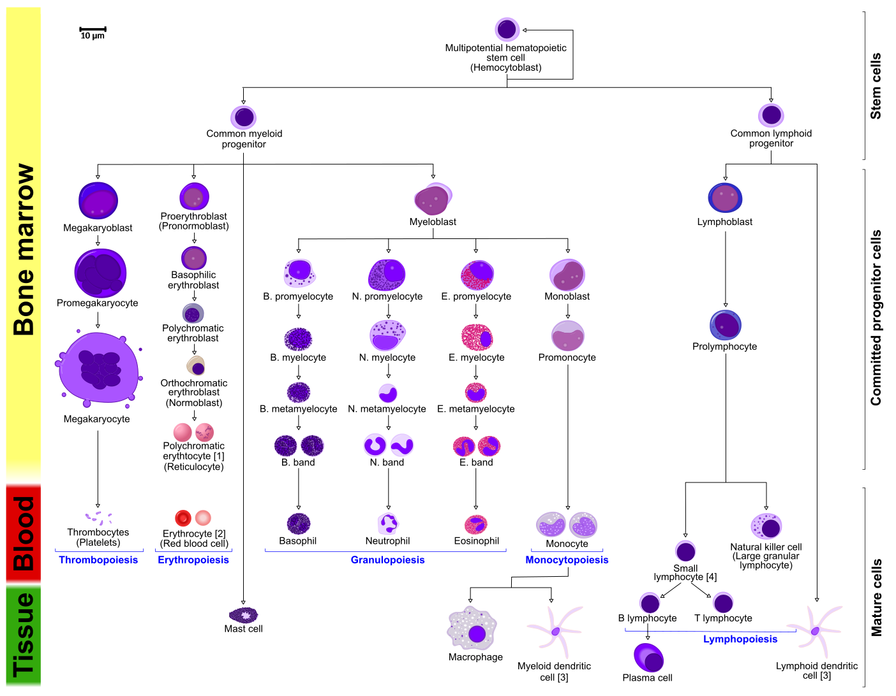

# An Introduction To Host Defenses And Innate Immune Systems

## Immunology

Immunology is a branch of biology that covers the study of immune systems in all organisms. Immunology charts, measures, and contextualizes the physiological functioning of the immune system in states of both health and diseases; malfunctions of the immune system in immunological disorders (such as autoimmune diseases, hypersensitivities, immune deficiency, and transplant rejection); and the physical, chemical, and physiological characteristics of the components of the immune system in vitro, in situ, and in vivo. Immunology has applications in numerous disciplines of medicine, particularly in the fields of organ transplantation, oncology, rheumatology, virology, bacteriology, parasitology, psychiatry, and dermatology.

The term was coined by Russian biologist Ilya Ilyich Mechnikov, who advanced studies on immunology and received the Nobel Prize for his work in 1908. He pinned small thorns into starfish larvae and noticed unusual cells surrounding the thorns. This was the active response of the body trying to maintain its integrity. It was Mechnikov who first observed the phenomenon of phagocytosis, in which the body defends itself against a foreign body.

Prior to the designation of immunity, from the etymological root immunis, which is Latin for "exempt", early physicians characterized organs that would later be proven as essential components of the immune system. The important lymphoid organs of the immune system are the thymus, bone marrow, and chief lymphatic tissues such as spleen, tonsils, lymph vessels, lymph nodes, adenoids, and liver. When health conditions worsen to emergency status, portions of immune system organs, including the thymus, spleen, bone marrow, lymph nodes, and other lymphatic tissues, can be surgically excised for examination while patients are still alive.

Many components of the immune system are typically cellular in nature and not associated with any specific organ, but rather are embedded or circulating in various tissues located throughout the body.

## The Immune System

The immune system is a network of biological processes that protects an organism from diseases. It detects and responds to a wide variety of pathogens, from viruses to parasitic worms, as well as cancer cells and objects such as wood splinters, distinguishing them from the organism's own healthy tissue. Many species have two major subsystems of the immune system. The innate immune system provides a preconfigured response to broad groups of situations and stimuli. The adaptive immune system provides a tailored response to each stimulus by learning to recognize molecules it has previously encountered. Both use molecules and cells to perform their functions.

Nearly all organisms have some kind of immune system. Bacteria have a rudimentary immune system in the form of enzymes that protect against virus infections. Other basic immune mechanisms evolved in ancient plants and animals and remain in their modern descendants. These mechanisms include phagocytosis, antimicrobial peptides called defensins, and the complement system. Jawed vertebrates, including humans, have even more sophisticated defense mechanisms, including the ability to adapt to recognize pathogens more efficiently. Adaptive (or acquired) immunity creates an immunological memory leading to an enhanced response to subsequent encounters with that same pathogen. This process of acquired immunity is the basis of vaccination.

Dysfunction of the immune system can cause autoimmune diseases, inflammatory diseases and cancer. Immunodeficiency occurs when the immune system is less active than normal, resulting in recurring and life-threatening infections. In humans, immunodeficiency can be the result of a genetic disease such as severe combined immunodeficiency, acquired conditions such as HIV/AIDS, or the use of immunosuppressive medication. Autoimmunity results from a hyperactive immune system attacking normal tissues as if they were foreign organisms. Common autoimmune diseases include Hashimoto's thyroiditis, rheumatoid arthritis, diabetes mellitus type 1, and systemic lupus erythematosus. Immunology covers the study of all aspects of the immune system.

## Layered Defense

The immune system protects its host from infection with layered defenses of increasing specificity. Physical barriers prevent pathogens such as bacteria and viruses from entering the organism. If a pathogen breaches these barriers, the innate immune system provides an immediate, but non-specific response. Innate immune systems are found in all animals. If pathogens successfully evade the innate response, vertebrates possess a second layer of protection, the adaptive immune system, which is activated by the innate response. Here, the immune system adapts its response during an infection to improve its recognition of the pathogen. This improved response is then retained after the pathogen has been eliminated, in the form of an immunological memory, and allows the adaptive immune system to mount faster and stronger attacks each time this pathogen is encountered.

```{r immune, out.width='75%', echo=FALSE, message=FALSE, warning=FALSE}
library(tidyverse)
library(printr)        
library(kableExtra)
setwd("~/Dropbox/R/microbiology-text")

macro <-  as_tibble(read.csv("data/immune_system.csv"))

knitr::kable(macro, col.names = c("Innate immune system", "Adaptive immune system"), digits = 2, align = 'll', booktabs = TRUE, caption = "Components of the immune system.") %>% kable_styling(latex_options = c("striped", "hold_position")) 
```

Both innate and adaptive immunity depend on the ability of the immune system to distinguish between self and non-self molecules. In immunology, self molecules are components of an organism's body that can be distinguished from foreign substances by the immune system. Conversely, non-self molecules are those recognized as foreign molecules. One class of non-self molecules are called antigens (originally named for being antibody generators) and are defined as substances that bind to specific immune receptors and elicit an immune response.

## Surface Barriers

Several barriers protect organisms from infection, including mechanical, chemical, and biological barriers. The waxy cuticle of most leaves, the exoskeleton of insects, the shells and membranes of externally deposited eggs, and skin are examples of mechanical barriers that are the first line of defense against infection. Organisms cannot be completely sealed from their environments, so systems act to protect body openings such as the lungs, intestines, and the genitourinary tract. In the lungs, coughing and sneezing mechanically eject pathogens and other irritants from the respiratory tract. The flushing action of tears and urine also mechanically expels pathogens, while mucus secreted by the respiratory and gastrointestinal tract serves to trap and entangle microorganisms.

Chemical barriers also protect against infection. The skin and respiratory tract secrete antimicrobial peptides such as the β-defensins. Enzymes such as lysozyme and phospholipase A2 in saliva, tears, and breast milk are also antibacterials. Vaginal secretions serve as a chemical barrier following menarche, when they become slightly acidic, while semen contains defensins and zinc to kill pathogens. In the stomach, gastric acid serves as a chemical defense against ingested pathogens.

Within the genitourinary and gastrointestinal tracts, commensal flora serve as biological barriers by competing with pathogenic bacteria for food and space and, in some cases, changing the conditions in their environment, such as pH or available iron. As a result, the probability that pathogens will reach sufficient numbers to cause illness is reduced.

## Innate Immune System

Microorganisms or toxins that successfully enter an organism encounter the cells and mechanisms of the innate immune system. The innate response is usually triggered when microbes are identified by pattern recognition receptors, which recognize components that are conserved among broad groups of microorganisms, or when damaged, injured or stressed cells send out alarm signals, many of which are recognized by the same receptors as those that recognize pathogens. Innate immune defenses are non-specific, meaning these systems respond to pathogens in a generic way. This system does not confer long-lasting immunity against a pathogen. The innate immune system is the dominant system of host defense in most organisms, and the only one in plants.

The innate immune system is one of the two main immunity strategies found in vertebrates (the other being the adaptive immune system). The innate immune system is an older evolutionary defense strategy, relatively speaking, and is the dominant immune system response found in plants, fungi, insects, and primitive multicellular organisms.

The major functions of the vertebrate innate immune system include:

* Recruiting immune cells to sites of infection through the production of chemical factors, including specialized chemical mediators called cytokines
* Activation of the complement cascade to identify bacteria, activate cells, and promote clearance of antibody complexes or dead cells
* Identification and removal of foreign substances present in organs, tissues, blood and lymph, by specialized white blood cells
* Activation of the adaptive immune system through a process known as antigen presentation
* Acting as a physical and chemical barrier to infectious agents; via physical measures like skin or tree bark and chemical measures like clotting factors in blood or sap from a tree, which are released following a contusion or other injury that breaks through the first-line physical barrier (not to be confused with a second-line physical or chemical barrier, such as the blood-brain barrier, which protects the extremely vital and highly sensitive nervous system from pathogens that have already gained access to the host's body).

Cells in the innate immune system use pattern recognition receptors to recognize molecular structures that are produced by pathogens. They are proteins expressed, mainly, by cells of the innate immune system, such as dendritic cells, macrophages, monocytes, neutrophils and epithelial cells to identify two classes of molecules: pathogen-associated molecular patterns (PAMPs), which are associated with microbial pathogens, and damage-associated molecular patterns (DAMPs), which are associated with components of host's cells that are released during cell damage or cell death.

Recognition of extracellular or endosomal PAMPs is mediated by transmembrane proteins known as toll-like receptors (TLRs). TLRs share a typical structural motif, the leucine rich repeats (LRR), which give them a curved shape. Toll-like receptors were first discovered in Drosophila and trigger the synthesis and secretion of cytokines and activation of other host defense programs that are necessary for both innate or adaptive immune responses. Ten toll-like receptors have been described in humans.

Cells in the innate immune system have pattern recognition receptors, which detect infection or cell damage, inside. Three major classes of these "cytosolic" receptors are NOD–like receptors, RIG (retinoic acid-inducible gene)-like receptors, and cytosolic DNA sensors.

Some leukocytes (white blood cells) act like independent, single-celled organisms and are the second arm of the innate immune system. The innate leukocytes include the "professional" phagocytes (macrophages, neutrophils, and dendritic cells). These cells identify and eliminate pathogens, either by attacking larger pathogens through contact or by engulfing and then killing microorganisms. The other cells involved in the innate response include innate lymphoid cells, mast cells, eosinophils, basophils, and natural killer cells.

Phagocytosis is an important feature of cellular innate immunity performed by cells called phagocytes that engulf pathogens or particles. Phagocytes generally patrol the body searching for pathogens, but can be called to specific locations by cytokines. Once a pathogen has been engulfed by a phagocyte, it becomes trapped in an intracellular vesicle called a phagosome, which subsequently fuses with another vesicle called a lysosome to form a phagolysosome. The pathogen is killed by the activity of digestive enzymes or following a respiratory burst that releases free radicals into the phagolysosome. Phagocytosis evolved as a means of acquiring nutrients, but this role was extended in phagocytes to include engulfment of pathogens as a defense mechanism. Phagocytosis probably represents the oldest form of host defense, as phagocytes have been identified in both vertebrate and invertebrate animals.

Neutrophils and macrophages are phagocytes that travel throughout the body in pursuit of invading pathogens. Neutrophils are normally found in the bloodstream and are the most abundant type of phagocyte, representing 50% to 60% of total circulating leukocytes. During the acute phase of inflammation, neutrophils migrate toward the site of inflammation in a process called chemotaxis, and are usually the first cells to arrive at the scene of infection. Macrophages are versatile cells that reside within tissues and produce an array of chemicals including enzymes, complement proteins, and cytokines, while they can also act as scavengers that rid the body of worn-out cells and other debris, and as antigen-presenting cells (APC) that activate the adaptive immune system.

In immunology, the mononuclear phagocyte system or mononuclear phagocytic system (MPS) also known as the reticuloendothelial system or macrophage system is a part of the immune system that consists of the phagocytic cells located in reticular connective tissue. The cells are primarily monocytes and macrophages, and they accumulate in lymph nodes and the spleen. The Kupffer cells of the liver and tissue histiocytes are also part of the MPS. The mononuclear phagocyte system and the monocyte macrophage system refer to two different entities, often mistakenly understood as one.[citation needed]

"Reticuloendothelial system" is an older term for the mononuclear phagocyte system, but it is used less commonly now, as it is understood that most endothelial cells are not macrophages.

The mononuclear phagocyte system is also a somewhat dated concept trying to combine a broad range of cells, and should be used with caution.

Dendritic cells are phagocytes in tissues that are in contact with the external environment; therefore, they are located mainly in the skin, nose, lungs, stomach, and intestines. They are named for their resemblance to neuronal dendrites, as both have many spine-like projections. Dendritic cells serve as a link between the bodily tissues and the innate and adaptive immune systems, as they present antigens to T cells, one of the key cell types of the adaptive immune system.

Granulocytes are leukocytes that have granules in their cytoplasm. In this category are neutrophils, mast cells, basophils, and eosinophils. Mast cells reside in connective tissues and mucous membranes, and regulate the inflammatory response. They are most often associated with allergy and anaphylaxis. Basophils and eosinophils are related to neutrophils. They secrete chemical mediators that are involved in defending against parasites and play a role in allergic reactions, such as asthma.

Innate lymphoid cells (ILCs) are a group of innate immune cells that are derived from common lymphoid progenitor and belong to the lymphoid lineage. These cells are defined by absence of antigen specific B or T cell receptor (TCR) because of the lack of recombination activating gene. ILCs do not express myeloid or dendritic cell markers.

Natural killer cells (NK) are lymphocytes and a component of the innate immune system which does not directly attack invading microbes. Rather, NK cells destroy compromised host cells, such as tumor cells or virus-infected cells, recognizing such cells by a condition known as "missing self." This term describes cells with low levels of a cell-surface marker called MHC I (major histocompatibility complex)—a situation that can arise in viral infections of host cells. Normal body cells are not recognized and attacked by NK cells because they express intact self MHC antigens. Those MHC antigens are recognized by killer cell immunoglobulin receptors which essentially put the brakes on NK cells.

### Anatomical Barriers

Anatomical barriers include physical, chemical and biological barriers. The epithelial surfaces form a physical barrier that is impermeable to most infectious agents, acting as the first line of defense against invading organisms. Desquamation (shedding) of skin epithelium also helps remove bacteria and other infectious agents that have adhered to the epithelial surfaces. Lack of blood vessels, the inability of the epidermis to retain moisture, and the presence of sebaceous glands in the dermis, produces an environment unsuitable for the survival of microbes. In the gastrointestinal and respiratory tract, movement due to peristalsis or cilia, respectively, helps remove infectious agents. Also, mucus traps infectious agents. The gut flora can prevent the colonization of pathogenic bacteria by secreting toxic substances or by competing with pathogenic bacteria for nutrients or attachment to cell surfaces. The flushing action of tears and saliva helps prevent infection of the eyes and mouth.

### Inflammation

Inflammation is one of the first responses of the immune system to infection or irritation. Inflammation is stimulated by chemical factors released by injured cells and serves to establish a physical barrier against the spread of infection, and to promote healing of any damaged tissue following the clearance of pathogens.

The process of acute inflammation is initiated by cells already present in all tissues, mainly resident macrophages, dendritic cells, histiocytes, Kupffer cells, and mast cells. These cells present receptors contained on the surface or within the cell, named pattern recognition receptors (PRRs), which recognize molecules that are broadly shared by pathogens but distinguishable from host molecules, collectively referred to as pathogen-associated molecular patterns (PAMPs). At the onset of an infection, burn, or other injuries, these cells undergo activation (one of their PRRs recognizes a PAMP) and release inflammatory mediators responsible for the clinical signs of inflammation.

Chemical factors produced during inflammation (histamine, bradykinin, serotonin, leukotrienes, and prostaglandins) sensitize pain receptors, cause local vasodilation of the blood vessels, and attract phagocytes, especially neutrophils. Neutrophils then trigger other parts of the immune system by releasing factors that summon additional leukocytes and lymphocytes. Cytokines produced by macrophages and other cells of the innate immune system mediate the inflammatory response. These cytokines include TNF, HMGB1, and IL-1.

The inflammatory response is characterized by the following symptoms:

* redness of the skin, due to locally increased blood circulation;
* heat, either increased local temperature, such as a warm feeling around a localized infection, or a systemic fever;
* swelling of affected tissues, such as the upper throat during the common cold or joints affected by rheumatoid arthritis;
* increased production of mucus, which can cause symptoms like a runny nose or a productive cough;
* pain, either local pain, such as painful joints or a sore throat, or affecting the whole body, such as body aches; and
* possible dysfunction of the organs or tissues involved.

### Complement System

The complement system is a biochemical cascade of the immune system that helps, or “complements”, the ability of antibodies to clear pathogens or mark them for destruction by other cells. The cascade is composed of many plasma proteins, synthesized in the liver, primarily by hepatocytes. The proteins work together to:

* trigger the recruitment of inflammatory cells
* "tag" pathogens for destruction by other cells by opsonizing, or coating, the surface of the pathogen
* form holes in the plasma membrane of the pathogen, resulting in cytolysis of the pathogen cell, causing the death of the pathogen
* rid the body of neutralised antigen-antibody complexes.

There are three different complement systems: Classical, alternative, Lectin

* Classical: starts when antibody binds to bacteria
* Alternative: starts "spontaneously"
* Lectin: starts when lectins bind to mannose on bacteria

Elements of the complement cascade can be found in many non-mammalian species including plants, birds, fish, and some species of invertebrates.

### Blood 

Blood is a body fluid in humans and other animals that delivers necessary substances such as nutrients and oxygen to the cells and transports metabolic waste products away from those same cells.

In vertebrates, it is composed of blood cells suspended in blood plasma. Plasma, which constitutes 55% of blood fluid, is mostly water (92% by volume), and contains proteins, glucose, mineral ions, hormones, carbon dioxide (plasma being the main medium for excretory product transportation), and blood cells themselves. Albumin is the main protein in plasma, and it functions to regulate the colloidal osmotic pressure of blood. The blood cells are mainly red blood cells (also called RBCs or erythrocytes), white blood cells (also called WBCs or leukocytes) and platelets (also called thrombocytes). The most abundant cells in vertebrate blood are red blood cells. These contain hemoglobin, an iron-containing protein, which facilitates oxygen transport by reversibly binding to this respiratory gas and greatly increasing its solubility in blood. In contrast, carbon dioxide is mostly transported extracellularly as bicarbonate ion transported in plasma.

Vertebrate blood is bright red when its hemoglobin is oxygenated and dark red when it is deoxygenated. Some animals, such as crustaceans and mollusks, use hemocyanin to carry oxygen, instead of hemoglobin. Insects and some mollusks use a fluid called hemolymph instead of blood, the difference being that hemolymph is not contained in a closed circulatory system. In most insects, this "blood" does not contain oxygen-carrying molecules such as hemoglobin because their bodies are small enough for their tracheal system to suffice for supplying oxygen.

Jawed vertebrates have an adaptive immune system, based largely on white blood cells. White blood cells help to resist infections and parasites. Platelets are important in the clotting of blood. Arthropods, using hemolymph, have hemocytes as part of their immune system.

Blood is circulated around the body through blood vessels by the pumping action of the heart. In animals with lungs, arterial blood carries oxygen from inhaled air to the tissues of the body, and venous blood carries carbon dioxide, a waste product of metabolism produced by cells, from the tissues to the lungs to be exhaled.

Medical terms related to blood often begin with hemo- or hemato- (also spelled haemo- and haemato-) from the Greek word αἷμα (haima) for "blood". In terms of anatomy and histology, blood is considered a specialized form of connective tissue, given its origin in the bones and the presence of potential molecular fibers in the form of fibrinogen.

Blood accounts for 7% of the human body weight, with an average density around 1060 kg/m3, very close to pure water's density of 1000 kg/m3. The average adult has a blood volume of roughly 5 litres (11 US pt) or 1.3 gallons, which is composed of plasma and formed elements. The formed elements are the two types of blood cell or corpuscle – the red blood cells, (erythrocytes) and white blood cells (leukocytes), and the cell fragments called platelets that are involved in clotting. By volume, the red blood cells constitute about 45% of whole blood, the plasma about 54.3%, and white cells about 0.7%.

One microliter of blood contains:

* 4.7 to 6.1 million (male), 4.2 to 5.4 million (female) erythrocytes: Red blood cells contain the blood's hemoglobin and distribute oxygen. Mature red blood cells lack a nucleus and organelles in mammals. The red blood cells (together with endothelial vessel cells and other cells) are also marked by glycoproteins that define the different blood types. The proportion of blood occupied by red blood cells is referred to as the hematocrit, and is normally about 45%. The combined surface area of all red blood cells of the human body would be roughly 2,000 times as great as the body's exterior surface.
* 4,000–11,000 leukocytes: White blood cells are part of the body's immune system; they destroy and remove old or aberrant cells and cellular debris, as well as attack infectious agents (pathogens) and foreign substances. The cancer of leukocytes is called leukemia.
* 200,000–500,000 thrombocytes: Also called platelets, they take part in blood clotting (coagulation). Fibrin from the coagulation cascade creates a mesh over the platelet plug.

About 55% of blood is blood plasma, a fluid that is the blood's liquid medium, which by itself is straw-yellow in color. The blood plasma volume totals of 2.7–3.0 liters (2.8–3.2 quarts) in an average human. It is essentially an aqueous solution containing 92% water, 8% blood plasma proteins, and trace amounts of other materials. Plasma circulates dissolved nutrients, such as glucose, amino acids, and fatty acids (dissolved in the blood or bound to plasma proteins), and removes waste products, such as carbon dioxide, urea, and lactic acid.

Other important components include:

* Serum albumin
* Blood-clotting factors (to facilitate coagulation)
* Immunoglobulins (antibodies)
* lipoprotein particles
* Various other proteins
* Various electrolytes (mainly sodium and chloride)

The term serum refers to plasma from which the clotting proteins have been removed. Most of the proteins remaining are albumin and immunoglobulins.

### Haematopoiesis

Haematopoiesis (/hɪˌmætoʊpɔɪˈiːsɪs, ˈhiːmətoʊ-, ˌhɛmə-/, from Greek αἷμα, 'blood' and ποιεῖν 'to make'; also hematopoiesis in American English; sometimes also h(a)emopoiesis) is the formation of blood cellular components. All cellular blood components are derived from haematopoietic stem cells. In a healthy adult person, approximately 1011–1012 new blood cells are produced daily in order to maintain steady state levels in the peripheral circulation.


(ref:hemato) [Detailed and comprehensive diagram showing the development of different blood cells in humans.](https://commons.wikimedia.org/wiki/File:Hematopoiesis_(human)_diagram_en.svg) The morphological characteristics of the hematopoietic cells are shown as seen in a Wright’s stain, May-Giemsa stain or May-Grünwald-Giemsa stain. Alternative names of certain cells are indicated between parentheses. Certain cells may have more than one characteristic appearance. In these cases, more than one representation of the same cell has been included. Together, the monocyte and the lymphocytes comprise the agranulocytes, as opposed to the granulocytes (basophil, neurtophil and eosinophil) that are produced during granulopoiesis. B., N. and E. stand for Basophilic, Neutrophilic and Eosinophilic, respectively – as in Basophilic promyelocyte. For lymphocytes, the T and B are actual designations. The polychromatic erythrocyte (reticulocyte) at the right shows its characteristic appearance when stained with methylene blue or Azure B. The erythrocyte at the right is a more accurate representation of its appearance in reality when viewed through a microscope. Other cells that arise from the monocyte: osteoclast, microglia (central nervous system), Langerhans cell (epidermis), Kupffer cell (liver). For clarity, the T and B lymphocyte are split to better indicate that the plasma cell arises from the B-cell. Note that there is no difference in the appearance of B- and T-cells unless specific staining is applied.

```{r hematopoiesis, fig.cap='(ref:hemato)', echo=FALSE, message=FALSE, warning=FALSE}

```

Haematopoietic stem cells (HSCs) reside in the medulla of the bone (bone marrow) and have the unique ability to give rise to all of the different mature blood cell types and tissues. HSCs are self-renewing cells: when they differentiate, at least some of their daughter cells remain as HSCs, so the pool of stem cells is not depleted. This phenomenon is called asymmetric division. The other daughters of HSCs (myeloid and lymphoid progenitor cells) can follow any of the other differentiation pathways that lead to the production of one or more specific types of blood cell, but cannot renew themselves. The pool of progenitors is heterogeneous and can be divided into two groups; long-term self-renewing HSC and only transiently self-renewing HSC, also called short-terms. This is one of the main vital processes in the body.

### White Blood Cells

All white blood cells (WBCs) are known as leukocytes. Most leukocytes differ from other cells of the body in that they are not tightly associated with a particular organ or tissue; thus, their function is similar to that of independent, single-cell organisms. Most leukocytes are able to move freely and interact with and capture cellular debris, foreign particles, and invading microorganisms (although macrophages, mast cells, and dendritic cells are less mobile). Unlike many other cells in the body, most innate immune leukocytes cannot divide or reproduce on their own, but are the products of multipotent hematopoietic stem cells present in the bone marrow.

The innate leukocytes include: natural killer cells, mast cells, eosinophils, basophils; and the phagocytic cells include macrophages, neutrophils, and dendritic cells, and function within the immune system by identifying and eliminating pathogens that might cause infection.

### Mast cells

Mast cells are a type of innate immune cell that resides in connective tissue and in mucous membranes. They are intimately associated with wound healing and defense against pathogens, but are also often associated with allergy and anaphylaxis (serious allergic reactions that can cause death). When activated, mast cells rapidly release characteristic granules, rich in histamine and heparin, along with various hormonal mediators and chemokines, or chemotactic cytokines into the environment. Histamine dilates blood vessels, causing the characteristic signs of inflammation, and recruits neutrophils and macrophages.

### Phagocytes

The word 'phagocyte' literally means 'eating cell'. These are immune cells that engulf, or 'phagocytose', pathogens or particles. To engulf a particle or pathogen, a phagocyte extends portions of its plasma membrane, wrapping the membrane around the particle until it is enveloped (i.e., the particle is now inside the cell). Once inside the cell, the invading pathogen is contained inside a phagosome, which merges with a lysosome. The lysosome contains enzymes and acids that kill and digest the particle or organism. In general, phagocytes patrol the body searching for pathogens, but are also able to react to a group of highly specialized molecular signals produced by other cells, called cytokines. The phagocytic cells of the immune system include macrophages, neutrophils, and dendritic cells.

Phagocytosis of the hosts’ own cells is common as part of regular tissue development and maintenance. When host cells die, either by programmed cell death (also called apoptosis) or by cell injury due to a bacterial or viral infection, phagocytic cells are responsible for their removal from the affected site. By helping to remove dead cells preceding growth and development of new healthy cells, phagocytosis is an important part of the healing process following tissue injury.

### Macrophages

Macrophages, from the Greek, meaning "large eaters", are large phagocytic leukocytes, which are able to move outside of the vascular system by migrating through the walls of capillary vessels and entering the areas between cells in pursuit of invading pathogens. In tissues, organ-specific macrophages are differentiated from phagocytic cells present in the blood called monocytes. Macrophages are the most efficient phagocytes and can phagocytose substantial numbers of bacteria or other cells or microbes. The binding of bacterial molecules to receptors on the surface of a macrophage triggers it to engulf and destroy the bacteria through the generation of a “respiratory burst”, causing the release of reactive oxygen species. Pathogens also stimulate the macrophage to produce chemokines, which summon other cells to the site of infection.

### Neutrophils

Neutrophils, along with two other cell types (eosinophils and basophils; see below), are known as granulocytes due to the presence of granules in their cytoplasm, or as polymorphonuclear cells (PMNs) due to their distinctive lobed nuclei. Neutrophil granules contain a variety of toxic substances that kill or inhibit growth of bacteria and fungi. Similar to macrophages, neutrophils attack pathogens by activating a respiratory burst. The main products of the neutrophil respiratory burst are strong oxidizing agents including hydrogen peroxide, free oxygen radicals and hypochlorite. Neutrophils are the most abundant type of phagocyte, normally representing 50-60% of the total circulating leukocytes, and are usually the first cells to arrive at the site of an infection. The bone marrow of a normal healthy adult produces more than 100 billion neutrophils per day, and more than 10 times that many per day during acute inflammation.

### Dendritic Cells

Dendritic cells (DCs) are phagocytic cells present in tissues that are in contact with the external environment, mainly the skin (where they are often called Langerhans cells), and the inner mucosal lining of the nose, lungs, stomach, and intestines. They are named for their resemblance to neuronal dendrites, but dendritic cells are not connected to the nervous system. Dendritic cells are very important in the process of antigen presentation, and serve as a link between the innate and adaptive immune systems.

### Basophils And Eosinophils

Basophils and eosinophils are cells related to the neutrophil (see above). When activated by a pathogen encounter, histamine-releasing basophils are important in the defense against parasites and play a role in allergic reactions, such as asthma. Upon activation, eosinophils secrete a range of highly toxic proteins and free radicals that are highly effective in killing parasites, but may also damage tissue during an allergic reaction. Activation and release of toxins by eosinophils are, therefore, tightly regulated to prevent any inappropriate tissue destruction.

### Natural Killer Cells

Natural killer cells (NK cells) are a component of the innate immune system that does not directly attack invading microbes. Rather, NK cells destroy compromised host cells, such as tumor cells or virus-infected cells, recognizing such cells by a condition known as "missing self." This term describes cells with abnormally low levels of a cell-surface marker called MHC I (major histocompatibility complex) - a situation that can arise in viral infections of host cells. They were named "natural killer" because of the initial notion that they do not require activation in order to kill cells that are "missing self." For many years, it was unclear how NK cell recognize tumor cells and infected cells. It is now known that the MHC makeup on the surface of those cells is altered and the NK cells become activated through recognition of "missing self". Normal body cells are not recognized and attacked by NK cells because they express intact self MHC antigens. Those MHC antigens are recognized by killer cell immunoglobulin receptors (KIR) that, in essence, put the brakes on NK cells. The NK-92 cell line does not express KIR and is developed for tumor therapy.

### γδ T Cells

Like other 'unconventional' T cell subsets bearing invariant T cell receptors (TCRs), such as CD1d-restricted Natural Killer T cells, γδ T cells exhibit characteristics that place them at the border between innate and adaptive immunity. On one hand, γδ T cells may be considered a component of adaptive immunity in that they rearrange TCR genes to produce junctional diversity and develop a memory phenotype. However, the various subsets may also be considered part of the innate immune system where a restricted TCR or NK receptors may be used as a pattern recognition receptor. For example, according to this paradigm, large numbers of Vγ9/Vδ2 T cells respond within hours to common molecules produced by microbes, and highly restricted intraepithelial Vδ1 T cells will respond to stressed epithelial cells.

### Other Vertebrate Mechanisms

The coagulation system overlaps with the immune system. Some products of the coagulation system can contribute to the non-specific defenses by their ability to increase vascular permeability and act as chemotactic agents for phagocytic cells. In addition, some of the products of the coagulation system are directly antimicrobial. For example, beta-lysine, a protein produced by platelets during coagulation, can cause lysis of many Gram-positive bacteria by acting as a cationic detergent. Many acute-phase proteins of inflammation are involved in the coagulation system.

Also increased levels of lactoferrin and transferrin inhibit bacterial growth by binding iron, an essential nutrient for bacteria.

### Neural Regulation

The innate immune response to infectious and sterile injury is modulated by neural circuits that control cytokine production period. The inflammatory reflex is a prototypical neural circuit that controls cytokine production in the spleen. Action potentials transmitted via the vagus nerve to spleen mediate the release of acetylcholine, the neurotransmitter that inhibits cytokine release by interacting with alpha7 nicotinic acetylcholine receptors (CHRNA7) expressed on cytokine-producing cells. The motor arc of the inflammatory reflex is termed the cholinergic anti-inflammatory pathway.

### Pathogen-specificity

```{r path, out.width='75%', echo=FALSE, message=FALSE, warning=FALSE}
library(tidyverse)
library(printr)        
library(kableExtra)
setwd("~/Dropbox/R/microbiology-text")

macro <-  as_tibble(read.csv("data/pathogen_specificity.csv"))

knitr::kable(macro, col.names = c("Pathogen", "Main examples", "Phagocytosis", "Complement", "NK cells"), digits = 2, align = 'lllll', booktabs = TRUE, caption = "The parts of the innate immune system have different specificity for different pathogens.") %>% kable_styling(latex_options = c("striped", "hold_position")) 
```

### Immune Evasion

Cells of the innate immune system prevent free growth of microorganisms within the body, but many pathogens have evolved mechanisms to evade it.

One strategy is intracellular replication, as practised by Mycobacterium tuberculosis, or wearing a protective capsule, which prevents lysis by complement and by phagocytes, as in Salmonella. Bacteroides species are normally mutualistic bacteria, making up a substantial portion of the mammalian gastrointestinal flora. Some species like B. fragilis for example are opportunistic pathogens, causing infections of the peritoneal cavity inhibit phagocytosis by affecting the phagocytes receptors used to engulf bacteria. They may also mimick host cells so the immune system does not recognize them as foreign. Staphylococcus aureus inhibits the ability of the phagocyte to respond to chemokine signals. M. tuberculosis, Streptococcus pyogenes, and Bacillus anthracis utilize mechanisms that directly kill the phagocyte.

Bacteria and fungi may form complex biofilms, protecting from immune cells and proteins; biofilms are present in the chronic Pseudomonas aeruginosa and Burkholderia cenocepacia infections characteristic of cystic fibrosis.

### Viruses

Type I interferons (IFN), secreted mainly by dendritic cells, play a central role in antiviral host defense and a cell's antiviral state. Viral components are recognized by different receptors: Toll-like receptors are located in the endosomal membrane and recognize double-stranded RNA (dsRNA), MDA5 and RIG-I receptors are located in the cytoplasm and recognize long dsRNA and phosphate-containing dsRNA respectively. When the cytoplasmic receptors MDA5 and RIG-I recognize a virus the conformation between the caspase-recruitment domain (CARD) and the CARD-containing adaptor MAVS changes. In parallel, when toll-like receptors in the endocytic compartments recognize a virus the activation of the adaptor protein TRIF is induced. Both pathways converge in the recruitment and activation of the IKKε/TBK-1 complex, inducing dimerization of transcription factors IRF3 and IRF7, which are translocated in the nucleus, where they induce IFN production with the presence of a particular transcription factor and activate transcription factor 2. IFN is secreted through secretory vesicles, where it can activate receptors on both the same cell it was released from (autocrine) or nearby cells (paracrine). This induces hundreds of interferon-stimulated genes to be expressed. This leads to antiviral protein production, such as protein kinase R, which inhibits viral protein synthesis, or the 2′,5′-oligoadenylate synthetase family, which degrades viral RNA.

Some viruses evade this by producing molecules which interfere with IFN production. For example, the Influenza A virus produces NS1 protein, which can bind to host and viral RNA, interact with immune signaling proteins or block their activation by ubiquitination, thus inhibiting type I IFN production. Influenza A also blocks protein kinase R activation and establishment of the antiviral state. The dengue virus also inhibits type I IFN production by blocking IRF-3 phosophorylation using NS2B3 protease complex.

## Mechanisms Of Immune Defense In Prokaryotes

Bacteria (and perhaps other prokaryotic organisms), utilize a unique defense mechanism, called the restriction modification system to protect themselves from pathogens, such as bacteriophages. In this system, bacteria produce enzymes, called restriction endonucleases, that attack and destroy specific regions of the viral DNA of invading bacteriophages. Methylation of the host's own DNA marks it as "self" and prevents it from being attacked by endonucleases. Restriction endonucleases and the restriction modification system exist exclusively in prokaryotes.
