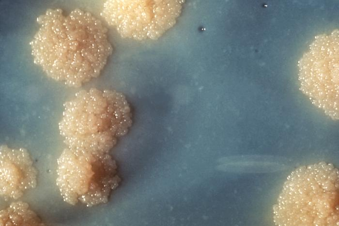

# Infection And Disease

## Pathogenic Bacteria

Pathogenic bacteria are bacteria that can cause disease. This chapter focuses on the bacteria that are pathogenic to humans. Most species of bacteria are harmless and are often beneficial but others can cause infectious diseases. The number of these pathogenic species in humans is estimated to be fewer than a hundred. By contrast, several thousand species are part of the gut flora present in the digestive tract.

(ref:neiss) [Neisseria gonorrhoea in pus from a man with a purulent urethral discharge - Gram stain.](https://commons.wikimedia.org/wiki/File:Neisseria_gonorrhoea_in_pus_-_Gram_stain.jpg)

```{r neisseriagon, fig.cap='(ref:neiss)', echo=FALSE, message=FALSE, warning=FALSE}
knitr::include_graphics("./figures/infection/Neisseria_gonorrhoea_in_pus_-_Gram_stain.jpg")
```

The body is continually exposed to many species of bacteria, including beneficial commensals, which grow on the skin and mucous membranes, and saprophytes, which grow mainly in the soil and in decaying matter. The blood and tissue fluids contain nutrients sufficient to sustain the growth of many bacteria. The body has defence mechanisms that enable it to resist microbial invasion of its tissues and give it a natural immunity or innate resistance against many microorganisms.

Pathogenic bacteria are specially adapted and endowed with mechanisms for overcoming the normal body defences, and can invade parts of the body, such as the blood, where bacteria are not normally found. Some pathogens invade only the surface epithelium, skin or mucous membrane, but many travel more deeply, spreading through the tissues and disseminating by the lymphatic and blood streams. In some rare cases a pathogenic microbe can infect an entirely healthy person, but infection usually occurs only if the body's defence mechanisms are damaged by some local trauma or an underlying debilitating disease, such as wounding, intoxication, chilling, fatigue, and malnutrition. In many cases, it is important to differentiate infection and colonization, which is when the bacteria are causing little or no harm.

Caused by Mycobacterium tuberculosis bacteria, one of the diseases with the highest disease burden is tuberculosis, which killed 1.4 million people in 2019, mostly in sub-Saharan Africa. Pathogenic bacteria contribute to other globally important diseases, such as pneumonia, which can be caused by bacteria such as Streptococcus, Pneumococcus and Pseudomonas, and foodborne illnesses, which can be caused by bacteria such as Shigella, Campylobacter, and Salmonella. Pathogenic bacteria also cause infections such as tetanus, typhoid fever, diphtheria, syphilis, and leprosy. Pathogenic bacteria are also the cause of high infant mortality rates in developing countries.

(ref:mycob) [A close-up photogrpaph of a Mycobacterium tuberculosis culture revealing this organism’s colonial morphology. Note the colorless rough surface, which are typical morphologic characteristics seen in Mycobacterium tuberculosis colonial growth. Macroscopic examination of colonial growth patterns is still one of the ways microorganisms are often identified.](https://commons.wikimedia.org/wiki/File:TB_Culture.jpg)

```{r mycobacteriu,, fig.cap='(ref:mycob)', echo=FALSE, message=FALSE, warning=FALSE}

```

Most pathogenic bacteria can be grown in cultures and identifed by Gram stain and other methods. Bacteria grown in this way are often tested to find which antibiotics will be an effective treatment for the infection. For hitherto unknown pathogens, Koch's postulates are the standard to establish a causative relationship between a microbe and a disease.

Each species has specific effect and causes symptoms in people who are infected. Some people who are infected with a pathogenic bacteria do not have symptoms. Immunocompromised individuals are more susceptible to pathogenic bacteria.

## Pathogenic Susceptibility

Some pathogenic bacteria cause disease under certain conditions, such as entry through the skin via a cut, through sexual activity or through a compromised immune function.

Some species of Streptococcus and Staphylococcus are part of the normal skin microbiota and typically reside on healthy skin or in the nasopharangeal region. Yet these species can potentially initiate skin infections. Streptoccal infections include sepsis, pneumonia, and meningitis. These infections can become serious creating a systemic inflammatory response resulting in massive vasodilation, shock, and death.

Other bacteria are opportunistic pathogens and cause disease mainly in people suffering from immunosuppression or cystic fibrosis. Examples of these opportunistic pathogens include Pseudomonas aeruginosa, Burkholderia cenocepacia, and Mycobacterium avium.

Obligate intracellular parasites (e.g. Chlamydophila, Ehrlichia, Rickettsia) have the ability to only grow and replicate inside other cells. Even these intracellular infections may be asymptomatic, requiring an incubation period. An example of this is Rickettsia which causes typhus. Another causes Rocky Mountain spotted fever.

Chlamydia are intracellular parasites. These pathogens can cause pneumonia or urinary tract infection and may be involved in coronary heart disease.

Other groups of intracellular bacterial pathogens include Salmonella, Neisseria, Brucella, Mycobacterium, Nocardia, Listeria, Francisella, Legionella, and Yersinia pestis. These can exist intracellularly, but can exist outside of host cells.

Bacterial pathogens often cause infection in specific areas of the body. Others are generalists.

* Caused by Gardnerella vaginalis, bacterial vaginosis results from a change in the vaginal microbiota. Gardnerella and anaerobic bacteria displace the beneficial Lactobacilli species that maintain healthy vaginal microbial populations.
* Bacterial meningitis is a bacterial inflammation of the meninges, which are the protective membranes covering the brain and spinal cord.
* Bacterial pneumonia is a bacterial infection of the lungs.
* Urinary tract infection is predominantly caused by bacteria. Symptoms include the strong and frequent sensation or urge to urinate, pain during urination, and urine that is cloudy. The most frequent cause is Escherichia coli. Urine is typically sterile but contains a variety of salts, and waste products. Bacteria can ascend into the bladder or kidney and causing cystitis and nephritis.
* Bacterial gastroenteritis is caused by enteric, pathogenic bacteria. These pathogenic species are usually distinct from the usually harmless bacteria of the normal gut flora. But a different strain of the same species may be pathogenic. The distinction is sometimes difficult as in the case of Escherichia.
  
* Bacterial skin infections include:
  * Impetigo is a highly contagious bacterial skin infection commonly seen in children. It is caused by Staphylococcus aureus, and Streptococcus pyogenes.
  * Erysipelas is an acute streptococcus bacterial infection of the deeper skin layers that spreads via with lymphatic system.
  * Cellulitis is a diffuse inflammation of connective tissue with severe inflammation of dermal and subcutaneous layers of the skin. Cellulitis can be caused by normal skin flora or by contagious contact, and usually occurs through open skin, cuts, blisters, cracks in the skin, insect bites, animal bites, burns, surgical wounds, intravenous drug injection, or sites of intravenous catheter insertion. In most cases it is the skin on the face or lower legs that is affected, though cellulitis can occur in other tissues.

The symptoms of disease appear as pathogenic bacteria damage host tissues or interfere with their function. The bacteria can damage host cells directly or indirectly by provoking an immune response that inadvertently damages host cells, or by releasing toxins.

Once pathogens attach to host cells, they can cause direct damage as the pathogens use the host cell for nutrients and produce waste products. For example, Streptococcus mutans, a component of dental plaque, metabolizes dietary sugar and produces acid as a waste product. The acid decalcifies the tooth surface to cause dental caries.

Endotoxins are the lipid portions of lipopolysaccharides that are part of the outer membrane of the cell wall of gram-negative bacteria. Endotoxins are released when the bacteria lyses, which is why after antibiotic treatment, symptoms can worsen at first as the bacteria are killed and they release their endotoxins. Exotoxins are secreted into the surrounding medium or released when the bacteria die and the cell wall breaks apart.

An excessive or inappropriate immune response triggered by an infection may damage host cells.

Iron is required for humans, as well as the growth of most bacteria. To obtain free iron, some pathogens secrete proteins called siderophores, which take the iron away from iron-transport proteins by binding to the iron even more tightly. Once the iron-siderophore complex is formed, it is taken up by siderophore receptors on the bacterial surface and then that iron is brought into the bacterium.

Typically identification is done by growing the organism in a wide range of cultures which can take up to 48 hours. The growth is then visually or genomically identified. The cultured organism is then subjected to various assays to observe reactions to help further identify species and strain.

Bacterial infections may be treated with antibiotics, which are classified as bacteriocidal if they kill bacteria or bacteriostatic if they just prevent bacterial growth. There are many types of antibiotics and each class inhibits a process that is different in the pathogen from that found in the host. For example, the antibiotics chloramphenicol and tetracyclin inhibit the bacterial ribosome but not the structurally different eukaryotic ribosome, so they exhibit selective toxicity. Antibiotics are used both in treating human disease and in intensive farming to promote animal growth. Both uses may be contributing to the rapid development of antibiotic resistance in bacterial populations. Phage therapy, using bacteriophages can also be used to treat certain bacterial infections.

Infections can be prevented by antiseptic measures such as sterilizing the skin prior to piercing it with the needle of a syringe and by proper care of indwelling catheters. Surgical and dental instruments are also sterilized to prevent infection by bacteria. Disinfectants such as bleach are used to kill bacteria or other pathogens on surfaces to prevent contamination and further reduce the risk of infection. Bacteria in food are killed by cooking to temperatures above 73 °C (163 °F).

### List Of Genera And Microscopy Features

Many genera contain pathogenic bacterial species. They often possess characteristics that help to classify and organize them into groups. The following is a partial listing.


```{r path, out.width='75%', echo=FALSE, message=FALSE, warning=FALSE}
library(tidyverse)
library(printr)        
library(kableExtra)
setwd("~/Dropbox/R/microbiology-text")

macro <-  as_tibble(read.csv("data/pathogens.csv"))

knitr::kable(macro, col.names = c("Genus", "Species", "Gram staining", "Shape", "Oxygen requirement", "Intra/Extracellular"), digits = 2, align = 'llllll', booktabs = TRUE, caption = "List of genera of pathogenic bacteria and microscopy features.") %>% kable_styling(latex_options = c("striped", "hold_position")) 
```

## Infection

An infection is the invasion of an organism's body tissues by disease-causing agents, their multiplication, and the reaction of host tissues to the infectious agents and the toxins they produce. An infectious disease, also known as a transmissible disease or communicable disease, is an illness resulting from an infection.

Infections can be caused by a wide range of pathogens, most prominently bacteria and viruses. Hosts can fight infections using their immune system. Mammalian hosts react to infections with an innate response, often involving inflammation, followed by an adaptive response.

Specific medications used to treat infections include antibiotics, antivirals, antifungals, antiprotozoals, and antihelminthics. Infectious diseases resulted in 9.2 million deaths in 2013 (about 17% of all deaths). The branch of medicine that focuses on infections is referred to as infectious disease.

Infections are caused by infectious agents (pathogens) including:

* Bacteria (Mycobacterium tuberculosis, Staphylococcus aureus, Escherichia coli, Clostridium botulinum, and Salmonella spp.)
* Viruses and related agents such as viroids (HIV, Rhinovirus, Lyssaviruses such as Rabies virus, Ebolavirus and Severe acute respiratory syndrome coronavirus 2)
* Fungi, further subclassified into:
* Ascomycota, including yeasts such as Candida, filamentous fungi such as Aspergillus, Pneumocystis species, and dermatophytes, a group of organisms causing infection of skin and other superficial structures in humans.
* Basidiomycota, including the human-pathogenic genus Cryptococcus.
* Prions (although they don't secrete toxins)
* Parasites, which are usually divided into:
* Unicellular organisms (e.g. malaria, Toxoplasma, Babesia)
* Macroparasites (worms or helminths) including nematodes such as parasitic roundworms and pinworms, tapeworms (cestodes), and flukes (trematodes, such as schistosomiasis)
* Arthropods such as ticks, mites, fleas, and lice, can also cause human disease, which conceptually are similar to infections, but invasion of a human or animal body by these macroparasites is usually termed infestation. (Diseases caused by helminths, which are also macroparasites, are sometimes termed infestations as well, but are sometimes called infections.)

Symptomatic infections are apparent and clinical, whereas an infection that is active but does not produce noticeable symptoms may be called inapparent, silent, subclinical, or occult. An infection that is inactive or dormant is called a latent infection. An example of a latent bacterial infection is latent tuberculosis. Some viral infections can also be latent, examples of latent viral infections are any of those from the Herpesviridae family.

The word infection can denote any presence of a particular pathogen at all (no matter how little) but also is often used in a sense implying a clinically apparent infection (in other words, a case of infectious disease). This fact occasionally creates some ambiguity or prompts some usage discussion; to get around this it is common for health professionals to speak of colonization (rather than infection) when they mean that some of the pathogens are present but that no clinically apparent infection (no disease) is present.

Different terms are used to describe how and where infections present over time. In an acute infection, symptoms develop rapidly; its course can either be rapid or protracted. In chronic infection, symptoms usually develop gradually over weeks or months and are slow to resolve. In subacute infections, symptoms take longer to develop than in acute infections but arise more quickly than those of chronic infections. A focal infection is an initial site of infection from which organisms travel via the bloodstream to another area of the body.

Among the many varieties of microorganisms, relatively few cause disease in otherwise healthy individuals. Infectious disease results from the interplay between those few pathogens and the defenses of the hosts they infect. The appearance and severity of disease resulting from any pathogen depend upon the ability of that pathogen to damage the host as well as the ability of the host to resist the pathogen. However, a host's immune system can also cause damage to the host itself in an attempt to control the infection. Clinicians, therefore, classify infectious microorganisms or microbes according to the status of host defenses - either as primary pathogens or as opportunistic pathogens.

Primary pathogens cause disease as a result of their presence or activity within the normal, healthy host, and their intrinsic virulence (the severity of the disease they cause) is, in part, a necessary consequence of their need to reproduce and spread. Many of the most common primary pathogens of humans only infect humans, however, many serious diseases are caused by organisms acquired from the environment or that infect non-human hosts.

Opportunistic pathogens can cause an infectious disease in a host with depressed resistance (immunodeficiency) or if they have unusual access to the inside of the body (for example, via trauma). Opportunistic infection may be caused by microbes ordinarily in contact with the host, such as pathogenic bacteria or fungi in the gastrointestinal or the upper respiratory tract, and they may also result from (otherwise innocuous) microbes acquired from other hosts (as in Clostridium difficile colitis) or from the environment as a result of traumatic introduction (as in surgical wound infections or compound fractures). An opportunistic disease requires impairment of host defenses, which may occur as a result of genetic defects (such as Chronic granulomatous disease,exposure to antimicrobial drugs or immunosuppressive chemicals (as might occur following poisoning or cancer chemotherapy), exposure to ionizing radiation, or as a result of an infectious disease with immunosuppressive activity (such as with measles, malaria or HIV disease). Primary pathogens may also cause more severe disease in a host with depressed resistance than would normally occur in an immunosufficient host.

While a primary infection can practically be viewed as the root cause of an individual's current health problem, a secondary infection is a sequela or complication of that root cause. For example, an infection due to a burn or penetrating trauma (the root cause) is a secondary infection. Primary pathogens often cause primary infection and often cause secondary infection. Usually, opportunistic infections are viewed as secondary infections (because immunodeficiency or injury was the predisposing factor).

Other types of infection consist of mixed, iatrogenic, nosocomial, and community-acquired infection. A mixed infection is an infection that is caused by two or more pathogens. An example of this is Appendicitis, which is caused by Bacteroides fragilis and Escherichia coli. The second is an iatrogenic infection. This type of infection is one that is transmitted from a health care worker to a patient. A nosocomial infection is also one that occurs in a health care setting. Nosocomial infections are those that are acquired during a hospital stay. Lastly, a community-acquired infection is one in which the infection is acquired from a whole community.

One manner of proving that a given disease is infectious, is to satisfy Koch's postulates (first proposed by Robert Koch), which require that first, the infectious agent be identifiable only in patients who have the disease, and not in healthy controls, and second, that patients who contract the infectious agent also develop the disease. These postulates were first used in the discovery that Mycobacteria species cause tuberculosis.

However, Koch's postulates cannot usually be tested in modern practice for ethical reasons. Proving them would require experimental infection of a healthy individual with a pathogen produced as a pure culture. Conversely, even clearly infectious diseases do not always meet the infectious criteria; for example, Treponema pallidum, the causative spirochete of syphilis, cannot be cultured in vitro – however the organism can be cultured in rabbit testes. It is less clear that a pure culture comes from an animal source serving as host than it is when derived from microbes derived from plate culture.

Epidemiology, or the study and analysis of who, why and where disease occurs, and what determines whether various populations have a disease, is another important tool used to understand infectious disease. Epidemiologists may determine differences among groups within a population, such as whether certain age groups have a greater or lesser rate of infection; whether groups living in different neighborhoods are more likely to be infected; and by other factors, such as gender and race. Researchers also may assess whether a disease outbreak is sporadic, or just an occasional occurrence; endemic, with a steady level of regular cases occurring in a region; epidemic, with a fast arising, and unusually high number of cases in a region; or pandemic, which is a global epidemic. If the cause of the infectious disease is unknown, epidemiology can be used to assist with tracking down the sources of infection.

Infectious diseases are sometimes called contagious diseases when they are easily transmitted by contact with an ill person or their secretions (e.g., influenza). Thus, a contagious disease is a subset of infectious disease that is especially infective or easily transmitted. Other types of infectious, transmissible, or communicable diseases with more specialized routes of infection, such as vector transmission or sexual transmission, are usually not regarded as "contagious", and often do not require medical isolation (sometimes loosely called quarantine) of victims. However, this specialized connotation of the word "contagious" and "contagious disease" (easy transmissibility) is not always respected in popular use. Infectious diseases are commonly transmitted from person to person through direct contact. The types of contact are through person to person and droplet spread. Indirect contact such as airborne transmission, contaminated objects, food and drinking water, animal person contact, animal reservoirs, insect bites, and environmental reservoirs are another way infectious diseases are transmitted.)

The symptoms of an infection depend on the type of disease. Some signs of infection affect the whole body generally, such as fatigue, loss of appetite, weight loss, fevers, night sweats, chills, aches and pains. Others are specific to individual body parts, such as skin rashes, coughing, or a runny nose.

In certain cases, infectious diseases may be asymptomatic for much or even all of their course in a given host. In the latter case, the disease may only be defined as a "disease" (which by definition means an illness) in hosts who secondarily become ill after contact with an asymptomatic carrier. An infection is not synonymous with an infectious disease, as some infections do not cause illness in a host.

As bacterial and viral infections can both cause the same kinds of symptoms, it can be difficult to distinguish which is the cause of a specific infection. Distinguishing the two is important, since viral infections cannot be cured by antibiotics whereas bacterial infections can.

There is a general chain of events that applies to infections. The chain of events involves several steps – which include the infectious agent, reservoir, entering a susceptible host, exit and transmission to new hosts. Each of the links must be present in a chronological order for an infection to develop. Understanding these steps helps health care workers target the infection and prevent it from occurring in the first place.

Infection begins when an organism successfully enters the body, grows and multiplies. This is referred to as colonization. Most humans are not easily infected. Those with compromised or weakened immune systems have an increased susceptibility to chronic or persistent infections. Individuals who have a suppressed immune system are particularly susceptible to opportunistic infections. Entrance to the host at host-pathogen interface, generally occurs through the mucosa in orifices like the oral cavity, nose, eyes, genitalia, anus, or the microbe can enter through open wounds. While a few organisms can grow at the initial site of entry, many migrate and cause systemic infection in different organs. Some pathogens grow within the host cells (intracellular) whereas others grow freely in bodily fluids.

Wound colonization refers to non-replicating microorganisms within the wound, while in infected wounds, replicating organisms exist and tissue is injured. All multicellular organisms are colonized to some degree by extrinsic organisms, and the vast majority of these exist in either a mutualistic or commensal relationship with the host. An example of the former is the anaerobic bacteria species, which colonizes the mammalian colon, and an example of the latter are the various species of staphylococcus that exist on human skin. Neither of these colonizations are considered infections. The difference between an infection and a colonization is often only a matter of circumstance. Non-pathogenic organisms can become pathogenic given specific conditions, and even the most virulent organism requires certain circumstances to cause a compromising infection. Some colonizing bacteria, such as Corynebacteria sp. and viridans streptococci, prevent the adhesion and colonization of pathogenic bacteria and thus have a symbiotic relationship with the host, preventing infection and speeding wound healing.


The variables involved in the outcome of a host becoming inoculated by a pathogen and the ultimate outcome include:

* the route of entry of the pathogen and the access to host regions that it gains
* the intrinsic virulence of the particular organism
* the quantity or load of the initial inoculant
* the immune status of the host being colonized

As an example, several staphylococcal species remain harmless on the skin, but, when present in a normally sterile space, such as in the capsule of a joint or the peritoneum, multiply without resistance and cause harm.

An interesting fact that gas chromatography–mass spectrometry, 16S ribosomal RNA analysis, omics, and other advanced technologies have made more apparent to humans in recent decades is that microbial colonization is very common even in environments that humans think of as being nearly sterile. Because it is normal to have bacterial colonization, it is difficult to know which chronic wounds can be classified as infected and how much risk of progression exists. Despite the huge number of wounds seen in clinical practice, there are limited quality data for evaluated symptoms and signs. A review of chronic wounds in the Journal of the American Medical Association's "Rational Clinical Examination Series" quantified the importance of increased pain as an indicator of infection. The review showed that the most useful finding is an increase in the level of pain [likelihood ratio (LR) range, 11–20] makes infection much more likely, but the absence of pain (negative likelihood ratio range, 0.64–0.88) does not rule out infection (summary LR 0.64–0.88).


## Disease

Disease can arise if the host's protective immune mechanisms are compromised and the organism inflicts damage on the host. Microorganisms can cause tissue damage by releasing a variety of toxins or destructive enzymes. For example, Clostridium tetani releases a toxin that paralyzes muscles, and staphylococcus releases toxins that produce shock and sepsis. Not all infectious agents cause disease in all hosts. For example, less than 5% of individuals infected with polio develop disease. On the other hand, some infectious agents are highly virulent. The prion causing mad cow disease and Creutzfeldt–Jakob disease invariably kills all animals and people that are infected.

Persistent infections occur because the body is unable to clear the organism after the initial infection. Persistent infections are characterized by the continual presence of the infectious organism, often as latent infection with occasional recurrent relapses of active infection. There are some viruses that can maintain a persistent infection by infecting different cells of the body. Some viruses once acquired never leave the body. A typical example is the herpes virus, which tends to hide in nerves and become reactivated when specific circumstances arise.

Persistent infections cause millions of deaths globally each year. Chronic infections by parasites account for a high morbidity and mortality in many underdeveloped countries.

For infecting organisms to survive and repeat the infection cycle in other hosts, they (or their progeny) must leave an existing reservoir and cause infection elsewhere. Infection transmission can take place via many potential routes:

Droplet contact, also known as the respiratory route, and the resultant infection can be termed airborne disease. If an infected person coughs or sneezes on another person the microorganisms, suspended in warm, moist droplets, may enter the body through the nose, mouth or eye surfaces.
Fecal-oral transmission, wherein foodstuffs or water become contaminated (by people not washing their hands before preparing food, or untreated sewage being released into a drinking water supply) and the people who eat and drink them become infected. Common fecal-oral transmitted pathogens include Vibrio cholerae, Giardia species, rotaviruses, Entameba histolytica, Escherichia coli, and tape worms. Most of these pathogens cause gastroenteritis.
Sexual transmission, with the resulting disease being called sexually transmitted disease
Oral transmission, Diseases that are transmitted primarily by oral means may be caught through direct oral contact such as kissing, or by indirect contact such as by sharing a drinking glass or a cigarette.
Transmission by direct contact, Some diseases that are transmissible by direct contact include athlete's foot, impetigo and warts
Vehicle transmission, transmission by an inanimate reservoir (food, water, soil).
Vertical transmission, directly from the mother to an embryo, fetus or baby during pregnancy or childbirth. It can occur as a result of a pre-existing infection or one acquired during pregnancy.
Iatrogenic transmission, due to medical procedures such as injection or transplantation of infected material.
Vector-borne transmission, transmitted by a vector, which is an organism that does not cause disease itself but that transmits infection by conveying pathogens from one host to another.
The relationship between virulence versus transmissibility is complex; if a disease is rapidly fatal, the host may die before the microbe can be passed along to another host.

Diagnosis of infectious disease sometimes involves identifying an infectious agent either directly or indirectly. In practice most minor infectious diseases such as warts, cutaneous abscesses, respiratory system infections and diarrheal diseases are diagnosed by their clinical presentation and treated without knowledge of the specific causative agent. Conclusions about the cause of the disease are based upon the likelihood that a patient came in contact with a particular agent, the presence of a microbe in a community, and other epidemiological considerations. Given sufficient effort, all known infectious agents can be specifically identified. The benefits of identification, however, are often greatly outweighed by the cost, as often there is no specific treatment, the cause is obvious, or the outcome of an infection is benign.

Diagnosis of infectious disease is nearly always initiated by medical history and physical examination. More detailed identification techniques involve the culture of infectious agents isolated from a patient. Culture allows identification of infectious organisms by examining their microscopic features, by detecting the presence of substances produced by pathogens, and by directly identifying an organism by its genotype. Other techniques (such as X-rays, CAT scans, PET scans or NMR) are used to produce images of internal abnormalities resulting from the growth of an infectious agent. The images are useful in detection of, for example, a bone abscess or a spongiform encephalopathy produced by a prion.

Symptomatic diagnostics
The diagnosis is aided by the presenting symptoms in any individual with an infectious disease, yet it usually needs additional diagnostic techniques to confirm the suspicion. Some signs are specifically characteristic and indicative of a disease and are called pathognomonic signs; but these are rare. Not all infections are symptomatic.

In children the presence of cyanosis, rapid breathing, poor peripheral perfusion, or a petechial rash increases the risk of a serious infection by greater than 5 fold. Other important indicators include parental concern, clinical instinct, and temperature greater than 40 °C.

Many diagnostic approaches depend on microbiological culture to isolate a pathogen from the appropriate clinical specimen. In a microbial culture, a growth medium is provided for a specific agent. A sample taken from potentially diseased tissue or fluid is then tested for the presence of an infectious agent able to grow within that medium. Many pathogenic bacteria are easily grown on nutrient agar, a form of solid medium that supplies carbohydrates and proteins necessary for growth, along with copious amounts of water. A single bacterium will grow into a visible mound on the surface of the plate called a colony, which may be separated from other colonies or melded together into a "lawn". The size, color, shape and form of a colony is characteristic of the bacterial species, its specific genetic makeup (its strain), and the environment that supports its growth. Other ingredients are often added to the plate to aid in identification. Plates may contain substances that permit the growth of some bacteria and not others, or that change color in response to certain bacteria and not others. Bacteriological plates such as these are commonly used in the clinical identification of infectious bacterium. Microbial culture may also be used in the identification of viruses: the medium, in this case, being cells grown in culture that the virus can infect, and then alter or kill. In the case of viral identification, a region of dead cells results from viral growth, and is called a "plaque". Eukaryotic parasites may also be grown in culture as a means of identifying a particular agent.

In the absence of suitable plate culture techniques, some microbes require culture within live animals. Bacteria such as Mycobacterium leprae and Treponema pallidum can be grown in animals, although serological and microscopic techniques make the use of live animals unnecessary. Viruses are also usually identified using alternatives to growth in culture or animals. Some viruses may be grown in embryonated eggs. Another useful identification method is Xenodiagnosis, or the use of a vector to support the growth of an infectious agent. Chagas disease is the most significant example, because it is difficult to directly demonstrate the presence of the causative agent, Trypanosoma cruzi in a patient, which therefore makes it difficult to definitively make a diagnosis. In this case, xenodiagnosis involves the use of the vector of the Chagas agent T. cruzi, an uninfected triatomine bug, which takes a blood meal from a person suspected of having been infected. The bug is later inspected for growth of T. cruzi within its gut.

Microscopy
Another principal tool in the diagnosis of infectious disease is microscopy. Virtually all of the culture techniques discussed above rely, at some point, on microscopic examination for definitive identification of the infectious agent. Microscopy may be carried out with simple instruments, such as the compound light microscope, or with instruments as complex as an electron microscope. Samples obtained from patients may be viewed directly under the light microscope, and can often rapidly lead to identification. Microscopy is often also used in conjunction with biochemical staining techniques, and can be made exquisitely specific when used in combination with antibody based techniques. For example, the use of antibodies made artificially fluorescent (fluorescently labeled antibodies) can be directed to bind to and identify a specific antigens present on a pathogen. A fluorescence microscope is then used to detect fluorescently labeled antibodies bound to internalized antigens within clinical samples or cultured cells. This technique is especially useful in the diagnosis of viral diseases, where the light microscope is incapable of identifying a virus directly.

Other microscopic procedures may also aid in identifying infectious agents. Almost all cells readily stain with a number of basic dyes due to the electrostatic attraction between negatively charged cellular molecules and the positive charge on the dye. A cell is normally transparent under a microscope, and using a stain increases the contrast of a cell with its background. Staining a cell with a dye such as Giemsa stain or crystal violet allows a microscopist to describe its size, shape, internal and external components and its associations with other cells. The response of bacteria to different staining procedures is used in the taxonomic classification of microbes as well. Two methods, the Gram stain and the acid-fast stain, are the standard approaches used to classify bacteria and to diagnosis of disease. The Gram stain identifies the bacterial groups Firmicutes and Actinobacteria, both of which contain many significant human pathogens. The acid-fast staining procedure identifies the Actinobacterial genera Mycobacterium and Nocardia.

Biochemical tests
Biochemical tests used in the identification of infectious agents include the detection of metabolic or enzymatic products characteristic of a particular infectious agent. Since bacteria ferment carbohydrates in patterns characteristic of their genus and species, the detection of fermentation products is commonly used in bacterial identification. Acids, alcohols and gases are usually detected in these tests when bacteria are grown in selective liquid or solid media.

The isolation of enzymes from infected tissue can also provide the basis of a biochemical diagnosis of an infectious disease. For example, humans can make neither RNA replicases nor reverse transcriptase, and the presence of these enzymes are characteristic., of specific types of viral infections. The ability of the viral protein hemagglutinin to bind red blood cells together into a detectable matrix may also be characterized as a biochemical test for viral infection, although strictly speaking hemagglutinin is not an enzyme and has no metabolic function.

Serological methods are highly sensitive, specific and often extremely rapid tests used to identify microorganisms. These tests are based upon the ability of an antibody to bind specifically to an antigen. The antigen, usually a protein or carbohydrate made by an infectious agent, is bound by the antibody. This binding then sets off a chain of events that can be visibly obvious in various ways, dependent upon the test. For example, "Strep throat" is often diagnosed within minutes, and is based on the appearance of antigens made by the causative agent, S. pyogenes, that is retrieved from a patient's throat with a cotton swab. Serological tests, if available, are usually the preferred route of identification, however the tests are costly to develop and the reagents used in the test often require refrigeration. Some serological methods are extremely costly, although when commonly used, such as with the "strep test", they can be inexpensive.

Complex serological techniques have been developed into what are known as Immunoassays. Immunoassays can use the basic antibody – antigen binding as the basis to produce an electro-magnetic or particle radiation signal, which can be detected by some form of instrumentation. Signal of unknowns can be compared to that of standards allowing quantitation of the target antigen. To aid in the diagnosis of infectious diseases, immunoassays can detect or measure antigens from either infectious agents or proteins generated by an infected organism in response to a foreign agent. For example, immunoassay A may detect the presence of a surface protein from a virus particle. Immunoassay B on the other hand may detect or measure antibodies produced by an organism's immune system that are made to neutralize and allow the destruction of the virus.

Instrumentation can be used to read extremely small signals created by secondary reactions linked to the antibody – antigen binding. Instrumentation can control sampling, reagent use, reaction times, signal detection, calculation of results, and data management to yield a cost-effective automated process for diagnosis of infectious disease.

PCR-based diagnostics
Technologies based upon the polymerase chain reaction (PCR) method will become nearly ubiquitous gold standards of diagnostics of the near future, for several reasons. First, the catalog of infectious agents has grown to the point that virtually all of the significant infectious agents of the human population have been identified. Second, an infectious agent must grow within the human body to cause disease; essentially it must amplify its own nucleic acids in order to cause a disease. This amplification of nucleic acid in infected tissue offers an opportunity to detect the infectious agent by using PCR. Third, the essential tools for directing PCR, primers, are derived from the genomes of infectious agents, and with time those genomes will be known, if they are not already.

Thus, the technological ability to detect any infectious agent rapidly and specifically are currently available. The only remaining blockades to the use of PCR as a standard tool of diagnosis are in its cost and application, neither of which is insurmountable. The diagnosis of a few diseases will not benefit from the development of PCR methods, such as some of the clostridial diseases (tetanus and botulism). These diseases are fundamentally biological poisonings by relatively small numbers of infectious bacteria that produce extremely potent neurotoxins. A significant proliferation of the infectious agent does not occur, this limits the ability of PCR to detect the presence of any bacteria.

Metagenomic sequencing
Given the wide range of bacterial, viral, fungal, protozoal, and helminthic pathogens that cause debilitating and life-threatening illnesses, the ability to quickly identify the cause of infection is important yet often challenging. For example, more than half of cases of encephalitis, a severe illness affecting the brain, remain undiagnosed, despite extensive testing using the standard of care (microbiological culture) and state-of-the-art clinical laboratory methods. Metagenomic sequencing-based diagnostic tests are currently being developed for clinical use and show promise as a sensitive, specific, and rapid way to diagnose infection using a single all-encompassing test. This test is similar to current PCR tests; however, an untargeted whole genome amplification is used rather than primers for a specific infectious agent. This amplification step is followed by next-generation sequencing or third-generation sequencing, alignment comparisons, and taxonomic classification using large databases of thousands of pathogen and commensal reference genomes. Simultaneously, antimicrobial resistance genes within pathogen and plasmid genomes are sequenced and aligned to the taxonomically-classified pathogen genomes to generate an antimicrobial resistance profile – analogous to antibiotic sensitivity testing – to facilitate antimicrobial stewardship and allow for the optimization of treatment using the most effective drugs for a patient's infection.

Metagenomic sequencing could prove especially useful for diagnosis when the patient is immunocompromised. An ever-wider array of infectious agents can cause serious harm to individuals with immunosuppression, so clinical screening must often be broader. Additionally, the expression of symptoms is often atypical, making a clinical diagnosis based on presentation more difficult. Thirdly, diagnostic methods that rely on the detection of antibodies are more likely to fail. A rapid, sensitive, specific, and untargeted test for all known human pathogens that detects the presence of the organism's DNA rather than antibodies is therefore highly desirable.Techniques like hand washing, wearing gowns, and wearing face masks can help prevent infections from being passed from one person to another. Aseptic technique was introduced in medicine and surgery in the late 19th century and greatly reduced the incidence of infections caused by surgery. Frequent hand washing remains the most important defense against the spread of unwanted organisms. There are other forms of prevention such as avoiding the use of illicit drugs, using a condom, wearing gloves, and having a healthy lifestyle with a balanced diet and regular exercise. Cooking foods well and avoiding foods that have been left outside for a long time is also important.

Antimicrobial substances used to prevent transmission of infections include:

* antiseptics, which are applied to living tissue/skin
* disinfectants, which destroy microorganisms found on non-living objects.
* antibiotics, called prophylactic when given as prevention rather as treatment of infection.

However, long term use of antibiotics leads to resistance of bacteria. While humans do not become immune to antibiotics, the bacteria does. Thus, avoiding using antibiotics longer than necessary helps preventing bacteria from forming mutations that aide in antibiotic resistance.
One of the ways to prevent or slow down the transmission of infectious diseases is to recognize the different characteristics of various diseases. Some critical disease characteristics that should be evaluated include virulence, distance traveled by victims, and level of contagiousness. The human strains of Ebola virus, for example, incapacitate their victims extremely quickly and kill them soon after. As a result, the victims of this disease do not have the opportunity to travel very far from the initial infection zone. Also, this virus must spread through skin lesions or permeable membranes such as the eye. Thus, the initial stage of Ebola is not very contagious since its victims experience only internal hemorrhaging. As a result of the above features, the spread of Ebola is very rapid and usually stays within a relatively confined geographical area. In contrast, the Human Immunodeficiency Virus (HIV) kills its victims very slowly by attacking their immune system. As a result, many of its victims transmit the virus to other individuals before even realizing that they are carrying the disease. Also, the relatively low virulence allows its victims to travel long distances, increasing the likelihood of an epidemic.

Another effective way to decrease the transmission rate of infectious diseases is to recognize the effects of small-world networks. In epidemics, there are often extensive interactions within hubs or groups of infected individuals and other interactions within discrete hubs of susceptible individuals. Despite the low interaction between discrete hubs, the disease can jump and spread in a susceptible hub via a single or few interactions with an infected hub. Thus, infection rates in small-world networks can be reduced somewhat if interactions between individuals within infected hubs are eliminated (Figure 1). However, infection rates can be drastically reduced if the main focus is on the prevention of transmission jumps between hubs. The use of needle exchange programs in areas with a high density of drug users with HIV is an example of the successful implementation of this treatment method. [full citation needed] Another example is the use of ring culling or vaccination of potentially susceptible livestock in adjacent farms to prevent the spread of the foot-and-mouth virus in 2001.

A general method to prevent transmission of vector-borne pathogens is pest control.

In cases where infection is merely suspected, individuals may be quarantined until the incubation period has passed and the disease manifests itself or the person remains healthy. Groups may undergo quarantine, or in the case of communities, a cordon sanitaire may be imposed to prevent infection from spreading beyond the community, or in the case of protective sequestration, into a community. Public health authorities may implement other forms of social distancing, such as school closings, to control an epidemic.

Immunity

Infection with most pathogens does not result in death of the host and the offending organism is ultimately cleared after the symptoms of the disease have waned. This process requires immune mechanisms to kill or inactivate the inoculum of the pathogen. Specific acquired immunity against infectious diseases may be mediated by antibodies and/or T lymphocytes. Immunity mediated by these two factors may be manifested by:

a direct effect upon a pathogen, such as antibody-initiated complement-dependent bacteriolysis, opsonoization, phagocytosis and killing, as occurs for some bacteria,
neutralization of viruses so that these organisms cannot enter cells,
or by T lymphocytes, which will kill a cell parasitized by a microorganism.
The immune system response to a microorganism often causes symptoms such as a high fever and inflammation, and has the potential to be more devastating than direct damage caused by a microbe.

Resistance to infection (immunity) may be acquired following a disease, by asymptomatic carriage of the pathogen, by harboring an organism with a similar structure (crossreacting), or by vaccination. Knowledge of the protective antigens and specific acquired host immune factors is more complete for primary pathogens than for opportunistic pathogens. There is also the phenomenon of herd immunity which offers a measure of protection to those otherwise vulnerable people when a large enough proportion of the population has acquired immunity from certain infections.

Immune resistance to an infectious disease requires a critical level of either antigen-specific antibodies and/or T cells when the host encounters the pathogen. Some individuals develop natural serum antibodies to the surface polysaccharides of some agents although they have had little or no contact with the agent, these natural antibodies confer specific protection to adults and are passively transmitted to newborns.

Host genetic factors
The organism that is the target of an infecting action of a specific infectious agent is called the host. The host harbouring an agent that is in a mature or sexually active stage phase is called the definitive host. The intermediate host comes in contact during the larvae stage. A host can be anything living and can attain to asexual and sexual reproduction. The clearance of the pathogens, either treatment-induced or spontaneous, it can be influenced by the genetic variants carried by the individual patients. For instance, for genotype 1 hepatitis C treated with Pegylated interferon-alpha-2a or Pegylated interferon-alpha-2b (brand names Pegasys or PEG-Intron) combined with ribavirin, it has been shown that genetic polymorphisms near the human IL28B gene, encoding interferon lambda 3, are associated with significant differences in the treatment-induced clearance of the virus. This finding, originally reported in Nature, showed that genotype 1 hepatitis C patients carrying certain genetic variant alleles near the IL28B gene are more possibly to achieve sustained virological response after the treatment than others. Later report from Nature demonstrated that the same genetic variants are also associated with the natural clearance of the genotype 1 hepatitis C virus.

Treatments
When infection attacks the body, anti-infective drugs can suppress the infection. Several broad types of anti-infective drugs exist, depending on the type of organism targeted; they include antibacterial (antibiotic; including antitubercular), antiviral, antifungal and antiparasitic (including antiprotozoal and antihelminthic) agents. Depending on the severity and the type of infection, the antibiotic may be given by mouth or by injection, or may be applied topically. Severe infections of the brain are usually treated with intravenous antibiotics. Sometimes, multiple antibiotics are used in case there is resistance to one antibiotic. Antibiotics only work for bacteria and do not affect viruses. Antibiotics work by slowing down the multiplication of bacteria or killing the bacteria. The most common classes of antibiotics used in medicine include penicillin, cephalosporins, aminoglycosides, macrolides, quinolones and tetracyclines.

Not all infections require treatment, and for many self-limiting infections the treatment may cause more side-effects than benefits. Antimicrobial stewardship is the concept that healthcare providers should treat an infection with an antimicrobial that specifically works well for the target pathogen for the shortest amount of time and to only treat when there is a known or highly suspected pathogen that will respond to the medication.

## Epidemiology

Epidemiology is the study and analysis of the distribution (who, when, and where), patterns and determinants of health and disease conditions in defined populations.

It is a cornerstone of public health, and shapes policy decisions and evidence-based practice by identifying risk factors for disease and targets for preventive healthcare. Epidemiologists help with study design, collection, and statistical analysis of data, amend interpretation and dissemination of results (including peer review and occasional systematic review). Epidemiology has helped develop methodology used in clinical research, public health studies, and, to a lesser extent, basic research in the biological sciences.

Major areas of epidemiological study include disease causation, transmission, outbreak investigation, disease surveillance, environmental epidemiology, forensic epidemiology, occupational epidemiology, screening, biomonitoring, and comparisons of treatment effects such as in clinical trials. Epidemiologists rely on other scientific disciplines like biology to better understand disease processes, statistics to make efficient use of the data and draw appropriate conclusions, social sciences to better understand proximate and distal causes, and engineering for exposure assessment.

Epidemiology, literally meaning "the study of what is upon the people", is derived from Greek epi 'upon, among', demos  'people, district', and logos 'study, word, discourse', suggesting that it applies only to human populations. However, the term is widely used in studies of zoological populations (veterinary epidemiology), although the term "epizoology" is available, and it has also been applied to studies of plant populations (botanical or plant disease epidemiology).

The distinction between "epidemic" and "endemic" was first drawn by Hippocrates, to distinguish between diseases that are "visited upon" a population (epidemic) from those that "reside within" a population (endemic). The term "epidemiology" appears to have first been used to describe the study of epidemics in 1802 by the Spanish physician Villalba in Epidemiología Española. Epidemiologists also study the interaction of diseases in a population, a condition known as a syndemic.

The term epidemiology is now widely applied to cover the description and causation of not only epidemic, infectious disease, but of disease in general, including related conditions. Some examples of topics examined through epidemiology include as high blood pressure, mental illness and obesity. Therefore, this epidemiology is based upon how the pattern of the disease causes change in the function of human beings.

In the middle of the 16th century, a doctor from Verona named Girolamo Fracastoro was the first to propose a theory that these very small, unseeable, particles that cause disease were alive. They were considered to be able to spread by air, multiply by themselves and to be destroyable by fire. In this way he refuted Galen's miasma theory (poison gas in sick people). In 1543 he wrote a book De contagione et contagiosis morbis, in which he was the first to promote personal and environmental hygiene to prevent disease. The development of a sufficiently powerful microscope by Antonie van Leeuwenhoek in 1675 provided visual evidence of living particles consistent with a germ theory of disease.

A physician ahead of his time, Quinto Tiberio Angelerio, managed the 1582 plague in the town of Alghero, Sardinia. He was fresh from Sicily, which had endured a plague epidemic of its own in 1575. Later he published a manual "ECTYPA PESTILENSIS STATUS ALGHERIAE SARDINIAE", detailing the 57 rules he had imposed upon the city. A second edition, "EPIDEMIOLOGIA, SIVE TRACTATUS DE PESTE" was published in 1598. Some of the rules he instituted, several as unpopular then as they are today, included lockdowns, physical distancing, washing groceries and textiles, restricting shopping to one person per household, quarantines, health passports, and others. Taken from Zaria Gorvett, BBC FUTURE 8th Jan 2021.

During the Ming Dynasty, Wu Youke (1582–1652) developed the idea that some diseases were caused by transmissible agents, which he called Li Qi (戾气 or pestilential factors) when he observed various epidemics rage around him between 1641 and 1644. His book Wen Yi Lun (瘟疫论，Treatise on Pestilence/Treatise of Epidemic Diseases) can be regarded as the main etiological work that brought forward the concept. His concepts were still being considered in analysing SARS outbreak by WHO in 2004 in the context of traditional Chinese medicine.

Another pioneer, Thomas Sydenham (1624–1689), was the first to distinguish the fevers of Londoners in the later 1600s. His theories on cures of fevers met with much resistance from traditional physicians at the time. He was not able to find the initial cause of the smallpox fever he researched and treated.

John Graunt, a haberdasher and amateur statistician, published Natural and Political Observations ... upon the Bills of Mortality in 1662. In it, he analysed the mortality rolls in London before the Great Plague, presented one of the first life tables, and reported time trends for many diseases, new and old. He provided statistical evidence for many theories on disease, and also refuted some widespread ideas on them.

John Snow is famous for his investigations into the causes of the 19th-century cholera epidemics, and is also known as the father of (modern) epidemiology. He began with noticing the significantly higher death rates in two areas supplied by Southwark Company. His identification of the Broad Street pump as the cause of the Soho epidemic is considered the classic example of epidemiology. Snow used chlorine in an attempt to clean the water and removed the handle; this ended the outbreak. This has been perceived as a major event in the history of public health and regarded as the founding event of the science of epidemiology, having helped shape public health policies around the world. However, Snow's research and preventive measures to avoid further outbreaks were not fully accepted or put into practice until after his death due to the prevailing Miasma Theory of the time, a model of disease in which poor air quality was blamed for illness. This was used to rationalize high rates of infection in impoverished areas instead of addressing the underlying issues of poor nutrition and sanitation, and was proven false by his work.

Other pioneers include Danish physician Peter Anton Schleisner, who in 1849 related his work on the prevention of the epidemic of neonatal tetanus on the Vestmanna Islands in Iceland. Another important pioneer was Hungarian physician Ignaz Semmelweis, who in 1847 brought down infant mortality at a Vienna hospital by instituting a disinfection procedure. His findings were published in 1850, but his work was ill-received by his colleagues, who discontinued the procedure. Disinfection did not become widely practiced until British surgeon Joseph Lister 'discovered' antiseptics in 1865 in light of the work of Louis Pasteur.

In the early 20th century, mathematical methods were introduced into epidemiology by Ronald Ross, Janet Lane-Claypon, Anderson Gray McKendrick, and others. In a parallel development during the 1920s, German-Swiss pathologist Max Askanazy and others founded the International Society for Geographical Pathology to systematically investigate the geographical pathology of cancer and other non-infectious diseases across populations in different regions. After World War II, Richard Doll and other non-pathologists joined the field and advanced methods to study cancer, a disease with patterns and mode of occurrences that could not be suitably studied with the methods developed for epidemics of infectious diseases. Geography pathology eventually combined with infectious disease epidemiology to make the field that is epidemiology today.

Another breakthrough was the 1954 publication of the results of a British Doctors Study, led by Richard Doll and Austin Bradford Hill, which lent very strong statistical support to the link between tobacco smoking and lung cancer.

In the late 20th century, with the advancement of biomedical sciences, a number of molecular markers in blood, other biospecimens and environment were identified as predictors of development or risk of a certain disease. Epidemiology research to examine the relationship between these biomarkers analyzed at the molecular level and disease was broadly named "molecular epidemiology". Specifically, "genetic epidemiology" has been used for epidemiology of germline genetic variation and disease. Genetic variation is typically determined using DNA from peripheral blood leukocytes.Since the 2000s, genome-wide association studies (GWAS) have been commonly performed to identify genetic risk factors for many diseases and health conditions.

While most molecular epidemiology studies are still using conventional disease diagnosis and classification systems, it is increasingly recognized that disease progression represents inherently heterogeneous processes differing from person to person. Conceptually, each individual has a unique disease process different from any other individual ("the unique disease principle"), considering uniqueness of the exposome (a totality of endogenous and exogenous / environmental exposures) and its unique influence on molecular pathologic process in each individual. Studies to examine the relationship between an exposure and molecular pathologic signature of disease (particularly cancer) became increasingly common throughout the 2000s. However, the use of molecular pathology in epidemiology posed unique challenges, including lack of research guidelines and standardized statistical methodologies, and paucity of interdisciplinary experts and training programs. Furthermore, the concept of disease heterogeneity appears to conflict with the long-standing premise in epidemiology that individuals with the same disease name have similar etiologies and disease processes. To resolve these issues and advance population health science in the era of molecular precision medicine, "molecular pathology" and "epidemiology" was integrated to create a new interdisciplinary field of "molecular pathological epidemiology" (MPE), defined as "epidemiology of molecular pathology and heterogeneity of disease". In MPE, investigators analyze the relationships between (A) environmental, dietary, lifestyle and genetic factors; (B) alterations in cellular or extracellular molecules; and (C) evolution and progression of disease. A better understanding of heterogeneity of disease pathogenesis will further contribute to elucidate etiologies of disease. The MPE approach can be applied to not only neoplastic diseases but also non-neoplastic diseases. The concept and paradigm of MPE have become widespread in the 2010s.

By 2012, it was recognized that many pathogens' evolution is rapid enough to be highly relevant to epidemiology, and that therefore much could be gained from an interdisciplinary approach to infectious disease integrating epidemiology and molecular evolution to "inform control strategies, or even patient treatment."

Modern epidemiological studies can use advanced statistics and machine learning to create predictive models as well as to define treatment effects.

Since the 2000s, genome-wide association studies (GWAS) have been commonly performed to identify genetic risk factors for many diseases and health conditions.

While most molecular epidemiology studies are still using conventional disease diagnosis and classification systems, it is increasingly recognized that disease progression represents inherently heterogeneous processes differing from person to person. Conceptually, each individual has a unique disease process different from any other individual ("the unique disease principle"), considering uniqueness of the exposome (a totality of endogenous and exogenous / environmental exposures) and its unique influence on molecular pathologic process in each individual. Studies to examine the relationship between an exposure and molecular pathologic signature of disease (particularly cancer) became increasingly common throughout the 2000s. However, the use of molecular pathology in epidemiology posed unique challenges, including lack of research guidelines and standardized statistical methodologies, and paucity of interdisciplinary experts and training programs. Furthermore, the concept of disease heterogeneity appears to conflict with the long-standing premise in epidemiology that individuals with the same disease name have similar etiologies and disease processes. To resolve these issues and advance population health science in the era of molecular precision medicine, "molecular pathology" and "epidemiology" was integrated to create a new interdisciplinary field of "molecular pathological epidemiology" (MPE), defined as "epidemiology of molecular pathology and heterogeneity of disease". In MPE, investigators analyze the relationships between (A) environmental, dietary, lifestyle and genetic factors; (B) alterations in cellular or extracellular molecules; and (C) evolution and progression of disease. A better understanding of heterogeneity of disease pathogenesis will further contribute to elucidate etiologies of disease. The MPE approach can be applied to not only neoplastic diseases but also non-neoplastic diseases. The concept and paradigm of MPE have become widespread in the 2010s.

By 2012, it was recognized that many pathogens' evolution is rapid enough to be highly relevant to epidemiology, and that therefore much could be gained from an interdisciplinary approach to infectious disease integrating epidemiology and molecular evolution to "inform control strategies, or even patient treatment."

Modern epidemiological studies can use advanced statistics and machine learning to create predictive models as well as to define treatment effects.

In 2010, about 10 million people died of infectious diseases.

The World Health Organization collects information on global deaths by International Classification of Disease (ICD) code categories. The following table lists the top infectious disease by number of deaths in 2002. 1993 data is included for comparison.

The top three single agent/disease killers are HIV/AIDS, TB and malaria. While the number of deaths due to nearly every disease have decreased, deaths due to HIV/AIDS have increased fourfold. Childhood diseases include pertussis, poliomyelitis, diphtheria, measles and tetanus. Children also make up a large percentage of lower respiratory and diarrheal deaths. In 2012, approximately 3.1 million people have died due to lower respiratory infections, making it the number 4 leading cause of death in the world.

## Pandemics

With their potential for unpredictable and explosive impacts, infectious diseases have been major actors in human history. A pandemic (or global epidemic) is a disease that affects people over an extensive geographical area. For example:

* Plague of Justinian, from 541 to 542, killed between 50% and 60% of Europe's population.
* The Black Death of 1347 to 1352 killed 25 million in Europe over 5 years. The plague reduced the old world population from an estimated 450 million to between 350 and 375 million in the 14th century.
* The introduction of smallpox, measles, and typhus to the areas of Central and South America by European explorers during the 15th and 16th centuries caused pandemics among the native inhabitants. Between 1518 and 1568 disease pandemics are said to have caused the population of Mexico to fall from 20 million to 3 million.
* The first European influenza epidemic occurred between 1556 and 1560, with an estimated mortality rate of 20%.
* Smallpox killed an estimated 60 million Europeans during the 18th century (approximately 400,000 per year). Up to 30% of those infected, including 80% of the children under 5 years of age, died from the disease, and one-third of the survivors went blind.
* In the 19th century, tuberculosis killed an estimated one-quarter of the adult population of Europe; by 1918 one in six deaths in France were still caused by TB.
* The Influenza Pandemic of 1918 (or the Spanish flu) killed 25–50 million people (about 2% of world population of 1.7 billion). Today Influenza kills about 250,000 to 500,000 worldwide each year.
Emerging diseases

In most cases, microorganisms live in harmony with their hosts via mutual or commensal interactions. Diseases can emerge when existing parasites become pathogenic or when new pathogenic parasites enter a new host.

1. Coevolution between parasite and host can lead to hosts becoming resistant to the parasites or the parasites may evolve greater virulence, leading to immunopathological disease.
1. Human activity is involved with many emerging infectious diseases, such as environmental change enabling a parasite to occupy new niches. When that happens, a pathogen that had been confined to a remote habitat has a wider distribution and possibly a new host organism. Parasites jumping from nonhuman to human hosts are known as zoonoses. Under disease invasion, when a parasite invades a new host species, it may become pathogenic in the new host.

Several human activities have led to the emergence of zoonotic human pathogens, including viruses, bacteria, protozoa, and rickettsia, and spread of vector-borne diseases, see also globalization and disease and wildlife disease:

* Encroachment on wildlife habitats. The construction of new villages and housing developments in rural areas force animals to live in dense populations, creating opportunities for microbes to mutate and emerge.
* Changes in agriculture. The introduction of new crops attracts new crop pests and the microbes they carry to farming communities, exposing people to unfamiliar diseases.
* The destruction of rain forests. As countries make use of their rain forests, by building roads through forests and clearing areas for settlement or commercial ventures, people encounter insects and other animals harboring previously unknown microorganisms.
* Uncontrolled urbanization. The rapid growth of cities in many developing countries tends to concentrate large numbers of people into crowded areas with poor sanitation. These conditions foster transmission of contagious diseases.
* Modern transport. Ships and other cargo carriers often harbor unintended "passengers", that can spread diseases to faraway destinations. While with international jet-airplane travel, people infected with a disease can carry it to distant lands, or home to their families, before their first symptoms appear.

### COVID-19 Pandemic

The global pandemic of coronavirus disease 2019 (COVID-19) is caused by severe acute respiratory syndrome coronavirus 2 (SARS-CoV-2). The novel virus was identified in Wuhan, China, in December 2019; a lockdown in Wuhan and other cities in Hubei province failed to contain the outbreak, and it spread to other parts of mainland China and around the world. The World Health Organization (WHO) declared the outbreak a Public Health Emergency of International Concern on 30 January 2020, and a pandemic on 11 March 2020. Since 2021, variants of the virus have emerged or become dominant in many countries, with the Delta, Alpha and Beta variants being the most virulent. As of 9 August 2021, more than 202 million cases have been confirmed, with more than 4.29 million confirmed deaths attributed to COVID-19, making it one of the deadliest pandemics in history.

COVID-19 symptoms range from unnoticeable to life-threatening. Severe illness is more likely in elderly COVID-19 patients, as well as those who have certain underlying medical conditions. COVID-19 transmits when people breathe in air contaminated by droplets and small airborne particles. The risk of breathing these in is highest when people are in close proximity, but they can be inhaled over longer distances, particularly indoors. Transmission can also occur if splashed or sprayed with contaminated fluids, in the eyes, nose or mouth, and, rarely, via contaminated surfaces. People remain contagious for up to 20 days, and can spread the virus even if they do not develop any symptoms.

Recommended preventive measures include social distancing, wearing face masks in public, ventilation and air-filtering, hand washing, covering one's mouth when sneezing or coughing, disinfecting surfaces, and monitoring and self-isolation for people exposed or symptomatic. Several vaccines have been distributed in many countries since December 2020. Treatments focus on addressing symptoms, but work is underway to develop medications that inhibit the virus. Authorities worldwide have responded by implementing travel restrictions, lockdowns and quarantines, workplace hazard controls, and business closures. There are also efforts to increase testing capacity and trace contacts of the infected.

The pandemic has resulted in severe global, social and economic disruption, including the largest global recession since the Great Depression of the 1930s. It has led to widespread supply shortages exacerbated by panic buying, agricultural disruption, and food shortages. However, it has also caused temporary decreases in emissions of pollutants and greenhouse gases. Numerous educational institutions and public areas have been partially or fully closed, and many events have been cancelled or postponed. Misinformation has circulated through social media and mass media, and political tensions have been exacerbated. The pandemic has raised issues of racial and geographic discrimination, health equity, wealth inequality and the balance between public health imperatives and individual rights.

