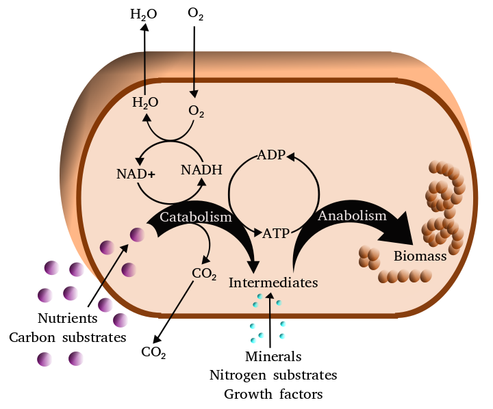
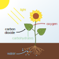
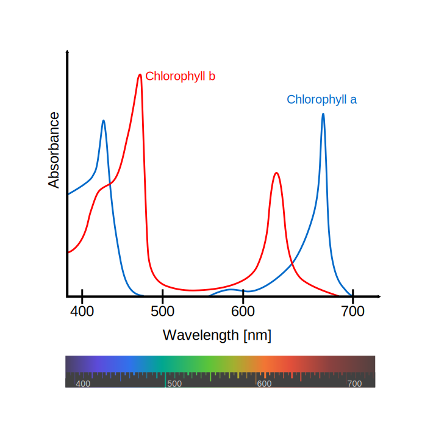
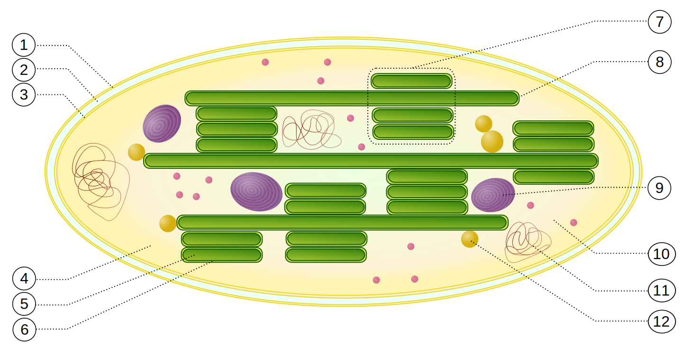

# Microbial Metabolism

Metabolism (from Greek: μεταβολή metabolē, "change") is the set of life-sustaining chemical reactions in organisms. The three main purposes of metabolism are: the conversion of food to energy to run cellular processes; the conversion of food/fuel to building blocks for proteins, lipids, nucleic acids, and some carbohydrates; and the elimination of nitrogenous wastes. These enzyme-catalyzed reactions allow organisms to grow and reproduce, maintain their structures, and respond to their environments. (The word metabolism can also refer to the sum of all chemical reactions that occur in living organisms, including digestion and the transport of substances into and between different cells, in which case the above described set of reactions within the cells is called intermediary metabolism or intermediate metabolism).

Metabolic reactions may be categorized as catabolic – the breaking down of compounds (for example, the breaking down of glucose to pyruvate by cellular respiration); or anabolic – the building up (synthesis) of compounds (such as proteins, carbohydrates, lipids, and nucleic acids). Usually, catabolism releases energy, and anabolism consumes energy.

(ref:simplmet) [Simplified view of the cellular metabolism](https://commons.wikimedia.org/wiki/File:Metabolism.png) 

```{r simpleviewmet, fig.cap='(ref:simplmet)', echo=FALSE, message=FALSE, warning=FALSE}

```

The chemical reactions of metabolism are organized into metabolic pathways, in which one chemical is transformed through a series of steps into another chemical, each step being facilitated by a specific enzyme. Enzymes are crucial to metabolism because they allow organisms to drive desirable reactions that require energy that will not occur by themselves, by coupling them to spontaneous reactions that release energy. Enzymes act as catalysts – they allow a reaction to proceed more rapidly – and they also allow the regulation of the rate of a metabolic reaction, for example in response to changes in the cell's environment or to signals from other cells.

The metabolic system of a particular organism determines which substances it will find nutritious and which poisonous. For example, some prokaryotes use hydrogen sulfide as a nutrient, yet this gas is poisonous to animals. The basal metabolic rate of an organism is the measure of the amount of energy consumed by all of these chemical reactions.

A striking feature of metabolism is the similarity of the basic metabolic pathways among vastly different species. For example, the set of carboxylic acids that are best known as the intermediates in the citric acid cycle are present in all known organisms, being found in species as diverse as the unicellular bacterium Escherichia coli and huge multicellular organisms like elephants. These similarities in metabolic pathways are likely due to their early appearance in evolutionary history, and their retention because of their efficacy. The metabolism of cancer cells is also different from the metabolism of normal cells and these differences can be used to find targets for therapeutic intervention in cancer.

Most of the structures that make up animals, plants and microbes are made from four basic classes of molecule: amino acids, carbohydrates , nucleic acid and lipids (often called fats). As these molecules are vital for life, metabolic reactions either focus on making these molecules during the construction of cells and tissues, or by breaking them down and using them as a source of energy, by their digestion. These biochemicals can be joined together to make polymers such as DNA and proteins, essential macromolecules of life.

```{r macromol, out.width='75%', echo=FALSE, message=FALSE, warning=FALSE}
library(tidyverse)
library(printr)        
library(kableExtra)
setwd("~/Dropbox/R/microbiology-text")

macro <-  as_tibble(read.csv("data/macromolecules.csv"))

knitr::kable(macro, col.names = c("Type of molecule", "Name of monomer forms", "Name of polymer forms", "Examples of polymer forms"), digits = 2, align = 'llll', booktabs = TRUE, caption = "The three essential polymeric macromolecules of life") %>% kable_styling(latex_options = c("striped", "hold_position")) 
```
The history of the scientific study of metabolism spans several centuries and has moved from examining whole animals in early studies, to examining individual metabolic reactions in modern biochemistry. The first controlled experiments in human metabolism were published by Santorio Santorio in 1614 in his book Ars de statica medicina. He described how he weighed himself before and after eating, sleep, working, sex, fasting, drinking, and excreting. He found that most of the food he took in was lost through what he called "insensible perspiration".

In these early studies, the mechanisms of these metabolic processes had not been identified and a vital force was thought to animate living tissue. In the 19th century, when studying the fermentation of sugar to alcohol by yeast, [Louis Pasteur](https://en.wikipedia.org/wiki/Louis_Pasteur) concluded that fermentation was catalyzed by substances within the yeast cells he called "ferments". He wrote that "alcoholic fermentation is an act correlated with the life and organization of the yeast cells, not with the death or putrefaction of the cells." This discovery, along with the publication by Friedrich Wöhler in 1828 of a paper on the chemical synthesis of urea, and is notable for being the first organic compound prepared from wholly inorganic precursors. This proved that the organic compounds and chemical reactions found in cells were no different in principle than any other part of chemistry.

It was the discovery of enzymes at the beginning of the 20th century by [Eduard Buchner](https://en.wikipedia.org/wiki/Eduard_Buchner) that separated the study of the chemical reactions of metabolism from the biological study of cells, and marked the beginnings of biochemistry. The mass of biochemical knowledge grew rapidly throughout the early 20th century. One of the most prolific of these modern biochemists was Hans Krebs who made huge contributions to the study of metabolism. He discovered the urea cycle and later, working with Hans Kornberg, the citric acid cycle and the glyoxylate cycle. Modern biochemical research has been greatly aided by the development of new techniques such as chromatography, X-ray diffraction, NMR spectroscopy, radioisotopic labelling, electron microscopy and molecular dynamics simulations. These techniques have allowed the discovery and detailed analysis of the many molecules and metabolic pathways in cells.

### Catabolism

Catabolism is the set of metabolic processes that break down large molecules. These include breaking down and oxidizing food molecules. The purpose of the catabolic reactions is to provide the energy and components needed by anabolic reactions which build molecules. The exact nature of these catabolic reactions differ from organism to organism, and organisms can be classified based on their sources of energy and carbon (their primary nutritional groups), as shown in the table below. Organic molecules are used as a source of energy by organotrophs, while lithotrophs use inorganic substrates, and phototrophs capture sunlight as chemical energy. However, all these different forms of metabolism depend on redox reactions that involve the transfer of electrons from reduced donor molecules such as organic molecules, water, ammonia, hydrogen sulfide or ferrous ions to acceptor molecules such as oxygen, nitrate or sulfate. In animals, these reactions involve complex organic molecules that are broken down to simpler molecules, such as carbon dioxide and water. In photosynthetic organisms, such as plants and cyanobacteria, these electron-transfer reactions do not release energy but are used as a way of storing energy absorbed from sunlight.

(ref:simplcat) [Simplified diagram of catabolism of proteins, carbohydrates and fats.](https://commons.wikimedia.org/wiki/File:Catabolism_schematic.svg) 

```{r simplecatdia, fig.cap='(ref:simplcat)', echo=FALSE, message=FALSE, warning=FALSE}

```

The most common set of catabolic reactions in animals can be separated into three main stages. In the first stage, large organic molecules, such as proteins, polysaccharides or lipids, are digested into their smaller components outside cells. Next, these smaller molecules are taken up by cells and converted to smaller molecules, usually acetyl coenzyme A (acetyl-CoA), which releases some energy. Finally, the acetyl group on the CoA is oxidised to water and carbon dioxide in the citric acid cycle and electron transport chain, releasing the energy that is stored by reducing the coenzyme nicotinamide adenine dinucleotide (NAD^+^) into NADH.

### Digestion

Macromolecules cannot be directly processed by cells. Macromolecules must be broken into smaller units before they can be used in cell metabolism. Different classes of enzymes were being used to digest these polymers. These digestive enzymes include proteases that digest proteins into amino acids, as well as glycoside hydrolases that digest polysaccharides into simple sugars known as monosaccharides

Microbes simply secrete digestive enzymes into their surroundings, while animals only secrete these enzymes from specialized cells in their guts, including the stomach and pancreas, and salivary glands. The amino acids or sugars released by these extracellular enzymes are then pumped into cells by active transport proteins.

### Energy From Organic Compounds

Carbohydrate catabolism is the breakdown of carbohydrates into smaller units. Carbohydrates are usually taken into cells once they have been digested into monosaccharides. Once inside, the major route of breakdown is glycolysis, where sugars such as glucose and fructose are converted into pyruvate and some ATP is generated. Pyruvate is an intermediate in several metabolic pathways, but the majority is converted to acetyl-CoA through aerobic (with oxygen) glycolysis and fed into the citric acid cycle. Although some more ATP is generated in the citric acid cycle, the most important product is NADH, which is made from NAD^+^ as the acetyl-CoA is oxidized. This oxidation releases carbon dioxide as a waste product. In anaerobic conditions, glycolysis produces lactate, through the enzyme lactate dehydrogenase re-oxidizing NADH to NAD^+^ for re-use in glycolysis. An alternative route for glucose breakdown is the pentose phosphate pathway, which reduces the coenzyme NADPH and produces pentose sugars such as ribose, the sugar component of nucleic acids.

Fats are catabolised by hydrolysis to free fatty acids and glycerol. The glycerol enters glycolysis and the fatty acids are broken down by beta oxidation to release acetyl-CoA, which then is fed into the citric acid cycle. Fatty acids release more energy upon oxidation than carbohydrates because carbohydrates contain more oxygen in their structures. Steroids are also broken down by some bacteria in a process similar to beta oxidation, and this breakdown process involves the release of significant amounts of acetyl-CoA, propionyl-CoA, and pyruvate, which can all be used by the cell for energy. M. tuberculosis can also grow on the lipid cholesterol as a sole source of carbon, and genes involved in the cholesterol use pathway(s) have been validated as important during various stages of the infection lifecycle of M. tuberculosis.

Amino acids are either used to synthesize proteins and other biomolecules, or oxidized to urea and carbon dioxide as a source of energy. The oxidation pathway starts with the removal of the amino group by a transaminase. The amino group is fed into the urea cycle, leaving a deaminated carbon skeleton in the form of a keto acid. Several of these keto acids are intermediates in the citric acid cycle, for example the deamination of glutamate forms α-ketoglutarate. The glucogenic amino acids can also be converted into glucose, through gluconeogenesis (discussed below).

## Energy Transformations

### Oxidative Phosphorylation

In oxidative phosphorylation, the electrons removed from organic molecules are transferred to oxygen and the energy released is used to make ATP. This is done in eukaryotes by a series of proteins in the membranes of mitochondria called the electron transport chain. In prokaryotes, these proteins are found in the cell's inner membrane. These proteins use the energy released from passing electrons from reduced molecules like NADH onto oxygen to pump protons across a membrane.

Pumping protons out of the mitochondria creates a proton concentration difference across the membrane and generates an electrochemical gradient. This force drives protons back into the mitochondrion through the base of an enzyme called ATP synthase. The flow of protons makes the stalk subunit rotate, causing the active site of the synthase domain to change shape and phosphorylate adenosine diphosphate – turning it into ATP.

### Energy From Inorganic Compounds

Chemolithotrophy is a type of metabolism found in prokaryotes where energy is obtained from the oxidation of inorganic compounds. These organisms can use hydrogen, reduced sulfur compounds (such as sulfide, hydrogen sulfide and thiosulfate), ferrous iron (FeII) or ammonia as sources of reducing power and they gain energy from the oxidation of these compounds with electron acceptors such as oxygen or nitrite. These microbial processes are important in global biogeochemical cycles such as acetogenesis, nitrification and denitrification and are critical for soil fertility.

### Energy From Light

The energy in sunlight is captured by plants, cyanobacteria, purple bacteria, green sulfur bacteria and some protists. This process is often coupled to the conversion of carbon dioxide into organic compounds, as part of photosynthesis, which is discussed below. The energy capture and carbon fixation systems can however operate separately in prokaryotes, as purple bacteria and green sulfur bacteria can use sunlight as a source of energy, while switching between carbon fixation and the fermentation of organic compounds.

In many organisms, the capture of solar energy is similar in principle to oxidative phosphorylation, as it involves the storage of energy as a proton concentration gradient. This proton motive force then drives ATP synthesis The electrons needed to drive this electron transport chain come from light-gathering proteins called photosynthetic reaction centres. Reaction centers are classed into two types depending on the nature of photosynthetic pigment present, with most photosynthetic bacteria only having one type, while plants and cyanobacteria have two.

In plants, algae, and cyanobacteria, photosystem II uses light energy to remove electrons from water, releasing oxygen as a waste product. The electrons then flow to the cytochrome b6f complex, which uses their energy to pump protons across the thylakoid membrane in the chloroplast. These protons move back through the membrane as they drive the ATP synthase, as before. The electrons then flow through photosystem I and can then either be used to reduce the coenzyme NADP^+^.fThese cooenzyme can be used in the Calvin cycle, which is discussed below, or recycled for further ATP generation.

### Anabolism

Anabolism is the set of constructive metabolic processes where the energy released by catabolism is used to synthesize complex molecules. In general, the complex molecules that make up cellular structures are constructed step-by-step from small and simple precursors. Anabolism involves three basic stages. First, the production of precursors such as amino acids, monosaccharides, isoprenoids and nucleotides, secondly, their activation into reactive forms using energy from ATP, and thirdly, the assembly of these precursors into complex molecules such as proteins, polysaccharides, lipids and nucleic acids.

Anabolism in organisms can be different according to the source of constructed molecules in their cells. Autotrophs such as plants can construct the complex organic molecules in cells such as polysaccharides and proteins from simple molecules like carbon dioxide and water. Heterotrophs, on the other hand, require a source of more complex substances, such as monosaccharides and amino acids, to produce these complex molecules. Organisms can be further classified by ultimate source of their energy: photoautotrophs and photoheterotrophs obtain energy from light, whereas chemoautotrophs and chemoheterotrophs obtain energy from inorganic oxidation reactions.

### Carbon Fixation

Photosynthesis is the synthesis of carbohydrates from sunlight and carbon dioxide (CO~2~). In plants, cyanobacteria and algae, oxygenic photosynthesis splits water, with oxygen produced as a waste product. This process uses the ATP and NADPH produced by the photosynthetic reaction centres, as described above, to convert CO~2~ into glycerate 3-phosphate, which can then be converted into glucose. This carbon-fixation reaction is carried out by the enzyme RuBisCO as part of the Calvin cycle. Three types of photosynthesis occur in plants, C3 carbon fixation, C4 carbon fixation and CAM photosynthesis. These differ by the route that carbon dioxide takes to the Calvin cycle, with C3 plants fixing CO~2~ directly, while C4 and CAM photosynthesis incorporate the CO~2~ into other compounds first, as adaptations to deal with intense sunlight and dry conditions.

In photosynthetic prokaryotes the mechanisms of carbon fixation are more diverse. Here, carbon dioxide can be fixed by the Calvin cycle, a reversed citric acid cycle, or the carboxylation of acetyl-CoA. Prokaryotic chemoautotrophs also fix CO~2~ through the Calvin cycle, but use energy from inorganic compounds to drive the reaction.

### Carbohydrates And Glycans

In carbohydrate anabolism, simple organic acids can be converted into monosaccharides such as glucose and then used to assemble polysaccharides such as starch. The generation of glucose from compounds like pyruvate, lactate, glycerol, glycerate 3-phosphate and amino acids is called gluconeogenesis. Gluconeogenesis converts pyruvate to glucose-6-phosphate through a series of intermediates, many of which are shared with glycolysis. However, this pathway is not simply glycolysis run in reverse, as several steps are catalyzed by non-glycolytic enzymes. This is important as it allows the formation and breakdown of glucose to be regulated separately, and prevents both pathways from running simultaneously in a futile cycle.

Although fat is a common way of storing energy, in vertebrates such as humans the fatty acids in these stores cannot be converted to glucose through gluconeogenesis as these organisms cannot convert acetyl-CoA into pyruvate; plants do, but animals do not, have the necessary enzymatic machinery. As a result, after long-term starvation, vertebrates need to produce ketone bodies from fatty acids to replace glucose in tissues such as the brain that cannot metabolize fatty acids. In other organisms such as plants and bacteria, this metabolic problem is solved using the glyoxylate cycle, which bypasses the decarboxylation step in the citric acid cycle and allows the transformation of acetyl-CoA to oxaloacetate, where it can be used for the production of glucose. Other than fat, glucose is stored in most tissues, as an energy resource available within the tissue through glycogenesis which was usually being used to maintained glucose level in blood.

Polysaccharides and glycans are made by the sequential addition of monosaccharides by glycosyltransferase from a reactive sugar-phosphate donor such as uridine diphosphate glucose (UDP-Glc) to an acceptor hydroxyl group on the growing polysaccharide. As any of the hydroxyl groups on the ring of the substrate can be acceptors, the polysaccharides produced can have straight or branched structures. The polysaccharides produced can have structural or metabolic functions themselves, or be transferred to lipids and proteins by enzymes called oligosaccharyltransferases.

### Fatty Acids, Isoprenoids and Sterol

Simplified version of the steroid synthesis pathway with the intermediates isopentenyl pyrophosphate (IPP), dimethylallyl pyrophosphate , geranyl pyrophosphate (GPP) and squalene shown. Some intermediates are omitted for clarity.
Fatty acids are made by fatty acid synthases that polymerize and then reduce acetyl-CoA units. The acyl chains in the fatty acids are extended by a cycle of reactions that add the acyl group, reduce it to an alcohol, dehydrate it to an alkene group and then reduce it again to an alkane group. The enzymes of fatty acid biosynthesis are divided into two groups: in animals and fungi, all these fatty acid synthase reactions are carried out by a single multifunctional type I protein, while in plant plastids and bacteria separate type II enzymes perform each step in the pathway.

Terpenes and isoprenoids are a large class of lipids that include the carotenoids and form the largest class of plant natural products. These compounds are made by the assembly and modification of isoprene units donated from the reactive precursors isopentenyl pyrophosphate and dimethylallyl pyrophosphate. These precursors can be made in different ways. In animals and archaea, the mevalonate pathway produces these compounds from acetyl-CoA, while in plants and bacteria the non-mevalonate pathway uses pyruvate and glyceraldehyde 3-phosphate as substrates. One important reaction that uses these activated isoprene donors is sterol biosynthesis. Here, the isoprene units are joined together to make squalene and then folded up and formed into a set of rings to make lanosterol. Lanosterol can then be converted into other sterol such as cholesterol and ergosterol.

### Proteins

Organisms vary in their ability to synthesize the 20 common amino acids. Most bacteria and plants can synthesize all twenty, but mammals can only synthesize eleven nonessential amino acids, so nine essential amino acids must be obtained from food. Some simple parasites, such as the bacteria Mycoplasma pneumoniae, lack all amino acid synthesis and take their amino acids directly from their hosts. All amino acids are synthesized from intermediates in glycolysis, the citric acid cycle, or the pentose phosphate pathway. Nitrogen is provided by glutamate and glutamine. Nonessensial amino acid synthesis depends on the formation of the appropriate alpha-keto acid, which is then transaminated to form an amino acid.

Amino acids are made into proteins by being joined together in a chain of peptide bonds. Each different protein has a unique sequence of amino acid residues: this is its primary structure. Just as the letters of the alphabet can be combined to form an almost endless variety of words, amino acids can be linked in varying sequences to form a huge variety of proteins. Proteins are made from amino acids that have been activated by attachment to a transfer RNA molecule through an ester bond. This aminoacyl-tRNA precursor is produced in an ATP-dependent reaction carried out by an aminoacyl tRNA synthetase. This aminoacyl-tRNA is then a substrate for the ribosome, which joins the amino acid onto the elongating protein chain, using the sequence information in a messenger RNA.

### Nucleotide Synthesis And Salvage

Nucleotides are made from amino acids, carbon dioxide and formic acid in pathways that require large amounts of metabolic energy. Consequently, most organisms have efficient systems to salvage preformed nucleotides. Purines are synthesized as nucleosides (bases attached to ribose). Both adenine and guanine are made from the precursor nucleoside inosine monophosphate, which is synthesized using atoms from the amino acids glycine, glutamine, and aspartic acid, as well as formate transferred from the coenzyme tetrahydrofolate. Pyrimidines, on the other hand, are synthesized from the base orotate, which is formed from glutamine and aspartate.


Microbial metabolism is the means by which a microbe obtains the energy and nutrients (e.g. carbon) it needs to live and reproduce. Microbes use many different types of metabolic strategies and species can often be differentiated from each other based on metabolic characteristics. The specific metabolic properties of a microbe are the major factors in determining that microbe's ecological niche, and often allow for that microbe to be useful in industrial processes or responsible for biogeochemical cycles.

All microbial metabolisms can be arranged according to three principles:

1. How the organism obtains carbon for synthesizing cell mass:[1]

* autotrophic – carbon is obtained from carbon dioxide (CO
* 2)
* heterotrophic – carbon is obtained from organic compounds
* mixotrophic – carbon is obtained from both organic compounds and by fixing carbon dioxide
2. How the organism obtains reducing equivalents (hydrogen atoms or electrons) used either in energy conservation or in biosynthetic reactions:

* lithotrophic – reducing equivalents are obtained from inorganic compounds
* organotrophic – reducing equivalents are obtained from organic compounds
3. How the organism obtains energy for living and growing:
* 
* phototrophic – energy is obtained from light[2]
* chemotrophic – energy is obtained from external chemical compounds[3]
In practice, these terms are almost freely combined. Typical examples are as follows:

* chemolithoautotrophs obtain energy from the oxidation of inorganic compounds and carbon from the fixation of carbon dioxide. Examples: Nitrifying bacteria, sulfur-oxidizing bacteria, iron-oxidizing bacteria, Knallgas-bacteria[4]
* photolithoautotrophs obtain energy from light and carbon from the fixation of carbon dioxide, using reducing equivalents from inorganic compounds. Examples: Cyanobacteria (water (H
* 2O) as reducing equivalent = hydrogen donor), Chlorobiaceae, Chromatiaceae (hydrogen sulfide (H
* 2S) as hydrogen donor), Chloroflexus (hydrogen (H
* 2) as reducing equivalent donor)
* chemolithoheterotrophs obtain energy from the oxidation of inorganic compounds, but cannot fix carbon dioxide (CO
* 2). Examples: some Thiobacilus, some Beggiatoa, some Nitrobacter spp., Wolinella (with H
* 2 as reducing equivalent donor), some Knallgas-bacteria, some sulfate-reducing bacteria[citation needed]
* chemoorganoheterotrophs obtain energy, carbon, and hydrogen for biosynthetic reactions from organic compounds. Examples: most bacteria, e. g. Escherichia coli, Bacillus spp., Actinobacteria
* photoorganoheterotrophs obtain energy from light, carbon and reducing equivalents for biosynthetic reactions from organic compounds. Some species are strictly heterotrophic, many others can also fix carbon dioxide and are mixotrophic. Examples: Rhodobacter, Rhodopseudomonas, Rhodospirillum, Rhodomicrobium, Rhodocyclus, Heliobacterium, Chloroflexus (alternatively to photolithoautotrophy with hydrogen)

## Heterotrophic microbial metabolism

Some microbes are heterotrophic (more precisely chemoorganoheterotrophic), using organic compounds as both carbon and energy sources. Heterotrophic microbes live off of nutrients that they scavenge from living hosts (as commensals or parasites) or find in dead organic matter of all kind (saprophages). Microbial metabolism is the main contribution for the bodily decay of all organisms after death. Many eukaryotic microorganisms are heterotrophic by predation or parasitism, properties also found in some bacteria such as Bdellovibrio (an intracellular parasite of other bacteria, causing death of its victims) and Myxobacteria such as Myxococcus (predators of other bacteria which are killed and lysed by cooperating swarms of many single cells of Myxobacteria). Most pathogenic bacteria can be viewed as heterotrophic parasites of humans or the other eukaryotic species they affect. Heterotrophic microbes are extremely abundant in nature and are responsible for the breakdown of large organic polymers such as cellulose, chitin or lignin which are generally indigestible to larger animals. Generally, the oxidative breakdown of large polymers to carbon dioxide (mineralization) requires several different organisms, with one breaking down the polymer into its constituent monomers, one able to use the monomers and excreting simpler waste compounds as by-products, and one able to use the excreted wastes. There are many variations on this theme, as different organisms are able to degrade different polymers and secrete different waste products. Some organisms are even able to degrade more recalcitrant compounds such as petroleum compounds or pesticides, making them useful in bioremediation.

Biochemically, prokaryotic heterotrophic metabolism is much more versatile than that of eukaryotic organisms, although many prokaryotes share the most basic metabolic models with eukaryotes, e. g. using glycolysis (also called EMP pathway) for sugar metabolism and the citric acid cycle to degrade acetate, producing energy in the form of ATP and reducing power in the form of NADH or quinols. These basic pathways are well conserved because they are also involved in biosynthesis of many conserved building blocks needed for cell growth (sometimes in reverse direction). However, many bacteria and archaea utilize alternative metabolic pathways other than glycolysis and the citric acid cycle. A well-studied example is sugar metabolism via the keto-deoxy-phosphogluconate pathway (also called ED pathway) in Pseudomonas. Moreover, there is a third alternative sugar-catabolic pathway used by some bacteria, the pentose phosphate pathway. The metabolic diversity and ability of prokaryotes to use a large variety of organic compounds arises from the much deeper evolutionary history and diversity of prokaryotes, as compared to eukaryotes. It is also noteworthy that the mitochondrion, the small membrane-bound intracellular organelle that is the site of eukaryotic oxygen-driven[3] energy metabolism, arose from the endosymbiosis of a bacterium related to obligate intracellular Rickettsia, and also to plant-associated Rhizobium or Agrobacterium. Therefore, it is not surprising that all mitrochondriate eukaryotes share metabolic properties with these Proteobacteria. Most microbes respire (use an electron transport chain), although oxygen is not the only terminal electron acceptor that may be used. As discussed below, the use of terminal electron acceptors other than oxygen has important biogeochemical consequences.

## Fermentation

Fermentation is a specific type of heterotrophic metabolism that uses organic carbon instead of oxygen as a terminal electron acceptor. This means that these organisms do not use an electron transport chain to oxidize NADH to NAD+
 and therefore must have an alternative method of using this reducing power and maintaining a supply of NAD+
 for the proper functioning of normal metabolic pathways (e.g. glycolysis). As oxygen is not required, fermentative organisms are anaerobic. Many organisms can use fermentation under anaerobic conditions and aerobic respiration when oxygen is present. These organisms are facultative anaerobes. To avoid the overproduction of NADH, obligately fermentative organisms usually do not have a complete citric acid cycle. Instead of using an ATP synthase as in respiration, ATP in fermentative organisms is produced by substrate-level phosphorylation where a phosphate group is transferred from a high-energy organic compound to ADP to form ATP. As a result of the need to produce high energy phosphate-containing organic compounds (generally in the form of Coenzyme A-esters) fermentative organisms use NADH and other cofactors to produce many different reduced metabolic by-products, often including hydrogen gas (H
2). These reduced organic compounds are generally small organic acids and alcohols derived from pyruvate, the end product of glycolysis. Examples include ethanol, acetate, lactate, and butyrate. Fermentative organisms are very important industrially and are used to make many different types of food products. The different metabolic end products produced by each specific bacterial species are responsible for the different tastes and properties of each food.

Not all fermentative organisms use substrate-level phosphorylation. Instead, some organisms are able to couple the oxidation of low-energy organic compounds directly to the formation of a proton (or sodium) motive force and therefore ATP synthesis. Examples of these unusual forms of fermentation include succinate fermentation by Propionigenium modestum and oxalate fermentation by Oxalobacter formigenes. These reactions are extremely low-energy yielding. Humans and other higher animals also use fermentation to produce lactate from excess NADH, although this is not the major form of metabolism as it is in fermentative microorganisms.

## Chemolithotrophy

Chemolithotrophy is a type of metabolism where energy is obtained from the oxidation of inorganic compounds. Most chemolithotrophic organisms are also autotrophic. There are two major objectives to chemolithotrophy: the generation of energy (ATP) and the generation of reducing power (NADH).

Hydrogen oxidation[edit]
Main article: Hydrogen oxidizing bacteria
Many organisms are capable of using hydrogen (H
2) as a source of energy. While several mechanisms of anaerobic hydrogen oxidation have been mentioned previously (e.g. sulfate reducing- and acetogenic bacteria), hydrogen can also be used to unlock the chemical energy of O2 [3] in the aerobic Knallgas reaction:[10]

2 H2 + O2 → 2 H2O + energy
In these organisms, hydrogen is oxidized by a membrane-bound hydrogenase causing proton pumping via electron transfer to various quinones and cytochromes. In many organisms, a second cytoplasmic hydrogenase is used to generate reducing power in the form of NADH, which is subsequently used to fix carbon dioxide via the Calvin cycle. Hydrogen-oxidizing organisms, such as Cupriavidus necator (formerly Ralstonia eutropha), often inhabit oxic-anoxic interfaces in nature to take advantage of the hydrogen produced by anaerobic fermentative organisms while still maintaining a supply of oxygen.[11]

Sulfur oxidation[edit]
Sulfur oxidation involves the oxidation of reduced sulfur compounds (such as sulfide H
2S), inorganic sulfur (S), and thiosulfate (S
2O2−
3) to form sulfuric acid (H
2SO
4). A classic example of a sulfur-oxidizing bacterium is Beggiatoa, a microbe originally described by Sergei Winogradsky, one of the founders of environmental microbiology. Another example is Paracoccus. Generally, the oxidation of sulfide occurs in stages, with inorganic sulfur being stored either inside or outside of the cell until needed. This two step process occurs because energetically sulfide is a better electron donor than inorganic sulfur or thiosulfate, allowing for a greater number of protons to be translocated across the membrane. Sulfur-oxidizing organisms generate reducing power for carbon dioxide fixation via the Calvin cycle using reverse electron flow, an energy-requiring process that pushes the electrons against their thermodynamic gradient to produce NADH. Biochemically, reduced sulfur compounds are converted to sulfite (SO2−
3) and subsequently converted to sulfate (SO2−
4) by the enzyme sulfite oxidase.[12] Some organisms, however, accomplish the same oxidation using a reversal of the APS reductase system used by sulfate-reducing bacteria (see above). In all cases the energy liberated is transferred to the electron transport chain for ATP and NADH production.[12] In addition to aerobic sulfur oxidation, some organisms (e.g. Thiobacillus denitrificans) use nitrate (NO−
3) as a terminal electron acceptor and therefore grow anaerobically.

Ferrous iron (Fe2+) oxidation

Ferrous iron is a soluble form of iron that is stable at extremely low pHs or under anaerobic conditions. Under aerobic, moderate pH conditions ferrous iron is oxidized spontaneously to the ferric (Fe3+
) form and is hydrolyzed abiotically to insoluble ferric hydroxide (Fe(OH)
3). There are three distinct types of ferrous iron-oxidizing microbes. The first are acidophiles, such as the bacteria Acidithiobacillus ferrooxidans and Leptospirillum ferrooxidans, as well as the archaeon Ferroplasma. These microbes oxidize iron in environments that have a very low pH and are important in acid mine drainage. The second type of microbes oxidize ferrous iron at near-neutral pH. These micro-organisms (for example Gallionella ferruginea, Leptothrix ochracea, or Mariprofundus ferrooxydans) live at the oxic-anoxic interfaces and are microaerophiles. The third type of iron-oxidizing microbes are anaerobic photosynthetic bacteria such as Rhodopseudomonas,[13] which use ferrous iron to produce NADH for autotrophic carbon dioxide fixation. Biochemically, aerobic iron oxidation is a very energetically poor process which therefore requires large amounts of iron to be oxidized by the enzyme rusticyanin to facilitate the formation of proton motive force. Like sulfur oxidation, reverse electron flow must be used to form the NADH used for carbon dioxide fixation via the Calvin cycle.

Nitrification[edit]
Nitrification is the process by which ammonia (NH
3) is converted to nitrate (NO−
3). Nitrification is actually the net result of two distinct processes: oxidation of ammonia to nitrite (NO−
2) by nitrosifying bacteria (e.g. Nitrosomonas) and oxidation of nitrite to nitrate by the nitrite-oxidizing bacteria (e.g. Nitrobacter). Both of these processes are extremely energetically poor leading to very slow growth rates for both types of organisms. Biochemically, ammonia oxidation occurs by the stepwise oxidation of ammonia to hydroxylamine (NH
2OH) by the enzyme ammonia monooxygenase in the cytoplasm, followed by the oxidation of hydroxylamine to nitrite by the enzyme hydroxylamine oxidoreductase in the periplasm.

Electron and proton cycling are very complex but as a net result only one proton is translocated across the membrane per molecule of ammonia oxidized. Nitrite oxidation is much simpler, with nitrite being oxidized by the enzyme nitrite oxidoreductase coupled to proton translocation by a very short electron transport chain, again leading to very low growth rates for these organisms. Oxygen is required in both ammonia and nitrite oxidation, meaning that both nitrosifying and nitrite-oxidizing bacteria are aerobes. As in sulfur and iron oxidation, NADH for carbon dioxide fixation using the Calvin cycle is generated by reverse electron flow, thereby placing a further metabolic burden on an already energy-poor process.

In 2015, two groups independently showed the microbial genus Nitrospira is capable of complete nitrification (Comammox).[14][15]

## Phototrophy

Many microbes (phototrophs) are capable of using light as a source of energy to produce ATP and organic compounds such as carbohydrates, lipids, and proteins. Of these, algae are particularly significant because they are oxygenic, using water as an electron donor for electron transfer during photosynthesis.[22] Phototrophic bacteria are found in the phyla Cyanobacteria, Chlorobi, Proteobacteria, Chloroflexi, and Firmicutes.[23] Along with plants these microbes are responsible for all biological generation of oxygen gas on Earth. Because chloroplasts were derived from a lineage of the Cyanobacteria, the general principles of metabolism in these endosymbionts can also be applied to chloroplasts.[24] In addition to oxygenic photosynthesis, many bacteria can also photosynthesize anaerobically, typically using sulfide (H
2S) as an electron donor to produce sulfate. Inorganic sulfur (S
0), thiosulfate (S
2O2−
3) and ferrous iron (Fe2+
) can also be used by some organisms. Phylogenetically, all oxygenic photosynthetic bacteria are Cyanobacteria, while anoxygenic photosynthetic bacteria belong to the purple bacteria (Proteobacteria), Green sulfur bacteria (e.g. Chlorobium), Green non-sulfur bacteria (e.g. Chloroflexus), or the heliobacteria (Low %G+C Gram positives). In addition to these organisms, some microbes (e.g. the Archaeon Halobacterium or the bacterium Roseobacter, among others) can utilize light to produce energy using the enzyme bacteriorhodopsin, a light-driven proton pump. However, there are no known Archaea that carry out photosynthesis.[23]

As befits the large diversity of photosynthetic bacteria, there are many different mechanisms by which light is converted into energy for metabolism. All photosynthetic organisms locate their photosynthetic reaction centers within a membrane, which may be invaginations of the cytoplasmic membrane (Proteobacteria), thylakoid membranes (Cyanobacteria), specialized antenna structures called chlorosomes (Green sulfur and non-sulfur bacteria), or the cytoplasmic membrane itself (heliobacteria). Different photosynthetic bacteria also contain different photosynthetic pigments, such as chlorophylls and carotenoids, allowing them to take advantage of different portions of the electromagnetic spectrum and thereby inhabit different niches. Some groups of organisms contain more specialized light-harvesting structures (e.g. phycobilisomes in Cyanobacteria and chlorosomes in Green sulfur and non-sulfur bacteria), allowing for increased efficiency in light utilization.

Biochemically, anoxygenic photosynthesis is very different from oxygenic photosynthesis. Cyanobacteria (and by extension, chloroplasts) use the Z scheme of electron flow in which electrons eventually are used to form NADH. Two different reaction centers (photosystems) are used and proton motive force is generated both by using cyclic electron flow and the quinone pool. In anoxygenic photosynthetic bacteria, electron flow is cyclic, with all electrons used in photosynthesis eventually being transferred back to the single reaction center. A proton motive force is generated using only the quinone pool. In heliobacteria, Green sulfur, and Green non-sulfur bacteria, NADH is formed using the protein ferredoxin, an energetically favorable reaction. In purple bacteria, NADH is formed by reverse electron flow due to the lower chemical potential of this reaction center. In all cases, however, a proton motive force is generated and used to drive ATP production via an ATPase.

Most photosynthetic microbes are autotrophic, fixing carbon dioxide via the Calvin cycle. Some photosynthetic bacteria (e.g. Chloroflexus) are photoheterotrophs, meaning that they use organic carbon compounds as a carbon source for growth. Some photosynthetic organisms also fix nitrogen (see below).

Nitrogen fixation

Nitrogen is an element required for growth by all biological systems. While extremely common (80% by volume) in the atmosphere, dinitrogen gas (N
2) is generally biologically inaccessible due to its high activation energy. Throughout all of nature, only specialized bacteria and Archaea are capable of nitrogen fixation, converting dinitrogen gas into ammonia (NH
3), which is easily assimilated by all organisms.[25] These prokaryotes, therefore, are very important ecologically and are often essential for the survival of entire ecosystems. This is especially true in the ocean, where nitrogen-fixing cyanobacteria are often the only sources of fixed nitrogen, and in soils, where specialized symbioses exist between legumes and their nitrogen-fixing partners to provide the nitrogen needed by these plants for growth.

Nitrogen fixation can be found distributed throughout nearly all bacterial lineages and physiological classes but is not a universal property. Because the enzyme nitrogenase, responsible for nitrogen fixation, is very sensitive to oxygen which will inhibit it irreversibly, all nitrogen-fixing organisms must possess some mechanism to keep the concentration of oxygen low. Examples include:

* heterocyst formation (cyanobacteria e.g. Anabaena) where one cell does not photosynthesize but instead fixes nitrogen for its neighbors which in turn provide it with energy
* root nodule symbioses (e.g. Rhizobium) with plants that supply oxygen to the bacteria bound to molecules of leghaemoglobin
* anaerobic lifestyle (e.g. Clostridium pasteurianum)
* very fast metabolism (e.g. Azotobacter vinelandii)
The production and activity of nitrogenases is very highly regulated, both because nitrogen fixation is an extremely energetically expensive process (16–24 ATP are used per N
2 fixed) and due to the extreme sensitivity of the nitrogenase to oxygen.

## Enzymes

Enzymes are proteins that act as biological catalysts (biocatalysts). Catalysts accelerate chemical reactions. A catalyst increases the rate of reaction without being consumed in the reaction. In addition, the catalyst lowers the activation energy, but it does not change the energies of the original reactants or products, and so does not change equilibrium. Rather, the reactant energy and the product energy remain the same and only the activation energy is altered (lowered). A catalyst is able to reduce the activation energy by forming a transition state in a more favorable manner. Catalysts, by nature, create a more "comfortable" fit for the substrate of a reaction to progress to a transition state. This is possible due to a release of energy that occurs when the substrate binds to the active site of a catalyst. This energy is known as Binding Energy. Upon binding to a catalyst, substrates partake in numerous stabilizing forces while within the active site (i.e. Hydrogen bonding, van der Waals forces). Specific and favorable bonding occurs within the active site until the substrate forms to become the high-energy transition state. Forming the transition state is more favorable with the catalyst because the favorable stabilizing interactions within the active site release energy. A chemical reaction is able to manufacture a high-energy transition state molecule more readily when there is a stabilizing fit within the active site of a catalyst. The binding energy of a reaction is this energy released when favorable interactions between substrate and catalyst occur. The binding energy released assists in achieving the unstable transition state. Reactions otherwise without catalysts need a higher input of energy to achieve the transition state. Non-catalyzed reactions do not have free energy available from active site stabilizing interactions, such as catalytic enzyme reactions.

Enzymes are known to catalyze more than 5,000 biochemical reaction types. Other biocatalysts are catalytic RNA molecules, called ribozymes. Enzymes' specificity comes from their unique three-dimensional structures.

The molecules upon which enzymes may act are called substrates, and the enzyme converts the substrates into different molecules known as products. Almost all metabolic processes in the cell need enzyme catalysis in order to occur at rates fast enough to sustain life. Metabolic pathways depend upon enzymes to catalyze individual steps.

Like all catalysts, enzymes increase the reaction rate by lowering its activation energy. Some enzymes can make their conversion of substrate to product occur many millions of times faster. An extreme example is orotidine 5'-phosphate decarboxylase, which allows a reaction that would otherwise take millions of years to occur in milliseconds. Chemically, enzymes are like any catalyst and are not consumed in chemical reactions, nor do they alter the equilibrium of a reaction. Enzymes differ from most other catalysts by being much more specific. Enzyme activity can be affected by other molecules: inhibitors are molecules that decrease enzyme activity, and activators are molecules that increase activity. Many therapeutic drugs and poisons are enzyme inhibitors. An enzyme's activity decreases markedly outside its optimal temperature and pH, and many enzymes are (permanently) denatured when exposed to excessive heat, losing their structure and catalytic properties.

(ref:activen) [Example of an enzyme-catalysed exothermic reaction](https://commons.wikimedia.org/wiki/File:Activation2_updated.svg) 

```{r activationenergy, fig.cap='(ref:activen)', echo=FALSE, message=FALSE, warning=FALSE}
knitr::include_graphics("./figures/nutrition/Activation2_updated.svg")
```

Some enzymes are used commercially, for example, in the synthesis of antibiotics. Some household products use enzymes to speed up chemical reactions: enzymes in biological washing powders break down protein, starch or fat stains on clothes, and enzymes in meat tenderizer break down proteins into smaller molecules, making the meat easier to chew.

By the late 17th and early 18th centuries, the digestion of meat by stomach secretions and the conversion of starch to sugars by plant extracts and saliva were known but the mechanisms by which these occurred had not been identified.

French chemist [Anselme Payen](https://en.wikipedia.org/wiki/Anselme_Payen) was the first to discover an enzyme, diastase, in 1833. A few decades later, when studying the fermentation of sugar to alcohol by yeast, Louis Pasteur concluded that this fermentation was caused by a vital force contained within the yeast cells called "ferments", which were thought to function only within living organisms. He wrote that "alcoholic fermentation is an act correlated with the life and organization of the yeast cells, not with the death or putrefaction of the cells."

Eduard Buchner submitted his first paper on the study of yeast extracts in 1897. In a series of experiments at the University of Berlin, he found that sugar was fermented by yeast extracts even when there were no living yeast cells in the mixture. He named the enzyme that brought about the fermentation of sucrose "zymase". In 1907, he received the Nobel Prize in Chemistry for "his discovery of cell-free fermentation". Following Buchner's example, enzymes are usually named according to the reaction they carry out: the suffix -ase is combined with the name of the substrate (e.g., lactase is the enzyme that cleaves lactose) or to the type of reaction (e.g., DNA polymerase forms DNA polymers).

The biochemical identity of enzymes was still unknown in the early 1900s. Many scientists observed that enzymatic activity was associated with proteins, but others (such as Nobel laureate [Richard Willstätter](https://en.wikipedia.org/wiki/Richard_Willstätter)) argued that proteins were merely carriers for the true enzymes and that proteins per se were incapable of catalysis. In 1926, [James B. Sumner](https://en.wikipedia.org/wiki/James_B._Sumner) showed that the enzyme urease was a pure protein and crystallized it; he did likewise for the enzyme catalase in 1937. The conclusion that pure proteins can be enzymes was definitively demonstrated by [John Howard Northrop](https://en.wikipedia.org/wiki/John_Howard_Northrop) and [Wendell Meredith Stanley](https://en.wikipedia.org/wiki/Wendell_Meredith_Stanley), who worked on the digestive enzymes pepsin (1930), trypsin and chymotrypsin. These three scientists were awarded the 1946 Nobel Prize in Chemistry.

The discovery that enzymes could be crystallized eventually allowed their structures to be solved by x-ray crystallography. This was first done for lysozyme, an enzyme found in tears, saliva and egg whites that digests the coating of some bacteria; the structure was solved by a group led by [David Chilton Phillips](https://en.wikipedia.org/wiki/David_Chilton_Phillips) and published in 1965. This high-resolution structure of lysozyme marked the beginning of the field of structural biology and the effort to understand how enzymes work at an atomic level of detail.

An enzyme's name is often derived from its substrate or the chemical reaction it catalyzes, with the word ending in -ase. Examples are lactase, alcohol dehydrogenase and DNA polymerase. Different enzymes that catalyze the same chemical reaction are called isozymes.

Enzymes are generally globular proteins, acting alone or in larger complexes. The sequence of the amino acids specifies the structure which in turn determines the catalytic activity of the enzyme. Although structure determines function, a novel enzymatic activity cannot yet be predicted from structure alone. Enzyme structures unfold (denature) when heated or exposed to chemical denaturants and this disruption to the structure typically causes a loss of activity. Enzyme denaturation is normally linked to temperatures above a species' normal level; as a result, enzymes from bacteria living in volcanic environments such as hot springs are prized by industrial users for their ability to function at high temperatures, allowing enzyme-catalysed reactions to be operated at a very high rate.

Enzymes are usually much larger than their substrates. Sizes range from just 62 amino acid residues, for the monomer of 4-oxalocrotonate tautomerase, to over 2,500 residues in the animal fatty acid synthase. Only a small portion of their structure (around 2–4 amino acids) is directly involved in catalysis: the catalytic site. This catalytic site is located next to one or more binding sites where residues orient the substrates. The catalytic site and binding site together compose the enzyme's active site. The remaining majority of the enzyme structure serves to maintain the precise orientation and dynamics of the active site.

In some enzymes, no amino acids are directly involved in catalysis; instead, the enzyme contains sites to bind and orient catalytic cofactors. Enzyme structures may also contain allosteric sites where the binding of a small molecule causes a conformational change that increases or decreases activity.

A small number of RNA-based biological catalysts called ribozymes exist, which again can act alone or in complex with proteins. The most common of these is the ribosome which is a complex of protein and catalytic RNA components.

Enzymes must bind their substrates before they can catalyse any chemical reaction. Enzymes are usually very specific as to what substrates they bind and then the chemical reaction catalysed. Specificity is achieved by binding pockets with complementary shape, charge and hydrophilic/hydrophobic characteristics to the substrates. Enzymes can therefore distinguish between very similar substrate molecules to be chemoselective, regioselective and stereospecific.

Some of the enzymes showing the highest specificity and accuracy are involved in the copying and expression of the genome. Some of these enzymes have "proof-reading" mechanisms. Here, an enzyme such as DNA polymerase catalyzes a reaction in a first step and then checks that the product is correct in a second step. This two-step process results in average error rates of less than 1 error in 100 million reactions in high-fidelity mammalian polymerases. Similar proofreading mechanisms are also found in RNA polymerase, aminoacyl tRNA synthetases and ribosomes.

Conversely, some enzymes display enzyme promiscuity, having broad specificity and acting on a range of different physiologically relevant substrates. Many enzymes possess small side activities which arose fortuitously (i.e. neutrally), which may be the starting point for the evolutionary selection of a new function.

To explain the observed specificity of enzymes, in 1894 [Emil Fischer](https://en.wikipedia.org/wiki/Emil_Fischer) proposed that both the enzyme and the substrate possess specific complementary geometric shapes that fit exactly into one another. This is often referred to as "the lock and key" model. This early model explains enzyme specificity, but fails to explain the stabilization of the transition state that enzymes achieve.

In 1958, [Daniel Koshland](https://en.wikipedia.org/wiki/Daniel_E._Koshland_Jr.) suggested a modification to the lock and key model: since enzymes are rather flexible structures, the active site is continuously reshaped by interactions with the substrate as the substrate interacts with the enzyme. As a result, the substrate does not simply bind to a rigid active site; the amino acid side-chains that make up the active site are molded into the precise positions that enable the enzyme to perform its catalytic function. In some cases, such as glycosidases, the substrate molecule also changes shape slightly as it enters the active site. The active site continues to change until the substrate is completely bound, at which point the final shape and charge distribution is determined. Induced fit may enhance the fidelity of molecular recognition in the presence of competition and noise via the conformational proofreading mechanism.

Enzymes can accelerate reactions in several ways, all of which lower the activation energy (ΔG, Gibbs free energy)

* By stabilizing the transition state:
* Creating an environment with a charge distribution complementary to that of the transition state to lower its energy
* By providing an alternative reaction pathway:
* Temporarily reacting with the substrate, forming a covalent intermediate to provide a lower energy transition state
* By destabilising the substrate ground state:
* Distorting bound substrate(s) into their transition state form to reduce the energy required to reach the transition state
* By orienting the substrates into a productive arrangement to reduce the reaction entropy change (the contribution of this mechanism to catalysis is relatively small)

Enzymes may use several of these mechanisms simultaneously. For example, proteases such as trypsin perform covalent catalysis using a catalytic triad, stabilise charge build-up on the transition states using an oxyanion hole, complete hydrolysis using an oriented water substrate.

Enzymes are not rigid, static structures; instead they have complex internal dynamic motions – that is, movements of parts of the enzyme's structure such as individual amino acid residues, groups of residues forming a protein loop or unit of secondary structure, or even an entire protein domain. These motions give rise to a conformational ensemble of slightly different structures that interconvert with one another at equilibrium. Different states within this ensemble may be associated with different aspects of an enzyme's function. For example, different conformations of the enzyme dihydrofolate reductase are associated with the substrate binding, catalysis, cofactor release, and product release steps of the catalytic cycle, consistent with catalytic resonance theory.

Substrate presentation is a process where the enzyme is sequestered away from its substrate. Enzymes can be sequestered to the plasma membrane away from a substrate in the nucleus or cytosol. Or within the membrane, an enzyme can be sequestered into lipid rafts away from its substrate in the disordered region. When the enzyme is releases it mixes with its substrate. Alternatively, the enzyme can be sequestered near its substrate to activate the enzyme. For example, the enzyme can be soluble and upon activation bind to a lipid in the plasma membrane and then act upon molecules in the plasma membrane.

### Allosteric Modulation

Allosteric sites are pockets on the enzyme, distinct from the active site, that bind to molecules in the cellular environment. These molecules then cause a change in the conformation or dynamics of the enzyme that is transduced to the active site and thus affects the reaction rate of the enzyme. In this way, allosteric interactions can either inhibit or activate enzymes. Allosteric interactions with metabolites upstream or downstream in an enzyme's metabolic pathway cause feedback regulation, altering the activity of the enzyme according to the flux through the rest of the pathway.

### Cofactors of Enzymes and Coenzymes

Some enzymes do not need additional components to show full activity. Others require non-protein molecules called cofactors to be bound for activity. Cofactors can be either inorganic (e.g., metal ions and iron-sulfur clusters) or organic compounds (e.g., flavin and heme). These cofactors serve many purposes; for instance, metal ions can help in stabilizing nucleophilic species within the active site. Organic cofactors can be either coenzymes, which are released from the enzyme's active site during the reaction, or prosthetic groups, which are tightly bound to an enzyme. Organic prosthetic groups can be covalently bound (e.g., biotin in enzymes such as pyruvate carboxylase).

An example of an enzyme that contains a cofactor is carbonic anhydrase, which uses a zinc cofactor bound as part of its active site. These tightly bound ions or molecules are usually found in the active site and are involved in catalysis. For example, flavin and heme cofactors are often involved in redox reactions.

Enzymes that require a cofactor but do not have one bound are called apoenzymes or apoproteins. An enzyme together with the cofactor(s) required for activity is called a holoenzyme (or haloenzyme). The term holoenzyme can also be applied to enzymes that contain multiple protein subunits, such as the DNA polymerases; here the holoenzyme is the complete complex containing all the subunits needed for activity.

Coenzymes are small organic molecules that can be loosely or tightly bound to an enzyme. Coenzymes transport chemical groups from one enzyme to another. Examples include NADH, NADPH and adenosine triphosphate (ATP). Some coenzymes, such as flavin mononucleotide (FMN), flavin adenine dinucleotide (FAD), thiamine pyrophosphate (TPP), and tetrahydrofolate (THF), are derived from vitamins. These coenzymes cannot be synthesized by the body de novo and closely related compounds (vitamins) must be acquired from the diet. The chemical groups carried include:

* the hydride ion (H^-^), carried by NAD or NADP^+^
* the phosphate group, carried by adenosine triphosphate
* the acetyl group, carried by coenzyme A
* formyl, methenyl or methyl groups, carried by folic acid and
* the methyl group, carried by S-adenosylmethionine

Since coenzymes are chemically changed as a consequence of enzyme action, it is useful to consider coenzymes to be a special class of substrates, or second substrates, which are common to many different enzymes. For example, about 1000 enzymes are known to use the coenzyme NADH.

Coenzymes are usually continuously regenerated and their concentrations maintained at a steady level inside the cell. For example, NADPH is regenerated through the pentose phosphate pathway and S-adenosylmethionine by methionine adenosyltransferase. This continuous regeneration means that small amounts of coenzymes can be used very intensively. For example, the human body turns over its own weight in ATP each day.

### Inhibition of Enzymes

An enzyme binding site that would normally bind substrate can alternatively bind a competitive inhibitor, preventing substrate access. Dihydrofolate reductase is inhibited by methotrexate which prevents binding of its substrate, folic acid. Binding site in blue, inhibitor in green, and substrate in black. (PDB: 4QI9​)
Two dimensional representations of the chemical structure of folic acid and methotrexate highlighting the differences between these two substances (amidation of pyrimidone and methylation of secondary amine).
The coenzyme folic acid (left) and the anti-cancer drug methotrexate (right) are very similar in structure (differences show in green). As a result, methotrexate is a competitive inhibitor of many enzymes that use folates.
Main article: Enzyme inhibitor
Enzyme reaction rates can be decreased by various types of enzyme inhibitors.

A competitive inhibitor and substrate cannot bind to the enzyme at the same time. Often competitive inhibitors strongly resemble the real substrate of the enzyme. For example, the drug methotrexate is a competitive inhibitor of the enzyme dihydrofolate reductase, which catalyzes the reduction of dihydrofolate to tetrahydrofolate. The similarity between the structures of dihydrofolate and this drug are shown in the accompanying figure. This type of inhibition can be overcome with high substrate concentration. In some cases, the inhibitor can bind to a site other than the binding-site of the usual substrate and exert an allosteric effect to change the shape of the usual binding-site.

A non-competitive inhibitor binds to a site other than where the substrate binds. The substrate still binds with its usual affinity and hence Km remains the same. However the inhibitor reduces the catalytic efficiency of the enzyme so that Vmax is reduced. In contrast to competitive inhibition, non-competitive inhibition cannot be overcome with high substrate concentration.

An uncompetitive inhibitor cannot bind to the free enzyme, only to the enzyme-substrate complex; hence, these types of inhibitors are most effective at high substrate concentration. In the presence of the inhibitor, the enzyme-substrate complex is inactive. This type of inhibition is rare.

A mixed inhibitor binds to an allosteric site and the binding of the substrate and the inhibitor affect each other. The enzyme's function is reduced but not eliminated when bound to the inhibitor. This type of inhibitor does not follow the Michaelis–Menten equation.

An irreversible inhibitor permanently inactivates the enzyme, usually by forming a covalent bond to the protein. Penicillin and aspirin are common drugs that act in this manner.

In many organisms, inhibitors may act as part of a feedback mechanism. If an enzyme produces too much of one substance in the organism, that substance may act as an inhibitor for the enzyme at the beginning of the pathway that produces it, causing production of the substance to slow down or stop when there is sufficient amount. This is a form of negative feedback. Major metabolic pathways such as the citric acid cycle make use of this mechanism.

Since inhibitors modulate the function of enzymes they are often used as drugs. Many such drugs are reversible competitive inhibitors that resemble the enzyme's native substrate, similar to methotrexate above; other well-known examples include statins used to treat high cholesterol, and protease inhibitors used to treat retroviral infections such as HIV. A common example of an irreversible inhibitor that is used as a drug is aspirin, which inhibits the COX-1 and COX-2 enzymes that produce the inflammation messenger prostaglandin. Other enzyme inhibitors are poisons. For example, the poison cyanide is an irreversible enzyme inhibitor that combines with the copper and iron in the active site of the enzyme cytochrome c oxidase and blocks cellular respiration.

### Factors Affecting Enzyme Activity

As enzymes are made up of proteins, their actions are sensitive to change in many physio chemical factors such as pH, temperature, substrate concentration, etc.

Enzymes serve a wide variety of functions inside living organisms. They are indispensable for signal transduction and cell regulation, often via kinases and phosphatases. They also generate movement, with myosin hydrolyzing ATP to generate muscle contraction, and also transport cargo around the cell as part of the cytoskeleton. Other ATPases in the cell membrane are ion pumps involved in active transport. Enzymes are also involved in more exotic functions, such as luciferase generating light in fireflies. Viruses can also contain enzymes for infecting cells, such as the HIV integrase and reverse transcriptase, or for viral release from cells, like the influenza virus neuraminidase.

An important function of enzymes is in the digestive systems of animals. Enzymes such as amylases and proteases break down large molecules (starch or proteins, respectively) into smaller ones, so they can be absorbed by the intestines. Starch molecules, for example, are too large to be absorbed from the intestine, but enzymes hydrolyze the starch chains into smaller molecules such as maltose and eventually glucose, which can then be absorbed. Different enzymes digest different food substances. In ruminants, which have herbivorous diets, microorganisms in the gut produce another enzyme, cellulase, to break down the cellulose cell walls of plant fiber.

Several enzymes can work together in a specific order, creating metabolic pathways. In a metabolic pathway, one enzyme takes the product of another enzyme as a substrate. After the catalytic reaction, the product is then passed on to another enzyme. Sometimes more than one enzyme can catalyze the same reaction in parallel; this can allow more complex regulation with, for example, a low constant activity provided by one enzyme but an inducible high activity from a second enzyme.

Enzymes determine what steps occur in these pathways. Without enzymes, metabolism would neither progress through the same steps and could not be regulated to serve the needs of the cell. Most central metabolic pathways are regulated at a few key steps, typically through enzymes whose activity involves the hydrolysis of ATP. Because this reaction releases so much energy, other reactions that are thermodynamically unfavorable can be coupled to ATP hydrolysis, driving the overall series of linked metabolic reactions.

### Control of activity

There are five main ways that enzyme activity is controlled in the cell.

Enzymes can be either activated or inhibited by other molecules. For example, the end product(s) of a metabolic pathway are often inhibitors for one of the first enzymes of the pathway (usually the first irreversible step, called committed step), thus regulating the amount of end product made by the pathways. Such a regulatory mechanism is called a negative feedback mechanism, because the amount of the end product produced is regulated by its own concentration. Negative feedback mechanism can effectively adjust the rate of synthesis of intermediate metabolites according to the demands of the cells. This helps with effective allocations of materials and energy economy, and it prevents the excess manufacture of end products. Like other homeostatic devices, the control of enzymatic action helps to maintain a stable internal environment in living organisms.

### Post-translational Modification

Examples of post-translational modification include phosphorylation, myristoylation and glycosylation. For example, in the response to insulin, the phosphorylation of multiple enzymes, including glycogen synthase, helps control the synthesis or degradation of glycogen and allows the cell to respond to changes in blood sugar. Another example of post-translational modification is the cleavage of the polypeptide chain. Chymotrypsin, a digestive protease, is produced in inactive form as chymotrypsinogen in the pancreas and transported in this form to the stomach where it is activated. This stops the enzyme from digesting the pancreas or other tissues before it enters the gut. This type of inactive precursor to an enzyme is known as a zymogen or proenzyme.

### Quantity

Enzyme production (transcription and translation of enzyme genes) can be enhanced or diminished by a cell in response to changes in the cell's environment. This form of gene regulation is called enzyme induction. For example, bacteria may become resistant to antibiotics such as penicillin because enzymes called beta-lactamases are induced that hydrolyse the crucial beta-lactam ring within the penicillin molecule. Another example comes from enzymes in the liver called cytochrome P450 oxidases, which are important in drug metabolism. Induction or inhibition of these enzymes can cause drug interactions. Enzyme levels can also be regulated by changing the rate of enzyme degradation. The opposite of enzyme induction is enzyme repression.

### Subcellular Distribution

Enzymes can be compartmentalized, with different metabolic pathways occurring in different cellular compartments. For example, fatty acids are synthesized by one set of enzymes in the cytosol, endoplasmic reticulum and Golgi and used by a different set of enzymes as a source of energy in the mitochondrion, through β-oxidation. In addition, trafficking of the enzyme to different compartments may change the degree of protonation (e.g., the neutral cytoplasm and the acidic lysosome) or oxidative state (e.g., oxidizing periplasm or reducing cytoplasm) which in turn affects enzyme activity. In contrast to partitioning into membrane bound organelles, enzyme subcellular localisation may also be altered through polymerisation of enzymes into macromolecular cytoplasmic filaments.

### Organ Specialization

In multicellular eukaryotes, cells in different organs and tissues have different patterns of gene expression and therefore have different sets of enzymes (known as isozymes) available for metabolic reactions. This provides a mechanism for regulating the overall metabolism of the organism. For example, hexokinase, the first enzyme in the glycolysis pathway, has a specialized form called glucokinase expressed in the liver and pancreas that has a lower affinity for glucose yet is more sensitive to glucose concentration. This enzyme is involved in sensing blood sugar and regulating insulin production.

### Coenzymes

Metabolism involves a vast array of chemical reactions, but most fall under a few basic types of reactions that involve the transfer of functional groups of atoms and their bonds within molecules. This common chemistry allows cells to use a small set of metabolic intermediates to carry chemical groups between different reactions. These group-transfer intermediates are called coenzymes. Each class of group-transfer reactions is carried out by a particular coenzyme, which is the substrate for a set of enzymes that produce it, and a set of enzymes that consume it. These coenzymes are therefore continuously made, consumed and then recycled.

One central coenzyme is adenosine triphosphate (ATP), the universal energy currency of cells. This nucleotide is used to transfer chemical energy between different chemical reactions. There is only a small amount of ATP in cells, but as it is continuously regenerated, the human body can use about its own weight in ATP per day. ATP acts as a bridge between catabolism and anabolism. Catabolism breaks down molecules, and anabolism puts them together. Catabolic reactions generate ATP, and anabolic reactions consume it. It also serves as a carrier of phosphate groups in phosphorylation reactions.

A vitamin is an organic compound needed in small quantities that cannot be made in cells. In human nutrition, most vitamins function as coenzymes after modification; for example, all water-soluble vitamins are phosphorylated or are coupled to nucleotides when they are used in cells. Nicotinamide adenine dinucleotide (NAD^+^), a derivative of vitamin B3 (niacin), is an important coenzyme that acts as a hydrogen acceptor. Hundreds of separate types of dehydrogenases remove electrons from their substrates and reduce NAD^+^ into NADH. This reduced form of the coenzyme is then a substrate for any of the reductases in the cell that need to reduce their substrates. Nicotinamide adenine dinucleotide exists in two related forms in the cell, NADH and NADPH. The NAD^+^/NADH form is more important in catabolic reactions, while NADP^+^/NADPH is used in anabolic reactions.

### Mineral Cofactors

Inorganic elements play critical roles in metabolism; some are abundant (e.g. sodium and potassium) while others function at minute concentrations. About 99% of a human's body weight is made up of the elements carbon, nitrogen, calcium, sodium, chlorine, potassium, hydrogen, phosphorus, oxygen and sulfur. Organic compounds (proteins, lipids and carbohydrates) contain the majority of the carbon and nitrogen; most of the oxygen and hydrogen is present as water.

The abundant inorganic elements act as electrolytes. The most important ions are sodium, potassium, calcium, magnesium, chloride, phosphate and the organic ion bicarbonate. The maintenance of precise ion gradients across cell membranes maintains osmotic pressure and pH. Ions are also critical for nerve and muscle function, as action potentials in these tissues are produced by the exchange of electrolytes between the extracellular fluid and the cell's fluid, the cytosol. Electrolytes enter and leave cells through proteins in the cell membrane called ion channels. For example, muscle contraction depends upon the movement of calcium, sodium and potassium through ion channels in the cell membrane and T-tubules.

Transition metals are usually present as trace elements in organisms, with zinc and iron being most abundant of those. These metals are used in some proteins as cofactors and are essential for the activity of enzymes such as catalase and oxygen-carrier proteins such as hemoglobin Metal cofactors are bound tightly to specific sites in proteins; although enzyme cofactors can be modified during catalysis, they always return to their original state by the end of the reaction catalyzed. Metal micronutrients are taken up into organisms by specific transporters and bind to storage proteins such as ferritin or metallothionein when not in use.

## Photosynthesis And Cellular Respiration

Some microroganisms acquire energy from sunlight through photosynthesis, others get their energy by breaking down chemical bonds in nutrients during cellular respiration. In eukaryiotic cells, photosynthesis happens in chloroplasts, cellular respiration in mitochondria. In both photosynthesis and cellular respiration, ATP production involves an electron transfer chain and chemiosmosis. 

(ref:photosynthesis) [Schematic of photosynthesis in plants. The carbohydrates produced are stored in or used by the plant which in turn may provide food for heterotrophic organims such as animals.](https://commons.wikimedia.org/wiki/File:Photosynthesis_en.svg) 

```{r photosynthesispic, fig.cap='(ref:photosynthesis)', echo=FALSE, message=FALSE, warning=FALSE}

```

## The Electron Transport Chain And Chemiosmosis

The electron transport chain (ETC) is a series of complexes that transfer electrons from electron donors to electron acceptors via redox (both reduction and oxidation occurring simultaneously) reactions, and couples this electron transfer with the transfer of protons (H^+^ ions) across a membrane. The electron transport chain is built up of peptides, enzymes, and other molecules.

The flow of electrons through the electron transport chain is an exergonic process. The energy from the redox reactions create an electrochemical proton gradient that drives the synthesis of adenosine triphosphate (ATP). In aerobic respiration, the flow of electrons terminates with molecular oxygen being the final electron acceptor. In anaerobic respiration, other organic or inorganic electron acceptors are used, such as lactic acid and sulfate, for example.

In the electron transport chain, the redox reactions are driven by the Gibbs free energy state of the components. Gibbs free energy is related to a quantity called the redox potential. The complexes in the electron transport chain harvest the energy of the redox reactions that occur when transferring electrons from a low redox potential to a higher redox potential, creating an electrochemical gradient. It is the electrochemical gradient created that drives the synthesis of ATP via coupling with oxidative phosphorylation with ATP synthase.

The electron transport chain, and site of oxidative phosphorylation is found on the inner mitochondrial membrane. The energy stored from the process of respiration in reduced compounds (such as NADH and FADH) is used by the electron transport chain to pump protons into the inter membrane space, generating the electrochemical gradient over the inner mitochrondrial membrane.

(ref:electrontrans) [The electron transport chain](https://commons.wikimedia.org/wiki/File:Mitochondrial_electron_transport_chain—Etc4.svg) in the mitochondrion is the site of oxidative phosphorylation in eukaryotes. The NADH and succinate generated in the citric acid cycle are oxidized, providing energy to power ATP synthase.

```{r electrontransfer, fig.cap='(ref:electrontrans)', echo=FALSE, message=FALSE, warning=FALSE}
knitr::include_graphics("./figures/metabolism/Mitochondrial_electron_transport_chain—Etc4.svg")
```

In photosynthetic eukaryotes, the electron transport chain is found on the thylakoid membrane. Here, light energy drives the reduction of components of the electron transport chain and therefore causes subsequent synthesis of ATP. The electron transport chain, and site of oxidative phosphorylation is found on the inner mitochondrial membrane. The energy stored from the process of respiration in reduced compounds (such as NADH and FADH) is used by the electron transport chain to pump protons into the inter membrane space, generating the electrochemical gradient over the inner mitochrondrial membrane. 

Hydrogen ions, or protons, will diffuse from an area of high proton concentration to an area of lower proton concentration, and an electrochemical concentration gradient of protons across a membrane can be harnessed to make ATP. This process is related to osmosis, the diffusion of water across a membrane, which is why it is called "chemiosmosis".

The formation of adenosine triphosphate (ATP) by the movement of hydrogen ions (H^+^) across a membrane during cellular respiration or photosynthesis is an example of chemiosmosis. ATP synthase is the enzyme that makes ATP by chemiosmosis. It allows protons to pass through the membrane and uses the free energy difference to phosphorylate adenosine diphosphate (ADP), making ATP. The generation of ATP by chemiosmosis occurs in mitochondria and chloroplasts, as well as in most bacteria and archaea, an electron transport chain pumps H^+^ ions in the thylakoid spaces through thylakoid membranes to stroma (fluid). The energy from the electron movement through electron transport chains cross through ATP synthase which allows the proton to pass through them and use this free energy difference to photophosphorylate ADP making ATP.

## Photosynthesis 

Photosynthesis is a process used by plants and other organisms to convert light energy into chemical energy that can later be released to fuel the organisms' activities. This chemical energy is stored in carbohydrate molecules, such as sugars, which are synthesized from carbon dioxide and water – hence the name photosynthesis, from the Greek phōs (φῶς), "light", and sunthesis (σύνθεσις), "putting together". In most cases, oxygen is also released as a waste product. Most plants, most algae, and cyanobacteria perform photosynthesis; such organisms are called photoautotrophs. Photosynthesis is largely responsible for producing and maintaining the oxygen content of the Earth's atmosphere, and supplies most of the energy necessary for life on Earth.

(ref:simplephoto) [Photosynthesis changes sunlight into chemical energy, splits water to liberate O2, and fixes CO~2~ into sugar.](https://commons.wikimedia.org/wiki/File:Simple_photosynthesis_overview.svg) 

```{r simplephotooverview , fig.cap='(ref:simplephoto)', echo=FALSE, message=FALSE, warning=FALSE}
knitr::include_graphics("./figures/metabolism/Simple_photosynthesis_overview.svg")
```

Although photosynthesis is performed differently by different species, the process always begins when energy from light is absorbed by proteins called reaction centres that contain green chlorophyll pigments. In plants, these proteins are held inside organelles called chloroplasts, which are most abundant in leaf cells, while in bacteria they are embedded in the plasma membrane. In these light-dependent reactions, some energy is used to strip electrons from suitable substances, such as water, producing oxygen gas. The hydrogen freed by the splitting of water is used in the creation of two further compounds that serve as short-term stores of energy, enabling its transfer to drive other reactions: these compounds are reduced nicotinamide adenine dinucleotide phosphate (NADPH) and adenosine triphosphate (ATP), the "energy currency" of cells.

(ref:chlorophyl) [Absorbance spectra of free chlorophyll](https://commons.wikimedia.org/wiki/File:Chlorophyll_ab_spectra-en.svg) a (blue) and b (red) in a solvent. The action spectra of chlorophyll molecules are slightly modified in vivo depending on specific pigment–protein interactions.

```{r chlorophylspectra, fig.cap='(ref:chlorophyl)', echo=FALSE, message=FALSE, warning=FALSE}

```

In plants, algae and cyanobacteria, long-term energy storage in the form of sugars is produced by a subsequent sequence of light-independent reactions called the Calvin cycle; some bacteria use different mechanisms, such as the reverse Krebs cycle, to achieve the same end. In the Calvin cycle, atmospheric carbon dioxide is incorporated into already existing organic carbon compounds, such as ribulose bisphosphate (RuBP). Using the ATP and NADPH produced by the light-dependent reactions, the resulting compounds are then reduced and removed to form further carbohydrates, such as glucose.

The first photosynthetic organisms probably evolved early in the evolutionary history of life and most likely used reducing agents such as hydrogen or hydrogen sulfide, rather than water, as sources of electrons. Cyanobacteria appeared later; the excess oxygen they produced contributed directly to the oxygenation of the Earth, which rendered the evolution of complex life possible. Today, the average rate of energy capture by photosynthesis globally is approximately 130 terawatts, which is about eight times the current power consumption of human civilization. Photosynthetic organisms also convert around 100–115 billion tons (91-104 petagrams) of carbon into biomass per year.

Photosynthetic organisms are photoautotrophs, which means that they are able to synthesize food directly from carbon dioxide and water using energy from light. However, not all organisms use carbon dioxide as a source of carbon atoms to carry out photosynthesis; photoheterotrophs use organic compounds, rather than carbon dioxide, as a source of carbon. In plants, algae, and cyanobacteria, photosynthesis releases oxygen. This is called oxygenic photosynthesis and is by far the most common type of photosynthesis used by living organisms. Although there are some differences between oxygenic photosynthesis in plants, algae, and cyanobacteria, the overall process is quite similar in these organisms. There are also many varieties of anoxygenic photosynthesis, used mostly by certain types of bacteria, which consume carbon dioxide but do not release oxygen.

Carbon dioxide is converted into sugars in a process called carbon fixation; photosynthesis captures energy from sunlight to convert carbon dioxide into carbohydrate. Carbon fixation is an endothermic redox reaction. In general outline, photosynthesis is the opposite of cellular respiration: while photosynthesis is a process of reduction of carbon dioxide to carbohydrate, cellular respiration is the oxidation of carbohydrate or other nutrients to carbon dioxide. Nutrients used in cellular respiration include carbohydrates, amino acids and fatty acids. These nutrients are oxidized to produce carbon dioxide and water, and to release chemical energy to drive the organism's metabolism. Photosynthesis and cellular respiration are distinct processes, as they take place through different sequences of chemical reactions and in different cellular compartments.

Photosynthesis occurs in two stages. In the first stage, light-dependent reactions or light reactions capture the energy of light and use it to make the energy-storage molecules ATP and NADPH. During the second stage, the light-independent reactions use these products to capture and reduce carbon dioxide.

Most organisms that utilize oxygenic photosynthesis use visible light for the light-dependent reactions, although at least three use shortwave infrared or, more specifically, far-red radiation.

Some organisms employ even more radical variants of photosynthesis. Some archaea use a simpler method that employs a pigment similar to those used for vision in animals. The bacteriorhodopsin changes its configuration in response to sunlight, acting as a proton pump. This produces a proton gradient more directly, which is then converted to chemical energy. The process does not involve carbon dioxide fixation and does not release oxygen, and seems to have evolved separately from the more common types of photosynthesis.

### Photosynthetic Membranes And Organelles

In photosynthetic bacteria, the proteins that gather light for photosynthesis are embedded in cell membranes. In its simplest form, this involves the membrane surrounding the cell itself. However, the membrane may be tightly folded into cylindrical sheets called thylakoids, or bunched up into round vesicles called intracytoplasmic membranes. These structures can fill most of the interior of a cell, giving the membrane a very large surface area and therefore increasing the amount of light that the bacteria can absorb.

In plants and algae, photosynthesis takes place in organelles called chloroplasts. A typical plant cell contains about 10 to 100 chloroplasts. The chloroplast is enclosed by a membrane. This membrane is composed of a phospholipid inner membrane, a phospholipid outer membrane, and an intermembrane space. Enclosed by the membrane is an aqueous fluid called the stroma. Embedded within the stroma are stacks of thylakoids (grana), which are the site of photosynthesis. The thylakoids appear as flattened disks. The thylakoid itself is enclosed by the thylakoid membrane, and within the enclosed volume is a lumen or thylakoid space. Embedded in the thylakoid membrane are integral and peripheral membrane protein complexes of the photosynthetic system.

(ref:photochloro) [Chloroplast ultrastructure](https://commons.wikimedia.org/wiki/File:Chloroplast.svg): 1. outer membrane 2. intermembrane space 3. inner membrane (1+2+3: envelope) 4. stroma (aqueous fluid) 5. thylakoid lumen (inside of thylakoid) 6. thylakoid membrane 7. granum (stack of thylakoids) 8. thylakoid (lamella) 9. starch 10. ribosome 11. plastidial DNA 12. plastoglobule (drop of lipids)

```{r photochloroplast, fig.cap='(ref:photochloro)', echo=FALSE, message=FALSE, warning=FALSE}

```

Plants absorb light primarily using the pigment chlorophyll. The green part of the light spectrum is not absorbed but is reflected which is the reason that most plants have a green color. Besides chlorophyll, plants also use pigments such as carotenes and xanthophylls. Algae also use chlorophyll, but various other pigments are present, such as phycocyanin, carotenes, and xanthophylls in green algae, phycoerythrin in red algae (rhodophytes) and fucoxanthin in brown algae and diatoms resulting in a wide variety of colors.

These pigments are embedded in plants and algae in complexes called antenna proteins. In such proteins, the pigments are arranged to work together. Such a combination of proteins is also called a light-harvesting complex.

Although all cells in the green parts of a plant have chloroplasts, the majority of those are found in specially adapted structures called leaves. Certain species adapted to conditions of strong sunlight and aridity, such as many Euphorbia and cactus species, have their main photosynthetic organs in their stems. The cells in the interior tissues of a leaf, called the mesophyll, can contain between 450,000 and 800,000 chloroplasts for every square millimeter of leaf. The surface of the leaf is coated with a water-resistant waxy cuticle that protects the leaf from excessive evaporation of water and decreases the absorption of ultraviolet or blue light to reduce heating. The transparent epidermis layer allows light to pass through to the palisade mesophyll cells where most of the photosynthesis takes place.

In the light-dependent reactions, one molecule of the pigment chlorophyll absorbs one photon and loses one electron. This electron is passed to a modified form of chlorophyll called pheophytin, which passes the electron to a quinone molecule, starting the flow of electrons down an electron transport chain that leads to the ultimate reduction of NADP to NADPH. In addition, this creates a proton gradient (energy gradient) across the chloroplast membrane, which is used by ATP synthase in the synthesis of ATP. The chlorophyll molecule ultimately regains the electron it lost when a water molecule is split in a process called photolysis, which releases a dioxygen (O~2~) molecule as a waste product.

The overall equation for the light-dependent reactions under the conditions of non-cyclic electron flow in green plants is:

2 H~2~O + 2 NADP^+^ + 3 ADP + 3 P~i~ + light → 2 NADPH + 2 H~+~ + 3 ATP + O~2~

Not all wavelengths of light can support photosynthesis. The photosynthetic action spectrum depends on the type of accessory pigments present. For example, in green plants, the action spectrum resembles the absorption spectrum for chlorophylls and carotenoids with absorption peaks in violet-blue and red light. In red algae, the action spectrum is blue-green light, which allows these algae to use the blue end of the spectrum to grow in the deeper waters that filter out the longer wavelengths (red light) used by above ground green plants. The non-absorbed part of the light spectrum is what gives photosynthetic organisms their color (e.g., green plants, red algae, purple bacteria) and is the least effective for photosynthesis in the respective organisms.

### Z Scheme

In plants, light-dependent reactions occur in the thylakoid membranes of the chloroplasts where they drive the synthesis of ATP and NADPH. The light-dependent reactions are of two forms: cyclic and non-cyclic.

(ref:zsch) [The Z scheme](https://commons.wikimedia.org/wiki/File:Z-scheme.png) 

```{r zscheme, fig.cap='(ref:zsch)', echo=FALSE, message=FALSE, warning=FALSE}
knitr::include_graphics("./figures/metabolism/Z-scheme.png")
```

In the non-cyclic reaction, the photons are captured in the light-harvesting antenna complexes of photosystem II by chlorophyll and other accessory pigments. The absorption of a photon by the antenna complex frees an electron by a process called photoinduced charge separation. The antenna system is at the core of the chlorophyll molecule of the photosystem II reaction center. That freed electron is transferred to the primary electron-acceptor molecule, pheophytin. As the electrons are shuttled through an electron transport chain (the so-called Z-scheme shown in the diagram), it initially functions to generate a chemiosmotic potential by pumping proton cations (H^+^) across the membrane and into the thylakoid space. An ATP synthase enzyme uses that chemiosmotic potential to make ATP during photophosphorylation, whereas NADPH is a product of the terminal redox reaction in the Z-scheme. The electron enters a chlorophyll molecule in Photosystem I. There it is further excited by the light absorbed by that photosystem. The electron is then passed along a chain of electron acceptors to which it transfers some of its energy. The energy delivered to the electron acceptors is used to move hydrogen ions across the thylakoid membrane into the lumen. The electron is eventually used to reduce the co-enzyme NADP with a H^+^ to NADPH (which has functions in the light-independent reaction); at that point, the path of that electron ends.

(ref:lightd) [Light-dependent reactions of photosynthesis at the thylakoid membrane](https://commons.wikimedia.org/wiki/File:Thylakoid_membrane_3.svg) 

```{r lightdependent, fig.cap='(ref:lightd)', echo=FALSE, message=FALSE, warning=FALSE}
knitr::include_graphics("./figures/metabolism/Thylakoid_membrane_3.svg")
```

The cyclic reaction is similar to that of the non-cyclic, but differs in that it generates only ATP, and no reduced NADP (NADPH) is created. The cyclic reaction takes place only at photosystem I. Once the electron is displaced from the photosystem, the electron is passed down the electron acceptor molecules and returns to photosystem I, from where it was emitted, hence the name cyclic reaction.

### Water Photolysis

Linear electron transport through a photosystem will leave the reaction center of that photosystem oxidized. Elevating another electron will first require re-reduction of the reaction center. The excited electrons lost from the reaction center (P700) of photosystem I are replaced by transfer from plastocyanin, whose electrons come from electron transport through photosystem II. Photosystem II, as the first step of the Z-scheme, requires an external source of electrons to reduce its oxidized chlorophyll a reaction center, called P680. The source of electrons for photosynthesis in green plants and cyanobacteria is water. Two water molecules are oxidized by four successive charge-separation reactions by photosystem II to yield a molecule of diatomic oxygen and four hydrogen ions. The electrons yielded are transferred to a redox-active tyrosine residue that then reduces the oxidized P680. This resets the ability of P680 to absorb another photon and release another photo-dissociated electron. The oxidation of water is catalyzed in photosystem II by a redox-active structure that contains four manganese ions and a calcium ion; this oxygen-evolving complex binds two water molecules and contains the four oxidizing equivalents that are used to drive the water-oxidizing reaction (Dolai's S-state diagrams). Photosystem II is the only known biological enzyme that carries out this oxidation of water. The hydrogen ions are released in the thylakoid lumen and therefore contribute to the transmembrane chemiosmotic potential that leads to ATP synthesis. Oxygen is a waste product of light-dependent reactions, but the majority of organisms on Earth use oxygen for cellular respiration, including photosynthetic organisms.

### Calvin Cycle

In the light-independent (or "dark") reactions, the enzyme RuBisCO captures CO~2~ from the atmosphere and, in a process called the Calvin cycle, it uses the newly formed NADPH and releases three-carbon sugars, which are later combined to form sucrose and starch. The overall equation for the light-independent reactions in green plants is

3 CO~2~ + 9 ATP + 6 NADPH + 6 H^+^ → C~3~H~6~O~3~-phosphate + 9 ADP + 8 P~i~ + 6 NADP^+^ + 3 H~2~O

Carbon fixation produces the intermediate three-carbon sugar product, which is then converted into the final carbohydrate products. The simple carbon sugars produced by photosynthesis are then used in the forming of other organic compounds, such as the building material cellulose, the precursors for lipid and amino acid biosynthesis, or as a fuel in cellular respiration. The latter occurs not only in plants but also in animals when the energy from plants is passed through a food chain.

(ref:calvinc) [Overview of the Calvin cycle and carbon fixation](https://commons.wikimedia.org/wiki/File:Calvin-cycle4.svg) 

```{r calvincycle, fig.cap='(ref:calvinc)', echo=FALSE, message=FALSE, warning=FALSE}
knitr::include_graphics("./figures/metabolism/Calvin-cycle4.svg")
```

The fixation or reduction of carbon dioxide is a process in which carbon dioxide combines with a five-carbon sugar, ribulose 1,5-bisphosphate, to yield two molecules of a three-carbon compound, glycerate 3-phosphate, also known as 3-phosphoglycerate. Glycerate 3-phosphate, in the presence of ATP and NADPH produced during the light-dependent stages, is reduced to glyceraldehyde 3-phosphate. This product is also referred to as 3-phosphoglyceraldehyde (PGAL) or, more generically, as triose phosphate. Most (5 out of 6 molecules) of the glyceraldehyde 3-phosphate produced is used to regenerate ribulose 1,5-bisphosphate so the process can continue. The triose phosphates not thus "recycled" often condense to form hexose phosphates, which ultimately yield sucrose, starch and cellulose. The sugars produced during carbon metabolism yield carbon skeletons that can be used for other metabolic reactions like the production of amino acids and lipids.

### Carbon Dioxide Levels And Photorespiration

As carbon dioxide concentrations rise, the rate at which sugars are made by the light-independent reactions increases until limited by other factors. RuBisCO, the enzyme that captures carbon dioxide in the light-independent reactions, has a binding affinity for both carbon dioxide and oxygen. When the concentration of carbon dioxide is high, RuBisCO will fix carbon dioxide. However, if the carbon dioxide concentration is low, RuBisCO will bind oxygen instead of carbon dioxide. This process, called photorespiration, uses energy, but does not produce sugars.

RuBisCO oxygenase activity is disadvantageous to plants for several reasons:

1. One product of oxygenase activity is phosphoglycolate (2 carbon) instead of 3-phosphoglycerate (3 carbon). Phosphoglycolate cannot be metabolized by the Calvin-Benson cycle and represents carbon lost from the cycle. A high oxygenase activity, therefore, drains the sugars that are required to recycle ribulose 5-bisphosphate and for the continuation of the Calvin-Benson cycle.
1. Phosphoglycolate is quickly metabolized to glycolate that is toxic to a plant at a high concentration; it inhibits photosynthesis.
1. Salvaging glycolate is an energetically expensive process that uses the glycolate pathway, and only 75% of the carbon is returned to the Calvin-Benson cycle as 3-phosphoglycerate. The reactions also produce ammonia (NH~3~), which is able to diffuse out of the plant, leading to a loss of nitrogen.
A highly simplified summary is:

2 glycolate + ATP → 3-phosphoglycerate + carbon dioxide + ADP + NH~3~

The salvaging pathway for the products of RuBisCO oxygenase activity is more commonly known as photorespiration, since it is characterized by light-dependent oxygen consumption and the release of carbon dioxide.

(ref:photores) [Photorespiration](https://commons.wikimedia.org/wiki/File:Photorespiration.svg) 1. ribulose 1,5-bisphosphate 2. 3-Phosphoglycerate 3. 2-phosphoglycolate 4. glycolate 5. glyoxylate 6. glycine 7. serine 8. hydroxypyruvate 9. glycerate CC Calvin cycle

```{r photorespiration, fig.cap='(ref:photores)', echo=FALSE, message=FALSE, warning=FALSE}
knitr::include_graphics("./figures/metabolism/Photorespiration.svg")
```

### C4 Carbon Fixation

In hot and dry conditions, plants close their stomata to prevent water loss. Under these conditions, CO~2~ will decrease and oxygen gas, produced by the light reactions of photosynthesis, will increase, causing an increase of photorespiration by the oxygenase activity of ribulose-1,5-bisphosphate carboxylase/oxygenase and decrease in carbon fixation. Some plants have evolved mechanisms to increase the CO~2~ concentration in the leaves under these conditions.

(ref:c4c) [Overview of C4 carbon fixation](https://commons.wikimedia.org/wiki/File:HatchSlackpathway2.svg) 

```{r c4carbon, fig.cap='(ref:c4c)', echo=FALSE, message=FALSE, warning=FALSE}
knitr::include_graphics("./figures/metabolism/HatchSlackpathway2.svg")
```

Plants that use the C4 carbon fixation process chemically fix carbon dioxide in the cells of the mesophyll by adding it to the three-carbon molecule phosphoenolpyruvate (PEP), a reaction catalyzed by an enzyme called PEP carboxylase, creating the four-carbon organic acid oxaloacetic acid. Oxaloacetic acid or malate synthesized by this process is then translocated to specialized bundle sheath cells where the enzyme RuBisCO and other Calvin cycle enzymes are located, and where CO~2~ released by decarboxylation of the four-carbon acids is then fixed by RuBisCO activity to the three-carbon 3-phosphoglyceric acids. The physical separation of RuBisCO from the oxygen-generating light reactions reduces photorespiration and increases CO~2~ fixation and, thus, the photosynthetic capacity of the leaf. C4 plants can produce more sugar than C3 plants in conditions of high light and temperature. Many important crop plants are C4 plants, including maize, sorghum, sugarcane, and millet. Plants that do not use PEP-carboxylase in carbon fixation are called C3 plants because the primary carboxylation reaction, catalyzed by RuBisCO, produces the three-carbon 3-phosphoglyceric acids directly in the Calvin-Benson cycle. Over 90% of plants use C3 carbon fixation, compared to 3% that use C4 carbon fixation; however, the evolution of C4 in over 60 plant lineages makes it a striking example of convergent evolution.

### CAM Photosynthesis

Xerophytes, such as cacti and most succulents, also use PEP carboxylase to capture carbon dioxide in a process called Crassulacean acid metabolism (CAM). In contrast to C4 metabolism, which spatially separates the CO
2 fixation to PEP from the Calvin cycle, CAM temporally separates these two processes. CAM plants have a different leaf anatomy from C3 plants, and fix the CO~2~ at night, when their stomata are open. CAM plants store the CO~2~ mostly in the form of malic acid via carboxylation of phosphoenolpyruvate to oxaloacetate, which is then reduced to malate. Decarboxylation of malate during the day releases CO~2~ inside the leaves, thus allowing carbon fixation to 3-phosphoglycerate by RuBisCO. Sixteen thousand species of plants use CAM.

Early photosynthetic systems, such as those in green and purple sulfur and green and purple nonsulfur bacteria, are thought to have been anoxygenic, and used various other molecules than water as electron donors. Green and purple sulfur bacteria are thought to have used hydrogen and sulfur as electron donors. Green nonsulfur bacteria used various amino and other organic acids as an electron donor. Purple nonsulfur bacteria used a variety of nonspecific organic molecules. The use of these molecules is consistent with the geological evidence that Earth's early atmosphere was highly reducing at that time.

Fossils of what are thought to be filamentous photosynthetic organisms have been dated at 3.4 billion years old. More recent studies, reported in March 2018, also suggest that photosynthesis may have begun about 3.4 billion years ago.

The main source of oxygen in the Earth's atmosphere derives from oxygenic photosynthesis, and its first appearance is sometimes referred to as the oxygen catastrophe. Geological evidence suggests that oxygenic photosynthesis, such as that in cyanobacteria, became important during the Paleoproterozoic era around 2 billion years ago. Modern photosynthesis in plants and most photosynthetic prokaryotes is oxygenic. Oxygenic photosynthesis uses water as an electron donor, which is oxidized to molecular oxygen (O~2~) in the photosynthetic reaction center.

## Symbiosis And The Origin of Chloroplasts

Several groups of animals have formed symbiotic relationships with photosynthetic algae. These are most common in corals, sponges and sea anemones. It is presumed that this is due to the particularly simple body plans and large surface areas of these animals compared to their volumes. In addition, a few marine mollusks *Elysia viridis* and *Elysia chlorotica* also maintain a symbiotic relationship with chloroplasts they capture from the algae in their diet and then store in their bodies (see Kleptoplasty). This allows the mollusks to survive solely by photosynthesis for several months at a time. Some of the genes from the plant cell nucleus have even been transferred to the slugs, so that the chloroplasts can be supplied with proteins that they need to survive.

An even closer form of symbiosis may explain the origin of chloroplasts. Chloroplasts have many similarities with photosynthetic bacteria, including a circular chromosome, prokaryotic-type ribosome, and similar proteins in the photosynthetic reaction center. The endosymbiotic theory suggests that photosynthetic bacteria were acquired (by endocytosis) by early eukaryotic cells to form the first plant cells. Therefore, chloroplasts may be photosynthetic bacteria that adapted to life inside plant cells. Like mitochondria, chloroplasts possess their own DNA, separate from the nuclear DNA of their plant host cells and the genes in this chloroplast DNA resemble those found in cyanobacteria. DNA in chloroplasts codes for redox proteins such as those found in the photosynthetic reaction centers. The CoRR Hypothesis proposes that this co-location of genes with their gene products is required for redox regulation of gene expression, and accounts for the persistence of DNA in bioenergetic organelles.

## Cyanobacteria And The Evolution of Photosynthesis

The biochemical capacity to use water as the source for electrons in photosynthesis evolved once, in a common ancestor of extant cyanobacteria (formerly called blue-green algae), which are the only prokaryotes performing oxygenic photosynthesis. The geological record indicates that this transforming event took place early in Earth's history, at least 2450–2320 million years ago (Ma), and, it is speculated, much earlier. Because the Earth's atmosphere contained almost no oxygen during the estimated development of photosynthesis, it is believed that the first photosynthetic cyanobacteria did not generate oxygen. Available evidence from geobiological studies of Archean (>2500 Ma) sedimentary rocks indicates that life existed 3500 Ma, but the question of when oxygenic photosynthesis evolved is still unanswered. A clear paleontological window on cyanobacterial evolution opened about 2000 Ma, revealing an already-diverse biota of Cyanobacteria. Cyanobacteria remained the principal primary producers of oxygen throughout the Proterozoic Eon (2500–543 Ma), in part because the redox structure of the oceans favored photoautotrophs capable of nitrogen fixation. Green algae joined cyanobacteria as the major primary producers of oxygen on continental shelves near the end of the Proterozoic, but it was only with the Mesozoic (251–66 Ma) radiations of dinoflagellates, coccolithophorids, and diatoms did the primary production of oxygen in marine shelf waters take modern form. Cyanobacteria remain critical to marine ecosystems as primary producers of oxygen in oceanic gyres, as agents of biological nitrogen fixation, and, in modified form, as the plastids of marine algae.

## Cellular Respiration

Cellular respiration is a set of metabolic reactions and processes that take place in the cells of organisms to convert chemical energy from oxygen molecules or nutrients into adenosine triphosphate (ATP), and then release waste products. The reactions involved in respiration are catabolic reactions, which break large molecules into smaller ones, releasing energy because weak high-energy bonds, in particular in molecular oxygen, are replaced by stronger bonds in the products. Respiration is one of the key ways a cell releases chemical energy to fuel cellular activity. The overall reaction occurs in a series of biochemical steps, some of which are redox reactions. Although cellular respiration is technically a combustion reaction, it clearly does not resemble one when it occurs in a living cell because of the slow, controlled release of energy from the series of reactions.

(ref:cellres) [A diagram of cellular respiration including glycolysis, Krebs cycle (AKA citric acid cycle), and the electron transport chain](https://commons.wikimedia.org/wiki/File:CellRespiration.svg) 

```{r cellularrespiration, fig.cap='(ref:cellres)', echo=FALSE, message=FALSE, warning=FALSE}
knitr::include_graphics("./figures/metabolism/CellRespiration.svg")
```

Nutrients that are commonly used by animal and plant cells in respiration include sugar, amino acids and fatty acids, and the most common oxidizing agent providing most of the chemical energy is molecular oxygen (O~2~). The chemical energy stored in ATP (the bond of its third phosphate group to the rest of the molecule can be broken allowing more stable products to form, thereby releasing energy for use by the cell) can then be used to drive processes requiring energy, including biosynthesis, locomotion or transport of molecules across cell membranes.

### Aerobic Respiration

Aerobic respiration requires oxygen (O~2~) in order to create ATP. Although carbohydrates, fats, and proteins are consumed as reactants, aerobic respiration is the preferred method of pyruvate breakdown in glycolysis, and requires pyruvate to the mitochondria in order to be fully oxidized by the citric acid cycle. The products of this process are carbon dioxide and water, and the energy transferred is used to break bonds in ADP to add a third phosphate group to form ATP (adenosine triphosphate), by substrate-level phosphorylation, NADH and FADH2

Simplified reaction:

C~6~H~12~O~6~ (s) + 6 O~2~ (g) → 6 CO~2~ (g) + 6 H~2~O (l) + heat

ΔG = −2880 kJ per mol of C~6~H~12~O~6~

The negative ΔG indicates that the reaction can occur spontaneously.

The potential of NADH and FADH~2~ is converted to more ATP through an electron transport chain with oxygen and protons (hydrogen) as the "terminal electron acceptors". Most of the ATP produced by aerobic cellular respiration is made by oxidative phosphorylation. The energy of O~2~  released is used to create a chemiosmotic potential by pumping protons across a membrane. This potential is then used to drive ATP synthase and produce ATP from ADP and a phosphate group. Biology textbooks often state that 38 ATP molecules can be made per oxidized glucose molecule during cellular respiration (2 from glycolysis, 2 from the Krebs cycle, and about 34 from the electron transport system). However, this maximum yield is never quite reached because of losses due to leaky membranes as well as the cost of moving pyruvate and ADP into the mitochondrial matrix, and current estimates range around 29 to 30 ATP per glucose.

(ref:cellresst) [Stoichiometry of aerobic respiration](https://commons.wikimedia.org/wiki/File:Cellular_respiration.gif) and most known fermentation types in eucaryotic cell. Numbers in circles indicate counts of carbon atoms in molecules, C6 is glucose C~6~H~12~O~6~, C1 carbon dioxide CO~2~. Mitochondrial outer membrane is omitted. 

```{r cellresstoich, fig.cap='(ref:cellresst)', echo=FALSE, message=FALSE, warning=FALSE}
knitr::include_graphics("./figures/metabolism/Cellular_respiration.png")
```

Aerobic metabolism is up to 15 times more efficient than anaerobic metabolism (which yields 2 molecules ATP per 1 molecule glucose) because the double bond in O~2~ is of higher energy than other double bonds or pairs of single bonds in other common molecules in the biosphere. However, some anaerobic organisms, such as methanogens are able to continue with anaerobic respiration, yielding more ATP by using other inorganic molecules (not oxygen) of high energy as final electron acceptors in the electron transport chain. They share the initial pathway of glycolysis but aerobic metabolism continues with the Krebs cycle and oxidative phosphorylation. The post-glycolytic reactions take place in the mitochondria in eukaryotic cells, and in the cytoplasm in prokaryotic cells.

### Glycolysis

Out of the cytoplasm it goes into the Krebs cycle with the acetyl CoA. It then mixes with CO~2~ and makes 2 ATP, NADH, and FADH. From there the NADH and FADH go into the NADH reductase, which produces the enzyme. The NADH pulls the enzyme's electrons to send through the electron transport chain. The electron transport chain pulls H^+^ ions through the chain. From the electron transport chain, the released hydrogen ions make ADP for an end result of 32 ATP. O~2~ provides most of the energy for the process and combines with protons and the electrons to make water. Lastly, ATP leaves through the ATP channel and out of the mitochondria.
Main article: Glycolysis
Glycolysis is a metabolic pathway that takes place in the cytosol of cells in all living organisms. Glycolysis can be literally translated as "sugar splitting", and occurs with or without the presence of oxygen. In aerobic conditions, the process converts one molecule of glucose into two molecules of pyruvate (pyruvic acid), generating energy in the form of two net molecules of ATP. Four molecules of ATP per glucose are actually produced, however, two are consumed as part of the preparatory phase. The initial phosphorylation of glucose is required to increase the reactivity (decrease its stability) in order for the molecule to be cleaved into two pyruvate molecules by the enzyme aldolase. During the pay-off phase of glycolysis, four phosphate groups are transferred to ADP by substrate-level phosphorylation to make four ATP, and two NADH are produced when the pyruvate is oxidized. The overall reaction can be expressed this way:

Glucose + 2 NAD^+^ + 2 P~i~ + 2 ADP → 2 pyruvate + 2 H^+^ + 2 NADH + 2 ATP + 2 H^+^ + 2 H~2~O + energy

Starting with glucose, 1 ATP is used to donate a phosphate to glucose to produce glucose 6-phosphate. Glycogen can be converted into glucose 6-phosphate as well with the help of glycogen phosphorylase. During energy metabolism, glucose 6-phosphate becomes fructose 6-phosphate. An additional ATP is used to phosphorylate fructose 6-phosphate into fructose 1,6-bisphosphate by the help of phosphofructokinase. Fructose 1,6-biphosphate then splits into two phosphorylated molecules with three carbon chains which later degrades into pyruvate.

### Oxidative Decarboxylation of Pyruvate

Pyruvate is oxidized to acetyl-CoA and CO~2~ by the pyruvate dehydrogenase complex (PDC). The PDC contains multiple copies of three enzymes and is located in the mitochondria of eukaryotic cells and in the cytosol of prokaryotes. In the conversion of pyruvate to acetyl-CoA, one molecule of NADH and one molecule of CO~2~ is formed.

### The Citric Acid Cycle

This is also called the Krebs cycle or the tricarboxylic acid cycle. When oxygen is present, acetyl-CoA is produced from the pyruvate molecules created from glycolysis. Once acetyl-CoA is formed, aerobic or anaerobic respiration can occur. When oxygen is present, the mitochondria will undergo aerobic respiration which leads to the Krebs cycle. However, if oxygen is not present, fermentation of the pyruvate molecule will occur. In the presence of oxygen, when acetyl-CoA is produced, the molecule then enters the citric acid cycle (Krebs cycle) inside the mitochondrial matrix, and is oxidized to CO~2~ while at the same time reducing NAD to NADH. NADH can be used by the electron transport chain to create further ATP as part of oxidative phosphorylation. To fully oxidize the equivalent of one glucose molecule, two acetyl-CoA must be metabolized by the Krebs cycle. Two low-energy waste products, H~2~O and CO~2~, are created during this cycle.

The citric acid cycle is an 8-step process involving 18 different enzymes and co-enzymes. During the cycle, acetyl-CoA (2 carbons) + oxaloacetate (4 carbons) yields citrate (6 carbons), which is rearranged to a more reactive form called isocitrate (6 carbons). Isocitrate is modified to become α-ketoglutarate (5 carbons), succinyl-CoA, succinate, fumarate, malate, and, finally, oxaloacetate.

The net gain from one cycle is 3 NADH and 1 FADH2 as hydrogen- (proton plus electron)-carrying compounds and 1 high-energy GTP, which may subsequently be used to produce ATP. Thus, the total yield from 1 glucose molecule (2 pyruvate molecules) is 6 NADH, 2 FADH~2~, and 2 ATP.

### Oxidative Phosphorylation

In eukaryotes, oxidative phosphorylation occurs in the mitochondrial cristae. It comprises the electron transport chain that establishes a proton gradient (chemiosmotic potential) across the boundary of the inner membrane by oxidizing the NADH produced from the Krebs cycle. ATP is synthesized by the ATP synthase enzyme when the chemiosmotic gradient is used to drive the phosphorylation of ADP. The electron transfer is driven by the chemical energy of exogenous oxygen and, with the addition of two protons, water is formed.

## Fermentation

Without oxygen, pyruvate (pyruvic acid) is not metabolized by cellular respiration but undergoes a process of fermentation. The pyruvate is not transported into the mitochondrion, but remains in the cytoplasm, where it is converted to waste products that may be removed from the cell. This serves the purpose of oxidizing the electron carriers so that they can perform glycolysis again and removing the excess pyruvate. Fermentation oxidizes NADH to NAD^+^ so it can be re-used in glycolysis. In the absence of oxygen, fermentation prevents the buildup of NADH in the cytoplasm and provides NAD^+^ for glycolysis. This waste product varies depending on the organism. In skeletal muscles, the waste product is lactic acid. This type of fermentation is called lactic acid fermentation. In strenuous exercise, when energy demands exceed energy supply, the respiratory chain cannot process all of the hydrogen atoms joined by NADH. During anaerobic glycolysis, NAD^+^ regenerates when pairs of hydrogen combine with pyruvate to form lactate. Lactate formation is catalyzed by lactate dehydrogenase in a reversible reaction. Lactate can also be used as an indirect precursor for liver glycogen. During recovery, when oxygen becomes available, NAD^+^ attaches to hydrogen from lactate to form ATP. In yeast, the waste products are ethanol and carbon dioxide. This type of fermentation is known as alcoholic or ethanol fermentation. The ATP generated in this process is made by substrate-level phosphorylation, which does not require oxygen.

Fermentation is less efficient at using the energy from glucose: only 2 ATP are produced per glucose, compared to the 38 ATP per glucose nominally produced by aerobic respiration. This is because most of the energy of aerobic respiration derives from O~2~ with its relatively weak, high-energy double bond. Glycolytic ATP, however, is created more quickly. For prokaryotes to continue a rapid growth rate when they are shifted from an aerobic environment to an anaerobic environment, they must increase the rate of the glycolytic reactions. For multicellular organisms, during short bursts of strenuous activity, muscle cells use fermentation to supplement the ATP production from the slower aerobic respiration, so fermentation may be used by a cell even before the oxygen levels are depleted, as is the case in sports that do not require athletes to pace themselves, such as sprinting.

Along with photosynthesis and aerobic respiration, fermentation is a way of extracting energy from molecules, but it is the only one common to all bacteria and eukaryotes. It is therefore considered the oldest metabolic pathway, suitable for an environment that did not yet have oxygen. Yeast, a form of fungus, occurs in almost any environment capable of supporting microbes, from the skins of fruits to the guts of insects and mammals and the deep ocean, and harvests sugar-rich materials to produce ethanol and carbon dioxide.

The basic mechanism for fermentation remains present in all cells of higher organisms. Mammalian muscle carries out fermentation during periods of intense exercise where oxygen supply becomes limited, resulting in the creation of lactic acid. In invertebrates, fermentation also produces succinate and alanine.

Fermentative bacteria play an essential role in the production of methane in habitats ranging from the rumens of cattle to sewage digesters and freshwater sediments. They produce hydrogen, carbon dioxide, formate and acetate and carboxylic acids; and then consortia of microbes convert the carbon dioxide and acetate to methane. Acetogenic bacteria oxidize the acids, obtaining more acetate and either hydrogen or formate. Finally, methanogens (in the domain Archea) convert acetate to methane.

In ethanol fermentation, one glucose molecule is converted into two ethanol molecules and two carbon dioxide molecules. It is used to make bread dough rise: the carbon dioxide forms bubbles, expanding the dough into a foam. The ethanol is the intoxicating agent in alcoholic beverages such as wine, beer and liquor. Fermentation of feedstocks, including sugarcane, corn, and sugar beets, produces ethanol that is added to gasoline. In some species of fish, including goldfish and carp, it provides energy when oxygen is scarce (along with lactic acid fermentation).

Before fermentation, a glucose molecule breaks down into two pyruvate molecules (Glycolysis). The energy from this exothermic reaction is used to bind inorganic phosphates to ADP, which converts it to ATP, and convert NAD^+^ to NADH. The pyruvates break down into two acetaldehyde molecules and give off two carbon dioxide molecules as waste products. The acetaldehyde is reduced into ethanol using the energy and hydrogen from NADH, and the NADH is oxidized into NAD^+^ so that the cycle may repeat. The reaction is catalyzed by the enzymes pyruvate decarboxylase and alcohol dehydrogenase.

## Anaerobic Respiration

Cellular respiration is the process by which biological fuels are oxidised in the presence of a high-energy inorganic electron acceptor (such as oxygen) to produce large amounts of energy, to drive the bulk production of ATP.

Anaerobic respiration is used by some microorganisms in which neither oxygen (aerobic respiration) nor pyruvate derivatives (fermentation) is the high-energy final electron acceptor. Rather, an inorganic acceptor such as sulfate or nitrate is used. Such organisms are typically found in unusual places such as underwater caves or near hydrothermal vents at the bottom of the ocean.

In July 2019, a scientific study of Kidd Mine in Canada discovered sulfur-breathing organisms which live 7900 feet below the surface, and which breathe sulfur in order to survive. These organisms are also remarkable due to consuming minerals such as pyrite as their food source. 


