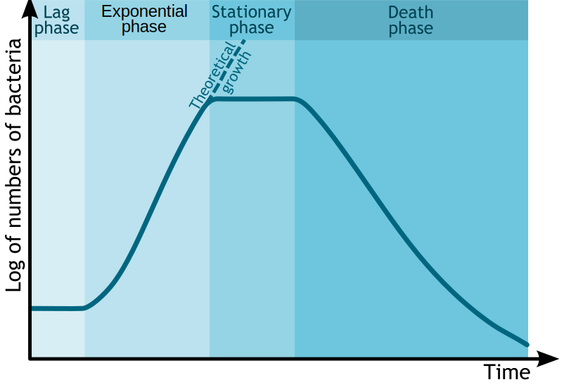

# Microbial Nutrition, Ecology And Growth 

Nutrition is the biochemical and physiological process by which an organism uses food to support its life. It includes ingestion, absorption, assimilation, biosynthesis, catabolism and excretion.

The science that studies the physiological process of nutrition is called nutritional science (also nutrition science).

Organisms primarily provide themselves with carbon in one of two ways: autotrophy (the self-production of organic food) and heterotrophy (the consumption of existing organic carbon). Combined with the source of energy, either light (phototrophy) or chemical (chemotrophy), there are four primary nutritional groups for organisms.

## Nutrients

A nutrient is a substance used by an organism to survive, grow, and reproduce. The requirement for dietary nutrient intake applies to animals, plants, fungi, and protists. Nutrients can be incorporated into cells for metabolic purposes or excreted by cells to create non-cellular structures, such as hair, scales, feathers, or exoskeletons. Some nutrients can be metabolically converted to smaller molecules in the process of releasing energy, such as for carbohydrates, lipids, proteins, and fermentation products (ethanol or vinegar), leading to end-products of water and carbon dioxide. All organisms require water. Essential nutrients for animals are the energy sources, some of the amino acids that are combined to create proteins, a subset of fatty acids, vitamins and certain minerals. Plants require more diverse minerals absorbed through roots, plus carbon dioxide and oxygen absorbed through leaves. Fungi live on dead or living organic matter and meet nutrient needs from their host.

Different types of organisms have different essential nutrients. Ascorbic acid (vitamin C) is essential, meaning it must be consumed in sufficient amounts, to humans and some other animal species, but some animals and plants are able to synthesize it. Nutrients may be organic or inorganic: organic compounds include most compounds containing carbon, while all other chemicals are inorganic. Inorganic nutrients include nutrients such as iron, selenium, and zinc, while organic nutrients include, among many others, energy-providing compounds and vitamins.

## The Nutrient Cycle

A nutrient cycle (or ecological recycling) is the movement and exchange of organic and inorganic matter back into the production of matter. Energy flow is a unidirectional and noncyclic pathway, whereas the movement of mineral nutrients is cyclic. Mineral cycles include the carbon cycle, sulfur cycle, nitrogen cycle, water cycle, phosphorus cycle, oxygen cycle, among others that continually recycle along with other mineral nutrients into productive ecological nutrition.

The nutrient cycle is nature's recycling system. All forms of recycling have feedback loops that use energy in the process of putting material resources back into use. Recycling in ecology is regulated to a large extent during the process of decomposition. Ecosystems employ biodiversity in the food webs that recycle natural materials, such as mineral nutrients, which includes water. Recycling in natural systems is one of the many ecosystem services that sustain and contribute to the well-being of human societies.

There is much overlap between the terms for the biogeochemical cycle and nutrient cycle. Most textbooks integrate the two and seem to treat them as synonymous terms. However, the terms often appear independently. Nutrient cycle is more often used in direct reference to the idea of an intra-system cycle, where an ecosystem functions as a unit. From a practical point, it does not make sense to assess a terrestrial ecosystem by considering the full column of air above it as well as the great depths of Earth below it. While an ecosystem often has no clear boundary, as a working model it is practical to consider the functional community where the bulk of matter and energy transfer occurs. Nutrient cycling occurs in ecosystems that participate in the "larger biogeochemical cycles of the earth through a system of inputs and outputs.


The ability to harness energy from a variety of metabolic pathways is a property of all living organisms. Growth, development, anabolism and catabolism are some of the central processes in the study of biological organisms, because the role of energy is fundamental to such biological processes. Life is dependent on energy transformations; living organisms survive because of exchange of energy between living tissues/ cells and the outside environment. Some organisms, such as autotrophs, can acquire energy from sunlight (through photosynthesis) without needing to consume nutrients and break them down. Other organisms, like heterotrophs, must intake nutrients from food to be able to sustain energy by breaking down chemical bonds in nutrients during metabolic processes such as glycolysis and the citric acid cycle. Importantly, as a direct consequence of the first law of thermodynamics, autotrophs and heterotrophs participate in a universal metabolic network—by eating autotrophs (plants), heterotrophs harness energy that was initially transformed by the plants during photosynthesis.

In a living organism, chemical bonds are broken and made as part of the exchange and transformation of energy. Energy is available for work (such as mechanical work) or for other processes (such as chemical synthesis and anabolic processes in growth), when weak bonds are broken and stronger bonds are made. The production of stronger bonds allows release of usable energy.

Adenosine triphosphate (ATP) is the main "energy currency" for organisms; the goal of metabolic and catabolic processes are to synthesize ATP from available starting materials (from the environment), and to break- down ATP (into adenosine diphosphate (ADP) and inorganic phosphate) by utilizing it in biological processes. In a cell, the ratio of ATP to ADP concentrations is known as the "energy charge" of the cell. A cell can use this energy charge to relay information about cellular needs; if there is more ATP than ADP available, the cell can use ATP to do work, but if there is more ADP than ATP available, the cell must synthesize ATP via oxidative phosphorylation.

(ref:atpsform) [Structure of adenosine triphosphate (ATP), protonated](https://commons.wikimedia.org/wiki/File:Adenosintriphosphat_protoniert.svg) 

```{r atpstrucform, fig.cap='(ref:atpsform)', echo=FALSE, message=FALSE, warning=FALSE}
knitr::include_graphics("./figures/nutrition/Adenosintriphosphat_protoniert.svg")
```

Living organisms produce ATP from energy sources, such as sunlight and organic compounds including carbohydrates, lipids and proteins, mainly via oxidative phosphorylation. The terminal phosphate bonds of ATP are relatively weak compared with the stronger bonds formed when ATP is hydrolyzed to adenosine diphosphate and inorganic phosphate. Here it is the thermodynamically favorable free energy of hydrolysis that results in energy release; the phosphoanhydride bond between the terminal phosphate group and the rest of the ATP molecule does not itself contain this energy. An organism's stockpile of ATP is used as a battery to store energy in cells. Utilization of chemical energy from such molecular bond rearrangement powers biological processes in every biological organism.

Living organisms obtain energy from organic and inorganic materials; i.e. ATP can be synthesized from a variety of biochemical precursors. For example, lithotrophs can oxidize minerals such as nitrites or forms of sulfur, such as elemental sulfur, sulfites, and hydrogen sulfide to produce ATP. In photosynthesis, autotrophs produce ATP using light energy, whereas heterotrophs must consume organic compounds, mostly including carbohydrates, fats, and proteins. The amount of energy actually obtained by the organism is lower than the amount released in combustion of the food; there are losses in digestion, metabolism, and thermogenesis.

## Thermodynamics of Living Organisms

Thermodynamics is a branch of physics that deals with heat, work, and temperature, and their relation to energy, radiation, and properties of matter. The behavior of these quantities is governed by the four laws of thermodynamics which convey a quantitative description using measurable macroscopic physical quantities, but may be explained in terms of microscopic constituents by statistical mechanics. 

Historically, thermodynamics developed out of a desire to increase the efficiency of early steam engines, particularly through the work of French physicist [Nicolas Léonard Sadi Carnot](https://en.wikipedia.org/wiki/Nicolas_Léonard_Sadi_Carnot) (1824) who believed that engine efficiency was the key that could help France win the Napoleonic Wars. Scots-Irish physicist [William Thomson](https://en.wikipedia.org/wiki/William_Thomson,_1st_Baron_Kelvin) (Lord Kelvin) was the first to formulate a concise definition of thermodynamics in 1854 which stated, "Thermo-dynamics is the subject of the relation of heat to forces acting between contiguous parts of bodies, and the relation of heat to electrical agency."

The initial application of thermodynamics to mechanical heat engines was quickly extended to the study of chemical compounds and chemical reactions. Biological thermodynamics is the quantitative study of the energy transductions that occur in or between living organisms, structures, and cells and of the nature and function of the chemical processes underlying these transductions. Biological thermodynamics may address the question of whether the benefit associated with any particular phenotypic trait is worth the energy investment it requires.

Living organisms must obey the laws of thermodynamics, which describe the transfer of heat and work. The First Law of Thermodynamics is a statement of the conservation of energy; though it can be changed from one form to another, energy can be neither created nor destroyed. The Second Law of Thermodynamics is concerned primarily with whether or not a given process is possible. The Second Law states that no natural process can occur unless it is accompanied by an increase in the entropy of the universe. Stated differently, an isolated system will always tend to disorder. Although living organisms' amazing complexity appears to contradict this law, life is possible as all organisms are open systems that exchange matter and energy with their surroundings. Thus living systems are not in equilibrium, but instead are dissipative systems that maintain their state of high complexity by causing a larger increase in the entropy of their environments. The metabolism of a cell achieves this by coupling the spontaneous processes of catabolism to the non-spontaneous processes of anabolism. In thermodynamic terms, metabolism maintains order by creating disorder.

As the environments of most organisms are constantly changing, the reactions of metabolism must be finely regulated to maintain a constant set of conditions within cells, a condition called homeostasis. Metabolic regulation also allows organisms to respond to signals and interact actively with their environments. Two closely linked concepts are important for understanding how metabolic pathways are controlled. Firstly, the regulation of an enzyme in a pathway is how its activity is increased and decreased in response to signals. Secondly, the control exerted by this enzyme is the effect that these changes in its activity have on the overall rate of the pathway (the flux through the pathway). For example, an enzyme may show large changes in activity (i.e. it is highly regulated) but if these changes have little effect on the flux of a metabolic pathway, then this enzyme is not involved in the control of the pathway.

There are multiple levels of metabolic regulation. In intrinsic regulation, the metabolic pathway self-regulates to respond to changes in the levels of substrates or products; for example, a decrease in the amount of product can increase the flux through the pathway to compensate. This type of regulation often involves allosteric regulation of the activities of multiple enzymes in the pathway. Extrinsic control involves a cell in a multicellular organism changing its metabolism in response to signals from other cells. These signals are usually in the form of water soluble messengers such as hormones and growth factors and are detected by specific receptors on the cell surface. These signals are then transmitted inside the cell by second messenger systems that often involved the phosphorylation of proteins.

A very well understood example of extrinsic control is the regulation of glucose metabolism by the hormone insulin. Insulin is produced in response to rises in blood glucose levels. Binding of the hormone to insulin receptors on cells then activates a cascade of protein kinases that cause the cells to take up glucose and convert it into storage molecules such as fatty acids and glycogen. The metabolism of glycogen is controlled by activity of phosphorylase, the enzyme that breaks down glycogen, and glycogen synthase, the enzyme that makes it. These enzymes are regulated in a reciprocal fashion, with phosphorylation inhibiting glycogen synthase, but activating phosphorylase. Insulin causes glycogen synthesis by activating protein phosphatases and producing a decrease in the phosphorylation of these enzymes.

The central pathways of metabolism described below, such as glycolysis and the citric acid cycle, are present in all three domains of living things and were present in the last universal common ancestor. This universal ancestral cell was prokaryotic and probably a methanogen that had extensive amino acid, nucleotide, carbohydrate and lipid metabolism. The retention of these ancient pathways during later evolution may be the result of these reactions having been an optimal solution to their particular metabolic problems, with pathways such as glycolysis and the citric acid cycle producing their end products highly efficiently and in a minimal number of steps. The first pathways of enzyme-based metabolism may have been parts of purine nucleotide metabolism, while previous metabolic pathways were a part of the ancient RNA world.

Many models have been proposed to describe the mechanisms by which novel metabolic pathways evolve. These include the sequential addition of novel enzymes to a short ancestral pathway, the duplication and then divergence of entire pathways as well as the recruitment of pre-existing enzymes and their assembly into a novel reaction pathway. The relative importance of these mechanisms is unclear, but genomic studies have shown that enzymes in a pathway are likely to have a shared ancestry, suggesting that many pathways have evolved in a step-by-step fashion with novel functions created from pre-existing steps in the pathway. An alternative model comes from studies that trace the evolution of proteins' structures in metabolic networks, this has suggested that enzymes are pervasively recruited, borrowing enzymes to perform similar functions in different metabolic pathways. These recruitment processes result in an evolutionary enzymatic mosaic. A third possibility is that some parts of metabolism might exist as "modules" that can be reused in different pathways and perform similar functions on different molecules.

As well as the evolution of new metabolic pathways, evolution can also cause the loss of metabolic functions. For example, in some parasites metabolic processes that are not essential for survival are lost and preformed amino acids, nucleotides and carbohydrates may instead be scavenged from the host. Similar reduced metabolic capabilities are seen in endosymbiotic organisms.

(ref:sun) [The Sun](https://commons.wikimedia.org/wiki/File:Sun_in_February_(black_version).jpg) is the source of energy for most of life on Earth. It derives its energy mainly from nuclear fusion in its core, converting mass to energy as protons are combined to form helium. This energy is transported to the sun's surface then released into space mainly in the form of radiant (light) energy.

```{r energyfromsun, fig.cap='(ref:sun)', echo=FALSE, message=FALSE, warning=FALSE}
knitr::include_graphics("./figures/nutrition/Sun_in_February_black_version.jpg")
```

The sun is the primary source of energy for living organisms on earth. The relationship between the energy of the incoming sunlight and its wavelength λ or frequency ν is given by

$$ E={\frac  {hc}{\lambda }}=h\nu $$ 

where h is the Planck constant (6.63x10^−34^Js) and c is the speed of light (2.998x10^8 m/s). Plants trap this energy from the sunlight and perform photosynthesis, effectively converting solar energy into chemical energy. To transfer the energy once again, animals will feed on plants (or other animals) and use the energy of digested plant (or animal) materials to create biological macromolecules.

Energy flow, also called the calorific flow, refers to the flow of energy through a food chain. 

A general energy flow scenario follows:

* Solar energy is fixed by the photoautotrophs, called primary producers, like green plants. Primary consumers absorb most of the stored energy in the plant through digestion, and transform it into the form of energy they need, such as adenosine triphosphate (ATP), through respiration. A part of the energy received by primary consumers, herbivores, is converted to body heat (an effect of respiration), which is radiated away and lost from the system. The loss of energy through body heat is far greater in warm-blooded animals, which must eat much more frequently than those that are cold-blooded. Energy loss also occurs in the expulsion of undigested food (egesta) by excretion or regurgitation.
* Secondary consumers, carnivores, then consume the primary consumers, although omnivores also consume primary producers. Energy that had been used by the primary consumers for growth and storage is thus absorbed into the secondary consumers through the process of digestion. As with primary consumers, secondary consumers convert this energy into a more suitable form (ATP) during respiration. Again, some energy is lost from the system, since energy which the primary consumers had used for respiration and regulation of body temperature cannot be utilized by the secondary consumers.
* Tertiary consumers, which may or may not be apex predators, then consume the secondary consumers, with some energy passed on and some lost, as with the lower levels of the food chain.
* A final link in the food chain are decomposers which break down the organic matter of the tertiary consumers (or whichever consumer is at the top of the chain) and release nutrients into the soil. They also break down plants, herbivores and carnivores that were not eaten by organisms higher on the food chain, as well as the undigested food that is excreted by herbivores and carnivores. Saprotrophic bacteria and fungi are decomposers, and play a pivotal role in the nitrogen and carbon cycles.
  
The energy is passed on from trophic level to trophic level and each time about 90% of the energy is lost, with some being lost as heat into the environment (an effect of respiration) and some being lost as incompletely digested food (egesta). Therefore, primary consumers get about 10% of the energy produced by autotrophs, while secondary consumers get 1% and tertiary consumers get 0.1%. This means the top consumer of a food chain receives the least energy, as much of the food chain's energy has been lost between trophic levels. This loss of energy at each level limits typical food chains to only four to six links.

## Heterotrophic Microbial Metabolism

Some microbes are heterotrophic (more precisely chemoorganoheterotrophic), using organic compounds as both carbon and energy sources. Heterotrophic microbes live off of nutrients that they scavenge from living hosts (as commensals or parasites) or find in dead organic matter of all kind (saprophages). Microbial metabolism is the main contribution for the bodily decay of all organisms after death. Many eukaryotic microorganisms are heterotrophic by predation or parasitism, properties also found in some bacteria such as Bdellovibrio (an intracellular parasite of other bacteria, causing death of its victims) and Myxobacteria such as Myxococcus (predators of other bacteria which are killed and lysed by cooperating swarms of many single cells of Myxobacteria). Most pathogenic bacteria can be viewed as heterotrophic parasites of humans or the other eukaryotic species they affect. Heterotrophic microbes are extremely abundant in nature and are responsible for the breakdown of large organic polymers such as cellulose, chitin or lignin which are generally indigestible to larger animals. Generally, the oxidative breakdown of large polymers to carbon dioxide (mineralization) requires several different organisms, with one breaking down the polymer into its constituent monomers, one able to use the monomers and excreting simpler waste compounds as by-products, and one able to use the excreted wastes. There are many variations on this theme, as different organisms are able to degrade different polymers and secrete different waste products. Some organisms are even able to degrade more recalcitrant compounds such as petroleum compounds or pesticides, making them useful in bioremediation.

Biochemically, prokaryotic heterotrophic metabolism is much more versatile than that of eukaryotic organisms, although many prokaryotes share the most basic metabolic models with eukaryotes, e. g. using glycolysis (also called EMP pathway) for sugar metabolism and the citric acid cycle to degrade acetate, producing energy in the form of ATP and reducing power in the form of NADH or quinols. These basic pathways are well conserved because they are also involved in biosynthesis of many conserved building blocks needed for cell growth (sometimes in reverse direction). However, many bacteria and archaea utilize alternative metabolic pathways other than glycolysis and the citric acid cycle. A well-studied example is sugar metabolism via the keto-deoxy-phosphogluconate pathway (also called ED pathway) in Pseudomonas. Moreover, there is a third alternative sugar-catabolic pathway used by some bacteria, the pentose phosphate pathway. The metabolic diversity and ability of prokaryotes to use a large variety of organic compounds arises from the much deeper evolutionary history and diversity of prokaryotes, as compared to eukaryotes. It is also noteworthy that the mitochondrion, the small membrane-bound intracellular organelle that is the site of eukaryotic oxygen-driven energy metabolism, arose from the endosymbiosis of a bacterium related to obligate intracellular Rickettsia, and also to plant-associated Rhizobium or Agrobacterium. Therefore, it is not surprising that all mitrochondriate eukaryotes share metabolic properties with these Proteobacteria. Most microbes respire (use an electron transport chain), although oxygen is not the only terminal electron acceptor that may be used. As discussed below, the use of terminal electron acceptors other than oxygen has important biogeochemical consequences.

## Phototrophy

Many microbes (phototrophs) are capable of using light as a source of energy to produce ATP and organic compounds such as carbohydrates, lipids, and proteins. Of these, algae are particularly significant because they are oxygenic, using water as an electron donor for electron transfer during photosynthesis. Phototrophic bacteria are found in the phyla Cyanobacteria, Chlorobi, Proteobacteria, Chloroflexi, and Firmicutes. Along with plants these microbes are responsible for all biological generation of oxygen gas on Earth. Because chloroplasts were derived from a lineage of the Cyanobacteria, the general principles of metabolism in these endosymbionts can also be applied to chloroplasts. In addition to oxygenic photosynthesis, many bacteria can also photosynthesize anaerobically, typically using sulfide (H
2S) as an electron donor to produce sulfate. Inorganic sulfur (S
0), thiosulfate (S
2O2−
3) and ferrous iron (Fe2+
) can also be used by some organisms. Phylogenetically, all oxygenic photosynthetic bacteria are Cyanobacteria, while anoxygenic photosynthetic bacteria belong to the purple bacteria (Proteobacteria), Green sulfur bacteria (e.g. Chlorobium), Green non-sulfur bacteria (e.g. Chloroflexus), or the heliobacteria (Low %G+C Gram positives). In addition to these organisms, some microbes (e.g. the Archaeon Halobacterium or the bacterium Roseobacter, among others) can utilize light to produce energy using the enzyme bacteriorhodopsin, a light-driven proton pump. However, there are no known Archaea that carry out photosynthesis.

As befits the large diversity of photosynthetic bacteria, there are many different mechanisms by which light is converted into energy for metabolism. All photosynthetic organisms locate their photosynthetic reaction centers within a membrane, which may be invaginations of the cytoplasmic membrane (Proteobacteria), thylakoid membranes (Cyanobacteria), specialized antenna structures called chlorosomes (Green sulfur and non-sulfur bacteria), or the cytoplasmic membrane itself (heliobacteria). Different photosynthetic bacteria also contain different photosynthetic pigments, such as chlorophylls and carotenoids, allowing them to take advantage of different portions of the electromagnetic spectrum and thereby inhabit different niches. Some groups of organisms contain more specialized light-harvesting structures (e.g. phycobilisomes in Cyanobacteria and chlorosomes in Green sulfur and non-sulfur bacteria), allowing for increased efficiency in light utilization.

Biochemically, anoxygenic photosynthesis is very different from oxygenic photosynthesis. Cyanobacteria (and by extension, chloroplasts) use the Z scheme of electron flow in which electrons eventually are used to form NADH. Two different reaction centers (photosystems) are used and proton motive force is generated both by using cyclic electron flow and the quinone pool. In anoxygenic photosynthetic bacteria, electron flow is cyclic, with all electrons used in photosynthesis eventually being transferred back to the single reaction center. A proton motive force is generated using only the quinone pool. In heliobacteria, Green sulfur, and Green non-sulfur bacteria, NADH is formed using the protein ferredoxin, an energetically favorable reaction. In purple bacteria, NADH is formed by reverse electron flow due to the lower chemical potential of this reaction center. In all cases, however, a proton motive force is generated and used to drive ATP production via an ATPase.

Most photosynthetic microbes are autotrophic, fixing carbon dioxide via the Calvin cycle. Some photosynthetic bacteria (e.g. Chloroflexus) are photoheterotrophs, meaning that they use organic carbon compounds as a carbon source for growth. Some photosynthetic organisms also fix nitrogen (see below).

## Chemolithotrophy

Chemolithotrophy is a type of metabolism where energy is obtained from the oxidation of inorganic compounds. Most chemolithotrophic organisms are also autotrophic. There are two major objectives to chemolithotrophy: the generation of energy (ATP) and the generation of reducing power (NADH).

Hydrogen oxidation
Main article: Hydrogen oxidizing bacteria
Many organisms are capable of using hydrogen (H
2) as a source of energy. While several mechanisms of anaerobic hydrogen oxidation have been mentioned previously (e.g. sulfate reducing- and acetogenic bacteria), hydrogen can also be used to unlock the chemical energy of O2  in the aerobic Knallgas reaction:

2 H2 + O2 → 2 H2O + energy
In these organisms, hydrogen is oxidized by a membrane-bound hydrogenase causing proton pumping via electron transfer to various quinones and cytochromes. In many organisms, a second cytoplasmic hydrogenase is used to generate reducing power in the form of NADH, which is subsequently used to fix carbon dioxide via the Calvin cycle. Hydrogen-oxidizing organisms, such as Cupriavidus necator (formerly Ralstonia eutropha), often inhabit oxic-anoxic interfaces in nature to take advantage of the hydrogen produced by anaerobic fermentative organisms while still maintaining a supply of oxygen.

Sulfur oxidation
Sulfur oxidation involves the oxidation of reduced sulfur compounds (such as sulfide H
2S), inorganic sulfur (S), and thiosulfate (S
2O2−
3) to form sulfuric acid (H
2SO
4). A classic example of a sulfur-oxidizing bacterium is Beggiatoa, a microbe originally described by Sergei Winogradsky, one of the founders of environmental microbiology. Another example is Paracoccus. Generally, the oxidation of sulfide occurs in stages, with inorganic sulfur being stored either inside or outside of the cell until needed. This two step process occurs because energetically sulfide is a better electron donor than inorganic sulfur or thiosulfate, allowing for a greater number of protons to be translocated across the membrane. Sulfur-oxidizing organisms generate reducing power for carbon dioxide fixation via the Calvin cycle using reverse electron flow, an energy-requiring process that pushes the electrons against their thermodynamic gradient to produce NADH. Biochemically, reduced sulfur compounds are converted to sulfite (SO2−
3) and subsequently converted to sulfate (SO2−
4) by the enzyme sulfite oxidase. Some organisms, however, accomplish the same oxidation using a reversal of the APS reductase system used by sulfate-reducing bacteria (see above). In all cases the energy liberated is transferred to the electron transport chain for ATP and NADH production. In addition to aerobic sulfur oxidation, some organisms (e.g. Thiobacillus denitrificans) use nitrate (NO−
3) as a terminal electron acceptor and therefore grow anaerobically.

Ferrous iron (Fe2+) oxidation

Ferrous iron is a soluble form of iron that is stable at extremely low pHs or under anaerobic conditions. Under aerobic, moderate pH conditions ferrous iron is oxidized spontaneously to the ferric (Fe3+
) form and is hydrolyzed abiotically to insoluble ferric hydroxide (Fe(OH)
3). There are three distinct types of ferrous iron-oxidizing microbes. The first are acidophiles, such as the bacteria Acidithiobacillus ferrooxidans and Leptospirillum ferrooxidans, as well as the archaeon Ferroplasma. These microbes oxidize iron in environments that have a very low pH and are important in acid mine drainage. The second type of microbes oxidize ferrous iron at near-neutral pH. These micro-organisms (for example Gallionella ferruginea, Leptothrix ochracea, or Mariprofundus ferrooxydans) live at the oxic-anoxic interfaces and are microaerophiles. The third type of iron-oxidizing microbes are anaerobic photosynthetic bacteria such as Rhodopseudomonas, which use ferrous iron to produce NADH for autotrophic carbon dioxide fixation. Biochemically, aerobic iron oxidation is a very energetically poor process which therefore requires large amounts of iron to be oxidized by the enzyme rusticyanin to facilitate the formation of proton motive force. Like sulfur oxidation, reverse electron flow must be used to form the NADH used for carbon dioxide fixation via the Calvin cycle.

Nitrification
Nitrification is the process by which ammonia (NH
3) is converted to nitrate (NO−
3). Nitrification is actually the net result of two distinct processes: oxidation of ammonia to nitrite (NO−
2) by nitrosifying bacteria (e.g. Nitrosomonas) and oxidation of nitrite to nitrate by the nitrite-oxidizing bacteria (e.g. Nitrobacter). Both of these processes are extremely energetically poor leading to very slow growth rates for both types of organisms. Biochemically, ammonia oxidation occurs by the stepwise oxidation of ammonia to hydroxylamine (NH
2OH) by the enzyme ammonia monooxygenase in the cytoplasm, followed by the oxidation of hydroxylamine to nitrite by the enzyme hydroxylamine oxidoreductase in the periplasm.

Electron and proton cycling are very complex but as a net result only one proton is translocated across the membrane per molecule of ammonia oxidized. Nitrite oxidation is much simpler, with nitrite being oxidized by the enzyme nitrite oxidoreductase coupled to proton translocation by a very short electron transport chain, again leading to very low growth rates for these organisms. Oxygen is required in both ammonia and nitrite oxidation, meaning that both nitrosifying and nitrite-oxidizing bacteria are aerobes. As in sulfur and iron oxidation, NADH for carbon dioxide fixation using the Calvin cycle is generated by reverse electron flow, thereby placing a further metabolic burden on an already energy-poor process.

In 2015, two groups independently showed the microbial genus Nitrospira is capable of complete nitrification (Comammox).

Nitrogen fixation

Nitrogen is an element required for growth by all biological systems. While extremely common (80% by volume) in the atmosphere, dinitrogen gas (N
2) is generally biologically inaccessible due to its high activation energy. Throughout all of nature, only specialized bacteria and Archaea are capable of nitrogen fixation, converting dinitrogen gas into ammonia (NH
3), which is easily assimilated by all organisms. These prokaryotes, therefore, are very important ecologically and are often essential for the survival of entire ecosystems. This is especially true in the ocean, where nitrogen-fixing cyanobacteria are often the only sources of fixed nitrogen, and in soils, where specialized symbioses exist between legumes and their nitrogen-fixing partners to provide the nitrogen needed by these plants for growth.

Nitrogen fixation can be found distributed throughout nearly all bacterial lineages and physiological classes but is not a universal property. Because the enzyme nitrogenase, responsible for nitrogen fixation, is very sensitive to oxygen which will inhibit it irreversibly, all nitrogen-fixing organisms must possess some mechanism to keep the concentration of oxygen low. Examples include:

* heterocyst formation (cyanobacteria e.g. Anabaena) where one cell does not photosynthesize but instead fixes nitrogen for its neighbors which in turn provide it with energy
* root nodule symbioses (e.g. Rhizobium) with plants that supply oxygen to the bacteria bound to molecules of leghaemoglobin
* anaerobic lifestyle (e.g. Clostridium pasteurianum)
* very fast metabolism (e.g. Azotobacter vinelandii)
The production and activity of nitrogenases is very highly regulated, both because nitrogen fixation is an extremely energetically expensive process (16–24 ATP are used per N
2 fixed) and due to the extreme sensitivity of the nitrogenase to oxygen.

## Transport And Movement Of Substances Across The Cell Membrane

The [cell membrane](https://en.wikipedia.org/wiki/Cell_membrane) (also known as the plasma membrane (PM) or cytoplasmic membrane, and historically referred to as the plasmalemma) is a biological membrane that separates the interior of all cells from the outside environment (the extracellular space) which protects the cell from its environment. The cell membrane consists of a lipid bilayer, including sterols (e. g. cholesterol) that sit between phospholipids to maintain their fluidity at various temperatures. The membrane also contains membrane proteins, including integral proteins that go across the membrane serving as membrane transporters, and peripheral proteins that loosely attach to the outer (peripheral) side of the cell membrane, acting as enzymes shaping the cell. The cell mebrane controls the movement of substances in and out of cells and organelles. In this way, it is selectively permeable to ions and organic molecules. In addition, cell membranes are involved in a variety of cellular processes such as cell adhesion, ion conductivity and cell signalling and serve as the attachment surface for several extracellular structures, including the cell wall, the carbohydrate layer called the glycocalyx, and the intracellular network of protein fibers called the cytoskeleton. In the field of synthetic biology, cell membranes can be artificially reassembled.

(ref:cellmembr) Picture of a [molecular dynamics simulation](https://doi.org/10.1371/journal.pone.0000880) of a cell membrane/protein complex consisting of bovine [rhodopsin](https://en.wikipedia.org/wiki/Rhodopsin) incorporated of a phosphatidylcholine (1-palmitoyl-2-oleoyl-sn-glycero-3-phosphocholine, POPC) lipid bylayer. POPC and water molecules are depicted as sticks. The lipid layers facing the extracellular and cytoplasmic spaces are shown in white and blue, respectively. Both the extra- and intracellular interfaces are covered with layers of water. The secondary structure of rhodopsin is depicted in rainbow colored cartoon representation. Potassium and chloride ions are shown as spheres (colored in cyan and green, respectively). Image generated from [PDB file](http://www.charmm-gui.org/archive/complex/1gzm_rect_popc.pdb) obtained from the [CHARMM-GUI Archive - Protein/Membrane Complex Library](http://www.charmm-gui.org/?doc=archive&lib=complex) using the open source molecular visualization tool [PyMol](https://pymol.org/2/).

```{r cellmembrane, fig.cap='(ref:cellmembr)', echo=FALSE, message=FALSE, warning=FALSE}
knitr::include_graphics("./figures/nutrition/cell_membrane_rhodopsin_water_Cl_K.png")
```


The permeability of a membrane is the rate of passive diffusion of molecules through the membrane. These molecules are known as permeant molecules. Permeability depends mainly on the electric charge and polarity of the molecule and to a lesser extent the molar mass of the molecule. Due to the cell membrane's hydrophobic nature, small electrically neutral molecules pass through the membrane more easily than charged, large ones. The inability of charged molecules to pass through the cell membrane results in pH partition of substances throughout the fluid compartments of the body. Because of these properties, the cell membrane is referred to as as selectively (or semi-) permeable membrane.

### Diffusion

[Diffusion](https://en.wikipedia.org/wiki/Diffusion) is the net movement of material from an area of high concentration to an area with lower concentration. The difference of concentration between the two areas is often termed as the concentration gradient, and diffusion will continue until this gradient has been eliminated. Since diffusion moves materials from an area of higher concentration to an area of lower concentration, it is described as moving solutes "down the concentration gradient" (compared with active transport, which often moves material from area of low concentration to area of higher concentration, and therefore referred to as moving the material "against the concentration gradient"). However, in many cases (e.g. passive drug transport) the driving force of passive transport can not be simplified to the concentration gradient. If there are different solutions at the two sides of the membrane with different equilibrium solubility of the drug, the difference in degree of saturation is the driving force of passive membrane transport. It is also true for supersaturated solutions which are more and more important owing to the spreading of the application of amorphous solid dispersions for drug bioavailability enhancement.

(ref:diff) [Diffusion of a purple dye in water.](https://commons.wikimedia.org/wiki/File:Blausen_0315_Diffusion.png) 

```{r diffusion, fig.cap='(ref:diff)', echo=FALSE, message=FALSE, warning=FALSE}
knitr::include_graphics("./figures/nutrition/Blausen_0315_Diffusion.png")
```

Simple diffusion and osmosis are in some ways similar. Simple diffusion is the passive movement of solute from a high concentration to a lower concentration until the concentration of the solute is uniform throughout and reaches equilibrium. Osmosis is much like simple diffusion but it specifically describes the movement of water (not the solute) across a selectively permeable membrane until there is an equal concentration of water and solute on both sides of the membrane. Simple diffusion and osmosis are both forms of passive transport and require none of the cell's ATP energy.

### Facilitated Diffusion

Facilitated diffusion, also called carrier-mediated osmosis, is the movement of molecules across the cell membrane via special transport proteins that are embedded in the plasma membrane by actively taking up or excluding ions. Active transport of protons by H+ ATPases alters membrane potential allowing for facilitated passive transport of particular ions such as potassium  down their charge gradient through high affinity transporters and channels.

### Osmosis

[Osmosis](https://en.wikipedia.org/wiki/Osmosis) is the movement of water molecules across a selectively permeable membrane. The net movement of water molecules through a partially permeable membrane from a solution of high water potential to an area of low water potential. A cell with a less negative water potential will draw in water but this depends on other factors as well such as solute potential (pressure in the cell e.g. solute molecules) and pressure potential (external pressure e.g. cell wall). There are three types of Osmosis solutions: the isotonic solution, hypotonic solution, and hypertonic solution. Isotonic solution is when the extracellular solute concentration is balanced with the concentration inside the cell. In the Isotonic solution, the water molecules still moves between the solutions, but the rates are the same from both directions, thus the water movement is balanced between the inside of the cell as well as the outside of the cell. A hypotonic solution is when the solute concentration outside the cell is lower than the concentration inside the cell. In hypotonic solutions, the water moves into the cell, down its concentration gradient (from higher to lower water concentrations). That can cause the cell to swell. Cells that don't have a cell wall, such as animal cells, could burst in this solution. A hypertonic solution is when the solute concentration is higher (think of hyper - as high) than the concentration inside the cell. In hypertonic solution, the water will move out, causing the cell to shrink.

(ref:osmo) [An example of osmosis](https://commons.wikimedia.org/wiki/File:Osmose_en.svg): a semi-permeable (selectively permebable) membrane separates two compartments containing a higher concentration of a dissolved salt on the left side compared to the right side (i.e. the left side is hypertonic compared to the (hypotonic) right side). A net flow of water will occur from the right to the left side until the concentration of salt on both sides of the membrane is equal (i.e. both sides are isotonic).) 

```{r osmosis, fig.cap='(ref:osmo)', echo=FALSE, message=FALSE, warning=FALSE}
knitr::include_graphics("./figures/nutrition/Osmose_en.svg")
```

### Active Transport

Unlike passive transport, which uses the kinetic energy and natural entropy of molecules moving down a gradient, active transport uses cellular energy to move them against a gradient, polar repulsion, or other resistance. Active transport is usually associated with accumulating high concentrations of molecules that the cell needs, such as ions, glucose and amino acids. Examples of active transport include the uptake of glucose in the intestines in humans and the uptake of mineral ions into root hair cells of plants.

There are two types of active transport: primary active transport that uses adenosine triphosphate (ATP), and secondary active transport that uses an electrochemical gradient. An example of active transport in human physiology is the uptake of glucose in the intestines.

### Bulk transport

Endocytosis and exocytosis are both forms of bulk transport that move materials into and out of cells, respectively, via vesicles. In the case of endocytosis, the cellular membrane folds around the desired materials outside the cell. The ingested particle becomes trapped within a pouch, known as a vesicle, inside the cytoplasm. Often enzymes from lysosomes are then used to digest the molecules absorbed by this process. Substances that enter the cell via signal mediated electrolysis include proteins, hormones and growth and stabilization factors. Viruses enter cells through a form of endocytosis that involves their outer membrane fusing with the membrane of the cell. This forces the viral DNA into the host cell.

Biologists distinguish two main types of endocytosis: pinocytosis and phagocytosis.

* In pinocytosis, cells engulf liquid particles (in humans this process occurs in the small intestine, where cells engulf fat droplets).
* In phagocytosis, cells engulf solid particles.
Exocytosis involves the removal of substances through the fusion of the outer cell membrane and a vesicle membrane An example of exocytosis would be the transmission of neurotransmitters across a synapse between brain cells.

## Microbial Growth

Bacterial growth is proliferation of bacterium into two daughter cells, in a process called binary fission. Providing no event occurs, the resulting daughter cells are genetically identical to the original cell. Hence, bacterial growth occurs. Both daughter cells from the division do not necessarily survive. However, if the number surviving exceeds unity on average, the bacterial population undergoes exponential growth. The measurement of an exponential bacterial growth curve in batch culture was traditionally a part of the training of all microbiologists; the basic means requires bacterial enumeration (cell counting) by direct and individual (microscopic, flow cytometry), direct and bulk (biomass), indirect and individual (colony counting), or indirect and bulk (most probable number, turbidity, nutrient uptake) methods. Models reconcile theory with the measurements.

(ref:curve)[A Bacterial growth curve\Kinetic Curve](https://commons.wikimedia.org/wiki/File:Bacterial_growth_en.svg)

```{r growthcurve, fig.cap='(ref:curve)', echo=FALSE, message=FALSE, warning=FALSE}

```

In autecological studies, the growth of bacteria (or other microorganisms, as protozoa, microalgae or yeasts) in batch culture can be modeled with four different phases: lag phase (A), log phase or exponential phase (B), stationary phase (C), and death phase (D).

* During lag phase, bacteria adapt themselves to growth conditions. It is the period where the individual bacteria are maturing and not yet able to divide. During the lag phase of the bacterial growth cycle, synthesis of RNA, enzymes and other molecules occurs. During the lag phase cells change very little because the cells do not immediately reproduce in a new medium. This period of little to no cell division is called the lag phase and can last for 1 hour to several days. During this phase cells are not dormant.
* The log phase (sometimes called the logarithmic phase or the exponential phase) is a period characterized by cell doubling. The number of new bacteria appearing per unit time is proportional to the present population. If growth is not limited, doubling will continue at a constant rate so both the number of cells and the rate of population increase doubles with each consecutive time period. For this type of exponential growth, plotting the natural logarithm of cell number against time produces a straight line. The slope of this line is the specific growth rate of the organism, which is a measure of the number of divisions per cell per unit time. The actual rate of this growth (i.e. the slope of the line in the figure) depends upon the growth conditions, which affect the frequency of cell division events and the probability of both daughter cells surviving. Under controlled conditions, cyanobacteria can double their population four times a day and then they can triple their population. Exponential growth cannot continue indefinitely, however, because the medium is soon depleted of nutrients and enriched with wastes.
* The stationary phase is often due to a growth-limiting factor such as the depletion of an essential nutrient, and/or the formation of an inhibitory product such as an organic acid. Stationary phase results from a situation in which growth rate and death rate are equal. The number of new cells created is limited by the growth factor and as a result the rate of cell growth matches the rate of cell death. The result is a “smooth,” horizontal linear part of the curve during the stationary phase. Mutations can occur during stationary phase. Bridges et al. (2001) presented evidence that DNA damage is responsible for many of the mutations arising in the genomes of stationary phase or starving bacteria. Endogenously generated reactive oxygen species appear to be a major source of such damages.
* At death phase (decline phase), bacteria die. This could be caused by lack of nutrients, environmental temperature above or below the tolerance band for the species, or other injurious conditions.

This basic batch culture growth model draws out and emphasizes aspects of bacterial growth which may differ from the growth of macrofauna. It emphasizes clonality, asexual binary division, the short development time relative to replication itself, the seemingly low death rate, the need to move from a dormant state to a reproductive state or to condition the media, and finally, the tendency of lab adapted strains to exhaust their nutrients. In reality, even in batch culture, the four phases are not well defined. The cells do not reproduce in synchrony without explicit and continual prompting (as in experiments with stalked bacteria ) and their exponential phase growth is often not ever a constant rate, but instead a slowly decaying rate, a constant stochastic response to pressures both to reproduce and to go dormant in the face of declining nutrient concentrations and increasing waste concentrations.

Near the end of the logarithmic phase of a batch culture, competence for natural genetic transformation may be induced, as in Bacillus subtilis and in other bacteria. Natural genetic transformation is a form of DNA transfer that appears to be an adaptation for repairing DNA damages.

Batch culture is the most common laboratory growth method in which bacterial growth is studied, but it is only one of many. It is ideally spatially unstructured and temporally structured. The bacterial culture is incubated in a closed vessel with a single batch of medium. In some experimental regimes, some of the bacterial culture is periodically removed and added to fresh sterile medium. In the extreme case, this leads to the continual renewal of the nutrients. This is a chemostat, also known as continuous culture. It is ideally spatially unstructured and temporally unstructured, in a steady state defined by the rates of nutrient supply and bacterial growth. In comparison to batch culture, bacteria are maintained in exponential growth phase, and the growth rate of the bacteria is known. Related devices include turbidostats and auxostats. When Escherichia coli is growing very slowly with a doubling time of 16 hours in a chemostat most cells have a single chromosome.

Bacterial growth can be suppressed with bacteriostats, without necessarily killing the bacteria. In a synecological, true-to-nature situation in which more than one bacterial species is present, the growth of microbes is more dynamic and continual.

Liquid is not the only laboratory environment for bacterial growth. Spatially structured environments such as biofilms or agar surfaces present additional complex growth models.

## Environmental Facors Influencing Growth

Environmental factors influence rate of bacterial growth such as acidity (pH), temperature, water activity, macro and micro nutrients, oxygen levels, and toxins. Conditions tend to be relatively consistent between bacteria with the exception of extremophiles. Bacterium have optimal growth conditions under which they thrive, but once outside of those conditions the stress can result in either reduced or stalled growth, dormancy (such as formation spores), or death. Maintaining sub-optimal growth conditions is a key principle to food preservation.

### Nutrient Availability

### Temperature

Low temperatures tend to reduce growth rates which has led to refrigeration being instrumental in food preservation. Depending on temperature, bacteria can be classified as:

* Psychrophiles

Psychrophiles are extremophilic cold-loving bacteria or archaea with an optimal temperature for growth at about 15 °C or lower (maximal temperature for growth at 20 °C, minimal temperature for growth at 0 °C or lower). Psychrophiles are typically found in Earth's extremely cold ecosystems, such as polar ice-cap regions, permafrost, polar surface, and deep oceans.

* Mesophiles

Mesophiles are bacteria that thrive at moderate temperatures, growing best between 20° and 45 °C. These temperatures align with the natural body temperatures of humans, which is why many human pathogens are mesophiles.

* Thermophiles
        
Survive under temperatures of 45–60 °C Ambrose

### Acidity

Optimal acidity for bacteria tends to be around pH 6.5 to 7.0 with the exception of acidophiles. Some bacteria can change the pH such as by excreting acid resulting in sub-optimal conditions.

### Water activity
        
Water activity (a~w~) is the partial vapor pressure of water in a solution divided by the standard state partial vapor pressure of water. In the field of food science, the standard state is most often defined as the partial vapor pressure of pure water at the same temperature. Using this particular definition, pure distilled water has a water activity of exactly one. As temperature increases, aw typically increases, except in some products with crystalline salt or sugar.

Higher aw substances tend to support more microorganisms.
        
Water migrates from areas of high a~w~ to areas of low aw. For example, if honey (a~w~ ≈ 0.6) is exposed to humid air (a~w  ≈ 0.7), the honey absorbs water from the air. If salami (a~w~ ≈ 0.87) is exposed to dry air (a~w~ ≈ 0.5), the salami dries out, which could preserve it or spoil it.

### Oxygen

Bacteria can be aerobes or anaerobes. Depending on the degree of oxygen required bacteria can fall into the following classes:

1. facultative-anaerobes-ie aerotolerant absence or minimal oxygen required for their growth
1. obligate-anaerobes grow only in complete absence of oxygen
1. facultative aerobes-can grow either in presence or minimal oxygen
1. obligate aerobes-grow only in the presence of oxygen


### Toxic compounds

Toxic compounds such as ethanol can hinder growth or kill bacteria. This is used beneficially for disinfection and in food preservation.


