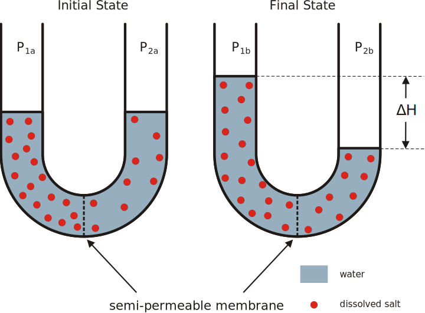

# Microbial Nutrition, Ecology And Growth 

Nutrition is the biochemical and physiological process by which an organism uses food to support its life. It includes ingestion, absorption, assimilation, biosynthesis, catabolism and excretion.

The science that studies the physiological process of nutrition is called nutritional science (also nutrition science).

Organisms primarily provide themselves with carbon in one of two ways: autotrophy (the self-production of organic food) and heterotrophy (the consumption of existing organic carbon). Combined with the source of energy, either light (phototrophy) or chemical (chemotrophy), there are four primary nutritional groups of organisms. Primary nutritional groups are groups of organisms, divided in relation to the nutrition mode according to the sources of energy and carbon, needed for living, growth and reproduction. The sources of energy can be light or chemical compounds; the sources of carbon can be of organic or inorganic origin.

## Primary Sources Of Energy

Phototrophs absorb light in photoreceptors and transform it into chemical energy.
Chemotrophs release bond energy from chemical compounds.

The freed energy is stored as potential energy in ATP, carbohydrates, or proteins. Eventually, the energy is used for life processes such as moving, growth and reproduction.

Plants and some bacteria can alternate between phototrophy and chemotrophy, depending on the availability of light.

## Primary Sources Of Reducing Equivalents

Organotrophs use organic compounds as electron/hydrogen donors.
Lithotrophs use inorganic compounds as electron/hydrogen donors.

The electrons or hydrogen atoms from reducing equivalents (electron donors) are needed by both phototrophs and chemotrophs in reduction-oxidation reactions that transfer energy in the anabolic processes of ATP synthesis (in heterotrophs) or biosynthesis (in autotrophs). The electron or hydrogen donors are taken up from the environment.

Organotrophic organisms are often also heterotrophic, using organic compounds as sources of both electrons and carbon. Similarly, lithotrophic organisms are often also autotrophic, using inorganic sources of electrons and CO~2~ as their inorganic carbon source.

Some lithotrophic bacteria can utilize diverse sources of electrons, depending on the availability of possible donors.

The organic or inorganic substances (e.g., oxygen) used as electron acceptors needed in the catabolic processes of aerobic or anaerobic respiration and fermentation are not taken into account here.

For example, plants are lithotrophs because they use water as their electron donor for biosynthesis. Animals are organotrophs because they use organic compounds as electron donors to synthesize ATP (plants also do this, but this is not taken into account). Both use oxygen in respiration as electron acceptor and the main source of energy, but this character is not used to define them as lithotrophs.

## Primary Sources of Carbon

Heterotrophs metabolize organic compounds to obtain carbon for growth and development.
Autotrophs use carbon dioxide (CO~2~) as their source of carbon.

## Nutrients

A nutrient is a substance used by an organism to survive, grow, and reproduce. The requirement for dietary nutrient intake applies to animals, plants, fungi, and protists. Nutrients can be incorporated into cells for metabolic purposes or excreted by cells to create non-cellular structures, such as hair, scales, feathers, or exoskeletons. Some nutrients can be metabolically converted to smaller molecules in the process of releasing energy, such as for carbohydrates, lipids, proteins, and fermentation products (ethanol or vinegar), leading to end-products of water and carbon dioxide. All organisms require water. Essential nutrients for animals are the energy sources, some of the amino acids that are combined to create proteins, a subset of fatty acids, vitamins and certain minerals. Plants require more diverse minerals absorbed through roots, plus carbon dioxide and oxygen absorbed through leaves. Fungi live on dead or living organic matter and meet nutrient needs from their host.

Different types of organisms have different essential nutrients. Ascorbic acid (vitamin C) is essential, meaning it must be consumed in sufficient amounts, to humans and some other animal species, but some animals and plants are able to synthesize it. Nutrients may be organic or inorganic: organic compounds include most compounds containing carbon, while all other chemicals are inorganic. Inorganic nutrients include nutrients such as iron, selenium, and zinc, while organic nutrients include, among many others, energy-providing compounds and vitamins.

## The Nutrient Cycle

A nutrient cycle (or ecological recycling) is the movement and exchange of organic and inorganic matter back into the production of matter. Energy flow is a unidirectional and noncyclic pathway, whereas the movement of mineral nutrients is cyclic. Mineral cycles include the carbon cycle, sulfur cycle, nitrogen cycle, water cycle, phosphorus cycle, oxygen cycle, among others that continually recycle along with other mineral nutrients into productive ecological nutrition.

(ref:carboncy) [This carbon cycle diagram](https://commons.wikimedia.org/wiki/File:Carbon_cycle-cute_diagram.svg)shows the storage and annual exchange of carbon between the atmosphere, hydrosphere and geosphere in gigatons - or billions of tons - of Carbon (GtC). Burning fossil fuels by people adds about 5.5 GtC of carbon per year into the atmosphere.

```{r carboncycle, fig.cap='(ref:carboncy)', echo=FALSE, message=FALSE, warning=FALSE}

```

The nutrient cycle is nature's recycling system. All forms of recycling have feedback loops that use energy in the process of putting material resources back into use. Recycling in ecology is regulated to a large extent during the process of decomposition. Ecosystems employ biodiversity in the food webs that recycle natural materials, such as mineral nutrients, which includes water. Recycling in natural systems is one of the many ecosystem services that sustain and contribute to the well-being of human societies.

There is much overlap between the terms for the biogeochemical cycle and nutrient cycle. Most textbooks integrate the two and seem to treat them as synonymous terms. However, the terms often appear independently. Nutrient cycle is more often used in direct reference to the idea of an intra-system cycle, where an ecosystem functions as a unit. From a practical point, it does not make sense to assess a terrestrial ecosystem by considering the full column of air above it as well as the great depths of Earth below it. While an ecosystem often has no clear boundary, as a working model it is practical to consider the functional community where the bulk of matter and energy transfer occurs. Nutrient cycling occurs in ecosystems that participate in the "larger biogeochemical cycles of the earth through a system of inputs and outputs.

The ability to harness energy from a variety of metabolic pathways is a property of all living organisms. Growth, development, anabolism and catabolism are some of the central processes in the study of biological organisms, because the role of energy is fundamental to such biological processes. Life is dependent on energy transformations; living organisms survive because of exchange of energy between living tissues/ cells and the outside environment. Some organisms, such as autotrophs, can acquire energy from sunlight (through photosynthesis) without needing to consume nutrients and break them down. Other organisms, like heterotrophs, must intake nutrients from food to be able to sustain energy by breaking down chemical bonds in nutrients during metabolic processes such as glycolysis and the citric acid cycle. Importantly, as a direct consequence of the first law of thermodynamics, autotrophs and heterotrophs participate in a universal metabolic network—by eating autotrophs (plants), heterotrophs harness energy that was initially transformed by the plants during photosynthesis.

In a living organism, chemical bonds are broken and made as part of the exchange and transformation of energy. Energy is available for work (such as mechanical work) or for other processes (such as chemical synthesis and anabolic processes in growth), when weak bonds are broken and stronger bonds are made. The production of stronger bonds allows release of usable energy.

Adenosine triphosphate (ATP) is the main "energy currency" for organisms; the goal of metabolic and catabolic processes are to synthesize ATP from available starting materials (from the environment), and to break- down ATP (into adenosine diphosphate (ADP) and inorganic phosphate) by utilizing it in biological processes. In a cell, the ratio of ATP to ADP concentrations is known as the "energy charge" of the cell. A cell can use this energy charge to relay information about cellular needs; if there is more ATP than ADP available, the cell can use ATP to do work, but if there is more ADP than ATP available, the cell must synthesize ATP via oxidative phosphorylation.

(ref:atpsform) [Structure of adenosine triphosphate (ATP), protonated](https://commons.wikimedia.org/wiki/File:Adenosintriphosphat_protoniert.svg) 

```{r atpstrucform, fig.cap='(ref:atpsform)', echo=FALSE, message=FALSE, warning=FALSE}
knitr::include_graphics("./figures/nutrition/Adenosintriphosphat_protoniert.svg")
```

Living organisms produce ATP from energy sources, such as sunlight and organic compounds including carbohydrates, lipids and proteins, mainly via oxidative phosphorylation. The terminal phosphate bonds of ATP are relatively weak compared with the stronger bonds formed when ATP is hydrolyzed to adenosine diphosphate and inorganic phosphate. Here it is the thermodynamically favorable free energy of hydrolysis that results in energy release; the phosphoanhydride bond between the terminal phosphate group and the rest of the ATP molecule does not itself contain this energy. An organism's stockpile of ATP is used as a battery to store energy in cells. Utilization of chemical energy from such molecular bond rearrangement powers biological processes in every biological organism.

Living organisms obtain energy from organic and inorganic materials; i.e. ATP can be synthesized from a variety of biochemical precursors. For example, lithotrophs can oxidize minerals such as nitrites or forms of sulfur, such as elemental sulfur, sulfites, and hydrogen sulfide to produce ATP. In photosynthesis, autotrophs produce ATP using light energy, whereas heterotrophs must consume organic compounds, mostly including carbohydrates, fats, and proteins. The amount of energy actually obtained by the organism is lower than the amount released in combustion of the food; there are losses in digestion, metabolism, and thermogenesis.

## Transport And Movement Of Substances Across The Cell Membrane

The [cell membrane](https://en.wikipedia.org/wiki/Cell_membrane) (also known as the plasma membrane (PM) or cytoplasmic membrane, and historically referred to as the plasmalemma) is a biological membrane that separates the interior of all cells from the outside environment (the extracellular space) which protects the cell from its environment. The cell membrane consists of a lipid bilayer, including sterols (e. g. cholesterol) that sit between phospholipids to maintain their fluidity at various temperatures. The membrane also contains membrane proteins, including integral proteins that go across the membrane serving as membrane transporters, and peripheral proteins that loosely attach to the outer (peripheral) side of the cell membrane, acting as enzymes shaping the cell. The cell mebrane controls the movement of substances in and out of cells and organelles. In this way, it is selectively permeable to ions and organic molecules. In addition, cell membranes are involved in a variety of cellular processes such as cell adhesion, ion conductivity and cell signalling and serve as the attachment surface for several extracellular structures, including the cell wall, the carbohydrate layer called the glycocalyx, and the intracellular network of protein fibers called the cytoskeleton. In the field of synthetic biology, cell membranes can be artificially reassembled.

(ref:cellmembr) Picture of a [molecular dynamics simulation](https://doi.org/10.1371/journal.pone.0000880) of a cell membrane/protein complex consisting of bovine [rhodopsin](https://en.wikipedia.org/wiki/Rhodopsin) incorporated of a phosphatidylcholine (1-palmitoyl-2-oleoyl-sn-glycero-3-phosphocholine, POPC) lipid bylayer. POPC and water molecules are depicted as sticks. The lipid layers facing the extracellular and cytoplasmic spaces are shown in white and blue, respectively. Both the extra- and intracellular interfaces are covered with layers of water. The secondary structure of rhodopsin is depicted in rainbow colored cartoon representation. Potassium and chloride ions are shown as spheres (colored in cyan and green, respectively). Image generated from [PDB file](http://www.charmm-gui.org/archive/complex/1gzm_rect_popc.pdb) obtained from the [CHARMM-GUI Archive - Protein/Membrane Complex Library](http://www.charmm-gui.org/?doc=archive&lib=complex) using the open source molecular visualization tool [PyMol](https://pymol.org/2/).

```{r cellmembrane, fig.cap='(ref:cellmembr)', echo=FALSE, message=FALSE, warning=FALSE}
knitr::include_graphics("./figures/nutrition/cell_membrane_rhodopsin_water_Cl_K.png")
```


The permeability of a membrane is the rate of passive diffusion of molecules through the membrane. These molecules are known as permeant molecules. Permeability depends mainly on the electric charge and polarity of the molecule and to a lesser extent the molar mass of the molecule. Due to the cell membrane's hydrophobic nature, small electrically neutral molecules pass through the membrane more easily than charged, large ones. The inability of charged molecules to pass through the cell membrane results in pH partition of substances throughout the fluid compartments of the body. Because of these properties, the cell membrane is referred to as as selectively (or semi-) permeable membrane.

### Diffusion

[Diffusion](https://en.wikipedia.org/wiki/Diffusion) is the net movement of material from an area of high concentration to an area with lower concentration. The difference of concentration between the two areas is often termed as the concentration gradient, and diffusion will continue until this gradient has been eliminated. Since diffusion moves materials from an area of higher concentration to an area of lower concentration, it is described as moving solutes "down the concentration gradient" (compared with active transport, which often moves material from area of low concentration to area of higher concentration, and therefore referred to as moving the material "against the concentration gradient"). However, in many cases (e.g. passive drug transport) the driving force of passive transport can not be simplified to the concentration gradient. If there are different solutions at the two sides of the membrane with different equilibrium solubility of the drug, the difference in degree of saturation is the driving force of passive membrane transport. It is also true for supersaturated solutions which are more and more important owing to the spreading of the application of amorphous solid dispersions for drug bioavailability enhancement.

(ref:diff) [Diffusion of a purple dye in water.](https://commons.wikimedia.org/wiki/File:Blausen_0315_Diffusion.png) 

```{r diffusion, fig.cap='(ref:diff)', echo=FALSE, message=FALSE, warning=FALSE}
knitr::include_graphics("./figures/nutrition/Blausen_0315_Diffusion.png")
```

Simple diffusion and osmosis are in some ways similar. Simple diffusion is the passive movement of solute from a high concentration to a lower concentration until the concentration of the solute is uniform throughout and reaches equilibrium. Osmosis is much like simple diffusion but it specifically describes the movement of water (not the solute) across a selectively permeable membrane until there is an equal concentration of water and solute on both sides of the membrane. Simple diffusion and osmosis are both forms of passive transport and require none of the cell's ATP energy.

### Facilitated Diffusion

Facilitated diffusion, also called carrier-mediated osmosis, is the movement of molecules across the cell membrane via special transport proteins that are embedded in the plasma membrane by actively taking up or excluding ions. Active transport of protons by H+ ATPases alters membrane potential allowing for facilitated passive transport of particular ions such as potassium  down their charge gradient through high affinity transporters and channels.

### Osmosis

[Osmosis](https://en.wikipedia.org/wiki/Osmosis) is the movement of water molecules across a selectively permeable membrane. The net movement of water molecules through a partially permeable membrane from a solution of high water potential to an area of low water potential. A cell with a less negative water potential will draw in water but this depends on other factors as well such as solute potential (pressure in the cell e.g. solute molecules) and pressure potential (external pressure e.g. cell wall). There are three types of Osmosis solutions: the isotonic solution, hypotonic solution, and hypertonic solution. Isotonic solution is when the extracellular solute concentration is balanced with the concentration inside the cell. In the Isotonic solution, the water molecules still moves between the solutions, but the rates are the same from both directions, thus the water movement is balanced between the inside of the cell as well as the outside of the cell. A hypotonic solution is when the solute concentration outside the cell is lower than the concentration inside the cell. In hypotonic solutions, the water moves into the cell, down its concentration gradient (from higher to lower water concentrations). That can cause the cell to swell. Cells that don't have a cell wall, such as animal cells, could burst in this solution. A hypertonic solution is when the solute concentration is higher (think of hyper - as high) than the concentration inside the cell. In hypertonic solution, the water will move out, causing the cell to shrink.

(ref:osmo) [An example of osmosis](https://commons.wikimedia.org/wiki/File:Osmose_en.svg): a semi-permeable (selectively permebable) membrane separates two compartments containing a higher concentration of a dissolved salt on the left side compared to the right side (i.e. the left side is hypertonic compared to the (hypotonic) right side). A net flow of water will occur from the right to the left side until the concentration of salt on both sides of the membrane is equal (i.e. both sides are isotonic).) 

```{r osmosis, fig.cap='(ref:osmo)', echo=FALSE, message=FALSE, warning=FALSE}

```

### Active Transport

Unlike passive transport, which uses the kinetic energy and natural entropy of molecules moving down a gradient, active transport uses cellular energy to move them against a gradient, polar repulsion, or other resistance. Active transport is usually associated with accumulating high concentrations of molecules that the cell needs, such as ions, glucose and amino acids. Examples of active transport include the uptake of glucose in the intestines in humans and the uptake of mineral ions into root hair cells of plants.

There are two types of active transport: primary active transport that uses adenosine triphosphate (ATP), and secondary active transport that uses an electrochemical gradient. An example of active transport in human physiology is the uptake of glucose in the intestines.

### Bulk transport

Endocytosis and exocytosis are both forms of bulk transport that move materials into and out of cells, respectively, via vesicles. In the case of endocytosis, the cellular membrane folds around the desired materials outside the cell. The ingested particle becomes trapped within a pouch, known as a vesicle, inside the cytoplasm. Often enzymes from lysosomes are then used to digest the molecules absorbed by this process. Substances that enter the cell via signal mediated electrolysis include proteins, hormones and growth and stabilization factors. Viruses enter cells through a form of endocytosis that involves their outer membrane fusing with the membrane of the cell. This forces the viral DNA into the host cell.

Biologists distinguish two main types of endocytosis: pinocytosis and phagocytosis.

* In pinocytosis, cells engulf liquid particles (in humans this process occurs in the small intestine, where cells engulf fat droplets).
* In phagocytosis, cells engulf solid particles.
Exocytosis involves the removal of substances through the fusion of the outer cell membrane and a vesicle membrane An example of exocytosis would be the transmission of neurotransmitters across a synapse between brain cells.

## Microbial Growth

Bacterial growth is proliferation of bacterium into two daughter cells, in a process called binary fission. Providing no event occurs, the resulting daughter cells are genetically identical to the original cell. Hence, bacterial growth occurs. Both daughter cells from the division do not necessarily survive. However, if the number surviving exceeds unity on average, the bacterial population undergoes exponential growth. The measurement of an exponential bacterial growth curve in batch culture was traditionally a part of the training of all microbiologists; the basic means requires bacterial enumeration (cell counting) by direct and individual (microscopic, flow cytometry), direct and bulk (biomass), indirect and individual (colony counting), or indirect and bulk (most probable number, turbidity, nutrient uptake) methods. Models reconcile theory with the measurements.

(ref:curve) [A Bacterial growth curve\Kinetic Curve](https://commons.wikimedia.org/wiki/File:Bacterial_growth_en.svg)

```{r growthcurve, fig.cap='(ref:curve)', echo=FALSE, message=FALSE, warning=FALSE}
knitr::include_graphics("./figures/nutrition/Bacterial_growth_en.svg")
```

In autecological studies, the growth of bacteria (or other microorganisms, as protozoa, microalgae or yeasts) in batch culture can be modeled with four different phases: lag phase (A), log phase or exponential phase (B), stationary phase (C), and death phase (D).

* During lag phase, bacteria adapt themselves to growth conditions. It is the period where the individual bacteria are maturing and not yet able to divide. During the lag phase of the bacterial growth cycle, synthesis of RNA, enzymes and other molecules occurs. During the lag phase cells change very little because the cells do not immediately reproduce in a new medium. This period of little to no cell division is called the lag phase and can last for 1 hour to several days. During this phase cells are not dormant.
* The log phase (sometimes called the logarithmic phase or the exponential phase) is a period characterized by cell doubling. The number of new bacteria appearing per unit time is proportional to the present population. If growth is not limited, doubling will continue at a constant rate so both the number of cells and the rate of population increase doubles with each consecutive time period. For this type of exponential growth, plotting the natural logarithm of cell number against time produces a straight line. The slope of this line is the specific growth rate of the organism, which is a measure of the number of divisions per cell per unit time. The actual rate of this growth (i.e. the slope of the line in the figure) depends upon the growth conditions, which affect the frequency of cell division events and the probability of both daughter cells surviving. Under controlled conditions, cyanobacteria can double their population four times a day and then they can triple their population. Exponential growth cannot continue indefinitely, however, because the medium is soon depleted of nutrients and enriched with wastes.
* The stationary phase is often due to a growth-limiting factor such as the depletion of an essential nutrient, and/or the formation of an inhibitory product such as an organic acid. Stationary phase results from a situation in which growth rate and death rate are equal. The number of new cells created is limited by the growth factor and as a result the rate of cell growth matches the rate of cell death. The result is a “smooth,” horizontal linear part of the curve during the stationary phase. Mutations can occur during stationary phase. Bridges et al. (2001) presented evidence that DNA damage is responsible for many of the mutations arising in the genomes of stationary phase or starving bacteria. Endogenously generated reactive oxygen species appear to be a major source of such damages.
* At death phase (decline phase), bacteria die. This could be caused by lack of nutrients, environmental temperature above or below the tolerance band for the species, or other injurious conditions.

This basic batch culture growth model draws out and emphasizes aspects of bacterial growth which may differ from the growth of macrofauna. It emphasizes clonality, asexual binary division, the short development time relative to replication itself, the seemingly low death rate, the need to move from a dormant state to a reproductive state or to condition the media, and finally, the tendency of lab adapted strains to exhaust their nutrients. In reality, even in batch culture, the four phases are not well defined. The cells do not reproduce in synchrony without explicit and continual prompting (as in experiments with stalked bacteria ) and their exponential phase growth is often not ever a constant rate, but instead a slowly decaying rate, a constant stochastic response to pressures both to reproduce and to go dormant in the face of declining nutrient concentrations and increasing waste concentrations.

Near the end of the logarithmic phase of a batch culture, competence for natural genetic transformation may be induced, as in Bacillus subtilis and in other bacteria. Natural genetic transformation is a form of DNA transfer that appears to be an adaptation for repairing DNA damages.

Batch culture is the most common laboratory growth method in which bacterial growth is studied, but it is only one of many. It is ideally spatially unstructured and temporally structured. The bacterial culture is incubated in a closed vessel with a single batch of medium. In some experimental regimes, some of the bacterial culture is periodically removed and added to fresh sterile medium. In the extreme case, this leads to the continual renewal of the nutrients. This is a chemostat, also known as continuous culture. It is ideally spatially unstructured and temporally unstructured, in a steady state defined by the rates of nutrient supply and bacterial growth. In comparison to batch culture, bacteria are maintained in exponential growth phase, and the growth rate of the bacteria is known. Related devices include turbidostats and auxostats. When Escherichia coli is growing very slowly with a doubling time of 16 hours in a chemostat most cells have a single chromosome.

Bacterial growth can be suppressed with bacteriostats, without necessarily killing the bacteria. In a synecological, true-to-nature situation in which more than one bacterial species is present, the growth of microbes is more dynamic and continual.

Liquid is not the only laboratory environment for bacterial growth. Spatially structured environments such as biofilms or agar surfaces present additional complex growth models.

## Cell Counting

Numerous procedures in biology and medicine require the counting of cells. By the counting of cells in a known small volume, the concentration can be mediated. Examples of the need for cell counting include:

* In medicine, the concentration of various blood cells, such as red blood cells and white blood cells, can give crucial information regarding the health situation of a person (see: complete blood count).
* In cell therapy, to control the dose of cells administered to a patient.
* Similarly, the concentration of bacteria, viruses and other pathogens in the blood or in other bodily fluids can reveal information about the progress of an infectious disease and about the degree of success with which the immune system is dealing with the infection.
* The cell concentration needs to be known for many experiments in molecular biology, in order to adjust accordingly the amount of reagents and chemicals that are to be applied in the experiment.
* Studies that examine the growth rate of microorganisms (in other words, how fast they divide to create new cells) require cell counting.
* Calculating the fraction of dead to live cells as a measure of cell viability, such as of cells exposed to poison.

There are several methods for cell counting. Some are primitive and do not require special equipment, thus can be done in any biological laboratory, whereas others rely on sophisticated electronic appliances.

### Counting Chamber

A counting chamber, is a microscope slide that is especially designed to enable cell counting. Hemocytometers and Sedgewick Rafter counting chambers are two types of counting chambers. The hemocytometer has two gridded chambers in its middle, which are covered with a special glass slide when counting. A drop of cell culture is placed in the space between the chamber and the glass cover, filling it via capillary action. Looking at the sample under the microscope, the researcher uses the grid to manually count the number of cells in a certain area of known size. The separating distance between the chamber and the cover is predefined, thus the volume of the counted culture can be calculated and with it the concentration of cells. Cell viability can also be determined if viability dyes are added to the fluid.

Their advantage is being cheap and fast; this makes them the preferred counting method in fast biological experiments where it is only necessary to determine if a cell culture has grown as expected. Usually the culture examined needs to be diluted, otherwise the high density of cells would make counting impossible. The need for dilution is a disadvantage as every dilution adds inaccuracy to the measurement.

### Plating And The Colony-Forming Unit Counting

To quantify the number of cells in a culture, the cells can be simply plated on a petri dish with growth medium. If the cells are efficiently distributed on the plate, it can be generally assumed that each cell will give rise to a single colony or Colony Forming Unit (CFU). The colonies can then be counted, and based on the known volume of culture that was spread on the plate, the cell concentration can be calculated. This is often carried out following the ASTM D5465 standard.

(ref:platecount) [A solution of bacteria at an unknown concentration is often serially diluted in order to obtain at least one plate with a countable number of bacteria. In this figure, the "x10" plate is suitable for counting.](https://commons.wikimedia.org/wiki/File:Serial_dilution_and_plating_of_bacteria.jpg)

```{r platecounting, fig.cap='(ref:platecount)', echo=FALSE, message=FALSE, warning=FALSE}

```

As is with counting chambers, cultures usually need to be heavily diluted prior to plating; otherwise, instead of obtaining single colonies that can be counted, a so-called "lawn" will form: thousands of colonies lying over each other. Additionally, plating is the slowest method of all: most microorganisms need at least 12 hours to form visible colonies.

Although this method can be time-consuming, it gives an accurate estimate of the number of viable cells (because only they will be able to grow and form visible colonies). It is therefore extensively used in experiments aiming to quantify the number of cells resisting drugs or other external conditions (for instance the Luria–Delbrück experiment or the gentamicin protection assay). In addition, the enumeration of colonies on agar plates can be greatly facilitated by using colony counters.

A colony-forming unit (CFU, cfu, Cfu) is a unit used in microbiology to estimate the number of viable bacteria or fungal cells in a sample. Viable is defined as the ability to multiply via binary fission under the controlled conditions. Counting with colony-forming units requires culturing the microbes and counts only viable cells, in contrast with microscopic examination which counts all cells, living or dead. The visual appearance of a colony in a cell culture requires significant growth, and when counting colonies it is uncertain if the colony arose from one cell or a group of cells. Expressing results as colony-forming units reflects this uncertainty.

The purpose of plate counting is to estimate the number of cells present based on their ability to give rise to colonies under specific conditions of nutrient medium, temperature and time. Theoretically, one viable cell can give rise to a colony through replication. However, solitary cells are the exception in nature, and most likely the progenitor of the colony was a mass of cells deposited together. In addition, many bacteria grow in chains (e.g. Streptococcus) or clumps (e.g., Staphylococcus). Estimation of microbial numbers by CFU will, in most cases, undercount the number of living cells present in a sample for these reasons. This is because the counting of CFU assumes that every colony is separate and founded by a single viable microbial cell.

The plate count is linear for E. coli over the range of 30 to 300 CFU on a standard sized Petri dish. Therefore, to ensure that a sample will yield CFU in this range requires dilution of the sample and plating of several dilutions. Typically, ten-fold dilutions are used, and the dilution series is plated in replicates of 2 or 3 over the chosen range of dilutions. Often 100µl are plated but also larger amounts up to 1ml are used. Higher plating volumes increase drying times but often don't result in higher accuracy, since additional dilution steps may be needed. The CFU/plate is read from a plate in the linear range, and then the CFU/g (or CFU/mL) of the original is deduced mathematically, factoring in the amount plated and its dilution factor (e.g. CLSI VET01S).An advantage to this method is that different microbial species may give rise to colonies that are clearly different from each other, both microscopically and macroscopically. The colony morphology can be of great use in the identification of the microorganism present.

A prior understanding of the microscopic anatomy of the organism can give a better understanding of how the observed CFU/mL relates to the number of viable cells per milliliter. Alternatively it is possible to decrease the average number of cells per CFU in some cases by vortexing the sample before conducting the dilution. However many microorganisms are delicate and would suffer a decrease in the proportion of cells that are viable when placed in a vortex.

Counting colonies is traditionally performed manually using a pen and a click-counter. This is generally a straightforward task, but can become very laborious and time-consuming when many plates have to be enumerated. Alternatively semi-automatic (software) and automatic (hardware + software) solutions can be used.

### Electrical Resistance

The electrode of a Coulter counter


A Coulter counter is an appliance that can count cells as well as measure their volume. It is based on the fact that cells show great electrical resistance; in other words, they conduct almost no electricity. In a Coulter counter the cells, swimming in a solution that conducts electricity, are sucked one by one into a tiny gap. Flanking the gap are two electrodes that conduct electricity. When no cell is in the gap, electricity flows unabated, but when a cell is sucked into the gap the current is resisted. The Coulter counter counts the number of such events and also measures the current (and hence the resistance), which directly correlates to the volume of the cell trapped. A similar system is the CASY cell counting technology.

Coulter and CASY counters are much cheaper than flow cytometers, and for applications that require cell numbers and sizes, such as cell-cycle research, they are the method of choice. Its advantage over the methods above is the large number of cells that can be processed in a short time, namely: thousands of cells per second. This offers great accuracy and statistical significance.

### Flow Cytometry

Flow cytometry is by far the most sophisticated and expensive method for cell counting. In a flow cytometer the cells flow in a narrow stream in front of a laser beam. The beam hits them one by one, and a light detector picks up the light that is reflected from the cells.

Flow cytometers have many other abilities, such as analyzing the shape of cells and their internal and external structures, as well as measuring the amount of specific proteins and other biochemicals in the cells. Therefore, flow cytometers are rarely purchased for the sole purpose of counting cells.

### Spectrophotometry

Cell suspensions are turbid. Cells absorb and scatter the light. The higher the cell concentration, the higher the turbidity. Spectrophotometers can measure intensity of light very accurately. The cell culture is placed in a transparent cuvette and the absorption is measured relative to medium alone. Optical density (OD) is directly proportional to the biomass in the cell suspension in a given range that is specific to the cell type. Using spectrophotometry for measuring the turbidity of cultures is known as turbidometry.

This has made spectrophotometry the methods of choice for measurements of bacterial growth and related applications. Spectrophotometry's drawback is its inability to provide an absolute count or distinguish between living and dead cells.

## Environmental Factors Influencing Growth

Environmental factors influence rate of bacterial growth such as acidity (pH), temperature, water activity, macro and micro nutrients, oxygen levels, and toxins. Conditions tend to be relatively consistent between bacteria with the exception of extremophiles. Bacterium have optimal growth conditions under which they thrive, but once outside of those conditions the stress can result in either reduced or stalled growth, dormancy (such as formation spores), or death. Maintaining sub-optimal growth conditions is a key principle to food preservation.

### Nutrient Availability

### Temperature

Low temperatures tend to reduce growth rates which has led to refrigeration being instrumental in food preservation. Depending on temperature, bacteria can be classified as:

* Psychrophiles

Psychrophiles are extremophilic cold-loving bacteria or archaea with an optimal temperature for growth at about 15 °C or lower (maximal temperature for growth at 20 °C, minimal temperature for growth at 0 °C or lower). Psychrophiles are typically found in Earth's extremely cold ecosystems, such as polar ice-cap regions, permafrost, polar surface, and deep oceans.

* Mesophiles

Mesophiles are bacteria that thrive at moderate temperatures, growing best between 20° and 45 °C. These temperatures align with the natural body temperatures of humans, which is why many human pathogens are mesophiles.

* Thermophiles
        
Survive under temperatures of 45–60 °C Ambrose

### Acidity

Optimal acidity for bacteria tends to be around pH 6.5 to 7.0 with the exception of acidophiles. Some bacteria can change the pH such as by excreting acid resulting in sub-optimal conditions.

### Water activity
        
Water activity (a~w~) is the partial vapor pressure of water in a solution divided by the standard state partial vapor pressure of water. In the field of food science, the standard state is most often defined as the partial vapor pressure of pure water at the same temperature. Using this particular definition, pure distilled water has a water activity of exactly one. As temperature increases, aw typically increases, except in some products with crystalline salt or sugar.

Higher aw substances tend to support more microorganisms.
        
Water migrates from areas of high a~w~ to areas of low aw. For example, if honey (a~w~ ≈ 0.6) is exposed to humid air (a~w  ≈ 0.7), the honey absorbs water from the air. If salami (a~w~ ≈ 0.87) is exposed to dry air (a~w~ ≈ 0.5), the salami dries out, which could preserve it or spoil it.

### Oxygen

Bacteria can be aerobes or anaerobes. Depending on the degree of oxygen required bacteria can fall into the following classes:

1. facultative-anaerobes-ie aerotolerant absence or minimal oxygen required for their growth
1. obligate-anaerobes grow only in complete absence of oxygen
1. facultative aerobes-can grow either in presence or minimal oxygen
1. obligate aerobes-grow only in the presence of oxygen


### Toxic compounds

Toxic compounds such as ethanol can hinder growth or kill bacteria. This is used beneficially for disinfection and in food preservation.


