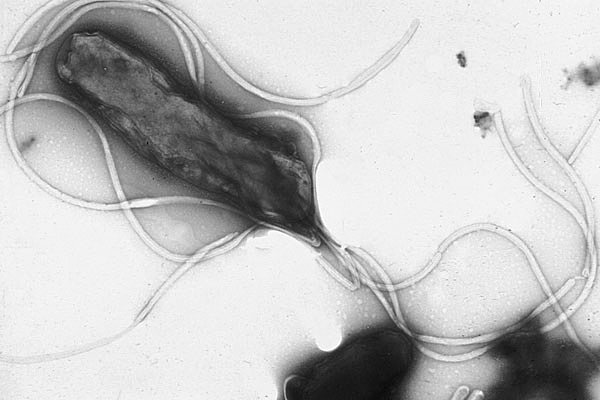
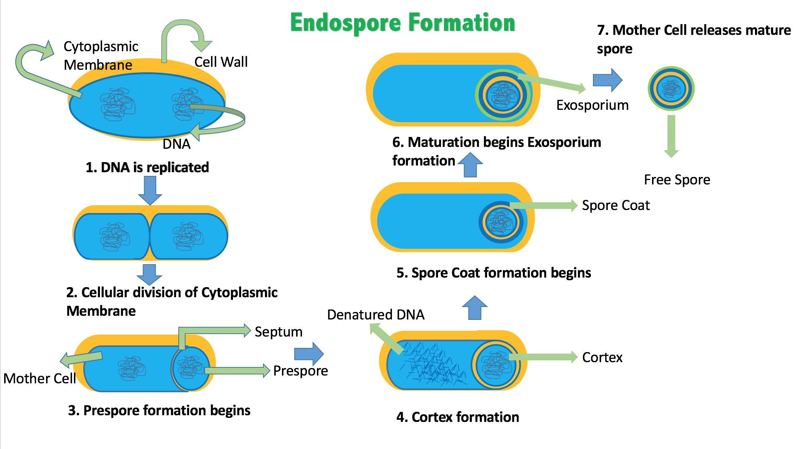

# Prokyrotic microrganisms

[Bacteria](https://en.wikipedia.org/wiki/Bacteria) (singular bacterium) and [Archaea](https://en.wikipedia.org/wiki/Archaea) (singular archaeon) constitute two domains of single-celled organisms. These microorganisms lack cell nuclei and are therefore prokaryotes. 

(ref:ecoli) [Scanning electron micrograph of Escherichia coli bacteria.](https://commons.wikimedia.org/wiki/File:EscherichiaColi_NIAID.jpg) 

(\#fig:semecoli)(ref:ecoli)

For much of the 20th century, prokaryotes were regarded as a single group of organisms and classified based on their biochemistry, morphology and metabolism. Microbiologists tried to classify microorganisms based on the structures of their cell walls, their shapes, and the substances they consume. In 1965, Emile Zuckerkandl and Linus Pauling instead proposed using the sequences of the genes in different prokaryotes to work out how they are related to each other. This phylogenetic approach is the main method used today.

Archaea – at that time only the methanogens were known – were first classified separately from bacteria in 1977 by Carl Woese and George E. Fox based on their ribosomal RNA (rRNA) genes. They called these groups the Urkingdoms of Archaebacteria and Eubacteria, though other researchers treated them as kingdoms or subkingdoms. Woese and Fox gave the first evidence for Archaebacteria as a separate "line of descent": 1. lack of peptidoglycan in their cell walls, 2. two unusual coenzymes, 3. results of 16S ribosomal RNA gene sequencing. To emphasize this difference, Woese, Otto Kandler and Mark Wheelis later proposed reclassifying organisms into three natural domains known as the three-domain system: the Eukarya, the Bacteria and the Archaea, in what is now known as "The Woesian Revolution".

(ref:archaea) [Halobacterium sp. strain NRC-1, each cell about 5 μm long](https://commons.wikimedia.org/wiki/File:Halobacteria.jpg) 

(\#fig:haloarchaea)(ref:archaea)

A [virus](https://en.wikipedia.org/wiki/Virus) is a submicroscopic infectious agent that replicates only inside the living cells of an organism. Viruses infect all types of life forms, from animals and plants to microorganisms, including bacteria and archaea. Since Dmitri Ivanovsky's 1892 article describing a non-bacterial pathogen infecting tobacco plants, and the discovery of the tobacco mosaic virus by Martinus Beijerinck in 1898, more than 6,000 virus species have been described in detail, of the millions of types of viruses in the environment. Viruses are found in almost every ecosystem on Earth and are the most numerous type of biological entity. The study of viruses is known as virology, a subspeciality of microbiology.

(ref:sarscov) [Severe acute respiratory syndrome coronavirus 2 (SARS-CoV-2) is the strain of coronavirus that causes coronavirus disease 2019 (COVID-19), the respiratory illness responsible for the COVID-19 pandemic.](https://commons.wikimedia.org/wiki/File:SARS-CoV-2_without_background.png) 

(\#fig:sarscovi2)(ref:sarscov)

When infected, a host cell is forced to rapidly produce thousands of identical copies of the original virus. When not inside an infected cell or in the process of infecting a cell, viruses exist in the form of independent particles, or virions, consisting of: (i) the genetic material, i.e. long molecules of DNA or RNA that encode the structure of the proteins by which the virus acts; (ii) a protein coat, the capsid, which surrounds and protects the genetic material; and in some cases (iii) an outside envelope of lipids. The shapes of these virus particles range from simple helical and icosahedral forms to more complex structures. Most virus species have virions too small to be seen with an optical microscope as they are one hundredth the size of most bacteria.

The origins of viruses in the evolutionary history of life are unclear: some may have evolved from plasmids—pieces of DNA that can move between cells—while others may have evolved from bacteria. In evolution, viruses are an important means of horizontal gene transfer, which increases genetic diversity in a way analogous to sexual reproduction. Viruses are considered by some biologists to be a life form, because they carry genetic material, reproduce, and evolve through natural selection, although they lack the key characteristics such as cell structure that are generally considered necessary criteria for life. Because they possess some but not all such qualities, viruses have been described as "organisms at the edge of life", and as self-replicators.

## Bacteria

Bacteria (plural of the New Latin bacterium, which is the latinisation of the Greek βακτήριον (bakterion), the diminutive of βακτηρία (bakteria), meaning "staff, cane", because the first ones to be discovered were rod-shaped) constitute a large domain of prokaryotic microorganisms. Typically a few micrometres in length, bacteria have a number of shapes, ranging from spheres to rods and spirals. Bacteria were among the first life forms to appear on Earth, and are present in most of its habitats. Bacteria inhabit soil, water, acidic hot springs, radioactive waste, and the deep biosphere of the earth's crust. Bacteria also live in symbiotic and parasitic relationships with plants and animals. Most bacteria have not been characterised, and only about 27 percent of the bacterial phyla have species that can be grown in the laboratory. The study of bacteria is known as bacteriology, a branch of microbiology.

Nearly all animal life is dependent on bacteria for survival as only bacteria and some archaea possess the genes and enzymes necessary to synthesize vitamin B12, also known as cobalamin, and provide it through the food chain. Vitamin B12 is a water-soluble vitamin that is involved in the metabolism of every cell of the human body. It is a cofactor in DNA synthesis, and in both fatty acid and amino acid metabolism. It is particularly important in the normal functioning of the nervous system via its role in the synthesis of myelin.

There are typically 40 million bacterial cells in a gram of soil and a million bacterial cells in a millilitre of fresh water. There are approximately 5×1030 bacteria on Earth, forming a biomass which exceeds that of all plants and animals. Bacteria are vital in many stages of the nutrient cycle by recycling nutrients such as the fixation of nitrogen from the atmosphere. The nutrient cycle includes the decomposition of dead bodies; bacteria are responsible for the putrefaction stage in this process. In the biological communities surrounding hydrothermal vents and cold seeps, extremophile bacteria provide the nutrients needed to sustain life by converting dissolved compounds, such as hydrogen sulphide and methane, to energy.

In humans and most animals the largest number of bacteria exist in the gut, and a large number on the skin. The vast majority of the bacteria in the body are rendered harmless by the protective effects of the immune system, though many are beneficial, particularly in the gut flora. However, several species of bacteria are pathogenic and cause infectious diseases, including cholera, syphilis, anthrax, leprosy, and bubonic plague. The most common fatal bacterial diseases are respiratory infections. Tuberculosis alone kills about 2 million people per year, mostly in sub-Saharan Africa. Antibiotics are used to treat bacterial infections and are also used in farming, making antibiotic resistance a growing problem. In industry, bacteria are important in sewage treatment and the breakdown of oil spills, the production of cheese and yogurt through fermentation, the recovery of gold, palladium, copper and other metals in the mining sector, as well as in biotechnology, and the manufacture of antibiotics and other chemicals.

Once regarded as plants constituting the class Schizomycetes ("fission fungi"), bacteria are now classified as prokaryotes. Unlike cells of animals and other eukaryotes, bacterial cells do not contain a nucleus and rarely harbour membrane-bound organelles. Although the term bacteria traditionally included all prokaryotes, the scientific classification changed after the discovery in the 1990s that prokaryotes consist of two very different groups of organisms that evolved from an ancient common ancestor. These evolutionary domains are called Bacteria and Archaea.

The ancestors of modern bacteria were unicellular microorganisms that were the first forms of life to appear on Earth, about 4 billion years ago. For about 3 billion years, most organisms were microscopic, and bacteria and archaea were the dominant forms of life. Although bacterial fossils exist, such as stromatolites, their lack of distinctive morphology prevents them from being used to examine the history of bacterial evolution, or to date the time of origin of a particular bacterial species. However, gene sequences can be used to reconstruct the bacterial phylogeny, and these studies indicate that bacteria diverged first from the archaeal/eukaryotic lineage. The most recent common ancestor of bacteria and archaea was probably a hyperthermophile that lived about 2.5 billion–3.2 billion years ago. The earliest life on land may have been bacteria some 3.22 billion years ago.

Bacteria were also involved in the second great evolutionary divergence, that of the archaea and eukaryotes. Here, eukaryotes resulted from the entering of ancient bacteria into endosymbiotic associations with the ancestors of eukaryotic cells, which were themselves possibly related to the Archaea. This involved the engulfment by proto-eukaryotic cells of alphaproteobacterial symbionts to form either mitochondria or hydrogenosomes, which are still found in all known Eukarya (sometimes in highly reduced form, e.g. in ancient "amitochondrial" protozoa). Later, some eukaryotes that already contained mitochondria also engulfed cyanobacteria-like organisms, leading to the formation of chloroplasts in algae and plants. This is known as primary endosymbiosis.

Bacteria display a wide diversity of shapes and sizes, called morphologies. Bacterial cells are about one-tenth the size of eukaryotic cells and are typically 0.5–5.0 micrometres in length. However, a few species are visible to the unaided eye—for example, Thiomargarita namibiensis is up to half a millimetre long and Epulopiscium fishelsoni reaches 0.7 mm. Among the smallest bacteria are members of the genus Mycoplasma, which measure only 0.3 micrometres, as small as the largest viruses. Some bacteria may be even smaller, but these ultramicrobacteria are not well-studied.

(ref:bacshape) [Bacteria display various cell morphologies and arrangements](https://commons.wikimedia.org/wiki/File:Bacterial_morphology_diagram.svg) 

(\#fig:bacteriashape)(ref:bacshape)

Most bacterial species are either spherical, called cocci (singular coccus, from Greek kókkos, grain, seed), or rod-shaped, called bacilli (sing. bacillus, from Latin baculus, stick). Some bacteria, called vibrio, are shaped like slightly curved rods or comma-shaped; others can be spiral-shaped, called spirilla, or tightly coiled, called spirochaetes. A small number of other unusual shapes have been described, such as star-shaped bacteria. This wide variety of shapes is determined by the bacterial cell wall and cytoskeleton, and is important because it can influence the ability of bacteria to acquire nutrients, attach to surfaces, swim through liquids and escape predators.

Many bacterial species exist simply as single cells, others associate in characteristic patterns: Neisseria form diploids (pairs), Streptococcus form chains, and Staphylococcus group together in "bunch of grapes" clusters. Bacteria can also group to form larger multicellular structures, such as the elongated filaments of Actinobacteria, the aggregates of Myxobacteria, and the complex hyphae of Streptomyces. These multicellular structures are often only seen in certain conditions. For example, when starved of amino acids, Myxobacteria detect surrounding cells in a process known as quorum sensing, migrate towards each other, and aggregate to form fruiting bodies up to 500 micrometres long and containing approximately 100,000 bacterial cells. In these fruiting bodies, the bacteria perform separate tasks; for example, about one in ten cells migrate to the top of a fruiting body and differentiate into a specialised dormant state called a myxospore, which is more resistant to drying and other adverse environmental conditions.

Bacteria often attach to surfaces and form dense aggregations called biofilms, and larger formations known as microbial mats. These biofilms and mats can range from a few micrometres in thickness to up to half a metre in depth, and may contain multiple species of bacteria, protists and archaea. Bacteria living in biofilms display a complex arrangement of cells and extracellular components, forming secondary structures, such as microcolonies, through which there are networks of channels to enable better diffusion of nutrients. In natural environments, such as soil or the surfaces of plants, the majority of bacteria are bound to surfaces in biofilms. Biofilms are also important in medicine, as these structures are often present during chronic bacterial infections or in infections of implanted medical devices, and bacteria protected within biofilms are much harder to kill than individual isolated bacteria.

### Intracellular Structure

The bacterial cell is surrounded by a cell membrane, which is made primarily of phospholipids. This membrane encloses the contents of the cell and acts as a barrier to hold nutrients, proteins and other essential components of the cytoplasm within the cell. Unlike eukaryotic cells, bacteria usually lack large membrane-bound structures in their cytoplasm such as a nucleus, mitochondria, chloroplasts and the other organelles present in eukaryotic cells. However, some bacteria have protein-bound organelles in the cytoplasm which compartmentalize aspects of bacterial metabolism, such as the carboxysome. Additionally, bacteria have a multi-component cytoskeleton to control the localisation of proteins and nucleic acids within the cell, and to manage the process of cell division.

Many important biochemical reactions, such as energy generation, occur due to concentration gradients across membranes, creating a potential difference analogous to a battery. The general lack of internal membranes in bacteria means these reactions, such as electron transport, occur across the cell membrane between the cytoplasm and the outside of the cell or periplasm. However, in many photosynthetic bacteria the plasma membrane is highly folded and fills most of the cell with layers of light-gathering membrane. These light-gathering complexes may even form lipid-enclosed structures called chlorosomes in green sulfur bacteria.

Bacteria do not have a membrane-bound nucleus, and their genetic material is typically a single circular bacterial chromosome of DNA located in the cytoplasm in an irregularly shaped body called the nucleoid. The nucleoid contains the chromosome with its associated proteins and RNA. Like all other organisms, bacteria contain ribosomes for the production of proteins, but the structure of the bacterial ribosome is different from that of eukaryotes and Archaea.

Some bacteria produce intracellular nutrient storage granules, such as glycogen, polyphosphate, sulfur or polyhydroxyalkanoates. Bacteria such as the photosynthetic cyanobacteria, produce internal gas vacuoles, which they use to regulate their buoyancy, allowing them to move up or down into water layers with different light intensities and nutrient levels.

### Extracellular Structures

Around the outside of the cell membrane is the cell wall. Bacterial cell walls are made of peptidoglycan (also called murein), which is made from polysaccharide chains cross-linked by peptides containing D-amino acids. Bacterial cell walls are different from the cell walls of plants and fungi, which are made of cellulose and chitin, respectively. The cell wall of bacteria is also distinct from that of Archaea, which do not contain peptidoglycan. The cell wall is essential to the survival of many bacteria, and the antibiotic penicillin (produced by a fungus called Penicillium) is able to kill bacteria by inhibiting a step in the synthesis of peptidoglycan.

There are broadly speaking two different types of cell wall in bacteria, that classify bacteria into Gram-positive bacteria and Gram-negative bacteria. The names originate from the reaction of cells to the Gram stain, a long-standing test for the classification of bacterial species.

Gram-positive bacteria possess a thick cell wall containing many layers of peptidoglycan and teichoic acids. In contrast, Gram-negative bacteria have a relatively thin cell wall consisting of a few layers of peptidoglycan surrounded by a second lipid membrane containing lipopolysaccharides and lipoproteins. Most bacteria have the Gram-negative cell wall, and only the Firmicutes and Actinobacteria (previously known as the low G+C and high G+C Gram-positive bacteria, respectively) have the alternative Gram-positive arrangement. These differences in structure can produce differences in antibiotic susceptibility; for instance, vancomycin can kill only Gram-positive bacteria and is ineffective against Gram-negative pathogens, such as Haemophilus influenzae or Pseudomonas aeruginosa. Some bacteria have cell wall structures that are neither classically Gram-positive or Gram-negative. This includes clinically important bacteria such as Mycobacteria which have a thick peptidoglycan cell wall like a Gram-positive bacterium, but also a second outer layer of lipids.

In many bacteria, an S-layer of rigidly arrayed protein molecules covers the outside of the cell. This layer provides chemical and physical protection for the cell surface and can act as a macromolecular diffusion barrier. S-layers have diverse but mostly poorly understood functions, but are known to act as virulence factors in Campylobacter and contain surface enzymes in Bacillus stearothermophilus.

(ref:hpyl) [Helicobacter pylori electron micrograph](https://commons.wikimedia.org/wiki/File:EMpylori.jpg), showing multiple flagella on the cell surface

(\#fig:helicopylori)(ref:hpyl)

Flagella are rigid protein structures, about 20 nanometres in diameter and up to 20 micrometres in length, that are used for motility. Flagella are driven by the energy released by the transfer of ions down an electrochemical gradient across the cell membrane.

Fimbriae (sometimes called "attachment pili") are fine filaments of protein, usually 2–10 nanometres in diameter and up to several micrometres in length. They are distributed over the surface of the cell, and resemble fine hairs when seen under the electron microscope. Fimbriae are believed to be involved in attachment to solid surfaces or to other cells, and are essential for the virulence of some bacterial pathogens. Pili (sing. pilus) are cellular appendages, slightly larger than fimbriae, that can transfer genetic material between bacterial cells in a process called conjugation where they are called conjugation pili or sex pili (see bacterial genetics, below). They can also generate movement where they are called type IV pili.

Glycocalyx is produced by many bacteria to surround their cells, and varies in structural complexity: ranging from a disorganised slime layer of extracellular polymeric substances to a highly structured capsule. These structures can protect cells from engulfment by eukaryotic cells such as macrophages (part of the human immune system). They can also act as antigens and be involved in cell recognition, as well as aiding attachment to surfaces and the formation of biofilms.

The assembly of these extracellular structures is dependent on bacterial secretion systems. These transfer proteins from the cytoplasm into the periplasm or into the environment around the cell. Many types of secretion systems are known and these structures are often essential for the virulence of pathogens, so are intensively studied.

### Endospores

Certain genera of Gram-positive bacteria, such as Bacillus, Clostridium, Sporohalobacter, Anaerobacter, and Heliobacterium, can form highly resistant, dormant structures called endospores. Endospores develop within the cytoplasm of the cell; generally a single endospore develops in each cell. Each endospore contains a core of DNA and ribosomes surrounded by a cortex layer and protected by a multilayer rigid coat composed of peptidoglycan and a variety of proteins.

(ref:endosp) [A stained preparation of the cell Bacillus subtilis showing endospores as green and the vegetative cell as red.](https://commons.wikimedia.org/wiki/File:Bacillus_subtilis_Spore.jpg) 

(\#fig:endospore)(ref:endosp)

Endospores show no detectable metabolism and can survive extreme physical and chemical stresses, such as high levels of UV light, gamma radiation, detergents, disinfectants, heat, freezing, pressure, and desiccation. In this dormant state, these organisms may remain viable for millions of years, and endospores even allow bacteria to survive exposure to the vacuum and radiation in space, possibly bacteria could be distributed throughout the Universe by space dust, meteoroids, asteroids, comets, planetoids or via directed panspermia. Endospore-forming bacteria can also cause disease: for example, anthrax can be contracted by the inhalation of Bacillus anthracis endospores, and contamination of deep puncture wounds with Clostridium tetani endospores causes tetanus.

(ref:endospf) [Formation of an endospore through the process of sporulation.](https://commons.wikimedia.org/wiki/File:Endospore_Formation.png) 

(\#fig:endosporeform)(ref:endospf)

### Metabolism

Bacteria exhibit an extremely wide variety of metabolic types. The distribution of metabolic traits within a group of bacteria has traditionally been used to define their taxonomy, but these traits often do not correspond with modern genetic classifications. Bacterial metabolism is classified into nutritional groups on the basis of three major criteria: the source of energy, the electron donors used, and the source of carbon used for growth.

Bacteria either derive energy from light using photosynthesis (called phototrophy), or by breaking down chemical compounds using oxidation (called chemotrophy). Chemotrophs use chemical compounds as a source of energy by transferring electrons from a given electron donor to a terminal electron acceptor in a redox reaction. This reaction releases energy that can be used to drive metabolism. Chemotrophs are further divided by the types of compounds they use to transfer electrons. Bacteria that use inorganic compounds such as hydrogen, carbon monoxide, or ammonia as sources of electrons are called lithotrophs, while those that use organic compounds are called organotrophs. The compounds used to receive electrons are also used to classify bacteria: aerobic organisms use oxygen as the terminal electron acceptor, while anaerobic organisms use other compounds such as nitrate, sulfate, or carbon dioxide.

Many bacteria get their carbon from other organic carbon, called heterotrophy. Others such as cyanobacteria and some purple bacteria are autotrophic, meaning that they obtain cellular carbon by fixing carbon dioxide. In unusual circumstances, the gas methane can be used by methanotrophic bacteria as both a source of electrons and a substrate for carbon anabolism.

